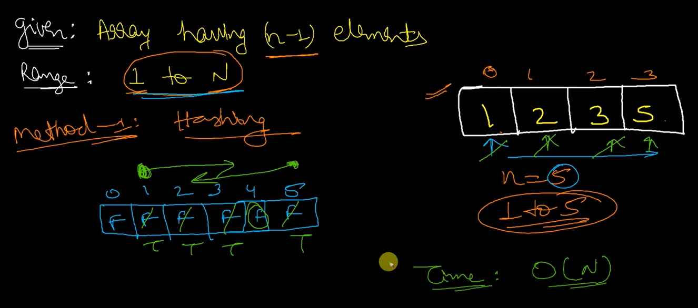
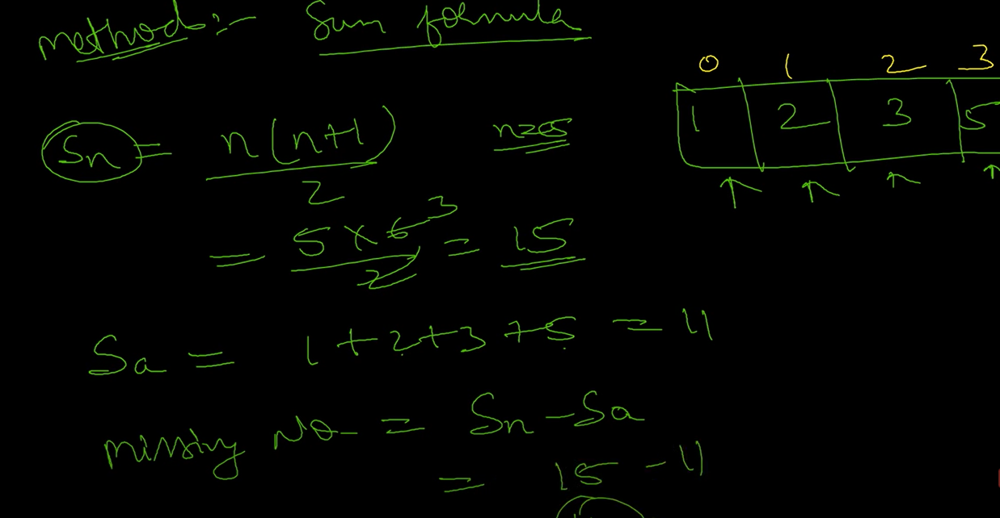

### Reverse an array 
Given an array A of size N, print the reverse of it.
```bash 
# Input:
1
4
1 2 3 4

# Output:
4 3 2 1
```
> ans. 
```bash 
# { Driver Code Starts
#Initial Template for javascript

'use strict';

process.stdin.resume();
process.stdin.setEncoding('utf-8');

let inputString = '';
let currentLine = 0;

process.stdin.on('data', inputStdin => {
    inputString += inputStdin;
});

process.stdin.on('end', _ => {
    inputString = inputString.trim().split('\n').map(string => {
        return string.trim();
    });
    
    main();
});

function readLine() {
    return inputString[currentLine++];
}

function printList(res,n){
    let s="";
    for(let i=0;i<n;i++){
        s+=res[i];
        s+=" ";
    }
    console.log(s);
}


function main() {
    # number of testcases
    let t = parseInt(readLine());
    let i = 0;
    for(;i<t;i++)
    {
        # number of inputs 
        let n = parseInt(readLine());
        let arr = new Array(n);
        let input_ar1 = readLine().split(' ').map(x=>parseInt(x));
        for(let i=0;i<n;i++){
            arr[i] = input_ar1[i];
        }
        let obj = new Solution();
        let res = obj.revInt(arr, t);

        # I'm logging the result in a single line by adding it to the string result using the join()
        let result = ""
        # for(let i=0; i<n; i++)
        # {
        
        # result = result + " " + res[i]
        result = res.join(' ');
        console.log(result)
        # }
        
    }
}# } Driver Code Ends


class Solution {
revInt(numbers, t) {
let reversedNumbers = [];
# we traverse the array backwards and push the elements to the new created array 
for(let i = numbers.length -1; i >= 0; i--) {
  reversedNumbers.push(numbers[i]);
}
# return the new array 
return reversedNumbers 
}
}      
```
> reverse of array using inbuilt functions 
```bash 
    <script>
        const revInt = (num) => {
            var ans = []
            console.log(typeof num) //number 
            # toString() - converts object  to string
            # split() - splits the string into an array of substrings
            # typeof myRevNum is an object 
            let myRevNum = num.toString().split("")
            # ['1','2','3'] - split("")
            # "123" - split()

            # reverse  the array 
            let rev = myRevNum.reverse()
            # ['3','2','1']

            # join method returns array as a string 
            let join = rev.join(" ")
            console.log('join',join)
        }
        revInt(1234)
    </script>

console:
number 
join 4 3 2 1
```
### peak element 
An element is called a peak element if its value is not smaller than the value of its adjacent elements(if they exists).

Given an array arr[] of size N, find the index of any one of its peak elements.
```bash 
# Input:
N = 3
arr[] = {1,2,3}

# Output: 2
Explanation: index 2 is 3.
It is the peak element as it is 
greater than its neighbour 2.
```
> ans
```bash 
# were running a binary search in this solution 
class Solution {
    peakElement(nums, n)
    {
        let left = 0 
        let right = nums.length - 1 

        while(left < right){
            let mid = Math.floor((left+right)/2) 
            #0+2/2=1

            #1  2  3 
            #2>3 nope 
            if(nums[mid] > nums[mid+1]){
                right = mid 
            } 
            else {
            # 2<3 yes 
                left = mid+1 
            }
        }
        # returning the value in left 
        return left 
    }
    # let arr = [1,2,3,1]
    # console.log(findPeakElement(arr, 4))   
}
```
> sort 
### Sort Array without inbuilt function 
```bash 
    <script>
        let array = [29, 3, 4, 80]
        # array[i]: 29, 3, 4, 80
        # array[j]: 3, 4, 80
        for(let i=0; i<array.length; i++){
            for(let j=i+1; j<array.length; j++){
                if(array[i]>array[j]){
                    temp = array[i]
                    array[i] = array[j]
                    array[j] = temp 
                }
            }
        }
        console.log(array)
    </script>

console:
Array(4)
0: 3
1: 4
2: 29
3: 80
length: 4
[[Prototype]]: Array(0)
```

### min max
```bash 
class Solution {
    getMinMax(arr, n)
    {
            var max = arr[0]
            var min = arr[0]
            var ans = []
            let ans = 0 
            
            #3 2 1 56 
            for(var i=0; i<n; i++){
                if(arr[i] > max){
                    max = arr[i]
                } 
    
                if(arr[i] < min){
                    min = arr[i]
                } 
            }
            
            ans = max - min 
            console.log(ans)
            return ans 

    }  
 
}
```
### Frequency 
Given a vector of N positive integers and an integer X. The task is to find the frequency of X in vector.
```bash 
# Input:
N = 5
vector = {1, 1, 1, 1, 1}
X = 1

# Output: 
5
Explanation: Frequency of 1 is 5.
```
> ans.
```bash
class Solution{
    findFrequency(arr, n, x){
        #code here
    var count=0;
      for(let i=0;i<arr.length;i++)
       {
           if(arr[i]==x)
           count++;
       }
       return count
    }
}
```
### k'th smallest element 
Given an array arr[] and an integer K where K is smaller than size of array, the task is to find the Kth smallest element in the given array. It is given that all array elements are distinct.
```bash 
# Input:
N = 6
arr[] = 7 10 4 3 20 15
K = 3

Output : 7

# Explanation :
3rd smallest element in the given 
array is 7.
```
> ans. 
```bash 
class Solution {
  kthSmallest(arr,l,r,k){
    #code here
      arr.sort((a,b) => a-b);
 
    # Return k'th element in the sorted array
    return arr[k - 1];
    # 2nd smallest element   index 1 
    # 3rd smallest element   index 2
    # 5th smallest element   index 4
  }
}
```
### Sort an array of 0's, 1's and 2's 
Given an array of size N containing only 0s, 1s, and 2s; sort the array in ascending order.
```bash 
# Input: 
N = 5
arr[]= {0 2 1 2 0}

# Output:
0 0 1 2 2
Explanation:
0s 1s and 2s are segregated 
into ascending order.
```
> ans.
```bash 
class Solution {
    sort012(a,arr_size)
    {
         
        let lo = 0;
        let hi = arr_size - 1;
        let mid = 0;
        let temp = 0;
        # while mid counter is less than the right counter 
        while (mid <= hi)
        {
            # when 0 encountered put it to the left of mid element 
            if(a[mid] == 0)
            {
                temp = a[lo];
                a[lo] = a[mid];
                a[mid] = temp;
                lo++;
                mid++;
            }
            # considering 1 as the middle element 
            else if(a[mid] == 1)
            {
                mid++;
            }
            # when 2 encountered put it to the right of mid element 
            else
            {
                temp = a[mid];
                a[mid] = a[hi];
                a[hi] = temp;
                hi--;
            }
             
        }
    }
}
```
### Sort 0 to left and 1 to the right 
> ans.
```bash 
/*Function to put all 0s on left and all 1s on right*/
function segregate0and1(arr, size)
{
    # Initialize left and right indexes 
    let left = 0, right = size-1;
 
    while (left < right)
    {
        # Increment left index while we see 0 at left 
        while (arr[left] == 0 && left < right)
            left++;
 
        # Decrement right index while we see 1 at right 
        while (arr[right] == 1 && left < right)
            right--;
 
        # If left is smaller than right then, there is a 1 at left and 0 at right. Exchange arr[left] and arr[right]
        if (left < right)
        {
            arr[left] = 0;
            arr[right] = 1;
            left++;
            right--;
        }
    }
}
 
/* Driver code */
let arr = [0, 1, 0, 1, 1, 1];
let i, arr_size = arr.length;
 
segregate0and1(arr, arr_size);
 
document.write("Array after segregation ");
for (i = 0; i < 6; i++)
    document.write(arr[i] + " ");
 
</script>
```
### Find missing number in an array 
Given an array of size N-1 such that it only contains distinct integers in the range of 1 to N. Find the missing element.
```bash 
Input:
N = 5
A[] = {1,2,3,5}
Output: 4
```
> ans. 
```bash 
arr=[]
---------------
1  |  2 | 3 | 5
---------------
# in this array 4 is not present, we need to find and return it 
# the length of this array = 4 
# then length of the array with the missing element included would be 5
```
> solution approaches:
1. Hashing 

- We create an array with all values set to false. 
- We iterate over the all the elements of arr[]
- When we find an element we set the boolean to true 
- we return the false boolean 

2. Sum formula 
- find the sum of the final array (arr[] + missing array) will be added through the formula, where n=5
- find the sum of all the elements in arr[]
- missing number = sum of final array - sum of the array 

```bash 
class Solution{
  MissingNumber(a, n){
    # calculating the sum of the final array 
    let n_elements_sum =Math.floor (n * (n + 1) / 2 );
    let sum = 0;
 
  for(let i = 0; i < n - 1; i++)
   # calculating the sum of the array 
    sum += a[i];
  # returning the resultant   
  return n_elements_sum-sum;
}
}
```


