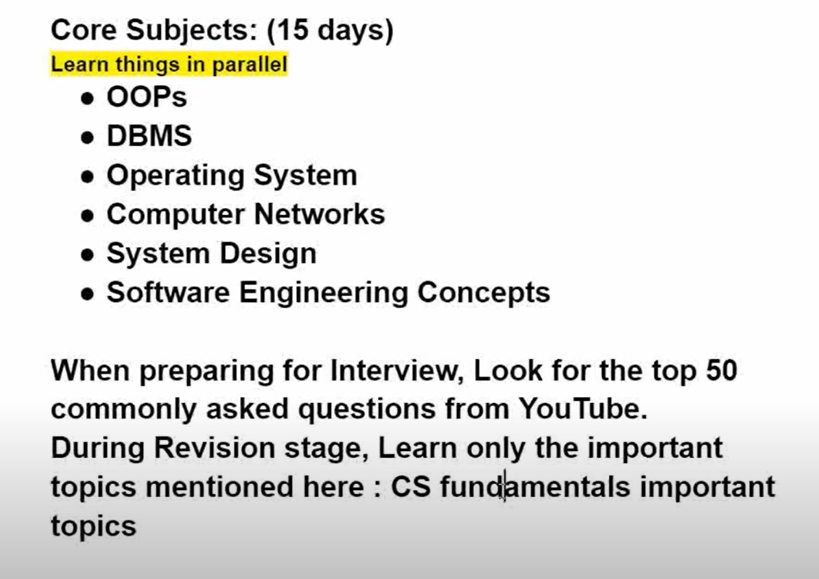

### How much DS you need to know for web dev interviews?
- have a really good base. be well versed with arrays, strings, linked lists 
- how you approach a problem is very important 
- geeksforgeeks preparation 

### DSA Roadmap 
Understand DS theory then solve problems on GFG / leetcode. 

> 120 days 
1. data structures (4 weeks)
- array and string (5)
- linked list (3)
- stack and queue (4)
- ***tree and bst*** (7) 
- priorty queue and heap (2)
- graph (7) (BFS / DFS / basic questions)

2. algorithm(4 weeks)
- sorting (3)
- searching (3)
- dynamic programming (8)
- recursion (3)
- backtracking (2)
- hashing (3)
- bit masking (2)
- divide and conquer (2)
- string algorithm (2)

3. core subjects (15 days)

- OOPS - shukla sir
- DBMS - gatesmasher
- OS - gatesmasher
- Computer networks
- system design 
- soft eng concepts 
(prepare from most asked important questions)


1. projects(1 month) 
- revise and understand architecture of projects 
- prepare interview qs about the tech stack 
- understand the project in and out 
```bash 
frontend and DS project 
```

> how to solve qs 
- 20-25 min try solve 
- watch soln 
- make notes of qs 
```bash 
# solutions in 3 stages
brute force 
optimized 
full optimized 
```
- read interview questions of major companies and shortlist 
- gfg topic wise practice question - most company tags solve first 
- pair programming 

> applying technique:
- apply more than required
- apply 2-3 months before

> Imp stuff 
- OOPS 
- DBMS good grasp 
- computer network 
- aptitude 
- project is must 

### Prep method 
1. DSA
- focus on most asked interview questions -DSA sheet strivers dsa sheet

2. love bhabhar 
- arrays
- string

3. sorting algos
4. recursion 

5. linked lists - usually asked 

6. aditya verma 
- stacks  
- binary search 
- heaps 
- queues 

7. anuj bhaiya 
- hashing 

8. striver bhaiya 
- graphs 
- trees

9. aditya verma 
- dyanamic programming 

- oops - Anuj bhaiya (interview bit OOPs interview qs refer)
- dbms and os - apna college / love bhabhar
- comp networks (interview bit qs)


### 💡Tips
- watch the video properly 
- write psuedo code and working in notes 
- code it 
- even if you have the algo try to code it 
- do DSA questions after your done with the particular topic 

`control your mind - take breaks - release stress`


