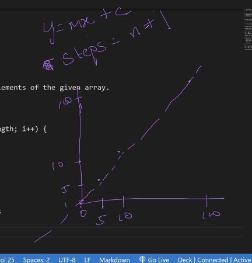
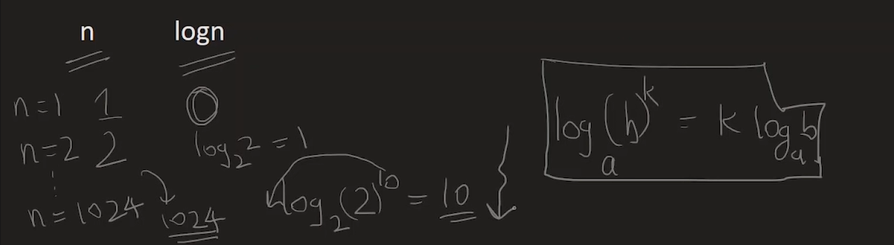
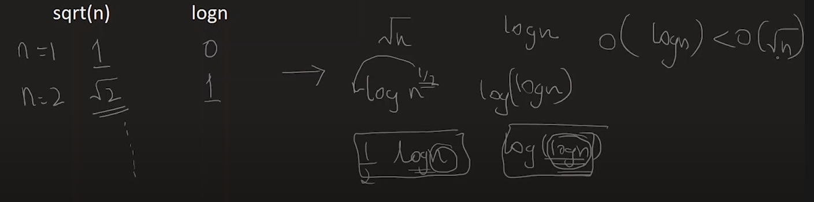

> interview - DSA round 
- intro of problem (10min)
- brainstorming of the solution (20-25min)
- discussion on complexity (5-10min)
- optimization (10-15min)

Which platform will interviewer ask to code in?
how much DS should we know to crack a good company
Do you recommend us to code in platforms like leetcode or should we just solve problems in vscode 

#### Time complexity 
Time Complexity is the study of the efficiency of algorithms. It tells us how much time is taken by an algorithm to process a given input.

**How many iterations it takes to complete the execution. Time calculated in number of steps required to achieve the output**

As the input size changes how would the runnning time change 
- linear 
- quadratic 
- cubic 

> Q. Return sum of 2 numbers 
```bash 
var sum = function(num1, num2){
    return num1 + num2
}
# Time complexity - 1 step needed to reach the output 
```

### Constant Time complexity 
> Q. Return the first element from the given array 
```bash 
function q1(arr){
    return arr[0]                   ✅1 step 
}

# constant time complexity 
# it doesnt matter how big your array / input size is, TC is a constant 
# if arr is 10 elements - when we return the first element, it can be achieved in one line, the time for acheiving the output remains the same, since the number of steps remains the same 
arr -> 10 -> 1 step 
arr -> 100 -> 1 step 
arr -> 1000 -> 1 step 

# TC: 0(1)
```
### Linear Time Complexity 
Time increases linearly based on the number of times the loop has run

> Q. Return sum of all elements of the given array. 
```bash 
function sum(arr){
    let sum = 0                      ✅1 instruction
    for(let i=0; i<arr.lemgth; i++){ ✅runs n times 
        sum = sum + arr[i]           
    }
    return sum 
}

# how many steps needed during execution (stuff inside the loop)
for example, if 
arr -> 5 -> 5times + 1 steps    #5/5=1
arr -> 10 -> 10times + 1 steps  #10/10=1
arr -> 100 -> 100 + 1 steps
arr -> n   -> n + 1 steps
              n^1 + n^0 
# were ignoring 1 step because we only consider highest power of n 
# TC -> O(n)
```

> psuedo code 
```bash 
for(let i=0; i<arr.length; i=i+2){
    sum = sum + arr[i]
}

arr = 10 -> 5 steps    #10/5
arr = 100 -> 50 steps  #100/50
#TC -> n/2 = 1/2 x n 
# ignore the 1/2 (the coefficient) and write 0(n)
```

> The relationship is linear

```bash 
y = mx + c
where 
x = n  #variable 
c = 1
```

#### More types of Time complexities:
> O(n+m)
```bash 
let a = 0 
for(let i=1; i<=n; i++){  ✅runs n times 
    a = a+1 
}
for(let j=1; j<=m; j++){  ✅runs m times 
    a = a+1
}
```
> O(nm)
```bash 
let a = 0 
for(let i=1; i<=n; i++){  ✅runs n times 
        for(let i=1; i<=m; i++){  ✅runs m times 
        a = a + rand()
    }
}
# since both for loops inside each other it runs nm times 
```
> O(nm) + n 
```bash 
let a = 0 
for(let i=1; i<=n; i++){  ✅runs n times 
        for(let i=1; i<=m; i++){  ✅runs m times 
        a = a + rand()
    }
}

for(let i=1; i<=n; i++){  ✅runs n times 
    a = a + rand()
}
```
> O(logn)
```bash 
let a = 0, i=n
while(i>=1){
    a = a+1
    i = i/2
}

# every time it runs n value is divided by 2
1. n
2. n -> n/2 
3. n/2 -> n/4 
.
.
# runs till i>=1

lets assume loop runs `k` times 
= n / 2^k  ≥ 1
= n  ≥ 2^k
= logn ≥ k
```
> O(nlogn)
```bash 
let count = 0 
for(let i=1; i<=n; i++){
    for(int j; j<n; `j=j+i`){
        count = count + 1
    }
}

# when arr=[1,2,3,4]
i         j       j<=4
1         1
          2
          3
          4  #no of terms - n 

2         1
          3 #no of terms - n/2 =4/2=2

3         1
          4  #no of terms - n/3 =4/3= 1.3

4         1
          4  #no of terms - 1


# 1 + .. + n/3 + n/2 + n 
# n [1/n + .. + 1/3 + 1/2 + 1]
# n [1 + 1/2 + 1/3 + ... + 1/n] 
# n (logn)
```
#### Analysis of Time complexity 
> Which T.C algorithm performs better (runs quicker)?
```bash 
n       O(n)     O(n^2)     O(n^3)
1       1         1         1
2       2         4         8
3       3         9         27 

# time taken to run in 0(n) is faster
# here is the comparison
O(n) < O(n^2) < O(n^3)
```
> Which T/C algorithm performs better?
```bash 
n      O(n)     O(logn)
1      1        0
2      2        log_2 ^2 = 1
.
.
1024   1024     log_2 2^2= 0

O(logn) << O(n)
# O(logn) is quicker 
```


> Which TC Algorithms performs better?
```bash 
n      sqrt(n)    logn
1       1         0
2       √2        1

O(logn) < sqrt(n)
```


#### Most to least efficent time complexity 
```bash 
# quicker to slower 
1 < logn < √n < n < nlogn < n^2 < n^3 .. < 2^n < 3^n < n^n
```
- upper bound (big O) -  max steps logic takes to execute (worst case) - most run time/slower
- average bound (big theta)
- lower bound (big omega) -min steps logic takes to execute (best case) - least run time/quicker

> While some resources emphasize on the relationship of time complexity with Asymptotic notation,
```bash 
1 < logn < √n < n #this is lower bound 
n #this is average bound 
n < nlogn < n^2 < n^3 .. < 2^n < 3^n < n^n #this is upper bound 
```
> it need'nt always be the case, best/worst/average case can be mapped to any Asymptotic notation.
----
### Asymptotic Notation 
> Notations are used to describe the time complexities
Its used to describe the execution time (running time) of an algorithm. Based on an input size n, how many steps will it take with respect to n. There are 3 different asymptotic notation.
- Big O notation - Big-O, commonly written as O, is an Asymptotic Notation for the worst case, or ceiling of growth for a given function. It provides us with an asymptotic upper bound for the growth rate of the runtime of an algorithm
- theta notation - Theta is both the upper and lower bound as n tends to infinity.
- Omega notation 

> Q. Get maximum number from an array 
```bash 
function maximumarr(arr){
    let max = 0                       ✅1 instruction 
    for(let i=0; i<arr.length; i++){  ✅runs n times  
        if(arr[i]> max){              
            max = arr[i]              
        }
    }
    return max 
}
```
### O (Big O)
```bash 
# there are 2 types of defination for big O 
# mathematical defination 
0(n) = O(n^2) = 0(n^3)

# ✅industry defination - order of 
This is the defination we need to emphasize on 
```
**Big 0 is the notation assigned to worst case scenario.**

> worst case scenario 
Maximum steps your logic will take to execute, running time is the most. 
```bash 
# when length of the array is 4     
arr -> 4    -> [0, 1, 2, 3]  - 4 steps #1 instruction + runs 3 times = 4steps 

i             max       arr[i]
0              0        0
1              0        1  #runs here       
2              1        2  #runs here 
3              2        3  #runs here 
               3
# assignment called 4 times 
✅Worst case scenario - 4times
# Maximum steps your logic will take to execute 
```
> In worst case, time complexity is directly proportional to n 

### Ω (Omega)
**Omega is the notation assigned to best case scenario.**
> Best case scenario 
Minimum steps your logic will take to execute, running time will be the least.
```bash 
when arr -> 4  -> [3, 2, 1, 0] - 2steps #1 instruction + run 1 time = 2 steps 
i             max        arr[i]
0             0           3   #runs here 
1             3           2   
2             3           1
3             3           0
✅Best case scenario - 2 steps (omega)
# Minimum steps your logic will take to execute 
```
> In Best case, Time compelexity is constant. 

### θ (Theta)
**Theta is the notation assigned to worst case scenario.**
The average steps your logic will take to execute. 

> Average case scenario, running time will be average. 
```bash 
avg time =  1+2+3+...+n / number of cases = n(n+1)/2 = n+1/2
# 4+1/2 = 5/2 = 2.5 = 3
# average time is directly proportional to n 
```
```bash 
when arr -> 4  -> [2, 3, 1, 0] - 2steps #1 instruction + run 2 times= 3steps 
i             max        arr[i]
0             0           2   #runs here 
1             2           3   #runs here 
2             3           1
3             3           0
✅Average case scenario - 2 steps (omega)
# Average steps your logic will take to execute 
```
> In average case, Time complexity is directly proportional to n 

-----
> Q. Write a program to find sum of all even numbers from an array. 
```bash 
function evenarray(arr){
    # no of steps need here 
    let sum = 0                      ✅1 step 
    for(let i=0; i<arr.length; i++){ ✅n iterations 
        if(arr[i] % 2 == 0){        
            sum= sum + arr[i]
            }
    }
    return sum 
}

arr -> 5 -> [2, 4, 6, 8, 2] -> 6steps #1step + 5iterations 
arr is n size but all are even numbers -> n+1 
worst case -> O(n)
# it iterates over the entire if condition

arr -> 5 -> [1, 3, 5, 7, 9] -> 1step #1step 
arr is n size but all are odd numbers -> 1 step 
Best case -> O(1)
# it doesnt even enter the for loop 
```
### Calculate Time complexity for these code snippets 
> Q1. 
```bash 
for(let i=0; i<n; i++){
    # statement 
}

O(n)
```
> Q2. 
```bash 
for(let i=n; i<0; i--){
    # statement 
}

O(n)
```
> Q3. 
```bash 
for(let i=1; i<n; i=i+2){
    # steps = n/2
}

O(n)
```
> Q4. 
```bash 
for(let i=0; i<n; i++){ #n times
    for(let j=0; j<n; i++){  #n times
    
}
}

O(n^2)
```
> Q5. 
```bash 
for(let i=0; i<n; i++){ #n times
    for(let j=0; j<i; i++){  #n times
    
}
}

i      j    j<i
0      0    ❎
1      0    ✅   #executed 1 times
       1    ❎
2      0    ✅   #executed 2 times
       1    ✅
       2    ❎
3      0    ✅   #executed 3 times
       1    ✅
       2    ✅
       3    ❎
# when its n its going to execute n times 

Total number of times executed:
1+2+3+...+n = n(n+1)/2 = n^2+1/2 -> O(n^2)
```
> Q5. 
```bash 
let p = 0 
for(let i=1; p<=n; i++){ #n times
    p = p+i 
}

i    p 
1    0+1=1
2    1+2=3
3    1+2+3=6
4    1+2+3+4=10
.
.
k    1+2+3+...+k (same as k(k+1)/2) #executing k times 
# when p>n its stopping the execution 

p        > n 
k(k+1)/2 > n
k^2      > n    #approximately k^2 
k        > √n
# executing for √n times -> O(√n)
```
> Q6. 
```bash 
for(let i=1; `i<n`; i=i*2){
    # statement 
}

i      i*2
1      1*2=2
2      2*2=4 (2^2)
3      3*2=6 (2^3)
.
.
k      2^k #updated value of i is 2^k
# terminate when i>=n 
when i   >= n 
     2^k >= n 
     2^k =  n 
     l   =  logn base 2
 
TC: O(log n base 2)
Typically textbooks and academic papers are implying log_2 n  (log base to n) when they say log n, this typically means when we write logn its same as log_2 n. 
```
> Q7. 
```bash 
for(let i=1; `i<=n`; i++){
    # statement 
}

# if n is some value say k 
i   n 
1
2
.
.
k   #executed k times 

TC: O(n)
```
> Q8. 
```bash 
for(let i=0; i*i < n; i++){
    # statement 
}

# stop execution when i*i>=n 
i*i >= n 
i^2 =  n 
i = √n 
```
> Q9. 
```bash 
for(let i=0; i < n; i++){ ✅executes n times 
    # statement 
}
for(let j=0; j < n; i++){ ✅executes n times 
    # statement 
}

execution: n+n = 2n 
TC: O(n)
```
> Q10. 
```bash 
for(let i=1; i < n; i=i*2){ ✅log_2 n which is same as logn 
    # statement 
    p++
}
for(let j=1; j < p; j=j*2){ ✅log_2 p which is same as logp
    # statement  
}

TC: O(log logn)
```
> Q11. 
```bash 
for(let i=0; i < n; i++){      ✅n times 
    for(let j=1; j <n; j=j*2){ ✅log_2 n which is same as logn + it runs n times 
        # statement 
    }
}

TC: n * n(logn) = O(n logn)
```
> Q12. 
```bash 
function func1(int array[], int length)
{
    let sum=0;
    let product =1;       ✅constant 
    for (let  i = 0; i <length; i++)
    {
        sum+=array[i];    ✅runs n times 
    }
 
    for (let i = 0; i < length; i++)
    {
        product*=array[i]; ✅runs n times 
    }
    return array[i]
}

TC: O(n)
```
> Q13. 
```bash 
function func(int n)
{
    let sum=0;
    let product =1;
    for (let i = 0; i <n; i++)      #runs n times 
    {
        for (let j = 0; j < n; j++) #runs n times 
        {
            console.log(i,j);
        }
    }
}

TC: O(n^2)
```

```
### 💡 Tips for calculating time complexity 
- Break problem into fragments 
- Ignore the constant and variable content inside the for loop 
```bash 
let k =0                ✅runs in constant time say k1 
# note that nothing in the for loop is related to n 
for(let i=0; i<n; i++){ ✅runs n times 
   k=i                  ✅run k^2 times 
   k++
   x=y+1
}

TC: k^2 n + k_1 -> O(n) #Tn = kn 
# variable part x n + constant part 
# ignore the variable and constant part because when n is really high value these 2 values will be insignificant 
```
- both the `for` loop and constant `a` are not affected directly by each other, thats why its okay to ignore the constant and variable part
```bash 
let a = 0   #constant part 
for(let i=1; i<=n; i++){
    a = a+1 #variable part 
}
# when n-> 2 ; a=1
# when n-> 3 ; a=1
```
- this is the time complexity for different for loops 
```bash 
loop                         TC 
for(let i=0; i < n; i++)     O(n)
for(let i=0; i < n; i=i+2)   O(n) #n/2 same as n
for(let i=n; i > 1; i--)     O(n)
for(let i=n; i > 1; i=i/2)   O(log_2 n)

for(let i=1; i < n; i=i*2)   O(log_2 n)
for(let i=1; i < n; i=i*3)   O(log_3 n)
```
- Program should have minimum TC and SP for it to be efficient. 
- if the loops are inside one another then multiply, if loops are adjacent to each other then add. 

> How to identify a better algorithm?
For bigger input, it runs for small amount of time and takes less space 

### Asymptotic Notation 
mathematical way of representing time complexity. 


