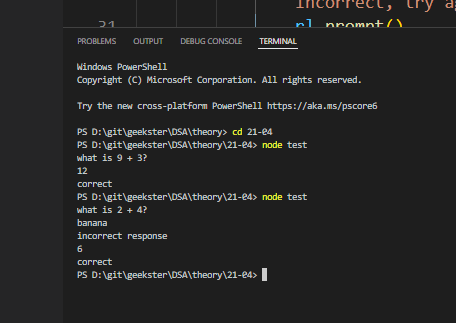

1. Q. What are the run time environments for JS?
Node.js® is a JavaScript runtime built on Chrome's V8 JavaScript engine.

2. Q. what is an alternative to Node.js 
Deno.js created by the person who created Node.js
Deno.js supports typescipt, node.js doesnt support. 
Deno.js is better than Node.js 

3. Q. How to take inputs in console in JS 
readline allows us to get user input from console, the same way cin is used for cpp and int(input) is used in python. 

### An intro to readline module 
1. run `npm install` in the directory your going to be using this, since it needs the `package.json` file to execute
2. add this snippet to your JS file 
> test.js 
```bash 
# import readline 
const readline = require('readline')

# create instance of readline interface 
const rl = readline.createInterface({input : process.stdin, 
                          output: process.stdout})
# process - global object 

# return random number between 1 and 10 
let num1 = Math.floor((Math.random() * 10) + 1)
let num2 = Math.floor((Math.random() * 10) + 1)
let answer = num1 + num2 

rl.question(`what is ${num1} + ${num2}?`, (userInput)=> {
    console.log(userInput)
})
```
3. Type `node test.js` in the root of the directory your testing this for


### Spiral matrix traversal 
```bash 
# input 
matrix = [[1,2,3,4,5], [16, 17, 18, 19, 6], [15, 24, 25, 20, 7], [14, 23, 22, 21, 8], [13, 12, 11, 10, 9]]
```
> Q. Print a spiral matrix of size n x n 
```bash 
# n x m matrix
# clockwise 
1  2   3   4   5
16 17  18  19  6
15 24  25  20  7
14 23  22   21 8
13  12  11  10 9
```
Lets discuss what approach we can solve this with
> 1. first approach: Algorithm 
```bash 
# taking 4 pointers 
top = 0 
down = n-1 
left = 0
right = n-1

# 0 means we move from lhs -> rhs 
# 1 means we move from top -> bottom
# 2 means we move from rhs -> lhs 
# 3 means we move from bottom -> top 

# if we want to move from left to right 
if(dir == 0) {
    for(let i=left; i<right; i++) {
        (a[top][i])
    }
    # now top will point to row 1
    top= top + 1
} 
# when we move from top -> bottom
else if(dir==1) {
    for(let i=top; i<down; i++){
        (a[i][right])
    }
    # move right pointer to left 
    right = right - 1
}
else if(dir==2){
    for(let i=right; i<left; i++){
        (a[down][i])
    }
    # move down pointer to up 
    down = down - 1
}
else if(dir==3){
    for(let i=down; i<top; i++){
        print(a[i][left])
    }
    left = left + 1
}

dir = (dir+1) % 4
# intiially value of dir = 0 
# at every iteration it increases
# when dir+1=4 then 4%4=0 then it moves back to the first position  

# the problem with this approach is the direction pointer 
# a problem with logic 
# time complexity is very high 
```
> 2. Second approach - no need to keep a count of the dir pointer because were anyways denoting the direction the pointer has to move in through `top / bottom / left / right`
```bash 
   <script>
const matrix = [
    [0, 1, 2, 3],
    [11, 12, 13, 4],
    [10, 15, 14, 5],
    [9, 8, 7, 6],
  ];

const spiralOrder = matrix => {
    const result = [];
  
    # these are the count of row and column 
    const rowCount = matrix.length;
    const columnCount = matrix[0].length;

    let top = 0;
    let bottom = rowCount - 1;
    let left = 0;
    let right = columnCount - 1;
  
    # for top and bottom were taking a different loop variable 
    # for left and right were taking a different loop variable 
    while (left<=right && top<=bottom) {
       # lhs -> rhs 
      for (let column = left; column <= right; column++) {
        # top is constant 
        # column is dyanamic 
        result.push(matrix[top][column]);
      }
    #increement top because we want it to point to the next row 
      top++;
  
      # top -> bottom
      for (let row = top; row <= bottom; row++) {
        # right is constant 
        # row is dyanamic 
        result.push(matrix[row][right]);
      }
    #move right pointer to the lhs 
      right--;
  
      # right -> left
      if (bottom >= top) {
        for (let column = right; column >= left; column--) {
        # bottom is constant 
        # column is dyanamic 
          result.push(matrix[bottom][column]);
        }
      }
    #move bottom pointer upwords which means we reduce it by 1 
      bottom--;
  
      # bottom -> top 
      if (right >= left) {
        for (let row = bottom; row >= top; row--) {
        # left is constant 
        # row is dyanamic 
          result.push(matrix[row][left]);
        }
      }
    #move left pointer to the rhs 
      left++;
    }
  
    return result;
  };

  console.log(spiralOrder(matrix))
</script>
```
#### Inverse Spiral 
```bash 
17  18  19  20  21 
16  5   6   7   22
15  4   1   8   23
14  3   2   9   24 
13  12  11  10  25
```


