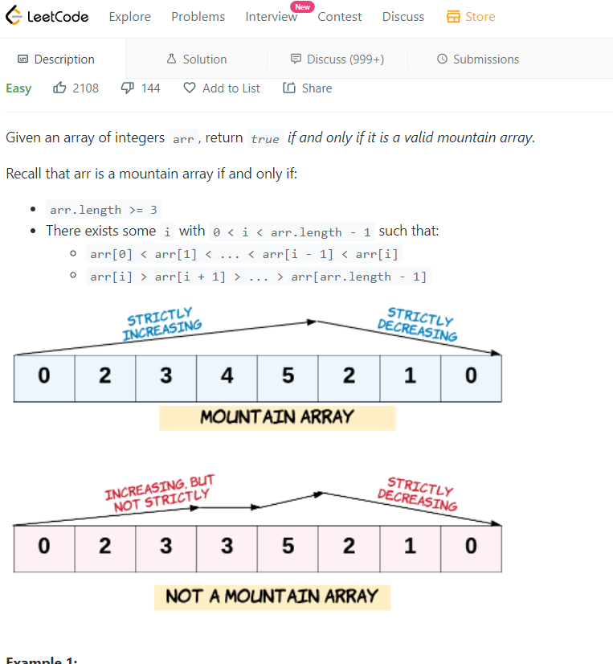

1. We have an array find the index of the given element for 
- first occurance
- last occurence 
<!-- sorted array -->
```bash 
[2, 4, 10, 10, 10, 18, 20]
# user enters 10
# first occurance of 10 is at index 2
# last occurance of 10 is at index 4 
```
> ans:
```bash 
# trying through binary search 
lets assume first elem in array is start and last is end
then find mid 

if data[mid]> mid then elem will be on rhs on array 
if data[mid]< mid then elem will be on lhs on array 
when we find the mid element = data 

we also search on both lhs and rhs of the mid data we find 
we create a result variable where we'll increement index of the value were trying to search everytime we find data = mid[elem] 
```
> first occurance 
```bash 
# finding first occurance of 10 
let ele = 10 
let arr = [1, 2, 10, 10, 10]

let start = 0
let end = n-1
let res = -1 #in case we didnt find the element were searching for 
# res will be updated with the index of the elem were searching the occurance for 

while(start <= end){
    # first index + last index / 2
    let mid = start + Math.floor((start - end) / 2);

    if(ele = arr[mid]){
        # res contains the first occurance we found till now 
        res = mid
        # search for the element on the lhs of the array 
        end = mid - 1
    }
    else if(ele < arr[mid]){
        # then the data would be found on the lhs of the array 
        end = mid - 1
    }
    else {
        # when ele > arr[mid]
        # data found on rhs of array 
        start = mid + 1
    }
    return res
}

```
> last occurance 
```bash 
# finding last occurance of 10 
let ele = 10 
let arr = [1, 2, 10, 10, 10]

let start = 0
let end = n-1
let res = -1 #in case we didnt find the element were searching for 
# res will be updated with the index of the elem were searching the occurance for 

while(start <= end){
     let mid = start + Math.floor((start - end) / 2);

    if(ele = arr[mid]){
        # res contains the first occurance we found till now 
        res = mid
        # search for the element on the rhs of the array 
        start = mid + 1
    }
    else if(ele < arr[mid]){
        # then the data would be found on the lhs of the array 
        end = mid - 1
    }
    else {
        # when ele > arr[mid]
        # data found on rhs of array 
        start = mid + 1
    }
    return res
}

```
> 💡Tip: use python discord chat to visualize the solutions 
<!--for first occurance:
     res = mid 
     end = mid-1
     
    for last occurance 
     res = mid 
     start = mid + 1 -->

> first and last occurance 
```bash 
function first(arr,start,end,x,n)
{
    if (start <= end) {
        let mid = start + Math.floor((end - start) / 2);

        # if we find the middle element and 
        if ((mid == 0 || x > arr[mid - 1]) && arr[mid] == x)
            return mid;
        else if (x > arr[mid])
            #  start, mid, end 
            return first(arr, (mid + 1), end, x, n);
        else
            return first(arr, start, (mid - 1), x, n);
    }
    return -1;
}
 
/* if x is present in arr then returns the index of
   LAST occurrence of x in arr[0..n-1], otherwise
   returns -1 */
function last(arr, start, end, x, n)
{
    if (end >= start) {
        let mid = start + Math.floor((end - start) / 2);

        if ((mid == n - 1 || x < arr[mid + 1]) && arr[mid] == x)
            return mid;

        # if x<arr[mid] then element must be present on lhs of array 
        else if (x < arr[mid])
            return last(arr, start, (mid - 1), x, n);
        else
        # if x>arr[mid] then element must be present on rhs of array 
            return last(arr, (mid + 1), end, x, n);
    }
    return -1;
}

```
- first and last occurance for unsorted array 
```bash 
function array1(arr, search_key) {
  let locations = [];
# traverse over the array and try to find the element we want to find the occurance for 
  for(let i = 0; i < arr.length; i++) {
    if(arr[i] == search_key) {
      #push the index of the array found inside the array    
      locations.push(i);
    }
  }
  console.log(locations);
  # traverse from 0 -> n-1 in locations array and return all the indexes found 
  return [locations[0], locations[locations.length - 1]];
}

#TC -> O(n)

# const ip1 = [4, 5, 2, 1, 2, 8, 7, 3, 2, 9, 11];
# const ip2 = 2;
# const op = [2, 8] 
# 2 - first index position of 2 
# 8 - second index position of 8 
```
> Given an array tell the difference between max element and min of that array 
```bash
    <script>
        function fn(arr){
            var max = arr[0]
            var min = arr[0]
            let ans = 0 
            
            #3 2 1 56 
            for(var i=0; i<n; i++){
                if(arr[i] > max){
                    max = arr[i]
                } 
    
                if(arr[i] < min){
                    min = arr[i]
                } 
            }
            
            ans = max - min 
            console.log(ans)
            return ans 
        }
    </script> 
```
> Write a program to calculate peak elements in an array 
```bash 
    peakElement(nums, n)
    {
        let left = 0 
        let right = nums.length - 1 
        let count = 0 #initally

        while(left < right){
            let mid = Math.floor((left+right)/2) 
            #0+2/2=1

            #1  2  3 
            #2>3 nope 
            if(nums[mid] > nums[mid+1]){
                right = mid 
            } 
            else {
            # 2<3 yes 
                left = mid+1 
            }
        }
        # returning the value in left 
        # return left 
        return count

    }
    # let arr = [1,2,3,1]
    # console.log(findPeakElement(arr, 4))   
}
```
> another approach 
```bash 
let count = 0 
for(let i = 0; i<arr.length; i++){
    # when we have only one element in the array 
    # then  thats the peak element 
    if(arr.length == 1){
        return 0
    }
    if(i == 0){
        # if first element is the greatest then thats the peak element 
        if(arr[i+1]>arr[i]){
            count++
        }
    }
    # if we reached last element 
    else if(i== arr.length - 1){
        # and its larger than its lhs element then its the largest 
        if(arr[i-1] < arr[i]){
            count++
        }
    } else {
        # if both adjacent elements are less than arr[i]
        if(arr[i-1] <arr[i] && arr[i+1] < arr[i]) {
           count++
        }
    }
}
return count 
```
### Mountain Array 
Given an array of integers arr, return true if and only if it is a valid mountain array.

> ans. 
```bash 
var validMountainArray = function(arr) {
      const n = arr.length;
    # if length of array is less than 3 then return false 
    # since in the condtions its given arr.length >= 3
    if (n < 3) return false;
    
    # were going to flip the pivot boolean value to true when the right conditions for mountain array satisfies 
    let pivot = false;
    
    # were running the loop from first index to last index 
    for (let i = 1; i < arr.length - 1; i++) {
        const curr = arr[i];
        const prev = arr[i - 1];
        const next = arr[i + 1];
        
        # if currElem is greater than both previous and next element 
        if (curr > prev && curr > next) {
            # then return true 
            pivot = true;
        }
        # the sequence must be less to high then high to less
        # to satisfy that condition we need to ensure that elements to lhs of the current element cannot be greater than curr elem
        # and elements to the right of the current element cannot be greater than the current element 
        else if (prev >= curr && next >= curr) {
            return false;
        }
    }
    
    return pivot;
};
```


