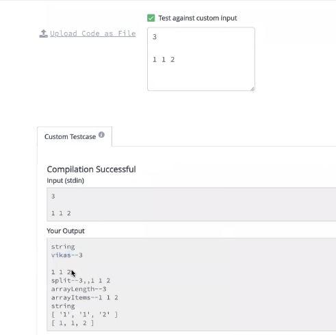

JS code runs inside the engine present inside browser, not on a compiler. 

> Scripting language doesnt need a compiler, it needs an engine/ server to be run 
```bash
for eg: PHP needs engine like apache server, tomcat server to run 

similarly JS runs on JS engine, every browser has its own engine. 
Chrome engine was replicated on a desktop environment by Node.JS

Even to run a react app, we do npm start, which runs our app on the server
```
## Node.js 
#### History:
1. JS - client side language 
- Dec 1995 -> JS launched - for web browser only - could only be used as a client side scripting language 
```bash
Browser (contains JS engine which contains intrepretor) which helps convert JS to machine code.
```
- first JS engine releases was `spider monkey` used inside their own browser `netscape navigator`
- then other browsers started releasing their JS engine - IE introduced `chakra`
- CHROME learnt from other JSengine and introduced `V8 engine` 
- JS can be run on browsers and websites 

1. Node JS works on server - its not a language, its a run time environment 
- instead of letting JS run on the browser inside JS engine, they wanted to simulate this experience, except they wanted JS to be able to run on the machine (not on the browser) 
- Node JS can help build backend web applications, that can run on desktop, mobile app.
-  Express.js is a modular web framework for Node· It is used for easier creation of web applications and services
```bash
Node.js is a JavaScript runtime built on Chrome’s V8 JavaScript engine. It is used to run JavaScript in ways similar to how the browser runs JavaScript but on servers/ machines. Express is a library (called a package in the Node.js ecosystem) that makes it really easy to build APIs or serve files.
```

In hacker rank, they use Node.js in the backend, thats why we have to use objects provided by Node.js, so that it can execute on their platform environment (in the backend) instead of the browser (frontend) which is used on leetcode and GFG. 

> lets try to understand the boilerplate with a code example
### Remove duplicates from sorted array 
```bash
# input: 
size of array: 3
array: [1,1,2]

# output:
2 
```
```bash
function removeDuplicates(arr, len){
# we didnt write the main code 
# were trying to understand the input processing 
console.log(arr)  #[1, 1, 2]
const hashmap = {}

for(let index=0; index<arr.length; index++){
    hashmap[arr[index]] = 1 
}

# create hashmap 
# key:value
#  {
#   1: 2,
#   2: 1,
#  }

const keys = Object.keys(hashmap)
# print object.keys() - print the count of all the keys of the hashmap 
console.log(keys)  #['1', '2']

# create an array 
const keysarr = []

for(let index=0; index<keys.length; index++){
    # converting each key to number 
    keysarr.push(Number(keys[index]))
}
console.log(keysarr)  #[1, 2]

}

# this function is for PROCESING THE DATA -> CONVERTING STRING INPUT TO NUMBER INPUT 
function processData(input){
    # PROCESSING THE DATA THE WAY WE WANT
    console.log(input) 
    # 3
    # 1 1 2

    # SPLIT WITH LINE BREAK 
    # we need to seperate input by splitting through line break 
    const inputs = input().split("\n")
    console.log(inputs)
    # 3,,1,1,2

    const arrayLength = inputs[0]
    console.log(arrayLength)       #3

    const arrayItems = inputs[2]
    console.log(arrayItems)        # 1 1 2
    console.log(typeof arrayItems) #strings

    const arr = arrayItems.split(" ")
    const numArr = []
    console.log(arr)              #['1','1','2'] - STRING ARRAY

    # CONVERTING STRING TO NUMBER 
    for(let index = 0; index < arr.length; index++){
        numArr.push(Number(arr[index]))
    }
    console.log(numArr)           # [1, 1, 2] - NUMBER ARRAY 

    # CALLING OUR FUNCTON
    removeDuplicates(numArr, arrayLength);
}

# Read Node.js process.stdin property 
# stdin - standard input is an object of Node.js

# process is an object inside Node.js 
# this object tells to Node.js start capturing / observing the input 
process.stdin.resume();
# In some cases, we want to identify every ch as an ASCII
process.stdin.setEncoding("ascii");
# whatever user inputs, we want to store it in this variable 
_input = "";

# whatever user inputs, its added to the _input variable 
# this is a callback function 
process.stdin.on("data", function(input)) {
    _input = _input + input;
    console.log(input) #this is of type string 
    # all inputs user provides is read as a single string variable
    # thats why we need to convert it to individual array 
});

# when user stopped giving inputs - when all inputs are given 
# this function is called 
process.stdin.on("end", function()){
    processData(_input);
});

```


### The boiler plate 
```bash
# this function is for PROCESING THE DATA -> CONVERTING STRING INPUT TO NUMBER INPUT 
function processData(input){
    # PROCESSING THE DATA THE WAY WE WANT
    console.log(input) 
    # 3
    # 1 1 2

    # SPLIT WITH LINE BREAK 
    const inputs = input().split("\n")
    console.log(inputs)
    # 3,,1,1,2

    const arrayLength = inputs[0]
    console.log(arrayLength)       #3

    const arrayItems = inputs[2]
    console.log(arrayItems)        # 1 1 2
    console.log(typeof arrayItems) #strings

    const arr = arrayItems.split(" ")
    const numArr = []
    console.log(arr)              #['1','1','2'] - STRING ARRAY

    # CONVERTING STRING TO NUMBER 
    for(let index = 0; index < arr.length; index++){
        numArr.push(Number(arr[index]))
    }
    console.log(numArr)           # [1, 1, 2] - NUMBER ARRAY 

    # ADD YOUR FUNCTON HERE 
}

process.stdin.resume();
process.stdin.setEncoding("ascii");
_input = "";

process.stdin.on("data", function(input)) {
    _input = _input + input;
});

process.stdin.on("end", function()){
    processData(_input);
});
```