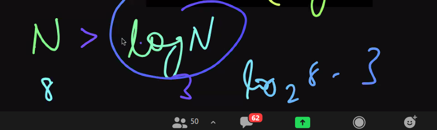
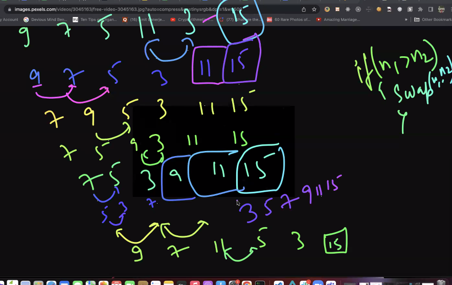

### Space complexity 
The space complexity of an algorithm or a computer program is the amount of memory space required to solve an instance of the computational problem as a function of characteristics of the input.
```bash
time complexity denotes the time required by the program to be run, space complexity denotes the space required by the program when it runs.
```

- storage aint much of a concern because now devices have enormous capacity.
- high importance given to time complexity because the speed at which a program runs matters the most (fast applications are preffered), processing data quickly is of major concern since were dealing with big data. 

#### Linear Search (TC: O(n))
Checking if the value exists in the array or not by traversing it in a single line. 

> search if value is present in array or not. 
```bash 
# search 
# [10, 4, 9, 30, 7]
const arr = [10, 4, 9, 30, 7]

function checkExists(arr, value){ 
    let isPresent = false; 
    for(let index=0; index<arr.length; index++){
    # when we find the index return it 
        if(arr[index]==value){
            console.log('present')
            isPresent = true 
            break
        } 
    }
    if(isPresent){
        console.log('present')
    }else{
        console.log(arr, 30)
    }
}
checkExists(arr, 30)  #returns present 
```
> return index if the value is present in array
```bash 
# search 
# [10, 4, 9, 30, 7]
const arr = [10, 4, 9, 30, 7]

function checkExists(arr, value){ 
    # return -1 index if no value is present
    let isPresent = -1;
    for(let index=0; index<arr.length; index++){
    # when we find the index return it 
        if(arr[index]==value){
            # set the index at which its found stored inside isPresent 
            isPresent = index
            break
        } 
    }
    if(isPresent){
        console.log('present')
    }else{
        # when isPresent is -1
        console.log('not present')
    }
}
checkExists(arr, 30)  #returns present 
```
> whats the TC?
```bash 
# the checking condition will run 11 times  ✅N+1
for(i=1; i<=10; i++){
    # if this statement executes 10 times   ✅N
    print(i)
}

console:
10

TC: 2N + 1
```
> whats the time complexity?
```bash 
# this condition will run 11 times  
for(int i=1; i<=10; i++){
    for(int j=1; j<=10; j++) #this condn alone runs 10 times 
    # total time it runs -> 10 x 11 times 
    {
        # statement executes 10 x 10 times 
        # print 100 times 
        print('hello')
    }
}

11 times -> 10 + 1 -> N+1
10 x 11 -> 10((10+1) -> N(N+1)
10 x 10 -> 10 x 10 -> N^2

TC -> 2N(N+1) +1
```
> calculate the time complexity 
```bash 
for(int i = 1; i<10; i++) #11 times 
{
    for(int j=1; j<=10; j++) #11times x 10
    {
        for(int k=1; k<=10; k++) #11times x 10 x 10 
        {
          print('hello')        #10 x 10 x 10 
        }
    }
}

11 -> 10 + 1 -> N+1
10 x 11 -> 10 (10+1) -> N(N+1)
10 x 10 x 11 -> 10 x 10 x (10+1) -> N^2 (N+1)

TC: N^2(N+1) + 3N+1
```
> calculate the time complexity
```bash 
for(i=1; i<=10; i++){  #runs 11 times -> N+1
    print('hello')     #runs 10 times  > N
}

for(j=1; j<=10; j++){  #runs 11 times -> N+1
    print('welcome')   #runs 10 times -> N
}

TC: 2n
```


### Q. Another example 
```bash 
for(i=1; i<=10; i=i+2)  #runs 5 times + 1
{
    print('hello')      #runs 5 times
}

i      |    i+2
1      |    3
3      |    5
5      |    7
7      |    9

6 -> 5+1 -> N/2 + 1
5 -> 5 -> N/2

TC: N+1
```


> ANOTHER EXAMPLE.
> So how do we calculate TC for this? consider this logarithmic formulas

```bash
for(i=32; i>1; i=i/2){   #5times + 1
    print('hello')       #5times 
}

i    |    i/2  |  #these are literal exponent of i 
32   |    16   |   2^5
16   |    8    |   2^4
8    |    4    |   2^3
4    |    2    |   2^2
2    |    1    |   2^1

calculating time complexity:
# there are two formulas for log
#first formula 
2^k -> N
2^5 -> 32 
# N is 32 

# second formula 
log_2 N = K
log_2 32 = 5 
# log_2 32 is 5 

-----
what we deduct from this is 
N=32 
logN = 5

### logN is better in terms of faster time complexity 
N > logN
32 > 5
```
> logN takes lesser time than N (N takes more time to execute than logN)


> when input is N, time taken will be log_2(N)


### Binary search -> TC: O(log n)
> prerequisitive: sorted array 
1. if 9==mid return mid
2. if 9<mid, search on lhs 
3. if 9>mid, search on rhs 
```bash
# 4   7   9   10    30 
const arr = [4, 7, 9, 10, 30]
function checkExistsBinarySearch(arr, value){
    const left = 0 
    let right = arr.length- 1 
    let mid = Math.floor(left+right/2)
    let isPresent = false 

while(right>=left){
    if(arr[mid] == value){
        isPresent = true 
    }

    if(value > a[mid]){
        # check right sub half 
        left = mid + 1
    }
    else {
        # check left sub half 
        right = mid - 1
    }

}
}

if(isPresent){
    console.log('present')
}
else {
    console.log('not')
}
```
> Note that: to sort through this array in linear search it takes O(n) but we acheived the result faster by using binary search (O(logn))

```bash
calculating time complexity:
# there are two formulas for log
#first formula 
2^k -> N
2^4 -> 16
# N is 16

# second formula 
log_2 N = K
log_2 16 = 4
# log_2 16 is 4 

-----
what we deduct from this is 
N=16
logN = 4

✅it takes N time complexity in linear search since were traversing over each element 
✅it takes logN time complexity in binary search since we traverse half the array at a time

### logN is better in terms of faster time complexity 
N > logN
16>4
```
> learn all these sorting algos 


#### Rotated sorted array 


> How to search an element in rotated sorted array using binary search 

> Q. Return the index of the key when found in the rotated sorted array 
We can approach this problem in two ways. 
1. the brute force method - where were traversing through every element one by one to check if the element were searching for is present in the array or not, 
if it is, we return the index of where the element is present. However, the time complexity for this is 0(n), we need a faster approach, so we'll be solving this
problem through a modfied version of binary search 

2. searching index of an element in a rotated sorted array using Binary search
Note that in this case the time complexity is 0(logN) which is much lesser than 0(N) for the obvious logarithmic reasons. 
```bash 
# here are two log formulas, when the number of elements in our array is 4 
# consider a scenario where the number of inputs is 4 
2^k -> N
2^4 -> 16
# N is 16

# second formula 
log_2 N = K
log_2 16 = 4
# log_2 16 is 4 

# then note that: O(N) complexity will return 16
# however O(logN) complexity will return 4, the obvious reason why O(logN) gives faster program computation than O(N)
```
Here is the solution, if your interested to figure out, how we built the logic around it, read the explanation I added below it. 

I will be running through 4 different possible cases that can occur during traversal, and their explanation through comments.
- when key is present to the rhs of the array(and the key is not the last index of the array)
```bash 
# key: 5
# indices:   0   1  2  3  4 5  6
# array a[]: 20 30 40 50 60 5 10 

# in this case, 5 and 10 are reversed and added at the last index 
# the rest of the array from a[0] to a[4] is pretty much sorted 
int bSearch(int a[], int key){
    int low = 0 
    int high = a.length - 1
    while(low<high){
        int mid = (low + high/2)
        # mid = 0+6/2 = 3 
        # a[3] = 50 

        # 5 == 10 ❌
        if(a[mid]==key){
            return mid 
        }
        # 20 < 50 ✅
        # if a[low] < a[mid] element must be present to the lhs of the mid element 
        else if(a[low]<a[mid]){
            # 5>=20 ❌ && 5<50✅
            if(key>=a[low] && key<a[mid]){
                high = mid - 1
            }
            # enter this loop because top loop doesnt satisfy conditions
            else{
                # low pointer will now be pointing to the elem right after the mid i.e 60
                # now its going to compare between 60 (low) and 10(high)
                # new index for low - 4 
                # new index for high - 6 
                # it gets out of the loop enter while(low<high), its accepted, 
                # new index of mid = 5 
                # if checks for a[mid]==key, 5 == 5 satisfies and returns mid 
                low = mid + 1
            }
        } 
       # if a[low] > a[mid] element must be present to the rhs of the mid element 
        else {
            if(key> a[mid] && key<=a[high]>){
                low = mid + 1
            } else {
                high = mid - 1 
            }
        }
    }
}
```
- when key is present to the rhs of the array(and the key is the last index of the array)
```bash 
# key: 10 
# indices:   0   1  2  3  4 5  6
# array a[]: 20 30 40 50 60 5 10 

# in this case, 5 and 10 are reversed and added at the last index 
# the rest of the array from a[0] to a[4] is pretty much sorted 
int bSearch(int a[], int key){
    int low = 0 
    int high = a.length - 1
    while(low<high){
        int mid = (low + high/2)
        # mid = 0+6/2 = 3 
        # a[mid] = 50 

        # 50 == 10 ❌
        if(a[mid]==key){
            return mid 
        }

        # if a[low] < a[mid] element must be present to the lhs of the mid element 
        # a[0] < a[3] -> 20 < 50 ✅
        else if(a[low]<a[mid]){
            # 10>=50❌ && 10<50✅
            if(key>=a[low] && key<a[mid]){
                high = mid - 1
            }
            # enter this condition
            else{
                # update low to now point at a[4]. i.e 60 
                # new index for low - 4
                # new index for high - 6 
                # it gets out of the loop enter while(low<high), its accepted, 
                # new index of mid = 5 
                # if checks for a[mid]==key, nope
                # then checks if a[low]<a[mid]; 60<50 ❌, now it enters the rhs part of the loop 
                # key > a[mid], 10>5✅ && key<=a[high], 10<=10✅, then it updates low value to point to a[6]
                # it traverses through while(low<high), and when it enters a[mid]==key, it passes the condition, and the index of mid is returned 
                low = mid + 1
            }
        } 
       # if a[low] > a[mid] element must be present to the rhs of the mid element 
        else {
            if(key> a[mid] && key<=a[high]){
                low = mid + 1
            } else {
                high = mid - 1 
            }
        }
    }
}
```
- when key is present to the lhs of the array and its the first index of the array 
```bash 
# key: 20 
# indices:   0   1  2  3  4 5  6
# array a[]: 20 30 40 50 60 5 10 

# in this case, 5 and 10 are reversed and added at the last index 
# the rest of the array from a[0] to a[4] is pretty much sorted 
int bSearch(int a[], int key){
    int low = 0 
    int high = a.length - 1
    while(low<high){
        int mid = (low + high/2)
        # mid = 0+6/2 = 3 
        # a[mid] = 50 

        # 20 == 10 ❌
        if(a[mid]==key){
            return mid 
        }

        # if a[low] < a[mid] element must be present to the lhs of the mid element 
        # a[0] < a[3] -> 20 < 50 ✅
        else if(a[low]<a[mid]){
            # 20>=20✅  && 20<50✅
            if(key>=a[low] && key<a[mid]){
                # high index pointing at a[2] i.e 40 
                # it runs through everything above, the new mid index is a[1], i.e 30 
                # it checks if a[low]<a[mid], 20<30✅
                # then it checks if (key>=a[low] && key<a[mid]) 
                # 20>=20✅ && 20<50✅, it again updates the high index to point to 20 
                # it goes through mid = 0+0/2 = 0 and the new mid elem is now 30 and thats exactly whats returned after it passes through a[mid]==key
                high = mid - 1
            }
            else{
                low = mid + 1
            }
        } 
       # if a[low] > a[mid] element must be present to the rhs of the mid element 
        else {
            if(key> a[mid] && key<=a[high]){
                low = mid + 1
            } else {
                high = mid - 1 
            }
        }
    }
}
```
- when key is present to the lhs of the array and its not the first index of the array 
```bash 
# key: 30 
# indices:   0   1  2  3  4 5  6
# array a[]: 20 30 40 50 60 5 10 

# in this case, 5 and 10 are reversed and added at the last index 
# the rest of the array from a[0] to a[4] is pretty much sorted 
int bSearch(int a[], int key){
    int low = 0 
    int high = a.length - 1
    while(low<high){
        int mid = (low + high/2)
        # mid = 0+6/2 = 3 
        # a[mid] = 50 

        # 20 == 10 ❌
        if(a[mid]==key){
            return mid 
        }

        # if a[low] < a[mid] element must be present to the lhs of the mid element 
        # a[0] < a[3] -> 30 < 50 ✅
        else if(a[low]<a[mid]){
            # 30>=20✅  && 30<50✅
            if(key>=a[low] && key<a[mid]){
                # high index pointing at a[2] i.e 40 
                # it runs through everything above, the new mid index is a[1], i.e 30 
                # it checks if a[low]<a[mid] i.e 20<30✅, after entering the loop it checks if key>=a[low] && key<a[mid] i.e 30>=30✅ && 30<30❌
                # now it enters the else condition -> low = mid + 1 -> now low points at a[1]
                # note that: now both high and low pointers point at the same index a[1], i.e 30, now it goes back to while(low<high)✅
                # then calculate the mid = 1+1/2 = 1, now we found the mid index at a[1], i.e 30, the mid index is returned right here 
                high = mid - 1
            }
            else{
                low = mid + 1
            }
        } 
       # if a[low] > a[mid] element must be present to the rhs of the mid element 
        else {
            if(key> a[mid] && key<=a[high]){
                low = mid + 1
            } else {
                high = mid - 1 
            }
        }
    }
}
```
> The actual code 
```bash 
#include <bits/stdc++.h>
using namespace std;

int binarySearch(int arr[], int n, int key)
{
    int mid;
    int low = 0;
    int high = n - 1;
    int index = -1;
    while (low < high)
    {
        int mid = (low + high / 2);

        if (arr[mid] == key)
        {
            index = mid;
            return mid;
        }

        else if(arr[low] < arr[mid])
        {
            if (key >= arr[low] && key < arr[mid])
            {
                high = mid - 1;
            }
            else
            {
                low = mid + 1;
            }
        }
        else
        {
            if (key > arr[mid] && key <= arr[high])
            {
                low = mid + 1;
            }
            else
            {
                high = mid - 1;
            }
        }
    }
}

/* Driver program */
int main()
{
    # Let us search 3 in below array
    int arr1[] = {5, 6, 7, 8, 9, 10, 1, 2, 3};
    int n = sizeof(arr1) / sizeof(arr1[0]);
    int key = 8;

    # Function calling
    cout << "Index of the element is : "
         << binarySearch(arr1, n, key);

    return 0;
}
```

### Algorithm types:
- linear algorithm 
1. selection sort 
2. bubble sort 
3. insertion sort 
```bash 
# the worst and average time complexity of these sorts is 
O(n^2)
```
- divide and conquer algorithm - dividing array into 2 halves and focusing only on one half. 
1. quick sort 
2. merge sort 
```bash 
# better because the worst and average time complexity of these sorts is 
O(n logn)
```

### time complexity chart 
> O(1)
```bash 
# this prog runs once 
for(i=1; i<100; i++){
    print('hello')
    break;
}
# no matter the input size, it will only run once only 
```
> O(n)
```bash 
# this prog runs 100 times, because we didnt write break in here 
for(i=1; i<100; i++){
    print('hello')
}
```
> this is the sequence from best tc to worst 


#### Discussing sorts 
1. selection sort
In every iteration we take a pointer and we compare it with every index to its right 
- while n1 index is 0, n2 will traverse through the entire array from rhs of n1 and check if the condition satisfies, the moment its satisfied, it swaps.
- while n1 index is 1, n2 will traverse through the entire array from rhs of n1

```bash 
# O(n^2) time complexity
const arr = [9, 11, 15, 7, 5, 3];

# function expression
const selectionSort = (arr) => {
    #n1 traverses till 5  
    for(let n1=0; n1<arr.length-1; n1++){
        # n2 traverses from n1+1 till last 
        for(let n2=n1+1; n2<arr.length; n2++){
            if(arr[n1]>arr[n2]){
                const temp = arr[n1];
                arr[n1] = arr[n2];
                arr[n2] = temp;
            }
        }
    }
    console.log(arr)
}

selectionSort(arr)

# console:
Array(6)
0: 3
1: 5
2: 7
3: 9
4: 11
5: 15
length: 6
[[Prototype]]: Array(0)
```
2. Bubble sort 
Compare every element to its next element and check if it fulfills the condition
- when n1 is at index 0, it checks with n2 for the condition
- when n2 is at index1, it checks with n3 for the condition
If it fulfills the condition it swaps, otherwise it keeps increementing the pointers. 



```bash 
const arr = [9, 11, 15, 7, 5, 3];

# function expression
const bubbleSort = (arr) => {
    #n1 traverses from 0 till 3  
    # when n1 is at index 0, it runs through every element of n2
    # when n1 is at index 1, it runs through every element of n2
    # and so on..
    for(let n1=0; n1<arr.length; n1++){
        # for every iteration we start 
        # n2 runs from 0 to 5 
        # so when n2 reaches 5, n2+1 will be 3 
        # we want the loop to end there 
        for(let n2=0; n2< arr.length-n1-1; n2++){
            if(arr[n2] > arr[n2+1]){
                const temp = arr[n2]
                arr[n2] = arr[n2+1]
                arr[n2+1] = temp 
            }
        }
    }
    console.log(arr)
}

bubbleSort(arr)

# console:
Array(6)
Array(6)
0: 3
1: 5
2: 7
3: 9
4: 11
5: 15
length: 6
[[Prototype]]: Array(0)
```
3. Insertion sort 
Find the correct position for the element based on the condition and shift all the other elements according to it.
- It requires 2 loops -> one for iteration O(n), one for shifting O(n) which is O(n^2)

```bash
#            0  1  2   3  4   5
const arr = [2, 4, 9, 14, 23, 7]

# the element that needs to be sorted - valuetoinsert -> 3
# shift all elements greater than 3 to the right
#  2, 4, 7, 9, 14, 23 
const insertionSort = arr => {
    for(let i=1; i<arr.length; i++){
        # if arr[i] = 4 i.e its ar 1st index 
        let curr = arr[i]
        # j points at arr[0]
        let j = i-1

        while(j >= 0 && arr[j] > curr){
            arr[j+1] = arr[j]
            j--
        }
        arr[j+1] = curr
    }
}

i     |     j    |    a[i]   |    a[j]    |   a[j]>a[i]  |  a[j+1] = a[j]
1     |     0    |     4     |     2      |    nope      |  
2     |     1    |     9     |     4      |    nope      |
3     |     2    |     14    |     9      |    nope      |
4     |     3    |     23    |     14     |    nope      |
5     |     4    |     7     |     23     |    yup       |  a[5] = 23 
a[5] = curr 
23 = curr 
#  0 1 2  3 4 5
# [2 4 9 14 7 23]
5     |    4     |     23     |     7     |    nope      | 
4     |    3     |     7      |     14    |    yup       |  a[4]=14
# [2, 4, 9, 7, 14, 23]
a[4] = curr 
14 = curr 
4     |    3     |     14     |     7      |  nope 
3     |    2     |     7      |     9      |  yup        |  a[3] = 9
a[3] = curr 
9 = curr 
# [2, 4, 7, 9, 14, 23]
```

3. Quick sort 
divide and conquer approach 
- left <= right
- a[left] <= pivot 
- a[right] >= pivot 

> Time complexity:
- division part is logn 
- merging part is n 
- total time complexity is n(logn) 
```bash
# were having 3 functions:
# 1. find correct posn of pivot element 
# 2. divide list ot sublists 
# 3. main 
def pivot_place(list1, first, last):
    # first - starting index 
    # last - last index 
    pivot = list1[first]
    # taking first value as pivot 

    left = first + 1
    right = last 

   # since we want to execute this part of code again and again 
    while True: 
        while left<=right and list1[left]<=pivot:
            left = left + 1
        while left<=right and list1[right]>=pivot:
            right = right - 1
        if right < left:
            break
            # if this condition is true 
            # swap pivot and element present at the right index 
        else:
            # swap value at left and right index 
            list1[left], list1[right] = list1[right], list1[left]
    list1[first], list1[right] = list1[right], list1[first]
    # swap pivot and element present at the right index 
    return right 


def quicksort(list1, first, last):
# when first index is same as last index then we need to stop 
# then we need to stop the swap 
   if first <last:
        # if first index is smaller than last index 
        p = pivot_place(list1, first, last)
        quicksort(list1, first, p-1)
        quicksort(list1, p+1, last)

#main 
list1 = [56, 26, 93, 17, 31, 44]
n = len(list1)   #6
quicksort(list1, 0, n-1)  #0->5
print(list1)
```

2. merge sort 
Divide and conquer algorithm
divide 2 arrays into subarrays and we merge them

Time complexity:
- division part is logn 
- merging part is n 
- total time complexity is n(logn) 


> Steps:
1. split the unsorted list 
2. compare each of the elements and group them 
3. repeat step 2 until the whole list is merged and sorted 


```bash
#  0 1  2 3  4  5 6
# 20 1 30 40 10 5 17 

# take input from unsorted list 
# divide unsorted list until it contains a single element 
# merge the divided parts 

# 1. Taking input from unsorted list from the user 
def mergesort(list1):
# stop dividing when we have a ssingle element 
    if len(list1)>1:
        mid = len(list1)//2
        left_list = list1[:mid]  #from 0 to mid-1
        right_list = list1[mid:] #from mid to end 
        
        mergesort(left_list)
        mergesort(right_list)

        # the code below is for merging the left and right sublist 
        # left sublist index -> i
        i = 0 
        # right sublist index -> j 
        j = 0 
        k = 0 
        # is len(left_list) is 2
        # then i will run on 0, 1 indices 
        while i<len(left_list) and j<len(right_list):
            # if left sublist value is less than the right sublist value 
            if left_list[i]<right_list[j]:
                # place left list value in list1
                # index: 0  | 1  
                # array: 10 | 40    
                list1[k] = left_list[i]
                i = i+1
                k = k+1
            else:
                list1[k] = right_list[j]
                j = j+1
                k = k+1
        # is there any value left in the left sublist 
        while i<len(left_list):
              list1[k] = left_list[i]
              i = i+1
              k = k+1
        while j<len(right_list):
              j = j+1
              k = k+1


# num = int(input('how many elems you want in the list'))
# list1 = [int(input()) for x in range(num)]

list1 = [56, 26, 93, 17, 31, 44]
n = len(list1)   #6
mergesort(list1) 
print(list1)
```
### 2 Pointer Technique 
Two pointers is really an easy and effective technique that is typically used for searching pairs in a sorted array

> reverse the array -> O(n) time complexity 
```bash 
# input -> [10, 20, 30, 40]
# output -> [40, 30, 20, 10]
const arr = [10, 20, 30, 40, 50, 60]
const reverseArr = (arr) => {
    let left = 0, right = arr.length-1

    while(left<right){
        const temp = arr[left]
        arr[left] = arr[right]
        arr[right] = temp 

        left++
        right--
    }
    console.log(arr)
}
reverseArr(arr)

console:
Array(6)
0: 60
1: 50
2: 40
3: 30
4: 20
5: 10
length: 6
[[Prototype]]: Array(0
```
```bash 
# input [0, 1, 1, 0, 0, 0, 1, 1, 0]
# output [0, 0, 0, 0, 0, 1, 1, 1, 1]

const arr = [0, 1, 1, 0, 0, 0, 1, 1, 0]
var sortZeroOne = (arr) => {
    let low = 0, high = arr.length-1;
    while(low<=high){
        if(arr[low] == 0){
            low++
        }else
        # when arr[low] = 1 
        {
            # swap 1 to the last index 
            const temp = arr[low]
            arr[low] = arr[high]
            arr[high] = temp

            # move high to the lhs 
            high--
        }
    }
    console.log(arr)
}
sortZeroOne(arr)
```

#### Discussing questions
> find the missing positive integer in sorted array 
```bash 
# given a sorted array containing integers (1-n)
# find the first missing positive integer
# [1,2,3,4,5,6,7,9,10]
const arr = [1,2,3,4,5,6,7,9,10]

const FirstMissingPositive = (arr) => {
    let missingNumber = null;
    for(index = 0; index<arr.length; index++){
        if(arr[index] != index+1){
            missingNumber = index+1;
            break;
        }
    }
    console.log(missingNumber)
}
FirstMissingPositive(arr)

index   |  index  |   arr[index]!=index+1
0       |  1      |   1!=1
1       |  2      |   2!=2
.
.
.
7       |  7      |   7!=7
8       |  9      |   9!=8 ✅

# console:
8
# time complexity: O(n)
```
> find the missing positive integer in unsorted array
```bash
# approach 1: O(n logn)
# sort the array using quick / marge sort -> O(n logn)
# then apply the previous logic -> O(n)
# this approach will take O(n logn) TC

# approach 2: O(n)
# sum of numbers from 1 to 10 -> n(n+1)/2 -> 10(10+1)/2 -> 55
# sum of all the elements of the arr -> 47 
# difference of sum of nums from 1 to 10 and sum of elements of the array will give us the missing number 
const arr = [1,2,3,4,5,6,7,9,10]

const FirstMissingPositive = (arr) => {
    let expectedSum = n(n+1)/2
    let actualSum = 0 
    for(let index=0; index<arr.length; index++){
        actualSum = actualSum + arr[index]
    }    
    console.log(expectedSum - actualSum)
}
```
> find first missing positive number in an unsorted array 
Given an unsorted integer array nums, return the smallest missing positive integer.

You must implement an algorithm that runs in O(n) time and uses constant extra space.
```bash
Input: nums = [3,4,-1,1]
Output: 2
```

(I tried solving this in leetcode)
- approach O(n) and use constant extra space 
```bash
# explanation given in notes 
class Solution:
    def firstMissingPositive(self, nums: List[int]) -> int:
        n = len(nums)
        for i in range(n):
            correctPos = nums[i]-1 # number 3 goes to index 2
            while 1 <= nums[i] <= n and nums[i] != nums[correctPos]:
                nums[i], nums[correctPos] = nums[correctPos], nums[i]
                correctPos = nums[i]-1 # now nums[i] has changed
                
        
        for i in range(n):
            if i+1 != nums[i]:
                return i+1
        return n+1
```


