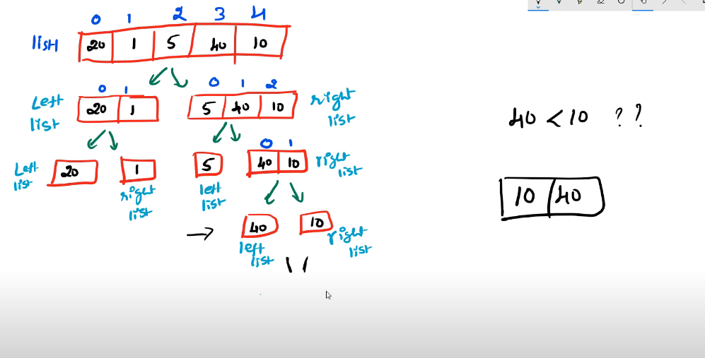

### Data structure 
Data structure is the organization pf data in a way that can be used efficiently. 
- In order to use data efficiently we need to store data efficiently 

> an ideal DS is the one that takes the least possible time for all its soperation and consumes the least memory space 

efficency of DS is always measured in terms of time and space 

On what basis can we compare the time complexity of DS? On basis on operations performed on them.

#### Selecting best possible DS for a particular operation
> first approach: array - if we want to add data to the beginning of the list, we add element to the right index and we shift all the element
> second appproach: linked list - linking the node to be added to the beginning of the list. inserting an element at beginning of the list is faster in linked list.

### Increasing Order of common run times 


### Asymptotic Notations: Big O, Big Omega, Big theta 
how to figure out the better algorithm?

> What is asymptotic notation?
Asymptotic notation gives us an idea about how good a given algorithm is compared to some other algorithm.
Primarily there are three types of widely used asymptotic notations.

- Big oh notation ( O )
- Big omega notation ( Ω )
- Big theta notation ( θ ) – Widely used one

Mathematical way of representing time complexity. 
- Were representing number of times a code is executed, just so we can compare and contrast 2 different solutions. 

1. Big-Oh (O) **worst case**
A function f(n) is said to be Big O of g(n) if and only if there exists a constant C and a constant n, such that 0 <= f(n) <= C*g(n) for all n>=k
```bash
0 <= f(n) <= C*g(n)
# g(n) can represent TC algrithm -> n / nlogn / n^2
# f(n) is representing the TC equation - for eg, n^2 + n 
for n>= k >= 0 
Choose a k value after which C*g(n) is bigger than f(n) 
and this condition will be valid for all values after this point.

# n - input values 
# t- time 
```
- worst case (searching for something, you'd find on last page of book - worst case)
- upper bound (at most) - At most how much time will it take to be executed 

```bash
f(n) = O * g(n)
f(n) <= C * g(n)
C is constant > 0
n >= k 
k >= 0

# lets assume total time to solve a problem 
f(n) = 2n^2  + n
# we can ignore n, because n takes linear time, n^2 grows more than n 

2n^2 + n <= C * g(n^2)
# take the least upper bound value - n^2
# lets take C as 3 
# were taking a constant such that the value of n^2 is greater than 2n^2 + n 
2n^2 + n <= 3n^2
n <= 3n^2 - 2n^2
n <= n^2

n will always be lesser than n^2
``` 

Big oh notation is used to describe an asymptotic upper bound.

> little O 
```bash
2n^2 + n < C * g(n^2)
# take the least upper bound value - n^2
# lets take C as 3 
2n^2 + n < 3n^2 
n < 3n^2 - 2n^2
n < n^2
```
3. Big-Omega (Ω) **best case**
A function f(n) is said to be Big omega of g(n) if and only if there exists a constant C and a constant n, such that 0 <= C*g(n) <= f(n) for all n>=k
```bash
0 <= C*g(n) <= f(n)
# g(n) can represent TC algrithm -> n / nlogn / n^2
# f(n) is representing the TC equation - for eg, n^2 + n 
for n>= k >= 0 
Choose a k value after which f(n) is bigger than C*g(n) 
and this condition will be valid for all values after this point.

# n - input values 
# t- time 
```
- best case (searching for something, you'd find on first page of book - best case)
- lower bound (at least) - At least how much time will it take to be executed 

```bash
f(n) = Ω * g(n)
f(n) >= C * g(n)
# take the greatest lower bound 
2n^2 + n >= C * n^2
# when C=2
2n^2 + n >= 2n^2

2n^2 + n will always be greater than 2n^2
```

Just like O notation provides an asymptotic upper bound, Ω notation provides an asymptotic lower bound. 

> little omega 
```bash
f(n) = Ω * g(n)
f(n) > C * g(n)
# take the greatest lower bound 
2n^2 + n > C * n^2
# when C=2
2n^2 + n > 2n^2
```
3. Big Theta **Average case**
A function f(n) is said to be big theta of g(n), if there exists a constant C1, C2 & a constant k such that 0 <= f(n) <= C1*g(n) and 0 <= C2*g(n) <= f(n) for all n>=k
```bash
Consider these 2 equations from worst case and best case
0 <= f(n) <= C1*g(n)  #worst case
0 <= C2*g(n) <= f(n)  #best case 

for all n>=k

Since average case, is the average of both worst case(big O) and best case (big omega), we can conclude 
C2*g(n) <= f(n) <= C1*g(n)

The equation simply means that there exist positive constants c1 and c2 such that f(n) is sandwiched between c2 g(n) and c1 g(n). 
```

- average case (searching for something, you'd find on mid page of book - best case)
```bash
when f(n) = 2n^2 + n
c2*g(n) <= f(n) <= C1*g(n)
# let C2 be 2 and C1 be 3 
2n^2 <= f(n) <= 3n^2
```
### Pro tip:
Since Big theta gives a better picture of runtime for a given algorithm most of the interviewers expect you to provide an answer in terms of big theta when they say 'order of'

### Big O graph 
> Big O notation gives a simplified analysis of an algorithms efficiency


### Sorting algos TC
A sorting algorithm is used to arrange elements of an array/list in a specific order. 


> Time Complexity: Time complexity refers to the time taken by an algorithm to complete its execution with respect to the size of the input. It can be represented in different forms:

- Big-O notation (O)
- Omega notation (Ω)
- Theta notation (Θ)

> Space Complexity: Space complexity refers to the total amount of memory used by the algorithm for a complete execution. It includes both the auxiliary memory and the input.

The auxiliary memory is the additional space occupied by the algorithm apart from the input data. Usually, auxiliary memory is considered for calculating the space complexity of an algorithm.


### Selection sort
> algorithm 
```bash
Step 1 - Set MIN to location 0
Step 2 - Search the minimum element in the list
Step 3 - Swap with value at location MIN
Step 4 - Increment MIN to point to next element
Step 5 - Repeat until list is sorted
```
> Time Complexity: Θ(n²)
Selection Sort operates in a very simple way; it goes through all the elements in a data-set one by one comparing the value of one element to the next checking to see if the element is smaller, it then saves the smallest element found in a variable and when the iteration is complete, it will insert that saved element to its respective position in that data-set swapping positions with the value in that position.

This algorithm has an Θ(n²) because in the worst and best-case-scenario we have to iterate through all the n elements in the array and repeat this process n number of times, even if the data-set is already sorted there is no telling if it is until all the iterations in the algorithm are complete.

> the working 


> take a look at the sorting visualization 


> the ascending order code 
```bash
#           n1
const arr = [9, 11, 15, 7, 5, 3];
#               n2
# when n1 is at 0, it iterates over all elements through n2 
# when n1 is at 1, it iterates over all elmeents through n1

# function expression
const selectionSort = (arr) => {
    #n1 traverses till 5  
    for(let n1=0; n1<arr.length-1; n1++){
        # n2 traverses from n1+1 till last 
        for(let n2=n1+1; n2<arr.length; n2++){
            if(arr[n1]>arr[n2]){
                const temp = arr[n1];
                arr[n1] = arr[n2];
                arr[n2] = temp;
            }
        }
    }
    console.log(arr)
}

selectionSort(arr)

# console:
Array(6)
0: 3
1: 5
2: 7
3: 9
4: 11
5: 15
length: 6
[[Prototype]]: Array(0)
```


### Bubble Sort 
At every iteration it compares every 2 adjacent pairs and swaps it. 

> the working:


> the algprithm:
```bash
Step 1 - Starts with very first two elements (i=0 and i+1), comparing them to check which one is greater.
Step 2 - Swap the elements keeping smaller elements on the left-hand side of the array
Step 3 - Add i++
Step 4 - Compare the next two elements (i and i+1) and swap the elements if the left-hand side element is greater than the right-hand side.
Step 5 - Continue until end of the array
Step 6 - Repeat again from index 0 until list is sorted
```

> the visualization:


> Time Complexity: 
- worst case: O(n²) 
if all the elements are in reverse order, and we need to swap them to ascending order
```bash
# n = 6 
6 5 4 3 2 1
# it will iterate over the loop around 6^2(36times) considering every adjacent element 
# first 6 and 5 will be compared at i=0
# then 5 and 4 will be compared at i=1
# then 4 and 3 will be compared  at i=2
# then 3 and 2 will be compared at i=3
# then 2 and 1 will be compared at i=4

# this same drill will be applied like 6*6(36times) until all elements are sorted 
```
- base case: Ω(n)
If only one element needs to be sorted, we swap those 2 only, which requires like one iteration 
```bash
# n = 6 
1 3 2 4 5 6 
# when only one element needs sorting, only one iteration will be executed to swap 3 and 2 
```

I would say that Bubble Sort might be the simplest sorting algorithm. The way this algorithm processes the input is just like a bubble trying to reach out to the surface, within each iteration the algorithm will find the highest value and put it at the end of the data-set or were that value belongs by comparing each pair of elements in the data-set. So Selection Sort sorts from the smallest element to the highest and Bubble Sort from highest to lowest. Bubble sort also sorts the lowest elements to be closer to the left because within each iteration the higher value will swap places with the lower value, so it moves lower elements to the left and higher elements to the right.

The worst-case scenario for this algorithm would be if all the elements in the data-set were in reverse order making the algorithm make more “swaps”, but we do see that the best-case scenario is not as bad as Selection Sort because unlike Selection Sort this algorithm is smart enough to realize in its first iteration that the data-set is already sorted.

> the code 
```bash
#            0  1   2   3  4  5
const arr = [9, 11, 15, 7, 5, 3];

# function expression
const bubbleSort = (arr) => {
    #n1 traverses from 0 till 3 (5th index)
    # when n1 is at index 0, it runs through every element of n2
    # when n1 is at index 1, it runs through every element of n2
    # and so on..
    for(let n1=0; n1<arr.length; n1++){
        # for every iteration we start 
        # n2 runs from 0 to 5 
        # so when n2 reaches 4th index, n2+1 will be 5th index
        # we want the loop to end there 

        # 0    1     2    3    4    5 
        # n1
        # n2   n2+1

        # arr.length = 6, so n1 runs till 5th index 
        # arr.length-n1-1 = 
        # when n1 = 0, arr.length-n1-1 = 6-0-1=5
        # when n1 = 1, arr.length-n1-1 = 6-1-1=4
        # when n1 = 2, arr.length-n1-1 = 6-2-1=3
        # when n1 = 3, arr.length-n1-1 = 6-3-1=2
        # when n1 = 4, arr.length-n1-1 = 6-4-1=1
        # when n1 = 5, arr.length-n1-1 = 6-5-1=0

        for(let n2=0; n2< arr.length-n1-1; n2++){
            if(arr[n2] > arr[n2+1]){
                const temp = arr[n2]
                arr[n2] = arr[n2+1]
                arr[n2+1] = temp 
            }
        }
    }
    console.log(arr)
}

bubbleSort(arr)

# console:
Array(6)
Array(6)
0: 3
1: 5
2: 7
3: 9
4: 11
5: 15
length: 6
[[Prototype]]: Array(0)
```
### Merge Sort 
Divide and conquer algorithm - divide 2 arrays into subarrays and we merge them

> algorithm 
```bash
Step 1 - if it is only one element in the list it is already sorted, return.
Step 2 - divide the list recursively into two halves until it can no more be divided.
Step 3 - merge the smaller lists into new list in sorted order.
```

> Time complexity:
- division part is logn 
- merging part is n 
- total time complexity is n(logn) 

This algorithm has the same Time Complexity for both worst and best-case scenarios because even if the array is sorted(best-case) the algorithm will still have to do the full procedure to determine whether the data-set is sorted or not.


> Steps:
1. split the unsorted list 
2. compare each of the elements and group them 
3. repeat step 2 until the whole list is merged and sorted 

> the working:


> the code:
```bash
# 0  1  2 3  4  5 6
# 20 1 30 40 10 5 17 

# take input from unsorted list 
# divide unsorted list until it contains a single element 
# merge the divided parts 

# 1. Taking input from unsorted list from the user 
def mergesort(list1):
# stop dividing when we have a single element 
    if len(list1)>1:
        mid = len(list1)//2
        left_list = list1[:mid]  #from 0 to mid-1
        right_list = list1[mid:] #from mid to end 
        
        mergesort(left_list)
        mergesort(right_list)

        # the code below is for merging the left and right sublist 
        # left sublist index -> i
        i = 0 
        # right sublist index -> j 
        j = 0 
        # list1 sublist index -> k
        k = 0 

        # if len(left_list) is 2
        # then i will run on 0, 1 indices 
        while i<len(left_list) and j<len(right_list):
            # if left sublist value is less than the right sublist value 
            if left_list[i]<right_list[j]:
                # place left list value in list1 first 
                # index: 0  | 1  
                # array: 10 | 40    
                list1[k] = left_list[i]
                i = i+1
                k = k+1
            else:
            # place right sublist value in list1 first
                list1[k] = right_list[j]
                j = j+1
                k = k+1
        # is there any value left in the left sublist 
        while i<len(left_list):
              list1[k] = left_list[i]
              i = i+1
              k = k+1
        while j<len(right_list):
              j = j+1
              k = k+1
# num = int(input('how many elems you want in the list'))
# list1 = [int(input()) for x in range(num)]

list1 = [56, 26, 93, 17, 31, 44]
n = len(list1)   #6
mergesort(list1) 
print(list1)
```


### Insertion sort 
Find the correct position for the element based on the condition and shift all the other elements according to it.
- It requires 2 loops -> one for iteration O(n), one for shifting O(n) which is O(n^2)


> the algorithm
```bash
Step 1 - If it is the first element, it is already sorted. return 1;
Step 2 - Pick next element
Step 3 - Compare with all elements in the sorted sub-list
Step 4 - Shift all the elements in the sorted sub-list that is greater than the value to be sorted
Step 5 - Insert the value
Step 6 - Repeat until list is sorted
```

> time complexity 
```bash
best case: O(n)
worst case: O(n^2)
```

> the working 


```bash
#            arr[1]=curr
#               |
#            0  1  2   3  4   5
const arr = [2, 4, 9, 14, 23, 7]
#            j  i 
#            |
#           i-1

# the element that needs to be sorted - valuetoinsert -> 3
# shift all elements greater than 3 to the right
const insertionSort = arr => {
    for(let i=1; i<arr.length; i++){
        # if arr[i] = 4 i.e its at 1st index 
        let curr = arr[i]
        # j points at arr[0]
        let j = i-1

        while(j >= 0 && arr[j] > curr){
          # j+1 is basiccally same as curr 
          # add the bigger element in arr[j] position
            arr[j+1] = arr[j]
            # deecrementing the j counter 
            j--
        }
        arr[j+1] = curr
    }
}
#  0  1  2  3   4  5
#  2, 4, 9, 14, 23, 7
i     |     j     |    arr[i]   |   arr[j]    |    arr[j]>curr   |  arr[j+1]=arr[j]   |   j--
1     |     0     |    4        |   2         |    nope 
2     |     1     |    9        |   4         |    nope
3     |     2     |    14       |   9         |    nope
4     |     3     |    23       |   14        |    nope
5     |     4     |    7        |   23        |    arr[4]>arr[7] |  arr[5] = 23       |   4
# so we added 23 at 5th position here 
# and we deecremented the value of j -> to 4 

now arr[j+1] -> 23 is curr/i (at 5th index)
and arr[j] -> 7 is i-1 (at 4th index)
# 0  1  2   3  4  5
# 2, 4, 9, 14, 7, 23 

i    |    j     |    arr[i]    |    arr[j]    |   arr[j]>curr   |   arr[j+1]=arr[j]  |   j--
1    |    0     |    4         |    2         |   nope
2    |    1     |    9         |    4         |   nope
3    |    2     |    14        |    9         |   nope
4    |    3     |    7         |    14        |   arr[3]>arr[4]  |  arr[4] = 14       |   3
# we added 14 on the 4th position here 
# and we deecremented the value of j -> to 3 

now arr[j+1] -> 14 is curr/i (at 4th index)
arr[j] -> 7 is i-1 (at 3rd index)

# 0  1  2  3  4   5
# 2, 4, 9, 7, 14, 23
5    |    4    |   23          |   14         | nope


i    |    j     |    arr[i]    |    arr[j]    |   arr[j]>curr   |   arr[j+1]=arr[j]  |   j--
1    |    0     |    4         |    2
2    |    1     |    9         |    4
3    |    2     |    7         |    9         |   arr[2]>arr[3] |   arr[3] = 9       |   2 
# we added 9 on 3rd position 
# we deecremented the value of j -> to 2 

now arr[j+1] -> 9 is curr/i (at the 3rd index)
arr[j] -> 7 is i-1 (at 2nd index)
# 0  1  2  3   4  5
# 2, 4, 7, 9, 14, 23
4    |   3     |   14         |   9          |  nope 
```
### Quick Sort 
> the working:


> Conditions to satisfy quick sort:
```bash
1. left index <= right index 
2. a[left]  >= pivot
3. a[right] <= pivot 
```

> algorithm:
```bash
Step 1 - Choose a pivot index
- first element 
- last element 
- random eleemnt 
- median of left and right indexes

Step 2 - Take two variables to point left and right of the list excluding pivot
Step 3 - left points to the low index
Step 4 - right points to the high
Step 5 - while value at left is less than pivot move right
Step 6 - while value at right is greater than pivot move left
Step 7 - if both step 5 and step 6 does not match swap left and right
Step 8 - if left = right, the point where they met is new pivot               
```

>  Average and worst case complexity are of O(nlogn)
```bash
def pivot_place(list1, first, last):
    # first - starting index 
    # last - last index 
    pivot = list1[first]
    # taking first value as pivot 

    left = first + 1
    right = last 

   # since we want to execute this part of code again and again 
    while True: 
        while left<=right and list1[left]<=pivot:
            left = left + 1
        while left<=right and list1[right]>=pivot:
            right = right - 1
        if right < left:
            break
            # if this condition is true 
            # swap pivot and element present at the right index 
        else:
            # swap value at left and right index 
            list1[left], list1[right] = list1[right], list1[left]
    list1[first], list1[right] = list1[right], list1[first]
    # swap pivot and element present at the right index 
    return right 


def quicksort(list1, first, last):
# when first index is same as last index then we need to stop 
# then we need to stop the swap 
   if first <last:
        # if first index is smaller than last index 
        p = pivot_place(list1, first, last)
        quicksort(list1, first, p-1)
        quicksort(list1, p+1, last)

#main 
list1 = [56, 26, 93, 17, 31, 44]
n = len(list1)   #6
quicksort(list1, 0, n-1)  #0->5
print(list1)
```
### Time Complexities 
```bash
SORT             |  BEST CASE  |  WORST CASE  | AVERAGE CASE
selection sort   |  O(n^2)     |  O(n^2)      | O(n^2)
bubble sort      |  O(n)       |  O(n^2)      | O(n^2)
merge sort       |  O(n log(n))|  O(n log(n)) | O(n log(n))
insertion sort   |  O(n)       |  O(n^2)      | O(n^2)
quick sort       |  O(n log(n))|  O(n log(n)) | O(n log(n))
```
### Searching Algorithms 
1. Binary Search - O(logn)
2. Linear Search - O(n)

#### 1. Binary Search 
> the working


> Conditions:
```bash
# data to search -> data 
Case 1: data == a[mid]
Case 2: data < a[mid] #data present on lhs of array 
Case 3: data > a[mid] #data present on rhs of array 
Case 4: left < right 
#left pointer should be less than right pointer, else data is not present in the array 
```
> the code:
```bash
# Returns index of x in arr if present, else -1
def binary_search(arr, low, high, x):
 
    # Check base case
    if high >= low:
 
        mid = (high + low) // 2
 
        # If element is present at the middle itself
        if arr[mid] == x:
            return mid
 
        # If element is smaller than mid, then it can only
        # be present in left subarray
        elif arr[mid] > x:
            return binary_search(arr, low, mid - 1, x)
 
        # Else the element can only be present in right subarray
        else:
            return binary_search(arr, mid + 1, high, x)
 
    else:
        # Element is not present in the array
        return -1
 
# Test array
arr = [ 2, 3, 4, 10, 40 ]
x = 10
 
# Function call
result = binary_search(arr, 0, len(arr)-1, x)
 
if result != -1:
    print("Element is present at index", str(result))
else:
    print("Element is not present in array")
```
#### 2. Linear Search
> the working


> the code 
```bash
def search(arr, x):
  
    for i in range(len(arr)):
  
        if arr[i] == x:
            return i
  
    return -1
```

### the difference


### Time Complexities
Sort          |  BEST CASE |  WORST CASE  |  AVG CASE 
Binary search |  O(1)      |  O(log n)    |  O(log n)
Linear search |  O(1)      |  O(n)        |  O(n)


