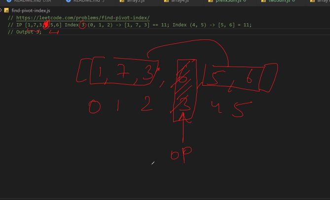

### Intersection of 2 arrays 
> map is a key value pair 
in the first loop we get this 


- first loop we traverses over the arr1 and logs these values in the map 


- in the second loop it traverses over the arr2, if 7 existed in map it existed in arr1 
if it exists we need to push it to the arr1Map

- it the item exists in both arrays. it will be logged inside arr1Map and we push it to newArr 


### random stuff to remember 

```bash
# boolean("") - empty string returns false 
# boolean(0) returns false 
# boolean(undefined) returns false 
# boolean(null) returns false 
```
### Merge 2 sorted arrays 
```bash
# these are sorted arrays, we want the merged output array as sorted
const arr1 = [3, 6, 8, 9]
const arr2 = [4, 6, 7, 10, 11]

# possibiltiies of merging
# print with duplicates:[3,4,5,6,6,7,8,9,10,11]
# print without duplicates:[3,4,5,6,7,8,9,10,11]

# were merging with duplicates 
const mergeArrays = (arr1, arr2) => {
    const newArr = [];

    # if arr[i]<arr[j], push arr[i] to new array 
    # else if arr[j]<arr[i], then we'll push arr[j] to new array 
    # we'll continue this, until any one array is exhausted 

    const p1 = 0; #pointer for arr1
    const p2 = 0; #pointer for arr2

    while(p1 <arr1.length && p2<arr2.length){
        if(arr1[p1]<arr2[p2]){
            newArr.push(arr1[p1])
            p1++
        }else {
            newArr.push(arr2[p2])
            p2++
        }
    }
    console.log(newArr)
}

# when one array is exhausted there are still some elements left either in arr1 or arr2, in that case, we'll be placing the elements in the right position of the newArr because we require it to be soryed 
if(p1<arr1.length){
    while(p1<arr1.length){
        newArr.push(arr1[p1])
        p1++
    }
}

if(p2<arr2.length){
    while(p2<arr2.length){
        newArr.push(arr2[p2])
        p2++
    }
}

mergeArrays(arr1, arr2)

console:
# [3,4,5,6,6,7,8,9,10,11]
Array(9)
0: 3
1: 4
2: 6
3: 6
4: 7
5: 8
6: 9
7: 10
8: 11
length: 9
[[Prototype]]: Array(0)

# best case - it runs atleast until one array is exhausted -> O(n)
# worst case - n+m --> O(n)
```
### Rotate an array 'k' times clockwise 
<!-- input: [1, 7, 10, 3, 25, 9] 
Dividing in 2 halves in every iteration - logn
            [1,7,10] [3,25,9] 
            [1,7][10] [3,25][9] -
            [1] [7] [10] [3] [25] [9]

merging -- O(n)      
            [1,7] [3,10] [9,25]
            [1,3,7,10] [9,25]
            [1,3,7,9,10,25]

divide + merge -> O(n logn)
-->
```bash
const arr = [3, 7, 10, 6, 4, 21]
# rotate it 2 times clockwise 
# after 1 rotation: 7, 10, 6, 4, 21, 3
# after 2 rotation: 10, 6, 4, 21, 3, 7
# after 3 rotation: 6, 4, 21, 3, 7, 10 
# after 4 rotation: 4, 21, 3, 7, 10, 6
# after 5 rotation: 21, 3, 7, 10, 6, 4
# after 6 rotation: 3, 7, 10, 6, 4, 21 

# after you rotate 6 times, it comes back to the original array 
# when k=3, we want to rotate the array 3 times
```
```bash
class Solution {
public:
    void reverse(vector<int>& nums, int low, int high) {
        while(low<high){
            swap(nums[low], nums[high]);
            low++;
            high--;
        }
    }


void rotate(vector<int>&nums, int k){
        int n = (int)nums.size();
        k = k%n;
        reverse(nums, 0, n-k-1);
        reverse(nums, n-k, n-1);
        reverse(nums, 0, n-1);
    }
    
};
```
#### prefix sum 
we have an input array -> [1, 24, 5, 10, 1, 2, 17]
calculate output array based on the logic 
<!-- op[i] = ip[1] + ip[2] + ip[3] + .. ip[i] -->

<!-- op[2] = ip[0] + ip[1] + ip[2] 
every element is sum of previos elements of the input-->
> brute force approach (O(n^2) TC)
```bash 
const prefix = (arr) => {
    let op = []
    for(let i=0; i<arr.length; i++){
        let sum = 0 
        let(j=0; j<=i; j++){
            # previos + new element
            sum = sum + arr[j]
        }
        op[i] = sum
    }
    return op 
}
```
> O(n) approach
```bash
<script
# indices:      0  1  2  3
    let arr = [ 3, 4, 5, 10 ];
    let n = arr.length;
    let ps = [];

    ps[0] = arr[0];

    # if no element in the array return empty array
    if(n == 0) { return [] }

    for (let i = 1; i < n; ++i)
    # taking previous value + current value 
    # referring to previous state of the output 
    # this is dyanamic programming 
        ps[i] = ps[i - 1] + arr[i];

 
    for (let i = 0; i < n; i++)
        console.log(ps[i] + " ");
</script>
```
### Two sum
Given an array of integers nums and an integer target, return indices of the two numbers such that they add up to target.

You may assume that each input would have exactly one solution, and you may not use the same element twice.
```bash 
Input: nums = [2,7,11,15], target = 9
Output: [0,1]

Explanation: 
Because nums[0] + nums[1] == 9, we return [0, 1].
```

```bash
const twoSum = (arr, target) => {
    # check for i and j 
    for(let i = 0; i<arr.length; i++){
        for(let j=i+1; j<arr.length; j++){
            # check if arr[i]+arr[j] is the target 
            if(arr[i] + arr[j] == target) {
                return [i, j]
            }
        }
    }
    return false 
}
const ip1 = [2, 7, 11, 15]
const ip2 = 9

# index of elements -> 2 7 (add up to 9)
const op1 = [0, 1]

console.assert(JSON.stringify(twoSum(ip1)) == JSON.stringify(op1), 'first testcase failed')
```
### Finding the peak 
```bash
<script>
    var findPeakElement = function(nums){
        let n = nums.length - 1
        for(let i=0; i<n; i++){
            # if current element is greater than the next index 
            if(nums[i] > nums[i+1]){
                return i 
            }
        }
        # peak has to be at the last position if it hasnt met the above criteria 
        return n 
    }
    let nums = [1,2,3,1]
    console.log(findPeakElement(nums))
</script>

console:
2 
# the peak element is at 2nd index 
```
### Find middle index 
> Approach (O(n^2))

- index taken as an input 
- from the array, we want the sum of lhs of index to be equal to sum of rhs of index, we need to encounter the specific position 
```bash
const findPivot = (arr) => {
    let pivot = 0
    let left = 0 
    for(let i=0; i<arr.length; i++){
        for(let j=0; j<i; j++){
            leftsum = leftsum + arr[j]
        }

        for(k=i+1; k<arr.length; i++){
            rightsum = rightsum + arr[k]
        }

        if(leftsum == rightsum){
            return i
        }
    }  
    # else if index not found return -1
    return -1 
}

console.assert(JSON.stringify(findPivot([1, 7, 3, 6, 5, 6])) == 3, 'first testcase failed')
console.assert(JSON.stringify(findPivot([1, 2, 3])) == -1, 'first testcase failed')

console.assert(JSON.stringify(findPivot([7])) == JSON.stringify(op1), 'first testcase failed')
# node filename.js
```
### Maximum subarray 
we have an array, from this, need to find the maximum continuous sumarray with highest sum
```bash
# IP [1,2,3,4,-5,-10,-17]
# op [1,2,3,4]

# find all subarrays 
# find subarray with max sum 
```
> bruteforce approach
```bash
#include<iostream>
#include<climits>
using namespace std; 

int main(){
    int n; 
    cin>>n;
    int arr[n];

    for(int i=0;i<n; i++){
        cin >> arr[i];
    }

    int currsum[n+1];
    currsum[0] = 0;

    for(int i=1; i<=n; i++){
        currsum[i] = currsum[i-1] + arr[i-1];
    }

    int maxSum = INT_MIN;
    for(int i=1; i<=n; i++){
        int sum = 0; 
        for(int j=0; j<i; j++) {
            sum = currsum[i] - currsum[j];
            maxSum = max(sum, maxSum);
        }
    }

    cout<<maxSum;
    return 0;
}

terminal:
4
-1 4 7 2
13
cumulative sum approach - O(n^2)
```
> O(n^2) approach
```bash
#include<iostream>
#include<climits>
using namespace std; 

int main(){
    int n; 
    cin>>n;
    int arr[n];

    for(int i=0;i<n; i++){
        cin >> arr[i];
    }

    int currsum[n+1];
    currsum[0] = 0;

    for(int i=1; i<=n; i++){
        currsum[i] = currsum[i-1] + arr[i-1];
    }

    int maxSum = INT_MIN;
    for(int i=1; i<=n; i++){
        int sum = 0; 
        for(int j=0; j<i; j++) {
            sum = currsum[i] - currsum[j];
            maxSum = max(sum, maxSum);
        }
    }

    cout<<maxSum;
    return 0;
}
```


