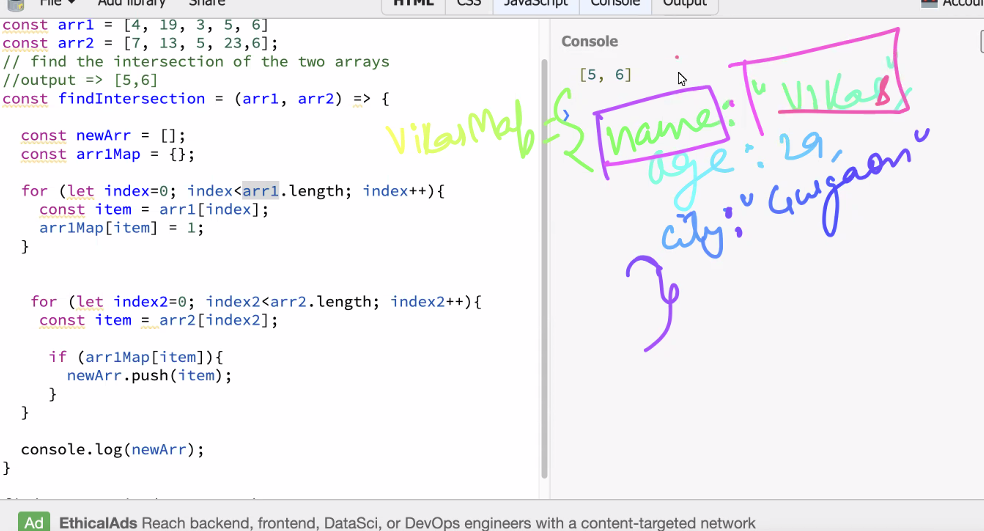
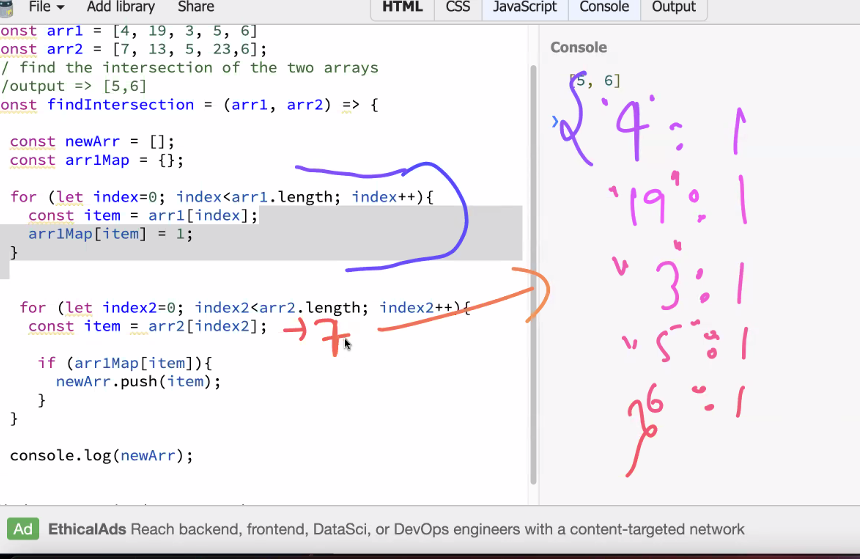
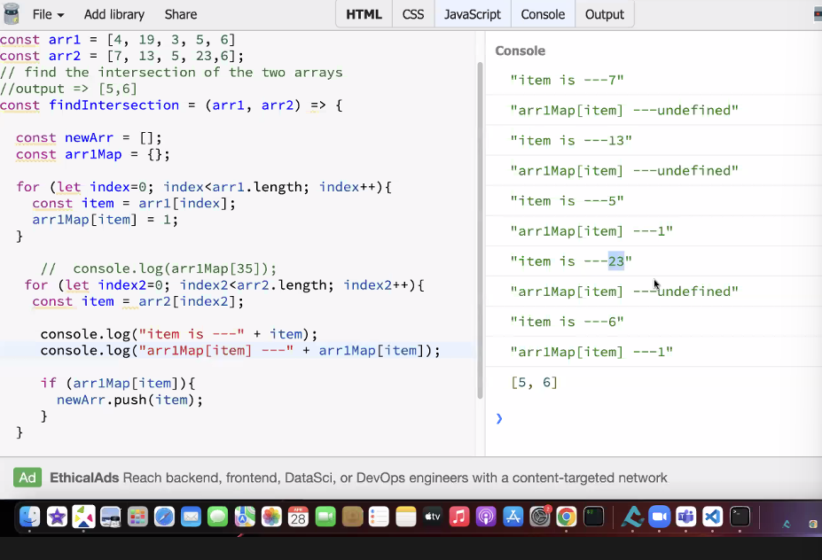
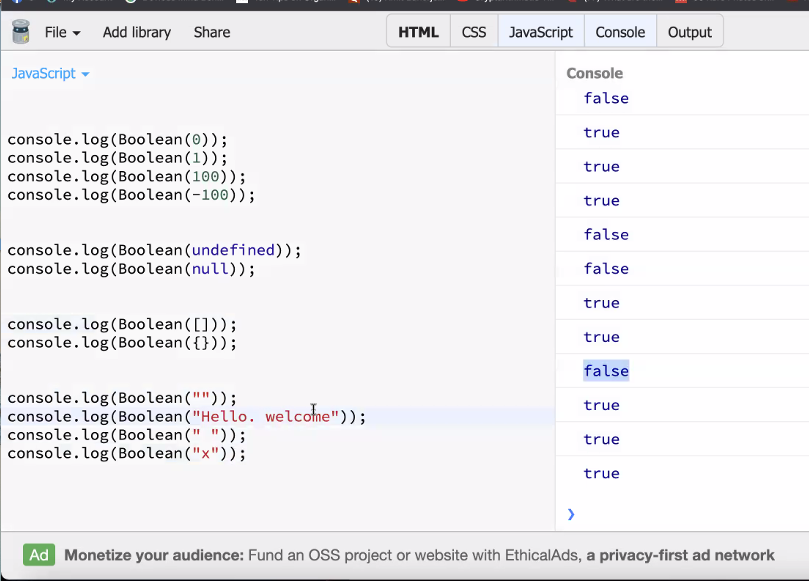

### Intersection of 2 arrays 
> map is a key value pair 
in the first loop we get this 


- first loop we traverses over the arr1 and logs these values in the map 


- in the second loop it traverses over the arr2, if 7 existed in map it existed in arr1 
if it exists we need to push it to the arr1Map

- it the item exists in both arrays. it will be logged inside arr1Map and we push it to newArr 


### random stuff to remember 

```bash
# boolean("") - empty string returns false 
# boolean(0) returns false 
# boolean(undefined) returns false 
# boolean(null) returns false 
```
### Merge 2 sorted arrays 
```bash
# these are sorted arrays, we want the merged output array as sorted
const arr1 = [3, 6, 8, 9]
const arr2 = [4, 6, 7, 10, 11]

# possibiltiies of merging
# print with duplicates:[3,4,5,6,6,7,8,9,10,11]
# print without duplicates:[3,4,5,6,7,8,9,10,11]

# were merging with duplicates 
const mergeArrays = (arr1, arr2) => {
    const newArr = [];

    # if arr[i]<arr[j], push arr[i] to new array 
    # else if arr[j]<arr[i], then we'll push arr[j] to new array 
    # we'll continue this, until any one array is exhausted 

    const p1 = 0; #pointer for arr1
    const p2 = 0; #pointer for arr2

    while(p1 <arr1.length && p2<arr2.length){
        if(arr1[p1]<arr2[p2]){
            newArr.push(arr1[p1])
            p1++
        }else {
            newArr.push(arr2[p2])
            p2++
        }
    }
    console.log(newArr)
}

# when one array is exhausted there are still some elements left either in arr1 or arr2, in that case, we'll be placing the elements in the right position of the newArr because we require it to be soryed 
if(p1<arr1.length){
    while(p1<arr1.length){
        newArr.push(arr1[p1])
        p1++
    }
}

if(p2<arr2.length){
    while(p2<arr2.length){
        newArr.push(arr2[p2])
        p2++
    }
}

mergeArrays(arr1, arr2)

console:
# [3,4,5,6,6,7,8,9,10,11]
Array(9)
0: 3
1: 4
2: 6
3: 6
4: 7
5: 8
6: 9
7: 10
8: 11
length: 9
[[Prototype]]: Array(0)

# best case - it runs atleast until one array is exhausted -> O(n)
# worst case - n+m --> O(n)
```
### Rotate an array 'k' times clockwise 
<!-- input: [1, 7, 10, 3, 25, 9] 
Dividing in 2 halves in every iteration - logn
            [1,7,10] [3,25,9] 
            [1,7][10] [3,25][9] -
            [1] [7] [10] [3] [25] [9]

merging -- O(n)      
            [1,7] [3,10] [9,25]
            [1,3,7,10] [9,25]
            [1,3,7,9,10,25]

divide + merge -> O(n logn)
-->
```bash
const arr = [3, 7, 10, 6, 4, 21]
# rotate it 2 times clockwise 
# after 1 rotation: 7, 10, 6, 4, 21, 3
# after 2 rotation: 10, 6, 4, 21, 3, 7
# after 3 rotation: 6, 4, 21, 3, 7, 10 
# after 4 rotation: 4, 21, 3, 7, 10, 6
# after 5 rotation: 21, 3, 7, 10, 6, 4
# after 6 rotation: 3, 7, 10, 6, 4, 21 

# after you rotate 6 times, it comes back to the original array 
# when k=3, we want to rotate the array 3 times
```
```bash
class Solution {
public:
    void reverse(vector<int>& nums, int low, int high) {
        while(low<high){
            swap(nums[low], nums[high]);
            low++;
            high--;
        }
    }


void rotate(vector<int>&nums, int k){
        int n = (int)nums.size();
        k = k%n;
        reverse(nums, 0, n-k-1);
        reverse(nums, n-k, n-1);
        reverse(nums, 0, n-1);
    }
    
};
```


