### Maps
map is an object in JS 

> Datatypes in JS
- arrays
- number
- boolean
- string
- null
- undefined 

In JS, an object has a type object 
an object in JS is a datatype that points to a memory location 
```bash
# pass by value - copies value - both and b point to diff memory location 
let a = 23
let b = a 

b = 26
console.log(b) #26
console.log(a) #23 

# pass by reference - both a and b point to same memory location 
# b is a shallow copy of a - point to same memory location 
let a = {"name":"vikas", age:29}
let b = a
b.name = 'anul'
console.log(b) #"name":"anul", age:29
console.log(a) #"name":"anul", age:29

# deep copy - create a copy/replica of an object and pointing to a diff memory location, such that 
# when we change b it doesnt change a 
let a = {"name":"vikas", age:29}
let b = {...a}
b.name = 'anul'
console.log(b) #"name":"anul", age:29
console.log(a) #"name":"vikas", age:29
```
its a datatype and can store a key-value pair like a map 
```bash
const tutor = {
    name: "vikas",
    age: 29,
    displayName: () => {
        console.log(this.name)
    }
    }
```

### JS Interview Questions 
> Q1. What output will this return on console
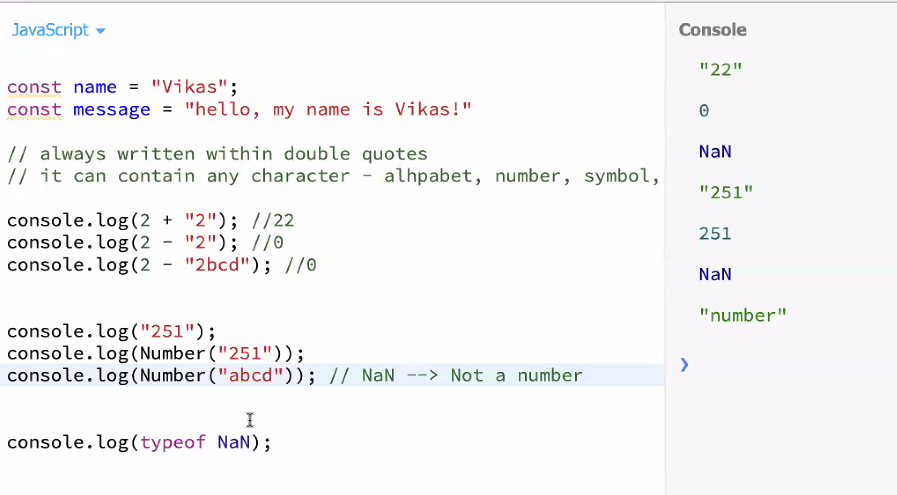
- something that cant be converted to number will give NAN, if you can convert it to number it will give the number 
- String is immmutable/not changable in JS 
```bash
# you can assign a new value, however you cant change it in the same memory location
const arr = [1,2,3,4,5]

# assigning value 
arr[2] = 7
console.log(arr) #1,2,7,4,5

const name = 'reem'
console.log(name.length) #4
console.log(name[0])     #r
console.log(name[3])     #m

# changing value is not possible
name[2] = 'x'
console.log()            #reem
```
> Q2.Reverse the whole string 'i love my india'
```bash
const str = 'i love my india'
'aidni ym evol i"
```
> understanding split 
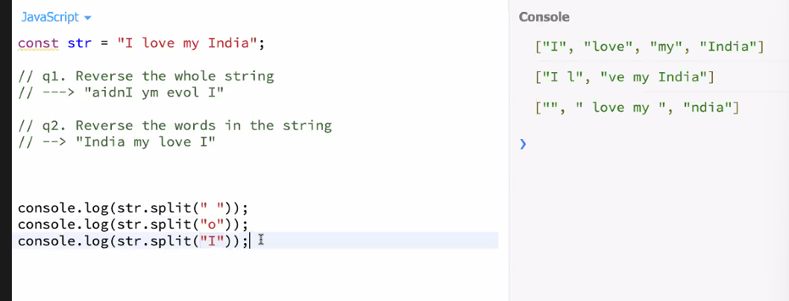

- using predefined methods 
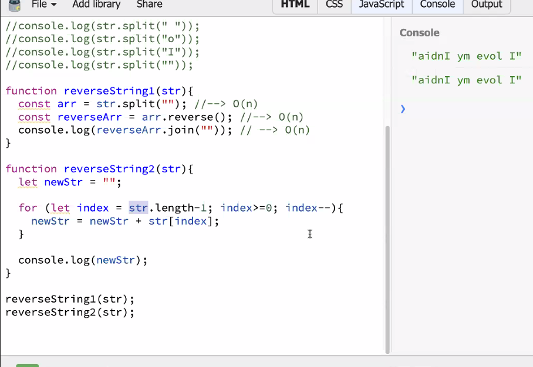
```bash
first method - split each letter by letter (split based on no space), reverse all the letters and join string 
second method for reversing the string is better in terms of time complexity 
```
> Q3. reverse words in the string 'i love my india'
```bash
const str = 'i love my india'
"india my love i" 
```
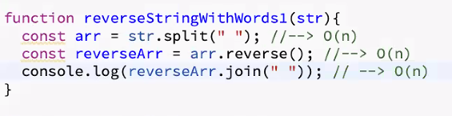
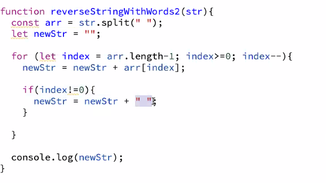
```bash
In second method, 
we added the if(index!=0) condition because we wanted to get rid of the extra spaces at end of the string 
we didnt want this "india my love i "
```
> Q4. reverse individual words in the string 'i love my india'
```bash
const str = 'i love my india'
"i evol ym aidni" 

we'll split each letter, reverse and join then we'll reverse the string based on spaces 
```
```bash
console.log(str.split("").reverse().join("").split(" ").reverse().join(" "))
```
> Q5. Given 2 words check whether they anagrams or not 
```bash
ANAGRAM
# every letter existing in word1 exists in word2 
Listen -> Silent
```
```bash
<script>
# JavaScript program to check whether two strings
# are anagrams of each other
 
    /* function to check whether two strings are
    anagram of each other */
    function areAnagram(str1,str2)
    {
        # Get lengths of both strings
        let n1 = str1.length;
        let n2 = str2.length;
   
        # If length of both strings is not same,
        # then they cannot be anagram
        if (n1 != n2)
            return false;
   
        # Sort both strings
        str1.sort();
        str2.sort()
   
        # Compare sorted strings
        for (let i = 0; i < n1; i++)
            if (str1[i] != str2[i])
                return false;
   
        return true;
    }
     
    /* Driver Code*/
    let str1=['t', 'e', 's', 't' ];
    let str2=['t', 't', 'e', 'w' ];
     
    # Function Call
        if (areAnagram(str1, str2))
            document.write("The two strings are"
                               + " anagram of each other<br>");
        else
            document.write("The two strings are not"
                               + " anagram of each other<br>");

</script>
```
> Q6. Given a string how will you check if it contains duplicate character and print the ch that occurs max number of times 
```bash
# traverse through string take every ch and place it in a map 
# were keeping a track of the count/ frequency of every word

const str = "abcdeffcdghde"
const maxChar = (str) => {
    const freqObj = {}
    for(index=0; index<str.length; index++){
        const char = str[index]

        if(!freqObj[char]){
            freqObj[char] = 1
        }else{
            const freq = freqObj[char]
            freqObj[char] = freq+1
        }
    }

    const MAX_FREQ = 0
    const MAX_FREQ_LETTER = ""

    console.log(Object.keys(freqObj))
}

maxChar(str)
```
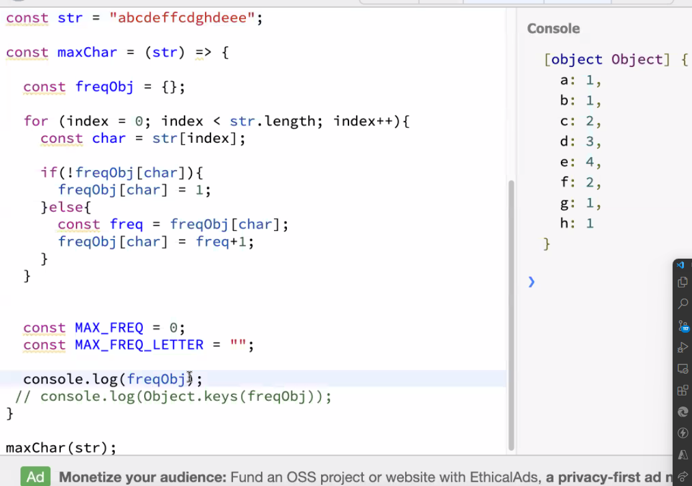

> object.keys stores the keys in an array 
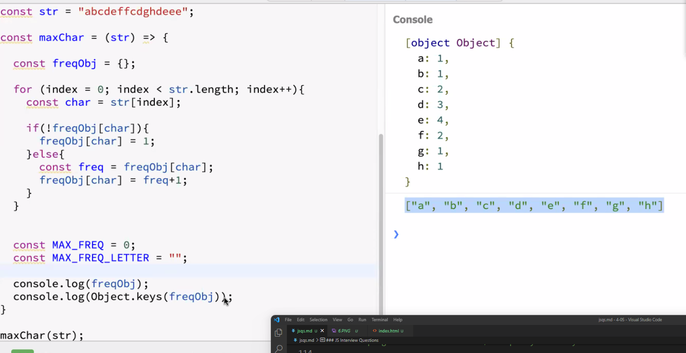

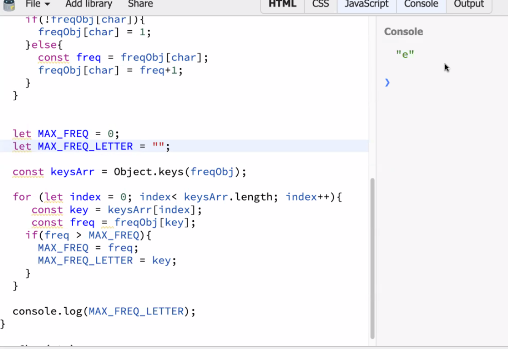
```bash
MAX_FREQ holds the value 
MAX_FREQ_LETTER holds the key 

keys array holds keys in the form of array 
freq stores the value of key 

max freq is stored in MAX_FREQ 
```
> Q. In any string, print top k character that occurs max number of times 
```bash
# hints 
const str = 'abcadcbcaad'

1. create map 
After creating a map this is what will be returned 
{
    "a":4
    "b":2
    "c":3
    "d":2
    "e":1
}

return k characters with maximum occurance
if k=1; return a (were returning the character with max occurance)
if k=2; return [a,c]
if k=3 return [a,c,b]

Drawback: map cannot give a particular order, it can keep a log of values and its occurance

2. create Data Structure 
If we can maintain a DS (like array/stack/ heap/ priorty queue/ heap), sorted in the occurance of their frequency
 where we can maintain the arranged elements like 
a, c, b, d, e

3. Return the k'th occuring value 
such that; 
when we enter k=1, it returns [a]
when we enter k=2, it returns [a,c]
when we enter k=3, it returns [a,c,b]
``` 

> Q. Find the missing number from the array [LOGIC BASED QS]
```bash
missing numbers: 7+8 = 15
there are 2 numbers that can sum upto 15, however, we dont know what it is so we take it as x and y 

x+y = 15 --------equation 1

we divide multiplication of all elements till 10 / all elements in array * x*y = this gives us both elements that constitute to form a sum of 15

we know that the elements 7*8 = 56
thats how we formed the second equation
x*y = 56 -------equation 2

we use equation1 and equation2 to solve the problem
```
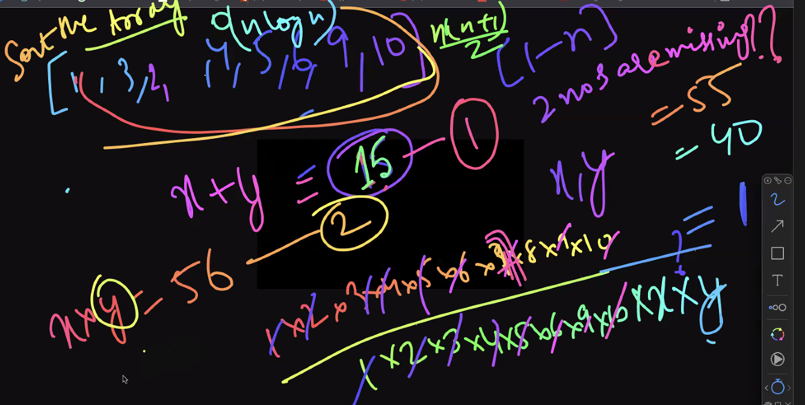
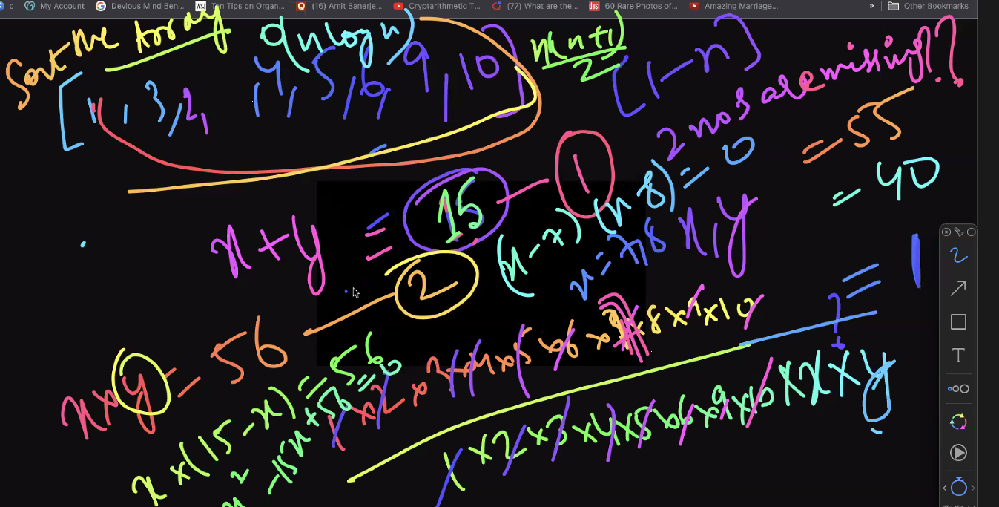

> Q. Maximum Sub array / Highest contiguos sub array - we need to return the sum of a contiguous subarray 
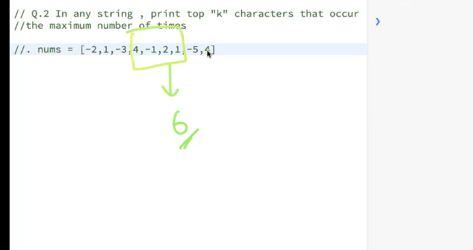
```bash
arry should be contiguous
it should be sub array of the main array 

# 0  1   2  3   4  5  6   7  8
[-2, 1, -3, 4, -1, 2, 1, -5, 4]
# 1. First approach - O(n^3)
# compute every single subarray for every number in the array 

# i is used to calculate the left most index starting point of the max subarray 
i ranges from 0 to n-1 
# j is used to calculate the right most index ending point of the max subarray 
  j ranges from i to n-1 
    k ranges from i to j 
    # where i is the left inddex of the starting of the max subarray
    # where j is the right index of the ending of the max subarray
      compute sum 

# 2. second approach - O(n^2)
maxSub = nums[0] 
currSum = 0 

# i - left most index 
i from 0 to n-1 
# j - right most index 
  j from i to n-1
    curSum + num[j]
    # anytime we find currSum is greater than max, we update the max 
    maxSub = max(maxSub, curSum)
```
```bash
# 3. third approach - O(n)
were ignoring the first negative value 
were ignoring any sum that equals negative value 
were computing the sum 

# python
class Solution:
       def maxSubarray(self, nums:List[int]) -> int:
           maxSub = nums[0]
           currSum = 0 

           for n in nums:
              if currSum < 0:
                 currSum = 0 
              currSum = currSum + n 
              maxSub = max(maxSub, currSum)
            return maxSub
```
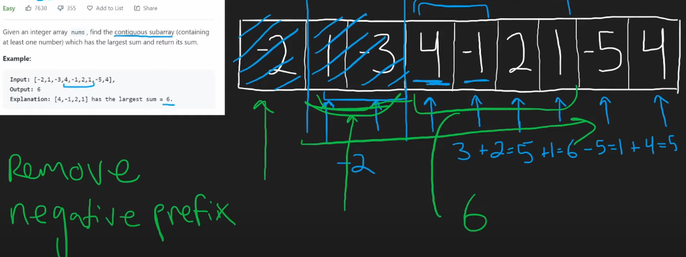

> Optimized solution (O(n)) in JS 
```bash
const nums = [-2, 1, -3, 4, -1, 2, 1, -5, 4]

const maximumSum = (arr) => {
    let MAX = Number.NEGATIVE_INFINITY
    let currSum = 0 
    for(let index = 0; index<arr.length; index++){
        currSum = currSum + arr[index]

# if we found a subarray sum which is less than the negative infinity  
        if(MAX < currSum){
            # then update the max to that subarray sum 
            MAX = currSum
        }

# if subarray sum is in the negatives, then set the currSum to 0
        if(currSum < 0){
            currSum = 0 
        }
    }
    console.log(MAX)

}

maximumSum(nums)
```
> find the length of longest consecutive subsequence such that elements in subsequence are consecutive integers, the consecutive numbers can be in any order 
```bash
Input: arr[] = {1, 9, 3, 10, 4, 20, 2}
Output: 4
Explanation: 
The subsequence 1, 3, 4, 2 is the longest 
subsequence of consecutive elements

Input: arr[] = {36, 41, 56, 35, 44, 33, 34, 92, 43, 32, 42}
Output: 5
Explanation: 
The subsequence 36, 35, 33, 34, 32 is the longest 
subsequence of consecutive elements.

# approach - O(n logn)
for example, this is the arr[] = {1, 9, 3, 10, 4, 20, 2}
1. sort the elements in array [1, 2, 3, 4, 9, 10, 20]
2. check if arr[i+1]-arr[i] = 1 #because we want the adjacent element 
         then add maxlength by 1 #maxlength is basically the count of the longest consecutive subsequence/subarray
   otherwise, update currlength value to 1
4. if currlength bigger than max length then update the max length 
```
```bash
# another approach - O(n)
# problem?
# this apporach only works in JS, cannot be used in another languages, thats why its not accepted in interviews 
```
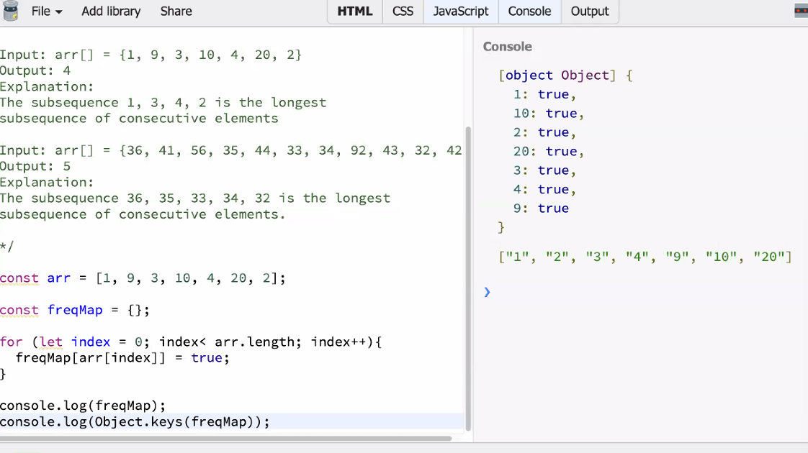
```bash
# create map 
# after creating the map, traverse the array
# for any subsequence, iterate over the array and check for any index -> arr[index] check if arr[index]-1 exists in the map 

# if for arr[index] , arr[index-1] doesnt exist, then we'll 
# -maintain curr count
# -maintain currSum which keeps 

const arr = {1, 9, 3, 10, 4, 20, 2}

const maxConSubsequence = arr => {
        const freqMap = {}
        for(let index=0; index<arr.length; index++){
            freqMap[arr[index]] = true
        }
        console.log(freqMap)

        for(let index=0; index<arr.length; index++){
            const currSum = 0 
            let MAXSUM = Number.NEGATIVE_INFINITY

            const num = arr[index] - 1
            # checking if arr[index-1]  exists in the arr {1, 9, 3, 10, 4, 20, 2} or not 
            # for example, for 0th index, element is 1, it'll check if 0 exists in array or not, it doesnt 
            # similarly, for 1st index, element is 9, it'll check is 8 exists in array or not 
            # similarly for 2nd index, element is 3, it checks if 2 exists in array or not 

            # if num doesnt exist in arr 
            if(!freqMap[num]){
            let curr = 1
            
            # then check for arr[index]+1
            while(freqMap[index] + curr){
                currSum = currSum + 1
                curr++
                # currSum is updated by 1 
                # everytime we encounter an element in the arr, we try to check if the direct subsequent element is present inside the array 
                # we increement the curr counter by 1 
                if(MAXSUM < currSum){
                    MAXSUM = currSum
                }
            }

            }
        }       
        console.log(MAXSUM)
    }
# for example, 1 is at 0th index, 
# it enters this condition and increements currSum to 2, which is present in arr, curr++ -> curr=2
# and then currSum=2+1=3, 3 is present in the array, which is present in arr, curr++ -> curr=3
# and then currSum=3+1=4, 4 is present in the array, which is present in arr, curr++ -> curr=4
# and then currSum=4+1=5, 5 is not present in the array 

# initially MAXSUM holds the value of negative infinity 
# since negative infinity is less than currSum, we assign currSum the value of 4, and MAXSUM is assigned the value of 4 
```
### Recursion 
When a function calls itself 
alternative to loops 
```bash
main(5)
function main(num){
    const newNum = num+2
    console.log(newNum)
    # over here, were calling function f2 from f1 
    # however, we can also call the function from itself 
    subfn(newNum)       #7
}

function subFn(num){
    console.log(num+10) #17                      #27           #37           #47        ... similarly, #97        #107    

    if(num < 100){      #17<100✅                #27<100✅     #37<100✅    #47<100❎                #97<100✅  #107<100❌
        subfn(num)      #call the function again 
    }
}
# recursion must have a break/base condition, similar to which we have in loops 
```
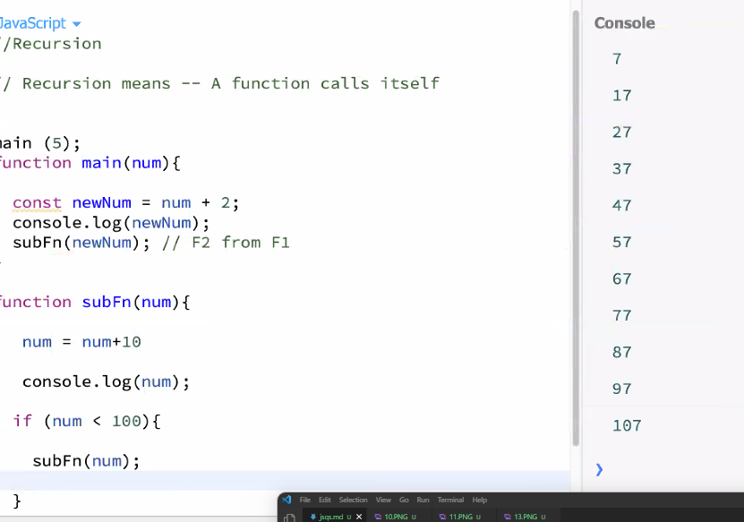

> execution in callstack 
```bash
.
.
.
----
subfn #new instance subfn - 37
----
subfn #new instance subfn - 27
----
subfn #new instance of subfn will be executed - 17
----
subfn #new instance of the same function will be executed - 7
----
subfn
----
main

# after execution is completed, it will get dissolved in LIFO approach 
```

> print numbers from 1 to 20 without using loops 
```bash
const print = num => {
    if(num>20){   
        return;
    }
    else{
        console.log(num)   
        print(num+1)      
    }
}

print(1)

console:
# 1 to 20 
```
```bash
const print = num => {
    if(num>3){                     #1>3     #2>3    #3>3    #4>3
        return;                    #nope   #nope    #nope   #undefined
    }
    else{  
        const value = print(num+1) 
        console.log(value)         #1      #2        #3
        return num                  
    }
}

const val = print(1)               
console.log(val)

console:
undefined
3
2
1
```
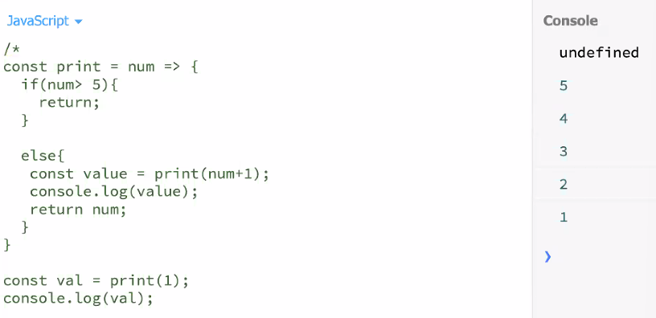

### Time & Space complexity of recursion
> Time complexity of recursion is O(n). but it takes lots of space, cs its in a stack, so it stores all instances of the function that is called over again.
> space complexity: intermittently occupies space of O(n), after the program is executed it frees up the space 

### Questions on recursion
> Q. Given a number n, print its factorial
```bash
const factorial = num => {
    if(num == 0 || num==1){
        return 1
    }
    return num * factorial(num-1)
}

console.log(factorial(5))
```

> Q. write a program to [rint first 20 fibonnaci numbers using recursion
```bash

```


> Todo list:
- tmw 11am lecture 
- how to take inputs in JS - simon boilerplate understand 
- complete test questions 
- consecutive subsequence
- complete lecture 
- In any string, print top k character that occurs max number of times 
- max frequency from 05/05


