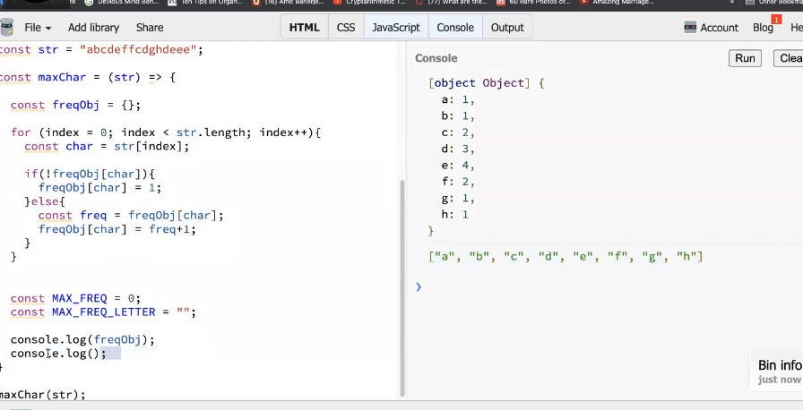
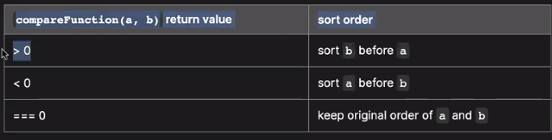

### Maps
map is an object in JS - Data structure 

> Datatypes in JS
- arrays
- number
- boolean
- string
- null
- undefined 

```bash
In JS, an object has a type object 
Array has a type object 
Null also has a type object 
```
an object in JS is a datatype that points to a memory location 
```bash
# pass by value - copies value - both and b point to diff memory location 
let a = 23
let b = a 

b = 26
console.log(b) #26
console.log(a) #23 

# pass by reference - both a and b point to same memory location 
# b is a shallow copy of a - point to same memory location / reference 
let a = {"name":"vikas", age:29}
let b = a
b.name = 'anul'
console.log(b) #"name":"anul", age:29
console.log(a) #"name":"anul", age:29

# deep copy - create a copy/replica of an object and pointing to a diff memory location, such that 
# when we change b it doesnt change a 
let a = {"name":"vikas", age:29}
let b = {...a} #spread operator - allows to create replica of object 
b.name = 'anul'
console.log(b) #"name":"anul", age:29
console.log(a) #"name":"vikas", age:29
```
its a datatype and can store a key-value pair like a map 
```bash
const tutor = {
    name: "vikas",
    age: 29,
    displayName: () => {
            console.log(this.name)
        }
    }

# Printing operations 
#1. DOT operator 
console.log(human.age)  #29 
console.log(human.name) #vikas

# if you want to delete 
delete human.name

#2. Square bracket operator 
console.log(human['age'])
console.log(human['name'])
# for deleting
delete human['name']


# HOW DO WE ACCESS IN A MAP?
const key = getKey();
# when a key is dyanamic in the variable, we access it like this
# this is the way we access in a map 
console.log(human[key])
# use this for deleting 
delete [human[key]]

const getKey = () => {
    return 'isIndian';
}

```
> count elements in array and add to map without for loop 
```bash
const arr = ["a", "b","c","d","a"]
const freqMap = {}
freqMap['a'] = freqMap['a'] + 1
freqMap.b = 1 
console.log(freqMap)

# output:
[object Object] {
    a: 2,
    b: 1
}
```
> count elements in array and add to map with a for loop 
```bash
const arr = ["a", "b","c","d","a"]
const freqMap = {}

for(let i = 0 ; i< arr.length; i++){
    const key = arr[index]
    # check if key exist in arr or not 

    # if key doeesnt exist in the map then add it 
    if(!freqMap[key])
    { 
       freqMap[key] = 1

    }else{
        #if key already exists in the map then increement its count by 1
        freqMap[key] = freqMap[key] + 1
    }
}
console.log(freqMap)

# output:
[object Object] {
    a: 2,
    b: 1
}
```
> advantages of creating a map:
1. search in an array would be O(n). search in a map is O(1)
2. array can have duplicates. map cannot have duplicate

> Q. Given an array and a constant k, find any pair of x and y where x+y = k
```bash
# O(n)

const k = 16
const arr = [3, 7, 9, 14, 10, 16, 2, 12, 19]
# for every number in the array were checking if its pair exists in the arr or not?
# when k = 16, we need to find those numbers that sum up to 16
# we acheive this, by adding all the values that dont satisfy the condition in a map, and fetch the rest 

i   |   arr[i]   |   k-arr[i]   |   Does k-arr[i] exist in map or not? | add arr[i] in map           
0   |   3        |   16-3=13    |   ❌                                 | {"3" : 1}                    
1   |   7        |   16-7=9     |   ❌                                 | {"3": 1, "7" : 1}            
2   |   9        |   16-9=7     |   ✅ print(arr[i], k-arr[i]) -> 9,7                                                      
3   |   14       |   16-14=2    |   ❌                                 | {"3": 1, "7" : 1, "14": 1 }
4   |   10       |   16-10=6    |   ❌                                 | {"3": 1, "7" : 1, "14": 1, "10": 1}
5   |   16       |   16-16=0    |   ❌                                 | {"3": 1, "7" : 1, "14": 1, "10": 1, "16": 1}
6   |   2        |   16-2=14    |   ✅ print(arr[i], k-arr[i]) -> 2,14                                                        
7   |   12       |   16-12=4    |   ❌                                 | {"3": 1, "7" : 1, "14": 1, "10": 1, "16": 1, "!2":1}
8   |   19       |   16-19=-3   |   ❌                                 | {"3": 1, "7" : 1, "14": 1, "10": 1, "16": 1, "!2":1, "19":1}
```
```bash
const getPairs = (arr, k) => {
    const tempMap = {}
    const pairsArr = []

    for(let index = 0; index < arr.length; index++){
        const item = arr[index]          
        const pairItem = k - arr[index]

        #if k-arr[i] exists in the map, then push them to the pairsArr[]
        if(tempMap[pairItem]){
            console.log(item, pairItem)
            pairsArr.push([item, pairItem])
        }
        #k-arr[i] does not exist in the map, then push it to the map 
        else{
            tempMap[item] = 1
        }
    }
    console.log(tempMap)
}

# output:
[[9, 7], [2, 14]]
```
### JS Interview Questions 
> Q1. What output will this return on console

- something that cant be converted to number will give NAN, if you can convert it to number it will give the number 
- String is immmutable/not changable in JS 
```bash
# you can assign a new value, however you cant change it in the same memory location
const arr = [1,2,3,4,5]

# assigning value 
arr[2] = 7
console.log(arr) #1,2,7,4,5

const name = 'reem'
console.log(name.length) #4
console.log(name[0])     #r
console.log(name[3])     #m

# changing value is not possible
name[2] = 'x'
console.log()            #reem
```
> Q2.Reverse the whole string 'i love my india'
```bash
const str = 'i love my india'
'aidni ym evol i"
```
> understanding split 


- using predefined methods 

```bash
first method - split each letter by letter (split based on no space), reverse all the letters and join string 
second method for reversing the string is better in terms of time complexity 
```
> Q3. reverse words in the string 'i love my india'
```bash
const str = 'i love my india'
"india my love i" 
```


```bash
In second method, 
we added the if(index!=0) condition because we wanted to get rid of the extra spaces at end of the string 
we didnt want this "india my love i "
```
> Q4. reverse individual words in the string 'i love my india'
```bash
const str = 'i love my india'
"i evol ym aidni" 

we'll split each letter, reverse and join then we'll reverse the string based on spaces 
```
```bash
console.log(str.split("").reverse().join("").split(" ").reverse().join(" "))
```
> Q5. Given 2 words check whether they anagrams or not 
```bash
ANAGRAM
# every letter existing in word1 exists in word2 
Listen -> Silent
```
```bash
<script>
# JavaScript program to check whether two strings
# are anagrams of each other
 
    /* function to check whether two strings are
    anagram of each other */
    function areAnagram(str1,str2)
    {
        # Get lengths of both strings
        let n1 = str1.length;
        let n2 = str2.length;
   
        # If length of both strings is not same,
        # then they cannot be anagram
        if (n1 != n2)
            return false;
   
        # Sort both strings
        str1.sort();
        str2.sort()
   
        # Compare sorted strings
        for (let i = 0; i < n1; i++)
            if (str1[i] != str2[i])
                return false;
   
        return true;
    }
     
    /* Driver Code*/
    let str1=['t', 'e', 's', 't' ];
    let str2=['t', 't', 'e', 'w' ];
     
    # Function Call
        if (areAnagram(str1, str2))
            document.write("The two strings are"
                               + " anagram of each other<br>");
        else
            document.write("The two strings are not"
                               + " anagram of each other<br>");

</script>
```
> Q6. Given a string how will you check if it contains duplicate character and print the ch that occurs max number of times 
```bash
# traverse through string take every ch and place it in a map 
# were keeping a track of the count/ frequency of every word

const str = "abcdeffcdghde";

const maxChar = (str) => {
    # we created a map -> freqObj
    const freqObj = {}

    for(index=0; index<str.length; index++){
        # stores every character from the string 
        const char = str[index]

        # if the ch does not exist in the map 
        # then create a new key in the map and assign frequency value as 1 
        # since its the first time the character is been encountered 
        if(!freqObj[char]){
            freqObj[char] = 1
        }else{
        # if ch exists in the map, then get the old frequency
        # and update it by 1 
            const freq = freqObj[char]
            freqObj[char] = freq+1
        }
    }

    let MAX_FREQ = 0
    let MAX_FREQ_LETTER = ""

    console.log(freqObj) #this will return the entire map i.e key and value pairs 

    # Object.keys returns array of all the keys 
    const keysArr = console.log(Object.keys(freqObj))

    for(let index = 0; index < keysArr.length; index++){
        # each key from keysArr stored inside key, at every iteration 
        const key = keysArr[index]

        # it will store the value of the key inside freq 
        const freq = freqObj[key]

        # on every iteration of the keysArr
        # check if this frequency is greater than max freq
        if(freq > MAX_FREQ){
            MAX_FREQ = freq 
            MAX_FREQ_LETTER = key
            # store the MAX occuring key in this variable 
        }
    }
    console.log(MAX_FREQ_LETTER)  # e
}

maxChar(str)
```


> object.keys stores the keys in an array 


```bash
MAX_FREQ holds the value 
MAX_FREQ_LETTER holds the key 

keys array holds keys in the form of array 
freq stores the value of key 

max freq is stored in MAX_FREQ 
```
> Q. In any string, print top k character that occurs max number of times 
```bash
# hints 
const str = 'abcadcbcaad'

1. create map 
After creating a map this is what will be returned 
{
    "a":4
    "b":2
    "c":3
    "d":2
    "e":1
}

return k characters with maximum occurance
if k=1; return a (were returning the character with max occurance)
if k=2; return [a,c]
if k=3 return [a,c,b]

Drawback: map cannot give a particular order, it can keep a log of values and its occurance

2. create Data Structure 
If we can maintain a DS (like array/stack/ heap/ priorty queue/ heap), sorted in the occurance of their frequency where we can maintain the arranged elements like 
a, c, b, d, e

3. Return the k'th occuring value 
such that; 
when we enter k=1, it returns [a]
when we enter k=2, it returns [a,c]
when we enter k=3, it returns [a,c,b]
``` 
```bash
let kOccurance=(arr,k)=>{
let obj={}
arr.forEach((el)=>{
obj[el]=obj[el]+1||1;

})
let obj2={};
for(let i in obj){
obj2[obj[i]]=i;
}
let result=[];
let keysArr=[...Object.values(obj2)]
while(k>0){
result.push(+keysArr.pop());
k--;
}
return result;
}

console.log(kOccurance([1, 4, 4, 4, 2, 2, 2, 5, 5, 5, 5, 5, 7, 7, 8, 8, 8, 8],3))
```

> the explanation:
```bash
let kOccurance=(arr,k)=>{
    // we create a map 
    let obj={}

    // iterate over every element of the arr and assign a count to each value in the form of key-value pairs 
    //  0  1  2  3  4  5  6  7  8  9 10  11 12 13 14 15 16 17
    // [1, 4, 4, 4, 2, 2, 2, 5, 5, 5, 5, 5, 7,  7, 8, 8, 8, 8]
    arr.forEach((el)=> {
        console.log(el)
        console.log('before'+ obj[el])
        obj[el]= obj[el]+1 || 1;
        console.log('after' + obj[el])

    })
    console.log('obj', obj)

    let obj2={};
    for(let i in obj) {
       console.log('obj[i] before' + obj[i])
       console.log('i before' + i)
       obj2[obj[i]]= i;
       console.log('obj[i] after' + obj[i])
       console.log('i after' + i)
       console.log('obj2[obj[i]]' + obj2[obj[i]])
       console.log('obj2[obj[i]] = i' + obj2[obj[i]] + "=" + i)
    }
    console.log('obj2', obj2)

    let result=[];
    let keysArr=[...Object.values(obj2)]
    console.log('keysArr' + keysArr)

    while(k>0) {
    console.log('k' + k)
    console.log('before result' + result)
    result.push(+keysArr.pop());
    console.log('after result' + result)
    k--;
    }
    return result;
}

console.log(kOccurance([1, 4, 4, 4, 2, 2, 2, 5, 5, 5, 5, 5, 7, 7, 8, 8, 8, 8], 3))

# main output:
Array(3)
0: 5
1: 8
2: 4
length: 3
[[Prototype]]: Array(0)
```
> the working 
```bash
# The working:
we create a map obj{} inside which we insert every element of the array along with its corresponding count 
{
    "1": 1,
    "4": 3,
    "2": 3,
    "5": 5,
    "7": 2,
    "8": 4
}

However, notice that all these keys must first be arranged in ascending order to extract the keys from the rhs most side of the array, because  we need to return k characters with maximum occurance 

we need to first arrange these keys on basis of increasing order of their values ->  [1,7,2,4,8,5]
to acheive this we'll create a map obj2{}
we'll simply add elements from obj1{} to obj2{} in the ascending order 

In this case, k=3, so we need to return [5, 8, 4]
so we'll run a while loop traversing till k, pop all the elements from the end of the obj2{} and add it to the result array, and then we'll simply display the result 
```
> detailed explanation
```bash
#In detail explanation,
let kOccurance=(arr,k)=>{
    let obj={}
    arr.forEach((el)=> {
        console.log(el)
        console.log('before'+ obj[el])
        obj[el]= obj[el]+1 || 1;
        console.log('after' + obj[el])

    })
    console.log('obj', obj)

    let obj2={};
    for(let i in obj) {
       console.log('obj[i] before' + obj[i])
       console.log('i before' + i)
       obj2[obj[i]]= i;
       console.log('obj[i] after' + obj[i])
       console.log('i after' + i)
       console.log('obj2[obj[i]]' + obj2[obj[i]])
       console.log('obj2[obj[i]] = i' + obj2[obj[i]] + "=" + i)
    }
    console.log('obj2', obj2)

    let result=[];
    let keysArr=[...Object.values(obj2)]
    console.log('keysArr' + keysArr)

    while(k>0) {
    console.log('k' + k)
    console.log('before result' + result)
    result.push(+keysArr.pop());
    console.log('after result' + result)
    k--;
    }
    return result;
}

console.log(kOccurance([1, 4, 4, 4, 2, 2, 2, 5, 5, 5, 5, 5, 7, 7, 8, 8, 8, 8], 3))

#The Output: Detailed.
# ASSIGNING A COUNT TO EVERY ELEMENT IN THE ARRAY
koccurance.html:18 1               #first element of the array 
koccurance.html:20 beforeundefined #initial count is undefined because it doesnt exist in the map
koccurance.html:22 after1          #after counting, the count of 1 is 1 

koccurance.html:19 4               #second element of the array 
koccurance.html:20 beforeundefined #initial count is undefined because it doesnt exist in the map 
koccurance.html:22 after1          #after counting the count of 4 is 1 

koccurance.html:19 4               #third element of the array 
koccurance.html:20 before1         #count of 4 is 1
koccurance.html:22 after2          #after counting the third element the count of 4 is 2

koccurance.html:19 4
koccurance.html:20 before2
koccurance.html:22 after3          #final count of 4 is 3

koccurance.html:19 2
koccurance.html:20 beforeundefined
koccurance.html:22 after1

koccurance.html:19 2
koccurance.html:20 before1
koccurance.html:22 after2

koccurance.html:19 2
koccurance.html:20 before2
koccurance.html:22 after3          #final count of 2 is 3 

koccurance.html:19 5
koccurance.html:20 beforeundefined
koccurance.html:22 after1

koccurance.html:19 5
koccurance.html:20 before1
koccurance.html:22 after2

koccurance.html:19 5
koccurance.html:20 before2
koccurance.html:22 after3

koccurance.html:19 5
koccurance.html:20 before3
koccurance.html:22 after4

koccurance.html:19 5
koccurance.html:20 before4
koccurance.html:22 after5         #final count of 5 is 5 

koccurance.html:19 7
koccurance.html:20 beforeundefined
koccurance.html:22 after1

koccurance.html:19 7
koccurance.html:20 before1
koccurance.html:22 after2         #final count of 7 is 2

koccurance.html:19 8
koccurance.html:20 beforeundefined
koccurance.html:22 after1

koccurance.html:19 8
koccurance.html:20 before1
koccurance.html:22 after2

koccurance.html:19 8
koccurance.html:20 before2
koccurance.html:22 after3

koccurance.html:19 8
koccurance.html:20 before3
koccurance.html:22 after4         #final count of 8 is 4

# obj contains all the ELEMENTS MAPPED TO ITS COUNT IN A MAP 
# obj= {"1": 1, 
#       "2": 3, 
#       "4": 3, 
#       "5": 5, 
#       "7": 2, 
#       "8": 4
#}

obj Object
1: 1
2: 3
4: 3
5: 5
7: 2
8: 4[[Prototype]]: Object

# i      -> 1, 2, 4, 5, 7, 8   -> keys
# obj[i] -> 1, 3, 3, 5, 2, 4   -> values 
# NOTE THAT: from the obj{} map, keys are i and the values are obj[i]

# TRAVERSING OVER EVERY ELEMENTS INSIDE obj{} & ADDING ALL THE KEY-VALUE PAIRS OF THE ELEMENT AND ITS CORRESPONDING COUNT IN ASCENDING ORDER OF THE KEYS IN THE MAP obj2{}

# obj[i] -> 1, 3, 3, 5, 2, 4   -> values 
# i      -> 1, 2, 4, 5, 7, 8   -> keys

# the corresponding key for the value arranged in ascending order 
# obj2[obj[i]] = i
# obj2[1]      = 1
# obj2[3]      = 2
# obj2[3]      = 4
# obj2[5]      = 5
# obj2[2]      = 7
# obj2[4]      = 8

#Now arrange these in ascending order of keys and viola, you get the obj2{}

# obj2 
# Object
# 1: "1"
# 2: "7"
# 3: "4"
# 4: "8"
# 5: "5"
# [[Prototype]]: Object

koccurance.html:28 obj[i] before 1
koccurance.html:29 i before1
koccurance.html:31 obj[i] after1
koccurance.html:32 i after1
koccurance.html:33 obj2[obj[i]] 1
koccurance.html:34 obj2[obj[i]] = i 1=1

koccurance.html:28 obj[i] before3
koccurance.html:29 i before2
koccurance.html:31 obj[i] after3
koccurance.html:32 i after2
koccurance.html:33 obj2[obj[i]] 2
koccurance.html:34 obj2[obj[i]] = i 2=2

koccurance.html:28 obj[i] before3
koccurance.html:29 i before4
koccurance.html:31 obj[i] after3
koccurance.html:32 i after4
koccurance.html:33 obj2[obj[i]] 4
koccurance.html:34 obj2[obj[i]] = i 4=4

koccurance.html:28 obj[i] before5
koccurance.html:29 i before5
koccurance.html:31 obj[i] after5
koccurance.html:32 i after5
koccurance.html:33 obj2[obj[i]]5
koccurance.html:34 obj2[obj[i]] = i 5=5

koccurance.html:28 obj[i] before2
koccurance.html:29 i before7
koccurance.html:31 obj[i] after2
koccurance.html:32 i after7
koccurance.html:33 obj2[obj[i]]7
koccurance.html:34 obj2[obj[i]] = i 7=7

koccurance.html:28 obj[i] before4
koccurance.html:29 i before8
koccurance.html:31 obj[i] after4
koccurance.html:32 i after8
koccurance.html:33 obj2[obj[i]]8
koccurance.html:34 obj2[obj[i]] = i 8=8

obj2 Object
1: "1"
2: "7"
3: "4"
4: "8"
5: "5"
[[Prototype]]: Object

koccurance.html:41 keysArr 1,7,4,8,5 #Object.value contains an array of the values of the map obj2{}
# since the value of k we passed is 3, the while loop runs 3 times 
# and were fetching the values by popping it from the end of the keysArr and pushing it to the result array 
koccurance.html:42 k3
koccurance.html:43 before result
koccurance.html:45 after result  5

koccurance.html:42 k2
koccurance.html:43 before result 5
koccurance.html:45 after result  5,8

koccurance.html:42 k1
koccurance.html:43 before result 5,8
koccurance.html:45 after result  5,8,4

# the final output 
Array(3)
0: 5
1: 8
2: 4
length: 3
[[Prototype]]: Array(0)
```

> Q. Find the missing number from the array [LOGIC BASED QS]
```bash
missing numbers: 7+8 = 15
there are 2 numbers that can sum upto 15, however, we dont know what it is so we take it as x and y 

x+y = 15 --------equation 1

we divide multiplication of all elements till 10 / all elements in array * x*y = this gives us both elements that constitute to form a sum of 15

we know that the elements 7*8 = 56
thats how we formed the second equation
x*y = 56 -------equation 2

we use equation1 and equation2 to solve the problem
```


> Q. Maximum Sub array / Highest contiguos sub array - we need to return the sum of a contiguous subarray 

```bash
arry should be contiguous
it should be sub array of the main array 

# 0  1   2  3   4  5  6   7  8
[-2, 1, -3, 4, -1, 2, 1, -5, 4]
# 1. First approach - O(n^3)
# compute every single subarray for every number in the array 

# i is used to calculate the left most index starting point of the max subarray 
i ranges from 0 to n-1 
# j is used to calculate the right most index ending point of the max subarray 
  j ranges from i to n-1 
    k ranges from i to j 
    # where i is the left inddex of the starting of the max subarray
    # where j is the right index of the ending of the max subarray
      compute sum 

# 2. second approach - O(n^2)
maxSub = nums[0] 
currSum = 0 

# i - left most index 
i from 0 to n-1 
# j - right most index 
  j from i to n-1
    curSum + num[j]
    # anytime we find currSum is greater than max, we update the max 
    maxSub = max(maxSub, curSum)
```
```bash
# 3. third approach - O(n)
were ignoring the first negative value 
were ignoring any sum that equals negative value 
were computing the sum 

# python
class Solution:
       def maxSubarray(self, nums:List[int]) -> int:
           maxSub = nums[0]
           currSum = 0 

           for n in nums:
              if currSum < 0:
                 currSum = 0 
              currSum = currSum + n 
              maxSub = max(maxSub, currSum)
            return maxSub
```


> Optimized solution (O(n)) in JS 
```bash
const nums = [-2, 1, -3, 4, -1, 2, 1, -5, 4]

const maximumSum = (arr) => {
    let MAX = Number.NEGATIVE_INFINITY
    let currSum = 0 
    for(let index = 0; index<arr.length; index++){
        currSum = currSum + arr[index]

        # if we found a subarray sum which is less than the negative infinity  
        if(MAX < currSum){
            # then update the max to that subarray sum 
            MAX = currSum
        }

        # if subarray sum is in the negatives, then set the currSum to 0
        if(currSum < 0){
            currSum = 0 
        }
    }
    console.log(MAX)

}

maximumSum(nums)
```
> find the length of longest consecutive subsequence such that elements in subsequence are consecutive integers, the consecutive numbers can be in any order 
```bash
Input: arr[] = {1, 9, 3, 10, 4, 20, 2}
Output: 4
Explanation: 
The subsequence 1, 3, 4, 2 is the longest 
subsequence of consecutive elements

Input: arr[] = {36, 41, 56, 35, 44, 33, 34, 92, 43, 32, 42}
Output: 5
Explanation: 
The subsequence 36, 35, 33, 34, 32 is the longest 
subsequence of consecutive elements.

# approach - O(n logn)
for example, this is the arr[] = {1, 9, 3, 10, 4, 20, 2}
1. sort the elements in array [1, 2, 3, 4, 9, 10, 20]
2. check if arr[i+1]-arr[i] = 1  #because we want the adjacent element 
         then add maxlength by 1 #maxlength is basically the count of the longest consecutive subsequence/subarray
   otherwise, update currlength value to 1
4. if currlength bigger than max length then update the max length 
```
```bash
# another approach - O(n)
# problem?
# this apporach only works in JS, cannot be used in another languages, thats why its not accepted in interviews 
```

```bash
# create map 
# after creating the map, traverse the array
# for any subsequence, iterate over the array and check for any index -> arr[index] check if arr[index]-1 exists in the map 

# if for arr[index] , arr[index-1] doesnt exist, then we'll 
# -maintain curr count
# -maintain currSum which keeps 

const arr = {1, 9, 3, 10, 4, 20, 2}

const maxConSubsequence = arr => {
        const freqMap = {}
        for(let index=0; index<arr.length; index++){
            freqMap[arr[index]] = true
        }
        console.log(freqMap)

        for(let index=0; index<arr.length; index++){
            const currSum = 0 
            let MAXSUM = Number.NEGATIVE_INFINITY

            const num = arr[index] - 1
            # checking if arr[index-1]  exists in the arr {1, 9, 3, 10, 4, 20, 2} or not 
            # for example, for 0th index, element is 1, it'll check if 0 exists in array or not, it doesnt 
            # similarly, for 1st index, element is 9, it'll check is 8 exists in array or not 
            # similarly for 2nd index, element is 3, it checks if 2 exists in array or not 

            # if num doesnt exist in arr 
            if(!freqMap[num]){
            let curr = 1
            
            # then check for arr[index]+1
            while(freqMap[index] + curr){
                currSum = currSum + 1
                curr++
                # currSum is updated by 1 
                # everytime we encounter an element in the arr, we try to check if the direct subsequent element is present inside the array 
                # we increement the curr counter by 1 
                if(MAXSUM < currSum){
                    MAXSUM = currSum
                }
            }

            }
        }       
        console.log(MAXSUM)
    }
# for example, 1 is at 0th index, 
# it enters this condition and increements currSum to 2, which is present in arr, curr++ -> curr=2
# and then currSum=2+1=3, 3 is present in the array, which is present in arr, curr++ -> curr=3
# and then currSum=3+1=4, 4 is present in the array, which is present in arr, curr++ -> curr=4
# and then currSum=4+1=5, 5 is not present in the array 

# initially MAXSUM holds the value of negative infinity 
# since negative infinity is less than currSum, we assign currSum the value of 4, and MAXSUM is assigned the value of 4 
```
### Recursion 
When a function calls itself 
alternative to loops 
```bash
main(5)
function main(num){
    const newNum = num+2
    console.log(newNum)
    # over here, were calling function f2 from f1 
    # however, we can also call the function from itself 
    subfn(newNum)       #7
}

function subFn(num){
    console.log(num+10) #17                      #27           #37           #47        ... similarly, #97        #107    

    if(num < 100){      #17<100✅                #27<100✅     #37<100✅    #47<100❎                #97<100✅  #107<100❌
        subfn(num)      #call the function again 
    }
}
# recursion must have a break/base condition, similar to which we have in loops 
```


> execution in callstack 
```bash
.
.
.
----
subfn #new instance subfn - 37
----
subfn #new instance subfn - 27
----
subfn #new instance of subfn will be executed - 17
----
subfn #new instance of the same function will be executed - 7
----
subfn
----
main

# after execution is completed, it will get dissolved in LIFO approach 
```

> print numbers from 1 to 20 without using loops 
```bash
const print = num => {
    if(num>20){   
        return;
    }
    else{
        console.log(num)   
        print(num+1)      
    }
}

print(1)

console:
# 1 to 20 
```
```bash
const print = num => {
    if(num>3){                     #1>3     #2>3    #3>3    #4>3
        return;                    #nope   #nope    #nope   #undefined
    }
    else{  
        const value = print(num+1) 
        console.log(value)         #1      #2        #3
        return num                  
    }
}

const val = print(1)               
console.log(val)

console:
undefined
3
2
1
```


### Time & Space complexity of recursion
> Time complexity of recursion is O(n). but it takes lots of space, cs its in a stack, so it stores all instances of the function that is called over again.
> space complexity: intermittently occupies space of O(n), after the program is executed it frees up the space 

### Questions on recursion
> Q. Given a number n, print its factorial
```bash
const factorial = num => {
    if(num == 0 || num==1){
        return 1
    }
    return num * factorial(num-1)
}

console.log(factorial(5))
```

> Q. write a program to print fibonnaci numbers using recursion
- non recursive solution
```bash
# the fibonnacci series 
# 1, 1, 2, 3, 5, 8, 13 
#       |     |
#       1+1   |
#            2+3

function fib(n){
    # for 1st and 2nd ch number would be 1 
    if(n<3){
        return 1
    }

    let prev = 1
    let curr = 1

    for(let i=2; i<n; i++){
        const next = prev + curr 
        prev = curr 
        curr = next 
    }
    return curr 
}

fib(5)

i   |   prev   |   curr    |  next= prev+curr  |  prev=curr  |  curr=next
2   |   1      |   1       |  next=1+1=2       |  prev=1     |  curr=2
3   |   1      |   2       |  next=1+2=3       |  prev=2     |  curr=3
4   |   2      |   3       |  next=2+3=5       |  prev=3     |  curr=5
5   |   3      |   5       |  next=3+5=8       |  prev=5     |  curr=8
# output:
# 1 1 2 3 5 8 
```
> recursive solution 
```bash
function fib(n){
    if(n<3)
    {
        return i
    }
    else
    {
        return fib(n-1) + fib(n-2)
    }
}

console.log(fib(5))

n    |    fib(n-1) + fib(n-2)
1    |    
2    |
3    |    fib(2) + fib(1) = 1+1=2
4    |    fib(3) + fib(2) = 2+1=3
5    |    fib(4) + fib(3) = 3+2=5
```

#### Sliding Window Technique 
> What is the sliding window algorithm?
This algorithm is exactly as it sounds; a window is formed over some part of data, and this window can slide over the data to capture different portions of it.
```bash
# Both L and R will slide from 0 to n-1 
# they will have a fixed window size 
# L
  1    5    6   7    8   10
#                         R
```
Its looking over parts of your data increementally 

> Q. best time to buy / sell stock to maximize profit 
```bash
#                                    0    1    2   3   4    5    6
For example, if the given array is {100, 180, 260, 310, 40, 535, 695}, 
the maximum profit can earn by buying on day 0, selling on day 3. 
Again, buy on day 4 and sell on day 6.
If the given array of prices is sorted in decreasing order, 
then profit cannot be earned at all.

# edge cases 
price3 = [5,5,5,5]
output: 0

price4 = [10]
output: 0

price5 = []
output: 0

price2 = [7, 6, 5, 4, 3, 2, 1]
output: 0

# we know that max profit is made by calculating the MAX subarray difference 
```
> approach 1
```bash
# BRUTE FORCE - O(N^2)
# for every index i, compare it with ever index to the right

# i runs from 0->n
# j runs from i+1-> n

# do arr[j] - arr[i] for every value of i 
# store max difference inside MAX and return MAX 
```

> approach 2 - sliding window algorithm 

```bash
#               0  1  2  3  4  5
const prices = [7, 1, 5, 3, 6, 4]
const maxProfit = (arr) => {
    let maxProfit = 0 
    let minPrice = Number.POSITIVE_INFINITY; 

    for(let index = 0; index <arr.length; index++){
        # if its smallest number update minPrice 
        if(arr[index] < minPrice){
            minPrice = arr[index]
        } else{
            # if its not the smallest number then compute the difference 
            const currProfit = arr[index] - minPrice 

            # we store the maximum profit inside maxProfit 
            if(currProfit > maxProfit){
                maxProfit = currProfit
            }
        }
    }

    return maxProfit 
}

const profit = maxProfit(prices)
console.log(profit)
# output: 5

index  |  direction       | arr[index]<minPrice  | minPrice  |  currProfit = arr[index] - minPrice
7      |  goes in if      | 7 < infinity ✅      | 7         |
1      |  goes in if      | 1 < 7        ✅      | 1         |
5      |  goes in else    | 5 < 1        ❌      |           | 5-1 = 4
3      |  goes in if      | 3 < 1        ❌      |           | 3-1 = 2
6      |  goes in else    | 6 < 1        ❌      |           | 6-1 = 5 ☑️
4      |  goes in else    | 4 < 1        ❌      |           | 4-1 = 3

# HOW IS THIS SLIDING WINDOW ?
take a small subarray try a condition from a big array, then you slide and try the condition for another subarray 

were calculating one window at a time, instead of jumping over the entire array iteration,
this improves time complexity 
```
### Longest substring without repeating characters 
Given a string, find longest consecutive substring without repeating characters 

> approach - sliding window algorithm 
```bash
# consider this string, taking 2 pointers P1 and P2
# the longest consecutive substring w/o repeating characters is wke and its sum is 3 

  p2
# p   w   a   w   k   e   w 
  p1

# if ch does not exist in the map add it to the map and assign its index 
charMap 
{
    "p" : 0,  #p doesnt exist in map, value set to index , curr increased to 1, p2 moved to next, is curr> maxlength (1>0) -> max_length=1, p1 points to p 
    "w" : 1,  #w doesnt exist, value set to index, curr increased to 2, p2 moved to next number, is curr> maxlength (2>1) -> max_length=2, p1 points to w 
    "a" : 2,  #a doesnt exist, value set to index, curr increased to 3, p2 moved to next number, is curr> maxlength (3>2) -> max_length=3, p1 points to a 

    # P2 now points at w, however w already exists now it enters the else condition 
    #shift p1 pointer to a - shift p1 to (last position of w + 1 ) -> 1+1=2, shift p1 to 2nd index 
    #shift p2 pointer to a - shift p2 to the same position as p2 
    #empty the map and reinitialize it 
}

# reinitializing the map by setting the currentlength to 0 
# now elements left are  w  k  e  w 
# and neither of these are present inside the map, so we run the same if condition operations on these 
{
    "k": 4, #k doesnt exist in the map, value set to index, curr increased to 1, p2 moved to the next, is curr>maxlength (1>0) -> maxlength=1, p1 points at k 
    "e": 5, #e doesnt exist in the map, value set to index, curr increased to 2, p2 moved to the next, is curr>maxlength (2>1) -> maxlength=2, p1 points at e
    "w": 6, #w doesnt exist in the map, value set to index, curr increased to 3, p2 moved to the next, is curr>maxlength (3>2) -> maxlength=3, p1 points at w 
}

# max length = 3 ✅
```
```bash
const longestSubtr = (str) => {
    let p1 = 0, p2 = 0;

    let charmap = {}
    let MAX_LENGTH = 0
    let currentlength = 0 

    for(let index=0; index<str.length; index++){
        # for every ch check if it exists in the map or not 
        const letter = str[index]

        # if it doesnt exist in the map 
        if(charMap[letter] == undefined){                 
            #if ch doesnt exist in the map, its undefined, we cannot set !charMap[letter]
            charMap[letter] = index                    
            currentlength++
            p2++

            if(currentlength > MAX_LENGTH){
                MAX_LENGTH = currlength 
            }
        }else{
            # if it exists in the map 
            const pos = charMap[letter]
            p1 = pos +1 
            p2 = p1 
            charMap = {}
            currentlength = 0
        }
    }
    return MAX_LENGTH 
}

console.log(longestSubstr("pwawkew")) #4
console.log(longestSubstr("abcadcbb")) 
```
> Q. Longest repeating character replacement 
You are given a string s and an integer k. You can choose any character of the string and change it to any other uppercase English character. You can perform this operation at most k times.

Return the length of the longest substring containing the same letter you can get after performing the above operations.
```bash
# Input:
s = "AABABBA", k = 1 #replace 1 ch

# Output: 4
Explanation: Replace the one 'A' in the middle with 'B' and form "AABBBBA".
The substring "BBBB" has the longest repeating letters, which is 4.
```
```bash
# Input:
s = "ABAB", k = 2 #replace 2 ch

# Output: 4
Explanation: Replace the two 'A's with two 'B's or vice versa.
```
> Approach: Sliding Window 
```bash
1. we want to replace the ch that are less frequent and replace it 
#0  1  2  3  4  5 
 A  B  A  B  B  A 

when k=2 #replace 2 ch 
output: 5 because the new string after 2 replacements will be BBBBBA (B being the largest string consisting of 5character length)

Taking a subtsring where we want to make replacements 
# Taking final window length from 1 to 4 = 4 
# we will replace A with B because count of A is less than B in the window length and its less time consuming to replace A 

Create a hashmap of count where well count occurances of each character
{
    "A":1,
    "B":3
}

windowlength - count of most frequent character (B) = 4-3 = 1 
# 1 denotes number of characters we need to replace from 1 to 4 index (window length)

were checking for this condition:
windowlength - count of most frequent character  <= k
# this condition helps us creating a window frame, it cannot exeed k, because at most we can make k replacements 

well solve this using SLIDING WINDOW TECHNIQUE 
# taking 2 pointers L and R, this is their initial position
R 
A  B  A  B  B  A 
L

# How will we know which condition is most frequent?
when k-2 (were allowed to make 2 replacements)

L    |   S[L]  |     R   |  S[R]  |    A count  |   B count   |   window len - most frequent ch | window len - most freq ch <= k   |  res   
0    |    A    |     0   |   A    |    1        |   0         |   1-1=0                         | 0 <=2  ✅                        |  1    
0    |    A    |     1   |   B    |    1        |   1         |   2-1=1                         | 1 <=2  ✅                        |  2   
0    |    A    |     2   |   A    |    2        |   1         |   3-2=1                         | 1 <=2  ✅                        |  3   
0    |    A    |     3   |   B    |    2        |   2         |   4-2=2                         | 2 <=2  ✅                        |  4   
0    |    A    |     4   |   B    |    2        |   3         |   5-3=2                         | 2 <=2  ✅                        |  5   
0    |    A    |     5   |   B    |    3        |   3         |   6-3=3                         | 3 <=2  ❌               
# after window size - the value that occured max number of times > k
# we shift the left pointer to the rhs 
# we reduce the count of the element at the left pointer (A) by 1 
1    |    B    |     5   |   B    |    2        |   3         |   4-3=1                         | 1 <=2  ✅  VALID WINDOW          |  5  

               R 
A  B  A  B  B  A 
   L
```
> standard solution 
```bash
class Solution:
    def characterReplacement(self, s: str, k: int) -> int:
        count = {}
        res = 0
        l = 0

        for r in range(len(s)):
          #increement the position of r pointer until it reaches the last index
          #increase the count for A or B based on what the right pointer encounters 
            count[s[r]] = 1 + count.get(s[r], 0)

          #while the window size - the value that occured max number of times > k
            while(r - l + 1) - max(count.values()) > k:
                #we reduce the count of the element at the left pointer by 1 
                count[s[l]] -=1
                #we shift the left pointer to the rhs 
                l = l+1

            #setting size of the window to the max window length which satisfies the while condition 
            res = max(res, r - l + 1)
        return res #5
```
> Q.  Maximum Number of Vowels in a Substring of Given Length
Given a string s and an integer k, return the maximum number of vowel letters in any substring of s with length k.
```bash
Input: s = "abciiidef", k = 3
Output: 3
Explanation: The substring "iii" contains 3 vowel letters.

Input: s = "aeiou", k = 2
Output: 2
Explanation: Any substring of length 2 contains 2 vowels.

find substring of length k which has max numbers of vowels
#  Geekster, 4 
substrings      - Geek (2 vowels)
                  eeks (2)
                  ekst (1)
                  kste (1)
                  ster (1)

Whole string has 5 substring, and the substring with max substring has 2 vowels 
# ouput: 5
```

```bash
# "abciidef"
#  k=3
var maxVowels = function(s, k) {
   const vowels = ['a', 'e', 'i', 'o', 'u', 'A', 'E', 'I', 'O', 'U']

   if(s.length < k){
       return 0;
   }

   let max = 0 
   let count = 0 
   # p1 -> left pointer 
   # p2 -> right pointer 
   let p1 = 0
   let p2 = k - 1

   while(p2 < s.length){
      let count = 0  
      #check between p1 and p2 how many vowels are there 
      for(let i = p1; i<=p2; i++){
          #includes() method determines whether a string contains the given characters within it or not.
          if(vowels.includes(s[i])){
              count++
          }
      }
      #update max with count value 
      max = Math.max(max, count)

       #increement p1 and p2 pointer 
       p1++
       p2++
   }
   return max 
}

console.assert(maxVowels("abciidef", 3) == 3, "first testcase failed")
console.assert(maxVowels("aeiou", 3) == 3, "second testcase failed")
console.assert(maxVowels("leetcode", 3) == 3, "third testcase failed")
```

### Sort method 
predefined method in JS which returns the sorted array 

Before we jump into understanding sort, lets understand how changes are made in memory location
> here is an example of how changes are made in different memory location
```bash
# no changes are made here, because changes cannot be made on the same string using replace()
let name = 'vikas'
name.replace("i","o")
console.log(name)
#vikas

# however if we want the changes to be made, we need to reassign to a new variable string  
let name = 'vikas'
name = name.replace("i","o")
console.log(name)
#vokas
```
> sort makes changes on the same memory location 
```bash
const arr = [1, 4, 2, 7, 10, 6]
arr.push(3)
console.log(arr)
# it adds the newly added changes in the same memory location 
# it makes changes in the same array
# 1,2,3,4,6,7,10

const array1 = [1, 30, 4, 21, 100000];
array1.sort();
console.log(array1);
# expected output: Array [1, 100000, 21, 30, 4]
# why we get this output? because sort by default converts every element to a string 
# "1" , "100000" , "21" , "30", "4"  -> so basically it considers only the first ch of the string 
```
> sort arranges alphabetically 
```bash
const months = ['March', 'Jan', 'Feb', 'Dec'];
months.sort();
console.log(months);
# expected output: Array ["Dec", "Feb", "Jan", "March"]
```
### How to make sort work for a Number 


#### Ascending Order Sort 
> sort also takes a callback function as an argument 
```bash
# this cb function is called compare function
# in ths compare fn, we give 2 arguments to compare function
newArr.sort((a, b) => {
    #it picks 2 elements from the array and sorts it 
    if (a<b){ 
        #output < 0 - if output function returns a negative value 
        #a<b   
        #return -1 
        #sort a before b 
        return -1 
    }
    else if (b>a){
        #output > 0 - if output function returns a poaitive value 
        #b<a
        #return 1
        #sort b before a 
        return 1
    }

    # if output == 0 
    else{
        # dont change anything
        # return 0 
        return 0

    }
})

console.log(newArr)
# output: [1, 4, 5, 7]
```
```bash
# this is equavalent to above code 
newArr.sort((a,b) => {
    return a-b
    # case 1: if a < b
    # 4-7= -3 which is a negative number -> sorts a before b -> return -1 

    # case 2: if a > b
    # 14-8= 6 which is positive number -> sorts b before a -> return 1

    # case 3: if a==b 
    # a-b=0 return 0 
})
```
#### Descending order 
```bash
# this is equavalent to above code 
newArr.sort((a,b) => {
    return b-a
})
```
### Puzzle Questions 
> Q. Suppose we have 8 balls, all 8 balls are exactly similar in weight, height and dimensions, except 1 ball which is slightly lighter than the others, you have a physical balanace to weigh them. How will you find the defective ball and in how many steps. Try to solve this in minimum number of steps. 
```bash
# try to solve this in O(n logn)
[A,B,C,D,E,F,G,H]

Best case: 3 steps (checking for 4 balls, out of which we'll get the ball in 3 searches)
Worst case: 8 steps ( i think it will be 6 steps)

Step1: 
We seperate 4 balls in one lhs balance 
we seperate 4 balls in the rhs balance 
the balance which is a bit above is rhs, we know its lighter, means the ball is in this 

Step 2:
now we do the same procedure with the rhs balance balls (4 balls)
but this time, we seperate 2 balls on both balances 
the balance which is above is rhs balance, we can defer its lighter, means he defective ball is in this 

Step 3:
now we perform the same procedure for the balls in the rhs balance (2 balls)
but this time, we seperate 1 ball on both balances 
the balance which is a bit above, we know is lighter, which means this is the faulty ball 
```
> Q. There are 8 balls. 7 of them weigh the same. One of them has a different weight (you don't know if it's heavier or lighter). How do you find the odd ball and identify whether it is heavier or lighter with 2 weights?
```bash
Best Case: 2 steps  (finding the ball in the first search pair)
# Worst Case: 8 steps (checking for 8 balls)

Consider the balls ABCDEFGH 

Step 1.
A vs B 
- equal (compare C vs D)
- not equal (replace one ball) 
  A vs C 
    - equal (B is defective)
    - not equal (A is defective)

Step 2.
If we didnt find the defective ball in A vs B, comparing C vs D 
C vs D 
- equal (no defects, compare E vs F)
- not equal (either of these balls have a defect, replace one ball)
  C vs E 
    - equal (D is defective)
    - not equal (C is defective)

Step 3.
Comparing E vs F, if defective ball was not found in C vs D 
E vs F
- equal (no defects, compare G vs H)
- not equal (either of these balls have a defect, replace one ball)
  E vs G 
    - equal (F is defective)
    - not equal (E is defective)

Step 4.
Comparing G vs H, if defective ball not found in E vs F
G vs H
- equal (When we traversed the entire array and didnt find the defective ball, chances are its inside G vs H) -> its definately not equal 
- not equal (replace one ball)
  G vs A
    - equal (H is defective)
    - not equal (G is defective)

```
### Linked List 
Linked list is a collection of nodes 
- node contains `data` and `pointer`


- In array, you can access randomly, however in linked list you cannot. Linked List can store large data -> eg: block chain, audio cassetes 
- traversing is slower than array 
- Linked list doesnt need continuous memory / space, only array has such requirments.

> creating linked list  
```bash
const nodeFactory = () => {
    # create new node 
    return {
        data: undefined,
        next: undefined,
    }
}

# creating node 
let i = 1
let current = root          #currently where you pointing 
const root = nodeFactory()  #root pointing to nodeFactory object

while(i <= 10){
    const node = nodeFactory()
    current.next = node    #forming connection between 2 nodes  
    node.data = 1
    current = node         #shift the current pointer to node 
    i++
}

#you can never change root, thats why current = root 
current = root     

#when current.next != undefined -> there exists another node in the linked list 
#when current.nxt == undefined -> there exists no node in the linked list 
while(current.next != undefined){
    console.log(current.data)
    current = current.next

}

const new_node = nodeFactory()
current.next = new_node 
new_node.data = 1337
```-


> linked list working 
```bash
# every node has data and next 

# Initially, data and next are undefined 
✅root points to first node 
✅current points to the first node 

 root 
  |
-------------
data  |  next
-------------
  |
current


✅const node = nodeFactory() creates a new node 
now this is how it looks like  
                     #node 
-----------          ----------
data | next          data | next 
-----------          -----------


✅current.next = node  #forms a connection between these 2 nodes
✅node.data = 1
 root
   |                    #node 
-----------             ----------
data | next   --->      1   | next 
-----------             -----------
   |
current


✅current = node       #shift the current pointer to node 
                       current 
                          |
-----------             ----------
data | next   --->      data | next 
-----------             -----------


# Traversing over every node in the linked list 
while(current.next != undefined) {
    console.log(current.data)
    #current pointer points to the next section from the node 
    current = current.next

}

# Creating a new node 
current.next = new_node #forms a connection between these 2 nodes 
current = new_node 
new_node.data = 1337
                       current 
                          |               #new_node 
-----------             ----------        -----------
data | next   --->      data | next       1337 | next
-----------             -----------       -----------
```


