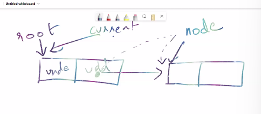

> creating linked list  
```bash
const nodeFactory = () => {
    # create new node 
    return {
        data: undefined,
        next: undefined,
    }
}

# creating node 
let i = 1
let current = root          #currently where you pointing 
const root = nodeFactory()  #root pointing to nodeFactory object

while(i <= 10){
    const node = nodeFactory()
    current.next = node    #forming connection between 2 nodes  
    node.data = 1
    current = node         #shift the current pointer to node 
    i++
}

#you can never change root, thats why current = root 
current = root     

#when current.next != undefined -> there exists another node in the linked list 
#when current.nxt == undefined -> there exists no node in the linked list 
while(current.next != undefined){
    console.log(current.data)
    current = current.next

}

const new_node = nodeFactory()
current.next = new_node 
new_node.data = 1337
```-



> linked list working 
```bash
# every node has data and next 

# Initially, data and next are undefined 
✅root points to first node 
✅current points to the first node 

 root 
  |
-------------
data  |  next
-------------
  |
current


✅const node = nodeFactory() creates a new node 
now this is how it looks like  
                     #node 
-----------          ----------
data | next          data | next 
-----------          -----------


✅current.next = node  #forms a connection between these 2 nodes
✅node.data = 1
 root
   |                    #node 
-----------             ----------
data | next   --->      1   | next 
-----------             -----------
   |
current


✅current = node       #shift the current pointer to node 
                       current 
                          |
-----------             ----------
data | next   --->      data | next 
-----------             -----------


# Traversing over every node in the linked list 
while(current.next != undefined) {
    console.log(current.data)
    #current pointer points to the next section from the node 
    current = current.next

}

# Creating a new node 
current.next = new_node #forms a connection between these 2 nodes 
current = new_node 
new_node.data = 1337
                       current 
                          |               #new_node 
-----------             ----------        -----------
data | next   --->      data | next       1337 | next
-----------             -----------       -----------
```


