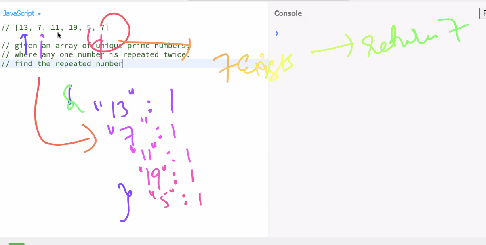
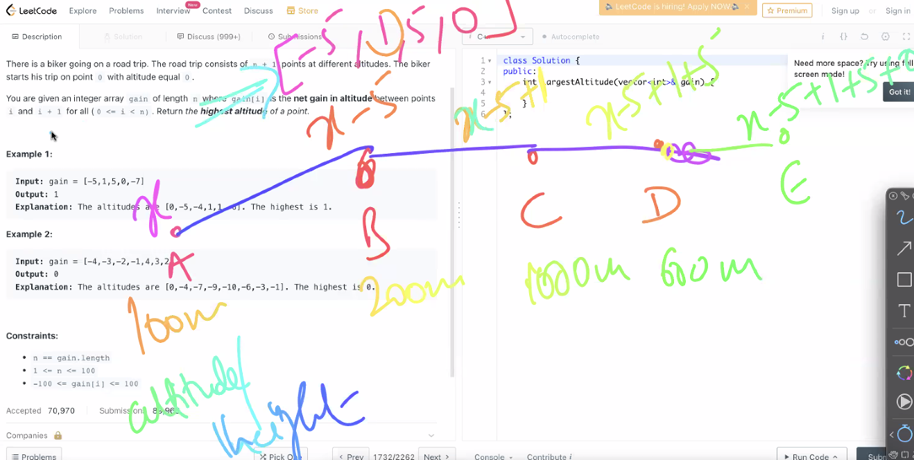
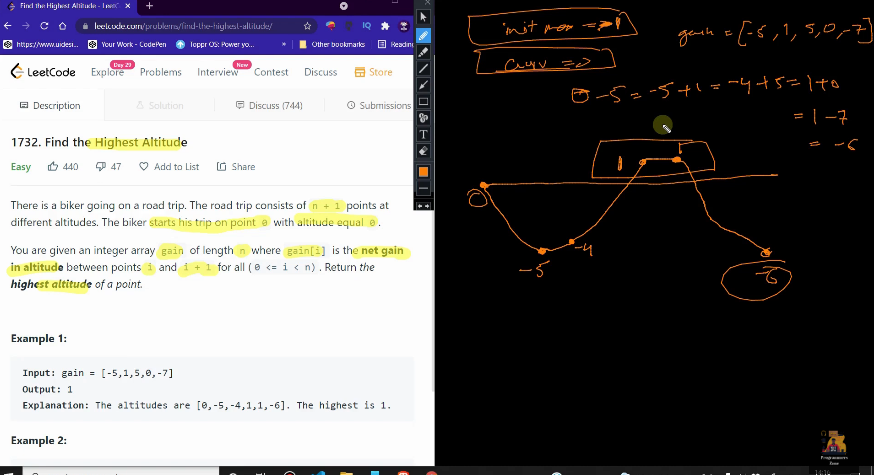

### DSA questions 
> Q1. Given an array of unique prime numbers, where any one number is repeated twice. Find the repeated number. 
[13, 7, 11, 19, 5, 7]

- Prime number - number divisibled by n and itself. 

> first approach - O(n^2)
```bash
i-> 0 to n-1
j->i+1 to n 
compare first element with all the other elements of the array 
```
> second approach - hash map - O(n)

```bash
we keep a count of every element found through hash
```
> third approach 
get product of the entire array, then divide the product by the element squared.
```bash
# finding the repeated number 
const arr = [13, 7, 11, 19, 5, 7]

const getRepeatedPrime = (arr) => {
    let product = 1;
    for(let index = 0; index<arr.length; index++){
        # 13 x 7 x 11 x 19 x 5 x 7 
        product = product * arr[index] 
    }
    for(let index=0; index<arr.length; index++){
        # 13 x 7 x 11 x 19 x 5 x 7 / 7 * 7 == 0 because 7 is present 2 times in the array 
        if(product % arr[index]*arr[index] == 0){
            console.log(arr[index])
            break;
        }
    }
}
getRepeatedPrime(arr)
# TC: n+n -> O(n)
```
> Q2. Given an array arr[] of size n, its prefix sum array is another array prefix sum array is another array prefixSUm[] of the same size, such that the value of prefixSum[i] is arr[0] + arr[1] + arr[2]
```bash
input: arr[] = {10, 20, 10, 5, 15}
output: prefixSUm[] = {10, 30, 40, 45, 60}
```
> approach O(n)
```bash
const arr = [10, 20, 10, 5, 15]
const prefixSum = () => {
    let previousSum = 0;
    for(let index = 0; index<arr.length; index++){
        # for example, 
        # when i=1, arr[1]=arr[1]+arr[0] -> 10+20=30
        arr[index]= previousSum + arr[index]
        # previousSum = arr[1] = 30 
        # the array at i=1 would be 10 30 10 5 15 
        previousSum = arr[index]
    }
    console.log(arr)
}
prefixSum(arr)
```
> Q3. return the leftmost pivot index 
pivot index is the index where the sum of all elements to its LHS = sum of all elements to it RHS 
```bash
# understanding the problem 

#0  1  2  3  4  5
[1, 7, 3, 6, 5, 6]
Checking pivot index in this array. 

at index 3, 
sum at lhs = 1+7+3=11
sum at rhs = 5+6=11

hence, the pivot index is 3
```
```bash
In this example. [2, 1, -1]
pivot index is 0 
```
> Time Complexity: O(n)
```bash
# left sum - old leftsum + arr[i]
# right sum - will be total sum - arr[i] - leftsum

const arr = [1, 7, 3, 6, 5, 6]
const pivotIndex = arr => {
    let finalIndex = -1

    let leftSum = 0 
    let totalSum = 0

    for(let index=0; index<arr.length; index++){
        totalSum = totalSum + arr[index]
    }

    for(let index=0; index<arr.length; index++){
        rightSum = totalSum - arr[index] - leftsum

        if(leftsum == rightsum){
            finalIndex = index
            break
        } else{
            leftSum = leftSum + arr[index]
        }
    }


    console.log(finalIndex)
}
pivotIndex(arr)

i    |  arr[i]   |  rightsum         | leftsum  |  rightsum==leftsum  | leftsum else condn  | finalIndex = index 
0    |   1       |  28 - 1 - 0 = 27  | 0        |  nope               |  1                  |
1    |   7       |  28 - 7 - 1 = 20  | 1        |  nope               |  1+7=8              |
2    |   3       |  28 - 3 - 8 = 17  | 8        |  nope               |  1+7+3=11           |
3    |   6       |  28 - 6 - 11= 11  | 11       |  yup                |                     | finalIndex = 

# TC: n+n -> O(n)
```
> Q3. Find the highest altitude 
There is a biker going on a road trip. The road trip consists of n + 1 points at different altitudes. The biker starts his trip on point 0 with altitude equal 0.

You are given an integer array gain of length n where gain[i] is the net gain in altitude between points i​​​​​​ and i + 1 for all (0 <= i < n). Return the highest altitude of a point.




- Time complexity: O(n) - depends on gain array 
- space complexity: O(1) - because we havent used any additional array 

> the code 
```bash
# initially max altitude is 0 before we iterate over the array 
[3, 2, 5, -8, 1, -4]

var largestAltitude = function(gain) {
    let max = 0 
    let current = 0 

    for(let i = 0; i < gain.length; i++){
        current = current + gain[i]
        max = Math.max(current, max)
    }
    return max
};
```


