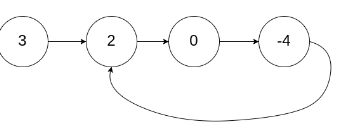
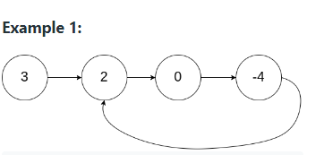
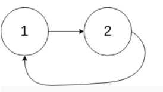
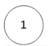
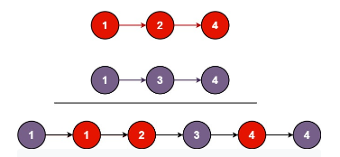
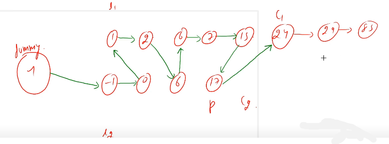

### Linked List 
```bash
const readline = require('readline').createInterface({
    input: process.stdin,
    output: process.stdout,
  });
  
  function createNode(data) {
    # if(typeof data !== "string") {
    #   return null;
    # }
  
    return {
      next: undefined,
      data: data
    };
  }
  
  let root = createNode();
  
  function insert() {
    readline.question(`Enter the data? `, data => {
      let head = root;

      #while head does not point to null 
      while(head.next !== undefined) {
        #keep updating head
        #note that head pointer keeps incrementing, thats why we can even name it current 
        head = head.next;
      }
  
      const p = createNode(data);

     #initially tail = head 
      let tail = head
      #the pointer of tail points to p 
      tail.next = p;

      # tail should point at the p 
      tail = p;

      printMenu();
    });
  }
  
  function traverse() {
    #let the current pointer be at the first node 
    let head = root.next;

    #while head pointer doesnt point at null
    #i.e if the head pointer has more nodes in the linked list 
    while(head !== undefined) {
      console.log(head.data);
      #then keep incrementing the head pointer
      head = head.next;
    }
    printMenu();
  }
  
  # linked list 2-> 10 -> 16 -> 20
  # reversed: 2 <- 10 <- 16 <- 20
  function reverse() {
    let first = root;        #2
    let second = root.next; #10
    let temp = undefined;   

    # while second node exists 
    # link second with first 10 -> 2
    while(second !== undefined) {
      # 10 -> 2
      #basically 2 <- 10
      first = second.next;
      #16 -> temp 
      second.next = temp;
      #16 = second 
      temp = second;

      #10 = first 
      second = first;
    }
    # first = 10 
    # second = 16 
    # we need to do 16 -> 10, which will happen when this loop runs again 
    root = createNode();
 
    #root points to null
    #same as undefined 
    #temp points to undefined before the loop 
    root.next = temp;

    #second = 10 
    #in next iteration, second = 20 
    second = temp;
    #were saving value of second because we need it for while loop traversal 

  
    # while(head !== undefined) {
    #   console.log(head.data);
    #   head = head.next;
    # }
  
    printMenu();
  }
  
  function prepend() {
    readline.question(`Enter the data? `, data => {
      #p is the node you want to enter 
      const p = createNode(data);
      #point p to root (i.e the first node)
      p.next = root.next;

      #now root pointer is at the p 
      root.next = p;

      printMenu();
    });
  }
  
  function printMenu() {
    readline.question(`What do you want to do (insert/prepend/traverse/reverse/exit)? `, data => {
      switch(data) {
        case 'insert':
          insert();
          break;
        case 'prepend':
          prepend();
          break;
        case 'traverse':
          traverse();
          break;
        case 'reverse':
          reverse();
          break;
         case 'exit':
          break;
        default:
          console.log("Invalid input, please try again");
          printMenu();
          break;
      }
    });
  }
  
  printMenu();
  
# Terminal
node LL.js 
```
### Reverse a linked list 
> 1. Iterative method 
```bash
# if there are 4 nodes 

# head 
# |
# 1 => 2 -> 3 -> 4 -> null

# to reverse this, we'll reverse the pointer till 2nd node 
# 3rd node is stored in temp because when we break the links between 2 and 3 we'll loose 3rd node 

#           temp
#           |
# 1 <- 2    3 -> 4 -> null 


#now we assign the pointer from 3 to 2 and we shift the temp pointer to point at 4 
#               temp
#                |
# 1 <- 2  <- 3   4 -> null

#then we shift temp to null and assign pointer from 4 to 3 
#                      temp
#                        |
# 1 <- 2  <- 3  <- 4 -> null
```
> the code 
```bash
# head 
# |
# 1 -> 4 -> 7
Node reverse(Node head){
  #we set 2 pointers curr and prev where curr points at current node and prev points at the previous node 

  #cur points at current node, i.e 1 iniitally 
  Node cur = head    
  #prev node points at the node before current node, initially it points to null
  #       1 -> 4 -> 7 
  # |     |
  # null  curr

  while(curr!=null){
    #when we break 2 nodes, by removing the pointers, we need to save the next node in a variable temp, so it isnt lost 
    Node temp = cur.next;
  #       1    4 -> 7 
  # |     |    |
  # null  curr temp 

    #this line is responsible for forming pointers in reverse direction between 2 nodes 
    cur.next = prev;
  #    <- 1    4 -> 7 
  # |     |    |
  # null  curr temp 

    prev = cur;
  #       1 <- 4 -> 7 
  #       |    |    
  #      prev  curr  

    cur = temp;
  #            temp 
  #            |
  #       1 <- 4 -> 7 
  #       |    |    
  #      prev  curr  
  }
  return prev
}

#The Working:
#Acronymns for pointers:
#H - HEAD 
#T - TEMP 
#P - PREV 
#C - CUR

while(cur != null)
cur  |  temp=cur.next  |  prev       | cur.next = prev     | cur.next = prev  |  prev = cur        |   H  T
1    |  4              |  null       | prev <- 1  4 ->7    | prev points at 1 |  4 points at cur   | # 1  4 -> 7 
                                                                                                       P  C
----------------------------------------------------------------------------------------------------------------------------
                                                                                                                                                                                                                                                                                                     T
4    |  7              |  1           | null <- 1 <- 4  7   | prev points at 4 | 7 points at cur    | # 1 <- 4  7 
                                                                                                             P  C
-----------------------------------------------------------------------------------------------------------------------------
                                                                                                                         T
7    | null            |  4           | null <- 1 <- 4 <- 7 | prev points at 7 | null points at cur | # 1 <- 4 <- 7     null 
                                                                                                                  P      C 
#cur is null now, and our linked list is reversed                                                                                                     
```
> 2. Recursive method 
```bash
#ignoring the first node,  we call the other nodes recursively which reverses the pointers of each node 

Node reverse(Node head){
  #if there is only one node in the linked list, then the reverse of the node, will be head 
  if(head==null || head.next==null){
    return head
  }

  #call reverse function for all the nodes excluding the first node in the linked list and return newHead which points at the last node 
  Node newHead = reverse(head.next)

  #headNext is the node right after the first node 
  Node headNext = head.next
  #we want to point headNext pointer to head 
  headNext.next = head 
  #the previous pointer of head points to null
  head.next = null 
  return newHead 
}

#The Working:
#Step1: reverse 7 -> 4 
#10 -> 7 -> 4 
# |    |
# head head.next 

#Step2: after a part of the linked list is reversed this is how it'll look like 
Node newHead = reverse(head.next)
#10 -> 7 <- 4 
#           |
#         p 

#now we need to reverse 10 -> 7 , basically the rest of the linked list 

#Step3: point the pointer of head.next to head 
Node headNext = head.next
headNext.next = head 
#10 <- 7 <- 4 
#      |
#    headNext

#Step4: previous pointer of head should point to null 
head.next = null 
#null <- 10 <- 7 <- 4
#         |    
#       head   
```
> another reverse method
```bash
# linked list 2-> 10 -> 16 -> 20
# reversed: 2 <- 10 <- 16 <- 20

class LinkedList{
    constructor(data){
        this.head = {
            value: data,
            next: null 
        }
        this.tail = this.head 
        this.length = 1
    }

    append(data){
        const p = {
            value: data,
            next: null 
        }

        this.tail.next = p 
        this.tail = p 
        this.length++
    }

    prepend(data){
        const p = {
            value: data,
            next: null
        }
        p.next = this.head 
        this.head = p 
    }

    #This function will return us the index before the node we want to delete 
    #were going to loop through the linked list until we reach to a point where counter == previous index (when this condition happens, it means we found the node we were searching for)

    #we passed index-1 here, the 0'th index 
    traversing(req){
        #counter for traversing over every node in the linked list 
        let counter = 0 
        #while were looping over each node, we want to increement the head pointer 
        let currentNode = this.head 

        #This function is to fetch the req node, in our case its 2 
        #2 is at the 0'th index itself, so it simply returns currentNode at the end, and never goes in this condiiton, and currentNode simply signifies the head pointer, in this example, head is pointing at 2

        # counter = 0, req =0
        #keep increementing counter until, counter != req
        while(counter != req){
            counter++
            #we increement the head pointer to point at the node were currently at 
            currentNode = currentNode.next
        }
        return currentNode 
    }

    insert(index, data){
        # at which index are we inserting
        # which data are we inserting 
        const p = {
            value: data,
            next: null
        }
        # grab 2 and 10 from the linked list 
        const leaderNode = this.traversing(index-1) #0th index, data:2
        const nextNode = leaderNode.next            #the node after 2 -> data: 10

        # connect 2 -> 4 -> 10

        # 2-> 4
        leaderNode.next = p   #p=4
        # 4-> 10
        p.next = nextNode

    }

    delete(index){
        # leaderNode = 2 
        const leaderNode = this.traversing(index-1)
        # leaderNode.next = 4 
        const unwantedNode = leaderNode.next 
        # nextNode = 10 
        const nextNode = unwantedNode.next 

        # link 2 with 10, then 4 will automatically go away 
        leaderNode.next = nextNode

        # reduce length as node is deleted 
        this.length--
    }

    #reverse this list:
    # 2-> 10 -> 16 -> 20
    reverse(){
        let first = this.head   #first = 2 
        #2 is the tail when linked list is reversed 
        this.tail = this.head 

        let second = first.next #second = 10
        
        # while second node exists 
        # link second with first 10 -> 2
        while(second){
            # pointer of 10 points at 2 
            second.next = first 

            # temp = 16 
            let temp = second.next

            #first = 10 
            #second = 16 
            #we need to do 16 -> 10, which will happen when this loop runs again 
            first = second 

            #second = 16 
            second = temp 
        }

        #now the first element in the node will point to null 
        #null <- 2 <- 10 <- 16 <- 20 

        #2 points at null after reversing 
        this.head.next = null 

        #reversed linked list:
        #20 -> 16 -> 10 -> 2
        this.head = first 

    }

}


# 2-> 10 -> 16 -> 20
# |                |
# head           tail 
first   |  second  |  second.next = first  | temp=second.next  |first=second  |  second=temp
 2      |  10      |  10 -> 2              | temp=16           | first=10     |  second=16
 10     |  16      |  16 -> 10             | temp=20           | first=16     |  second=20
 16     |  20      |  20 -> 16             | temp=null         | first=20     |  second=null 
#since second is null it does not enter the while loop, now our entire LL is reversed 
this.head.next = null 
#20 -> 16 -> 10 -> 2 -> null 
#                  |
#                 head

#change the head to point at first 
this.head = first  #head=20
#20 -> 16 -> 10 -> 2 -> null 
# |
#head

const myList = new LinkedList(10)
myList.append(16)
myList.prepend(2)
myList.insert(1, 4) #at 1st index insert 4 
myList.delete(1) 
myList.reverse()
console.log(myList)
```
> the reverse code from class 
```bash
#linked list 2-> 10 -> 16 -> 20
#reversed: 2 <- 10 <- 16 <- 20
  function reverse() {
    let first = root;       

    let second = first.next; 
    let temp = undefined;   

    while(second !== undefined) {
      first = second.next;
      second.next = temp;
      temp = second;
      second = first;
    }

    root = createNode();

    root.next = temp;
    second = temp;

    printMenu();
  }

first | second | first = second.next  | second.next = temp | temp = second      | second = first 
2     | 10     | 2 <- 10              | 16=temp            | 16=second          | 10=first 
10    | 16     | 10 <- 16             | 20=temp            | 20=second          | 16=first
16    | 20     | 16 <- 20             | undefined=temp     | undefined=second   | 20=first 
#since second is undefined we come out of the loop 

root.next = temp;  #means root pointer should point to undefined 
#20 -> 16 -> 10 -> 2 -> undefined 
#                  |
#                 root

second = temp 
#undefined = temp 
```
> whats the difference between `undefined` and `null` in linked list context 
```bash
null has a datatype object 
undefined has no datatype 
#you need to ensure your pointers point at the right node, when your using undefined in place of null
#theres a slight difference in both their implementation and it has to do with pointers. 

#for example, prepend function using data which points to null, would look like this:
    prepend(data){
        const p = {
            value: data,
            next: null
        }
        #if p=4
        #linked list: 2 -> 10 

        #4->2
        p.next = this.head 
        #4->2
        #|
        #head 
        this.head = p 
    }

#prepend function using data which points to undefined, would look like this:
    prepend(data){
        const p = {
            value: data,
            next: undefined 
        }
        #4-> undefined -> 2
        #       |         |
        #      head     head.next
        p.next = this.head.next

        #undefined <- 4 -> 2 
        #             |
        #          head.next
        this.head.next = p 
    }
    #the reason: first node is pointing to undefined, it has no datatype so we need to point to the next node 
```

> Q. palindorme linked list 
```bash
Given the head of a singly linked list, return true if it is a palindrome.

Input: head = [1,2,2,1]
Output: true

Input: head = [1,2]
Output: false
```
```bash
#function for reversing linked list 

#linked list 2-> 10 -> 16 -> 20     
#reversed: 2 <- 10 <- 16 <- 20      
const reverse = head => {
    let cur = head;
    let prev = null;
    let temp;

    while(cur!=null){
      temp = cur.next;
      cur.next = prev;
      prev = cur;
      cur = temp;
    }
    return prev;

};

var isPalindrome = function(head){ 
#approach 1: check from both sides of the linked list 
#approach2: check middle value and go outwords 

#two pointer apporach 
#2 pointers 
#one pointer say F move 2 spaces 
#L pointer move 1 pointer - shows mid point 

#we can reverse the points from R to mid 
let fast = head;
let slow = head;
let startPointer = head;
let length = 0;

while(fast && fast.next){
    fast = fast.next.next;
    slow = slow.next;
    #where slow pointer ends, its the mid of the list 
    length++;
}

#reverse list from mid to n-1
let mid = reverse(slow)
#if the reverse from 0->mid is same as from mid to n-1, then its palindrome 


while(length){
    length--;
    #nodes from mid to n-1, must be saame as values from 0 to mid-1, if they aint equal, means that it aint a palindrome 
    if(mid.val != startPointer.val)  return false;

    #else if they are equal then keep increementing mid and startPointer, if mid.val == startPointer.val then it returns true 
    mid = mid.next;
    startPointer = startPointer.next;
}
return true;

};
```
> Linked List Cycle i 
Return true if there is a cycle in the linked list. Otherwise, return false.

```bash
Input: head = [3,2,0,-4], pos = 1
Output: true
Explanation: There is a cycle in the linked list, where the tail connects to the 1st node (0-indexed).
```
> Approaches: 
```bash
#JAVA 
#Approach 1: Brute Force -O(N) TC AND O(N)SC
Create a hash map, traverse over every node, and every node thats traversed will be added to the hashmap,  hash map will contain unique elements. However if its a linked list cycle then any node in the hashmap will repeat twice and when this happens we can return true 

#Approach 2: FLYOD'S LOOP DETECTION -O(N) TC AND O(1) SC
#take 2 pointers, slow pointer moves in one node interval, fast pointer moves at two node interval 
#if there is a cycle, there will come a point where slow pointer and fast pointer will collide ona  single node
#however, if there is no cycle, i.e its a linear linked list, then last pointer will point at null 
public class Solution {
    public boolean hasCycle(ListNode head) {
      #if linked list is empty then return false because it cannot be a cycle 
        if(head == null || head.next == null){
          return false;
        }
        #assign both pointers to head 
        ListNode fast = head;
        ListNode slow = head;

        #if fast reaches null that means its not a cycle 
        #when fast is on the last node && fast is on the second last node 
        while(fast.next!=null && fast.next.next!=null){
          #move fast by 2 steps 
          fast = fast.next.next;
          #move slow by 1 step 
          slow = slow.next;
          #if fast and slow pointer meet at any point, then its a cycle 
          if(fast == slow){
            return true;
          }
        }
       return false;
    }
}
```
> Linked List cycle ii 
check whether linked list has cycle, then return posiiton/index of node where cycle stops

Do not modify the linked list.

```bash
Input: head = [3,2,0,-4], pos = 1
Output: tail connects to node index 1
Explanation: There is a cycle in the linked list, where tail connects to the second node.
```

```bash
Input: head = [1,2], pos = 0
Output: tail connects to node index 0
Explanation: There is a cycle in the linked list, where tail connects to the first node.
```

```bash
Input: head = [1], pos = -1
Output: no cycle
Explanation: There is no cycle in the linked list.
```
> Approaches
```bash
#Approach 1:  FLYOD'S LOOP DETECTION -O(N) TC AND O(1) SC
public class Solution {
    public ListNode detectCycle(ListNode head) {
     ListNode slow = head;
     ListNode fast = head;

     while(fast!= null && fast.next!= null){
       slow = slow.next;
       fast = fast.next.next;

#if both slow and fast meet on one node 
      if(slow == fast){
        slow = head; 
        #slow is reset to point at the head node 
        #node slow and fast will start iterating over the nodes again 
        while(slow != fast){
          slow = slow.next;
          fast = fast.next;
        }
        #both slow and fast point at the same node 
        return slow;
       }
     }   
     #if there is no cycle return null 
     return null;
    }
}
```
> Merge Two sorted lists 
You are given the heads of two sorted linked lists list1 and list2.

Merge the two lists in a one sorted list. The list should be made by splicing together the nodes of the first two lists.

Return the head of the merged linked list.

```bash
Input: list1 = [1,2,4], list2 = [1,3,4]
Output: [1,1,2,3,4,4]
```
> the working 
```bash
#list 1 
1 -> 2 -> 6 -> 7 -> 15 -> 24 -> 29 -> 85 
#list 2 
-1 -> 0 -> 6 -> 17 

#dummy 
we create a new node to add all the nodes 

#p is a pointer which will iterate over both list1 and list2 
#c1 is a pointer which iterates over every element of  list1 
#c2 is a pointer which iterates over every element of  list2

#initially p points to the dummy node 
#then it points one node before the c1 pointer or the c2 pointer 
c1   |   c2   |  c1 < c2 |  p = p.next |  c2 = c2.next  | c1 = c1.next
1    |   -1   |  nope    |  -1  #L2    |  0             |
1    |    0   |  nope    |   0  #L2    |  6             |
1    |    6   |  yes     |   1  #L1    |                | 2
2    |    6   |  yes     |   2  #L1    |                | 6
6    |    6   |  nope    |   6  #L2    |  17            |      
6    |   17   |  yes     |   6  #L1    |                | 7
7    |   17   |  yes     |   7  #L1    |                | 15 
15   |   17   |  yes     |   15 #L1    |                | 24 
24   |   17   |  nope    |   17 #L2    |  null          |
#now out List2 is exhausted, now we'll attach c1 to p, now p points at 24 from List1 
24   |   17   | nope     |  24 #L1     |                | 29 
#Now our linked list is sorted 
```

```bash
#JAVA 
class Solution {
    public ListNode mergeTwoLists(ListNode c1, ListNode c2) {
       ListNode dummy = new ListNode(0);
       ListNode p = dummy;

#while both c1 and c2 dont exhaust, while there are nodes in both the linked lists
       while(c1!=null && c2!=null){
        #while c1 list node values are less than c2 node values 
         if(c1.val < c2.val){
           #p pointer points at list1, one pointer before c1
           p.next = c1;
           #and C1 is updated to the node after c1 
           c1 = c1.next;
         } 
        #while c2 list nodes are less than c1 node values 
         else {
          #p pointer points at the list2, one pointer before c2 
           p.next = c2;
           #and c2 is updated the node after c2 
           c2 = c2.next;
         }
         p = p.next;
       }

#if one of the list is empty and the other one is not empty, then find the non empty list and insert the values to the end of the linked list 

      #if values from list1 are not exhausted yet, then point the p pointer to c1, and iterate over the entire linked list, until all the elements are printed 
      if(c1!=null){
        p.next = c1;
        c1 = c1.next;
      }

      #if values from list2 are not exhausted yet, then point the p pointer to c2, and iterate over the entire linked list, until all the elements are printed 
      if(c2!=null){
        p.next = c2;
        c2 = c2.next;
      }
      return dummy.next;
    }
}
```

> Happy Number 
Write an algorithm to determine if a number n is happy.

A happy number is a number defined by the following process:

- Starting with any positive integer, replace the number by the sum of the squares of its digits.
- Repeat the process until the number equals 1 (where it will stay), or it loops endlessly in a cycle which does not include 1.

Those numbers for which this process ends in 1 are happy.
Return true if n is a happy number, and false if not.
```bash
Input: n = 19
Output: true
Explanation:
1^2 + 9^2 = 82
8^2 + 2^2 = 68
6^2 + 8^2 = 100
1^2 + 0^2 + 0^2 = 1

Input: n = 2
Output: false
#because 2^0 + 0^0 = 4 
```
> working 
```bash
Input: 123 
# extract digits 
# square them and add them up 

#we'll get all individual digits, by using % and / operators 
123 % 10 = 3     123/10= 12 
12 % 10 = 2      12/10 = 1 
1 % 10 = 1       1/10 = 0 

#we'll then square these numbers 
1^2 + 2^2 + 3^2 = 1 + 4 + 9 = 14 

#14
1^2 + 4^2 = 17 

#17 
1^2 + 7^2 = 1 + 49 = 50

#50 
5^0 + 0^0 = 1 + 0 = 1
#this cycle is equal to 1, thats why it is a happy number 
#this cycle should keep going until we find 1 
#when we continuosly square sum of the digits and it equals to 1, its a happy number 
```
> Approach 
```bash
# JS

#set only stores unique values 
Check if the num does not exist in set 
      - add num to set 
      - initalize sqrtSum 
      - iterate over each digit and add to sqrtSum 
      
      if sqrtSum == 1 
         return true 
      else 
         return false 
```
```bash
var isHappy = function(n){
  let map = new Set()

#while the number does not exist in the hash map 
  while(!map.has(n)){
    map.add(n)
    sqSum = 0 

    #while number > 0 
    while(n>0){
      #sum of squares 
      sqSum = sqSum + (n%10)*(n%10)
      n = Math.floor(n/10)
    }

     #if sqSum is 1 its a happy number 
    if(sqSum == 1){
      return true
    }
    #n is set to the calculated square sum 
    n = sqSum 
  }
  return false 
}

n>0      |   sqSum = sqSum + (n%10)*(n%10)         |   n = Math.floor(n/10)   | n = sqSum 
123>0    |  sqSum = 0 + (123%10)(123%10) = 0+9=9   |   n = 123/10 = 12       
         |  sqSum = 9 + (12%10)*(12%10) = 9+4=13   |   n = 12/10 = 1 
         |  sqSum = 13 + (1%10)*(1%10) = 13+1=14   |   n = 1/10 = 0           | n = 14 

14>0     | sqSum = 0 + (14%10)*(14%10) = 0+16=16   |   n = 14/10 = 1
         | sqSum = 1 + (1%10)*(1%10) = 16+1 = 17   |   n = 1/10 = 0           | n = 17 

# similarly its going to work until it manages to find sqSum = 1, if it does it returns true, else it returns false   
```


