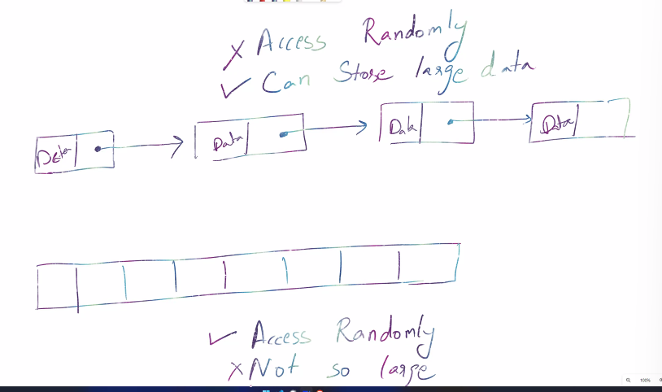
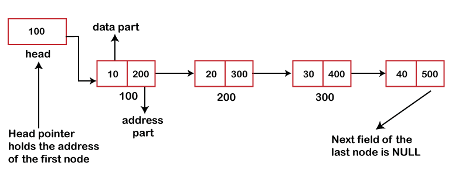

### Linked List 
Linked list is a collection of nodes 
- node contains `data` and `pointer`. First node pointer points the next pointer.  



- In array, you can access randomly, however in linked list you cannot. Linked List can store large data -> eg: block chain, audio cassetes 
- traversing is slower than array 
- Linked list doesnt need continuous memory / space, only array has such requirments.

> How are linked list stored in the memory?
```bash
#Explanation:

# 10  -> 60  -> 20 
#  |            |
# head         tail
# head stores the first node 
# tail stores  the last node 

# Object inside Object 
let LinkedList = {
    head: {
        value:10,
        next: {           #10 is pointing to 16
            value: 16,
            next: {        #16 pointing to 20 
                value: 20,
                next: null #20 points at nothing 
            }
        }
    }
}
# linkedlist stored as an object which contains key-value pairs 
```
> How to create a Linked list DS?
```bash
class LinkedList{
    #whatever data user inputs -> data 
    constructor(data){
        # head will be fixed, tail wont be fixed 
        this.head = {
            value: data,
            next: null #intiially next is defined as null, first node doesnt point to anything 
        }
        #as we add new node, tail keeps updating 
        #but initially when we have only one node, tail and head pointers will be pointing to the same node 
        this.tail = this.head 
    }
}

#myList is the class reference 
#user wants to add 10 to the linkedlist 
const myList = new LinkedList(10)
console.log(myList)

# output:
LinkedList
head: {value: 10, next: null}
tail: {value: 10, next: null}
[[Prototype]]: Object
```
> appending a new node in linkedlist 
```bash
# 10 --> 16 
class LinkedList{
    #whatever data user inputs -> data 
    constructor(data){
        # head will be fixed, tail wont be fixed 
        this.head = {
            value: data,
            next: null #intiially next is defined as null, first node doesnt point to anything 
        }
        #defining tail 
        this.tail = this.head 
    }
    #append this data to the linked list 
    append(data){
        const newNode = {
            value: data,
            next: null #initially next pointer is null
        }

        # previous node = 10, newnode = 16
        #initially both head and tail was pointing at 10
        #to link previous node with this new node we want to append 
        this.tail.next = newNode 
        #initially tail was on 10, we want the pointer at 10 to point to newnode 

        #tail should point at the appended node 
        this.tail = newNode 
    }
}


const myList = new LinkedList(10)
myList.append(16)
console.log(myList)

# output:
LinkedList
head:
next: {value: 16, next: null}
value: 10
[[Prototype]]: Object
tail: {value: 16, next: null}
[[Prototype]]: Object
```
> how to prepend a node in javascript?
```bash
# adding node 2 to the beginning 
# 2 --> 10 --> 16 
class LinkedList{
    #whatever data user inputs -> data 
    constructor(data){
        # head will be fixed, tail wont be fixed 
        this.head = {
            value: data,
            next: null #intiially next is defined as null, first node doesnt point to anything 
        }
        this.tail = this.head 
        this.length = 1
    }
    #append this data to the linked list 
    append(data){
        const newNode = {
            value: data,
            next: null #initially next pointer is null
        }
        #to link previous node with this new node we want to append 
        this.tail.next = newNode 
        #initially tail was on 10, we want the pointer to 10 to point to newnode 

        #tail should point at the appended node 
        this.tail = newNode 
        this.length++
    }
    prepend(data){
        const newNode = {
            value: data,
            next: null
        }
        # new node should point at head 
        # new node = 2
        # head = 10 
        # 2 --> 10 --> 16 
        newNode.next = this.head 

        # now the head pointer should point at newNode 
        this.head = newNode 
    }
}


const myList = new LinkedList(10)
myList.append(16)
myList.prepend(2)
console.log(myList)

# output:
LinkedList
head: {value: 2, next: {value: 10, next:{ value,16, next: null}}}
length: 2
tail: {value: 16, next: null}
[[Prototype]]: Object
```
> How to insert at a given position linked list 
```bash
# If we want to insert 4 in the linkedlist, we'll break the connection between 2 and 10 and insert 4, by pointing 2 at 4 and pointing 4 to 10 
#   4
#  /  \
# 2--> 10 --> 16 --> 20 

# after insertion, this is how the final linked list would look like 
# 2 -> 4 -> 10 -> 16 -> 20
class LinkedList{
    constructor(data){
        this.head = {
            value: data,
            next: null 
        }
        this.tail = this.head 
        this.length = 1
    }
    append(data){
        const newNode = {
            value: data,
            next: null 
        }

        this.tail.next = newNode 
        this.tail = newNode 
        this.length++
    }
    prepend(data){
        const newNode = {
            value: data,
            next: null
        }
        newNode.next = this.head 
        this.head = newNode 
    }

    #we passed index-1 here, the 0'th index 
    traversing(req){
        #counter for traversing over every node in the linked list 
        let counter = 0 
        #while were looping over each node, we want to increement the head pointer 
        let currentNode = this.head 

        #This function is to fetch the req node, in our case its 2 
        #2 is at the 0'th index itself, so it simply returns currentNode at the end, and never goes in this condiiton, and currentNode simply signifies the head pointer, inthis example, head is pointing at 2

        # counter = 0, req =0
        #keep increementing counter until, counter != req
        while(counter != req){
            counter++
            #we increement the head pointer to point at the node were currently at 
            currentNode = currentNode.next
        }
        return currentNode 
    }

    insert(index, data){
        # at which index are we inserting
        # which data are we inserting 
        const newNode = {
            value: data,
            next: null
        }
        # grab 2 and 10 from the linked list 
        const leaderNode = this.traversing(index-1) #0th index, data:2
        const nextNode = leaderNode.next            #the node after 2 -> data: 10

        # connect 2 -> 4 -> 10
        # 2 is called leaderNode 
        # 10 is called nextNode 

        # 2-> 4
        leaderNode.next = newNode   #newNode=4
        # 4-> 10
        newNode.next = nextNode

    }
}

#   4
#  /  \
# 2   10 --> 16 --> 20 

const myList = new LinkedList(10)
 myList.append(16)
myList.prepend(2)
myList.insert(1, 4) #at 1st index insert 4 
console.log(myList)

# console:
LinkedList
head: {value: 2, next: {value: 4, next: { value:10, next: { value:16, next: null}}}}
length: 2
tail: {value: 16, next: null}
[[Prototype]]: Object
```
> How to remove a node from linked list 
```bash
# we want to remove 4 from the linked list 
# 2 -> 4 -> 10 -> 16 -> 20

# to acheive this, shift the pointer of 2 to point to 10 and break the 2->4 connection 
# 2 -> 10 -> 16 -> 20 
class LinkedList{
    constructor(data){
        this.head = {
            value: data,
            next: null 
        }
        this.tail = this.head 
        this.length = 1
    }
    append(data){
        const newNode = {
            value: data,
            next: null 
        }

        this.tail.next = newNode 
        this.tail = newNode 
        this.length++
    }
    prepend(data){
        const newNode = {
            value: data,
            next: null
        }
        newNode.next = this.head 
        this.head = newNode 
    }

    #we passed index-1 here, the 0'th index 
    traversing(req){
        #counter for traversing over every node in the linked list 
        let counter = 0 
        #while were looping over each node, we want to increement the head pointer 
        let currentNode = this.head 

        #This function is to fetch the req node, in our case its 2 
        #2 is at the 0'th index itself, so it simply returns currentNode at the end, and never goes in this condiiton, and currentNode simply signifies the head pointer, inthis example, head is pointing at 2

        # counter = 0, req =0
        #keep increementing counter until, counter != req
        while(counter != req){
            counter++
            #we increement the head pointer to point at the node were currently at 
            currentNode = currentNode.next
        }
        return currentNode 
    }

    insert(index, data){
        # at which index are we inserting
        # which data are we inserting 
        const newNode = {
            value: data,
            next: null
        }
        # grab 2 and 10 from the linked list 
        const leaderNode = this.traversing(index-1) #0th index, data:2
        const nextNode = leaderNode.next            #the node after 2 -> data: 10

        # connect 2 -> 4 -> 10
        # 2 is called leaderNode 
        # 10 is called nextNode 

        # 2-> 4
        leaderNode.next = newNode   #newNode=4
        # 4-> 10
        newNode.next = nextNode

    }

    delete(index){
        # leaderNode = 2 
        const leaderNode = this.traversing(index-1)
        # leaderNode.next = 4 
        const unwantedNode = leaderNode.next 
        # nextNode = 10 
        const nextNode = unwantedNode.next 

        # link 2 with 10, then 4 will automatically go away 
        leaderNode.next = nextNode

        # reduce length as node is deleted 
        this.length--
    }
}

const myList = new LinkedList(10)
myList.append(16)
myList.prepend(2)
myList.insert(1, 4) 
myList.delete(1)   #deleting the 1st index
console.log(myList)

# console:
LinkedList
head: {value: 2, next: {value: 10, next: { value:16, next:null}}}
length: 1
tail: {value: 16, next: null}
[[Prototype]]: Object
```
> Delete node in linked list - LEETCODE 
```bash
# we will be given access to the node to be deleted directly 
# node to be deleted is not a tail node in the list 
class Solution {
    public void deleteNode(ListNode node){
        # 4 -> 5 -> 1 -> 9
        # 5 - node.val (node to be deleted)
        # 1 - node.next.val 
        node.val = node.next.val   #update the node data to contain 1 
        # 4 -> 1 -> 9 
        # link 1 and 9
        # 1 - node.next 
        # 9 - node.next.next 
        node.next = node.next.next #pointer points at 9 
    }
}
```
> Reverse linked list 
```bash
class LinkedList{
    constructor(data){
        this.head = {
            value: data,
            next: null 
        }
        this.tail = this.head 
        this.length = 1
    }
    append(data){
        const newNode = {
            value: data,
            next: null 
        }

        this.tail.next = newNode 
        this.tail = newNode 
        this.length++
    }
    prepend(data){
        const newNode = {
            value: data,
            next: null
        }
        newNode.next = this.head 
        this.head = newNode 
    }

    #we passed index-1 here, the 0'th index 
    traversing(req){
        #counter for traversing over every node in the linked list 
        let counter = 0 
        #while were looping over each node, we want to increement the head pointer 
        let currentNode = this.head 

        #This function is to fetch the req node, in our case its 2 
        #2 is at the 0'th index itself, so it simply returns currentNode at the end, and never goes in this condiiton, and currentNode simply signifies the head pointer, inthis example, head is pointing at 2

        # counter = 0, req =0
        #keep increementing counter until, counter != req
        while(counter != req){
            counter++
            #we increement the head pointer to point at the node were currently at 
            currentNode = currentNode.next
        }
        return currentNode 
    }

    insert(index, data){
        # at which index are we inserting
        # which data are we inserting 
        const newNode = {
            value: data,
            next: null
        }
        # grab 2 and 10 from the linked list 
        const leaderNode = this.traversing(index-1) #0th index, data:2
        const nextNode = leaderNode.next           #the node after 2 -> data: 10

        # connect 2 -> 4 -> 10

        # 2-> 4
        leaderNode.next = newNode   #newNode=4
        # 4-> 10
        newNode.next = nextNode

    }

    delete(index){
        # leaderNode = 2 
        const leaderNode = this.traversing(index-1)
        # leaderNode.next = 4 
        const unwantedNode = leaderNode.next 
        # nextNode = 10 
        const nextNode = unwantedNode.next 

        # link 2 with 10, then 4 will automatically go away 
        leaderNode.next = nextNode

        # reduce length as node is deleted 
        this.length--
    }

    # 2-> 10 -> 16 -> 20
    reverse(){
        #were taking reference of all elements in the linked list 
        let first = this.head   #first = 2 
        #2 is the tail when linked list is reversed 
        this.tail = this.head 

        let second = first.next #second = 10
        
        # while second node exists 
        # link second with first 10 -> 2
        while(second){
            # pointer of 10 points at 2 
            second.next = first 

            # temp = 16 
            let temp = second.next

            #first = 10 
            #second = 16 
            #we need to do 16 -> 10, which will happen when this loop runs again 
            first = second 

            #second = 16 
            second = temp 
        }
        #now the first element in the node will point to null 
        #2 <- 10 <- 16 <- 20 
        this.head.next = null 
        this.head = first 

    }

}

const myList = new LinkedList(10)
myList.append(16)
myList.prepend(2)
myList.insert(1, 4) #at 1st index insert 4 
myList.delete(1) 
myList.reverse()
console.log(myList)
```


