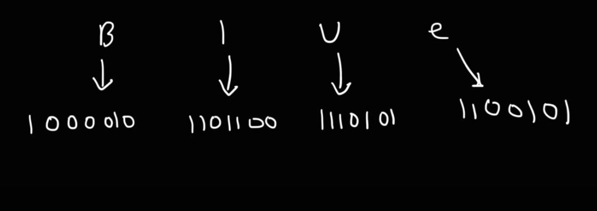

> ASCII Code 
convert decimal value to binary 



```bash
#each of these ASCII values represent a letter from the ASCII table 
#when we decode each ASCII from ASCII to ch 
#we get this word 
LEMON 
```
> ASCII value of uppercase alphabets – 65 to 90. ASCII value of lowercase alphabets – 97 to 122
Note: Each lowercase letter is 32 + uppercase equivalent.
```bash
A = 65 #97-32 = 65 
a = 97 #32+65 = 97 

# From this we can conclude that,
To convert from lowercase to uppercase add 32 
# lowercase + 32 = uppercase 

To convert from uppercase to lowercase subtract 32 
# uppercase - 32 = lowercase 
```
### Leetcode solutions:
> Q. To Lower Case 
Given a string s, return the string after replacing every uppercase letter with the same lowercase letter.
```bash
Input: s = "Hello"
Output: "hello"
Example 2:

Input: s = "here"
Output: "here"
Example 3:

Input: s = "LOVELY"
Output: "lovely"
```
```bash
# java 
class Solution {
    public String toLowerCase(String s) {
        #return str.toLowerCase()
        String result = "";
        for (char c : s.toCharArray()){
            #if the character is uppercase, switch it to lowercase 
            if (Character.isUpperCase(c)){
                result = result + (char)(c+32);
                #adding 32 to ch gives us lowercase value 
            } 
            #if the character is lowercase, add it to the result without making any changes 
            else{
                result = result + c;
            }
        }
        return result;
        
    }
}
```
> Q2. Long Pressed Name 
```bash
Your friend is typing his name into a keyboard. Sometimes, when typing a character c, the key might get long pressed, and the character will be typed 1 or more times.

You examine the typed characters of the keyboard. Return True if it is possible that it was your friends name, with some characters (possibly none) being long pressed.

Input: name = "alex", typed = "aaleex"
Output: true
Explanation: 'a' and 'e' in 'alex' were long pressed.

Input: name = "saeed", typed = "ssaaedd"
Output: false
Explanation: 'e' must have been pressed twice, but it was not in the typed output.

Input: name = "laiden", typed = "laiden"
Output: true 
```
> this solution doesnt pass one testcase 
```bash
class Solution {
    public boolean isLongPressedName(String name, String typed) {
        #if both name and typed string are of the same length its true 
        #name = "laiden", typed = "laiden"
        if(name.length() == typed.length()) return true;

        #typed string must always be greater in length than the name string otherwise it will be false 
        if(name.length() > typed.length()) return false; 
        
        #loop through the name and typed and find if characters in both are the same 
        #when previous ch is the same as the next ch then its long pressed 
        
        int i=0;  #i traverses name string 
        int j=0;  #j traverses typed string 
        
        #j loops through every ch of the typed string 
        while(j < typed.length()){
            #if the ch in named string is same as ch in typed string 
            if (i<name.length() && name.charAt(i) == typed.charAt(j)){
                i++;
                
            #else if ch in named string is not the same as the ch in typed string:

            #first ch of both named and typed should be same, if they are not same then return false
            #name = "laiden", typed = "dlaiden"

            #make sure ch before in typed string is same 
            } 
            else if (i==0 && j==0 && name.charAt(i) != typed.charAt(j) || typed.charAt(j) != typed.charAt(j-1)) {
                return false;
            }
            j++;
        }
        return i==name.length();
    }
}
```
> this is the right solution
```bash
class Solution {
public boolean isLongPressedName(String name, String typed) {

    #if both name and typed string are of the same length its true 
    #name = "laiden", typed = "laiden"
    #however this case fails when name='a', typed='b'
    #thats why were not specifying this case, as we did in the above solution

    #typed.length should be greater than name.length in order to satisfy the long pressed condition
    if(name.length()>typed.length()){
        return false;
    }

    int i=0;
    int j=0;

    #this while loop checks for the first index and the middle indexes of both name and typed 
    while(name.length()>i && typed.length()>j){
        #if both characters in name and typed are same 
        #the first character of name and typed must match 
        if(name.charAt(i)==typed.charAt(j)){
            i++;
            j++;
        }
        #while i is not on the first index 
        else if(i>0 && name.charAt(i-1)==typed.charAt(j)){
            j++;
        }
        else{
            return false;
        }
    }

    #if j is remaining to be traversed 
    while(j<typed.length()){
        #if the n-1'th character in name is not included anywhere in typed 
        #name = "alex", typed = "aaleex"
        if(name.charAt(name.length()-1) != typed.charAt(j)){
            return false;
        }
        j++;
    }
    
    #if i is remaining to be traversed and if all the elements in typed is exhausted 
    #this means that elements of typed were less than elements of name, so it returns false 
    if(i<name.length()){
        return false;
    }
    return true;
}
}
```
> Q3. Reverse Vowels of a string 
```bash
Given a string s, reverse only all the vowels in the string and return it.
The vowels are 'a', 'e', 'i', 'o', and 'u', and they can appear in both cases.

Input: s = "hello"
Output: "holle"

Input: s = "leetcode"
Output: "leotcede"
```
```bash
#strings in JS is immutable 
#we cannot directly modify strings in JS
#to modify strings we need to convert strings to array 
#do modifications on array 
#convert back to string 

var reverseVowels = function(s) {
    const vowels = {};
    #vowels is a hash table, it will store values like this {a: true, A: true}
    #it will store all the vowels in the string and assign true to it 

    for(const char of 'aeiouAEIOU'){
        vowels[char] = true;
    }
    
    #convert string to array 
    const characters = s.split('')
    
    #left and right pointers 
    let left = 0;
    let right = s.length -1;
    
    while(left < right){
        #while element at the left pointer is not a vowel, keep increementing the left pointer 
        while(left < right && !(s[left] in vowels)){
            left = left + 1;
        }
        #while element at the right pointer is not a vowel, keep deecrementing the right pointer 
        while(left < right && !(s[right] in vowels)){
            right = right - 1;
        }
        
        #now left and right vowels are at valid pointers now we goto swap them
        swap(characters, left, right);
        left = left + 1;
        right = right - 1;
    }

    #converting array to string 
    return characters.join("");
    
};

#this function is for swapping vowels 
    function swap(arr, i, j){
        const temp = arr[i];
        arr[i] = arr[j];
        arr[j] = temp;
    }
```
> Q4. Valid Palindrome II
```bash
Given a string s, return true if the s can be palindrome after deleting at most one character from it.

Input: s = "aba"
Output: true

Input: s = "abca"
Output: true
Explanation: You could delete the character 'c'.

Input: s = "abc"
Output: false
```
> understanding the question
```bash
# Testcase 1
string -> "a b c a" 
#we can remove atmost one ch until its a palindrome 
string after removing 1 ch -> "a b a" 
return true 

# Testcase 2 
string -> "a b c e a d c b a"
return false 

# Testcase 3
string -> " a b c d a e c b a"
            |               |
            i               j
#Case1: skip d and ae check valid palindrome ❌
#Case2: skip e and da check valid palindrome ❌
then return false 
else 
return true #if atleast one condition is true 

# Testcase 4 
#          0 1 2 3 4 5 6 7 8 9 10 11 12
string -> "a b c d e f g f e h c  b  a"
           |                       |
           i                       j

while(i < j){
    if(s.charAt(i) == s.charAt(j)){
        i++;
        j--;
    }else{
        #now checking for  d e f g f e h
        #Case 1: skip d and check if efgfeh are palindrome 
        #Case 2: skip h and check if defgfe are palindrome 
        #if both conditions are false, then return false 
        #if atleast one condition is true, then return true 

    }
}
```
```bash
import java.util.*;
public class Main{
    public static boolean isPalindrome(String s, int i, int j){
        while(i < j){
            #if ch from lhs are same as rhs then its palindrome then return true 
            if(s.charAt(i) == s.charAt(j)){
                i++;
                j--;
            }
            else {
                return false;
            } 
        }
        return true;
    }
    
    #✅start reading from here 
    public static boolean validPalindrome(String s){
        int i = 0;
        int j = s.length() -1;
        while(i < j){
            #if characters from lhs are same as the characters from rhs 
            #then its a palindrome 
#          0 1 2 3 4 5 6 7 8 9 10 11 12
#string -> "a b c d e f g f e h c  b  a"
#           |                         |
#           i                         j

            if(s.charAt(i) == s.charAt(j)){
                i++;
                j--;
            }
            else {
                #if ch from lhs are not same as ch from rhs 
                #delete at most 1 character 

#          0 1 2 3 4 5 6 7 8 9 10 11 12
#string -> "a b c d e f g f e h c  b  a"
#                 |           |
#                 i           j
                return isPalindrome(s, i+1, j) || isPalindrome(s, i, j-1);
                #deleting d and checking if efgfeh is palindrome or not 
                #deleting h and checking if defgfe is palindrome or not 
            }
        }
        return true;
    }

    public static void main(String[] args){
        Scanner scn = new Scanner(System.in);
        String str = scn.nextLine();

        boolean res = validPalindrome(str);
        System.out.println(res);
    }
}
```
> Q5. Reverse prefix of word 
Given a 0-indexed string word and a character ch, reverse the segment of word that starts at index 0 and ends at the index of the first occurrence of ch (inclusive). If the character ch does not exist in word, do nothing.
```bash
if word = "abcdefd" 
ch = "d"
then you should reverse the segment that starts at 0 and ends at 3 (inclusive). The resulting string will be "dcbaefd".

#0  1  2  3  4  5  6
#a  b  c  d  e  f  d

Input: word = "abcdefd", ch = "d"
Output: "dcbaefd"
Explanation: The first occurrence of "d" is at index 3. 
Reverse the part of word from 0 to 3 (inclusive), the resulting string is "dcbaefd".

Input: word = "xyxzxe", ch = "z"
Output: "zxyxxe"
Explanation: The first and only occurrence of "z" is at index 3.
Reverse the part of word from 0 to 3 (inclusive), the resulting string is "zxyxxe".

Input: word = "abcd", ch = "z"
Output: "abcd"
Explanation: "z" does not exist in word.
You should not do any reverse operation, the resulting string is "abcd".
```
```bash
#c++
class Solution {
public:
    string reversePrefix(string word, char ch) {
        #find character ch in the given string 
        #if ch does not exist in the string then return word 
        #if ch exists then reverse string till ch index 
        int l = word.length();
        for(int i=0; i<l; i++){
            if(word[i] == ch){
                reverse(word.begin(), word.begin()+i+1);
                break;
            }
        }
        return word;
    }
};

word = "abcdefd", ch = "d"
l = word.length() = 7

i   |  word[i]  | word[i] == ch 
0   |  a        | a == d ❌
1   |  b        | b == d ❌
2   |  c        | c == d ❌
3   |  d        | d == d ✅

reverse(0, 0+3+1) = reverse(0, 4) #which will run from 0 to 3 and reverse each ch
```
> Q6. Product of Array except self 
```bash
Given an integer array nums, return an array answer such that answer[i] is equal to the product of all the elements of nums except nums[i].
The product of any prefix or suffix of nums is guaranteed to fit in a 32-bit integer.

You must write an algorithm that runs in O(n) time and without using the division operation.

Input: nums = [1,2,3,4]
Output: [24,12,8,6]
#24 = 12x8x6 
#for each and every element we need to compute the multiplication of all the other elements 

Input: nums = [-1,1,0,-3,3]
Output: [0,0,9,0,0]

Input: [1, 2, 3, 2, 5, 4]
# 0  1  2  3  4  5  <- indices
# 1  2  3  2  5  4  <- array

#         0    1   2   3   4    5
Output: [240, 120, 80, 120, 48, 60]
```
> solving appproaches 
```bash
#Approach 1 
create a variable mult and find product of all element and then divide by that particular element 
10  2  0  6  1 
# this will fail if we have 0 in our array 

#Approach 2 
Input: [1, 2, 3, 2, 5, 4]

1. create a left pass
#      0  1  2  3   4   5
left: [1, 2, 6, 12, 60, 24]
# at 0th index it will take 1 from input[] and place it inside left[0]
# at 1st index it will take 2 from input[], multiply with previous index element i.e 1 and place it inside left[1]
# at 2nd index it will take 6 from input[], multiply with previous index element i.e 2 and place it inside left[2]

2. create a right pass
#       0    1   2  3  4  5
right: [240,240,120,40,20,4]
# we fill in this array from n-1
# at 5th index of input[] the element is 4, we add it to right[5]
# at 4th index of input[] the element is 5, we multiply by right[5] (5x4=20) and add it to right[4]
# input[3] = 2, we multiply it by right[4] (2x20=40) and add it to right[3]

3. the result array 
# So how do we calculate the result[] values?
In order to compute the value of output[0] = right[1] = 240 
In order to compute the value of output[1]  = left[0] x right[2] -> 1 x 120 = 120  
In order to compute the value of output[2]  = left[1] x right[3] -> 2 x 40 = 80
In order to compute the value of output[3]  = left[2] x right[4] -> 6 x 20 = 120 
In order to compute the value of output[4]  = left[3] x right[5] -> 12 x 4 =  48 
In order to compute the value of output[5]  = left[4] = 60 

#         0    1   2   3   4    5
Output: [240, 120, 80, 120, 48, 60]
```
> Lets see if this solution works for an array containing 0 as an element 
```bash
Input: [1, 2, 2, 3, 0, 1, 2]

# Compute the left and right pass
#      0  1  2  3   4  5  6
left: [1, 2, 4, 12, 0, 0, 0]

#      0  1  2  3  4  5  6
right:[0, 0, 0, 0, 0, 2, 2]


# Lets calculate it now 
#         0   1   2   3   4   5    6
-------------------------------------
Output: |   |   |   |   |   |   |   |
-------------------------------------
Output[0] = right[1] = 0 
Output[1] = left[0] x right[2] = 1 x 0 = 0  #when output[i] then left[i-1] and right[i+1]
Output[2] = left[1] x right[3] = 2 x 0 = 0 
Output[3] = left[2] x right[4] = 4 x 0 = 0 
Output[4] = left[3] x right[5] = 12 x 2 = 24
Output[5] = left[4] x right[6] = 0 x 2 = 0 
Output[6] = left[5] = 0 

# the resultant array looks like this 
Output: [0, 0, 0, 0, 24, 0, 0]

#howver if rp=right[i+1] then rp[0] = right[1] 
Output[0] = rp[0] = 0 
Output[1] = left[0] x rp[1] = 1 x 0 = 0  #when output[i] then left[i-1] and right[i+1]
Output[2] = left[1] x rp[2] = 2 x 0 = 0 
Output[3] = left[2] x rp[3] = 4 x 0 = 0 
Output[4] = left[3] x rp[4] = 12 x 2 = 24
Output[5] = left[4] x rp[5] = 0 x 2 = 0 
Output[6] = left[5] = 0 
```
> steps:
1. Create a right product array 


2. maintain left product array and fill the result 
3. fill the result 
```bash
Input: [1, 2, 2, 3, 0, 1, 2]
# arr.length = 7 

i  | arr[i] | prod=prod*arr[i]  | 
6  |  2     | 1*2=2              |
5  |  1     | 2*1=2              |
4  |  0     | 2*0=0              |
3  |  3     | 0*3=0              |
2  |  2     | 0*2=0              |
1  |  2     | 0*2=0              |
0  |  1     | 0*1=0              |
right[i] = prod 
#       0  1  2  3  4  5  6
right: [0, 0, 0, 0, 0, 2, 2]


i         | arr[i] | prod= prod*arr[i] 
0         | 1      | 1*1=1
1         | 2      | 1*2=2
2         | 2      | 2*2=4
3         | 3      | 4*3=12
4         | 0      | 12*0=0
5         | 1      | 0*1=0
6         | 2      | 0*2=0

left: [1, 2, 4, 12, 0, 0, 0]

lp = prod; #from 0 to 5 
#     0  1  2  3  4   5 
lp:  [1, 2, 4, 12, 0, 0]


rp = right[i+1]
right: [0, 0, 0, 0, 0, 2, 2]
#     0  1  2  3  4  5
rp = [0, 0, 0, 0, 2, 2]

#when res[i] then left[i-1] and right[i+1]

#i<6; i runs from 0 to 5 
#rp stores right[i+1]
Output[0] = lp[0-1] x rp[0] = 0        #but since the loop starts from 0 and ends at 5, lp[0-1] = -1 is not possible, so we calculate only rp[0]
Output[1] = lp[0] x rp[1] = 1 x 0 = 0  #when output[i] then left[i-1] and right[i+1]
Output[2] = lp[1] x rp[2] = 2 x 0 = 0 
Output[3] = lp[2] x rp[3] = 4 x 0 = 0 
Output[4] = lp[3] x rp[4] = 12 x 2 = 24
Output[5] = lp[4] x rp[5] = 0 x 2 = 0 
Output[6] = lp[5] x rp[6]= 0          #but since loop runs from 0 and ends at 5, rp[6] is not possible, so we calculate only lp[5]

res[i] = lp * rp;
res[6] = prod;
#        0  1  2  3  4   5  6 
Output: [0, 0, 0, 0, 24, 0, 0]

```
> the code 
```bash
import java.util.*;
public class Main {
    public int[] productExceptSelf(int[] arr){

        # create right product array - which fills from backside 
        int[] right = new int[arr.length];
        in prod = 1;
        for(int i=arr.length-1; i>=0; i--){
            prod = prod * arr[i];
            right[i] = prod;
        }

        # make result with maintaining of left product 
        prod = l;
        int[] res = new int[arr.length];
        for(int i=0; i<arr.length-1; i++){
            #were creating left product array 
            int lp = prod;
            int rp = right[i+1];

            res[i] = lp * rp;
            prod = prod * arr[i];
        }
        res[arr.length-1] = prod;
        return res;
    }

    public static void main(String[] args){
        Scanner scn = new Scanner(System.in);
        int n= scn.nextInt();
        int[] arr = new int[n];
        for(int i=0; i<n; i++){
            arr[i] = scn.nextInt();
        }
        int[] res = productExceptSelf(arr);
        for(int i=0; i<arr.length; i++){
            System.out.print(res[i] + " ");
        }
    }
}
```
> Q6. Daily temperatures 
```bash
Given an array of integers temperatures represents the daily temperatures, return an array answer 
such that answer[i] is the number of days you have to wait after the ith day to get a warmer temperature. 
If there is no future day for which this is possible, keep answer[i] == 0 instead.

Input: temperatures = [73,74,75,71,69,72,76,73]
Output:               [1 ,1, 4, 2, 1, 1, 0, 0]

Input: temperatures = [30,40,50,60]
Output:               [1, 1, 1, 0]

Input: temperatures = [30,60,90]
Output:               [1, 1, 0]
```
> Approaches:
```bash
1. Approach1
For every temperature, Traverse through entire array and check if there is any element which has
greater temperature -  O(n^2)
#               0   1  2  3 4  5  6  7
temperatures = [73,74,75,71,69,72,76,73]

2. Approach2
Monotonic Decreasing stack problem: O(n)

Iterate over the input array 
remember previous temp, this can be acheived using stack 
when we find a temp greater than the previous temp, then we calculate the difference and pop the difference 
#Days   0    1   2   3    4    5    6    7
Temps:  73   74  75  71   69   72   76   73
result: 1    1    4   2    1    1    0   0 
#the result denotes after how many jumps did arr[i] encounter an element which is bigger than it 

# Approach 1
While you have a current pointer, point it to an element in the array and traverse the next pointer over every element in the array. 

# Approach 2
Stack: LIFO 
#current pointer iterates over these days 
#if arr[i] > stack[last] pop from stack, else if arr[i] < stack[last] add the element to the stack 

#while arr[i] > stack[last element] keep comparing arr[i] with every stack elements 
#once we come across a condition where arr[i] < stack[last element] then compute the difference (index of the last element in the stack - index of the current element, otherwise if arr[i] is still greater than the last index even after comparing with all the stack elements-

#index over here is Days 
index|  element | t > stack[last]       | stack        |  res[index]#stack ind - curr ind  | stack after adding 
7    |  73      |                       | [  ]         |  0                                | [73]
6    |  76      | 76 > 73               | pop 73       |  0                                | []
#                                          6                                          
5    |  72      | 72 < 76               | [76]         |  6-5=1                            | [76, 72]
#                                          6   5  
4    |  69      | 69 < 72               | [76, 72]     |  5-4=1                            | [76, 72, 69]
3    |  71      | 71 > 69               | pop 69       |                                   | [76, 72]   
#                                          6   5                                            6   5   3
                  71 < 72               | [76, 72]     |  5-3=2                            | [76, 72, 71]

2    |  75      | 75 > 71               | pop 71       |                                   | [76, 72]
                  75 > 72               | pop 72       |                                   | [76]
                  75 < 76               | [76]         |  6-2=4                            | [76, 75]

1    |  74      | 74 < 75               | [76, 75]     |  2-1=1                            | [76, 75, 74]
#                                                                                             6   2   1   7
0    |  73      | 73 < 74               | [76, 75, 74] |  1-0=1                            | [76, 75, 74, 73]
#Our stack is in monotonic decreasing order - stack will be in decreasing order 
#we have to return the result array as our output 
```   
```bash
#TypeScript solution:

#creating touple datatype to contain temperature and index pairs
type TempAndIndex = [number, number];

#T is a number array 
#output array is also of the type number 
const dailyTemperatures = (T:number[]): number[] => {
    #fill entire result array with 0 
    #result is an array which contains all elements as 0, it will be the same length as input array 
    let result = new Array(T.length).fill(0)

    # we declared stack as a touple because we want to hold 2 values in it i.e temp and index 
    #temp, index 
    # where temp is the stack[stack.length -1][0] element 
    # and index is stack[stack.length -1][1] element 
    
    let stack: TempAndIndex[] = []

#were starting from the end of the array 
    for(let i=T.length-1; i>=0; i--){
        #while stack is not empty
        while(stack.length && T[i] >= stack[stack.length -1][0]){
            stack.pop()
        }
        if(stack.length && T[i] < stack[stack.length -1][0]){
            result[i] = stack[stack.length -1][1] - i;
        }
       stack.push(T[i], i)
    }
    return result 
};

export default () => {
    let T = { 73,74,75,71,69,72,76,73 };
    PrintArray(T);
}
```
> JavaScript solution 
```bash
var dailyTemperatures = function(T) {
   var result = new Array(T.length).fill(0)
    var stack = []

    for(let i=T.length-1; i>=0; i--){
        while(stack.length && T[i] >= stack[stack.length -1][0]){
            stack.pop()
        }
    if(stack.length && T[i] < stack[stack.length -1][0]){
        result[i] = stack[stack.length -1][1] - i;
    }
    stack.push([T[i], i])
    }
    return result 

};
```
> Q. Jewels & Stones 
```bash
Your given strings jewels representing the types of stones that are jewels, and stones representing the stones you have. Each character in stones is a type of stone you have. You want to know how many of the stones you have are also jewels.

Letters are case sensitive, so "a" is considered a different type of stone from "A".

Input: jewels = "aA", stones = "aAAbbbb"
Output: 3
#The number of distinct stones in stones[]: a, A, b 
#the number of distinct stones in jewels[]: a, A 
#number of stones present inside stones[] that are also present inside jewels[] = a, A, A, thats why output: 3

Input: jewels = "z", stones = "ZZ"
Output: 0
```
> Approach 
```bash
if jewels[] = aAc 
stones[] = aAAbbb
# all unique values of jewels[] is stored inside map 
# Traverse over stones[] array, every time you encounter an alphabet in stones[] that is also prexsent in the map , then you increement the count by 1 

# discussing TC
# if jewels[] is having n number of stones and stones[] is having m number of stones, then TC: O(m+n)

class Solution {
    public int numJewelsInStones(String J, String S){
        int count = 0;

#traverse over stones[]
        for(int i=0; i<S.length(); i++){
          
          #when the element present inside the stones[] is present inside the jewels[], then we can say that the element of the stones[] is present inside the jewels[]
            if(J.indexOf(S.charAt(i)) > -1){
                count = count + 1;
            }
        }
        return count;

}

i   | S.charAt(i) |  J.indexOf(S.charAt(i))    | count=count+1
0   |  a          |  J.indexOf(a)  =0          | 0+1=1
1   |  A          |  J.indexOf(A)  =1          | 1+1=2
2   |  A          |  J.indexOf(A)  =1          | 2+1=3
3   |  b          |  J.indexOf(b) =-1          |
4   |  b          |  J.indexOf(b) =-1          |
5   |  b          |  J.indexOf(b)  =-1         |
6   |  b          |  J.indexOf(b)  =-1         |
```


