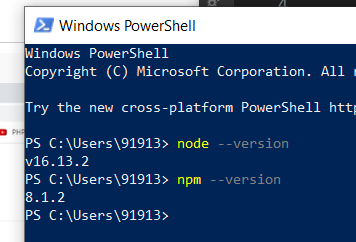
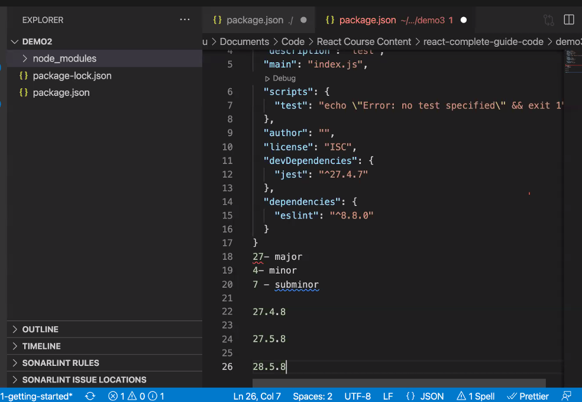

### React
Client side JS library which gives progressive web like experience. 
- React is a library, but since its competetion is with Angular/ Vue.js that's why its called a framework 
- react is maintained by facebook 

#### React helps in creating single page applications.
> single page application - HTML loads once and js keeps uploading without the need to refresh the page 

#### React JS Components 
- we can integrate different components in different parts of our website, through components 
- Its based on component based architecture, these components can be re-used 

#### Installation Tools 
##### 1. Node JS
Node JS (JS runtime that allows us to execute JS, without using the browser)
- Node JS contains NPM and NPX 

1. head over to this site and download the windows version 
https://nodejs.org/en/download/

- install node JS and, navigate to windows powershell 


##### 2. Download React developer tools chrome extension 
##### 3. Download 
- Thunderclient (VS code extension) - used for API Testing
- ES7 React/Redux/GraphQL - helps in importing modules and prototypes 
- live server - used to view static pages 

### Create a New React App 
Documentation: https://reactjs.org/docs/create-a-new-react-app.html

```bash 
Node JS contains:- NPM & NPX 

Packages - These are imported in our code 
✅NPM - package manager: helps in installing the entire package in our system, it causes uneccesary storage on hard disk 

✅NPX - helps in using the required package once without downloading the enitire package 
```
#### Steps to creating a React App 
1. create a this.txt file, open terminal and type 
```bash 
npx create-react-app my-app
```
2. my-app is created with this directory structure 


> lets breifly understand, the app structure 
```bash 
✅node modules 
modules required for react are in this directory 
------

✅package.json
contains packages that are installed in NodeJS 
------

✅gitignore 
contains a list of things that shouldnt be pushed on GIT 
------

✅src 
contains JS components also we can create new components in src folder  
------

✅public -> index.html 
through JS (in src/index.js) div#root will be populated 
   <div id="root"></div>

------
✅src -> index.js 
this is the JS file through which root will be populated 

ReactDOM.render(
  <React.StrictMode>
    <App />
  </React.StrictMode>,
  ✅targetting the div#root to populate it in (public/index.html)
  document.getElementById('root')
);
------

✅src -> app.js 
you can add dyanamic JS changes to react app 
```
> we'll place the react components in src folder
```bash 
✔ Components contain:
1. props 
for instance, there is a form (component), which contains details (props)

2. state 
for instance, the heading of the form(component), is called a state, this state can be changed based on user interaction / HttpRequestResponse / etc 
```
### How to start React app ?
1. open terminal and type 
```bash 
cd my-app
```
2. then type 
```bash 
npm start 
```
> react app has started serving on localhost:3000
3. If you have to biuld an app for production, then type in this command, instead of npm start 
```bash 
npm run biuld 
```


