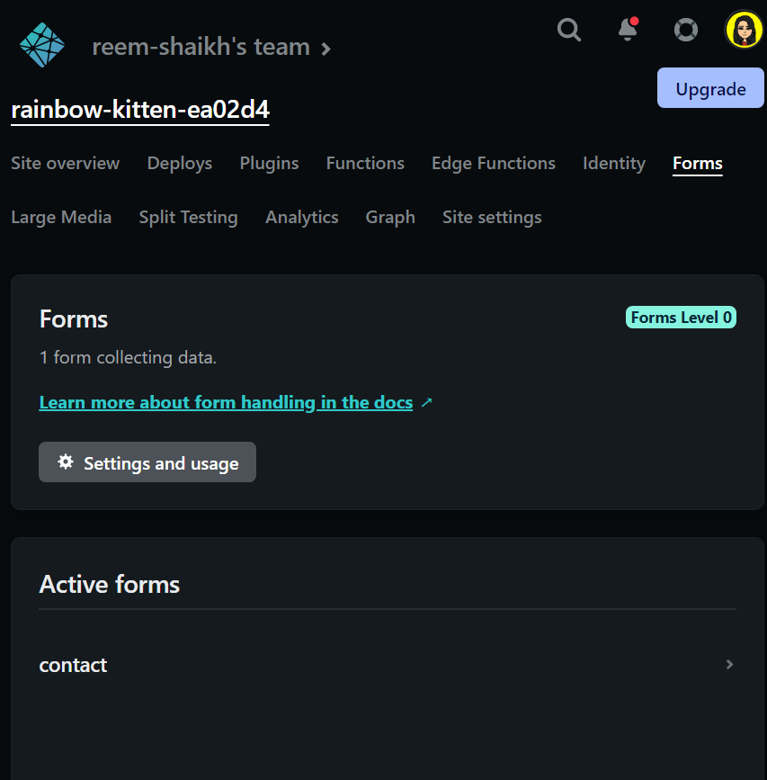

### Netlify form submission (with spam prevention)
1. create a folder with form naming it `index.html` and create a `_redirects` file. 
> _redirects 
```bash
/*    /index.html    200
```
> index.html 
```bash 
<body>
    <div class="container">
        <h1>Contact Form</h1>
            #data-netlify: 'true' - active form when your plugging on server of netlify
            #we added these additional properties inside <form>
        <form name="contact" method="post" data-netlify="true" onSubmit="submit">
            <!-- were having client side validation -->
            <!-- give every input field a name -->
            <input type="text" name="Name" id="" placeholder="Full Name" required>
            <input type="email" name="Email" id="" placeholder="Email" required>
            <select name="Continent" id="">
                <option value="">Africa</option>
                <option value="">Asia</option>
                <option value="">Europe</option>
                <option value="">America</option>
                <option value="">Australia</option>
                <option value="">Antarctica</option>
            </select>
            <textarea name="Message" id="" cols="30" rows="10" placeholder="Message" required></textarea>
            <button type="submit">send</button>
        </form>
    </div>
</body>
```
2. Navigate to netlify, click on new site -> custom deploy -> upload the folder you want to deploy. 

3. now click on the site name and navigate to `forms` within nelify

4. to test this out, fill in the form uploaded at netlify. here's the message we get after filling it out 

- navigate to `Forms` -> `Contacts` -> scroll down a bit and kaboom, you've retreived it. 
 
In this image Note that: we have a little `prevent spam` option. 
5. Now that we've succesfully set it up, we'll need to now integrate spam prevention to make it an extra security feature for your end users to use, to integrate this you can add a honeypot field and/or an explicit reCAPTCHA 2 challenge.
- integrating the honey-pot in our index.html, different scraping tools looking for forms can detect this 
> In form attribute just add `data-netlify-honey-pot`
```bash
        <form name="contact" 
        method="post" 
        data-netlify="true" 
        #adding this attribute 
        data-netlify-honeypot="bot-field"
        onSubmit="submit">
```
- Now we got to update our website changes to acheive this navigate to netlify -> deploys -> drag and drop your folder -> allow netlify some space to do its magic and it'll present you with the updated site link 


> navigate back to `forms` and you'll notice that `prevent spam` is gone. 

6. when someone fills out the form we'll need to display a particular page, like woohoo your message is sent, to integrate this we'll add this property within our form fields 
```bash
  <form name="contact" 
        method="post" 
        data-netlify="true" 
        data-netlify-honeypot="bot-field"
        onSubmit="submit"
        #we added this action property
        action="/success/">
```
> create a success.html 
```bash
<!DOCTYPE html>
<html lang="en">
<head>
    <meta charset="UTF-8">
    <meta http-equiv="X-UA-Compatible" content="IE=edge">
    <meta name="viewport" content="width=device-width, initial-scale=1.0">
    <title>Document</title>
    <style>
       *{
           margin: 0;
           padding: 0;
           outline: 0;
           border: 0;
       }

       body{
           height: 100vh;
           font-family: Arial, Helvetica, sans-serif;
           display: grid;
           place-items: center;
       }

       h1{
           margin-bottom: 2rem;
       }
    </style>
</head>
<body>
    <div class="container">
        <h1>Contact Form</h1>
        <div>Thank you!</div>
        <p>your subsmission has been recieved!</p>
    </div>
</body>
</html>
```
> Now lets re-upload this to netlify in the same way discussed above by uploading the folder at deploys and here's my revamped link 

Note that: no many how many times we update at the end of the day, our base URL provided by netlify will be overwritten. 

> after filling this form and hitting on submit, you'll retreive the success message 

- lets navigate back to `forms` in netlify to see what the user has sent 


7. If you want to integrate a feature where every time a user enters a form you'd like to recieve email notifications, then you'll have to make some teensy updates. 
- navigate to `forms` -> `settings and usage` -> click on `form notification` -> `add a notification` -> `email notification` -> fill in the details according to your requirments 

```bash
Note that: the name of the form is contact 
           the email id I'd want to be notified on is rtrreem.rchc@gmail.com
```
8. click on `save` and viola!


