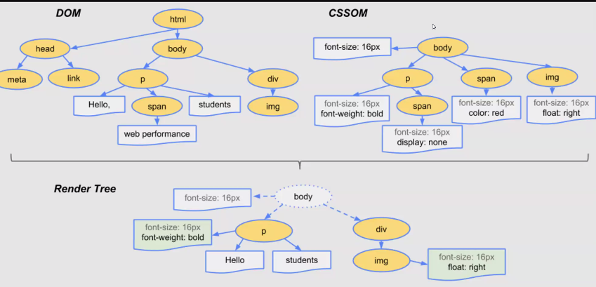
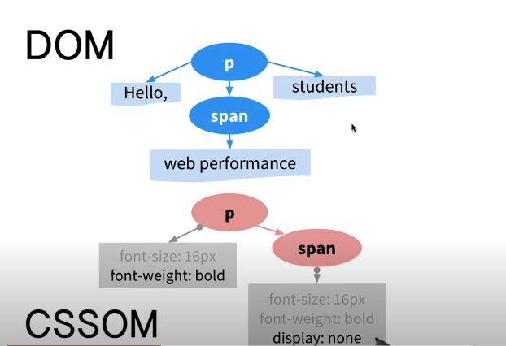
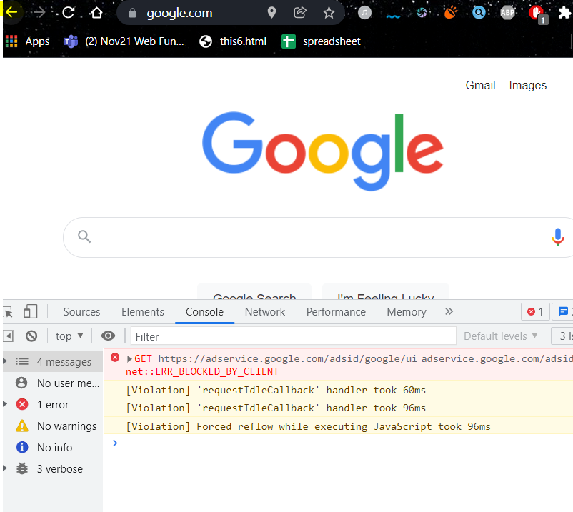
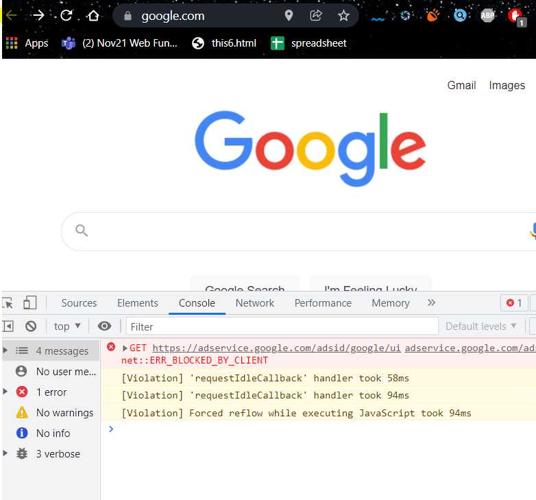

## Time Async functions 
***1 second = 1000ms***
1. setTimeout()
2. clearTimeout()
3. setInterval()
4. clearInterval()

### 1. setTimeout() and clearTimeout()
#### 1.1 setTimeout()
function starts after the particular time interval we mentioned 
#### 1.2 clearTimeout()
function ends when clearTimeout() is invoked 

> example
```bash 
   <style>
        #test{
            width: 150px;
            height: 150px;
            background-color: red;
        }
    </style>
</head>
<body>
    <div id="test"></div>
    <button onclick="stopAnim()">stop animation</button>
    <script>
        var id = setTimeout(Anim, 3000);
        //anim function starts after 3s

        function Anim()
        {
           var target = document.getElementById("test");
           target.style.width = "500px";
           //after 3s width increases to 500px
        }

        function stopAnim()
        {
            clearTimeout(id);
            //when you click on this the animation stops even after 3seconds
        }
    </script>
</body>

viewport:
1. After 3seconds the width of the box increases to 500px due to setTimout function
2. If you click on the stop Animation button before 3s, it will not increase its width 
```
Instead of creating a seperate function Anim(), we integrate it inside this,
```bash 
var id = setTimeout(Anim, 3000);
```
Here's how it looks like right now
```bash 
    <style>
        #test{
            width: 150px;
            height: 150px;
            background-color: red;
        }
    </style>
</head>
<body>
    <div id="test"></div>
    <button onclick="stopAnim()">stop animation</button>
    <script>
       // var id = setTimeout(Anim, 3000);

       var id = setTimeout(function() ✅1. function Anim defined here 
        {
           var target = document.getElementById("test");
           target.style.width = "500px"; 
        }, 3000);

        //function Anim()
        // {
        // var target = document.getElementById("test");
        // target.style.width = "500px";
        // after 3s width increases to 500px
        // }

        function stopAnim()
        {
            clearTimeout(id);
            //when you click on this the animation stops even after 3seconds
        }
    </script>
</body>
```
### 2. setInterval() and clearInterval()
#### 2.1 setInterval()
function called at every interval (ms) you mention 
#### 2.2 clearInterval()
function to stop the interval at a particular time 
```bash 
    <style>
        #test{
            width: 150px;
            height: 150px;
            background-color: red;
        }
    </style>
</head> 
<body>
    <div id="test"></div>
    <script> 
      var a = 0
      var id = setInterval(Anim, 100);
      ✅ value of a increases by 10 at every 0.1 second 

      function Anim(){
          a = a + 10;

          ✅ after 0.5s the animation stops 
          if(a == 500)
          {
              //animation stops after 200ms
              clearInterval(id)
          }
          var target = document.getElementById('test');
          target.style.marginLeft = a + 'px';
          ✅ a+10 runs 50 times at an interval of 0.1s 
          ✅ by the end of 0.5s, the value of a reaches 500 (10 x 50)
      }   
    </script>
</body>

viewport:
1. the red box keeps moving to the left, by increasing the left margin to 10, at an interval of 100ms 
2. when the red box reaches a value of 500
````
#### Difference between setInterval() and setTimeout()
> setTimeout- calls only once 
> setInterval- calls multiple number of times
##### setTimeout()
- it prints hello after 3 seconds on the console 
```bash 
<body>
    <div id="test"></div>
    <script> 
   
      setTimeout(Anim, 3000);

      function Anim(){
          console.log("hello")
      }
    </script>
</body>
```
> another example
```bash 
<body>
    <div id="test"></div>
    <script> 
      var a = 0
      setTimeout(Anim, 3000);

      function Anim(){
          a = a + 10;
          console.log(a)
      }
    </script>
</body>

console: 
10
```
##### setInterval()
- count of hello keeps increasing in the console at an interval of 3s
```bash 
<body>
    <div id="test"></div>
    <script> 
   
      setInterval(Anim, 3000);

      function Anim(){
          console.log("hello")
      }
    </script>
</body>
```
> another example
```bash 
<body>
    <div id="test"></div>
    <script> 
      var a = 0
      setInterval(Anim, 3000);

      function Anim(){
          a = a + 10;
          console.log(a)
      }
    </script>
</body>

console: 
10
20
30...
keeps increasing at a 3s interval 
```
#### Difference between clearTimeout() and clearInterval()
In some browsers, like chrome, 
clearTimeout() can be used to stop setTimeout() and setInterval() as well 
clearInterval() can be used to stop setTimeout() and setInterval() as well 

However, both cannot be used interchangebly, 
clearTimeout() should be used to stop setTimeout()
clearInterval() should be used to stop setInterval()

> clearTimeout() method cancels a timeout set with setTimeout() method
> clearInterval() method clears a timer set with the setInterval() method.

### Discusing DOM, BOM and CSSOM 
parent of DOM IS BOM 
> anything in DOM is part of BOM 

```bash 
   BOM 
    | 
   DOM   +   CSSOM  => RENDER TREE 
```


## DOM 
contains all the content of the page 
**changes properties of html document** 
eg: onclick, src, class, value, type, id, listeners, target, name 

also contains content 
> eg: innerText, innerHTML, children, grandchildren

## CSSOM 
contains all style of the page 
**On html dom, style is done using CSSOM**
The CSS Object Model is a set of APIs allowing the manipulation of CSS from JavaScript. It is much like the DOM, but for the CSS rather than the HTML.
> eg: margin, padding, color, border etc 

```bash 
document.body.style.backgroundColor = 'lightblue';
```

## render tree => DOM + CSSOM 
(for representation purpose)
contains everything that is rendered on the page 
(structure + style)


(only captures/ renders visible content from the CSSOM)

## BOM (browser object model)
**changes property of browser** 
Under the hood, DOM is BOM's child

for browser related programming, we use window object.
- chrome 
- firefox
- opera 
- IE 

> browser refers to the window
> browser object refers to window object 

Terminologies:
- viewport 
- browser window 

What can we get from window object (inbiult methods)?
1. get width and height of browser window 
2. open and close browser window 
3. move and resize browser window 
4. scroll to browser window 
5. get URL, hostname, protocol of browser window 
6. get history of browser window 

## 1. get width and height of browser window 
#### Window height and width methods:
- innerHeight - height of the viewport 
- innerWidth - width of the viewport
- outerHeight - height of the browser window 
- outerWidth - width of the browser window 

Note: As you minimize the console window, or extend it, the window height/ width value 
changes.
```bash 
<script>
        ✅ innerHeight- calculates height from console bar to top of viewport 
        var iHeight = window.innerHeight;
        console.log("innerheight",iHeight);

        ✅ outerHeight- calculates height from top of viewport to bottom of viewport
        with respect to the size of the browser window on the screen 
        var oHeight = window.outerHeight;
        console.log("outerheight", outerHeight)

        ✅ innerWidth- its the width of the viewport 
        var iWidth = window.innerWidth;
        console.log("innerwidth",iWidth);

        ✅ outerWidth- its the width of the viewport + the thin outer section of browser window 
        var oWidth = window.outerWidth;
        console.log("outerwidth",oWidth);        
</script>
```
## 2. open and close browser window 
#### window Open() & Close() methods 
##### Open() method
Open window B through window A through integrating a button on window A
##### Close() method
Close window B through window A through integrating a button on window A

syntax:
```bash 
window.open(URL, name, specs)

    url: domain name of website with protocol (https://www.website.com)
    name: name of the window that your opening (optional)

    name:
    1. you can mention any random name (optional field) 
    this name is just for our reference 

    or
    2. you can give predefined parameter 
        1. _blank (new window opened in new tab)
        2. _self (window opened in same tab its written)
        
        for frameset based websites 
        3. _top 
        4. _parent 

    when you dont specify anything, it opens a new window in a new tab 

    specs: (what are the specs of the new window thats opening)
        - width 
        - height 
        - left 
        - top 
```
window.open() example:
```bash 
<body>
    <button onclick="openWindow()">Open window</button>
    
    <script>
        function openWindow()
        {
            window.open("http://www.mozilla.org", "", "width=500px, height=200px, left=100px, top=200px");
            ✅ when you click on the button a new window gets opened 
         
            ✅ instead of using name property use target properties to indicate where the window must open when button is clicked 

            ✅ new window B that opens will be at a distance of these specs wrt the desktop screen
            // "width=500px, height=200px    left=100px, top=200px"
        }
       
    </script>

</body>
```
window.close() example:
```bash 
    <script>
        let myWindow;
        function openWindow()
        {
            myWindow = window.open("http://www.mozilla.org", "width=500px, height=200px, left=100px, top=200px");
        }

        function closeWindow()
        {
            myWindow.close();
        }
        //window that we opened now closes 
       
    </script>
```
## 3. move and resize browser window 
### 3.1 moveBy() and moveTo() method
### 3.2 resizeBy() and resizeTo()

### 3.1 moveBy() and moveTo() method
#### moveTo() method 
works on absolute postion
```bash 
<body>
    <button onclick="openWindow()">Open window</button>
    <button onclick="moveWindow()">Move window</button>
    
    <script>
        //1. click on the open window button 
        //2. click on move window button - it moves to the coordinates we set in the function
        
        var myWindow;
        function openWindow()
        {
            myWindow = window.open("", "", "width=500px, height=200px, left=100px, top=200px");  
            //move doesnt work when you enter the website URL and the name 
            
            myWindow.document.write("<p>this is my window </p>");
        } 

        function moveWindow()
        {
           myWindow.moveTo(100, 100); //left right 

           //this code ensures that on clicking move window, the window is still 
           //shown above the browser window screen
           ✅myWindow.focus();

           //if we hadnt given this the window would be hidden under the browser window 
        }
       
    </script>
</body> 
```
### moveBy() method
works on relative position
```bash 
<body>
    <button onclick="openWindow()">Open window</button>
    <button onclick="moveWindow()">Move By</button>
    <button onclick="moveWindow1()">Move to</button>
    
    <script>
        var myWindow;
        function openWindow()
        {
            myWindow = window.open("", "", "width=500px, height=200px, left=100px, top=200px");  
            //move doesnt work when you enter the website URL and the name 
            
            myWindow.document.write("<p>this is my window </p>");
        } 

        function moveWindow()
        {
           myWindow.moveBy(100, 100);
        }

        function moveWindow1()
        {
           myWindow.moveTo(100, 100);
        }
       
    </script>
</body>
```
> Difference between moveTo and moveBy?
moveTo() - The coordinates we set will move with respect to the desktop screen, top and left position
moveBy() - The coordinates we set will move with respect to its original position

### 3.2 resizeBy() and resizeTo()
resizeTo() - resizes the window to the value given 
resizeby() - default window size + coordinates given 

```bash 
<body>
    <button onclick="openWindow()">Open window</button>
    <button onclick="closeWindow()">close window</button>
    <button onclick="resizeWindow()">resize to</button>
    <button onclick="resizebyWindow()">resize by</button>
    
    <script>
        let myWindow;
        function openWindow()
        {
            myWindow = window.open("", "", "width=500px, height=200px, left=100px, top=200px");

            myWindow.document.write("<p> this is a document </p>");
        } 

        function closeWindow()
        {
            myWindow.close();
        }
        function resizeWindow()
        {
            myWindow.resizeTo(400, 400);
            // resizeTo(width, height) 
        }

        function resizebyWindow()
        {  //takes relative value 
            //if the browser width is 100px x 100px (height x width)
            //resizeby will increase the browser with by 150px x 150px in this case 
            myWindow.resizeBy(150, 150)

            //so the final browser dimensions will be  250px x 250px 
        }   

    </script>
```

## 4. scroll to browser window 
### ScrollTo() and scrollBy() methods 
scroll without scrollbar 

Terminologies:
-  vertical scrollbar (give y axis value)
upwards: negative value 
downwards: positive value

-  horizontal scrollbar 
leftwards: negative value 
rightwars: positive value 

## 5. get URL, hostname, protocol of browser window 
#### Location object
```bash 
console.log(location);

console:
VM179:1 Location {ancestorOrigins: DOMStringList, href: 'http://127.0.0.1:5500/main/13-12/bom4.html', origin: 'http://127.0.0.1:5500', protocol: 'http:', host: '127.0.0.1:5500', …}
```
To get value from the URL bar/ location bar there are certain 
#### Location object properties:
- hash 
- host 
- hostname 
- href 
- origin 
- pathname 
- port 
- protoocl 
- search 

1. Host
```bash 
console.log(location.host);

console:
VM385:1 127.0.0.1:5500
```
2. Hostname (doesnt contain port number)
```bash 
console.log(location.hostname);

console:
VM491:1 127.0.0.1
```
3. href (returns url)
```bash 
console.log(location.href);

console:
VM580:1 http://127.0.0.1:5500/main/13-12/bom4.html
```

4. port 
```bash 
console.log(location.port);

console:
VM695:1 5500
```

5. protocol 
```bash 
console.log(location.protocol);

console:
VM804:1 http:
```

6. hash- returns hash value in url 
we add /#first to the end of the url in the browser, it shows an 404 error on console 
```bash 
console.log(location.hash);

console:
VM1037:1 #first
```
### Location object methods 
- assign()
- reload()
- replace()

1. assign - what website do you want to load on that page through console
```bash 
console.log(location.assign("https://www.google.com");
```

> back button is still enabled after entering the command

2. reload - page will be reloaded 
```bash 
console.log(location.reload())
```
3. replace - just like assign, except after you write this command in console, 
you cant go back to the previous page 
```bash 
console.log(location.replace("https://www.google.com"));
```

> back button is disabled after entering the command

## 6. get history of browser window 
### History Object 
```bash 
console.log(history);

console:
VM170:1 
History {length: 1, scrollRestoration: 'auto', state: null}
length: 1
scrollRestoration: "auto"
state: null
[[Prototype]]: History
```
History object properties:
- length (denotes how many websites were open on the same page )

> We enter a new website in the url, to measure the length 
```bash 
console.log(history.length);

console:
VM526:1 2           //2 websites were open on the same page 
```

### History Object methods:
- back()
- forward()
- go()

1. back()
```bash 
history.back();

viewport:
(enter a new url on the same page, and type in console)
loads the previous loaded page 
```

2. forward()
```bash 
history.forward();

viewport:
(enter this command on the same page you started off with)
loads the next loaded page 
```

3. go() - can go both forward and backwards 
- forward   (enter 1)
```bash 
history.go(1);

viewport:
goes one page forwards 
```

- backwards (enter -1)
```bash 
history.go(-1);

viewport:
goes one page backwards 
```

------
## Interview Questions 
### Whats the output?
```bash 
    var car = {
            resgistrationnumber: "ga123",
            brand: "toyota",

            displaydetails: function()
            {
                console.log(this.resgistrationnumber + " " + this.brand)
            }
        }
        car.displaydetails(); 

console:      
ga123 toyota
```
### if were accessing two different properties that dont exist 
```bash 
    <script>
        var car = {

            displaydetails: function()
            {
                console.log(this.resgistrationnumber + " " + this.brand)
            }
        }
        car.displaydetails(); 
        
    </script>

console:
undefined undefined 
```
### Returns object of number 
```bash 
   <script>
        var func = function(){

           console.log(this) //this only points to object 
        }.bind(1) //returns an object of number 

        //every send inside bind will point to the object 'this'
        //bind returns a reference while call/apply execute 
        
        func();
        
    </script>

console:
Number {1}
[[Prototype]]: Number
constructor: ƒ Number()
toExponential: ƒ toExponential()
toFixed: ƒ toFixed()
toLocaleString: ƒ toLocaleString()
toPrecision: ƒ toPrecision()
toString: ƒ toString()
valueOf: ƒ valueOf()
[[Prototype]]: Object
[[PrimitiveValue]]: 0
[[PrimitiveValue]]: 1
```
### Returns object of string 
```bash 
<script>
        var func = function(){

           console.log(this)
        }.bind("a")

        func();
        
    </script>

console:
String {'a'}0: "a"length: 1[[Prototype]]: Stringanchor: ƒ anchor()at: ƒ at()big: ƒ big()blink: ƒ blink()bold: ƒ bold()charAt: ƒ charAt()charCodeAt: ƒ charCodeAt()codePointAt: ƒ codePointAt()concat: ƒ concat()constructor: ƒ String()endsWith: ƒ endsWith()fixed: ƒ fixed()fontcolor: ƒ fontcolor()fontsize: ƒ fontsize()includes: ƒ includes()indexOf: ƒ indexOf()italics: ƒ italics()lastIndexOf: ƒ lastIndexOf()length: 0link: ƒ link()localeCompare: ƒ localeCompare()match: ƒ match()matchAll: ƒ matchAll()normalize: ƒ normalize()padEnd: ƒ padEnd()padStart: ƒ padStart()repeat: ƒ repeat()replace: ƒ replace()replaceAll: ƒ replaceAll()search: ƒ search()slice: ƒ slice()small: ƒ small()split: ƒ split()startsWith: ƒ startsWith()strike: ƒ strike()sub: ƒ sub()substr: ƒ substr()substring: ƒ substring()sup: ƒ sup()toLocaleLowerCase: ƒ toLocaleLowerCase()toLocaleUpperCase: ƒ toLocaleUpperCase()toLowerCase: ƒ toLowerCase()toString: ƒ toString()toUpperCase: ƒ toUpperCase()trim: ƒ trim()trimEnd: ƒ trimEnd()trimLeft: ƒ trimStart()trimRight: ƒ trimEnd()trimStart: ƒ trimStart()valueOf: ƒ valueOf()Symbol(Symbol.iterator): ƒ [Symbol.iterator]()[[Prototype]]: Object[[PrimitiveValue]]: ""[[PrimitiveValue]]: "a"
```
## question using call
```bash 
function checkFun(a, b, c){
    console.log(this);
    //this only points to object 
    // the object is a number 

    console.log(a);
    console.log(b);
    console.log(c);
}
checkFun.call(1,2,3,4);
//executes the call function 
// call takes this keyword as a reference 

console:
[Number: 1]
2
3
4
```
## Question using apply
in apply you can pass args dyanamicaly, because we pass arguments in form on array 
```bash 
function checkFun(a, b, c){
    console.log(this);
    console.log(a);
    console.log(b);
    console.log(c);
}
checkFun.apply(1,[2,3,4]);

console:
[Number: 1]
2
3
4
```
## Apply using strings 
```bash 
    <script>
    function checkFun(a, b, c){
    console.log(this);
    console.log(a);
    console.log(b);
    console.log(c);
    }
    checkFun.apply("a",[2,3,4]);
        
    </script>

console:
String {'a'}
q1.html:14 2
q1.html:15 3
q1.html:16 4
```

