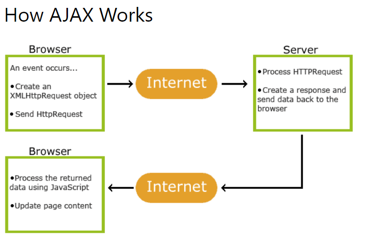

### What is an API?
> two applications communicate with each other throough an API 
> we use API to get access to a specific functionality or data 

> example:
1. We created a website using PHP on backend and MYsql on db 
2. we want to create an app for that website in both ios and android 
3. our website can easily fetch data from mysql, however 
4. apps cannot fetch data directly from mysql because it has other libraries

### API is a third party program,
1. API takes request from android app & website & iphone app and sends it to mysql through The API. Note that: In order to access the API, we would need to login in to authenticate our identity and then the application will give us a secret API key, by using it we can access our API, however, there are certain open/ public API that dont require you to login and get the secret key to access it, its open for all users.
```bash 
                          sends a request            request recieved
   (native) android app   ---->
   (php)    website       ---->        API          ---------------->  MYSQL
   (swift)  ios app       ---->
                                    data converted 
                                    to JSON format   <----------------
                                                     returns a response                                              
```

2. mysql assess the data and returns a response 
3. data is now sent in the form of json data (from API- mysql data converted to JSON) which can be intrepreted/ parsed by ios app and android app.
3. ios app, website and android app can easily access this data in json format  

>> So what is an API key? (more in depth: Analysis)
```bash
Notes:
API key is a security key, which contains a unique value,
to access the API you need a key which will be send along with the request you 
make to the server 

API KEY 
a key ID that identifies the client responsible for the API service request.

API keys provides:
> Identification
identifies is the person that's making a call granted permission to access the API?

> Authentication:
Prove to API that you are the user you claim to be 

> Authorization
grant access right to use the API, this doesnt need log in/ crednetials 
```
### Types of API 
1. Generalised API
2. Web service API 

## 1. Generalised API 
##### 1.1 Open API / Public API 
A public API is open and available for use by any outside developer or
business. An enterprise that cultivates a business strategy that 
involves sharing its applications and data with other businesses will 
develop and offer a public API.

Public APIs typically involve moderate authentication and authorization.

##### 1.2 partner API - creating API in collaboration with business partners 
Partners have clear rights and licenses to access such APIs.
For this reason, partner APIs generally incorporate stronger 
authentication, authorization and security mechanisms.

##### 1.3 Internal API- internal API services, which are private to the company
An internal (or private) API is intended only for use within the enterprise, 
to connect systems and data within the business. 
For example, an internal API may connect an organization's payroll and
HR systems.

Internal APIs traditionally present weak security and authentication -- or none at all --
because the APIs are intended for internal use, and such 
security levels are assumed to be in place through other policies.

##### 1.4 Composite API- fetch from different API's and then create a single API through it 
Composite APIs generally combine two or more APIs to craft a sequence of related or interdependent
operations, and can sometimes improve speed and performance over individual APIs.

## 2. Web service API
1. REST 
2. SOAP - simple object access 
3. RPC - remote procedural call (RPC) 
RPC can employ two different languages, JSON and XML, for coding; these APIs are dubbed JSON-RPC and XML-RPC, respectively.
-  XML-RPC  
-  JSON-RPC 


##### Web Server
- returns only the data requested to the client, without doing any proccessing
- cannot execute the file 
case 1: web server will not return the sum, it will only return the script as it is

##### A web server delivers static web content—e.g., HTML pages, files, images, video, primarily in response to hypertext transfer protocol (HTTP) requests from a web browser.

eg: Apache HTTP server, NGINX 
> open source web server that includes reverse proxy, load balancing, mail proxy, and HTTP cache capabilities

##### Application server
- returns the data requested to the client, with the proccessing
- can execute the file 
case 2: application server returns the sum

##### Application server can generate dynamic content based on server-side logic.

eg: Apache Tomcat, Glassfish 
open source application server that executes Java Servlets, renders and delivers web pages that include JavaServer Page code, and serves Java Enterprise Edition (Java EE) applications.

```bash
✅Real world example of API
- API banking
Transfering money from one bank to another through an API which integrates functionalites which allows transfer of money between these 2 banks.

Set of protocols that makes banks services available to other third party companies via API
```
### API in JavaScript
##### Client side Javascript- has browser API that are biuld on top of the core JS language 
Browser API allows communication between JS engine and the browser 
```bash 
       BROWSER         Browser API        JS ENGINE 
                                          executes JS code/logic here

Browser API is a web API biult on top of the web browser
Browser API is the intermediate in between Browser and JS Engine 

Browser API in js gives access to the window object 

When writing code for the Web, there are a large number of Web APIs available. Below is a list of all the APIs and interfaces (object types) that you may be able to use while developing your Web app or site.
https://developer.mozilla.org/en-US/docs/Web/API

✅JS is a single-threaded programming language 
JS engine doesnt have 
- document object 
- browser object 
- window object 
These objects are a part of the browser API 

✅Possible due to web API 
1. for setinterval, timer is provided by web api 
2. fetch request 
3. DOM manipulation 
4. console.log 
```

### Relationship between JavaScript, APIs, and other JavaScript tools:
#### JavaScript 
A high-level scripting language built into browsers that allows you to implement functionality on web pages/apps. Note that JavaScript is also available in other programming environments, such as Node.

#### Browser APIs
constructs built into the browser that sits on top of the JavaScript language and allows you to implement functionality more easily.

#### Third-party APIs 
constructs built into third-party platforms (e.g. Twitter, Facebook) that allow you to use some of those platform's functionality in your own web pages (for example, display your latest Tweets on your web page).

Third Party API's are used to retreive information from a third party and implement into your page 

> note: chrome, edge, brave, chromium all use the JS v8 engine (written by google).

#### JavaScript libraries 
 Usually one or more JavaScript files containing custom functions that you can attach to your web page to speed up or enable writing common functionality. 
> Examples include ***jQuery, Mootools and React***

#### JavaScript frameworks 
The next step up from libraries, JavaScript frameworks ***(e.g. Angular.js, Vue.js, Node.js, Ember.js)*** tend to be packages of HTML, CSS, JavaScript, and other technologies that you install and then use to write an entire web application from scratch. 

The key difference between a library and a framework is “Inversion of Control”. When calling a method from a library, the developer is in control. With a framework, the control is inverted: the framework calls the developer's code.

#### some Types of Browser API 
1. APIs that fetch data from the server to update small sections of a webpage on their own are very commonly used. 
> eg: XMLHttpRequest, fetch API 

2. Client-side storage APIs are becoming a lot more widespread in web browsers — the ability to store data on the client-side is very useful if you want to create an app that will save its state between page loads, and perhaps even work when the device is offline. 
> eg: web storage API (which includes local storage)

### Web storage API 
used to store data (key:value pairs of string) to web browser 

Data is stored in:
#### 1. session storage
(stores data for one session)
as soon as user, closes window, the data is lost 
- session storage data is not sent to server while making network request calls 

#### 2. local storage 
(stores data with no expiry date)
even when the user closes the website, window the data is stored in the broswer 
- local storage has the highest memory capacity 

> getting data from local storage is easier and faster than making a network call and getting the data.

- user specific data can be kept in web browsers 

>> setting and accesing value 
```bash 
// Store
localStorage.setItem("lastname", "Smith");

//getting
localStorage.getItem("lastname");
```

3. APIs for manipulating documents loaded into the browser. 
> DOM API 

#### How are API's fetched?
Browser API is biult on top of the browser, its not a part of the JS, *Browser API** acts as an interface between the browser and the JS engine, when we use a web API (https://developer.mozilla.org/en-US/docs/Web/API), the call goes from client(browser) to the browser API, where it extracts the additional functionalities of that API (note that: the entire functionality of the API is abstracted from us), after it calls the browser API functionality, the code it then sent to the JS Engine where the logic is rendered.

#### AJAX (Asynchronous JS and XML)
AJAX is a technique for creating fast and dyanamic web pages 
```bash 
We can load only a specific content portion (new newspaper article) on a page, and load it onto the web page without the need to refresh the entire page.

AJAX allows web pages to be updated asynchronously by exchanging data with a web server behind the scenes.

Client makes a request to server 
whenver server sends a response, the entire page refreshes 
to prevent the refreshing, we use the XHR object 
```
1. when client makes a request to the server, it also sends the XMLHttpRequest in the background to the server 
2. server processes the request and sends a response in the form of these data formats, based on what the client has requested for 
- text file 
- XML data 
- JSON data 
3. the updated element are added to the page, without the need for refreshing 


```bash 
1. An event occurs in a web page (the page is loaded, a button is clicked)
2. An XMLHttpRequest object is created by JavaScript
3. The XMLHttpRequest object sends a request to a web server
4. The server processes the request
5. The server sends a response back to the web page
6. The response is read by JavaScript
7. Proper action (like page update) is performed by JavaScript
```
AJAX is not a programming language.

#### AJAX just uses a combination of:
1. A browser built-in XMLHttpRequest object (to request data from a web server)
2. JavaScript and HTML DOM (to display or use the data)

##### readyState
The XMLHttpRequest.readyState property returns the state an XMLHttpRequest client is in. An XHR object exists in one of the following states:
```bash 
readyState:  Description
0:           request is not sent to the server yet 
1:           client-server connection is formed 
2:           server recieved the request 
3:           server processes the request 
4:           request finished processing and response is sent by server
```
> The response sent by the server is either 
1. responseText 
2. responseXML 

### http status code 
Code number which signifies whhat state is the response in 
```bash 
status:    
200        'ok'          server found the file, and returned the response 
403        'forbidden'   server could not respond, due to technical problems
404        'not found'   server could not find the file we requested for 
```
#### AJAX syntax
```bash
✅create XHR object 
var xhttp = new XMLHttpRequest()

✅once we get server response, set it in our HTML DOM 
xhttp.onreadystatechange = function() {
    if(this.readyState == 4 && this.status == 200){
        document.getElementById('demo').innerHTML = this.responseText
        ✅response sent by the server can be either: responseText or responseXML 
        ✅only demo div will be refreshed 
    }
}

✅//xhttp.open('mode of file (GET/POST)', 'file name' async mode)
xhttp.open('GET', 'filename.txt', true) 

✅send the request to server 
xhttp.send()
```
#### XMLHttpRequest API 
XMLHttpRequest (XHR) objects are used to interact with servers. You can retrieve data from a URL without having to do a full page refresh. This enables a Web page to update just part of a page without disrupting what the user is doing.

XMLHttpRequest is used heavily in AJAX programming.
XMLHttpRequest (XHR) is a JavaScript API to create AJAX requests

### Fetch() API 
fetch returns a promise (succesful promise/ failed promise)

#### fetch syntax:
```bash 
fetch(file / URL).then( function(response) {
    return response.data()
    ✅data types:
    1. json 
    2. text 
    3. blob 

}).then(function(result){
    ✅when promise is returned succesfully, response.data is logged inside result variable 
    console.log(result)
}).catch(function(error){
    ✅when promise is failed 
    console.log(error)
})
```
##### We can do CRUD operations using fetch API 
```bash 
C - Create 
R - read 
U - update 
D - delete

There are different methods that help us do CRUD operation
C - Create/ insert data       method: POST
R - read data                 method: GET (default value)
U - update data               method: PUT
D - delete data               method: DELETE
```
### I. Read Data using fetch API 
##### fetching text from readme using fetch API 
```bash 
    <script>
        fetch('fetch.txt')
        .then((response) => {
            return response.text()
        }).then((data) => {
            //the value returned from response.txt is returned over here
            console.log(data)
        })
    </script>

console:
hello

fetch.txt 
hello 
```
##### fetching JSON placeholder data
https://jsonplaceholder.typicode.com/users
```bash 
    <script>
        fetch('https://jsonplaceholder.typicode.com/users')
        .then( response => {
            return response.json();
        }).then( data => {
            console.log(data)
        })
    </script>

console:
(10) [{…}, {…}, {…}, {…}, {…}, {…}, {…}, {…}, {…}, {…}]
0: {id: 1, name: 'Leanne Graham', username: 'Bret', email: 'Sincere@april.biz', address: {…}, …}
1: {id: 2, name: 'Ervin Howell', username: 'Antonette', email: 'Shanna@melissa.tv', address: {…}, …}
2: {id: 3, name: 'Clementine Bauch', username: 'Samantha', email: 'Nathan@yesenia.net', address: {…}, …}
3: {id: 4, name: 'Patricia Lebsack', username: 'Karianne', email: 'Julianne.OConner@kory.org', address: {…}, …}
4: {id: 5, name: 'Chelsey Dietrich', username: 'Kamren', email: 'Lucio_Hettinger@annie.ca', address: {…}, …}
5: {id: 6, name: 'Mrs. Dennis Schulist', username: 'Leopoldo_Corkery', email: 'Karley_Dach@jasper.info', address: {…}, …}
6: {id: 7, name: 'Kurtis Weissnat', username: 'Elwyn.Skiles', email: 'Telly.Hoeger@billy.biz', address: {…}, …}
7: {id: 8, name: 'Nicholas Runolfsdottir V', username: 'Maxime_Nienow', email: 'Sherwood@rosamond.me', address: {…}, …}
8: {id: 9, name: 'Glenna Reichert', username: 'Delphine', email: 'Chaim_McDermott@dana.io', address: {…}, …}
9: {id: 10, name: 'Clementina DuBuque', username: 'Moriah.Stanton', email: 'Rey.Padberg@karina.biz', address: {…}, …}
length: 10
[[Prototype]]: Array(0)
```
##### fetching JSON placeholder data and printing server data on the document
```bash 
    <script>
        fetch('https://jsonplaceholder.typicode.com/users')
        .then( response => {
            return response.json();
        }).then( data => {
            console.log(data)
            ✅x returns each index of the object 
            ✅data[x] returns the object 
            for(var x in data){
                document.write("name: " + data[x].name + " ")
                document.write("username: " + data[x].username + "<br>")
            }
        }).catch(error => {
            console.log('error')
        })
    </script> 

document:
name: Leanne Graham username: Bret
name: Ervin Howell username: Antonette
name: Clementine Bauch username: Samantha
name: Patricia Lebsack username: Karianne
name: Chelsey Dietrich username: Kamren
name: Mrs. Dennis Schulist username: Leopoldo_Corkery
name: Kurtis Weissnat username: Elwyn.Skiles
name: Nicholas Runolfsdottir V username: Maxime_Nienow
name: Glenna Reichert username: Delphine
name: Clementina DuBuque username: Moriah.Stanton

console:
Array(10)
0: {id: 1, name: 'Leanne Graham', username: 'Bret', email: 'Sincere@april.biz', address: {…}, …}
1: {id: 2, name: 'Ervin Howell', username: 'Antonette', email: 'Shanna@melissa.tv', address: {…}, …}
2: {id: 3, name: 'Clementine Bauch', username: 'Samantha', email: 'Nathan@yesenia.net', address: {…}, …}
3: {id: 4, name: 'Patricia Lebsack', username: 'Karianne', email: 'Julianne.OConner@kory.org', address: {…}, …}
4: {id: 5, name: 'Chelsey Dietrich', username: 'Kamren', email: 'Lucio_Hettinger@annie.ca', address: {…}, …}
5: {id: 6, name: 'Mrs. Dennis Schulist', username: 'Leopoldo_Corkery', email: 'Karley_Dach@jasper.info', address: {…}, …}
6: {id: 7, name: 'Kurtis Weissnat', username: 'Elwyn.Skiles', email: 'Telly.Hoeger@billy.biz', address: {…}, …}
7: {id: 8, name: 'Nicholas Runolfsdottir V', username: 'Maxime_Nienow', email: 'Sherwood@rosamond.me', address: {…}, …}
8: {id: 9, name: 'Glenna Reichert', username: 'Delphine', email: 'Chaim_McDermott@dana.io', address: {…}, …}
9: {id: 10, name: 'Clementina DuBuque', username: 'Moriah.Stanton', email: 'Rey.Padberg@karina.biz', address: {…}, …}
length: 10
[[Prototype]]: Array(0)
```
> another example 
```bash 
    <script>
        fetch('https://jsonplaceholder.typicode.com/users')
        .then( response => {
            return response.json();
        }).then( data => {
            console.log(data)
            for(var x in data){
               var a = `${data[x].address.city} -  ${data[x].company.name} `
               document.write(a + "<br>")
            }
        }).catch(error => {
            console.log('error')
        })
    </script> 

document:
Gwenborough - Romaguera-Crona
Wisokyburgh - Deckow-Crist
McKenziehaven - Romaguera-Jacobson
South Elvis - Robel-Corkery
Roscoeview - Keebler LLC
South Christy - Considine-Lockman
Howemouth - Johns Group
Aliyaview - Abernathy Group
Bartholomebury - Yost and Sons
Lebsackbury - Hoeger LLC

console:
Array(10)
0: {id: 1, name: 'Leanne Graham', username: 'Bret', email: 'Sincere@april.biz', address: {…}, …}
1: {id: 2, name: 'Ervin Howell', username: 'Antonette', email: 'Shanna@melissa.tv', address: {…}, …}
2: {id: 3, name: 'Clementine Bauch', username: 'Samantha', email: 'Nathan@yesenia.net', address: {…}, …}
3: {id: 4, name: 'Patricia Lebsack', username: 'Karianne', email: 'Julianne.OConner@kory.org', address: {…}, …}
4: {id: 5, name: 'Chelsey Dietrich', username: 'Kamren', email: 'Lucio_Hettinger@annie.ca', address: {…}, …}
5: {id: 6, name: 'Mrs. Dennis Schulist', username: 'Leopoldo_Corkery', email: 'Karley_Dach@jasper.info', address: {…}, …}
6: {id: 7, name: 'Kurtis Weissnat', username: 'Elwyn.Skiles', email: 'Telly.Hoeger@billy.biz', address: {…}, …}
7: {id: 8, name: 'Nicholas Runolfsdottir V', username: 'Maxime_Nienow', email: 'Sherwood@rosamond.me', address: {…}, …}
8: {id: 9, name: 'Glenna Reichert', username: 'Delphine', email: 'Chaim_McDermott@dana.io', address: {…}, …}
9: {id: 10, name: 'Clementina DuBuque', username: 'Moriah.Stanton', email: 'Rey.Padberg@karina.biz', address: {…}, …}
length: 10
[[Prototype]]: Array(0)
```
##### Creating a JSON file and fetching data from fetch API 
```bash 
    <script>
        fetch('student.json')
        .then( response => {
            return response.json();
        }).then( data => {
            console.log(data)
            for(var x in data){
               var a = `${data[x].name} -  ${data[x].age}-  ${data[x].city} `
               document.write(a + "<br>")
            }
        }).catch(error => {
            console.log('error')
        })
    </script> 

---------
student.json
[
    {
        "name": "kumar sanu",
        "age": "25",
        "city": "goa"
    }, 
    {
        "name": "ram kumar",
        "age": "56",
        "city": "agra"
    }
]
----------

document:
kumar sanu - 25- goa
ram kumar - 56- agra

console:
(2) [{…}, {…}]
0: {name: 'kumar sanu', age: '25', city: 'goa'}
1: {name: 'ram kumar', age: '56', city: 'agra'}
length: 2
[[Prototype]]: Array(0)
```

##### fetching an image using fetch API 
1. call the fetch function (its a asynchronous function)
- fetch function returns a promise 
(promise is a way in a JS, to handle an asynchronous event)
2. return the response in the form of a (text/ blob/ json) 
3. grab data in the body of the response 
4. make an element with that data in the js
```bash 
<body>
    
    <script>
        console.log('about to fetch a rainbow')

        ✅fetch the rainbow
        fetch('https://images.pexels.com/photos/830829/pexels-photo-830829.jpeg?auto=compress&cs=tinysrgb&h=650&w=940').then(response => {
            return response.blob()
            ✅converting response to an img blob
        }).then(response => {
            console.log(response)
            document.getElementById('rainbow').src = URL.createObjectURL(response)
            ✅taking data of that image and placing it in the src attribute of the image dom element 
            ✅URL.createObjectURL is a static method which allows us to fetch image objects (blob) and convert them to a format that an DOM element can intrepet
        }).catch(error => {
            console.log('error')
        })
    </script>
</body>
```
#### Using Async and await
```bash
Async 
keyword which specifies this function will occur asynchronously 

Await 
await the result of fetch and store it in the variable called response 

<body>
    
    <script>
        console.log('about to fetch a rainbow')

        async function catchRainbow(){
            const response = await fetch('https://images.pexels.com/photos/830829/pexels-photo-830829.jpeg?auto=compress&cs=tinysrgb&h=650&w=940').then(response => {
            return response.blob()
        }).then(response => {
            console.log(response)
            document.getElementById('rainbow').src = URL.createObjectURL(response)
        }).catch(err => {
            console.log('catch error')
        })

        }   

        catchRainbow()
    </script>
</body>
```
## Insert/ update/ delete 
##### We can do CRUD operations using fetch API 
```bash 
There are different methods that help us do CRUD operation
C - Create/ insert data       method: POST
R - read data                 method: GET (default value)
U - update data               method: PUT
D - delete data               method: DELETE
```
##### Temporarily inserting data on the server
### 1. inserting object data on the server API 
Refer this page to learn how to insert data:
 https://jsonplaceholder.typicode.com/guide/
```bash 
    <script>
        ✅JSON API from https://jsonplaceholder.typicode.com
        fetch('https://jsonplaceholder.typicode.com/posts', {
            method: 'POST',

            ✅converting js object to json string 
            body: JSON.stringify({
                //js object 
                title: 'foo',
                body: 'bar',
                userId: 1,
            }), 
            ✅specify the data you want to insert in the server
            headers: {
                'Content-type': 'application/json; charset=UTF-8',
            },
            ✅header specifies the format of the data:

            ✅Types of data types:
            ✔ 1. form data     
            //'Content-type': 'application/x-www-form-urlencoded'
            
            ✔ 2. json data      
            //'Content-type': 'application/json'

        }).then(response => {
            return response.json()
        }).then(data => {
            console.log(data)
        })
    </script>

console:
Objectbody: "bar"
id: 101
title: "foo"
userId: 1
[[Prototype]]: Object
```
### 3. Inserting form data to the server API 
```bash 
 <body>
    <form id="myForm">
      Title <input type="text" id="titleText" /><br />
      Body <input type="text" id="bodyText" /> <br />
      User Id <input type="text" id="userId" /> <br />
      <input type="submit" id="saveForm" />
    </form>

    <script>
    document.getElementById("saveForm").addEventListener("click", function(e) 
    {
        ✅when we click the submit button 
        ✅the default behaviour is to refresh the page 
        ✅to prevent that, we call preventDefault function
        e.preventDefault()

        var obj = {
            title: document.getElementById("titletext"),
            body: document.getElementById("bodyText"),
            userId: document.getElementById("userId"),
        };

        fetch("https://jsonplaceholder.typicode.com/posts", {
            method: "POST",
            body: JSON.stringify(obj),
            headers: {
              "Content-type": "application/json; charset=UTF-8",
            },
          })
            .then((response) => response.json())
            .then((data) => console.log(data));
    });
    </script>
  </body>

console:
the values we enter in the form field, gets logged to console.
```

#### Delete data from from the server temporarily using fetch API 
```bash
    <script>
        fetch('https://jsonplaceholder.typicode.com/posts', {
            method: 'DELETE',
        }).then(response => {
            return response.json()
        }).then(data => {
            console.log(data)
        })
    </script>

console:
{}
[[Prototype]]: Objectconstructor: ƒ Object()hasOwnProperty: ƒ hasOwnProperty()isPrototypeOf: ƒ isPrototypeOf()propertyIsEnumerable: ƒ propertyIsEnumerable()toLocaleString: ƒ toLocaleString()toString: ƒ toString()valueOf: ƒ valueOf()__defineGetter__: ƒ __defineGetter__()__defineSetter__: ƒ __defineSetter__()__lookupGetter__: ƒ __lookupGetter__()__lookupSetter__: ƒ __lookupSetter__()__proto__: (...)get __proto__: ƒ __proto__()set __proto__: ƒ __proto__()

```

### Working with data and third party API's in JS 
API: A set of conventions/ protocols which allow two softwares to communicate with each other

##### Authentication for API:
1. can be free 
2. can be accesed by signing up for an API key

> Data existing in the API exists in the JSON format 

1. Were getting lattitude and longitude of the space station 
https://wheretheiss.at/w/developer -> scroll down and copy the resource URL: https://api.wheretheiss.at/v1/satellites/25544

> everytime we refresh this API its value changes: becaause the satellite that is orbitting the earth keeps changing its position

#### Retrieve the quadrant in which the sattelite is currently at, and display in DOM 
```bash 
<body>
    <h1>where the ISS at?</h1>
    <p>The latitude <span id="lat"></span>
        <br />
       The longitude <span id="lon"></span>
    </p>
    <script>
        ✅using fetch function to retreive data from a particular endpoint of an API 
        const url = 'https://api.wheretheiss.at/v1/satellites/25544 '

        async function getData() {
            const response = await fetch(url).then(response => {
                return response.json()
            }).then(data => {
                console.log("data",data)

                //console.log("latitude",data.latitude)
                //console.log("longitude", data.longitude)

            //JS destructuring
            const {latitude, longitude} = data
            console.log("data destructured:", data)

            document.getElementById('lat').textContent = latitude
            document.getElementById('lon').textContent = longitude
            })

        }
        getData();      
    </script>
</body>
```
#### Plot the point of lattitude and longitude of the sattelite on the map using third party library: leaflet JS
> Preparing your page
Before writing any code for the map, you need to do the following preparation steps on your page:

1. Include Leaflet CSS file in the head section of your document:
```bash 
<link rel="stylesheet" href="https://unpkg.com/leaflet@1.7.1/dist/leaflet.css"
integrity="sha512-xodZBNTC5n17Xt2atTPuE1HxjVMSvLVW9ocqUKLsCC5CXdbqCmblAshOMAS6/keqq/sMZMZ19scR4PsZChSR7A=="
crossorigin=""/>

<!-- Make sure you put this AFTER Leaflets CSS -->
<script src="https://unpkg.com/leaflet@1.7.1/dist/leaflet.js"
integrity="sha512-XQoYMqMTK8LvdxXYG3nZ448hOEQiglfqkJs1NOQV44cWnUrBc8PkAOcXy20w0vlaXaVUearIOBhiXZ5V3ynxwA=="
crossorigin=""></script>
```
2. Put a div element with a certain id where you want your map to be:
```bash
 <div id="map"></div>
```
3. Make sure the map container has a defined height, for example by setting it in CSS:
```bash
#map { height: 180px; }
```
4. Setting up the map 
First we’ll initialize the map and set its view to our chosen geographical coordinates and a zoom level:
```bash 
✅setView(latitude, longitude, zoomlevel)
var map = L.map('map').setView([1, 1], 1);
```
5. This snippet of code loads the map 
> use openstreetmap for loading the tiles with this particular attribution
```bash 
L.tileLayer('https://{s}.tile.openstreetmap.org/{z}/{x}/{y}.png', {
attribution: '&copy; <a href="https://www.openstreetmap.org/copyright">OpenStreetMap</a> contributors'
}).addTo(map);

L.marker([lattitude, longitude]).addTo(map)
.bindPopup('A pretty CSS3 popup.<br> Easily customizable.')
.openPopup();
```
6. Add marker 
- intiially we set the marker to 0,0
```bash 
L.marker([0,0]).addTo(map);
```
- it loads the marker to where it is at the moment 
```bash 
✅changing marker length 
marker.setLatLng([latitude, longitude]);

✅Marker method: https://leafletjs.com/reference.html#marker
setLatLng - Changes the marker position to the given point.
```
> everytime the satellite changes its position, its updated through the marker coordinates
```bash 
loaded the leaflet JS library: https://leafletjs.com/examples/quick-start/

<link rel="stylesheet" href="https://unpkg.com/leaflet@1.7.1/dist/leaflet.css"
integrity="sha512-xodZBNTC5n17Xt2atTPuE1HxjVMSvLVW9ocqUKLsCC5CXdbqCmblAshOMAS6/keqq/sMZMZ19scR4PsZChSR7A=="
crossorigin=""/>

<!-- JS Reference: Make sure you put this AFTER Leaflets CSS -->
 <script src="https://unpkg.com/leaflet@1.7.1/dist/leaflet.js"
 integrity="sha512-XQoYMqMTK8LvdxXYG3nZ448hOEQiglfqkJs1NOQV44cWnUrBc8PkAOcXy20w0vlaXaVUearIOBhiXZ5V3ynxwA=="
 crossorigin=""></script>

 ✅L is the global variable loaded from the leadlet library
 <style>
     #map { height: 690px; }
 </style>
</head>
<body>
    <div id="map"></div>

    <script>
        ✅creating a map object 

        //var map = L.map('map').setView([51.505, -0.09], 13);
        //setView(latitude, longitude, zoomlevel)
        var map = L.map('map').setView([1, 1], 1);

        ✅adding marker 
        //setting intiial marker quadrant to [0,0]
        const marker = L.marker([0,0]).addTo(map)

        //were using openstreetmap API as a baground map 
        //we have to give its attribution 

        ✅tileLayer(tile URL, attribution)
        const attribution = ' &copy; <a href="https://www.openstreetmap.org/copyright">OpenStreetMap</a> contributors, Imagery © <a href="https://www.mapbox.com/">Mapbox</a>'

        const tileUrl = 'https://{s}.tile.openstreetmap.org/{z}/{x}/{y}.png';

        const tiles = L.tileLayer(tileUrl, {attribution});

        ✅add tiles to map 
        tiles.addTo(map)

 
        ✅using fetch function to retreive data from a particular endpoint of an API 
        const url = 'https://api.wheretheiss.at/v1/satellites/25544 '

        async function getData() {
            const response = await fetch(url).then(response => {
                return response.json()
            }).then(data => {
                console.log("data",data)

            //console.log("latitude",data.latitude)
            //console.log("longitude", data.longitude)

            //JS destructuring
            const {latitude, longitude} = data
            console.log("data destructured:", data)

            ✅changing marker length 
            marker.setLatLng([latitude, longitude]);
            //setLatLng - Changes the marker position to the given point.

            document.getElementById('lat').textContent = latitude
            document.getElementById('lon').textContent = longitude
            })
        }
        getData();    
    </script>
    
</body>
```
#### Another project using leaflet JS 
```bash 
<!DOCTYPE html>
<html lang="en">
<head>
    <meta charset="UTF-8">
    <meta http-equiv="X-UA-Compatible" content="IE=edge">
    <meta name="viewport" content="width=device-width, initial-scale=1.0">

    ✅refer the entire importing third party library from:
    https://leafletjs.com/examples/quick-start/

    <title>Log My Day</title>
<!--third party library: leaflet-->
<!--https://leafletjs.com/download.html -->
    <link rel="stylesheet" href="https://unpkg.com/leaflet@1.7.1/dist/leaflet.css" integrity="sha512-xodZBNTC5n17Xt2atTPuE1HxjVMSvLVW9ocqUKLsCC5CXdbqCmblAshOMAS6/keqq/sMZMZ19scR4PsZChSR7A==" crossorigin="" />

<!-- JS Reference: Make sure you put this AFTER Leaflets CSS -->
    <script defer src="https://unpkg.com/leaflet@1.7.1/dist/leaflet.js" integrity="sha512-XQoYMqMTK8LvdxXYG3nZ448hOEQiglfqkJs1NOQV44cWnUrBc8PkAOcXy20w0vlaXaVUearIOBhiXZ5V3ynxwA==" crossorigin=""></script>

    <script src="script.js" defer></script>

 <!--L is the global variable loaded from the leaflet script-->
<style>
*{
    padding: 0;
    margin: 0;
    box-sizing: border-box;
}


.container{
    width: 100vw;
    height: 100vh;
    display: flex;
    justify-content: center;
    align-items: center;
}

.left{
    flex: 1;
    height: 100%;
    background-color: green;
}

.right{
    flex: 3;
    height: 100%;
}

#map{
    width: 100%;
    height: 100%;
}

.hide{
    display: none;
}
    </style>

</head>
<body>
    <div id="container" class="container">
        <div id="left" class="left">

        </div>
        <div id="right" class="right">
            <div id="map" class="map">

            </div>
        </div>
    </div>
</body>
</html>
```
> Now, we'll be understanding the process we follow in writing the JS code 
- geolocation is a browser API 
- geolocation present inside navigator API (through which we can fetch location)

***geolocation (takes 2 arguments which are functions)***
- 1st function will run if geolocation is able to get your location
- 2nd function will run if geolocation is not able to get your location
```bash
navigator.geolocation.getCurrentPosition(function(event){
    console.log("event",event)

},function(){
    alert("could not get your location")
})

console:
✅returns geolocation object 
event 
GeolocationPosition
✅coords: GeolocationCoordinates
accuracy: 45.437
altitude: null
altitudeAccuracy: null
heading: null
✅latitude: 19.1367105
✅longitude: 72.8443521
speed: null
[[Prototype]]: GeolocationCoordinates
timestamp: 1642254696547
[[Prototype]]: GeolocationPosition
```
> we'll fetch the lattitude and longitude 
```bash 
<script>
navigator.geolocation.getCurrentPosition(function(event){
    console.log("event",event)
    console.log("latitude", event.coords.latitude)
    console.log("longitude", event.coords.longitude)

},function(){
    alert("could not get your location")
})
</script>

console:
event GeolocationPosition {coords: GeolocationCoordinates, timestamp: 1642255103925}
practice.html:111 latitude 19.1367075
practice.html:112 longitude 72.8443754
```
> Setting up the map 
First we’ll initialize the map and set its view to our chosen geographical coordinates and a zoom level:
```bash 
✅setView(latitude, longitude, zoomlevel)
var map = L.map('map').setView([51.505, -0.09], 13);
```

> This snippet of code loads the map 
use openstreetmap for loading the tiles with this particular attribution
```bash 
L.tileLayer('https://{s}.tile.openstreetmap.org/{z}/{x}/{y}.png', {
attribution: '&copy; <a href="https://www.openstreetmap.org/copyright">OpenStreetMap</a> contributors'
}).addTo(map);

L.marker([51.5, -0.09]).addTo(map)
.bindPopup('A pretty CSS3 popup.<br> Easily customizable.')
.openPopup();
```
> were setting the present coordinates 
```bash 
<script>
navigator.geolocation.getCurrentPosition(function(event){
    console.log("event",event)
    console.log("latitude", event.coords.latitude)
    console.log("longitude", event.coords.longitude)

✅const coordinates = [event.coords.latitude, event.coords.longitude]
✅var map = L.map('map').setView(coordinates, 13);
L.tileLayer('https://{s}.tile.openstreetmap.org/{z}/{x}/{y}.png', {
attribution: '&copy; <a href="https://www.openstreetmap.org/copyright">OpenStreetMap</a> contributors'
}).addTo(map);

✅L.marker(coordinates).addTo(map)
.bindPopup('A pretty CSS3 popup.<br> Easily customizable.')
.openPopup();

},function(){
    alert("could not get your location")
})
</script>
```
> were adding an event listener on the tile so we can extract the coordinates of that particular tile 
```bash 
map.on('click', function(mapEvent){
    console.log(mapEvent)
})

console:
When we click on a tile on the map this loads:

{originalEvent: PointerEvent, containerPoint: k, layerPoint: k, latlng: D, type: 'click', …}
containerPoint: k {x: 396.52979880681664, y: 328.7925472459618}
✅latlng: D
lat: 19.137093295679083
lng: 72.85523926142238
[[Prototype]]: Object
layerPoint: k {x: 666.5297988068166, y: 372.7925472459618}
originalEvent: PointerEvent {isTrusted: true, pointerId: 2, width: 1, height: 1, pressure: 0, …}
sourceTarget: i {options: {…}, _handlers: Array(6), _layers: {…}, _zoomBoundLayers: {…}, _sizeChanged: false, …}
target: i {options: {…}, _handlers: Array(6), _layers: {…}, _zoomBoundLayers: {…}, _sizeChanged: false, …}
type: "click"
[[Prototype]]: Object
```
> when we click on a tile on map, the marker should appear 
```bash 
  <script>
    navigator.geolocation.getCurrentPosition(
      function (event) {
        console.log("event", event);
        console.log("latitude", event.coords.latitude);
        console.log("longitude", event.coords.longitude);

        const coordinates = [event.coords.latitude, event.coords.longitude];

        var map = L.map("map").setView(coordinates, 13);
        L.tileLayer("https://{s}.tile.openstreetmap.org/{z}/{x}/{y}.png", {
          attribution:
            '&copy; <a href="https://www.openstreetmap.org/copyright">OpenStreetMap</a> contributors',
        }).addTo(map);

        ✅we commented out the marker from here 
        // L.marker(coordinates)
        //   .addTo(map)
        //   .bindPopup("A pretty CSS3 popup.<br> Easily customizable.")
        //   .openPopup();

        map.on("click", function (mapEvent) {
          console.log(mapEvent);
          console.log("lattitude",mapEvent.latlng.lat)
          console.log("lattitude",mapEvent.latlng.lng)

        ✅const currentLocation = [mapEvent.latlng.lat, mapEvent.latlng.lng]
        ✅console.log(currentLocation)
          
        //when someone clicks on the map, marker shall appear 
        ✅L.marker(currentLocation)
          .addTo(map)
          .bindPopup("A pretty CSS3 popup.<br> Easily customizable.")
          .openPopup();
        });
      },
      function () {
        alert("could not get your location");
      }
    );
  </script>

console:
✅coordinates 
event
GeolocationPosition {coords: GeolocationCoordinates, timestamp: 1642256551533}
practice.html:115 latitude 19.1389487
practice.html:116 longitude 72.8397202

✅mapEvent
practice.html:131 {originalEvent: PointerEvent, containerPoint: k, layerPoint: k, latlng: D, type: 'click', …}
✅current location
practice.html:132 lattitude 19.15443414998953
practice.html:133 lattitude 72.86090588565013
practice.html:136 (2) [19.15443414998953, 72.86090588565013]
```


