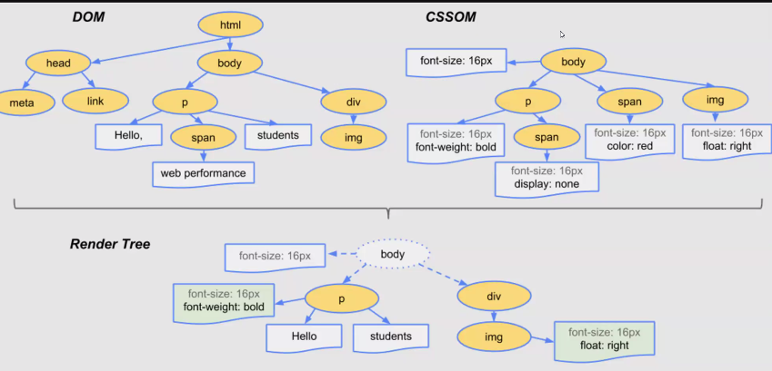

## 1. CSSOM 
On html dom, style is done using CSSOM 

- tree which contains styles 
- it will have style properties instead of html attributes 
eg: style properties -> font-size, width, height, etc 

## 2. render tree => DOM + CSSOM 
contains everything that is rendered 
(structure + style)

rendering -> displaying content (document) on the viewport.

## DOM 
- same tree, each html element will be a single node here 
- it will contain html attributes as well as html content 
eg: src, type, id, class, content, innerHTML, eventlistener

BOM is owner of DOM, CSSOM is a seperate concept 
```bash 
   BOM 
    | 
   DOM   +   CSSOM  => RENDER TREE 
```


