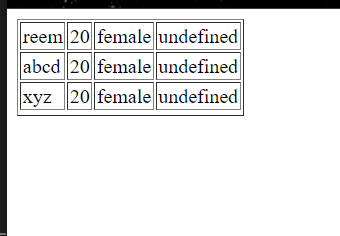

#### Data Types in JS:
1. String
2. number
3. boolean 
> 4. array 
5. object 
6. null 
7. undefined 

## JS Arrays 
you can store multiple values of different datatypes in one variable 
```bash 
// index: 0  1   2
var a = [10, 20, 30]
```
### Ways of printing an Array 
> Displaying an Array
```bash 
var arr = [10, 20, 30, 40, 50];
document.write(arr)

document:
10, 20, 30, 40, 50
```
> Displaying an array using for loop 
```bash 
var sum = 0
document.write("<ul>")
for(var a = 0; a <= 4; a++)
        {
            document.write("<li>" + arr[a] + "</li>")
            sum = sum + arr[a]
        }
document.write("</ul>")
document.write("sum " + sum)

document:
* 10 
* 20
* 30 
* 40
* 50 

sum 150
```
> Creating array using new keyword 
basically, a constructor method to create an array 
```bash
var a = new Array()
```
You can initialize an empty Array and explicitly add values in it 
```bash 
var arr2 = new Array();
arr2[0] = 10;
arr2[1] = "harry";
arr2[3] = true;
```
Or you can even declare it inside array, itself 
```bash 
var arr2 = new Array(10, "harry", true);
```

> Getting value from user, during run time 
```bash 
    var arr2 = new Array();
    for(var g = 0; g < 3; g++)
      {
          arr2[g] = prompt("enter the value");
      }

      for(var a = 0; a < 3; a++)
      {
          document.write(arr2[a] + "")
      }

document:
reem 20 female 
```
### Multi Dimensional Array 
Array inside array 
```bash 
 var arr = 
      [
        ["reem", 20, "female"],  //0
        ["abcd", 20, "female"],  //1
        ["xyz", 20, "female"],   //2
      ];

    for (var a = 0; a < 4; a++) 
    {
        for (var b = 0; b < 4; b++)
        {
           document.write(arr[a][b] + " ")
        }
        document.write("<br>")
    }

document:
reem 20 female undefined
abcd 20 female undefined
xyz 20 female undefined
```
> Defining multidimensional array like a table 
```bash 
 var arr2 = [
        ["reem", 20, "female"],  //0
        ["abcd", 20, "female"],  //1
        ["xyz", 20, "female"],   //2
    ];

    document.write("<table border='1px'>");
      for (var a = 0; a < 4; a++) 
      {
        document.write("<tr>")
        for (var b = 0; b < 4; b++) {
         document.write("<td>" + arr2[a][b] + "</td>")
        }
        document.write("</tr>")
      }
    document.write("</table")
```

-----

### Array Methods 
1. Modify 
```bash 
    var a = ["abcd", 20, "female"]

    //modify 
    a[0] = "reha"
    document.write("modify" + a + "<br>")

document:
modify reha,20,female
```
2. Delete 
```bash 
    //delete 
    delete a[1]
    document.write("deleted array: " + a + "<br>")

document:
deleted array: reha female
```
3. Sort and unsorted
```bash
    //sort 
    var b = ["sanjay", "aman", "rehman", "karan"]
    document.write("unsorted array: ", b)
    document.write("<br>")

    b.sort()
    document.write("sorted b array: ", b)

    document.write("<br>")

document:
unsorted array: sanjay,aman,rehman,karan
sorted b array: aman,karan,rehman,sanjay
```

4. reverse 
```bash 
    //reverse - print the reverse array 
    b.reverse();
    document.write("reversed: ", b, "<br>")

document:
reversed: sanjay,rehman,karan,aman
```

5. pop 
```bash 
    //pop - deletes last value of array
    b.pop()
    document.write("popped: ", b, "<br>")

document:
popped: sanjay,rehman,karan
```

6. push 
```bash
    //push - add an element at last of array
    b.push("rahul")
    document.write("pushed: ", b, "<br>")

document;
pushed: sanjay,rehman,karan,rahul
```

7. Shift
```bash
    //shift - delete first value in array
    b.shift() 
    document.write("shift: ", b, "<br>")

document:
shift: rehman,karan,rahul
```
8. Unshift
```bash 
    //unshift- adds on first index
    b.unshift("kiran") 
    document.write("unshift: ", b, "<br>")

document:
unshift: kiran,rehman,karan,rahul
```
9. concat 
```bash
    //concat- add two array into one 
    var c = ["riya", "geetika"]
    var d = c.concat("rahul")

    document.write("concat string method1: ", d, "<br>")

    var e = ["kripa"]
    var f = c.concat(e);
    document.write("concat string method2: ", f, "<br>")

document:
concat string method1: riya,geetika,rahul
concat string method2: riya,geetika,kripa
```
10. Join 
```bash
    //join - array to string conversion
    var g = f.join(" / ");
    document.write("join: ", g, "<br>")

document:
join: riya / geetika / kripa
````

11. slice
```bash
    //slice(start, end) - to fetch values 
    document.write("array: ", b, "<br>")
        // start value - included 
        // end value - not included 

    var h = b.slice(1, 3)
    document.write("sliced: ", h, "<br>")

console:
array: kiran,rehman,karan,rahul
sliced: rehman,karan
```

12. splice
```bash
    //splice (index, how many (optional), new value)
        // can insert 
        // can delete 

    //doesnt create new array, makes changes on existing array only

    h.splice(1, 0, "neha", "liya")
    document.write("spliced: ", h, "<br>")
    // 0 indicates value is not deleted


    h.splice(1, 1, "riya")
    document.write("spliced deleting: ", h, "<br>")
    // 1 indicates value is deleted at 1st index and replaced by new value

document:
spliced: rehman,neha,liya,karan
spliced deleting: rehman,riya,liya,karan
```
13. isArray
```bash 
    //isArray - is it array or not?
    var arr1 = ["sanjay", "aman"]
    var arr2 = 20

    var arr3 = Array.isArray(arr2)
    document.write("isarray: ", arr3, "<br>")

    if(Array.isArray(arr1) == true)
        {
            document.write("this is an array" + "<br>")
        }else{
            document.write("not an array")
        }

document:
isarray: false
this is an array
```
14. IndexOf 
```bash
    //indexOf(searchitem, start the search) - what is the index 

    //starts search from start
    var arr5 = ["sanjay", "aman", "rehman", "arman", "aman"]
    document.write("arr5: ", arr5, "<br>")

    var j = arr5.indexOf("aman");
    document.write("index of aman:", j, "<br>")

    var j = arr5.indexOf("aman", 2);
    document.write("index of aman :", j, "<br>")

document:
arr5: sanjay,aman,rehman,arman,aman
index of aman:1
index of aman :4
```

15. lastIndexOf 
```bash
    //lastIndexOf(searchitem, start)

    //starts search from end 
    var j1 = arr5.lastIndexOf("aman")
    document.write("lastindex of aman:", j1, "<br>")

        //indexing starts from end

        //   4         3        2        1        0
        //["sanjay", "aman", "rehman", "arman", "aman"]
        
    var j1 = arr5.lastIndexOf("aman")
    document.write("lastindex of aman  :", j1, "<br>")

document:
lastindex of aman:4
lastindex of aman :4
```

16. includes
```bash
    //includes(search item)
    document.write("arr5: ", arr5, "<br>")
    var v = arr5.includes("arman")
    document.write("is it included? ", v, "<br>")

document:
arr5: sanjay,aman,rehman,arman,aman
is it included? true
```
17. some 
```bash 
    //some - even if one value is true, it returns true 
    var ages = [10,20,30]
    var adultage = 18

    var k = ages.some(checkadult)
    document.write(k + "<br>")

    // need to create a function to use some()
    function checkadult(age)
        {
            return age >= 18;
            //test every value in ages[] if its greater than 18, if any value satisfies it returns true 
        }

document:
true 
```
18. every 
```bash
    //every - all values are true, then it returns true 
    var l = ages.every(checkadult1)
    document.write(l + "<br>")

    // need to create a function to use some()
    function checkadult1(age)
        {
            return age >= 18;
            //test every value in ages[] if its greater than 18, if any value satisfies it returns true 
        }

document:
false 
```
19. find 
```bash 
    //find - search on basis of a condition, return first element which satisfies the condition 
    var find = ages.find(checkadult1)
    document.write("find: ", find + "<br>")

document:
find: 20
```

20. findIndex
```bash 
    //findIndex - returns first index of the element that satisfies the condition 
    var findindex = ages.findIndex(checkadult1)
    document.write("findindex: ", findindex + "<br>")

document:
findindex: 1
```

21. filter 
```bash
    //filter(functionnname) - whichever element satisfies the condtiion gets added to a new array 
    document.write("ages", ages, "<br>")
    var filter = ages.filter(checkAdult)
    document.write("filter ", filter, "<br>")

        function checkAdult(age)
        {
            return age >= 18
        }

document:
ages10,20,30
filter 20,30
```

22. toString
```bash
    //toString - convert array to string and return the result 
    document.write("ages: array ", ages, "<br>")
    ages.toString()
    document.write("ages: string ", ages, "<br>")

document:
ages: array 10,20,30
ages: string 10,20,30
```

23. valueOf
```bash
    //valueOf - returns the array 
    // same as document.write 
    document.write("array B: ", b, "<br>")
    document.write("value of: ", b.valueOf(), "<br>")

document:
array B: kiran,rehman,karan,rahul
value of: kiran,rehman,karan,rahul
```

24. fill
```bash 
    //fill - fill array with same static value 
    b.fill("sam")
    document.write("fill:", b, "<br>")

document:
fill:sam,sam,sam,sam
```

## Loops 
 1. forEach 
 ```bash 
    ages.forEach(function(value, index){
            document.write(index + " : " + value + "<br>")
    });

document:
0 : 10
1 : 20
2 : 30
```
2. for In loop - used for printing objects 
```bash 
    var obj = {
            // key   : value 
            firstName: "reem",
            age: 20, 
            country: "india"
    }; 

        //instead of printing this individually like this 
        //console.log(a.firstName)
        //console.log(a.age)
        //console.log(a.country)

        for(var key in obj)
        {
            document.write(obj[key] + "<br>")

        }

document:
reem
20
india
 ```

 ### Event handler Object 
    Event e , contains information about the event that has just occured    
```bash 
<body>
    <button id="btn1">button</button>

    <script>
        let btn = document.getElementById('btn1').addEventListener('click', function(e){
            console.log(e)
            //contains properties about event that has just occured 

            if(e.ctrlKey)
            {
                //when you click on control + click on button 
                //this prints on console 
                console.log("olllllllllllllol")
            }
        });

    </script>
</body>

1. when you click on both cntrl + button this loads on
console:
PointerEvent {isTrusted: true, pointerId: 1, width: 1, height: 1, pressure: 0, …}isTrusted: truealtKey: falsealtitudeAngle: 1.5707963267948966azimuthAngle: 0bubbles: truebutton: 0buttons: 0cancelBubble: falsecancelable: trueclientX: 42clientY: 14composed: truectrlKey: truecurrentTarget: nulldefaultPrevented: falsedetail: 1eventPhase: 0fromElement: nullheight: 1isPrimary: falselayerX: 42layerY: 14metaKey: falsemovementX: 0movementY: 0offsetX: 32offsetY: 4pageX: 42pageY: 14path: (5) [button#btn1, body, html, document, Window]pointerId: 1pointerType: "mouse"pressure: 0relatedTarget: nullreturnValue: truescreenX: 817screenY: 130shiftKey: falsesourceCapabilities: InputDeviceCapabilities {firesTouchEvents: false}srcElement: button#btn1tangentialPressure: 0target: button#btn1tiltX: 0tiltY: 0timeStamp: 27880.099999999627toElement: nulltwist: 0type: "click"view: Window {window: Window, self: Window, document: document, name: '', location: Location, …}which: 1width: 1x: 42y: 14[[Prototype]]: PointerEvent
jsevent.html:25 olllllllllllllol
```

## REST operator 
Why did the need for REST operator emerge? 
```bash 
 //function with multiple args 
        function sum(num1, num2)
        {
            console.log(num1 + num2)
        }

        sum(20,30);
        //sum(20, 30, 40)

        //only works with 2 parameters to resolve this issue 
        //JS ES6 introduced REST Operators 
```
```bash 
        //for/ in loop converts args to objects,
        function sum()
        {
            console.log(arguments)

            let sum = 0 
            for(let i in arguments)
            {
                sum = sum + arguments[i]
            }

            document.write(sum + "<br>")
        }

        sum(20, 30)
        sum(20, 30, 40)
        //sum("reem", 20, 30)    // doesnt add up 

document:
50
90
0reem2030
```

1. problem here is that, we cant pass other datatypes here like strings, to resolve this issue we have rest operator 
2. In REST operator 

```bash 
sum("reem", 20, 10)
rest operator in this sum function seperates this into: name and arguments 

    // 20 and 10 in one array 'args'
    // reem in another array  'name'

... signifies REST operator 
REST stores all arguments that need to be summed, inside this ...args 
``` 

> using Rest Operator to seperate string with ints 
```bash 
        function sum(name, ...args)
        {
            console.log(args)
            document.write(`${name}`)

            let sum = 0 
            for(let i in args)
            {
                sum = sum + args[i]
            }

            document.write(sum + "<br>")

        }
        sum("reem ", 20, 30)

document:
reem 50 
```

### Rest operator doesnt work on arrays 
Rest operator only works only on multiple values, not on array
```bash 
// for example, if we pass args in form of array 
// it will consider the array as one element 

        
        function sum(name, ...args)
        {
            console.log(args)
            document.write(`${name}`)

            let sum = 0 
            for(let i in args)
            {
                sum = sum + args[i]
            }

            document.write(sum + "<br>")

        }

        var arr = [20, 30, 40 ]
        sum("reem ", arr)

document:
reem 020,30,40
```

### Spread operator 
    thats why we use SPREAD OPERATORS 
    spread the array into multiple arguments 

```bash 
    function sum(name, ...args)
    // rest operator used in function declaration 
        {
            console.log(args)
            document.write(`${name}`)

            let sum = 0 
            for(let i in args)
            {
                sum = sum + args[i]
            }

            document.write(sum + "<br>")

        }
    var arr = [20, 30, 40 ]
    sum("reem ", ...arr)
    // spread operator used in function call 

document:
reem 90 
```
