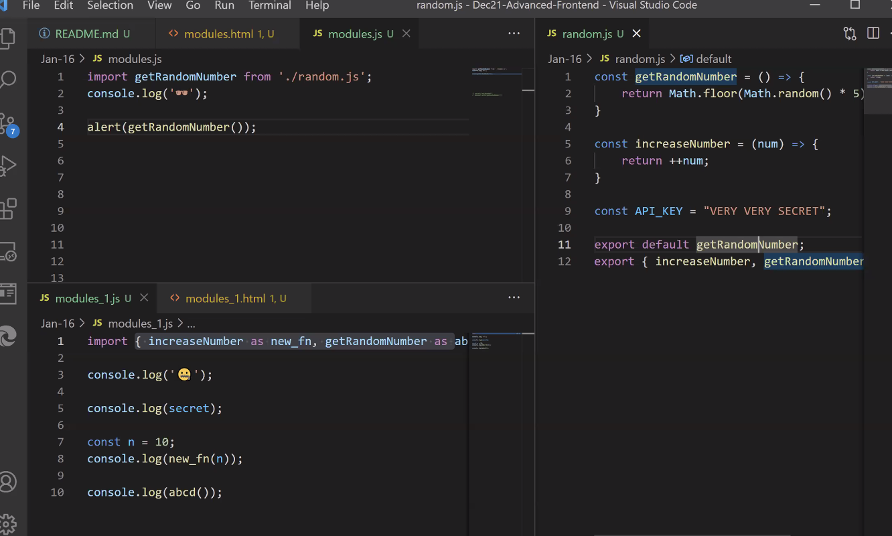

Till now, we've created all our code in a single JS file, however there is a problem with this, 

if we have 2 JS files, with same functionality, it goes against the DRY principle 

There is a principle called as the 'DRY principle' -> which means 'Dont repeat yourself'

If there is a bug in one JS file, and if we want to maintain this file, its going to be very hard, because we have to fix it in both the files.

Till now we've been following 'functional programming paradigm'

Modular programming paradigm means the whole code is consisting of small modules which can be used in plug and play, (similar to LEGO).

Our project is a complex collection of modules 
```bash
eg: video streaming app can include:

video list modules 
recommendation module 
search suggestion module 
navbar module 
```
### Modules 
Using modules we just have to make changes in one single file and it will be linked to the other js file 

> index.html 
```bash 
<body>
✅in order to notify the browser were using modules, we specify type="module"

<script type="module" src="modules1.js"></script>
</body>
```
> random.js 
```bash 
✅Creating a module
const getRandomNumber = () => {
    return Math.random()
}

✅exporting object "getRandomNumber" to module1.js
✅default keyword used when the function is exporting
✅default can only export one function

export default getRandomNumber;
```
> module1.js 
```bash 
✅importing object from random.js
import getRandomNumber from "./random.js"
✅random.js is called module 

console.log(getRandomNumber())
✅ ./ indicates current directory
```

#### Functional programming paradigm VS modular  programming paradigm
> Functional programming paradigm 
suppose we have an index.html file, and 2 JS files,
we have functions written in a single very big js file, if we want to use the js file in a seperate index.html, we can either script src that big file in the html file along with the other js file or copy that first js file into the other js file, kind of like combining both.

> Modular programming paradigm 
we refer to these functions as modules (like a component). Multiple components will make a big complex file and if we need to use it somewhere else, we just import it to that place.

### If were exporting only one file, we use "default" keyword, we can even export multiple 
- functions
- constants 
- primitive datatypes 

> using "as" keyword


> index.html
```bash 
<!DOCTYPE html>
<html lang="en">
<head>
    <meta charset="UTF-8">
    <meta http-equiv="X-UA-Compatible" content="IE=edge">
    <meta name="viewport" content="width=device-width, initial-scale=1.0">
    <title>Document</title>
</head>
<body>
    <!--in order to notify the browser were using modules, we specify type="module"-->
    <script type="module" src="modules1.js"></script>
</body>
</html>

```

> random.js 
```bash 
const getRandomNumber = () => {
     return Math.random()
}

const increaseNumber = (num) => {
    return ++num
}

✅exporting multiple functions
export {increaseNumber, getRandomNumber}
```
> module1.js 
```bash 
✅as keyword used to import multiple functions/ variables
import {increaseNumber as new_fn, getRandomNumber as abcd} from './random.js';

console.log("increasenum",new_fn(10))
console.log("getrandomnumber",abcd())
```
#### We can export constants as well along with the other functions
> index.html 
```bash 
<body>
    ✅in order to notify the browser were using modules, we specify type="module"
    <script type="module" src="modules1.js"></script>
</body>
```
> random.js
```bash 
const getRandomNumber = () => {
     return Math.random()
}

const increaseNumber = (num) => {
    return ++num
}

✅const API_KEY = "very secret"
export {increaseNumber, getRandomNumber, API_KEY}
```
> module1.js 
```bash 

import {increaseNumber as new_fn, getRandomNumber as abcd, API_KEY as secret} from './random.js';

console.log("increasenum",new_fn(10))
console.log("getrandomnumber",abcd())
✅console.log("secret", secret)
```
> IE doesnt support module 
> works in edge, edge is part of chromium browser 
> IE supports only till ecmascript 5
> IE supports Polyfill 

### Since IE doesn't support so many features, developers write compatibility code to support new features in old browser, the code that we write is called polyfill

## OOPS 
> oops.html
```bash 
<body>
    <h4>OOPS I did it again</h4>
    <script type="module" src="book.js"></script>
</body>
```
> book.js 
```bash 
//were creating seperate objects for seperate books 
const book = {
    title : "the subtle art of not giving a fuck", 
    author: "john who?",
    release_date: "1000",  
};

const book2 = {
    title : "alchemist", 
    author: "john doe",
    release_date: "1000",  
};

const book = {
    title : "bro, chill", 
    author: "john doe",
    release_date: "1000",  
};
```
### Factory Approach 
> instead of copy pasting one object and pasting and revamping the new objects, we can create a function which copies and creates a new book 
> book.js
```bash 
//factory approach 
//one single function which generates different objects for you
const createBook = (title, author, release_date) => {
    const book = {
        ✅when key and value have the same name, we can skip writing the value, if we want 
        title: title, 
        author: author,
        release_date: release_date,
    };
    return book;
}

const book1 = createBook('FIOS', 'John Doe')
console.log(book1)

console:
Book {title: 'FIOS', author: 'John Doe', release_date: undefined}
author: "John Doe"
release_date: undefined
title: "FIOS"
[[Prototype]]: Object
```
> oops.html
```bash 
<body>
    <h4>OOPS I did it again</h4>
    <script type="module" src="book.js"></script>
</body>
```
> when there is no inheritance involved, use functional programming.

### Constructor Approach 
> book.js
```bash 
//factory approach 
✅after we create an object, constructor will be initialized
const createBook = (title, author, release_date) => {
     const book = {
         title: title, 
         author: author,
        release_date: release_date,
     };
     return book;
}

✅constructor approach (using functions)
//we already have an object using new keyword 
//well be constructing it 

✅Classname must start with capital letters 
✅function Book is a constructor 
function Book(title, author, release_date){
    this.title = title;
    this.author = author;
    this.release_date = release_date;
}

✅new keyword is used to create an instance of the object "createBook" that has a constructor function 
const book1 = new Book('FIOS', 'John Doe')
console.log(book1)

console:
Book {title: 'FIOS', author: 'John Doe', release_date: undefined}
author: "John Doe"
release_date: undefined
title: "FIOS"
[[Prototype]]: Object
```
> oops.html
```bash 
<body>
    <h4>OOPS I did it again</h4>
    <script type="module" src="book.js"></script>
</body>
```
> these two approaches are ES5 approach
> we'll be using an ES6 version of this approach using class keyword 

### Class Approach 
This is a syntactical sugar of constructor approach, under the hood, its doing the same thing as the constructor approach

> book.js 
```bash 
class bookClass {
    ✅Constructor is first function of the class that will be called when an object is created 
    ✅constructor is used to create object from the class
    ✅create a constructor when you want to assign some default properties to the class 

    constructor(title, author, release_date){
        this.title = title;
        this.author = author;
        this.release_date = release_date;
    }
}

✅new keyword creates class object 
const book3 = new bookClass('harry potter', 'rowling')
console.log(book3)

console:
bookClass {title: 'harry potter', author: 'rowling', release_date: undefined}
author: "rowling"
release_date: undefined
title: "harry potter"
[[Prototype]]: Object
```
> we can have a class with 0 constructors 
```bash 
class Empty {

}

const empty = new Empty()
console.log(empty)

console:
Empty {}
```
## OOP
Its a programming paradigm which revolves around the idea that everything is an object. Objects can have properties or functionalities.

#### There are 4 pillars of OOP:
In order for program to have Object oriented approach, it should follow these 4 pillars.

### 1. Encapsulation 
everything (all properties and methods) is wrapped inside an object (bundling all data and encapsulating ina  single object)

> book.js
```bash 
class bookClass {
    constructor(title, author, release_date){
        this.title = title;
        this.author = author;
        this.release_date = release_date;
    }

    //creating a method 
    getSummary() {
        ✅everything(method/ functions) in class "bookClass" is wrapped inside the object "book3"
        const summary = `The book ${this.title} is written by ${this.author}`
        return summary
    }

}

const book3 = new bookClass('harry potter', 'rowling')
console.log(book3)
console.log("summary",book3.getSummary)

console:
bookClass {title: 'harry potter', author: 'rowling', release_date: undefined}
book.js:18 summary ƒ getSummary() {
        const summary = `The book ${this.title} is written by ${this.author}`
        return summary
    }
```
> combine all objects, inside a single capsule - encapsulation


> as long as the method/ function is inside the class, it follows encapsulation

### 2. Abstraction 
We abstract uneccesary data from users and allow only selected method/ properties to be invoked/ accessed 
> If we dont want user to view something like API_KEY we code it as private, i.e we are abstracting/ hiding secure/ uneccesary information from the user 

> its like encapsulation, except its hidden 


> abstraction is a new feature released in EcmaScript12, around July, 2021
```bash 
class bookClass {
    //private information
    ✅use # to denote the variable is private
    #API_KEY = "very secret"

    constructor(title, author, release_date){
        this.title = title;
        this.author = author;
        this.release_date = release_date;
    }

    //creating a method 
    getSummary() {
        const summary = `The book ${this.title} is written by ${this.author}`
        return summary
    }

    ✅creating a private function
    #showSomeData() {
        console.log('API')
        return 'API response'
    }

}

const book3 = new bookClass('harry potter', 'rowling')
✅we tried to call the private function, using the object
console.log(book3.#showSomeData())

✅we tried to call the private variable, using the object
console.log(book3.#API_KEY)

console:
Uncaught SyntaxError: Private field '#showSomeData' must be declared in an enclosing class
```
> private class features (introduced in ES12) - just use #

### 3. Inheritance
### 4. Polymorphism


