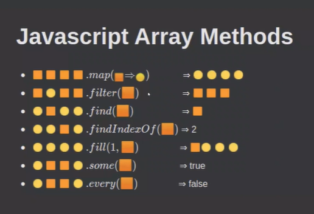

### Array methods 
var str = "hi, i am a string";

1. length
```bash 
  var a = str.length;
  document.write("string is" + str + "<br>")
  document.write("length of string " + a + "<br>")

document:
string is hi, i am a string
length of string 17
```

2. toLowerCase()
```bash
    var b = str.toLowerCase();
    document.write("lowercase string " + b + "<br>")

document:
lowercase string hi, i am a string

```
3. toUpperCase()
```bash 
    var b = str.toUpperCase();
    document.write("uppercase string " + b + "<br>")

document:
uppercase string HI, I AM A STRING
```
4. includes()
```bash
  //true - if returns
  var b = str.includes("am");
  document.write("includes am?" + b + "<br>")

  var b = str.includes("the");
  document.write("includes the?" + b + "<br>")

  //case sensitive function 
  var b = str.includes("Am");
  document.write("includes Am?" + b + "<br>")

document:
includes am?true
includes the?false
includes Am?false
```
5. startsWith()
```bash
  var b = str.startsWith("Am");
  document.write("startswith Am? " + b + "<br>")

  var b = str.startsWith("hi");
  document.write("startswith hi? " + b + "<br>")

  // case sensitive 
  var b = str.startsWith("Hi");
  document.write("startswith Hi? " + b + "<br>")

document:
startswith Am? false
startswith hi? true
startswith Hi? false
```
6. endsWidth()
```bash
  var b = str.endsWith("string");
  document.write("endswith string? " + b + "<br>")

document:
endswith string? true
```
7. search - returns start index of the element we enetered if its found 
```bash
  var b = str.search("string");
  document.write("search " + b + "<br>")

  var b = str.search("str");
  document.write("str " + b + "<br>")

  //if it doesnt find the elemnt it returns -1 
  var b = str.search("ty");
  document.write("search " + b + "<br>")

document:
search 11
str 11
search -1
```
8. match - create an array of the matching string 
```bash
    str1 = "hi string, i am a string "
    var b = str1.match(/string/g);
    document.write("match " + b + "<br>")

document:
match string,string
```
9. indexOf()
```bash
    var b = str1.indexOf("string");
    document.write("indexof " + b + "<br>")

document:
indexof 3
```
10. lastIndexOf()
 ```bash
    var b = str1.lastIndexOf("string");
    document.write("lastindexof " + b + "<br>")

document:
lastindexof 18
```
11. replace()
```bash
    //replaces the first
    var b = str1.replace("string", "str");
    document.write("replaced " + b + "<br>")
       
    //using REGEX to replace all
    var b = str1.replace(/string/g, "str");
    document.write("replaced all" + b + "<br>")

document:
replaced hi str, i am a string
replaced allhi str, i am a str
```
11. trim()
```bash
    var str2 = "     javascript   "
    console.log(str2)
    //spaces displayed only on console, not on document 

    var a = str2.trim();
    console.log("trimmed", a)
```
11.1 trimLeft()
```bash
    var a = str2.trimLeft();
    console.log("trim left", a)
```
11.2 trimRight()
```bash
    var a = str2.trimRight();
    console.log("trim Right", a)
```
12. charAt()
```bash
    // return character at 3rd position
    document.write(str1 + "<br>")
    var b = str1.charAt(3);
    document.write("charAt " + b + "<br>")

    //every character on keyboard has a unique character code called ASCII code

document:
hi string, i am a string
charAt s
```
13. charCodeAt()
```bash
    // returns ASCII code of ch
    document.write(str1 + "<br>")
    var b = str1.charCodeAt(1);
    document.write("charcode of i " + b + "<br>")

document:
hi string, i am a string
charcode of i 105
```
14. fromCharCode()
```bash
    // returns ch of the given ASCII code 

    //string is an inbiult object 
    var b = String.fromCharCode(65);
    document.write("ch code of 65 " + b + "<br>")

document:
ch code of 65 A
```
15. concat()
```bash
    // to merge two strings 
    str3 = "hi yo"
    str4 = "wassup"
    var a = str3.concat(str4);
    document.write("concat 2 strings " + a + "<br>")

    document.write("str1 "+ str1 + "<br>")
    document.write("str3 "+ str3 + "<br>")
    document.write("str4 "+ str4 + "<br>")

    var a = str2.concat(str3, str4)
    document.write("merging 3 strings " + a + "<br>")

document:
concat 2 strings hi yowassup
str1 hi string, i am a string
str3 hi yo
str4 wassup
merging 3 strings javascript hi yowassup
```
16. split()
```bash
    //convert every string to an array 
    var a = str.split(" ");
    document.write("split based on spaces " + a + "<br>")

document:
split based on spaces hi,,i,am,a,string
```
17. repeat()
```bash
    // repeats string the number of times you mentioned 

    //repeats string 2 times 
    var a = str.repeat(2);
    document.write("repeat " + a + "<br>")

document:
repeat hi, i am a stringhi, i am a string
```
18. slice()
```bash
    document.write("str " + str + "<br>")
    //returns character between 6 - 12 (doesnt include the 12th index)
        
        // 0 1 2 3 4 5 6 7 8 9 10 11 12
        // h i ,   i   a m   a     s  t 

    var a = str.slice(6, 12);
    document.write("slice " + a + "<br>")
        // am a s

document:
str hi, i am a string
slice am a s
```
19. substr()
```bash
    //returns string after 4 till (5 words)
    var a = str.substr(4, 5);
    document.write("substr " + a + "<br>")

    var a = str.substr(4);
    document.write("substr " + a + "<br>")

document:
substr i am
```
20. substring()
```bash
    //slice is used for arrays 
    //substring is used for strings  
    var a = str.substring(6, 12);
    document.write("substring " + a + "<br>")

document:
substring am a s
```
21. toString()
```bash
    //convert to string 
    var a = str.toString();
    document.write("tostring " + a + "<br>")

document:
tostring hi, i am a string
```
22. valueOf()
```bash
    //print string as it is 
    //same as document.write
    var a = str.valueOf();
    document.write("Valueof " + a + "<br>")

document:
Valueof hi, i am a string
```
### Some important array methods 


1. map()
```bash
        var a = [1, 3, 5, 8]
        //1. map 
        //apply same opration on all the values 
        let b = a.map(function(x){
            return x*10
        });

        document.write("map: ", b, "<br>")

        //Array of objects 
        var arr = [
            {fname : "reem",
             lname : "shaikh"},
            {fname : "reem",
             lname : "shaikh"},
        ];

        let c = arr.map(function(x){
            return x.fname + " " + x.lname
        });

        //extract objects and create an array 
        document.write("array of objects: ", c, "<br>")

document:
map: 10,30,50,80
array of objects: reem shaikh,reem shaikh
```
2. some() 
```bash 
//returns true if even one element satisfies the condition
var ages = [10, 13, 18, 20]
var adultAge = 18 

var k = ages.some(checkAdult)
document.write("some: ", k, "<br>")

function checkAdult(age)
{
   return age >= 18
}

document:
some: true
```

3. every()
```bash 
//returns true if every element satisfies the condition
var ages = [10, 13, 18, 20]
var adultAge = 18 

var l = ages.every(checkAdult)
document.write("every: ", l)

function checkAdult(age)
 {
   return age >= 18
 }

document:
every: false
```

4. fill()
```bash 
var arr2 = ['reem', 'rum']
arr2.fill('reemie')
document.write("fill method:", arr2)

document:
fill method:reemie,reemie
```
5. filter
```bash 
//traverses through entire array and return the value which satisfies the condition 

        var o = ages.filter(checkAdult)
        document.write("filter method:", o, "<br>")
        function checkAdult(age)
        {
            return age >= 18
        }

document:
filter method:18,20
```
6. find 
```bash 
//returns first value which passes the test

        var oo = ages.find(checkAdult)
        document.write("find method:", oo, "<br>")
        function checkAdult(age)
        {
            return age >= 18
        }

document:
find method:18
```

7. findIndexOf 
```bash 
 //returns first value index which passes the test
 
        var ooo = ages.findIndex(checkAdult)
        document.write("findindex method:", ooo)
        function checkAdult(age)
        {
            return age >= 18
        }

document:
findindex method:2
```

### Difference between slice and substring 
slice is an array method 
substring defined for string functions. more robust

### Difference between forEach and map 
foreach - used for loop and accessing values 
map - used for loop and update 

## swapping 2 numbers without a third variable
> use two operators 
```bash
a = 10 
b = 20 

// a = a + b;    // a = 10+20=30
// b = a - b;    // b = 30-20=10
// a = a - b;    // a = 30-10=20

if + and - not allowed, then use * and / 
```
> Use only 1 operator (XOR operator)
```bash 
let a = 10
let b = 20 
  a = a ^ b  
  b = a ^ b
  a = a ^ b

  console.log(a)
  console.log(b)

bitwise XOR operator:
0  0  => 0
0  1  => 1
1  0  => 1
1  1  => 0
```

> destructuring 
```bash 
[a, b] = [b, a]
```

### Check whether string palindrome 
string should be same, whether read from rhs -> lhs or lhs -> rhs 
> 131, MOM, malayalam, madam, ctc, 

M a d a m 
1. check whether str[0] = str[len-1]
2. check whether str[1] = str[len-2]
3. check wehetehr str[3] = str[len-3]

```bash 
    <script>
        var str = prompt("enter string")
        var len = str.length
        for(var i = 0; i < len/ 2; i++ )
        {
            if(str[i] != str[len -1 -i])
            {
                console.log("not a palindrome")
            }
        }
        
        console.log("its a palindrome")
    </script>
```
> Taking values from user 
```bash 
  <body>
    <input id="input" />
    <button id="button">check palindrome</button>
    <p id="output"></p>

    <script>
      let btn = document.getElementById('button')
      btn.addEventListener('click', function () {
        let inp = document.getElementById('input')
        let str = inp.value

        let pal_status = checkPalindrome(str)
        let op = document.getElementById('output')

        if (pal_status) {
          op.innerText = 'the given string is palindrome'
        } else {
          op.innerText = 'the given string is not a palindrome'
        }
      })

      function checkPalindrome(str) {
        //let reversed= ""
        for (let i = str.length - 1; i >= 0; i--) {
          //0 1 2 3 4
          //M A D A M
          let char_from_last = str.charAt(i)
          //charAt returns character

          //charAt(4) m
          //CharAt(3) a
          //charAt(2) d
          //CharAt(1) a
          //charAt(0) m

          let char_from_start = str.charAt(str.length - 1 - i)
          //charAt((5-1) - 4) = 0   (m)
          //CharAt(4 - 3) = 1       (a)
          //charAt(4 - 2) = 2       (d)
          //CharAt(4 - 1) = 3       (a)
          //charAt(4 - 0) = 4       (m)

          if (char_from_last != char_from_start) {
            return false
          }
        }
        return true
      }
    </script>
  </body>
```

### Check whether two strings are anagram of each other 
```bash 
   <script>
        function isAnagram(str1, str2)
        {
            let sorted1 = str1.split('').sort().join('').toLowerCase()
            //split (5) ['h', 'e', 'l', 'l', 'o']

            //sort (5) ['e', 'h', 'l', 'l', 'o']

            //join: ehllo

            //lowercase: ehllo

            let sorted2 = str2.split('').sort().join('').toLowerCase()

            return (sorted1 === sorted2)
        }

        console.log(isAnagram('hello', 'lloeh'))

    </script>

console:
true 
```
### Armstrong or not 
num = sum of cubes of its digits 
371 = 3*3*3 + 7*7*7 + 1*1*1 = 27 + 343 + 1 = 371 
```bash 
 <script>
        var num = prompt("enter a num")
        var temp = num 
        var sum = 0 

        while(temp > 0)
        {
            var digit = temp%10 
            sum = sum + digit**3 
            temp = parseInt(temp/10)
        }

        if(sum == num)
        {
            console.log("its an armstrong number")
        }
        else
        {
            console.log("not an armstrong number")
        }
    </script>
```

## Reversing 
#### 1. reverse a string 
Hello world 
> dlrow olleh

#### 2. reverse words 
hello world 
> world hello 

#### 3. reverse letters in the word
Hello world 
> olleh dlrow 

#### 4. Reverse Number 
1000
0001

### 1. reversing a string 
- we can call reverse function on an array only 
```bash 
console.log([3, 2, 1].reverse())

console:
(3) [1, 2, 3]
```
> example using strings 
```bash 
console.log(['a', 'b', 'c'].reverse())

console:
(3) ['c', 'b', 'a']
```
that's why we need to first convert strings given to us, to an array, to do this we implement the 
> split() - to convert string to array 
> reverse() - operation can only be done on array 
> join() - returns array as a string

### Convert string to an array, to do reverse 
1. Using biult in reverse function 
using split(), reverse() and join()
```bash 
    <script>
        const str = "reem shaikh"
        console.log(typeof str)
        
        ✅convert string to array 
        ✅splits every word irrespective of space 
        const newStr = str.split('')
        console.log("reversed", newStr.reverse())
        
        ✅join the array to string 
        const joinstr = newStr.join('')

        console.log(joinstr)
        console.log(typeof joinstr)
    </script>

console:
string 

reversed (11) ['h', 'k', 'i', 'a', 'h', 's', ' ', 'm', 'e', 'e', 'r']0: "h"1: "k"2: "i"3: "a"4: "h"5: "s"6: " "7: "m"8: "e"9: "e"10: "r"length: 11[[Prototype]]: Array(0)

reversestring.html:16 hkiahs meer
string 
```
> Taking inputs from user 
```bash 
<body>
    <input id="input" />
    <button id="button">Reverse the string</button>
    <p id="output"></p>

    <script>
        let btn = document.getElementById('button').addEventListener('click', function(){
            let inp = document.getElementById('input')
            let str = inp.value 

            let reversed_str = reverseString(str)

            let op = document.getElementById('output')
            op.innerText = reversed_str;
        });

        function reverseString(str)
        {
            let output_str = ""

            for(let i = str.length; i >= 0; i--)
            {
                let single_ch = str.charAt(i)
                console.log("singlech", single_ch)

                output_str += single_ch
            }
            return output_str
        }

document:
1. when you enter "abcd" in input field 
dcba
```
2. without using a for loop 
```bash 
    <script>
        const str = "reem shaikh"

        let newStr = ''
        ✅traverse the loop from the end and add elements to a new string 

        for (let i= str.length - 1; i >= 0; i--)
        {
            newStr = newStr + str[i]
        }
        console.log("reversed string", newStr)
        console.log(typeof newStr)
    </script>

console:
reversed string hkiahs meer
forlooprev.html:20 string
```

### 2. Reversing Words 
Reverse words in a sentence 

> Hello world //string
```bash 
world hello 
```
> example 
```bash 
    <script>
        const str = "my name is reem"
        console.log(typeof str)
        
        ✅convert string to array 
        ✅splits sentence into 2 words based on space 
        const newStr = str.split(" ")
        console.log("reversed", newStr.reverse())
        
        ✅join the array to string 
        const joinstr = newStr.join('')

        console.log(joinstr)
        console.log(typeof joinstr)
    </script>

console:
string
rev1.html:32 reversed (4) ['reem', 'is', 'name', 'my']
rev1.html:37 reem is name my
rev1.html:38 string
```
### reverse letters and word 
```bash 
    <script>
        const str = "my name is reem"
        console.log(typeof str)
        
        //✅convert string to array 
        //✅splits sentence into 2 words based on space 
        const newStr = str.split(" ")
        console.log("reversed", newStr.reverse())
        // ['reem', 'is', 'name', 'my']

        const newStr2 = str.split("")
        console.log(newStr2)
        // ['m', 'y', ' ', 'n', 'a', 'm', 'e', ' ', 'i', 's', ' ', 'r', 'e', 'e', 'm']

        console.log("reversed", newStr2.reverse())
        // ['m', 'e', 'e', 'r', ' ', 's', 'i', ' ', 'e', 'm', 'a', 'n', ' ', 'y', 'm']
        
        //✅join the array to string 
        const joinstr = newStr2.join('')
        // meer si eman ym

        console.log(joinstr)
        console.log(typeof joinstr)
    </script>

console:
string
revletters.html:17 reversed (4) ['reem', 'is', 'name', 'my']
revletters.html:21 (15) ['m', 'y', ' ', 'n', 'a', 'm', 'e', ' ', 'i', 's', ' ', 'r', 'e', 'e', 'm']
revletters.html:24 reversed (15) ['m', 'e', 'e', 'r', ' ', 's', 'i', ' ', 'e', 'm', 'a', 'n', ' ', 'y', 'm']
revletters.html:31 meer si eman ym
revletters.html:32 string
```

### 3. reverse letters in the word
Given a string, reverse each character in the word, but dont reverse the word 

> Hello world 
```bash
olleh dlrow 
```

```bash 
   <script>
        const str = "my name is reem"
        console.log(typeof str)
        
        //✅convert string to array 
        //✅splits sentence into 2 words based on space 
        const newStr = str.split(" ")
        // ['my', 'name', 'is', 'reem']
        console.log("newstr", newStr)

        const newStr2 = str.split("")
        console.log(newStr2)
        // ['m', 'y', ' ', 'n', 'a', 'm', 'e', ' ', 'i', 's', ' ', 'r', 'e', 'e', 'm']

        console.log("reversed", newStr2.reverse())
        // ['m', 'e', 'e', 'r', ' ', 's', 'i', ' ', 'e', 'm', 'a', 'n', ' ', 'y', 'm']
        
        //✅join the array to string 
        const joinstr = newStr2.join('')
        // meer si eman ym

        console.log(joinstr)

        //convert to array 
        const str3 = joinstr.split(" ")
        console.log(str3)

        // join the array 
        joinStr3 = str3.join(' ')

        console.log(joinStr3)
    </script>

console:
string
revletter.html:24 newstr (4) ['my', 'name', 'is', 'reem']

revletter.html:27 (15) ['m', 'y', ' ', 'n', 'a', 'm', 'e', ' ', 'i', 's', ' ', 'r', 'e', 'e', 'm']

revletter.html:30 reversed (15) ['m', 'e', 'e', 'r', ' ', 's', 'i', ' ', 'e', 'm', 'a', 'n', ' ', 'y', 'm']

revletter.html:37 meer si eman ym
revletter.html:41 (4) ['meer', 'si', 'eman', 'ym']
revletter.html:46 meer si eman ym
```
> Taking inputs from user 
```bash 
<body>
    <input id="input" />
    <button id="button">Reverse the string</button>
    <p id="output"></p>

    <script>
        let btn = document.getElementById('button').addEventListener('click', function(){
            let inp = document.getElementById('input')
            let str = inp.value 

        //split whole string into array of word
        //reverse each of the word 
        //join the array back into the output string

            let word_arr = str.split(" ")

            //map - loop over word_arr
            //for each single word it will execute reversestring logic 
            word_arr = word_arr.map(function(singleword){
                return reverseString(singleword)
            });

            //join array and return a string    
            let reversed_str = word_arr.join(' ')

            //let reversed_str = reverseString(str)

            let op = document.getElementById('output')
            op.innerText = reversed_str;
        });

        function reverseString(str)
        {
            let output_str = ""
            for(let i = str.length; i >= 0; i--)
            {
                let single_ch = str.charAt(i)
                console.log("singlech", single_ch)

                output_str += single_ch
            }
            return output_str
        }
    </script>
</body>

document:
1. when you enter hello world in input and hit the button, it returns 
dlrow olleh
```
### 3. Reversing a Number 
1. reverse number using reverse function 
```bash 
function rev(num)
        {
            let myRevNum = num.toString().split("").reverse();
            //convert num to string
            console.log(myRevNum)
            console.log(myRevNum.join(""))
        }

        rev(123)

console:
321 
```
2. reverse number without using reverse function 
##### 2.1 Using charAt()
- taking number as a string value 
```bash 
  <body>
    <input type="number" id="input" placeholder="enter a number"/>
    <button id="calculate">click me</button>
    <p id="output"></p>

    <script>
      ✅When we eneter value in input field, and click on the button, reverse function is called and value if shown on the output id 

      let btn = document.getElementById("calculate");
      btn.addEventListener("click", function () {
        let inp = document.getElementById("input");
        let num = inp.value;

        let op = reverseStr(num);
        let p = document.getElementById("output");
        p.innerText = op;
      });

      function reverseStr(num) {
        //const num = "100";
        
        ✅Taking empty string to store the value 
        let output = "";

        ✅Traversing string backwards 
        for (let i = num.length - 1; i >= 0; i--) {
        
        ✅fetching values based on index 
        //what is the character at this index?
        let single_ch = num.charAt(i)

        // 0 1 2   <- index 
        // 1 0 0 

        //num.charAt(2) = 0
        //num.charAt(1) = 0
        //num.charAt(0) = 1

        ✅Storing in output string 
        output = output + single_ch
        //output = ' ' + '0' = 0
        //output = '0' + '0' = 00
        //output = '00'+ '1' = 001

        }
        return output;
      }

      console.log(reverseStr(num));
    </script>
  </body>
```
> another method to do this, without charAt() function
```bash 
function reverseStr(num) {
        const num = "100";
        let output = "";
        for (let i = num.length - 1; i >= 0; i--) 
        {
        output = output + num[i];

        // or 
        //let single_ch = num.charAt(i)
        //output = output + single_ch
        }
        return output;
      }

      console.log(reverseStr(num));

console:
001 
```

##### 2.2 Using toString() and substring()
```bash 
<body>
    <input type="number" id="input">
    <button id="calculate">click me</button>
    <p id="output"></p>

    <script>
        let btn = document.getElementById('calculate');
        btn.addEventListener('click', function(){
            let inp = document.getElementById('input')
            let num = parseInt(inp.value)

            let op = reverseNum(num)
            let p = document.getElementById('output')
            p.innerText = op 
        });

        function reverseNum(num)
        {
            ✅were taking OP as 1, because if we take initial value op=0; then, if we enter 100, it will return 1, instead of 001 

            let op = 1

            //num = 134
            while(num > 0)
            {
                let single_digit = num % 10
                // 134 % 10 = 4 
                // 13 % 10  = 3 
                // 1 % 10   = 1


                console.log("rem", single_digit)

                num = Math.floor(num / 10)
                // 134 / 10 = 13 
                // 13 / 10 = 1
                // 1 / 10 = 0

                op = op*10 + single_digit
                //op = 1*10 + 4 = 14
                //op = 14*10 + 3 = 143 
                //op = 143*10 + 1 = 1431 
            }

            ✅ converted number to string
            op = op.toString();
            console.log(typeof op)  //string        
            
            //when you enter 134 in input field it returns 1431 in the document 

            ✅we want to get rid of 1 from beginning

            //substring starts counting string from 1st index 
            op = op.substring(1)
            //op = 431 

            return op
        }
    </script>
</body>

document:
1. when we enter 134
431 

2. when we enter 100 
001 

3. when we enter 2020 
0202
```
> ❌ When we try to reverse with op=0 
```bash 
     function reverseNum(num)
        {
            let op = 0
            //num = 134
            while(num > 0)
            {
                let single_digit = num % 10
                // 134 % 10 = 4 
                // 13 % 10  = 3 
                // 1 % 10   = 1


                console.log("rem", single_digit)

                num = Math.floor(num / 10)
                // 134 / 10 = 13 
                // 13 / 10 = 1
                // 1 / 10 = 0

                op = op*10 + single_digit
                //op = 1*10 + 4 = 14
                //op = 14*10 + 3 = 143 
            }

            // converted number to string
            op = op.toString();
            console.log(typeof op)  //string        

            return op
        }

document:
1. when we enter 134
431 

2. when we enter 100 
1 

3. when we enter 2020 
202 
```
