Features we'll be implementing in out blog:
- modern layout 
- changing headers 
- blog using grid system 
- like, dislike system 
- suscription form 
- contact form 
- commenting system 
- advertisement on rhs 
- social links on rhs 
- host on live server

### Bootstrap 
CSS based front-end framework 
- created by twitter 
- contains inbiult classes and layouts 

```bash
All websites have a basic:
- layout 
- typography 
- navigation menu
- form layout 
- buttons 
- pagination 
- icon fonts 
- reponsiveness 

4 types of devices 
x-small: mobile (screens less than 768px wide)
small: tablets  (screens equal to or greater than 768px wide)
medium: (for small laptops - screens equal to or greater than 992px wide)
large: computer screen (for laptops and desktops - screens equal to or greater than 1200px wide)
```

Advantages:
> helps for faster and easier web development 
> we can easily create responsive features in web layouts
> compatible with all browsers (same design will be shown in all browsers)
> open-source souce code 

#### Inbiult bootsrap CSS features & components:
```bash 
multicolumn layouts 
form-layouts 
button groups 
button dropdowns 
input groups 
navs 
navbar 
dropdowns 
breadcrumbs 
pagination 
labels 
badges
jumbotron 
page header 
thumbnails 
alerts 
progress bars 
list group 
panels 
media object 
responsive embed 
wells 
glyphicons 
```
### Boostrap JS components 
> These are JQuery plugins 
```bash 
Modal boc 
dropdown 
scrollspy 
tab 
tooltip 
popover 
alert 
collapse 
carousel 
affix 
```
#### Difference between Bootstrap3 & Bootstrap4 
> Bootsrap 4 
- flexbox layout 
- new components 
- faster 
- more responsiveness 

#### Bootstrap 4 
- doesn't support old browsers below IE9
- supports all major browsers and platforms 

### Other popular CSS Frameworks 
1. materialize CSS (created by GOOGLE)
2. Foundation 
3. Bulma 
4. Semantic UI 
5. Pure CSS 
6. Tailwind CSS 
7. SKeleton 
8. UiKit 
9. Bootflat 
10. Groundwork 

#### Prerequisitives
- html 
- css 
- Jquery 

### Bootstrap CSS Framework installation 
> official bootstrap page 
https://getbootstrap.com/

Current version of boostrap: v5 (bootstrap 5)

### I. USING THE DOWNLOAD LINK 
> Different ways to download:
1. Compiled CSS & JS 
> we have to download this link from https://getbootstrap.com/docs/5.1/getting-started/download/ and add it to the folder were working with 
```bash 
Note: 
1. In CSS folder, were going to be importing either bootstrap.css or bootstrap.min.css
bootstrap.css  (193 kb)

minified version (removes extra spaces from the file) (156 kb)
bootstrap.min.css

2. In JS folder, were going to be importing either bootstrap.js or bootstrap.min.js 

Both of these CSS and JS files, contains all the bootstrap classes were going to be implementing 
```
> here is how, we'll be implementing it in our web page 
```bash 
<!DOCTYPE html>
<html lang="en">
<head>
    <meta charset="UTF-8">
    <meta http-equiv="X-UA-Compatible" content="IE=edge">
    <meta name="viewport" content="width=device-width, initial-scale=1.0">
    <title>Document</title>
    <!--insert the boostrap CSS link after the title -->
    <link rel="stylesheet" href="css/bootstrap.css">
</head>
<body>
   <a href="" class="btn btn-primary">click me</a>
</body>
</html>

document:
displays a blue button which says click me 
```
2. Source files (if you know how to work with SASS, choose this)

### II. Importing the Bootstrap CDN 
Bootstrap CDN (contains a CSS link + JS link) - these CDN paths work with Internet connection
> import these links under https://getbootstrap.com/docs/5.1/getting-started/ [CDN via JSdelivr]
```bash 
<link href="https://cdn.jsdelivr.net/npm/bootstrap@5.1.3/dist/css/bootstrap.min.css" rel="stylesheet" integrity="sha384-1BmE4kWBq78iYhFldvKuhfTAU6auU8tT94WrHftjDbrCEXSU1oBoqyl2QvZ6jIW3" crossorigin="anonymous">

<script src="https://cdn.jsdelivr.net/npm/bootstrap@5.1.3/dist/js/bootstrap.bundle.min.js" integrity="sha384-ka7Sk0Gln4gmtz2MlQnikT1wXgYsOg+OMhuP+IlRH9sENBO0LRn5q+8nbTov4+1p" crossorigin="anonymous"></script>
```
> implementing the Bootsrap CDN path in our file 
```bash 
<!DOCTYPE html>
<html lang="en">
<head>
    <meta charset="UTF-8">
    <meta http-equiv="X-UA-Compatible" content="IE=edge">
    <meta name="viewport" content="width=device-width, initial-scale=1.0">
    <title>Document</title>
    <!--insert the boostrap CSS link after the title -->
    <link href="https://cdn.jsdelivr.net/npm/bootstrap@5.1.3/dist/css/bootstrap.min.css" rel="stylesheet" integrity="sha384-1BmE4kWBq78iYhFldvKuhfTAU6auU8tT94WrHftjDbrCEXSU1oBoqyl2QvZ6jIW3" crossorigin="anonymous">
</head>
<body>
   <a href="" class="btn btn-primary">click me</a>
</body>
</html>

document:
displays a blue button which says click me 
```

#### how to make a website layout with bootstrap?
```bash 
we do this, by implementing 3 bootstrap classes:
1. container 
2. row 
3. col 
```
### 1. container 
#### a. container 
when we add .container class 
- width: 1140px (used for fixed layout design)
- div will be alligned to the center 

### b. container-fluid 
- width: 100% (used for full layout design)

##### Breakpoints in container class
> for each of these breakpoints, there is a different media query written
1. extra large [screen size >=1200px] largest lappy screen   
2. large       [screen size >= 992px] large lappy screen
3. medium      [screen size >= 768px] medium tabs 
4. small       [screen size >= 576px] small tabs 
5. extra small [screen size <= 576px] mobile
 
### a. container 
> as we reduce the screensize the container width reduces 
```bash 
<!DOCTYPE html>
<html lang="en">
<head>
    <meta charset="UTF-8">
    <meta http-equiv="X-UA-Compatible" content="IE=edge">
    <meta name="viewport" content="width=device-width, initial-scale=1.0, shrink-to-fit=no">
    <!--
    ✅viewport: visible content on the page 
    ✅content="width=device-width: keep width within the device width
    ✅initial-scale=1.0: zoom to 1 ratio
    ✅shrink-to-fit=no - doesnt shrink contents when viewport size decreases
     -->
    <title>Document</title>

    <!--insert the boostrap CSS link after the title -->
    <link rel="stylesheet" href="css/bootstrap.css">
    <!--add css file below bootstrap file only -->
    <style>
        .container {
            border: 8px solid black;
        }
    </style>
</head>
<body>
   <div class="container">Lorem, ipsum dolor.</div>
</body>
</html>

document:
width of container is 1140px, div alligned in the center and as we reduce the container size, div keeps reducing to fit the same ratio in the minmized screen size 
```
### b. container-fluid 
```bash 
<!DOCTYPE html>
<html lang="en">
<head>
    <meta charset="UTF-8">
    <meta http-equiv="X-UA-Compatible" content="IE=edge">
    <meta name="viewport" content="width=device-width, initial-scale=1.0, shrink-to-fit=no">
    <title>Document</title>

    <!--insert the boostrap CSS link after the title -->
    <link rel="stylesheet" href="css/bootstrap.css">
    <!--addcss file below bootstrap file only -->
    <style>
        .container-fluid {
            border: 8px solid black;
        }
    </style>
</head>
<body>
   <div class="container-fluid">Lorem, ipsum dolor.</div>
</body>
</html>

document:
the container-fluid width is 100%, and remains the same whenever we reduce the viewport size 
```
### 2. row 
.row is used to create rows inside the .container class
```bash 
<!DOCTYPE html>
<html lang="en">
<head>
    <meta charset="UTF-8">
    <meta http-equiv="X-UA-Compatible" content="IE=edge">
    <meta name="viewport" content="width=device-width, initial-scale=1.0, shrink-to-fit=no">
    <title>Document</title>

    <!--insert the boostrap CSS link after the title -->
    <link rel="stylesheet" href="css/bootstrap.css">
    <!--addcss file below bootstrap file only -->
    <style>
        .container{
            border: 8px solid black;
        }

        .row {
            border: 2px solid red;
        }
    </style>
</head>
<body>
   <div class="container">
      <div class="row">row 1</div>
      <div class="row">row 2</div>
      <div class="row">row 3</div>
      <div class="row">row 4</div>
   </div>
</body>
</html>
```
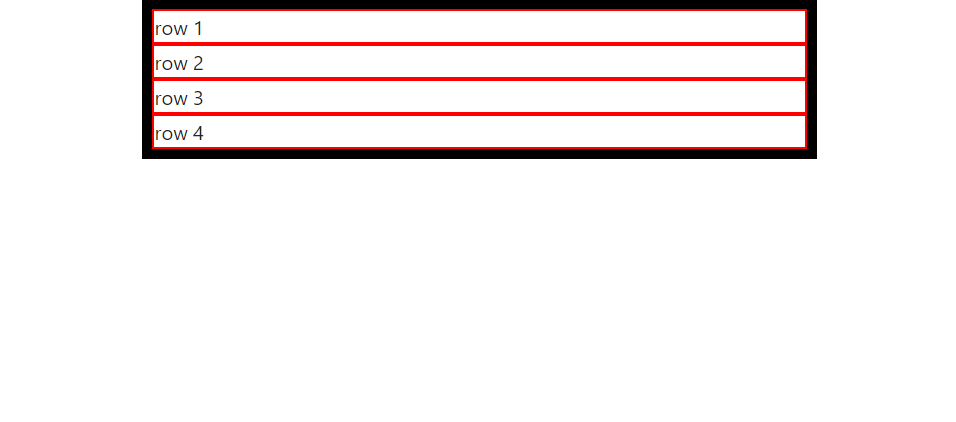

### 3. col 
.col class is used to create equal width columns inside the .row class 
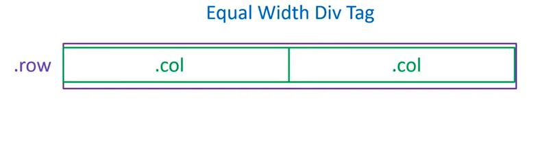

##### Layout classes sequence 
1. .container 
2. inside .container we can place .row class 
3. inside .row we can place .col class
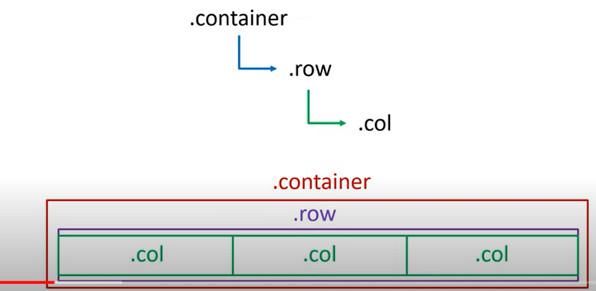

> adding .col inside .row 
```bash 
<!DOCTYPE html>
<html lang="en">
<head>
    <meta charset="UTF-8">
    <meta http-equiv="X-UA-Compatible" content="IE=edge">
    <meta name="viewport" content="width=device-width, initial-scale=1.0, shrink-to-fit=no">
    <title>Document</title>

    <!--insert the boostrap CSS link after the title -->
    <link rel="stylesheet" href="css/bootstrap.css">
    <!--addcss file below bootstrap file only -->
    <style>
        .container{
            border: 8px solid black;
        }

        .row {
            border: 2px solid red;
        }

        .col {
            border: 3px solid green;
        }
    </style>
</head>
<body>
   <div class="container">
      <div class="row">
        <div class="col">col1</div>
        <div class="col">col1</div>
        <div class="col">col1</div>
        <div class="col">col1</div>
      </div>
      <div class="row">row 2</div>
      <div class="row">row 3</div>
      <div class="row">row 4</div>
   </div>
</body>
</html>
```
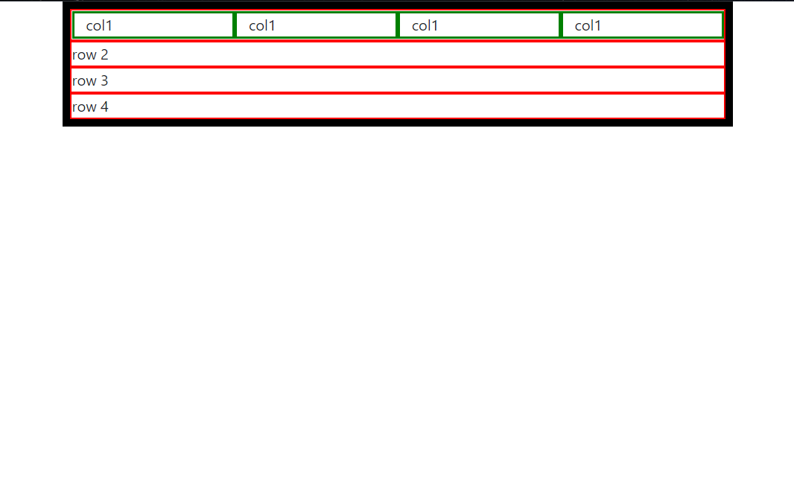

#### Adding fixed number of columns in rows 
```bash 
<!DOCTYPE html>
<html lang="en">
<head>
    <meta charset="UTF-8">
    <meta http-equiv="X-UA-Compatible" content="IE=edge">
    <meta name="viewport" content="width=device-width, initial-scale=1.0, shrink-to-fit=no">
    <title>Document</title>

    <!--insert the boostrap CSS link after the title -->
    <link rel="stylesheet" href="css/bootstrap.css">
    <!--add css file below bootstrap file only -->
    <style>
        .container{
            border: 8px solid black;
        }

        .row {
            border: 2px solid red;
        }

        .col {
            border: 3px solid green;
        }
    </style>
</head>
<body>
    <h1 style="text-align: center;">2 columns in one row using row-cols-2</h1>
   <div class="container">
      ✅<div class="row row-cols-2">
        <div class="col">col1</div>
        <div class="col">col1</div>
        <div class="col">col1</div>
        <div class="col">col1</div>
        <div class="col">col1</div>
        <div class="col">col1</div>
        <div class="col">col1</div>
        <div class="col">col1</div>
      </div>
      <div class="row">row 2</div>
      <div class="row">row 3</div>
      <div class="row">row 4</div>
   </div>
</body>
</html>
```
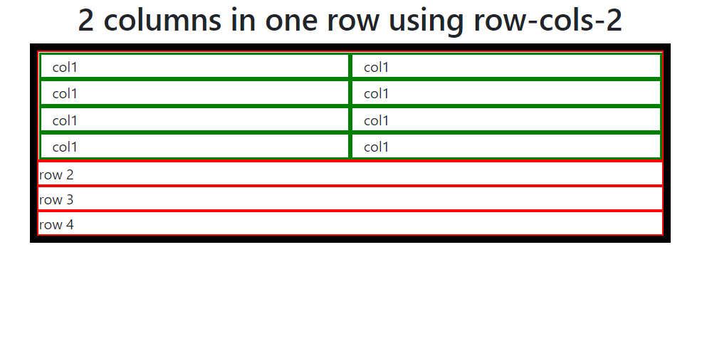

#### col class for different breakpoints 
- extra large (col-xl)
- large (col-lg)
- medium (col-md)
- small (col-sm)

```bash 
    <style>
        .container{
            border: 8px solid black;
            padding: 30px;
        }

        .row {
            border: 2px solid red;
            padding: 5px;
        }

        .col-md{
            border: 5px solid blue;
        }
        .col-lg {
            border: 3px solid green;
        }
        .col-xl{
            border: 3px solid yellow;
        }
        .col-sm{
            border: 5px solid rgb(79, 79, 79);
        }
    </style>
</head>
<body>
    <h1 style="text-align: center;">col class for different breakpoints</h1>
   <div class="container">
    <div class="row">
        <div class="col-xl">col1</div>
        <div class="col-xl">col1</div>
        <div class="col-xl">col1</div>
      </div>
      <div class="row">
        <div class="col-lg">col1</div>
        <div class="col-lg">col1</div>
        <div class="col-lg">col1</div>
      </div>
      <div class="row">
        <div class="col-md">col1</div>
        <div class="col-md">col1</div>
        <div class="col-md">col1</div>
      </div>
      <div class="row">
        <div class="col-sm">col1</div>
        <div class="col-sm">col1</div>
        <div class="col-sm">col1</div>
      </div>
      <div class="row">row 4</div>
   </div>
</body>
```
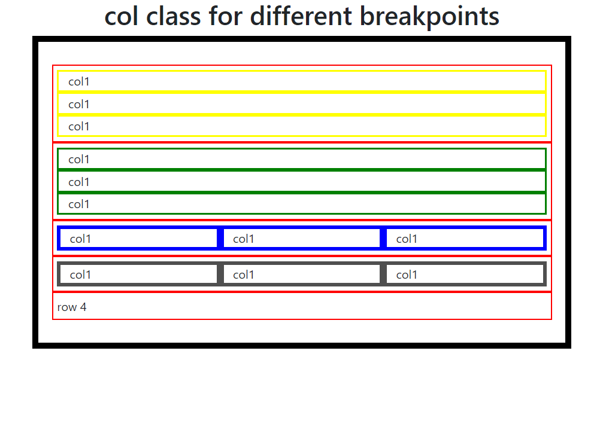

### Grid col class 
Used for creating col class of varying width

##### Bootstrap has 12 grids 
> .row in bootstrap has 12 grids
- each grid has a specific class allotted to it
- we specify the number to each col which specifies how much width that column will take 
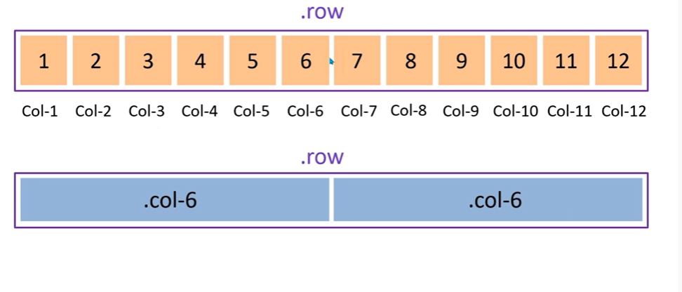

> Note: .col is same as .col-12 
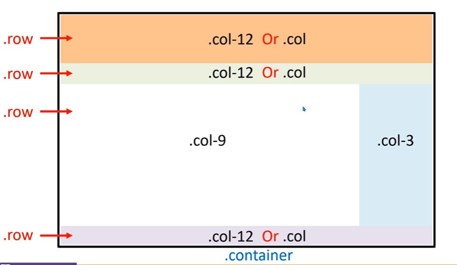

```bash 
    <style>
        .container{
            border: 8px solid black;
            padding: 30px;
        }

        .row {
            border: 2px solid red;
            padding: 5px;
        }

        .col-8 {
            border: 3px solid blue;
        }

        .col-4{
            border: 3px solid green;
        }

        .col-6{
            border: 3px solid rgb(2, 2, 2);
        }

    </style>
</head>
<body>
    <h1 style="text-align: center;">Grid col</h1>
   <div class="container">
       <div class="row">
           <div class="col-8">Lorem ipsum dolor sit amet consectetur adipisicing elit. Quisquam, aperiam?</div>
           <div class="col-4">Lorem ipsum dolor sit amet consectetur adipisicing elit. Amet, voluptatem!</div>
       </div>
       <div class="row">
        <div class="col-6">Lorem ipsum dolor sit amet consectetur adipisicing elit. Quisquam, aperiam?</div>
        <div class="col-6">Lorem ipsum dolor sit amet consectetur adipisicing elit. Amet, voluptatem!</div>
    </div>   
   </div>
</body>
```
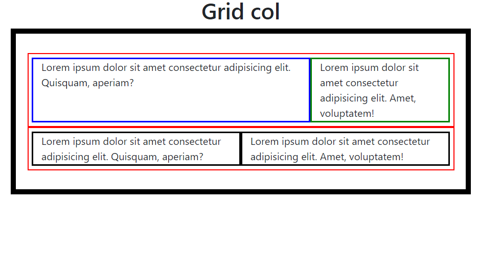

> creating website layout using grid cols
```bash 
<!DOCTYPE html>
<html lang="en">
<head>
    <meta charset="UTF-8">
    <meta http-equiv="X-UA-Compatible" content="IE=edge">
    <meta name="viewport" content="width=device-width, initial-scale=1.0, shrink-to-fit=no">
    <title>Document</title>

    <!--insert the boostrap CSS link after the title -->
    <link rel="stylesheet" href="css/bootstrap.css">
    <!--addcss file below bootstrap file only -->
    <style>
        .container{
            border: 8px solid black;
            padding: 30px;
        }

        .row {
            border: 2px solid red;
            padding: 5px;
        }

        .col-12 {
            border: 3px solid blue;
        }

        .col-4{
            border: 3px solid green;
        }

        .col-8{
            border: 3px solid rgb(2, 2, 2);
        }

    </style>
</head>
<body>
    <h1 style="text-align: center;">Grid col</h1>
   <div class="container">
       <div class="row">
           <div class="col-12">
               <h1>website name</h1>
           </div>
       </div>  
       <div class="row">
           <div class="col-12">
               <ul>
                   <li><a href="">home</a></li>
                   <li><a href="">home</a></li>
                   <li><a href="">home</a></li>
                   <li><a href="">home</a></li>
               </ul>
           </div>
       </div>
       <div class="row">
        <div class="col-8">
            <h1>sub-heading</h1>
            <p>Lorem ipsum dolor sit amet consectetur adipisicing elit. Suscipit sunt iusto dolorem non! Quaerat dolorum enim quos ipsum reprehenderit voluptates mollitia sit quibusdam, sed modi exercitationem architecto molestias deleniti repellendus voluptas quidem distinctio incidunt fuga laboriosam earum voluptate aperiam ad dolore? Non id ullam delectus laborum eveniet obcaecati similique laboriosam error numquam praesentium, asperiores doloribus tempora corrupti qui est nesciunt perferendis, temporibus optio cum? Tempore quos velit ea perferendis adipisci quisquam. Magnam cum dicta, maxime incidunt quas, fugiat molestiae saepe minus odit excepturi quidem temporibus quis, nostrum dolores. Suscipit aperiam, cupiditate atque accusamus sed cumque beatae nostrum, et repudiandae in inventore voluptatem earum molestias tempora fugit vitae! Magni esse soluta nihil aut autem officia nemo deleniti neque temporibus quia, pariatur iure expedita, fuga illo non.</p>
        </div>
        <div class="col-4">
            <h1>sub-heading</h1>
            <p>Lorem ipsum dolor sit amet consectetur adipisicing elit. Suscipit sunt iusto dolorem non! Quaerat dolorum enim quos ipsum reprehenderit voluptates mollitia sit quibusdam, sed modi exercitationem architecto molestias deleniti repellendus voluptas quidem distinctio incidunt fuga laboriosam earum voluptate aperiam ad dolore? Non id ullam delectus laborum eveniet obcaecati similique laboriosam error numquam praesentium, asperiores doloribus tempora corrupti qui est nesciunt perferendis, temporibus optio cum? Tempore quos velit ea perferendis adipisci quisquam. Magnam cum dicta, maxime incidunt quas, fugiat molestiae saepe minus odit excepturi quidem temporibus quis, nostrum dolores. Suscipit aperiam, cupiditate atque accusamus sed cumque beatae nostrum, et repudiandae in inventore voluptatem earum molestias tempora fugit vitae! Magni esse soluta nihil aut autem officia nemo deleniti neque temporibus quia, pariatur iure expedita, fuga illo non.</p>
        </div>
    </div>
    <div class="row">
        <div class="col-12">
            Lorem, ipsum dolor.
        </div>
    </div>
   </div>
</body>
</html>
```
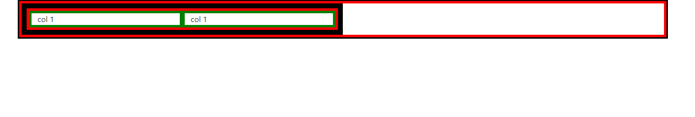

### Nesting 
> adding cols inside row (nesting columns inside the row)
```bash 
    <style>
        .container {
            border: 3px solid black;
        }
        .row{
            border: 5px solid red;
        }

        .col-md-6{
            border: 5px solid green;
        }

    </style>
</head>
<body>
    <div class="container">
    ✅adding row inside container 
        <div class="row">
            ✅adding col inside row 
            <div class="col-md-6" style="border:  10px solid black;">
                ✅adding nested row inside col
                <div class="row">
                    ✅adding nested col inside nested row 
                    <div class="col-md-6">col 1</div>
                    <div class="col-md-6">col 1</div>
                </div>
            </div>
        </div>
    </div>
</body>
```


#### Bootstrap inbiult utility class
### 1. Margin Classes 
- to align column to the center we use m-auto 
- margin-left, we used to use ml-auto, now we use ms-auto 
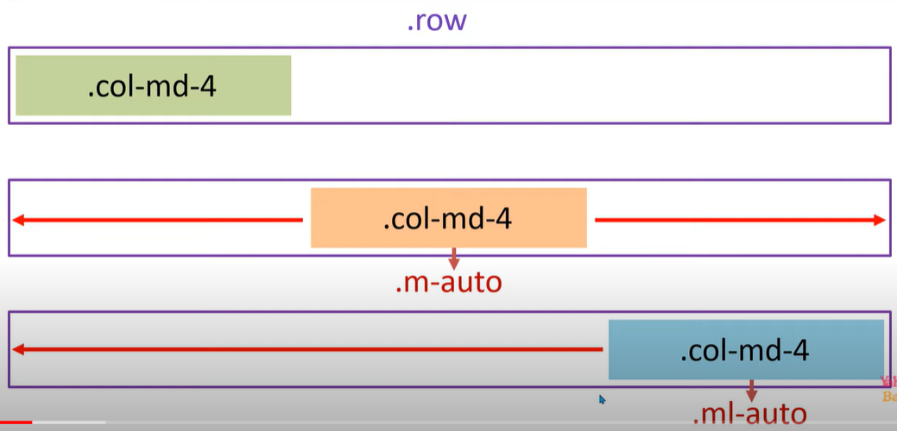

- margin-right, we used to use mr-auto, now we use me-auto 
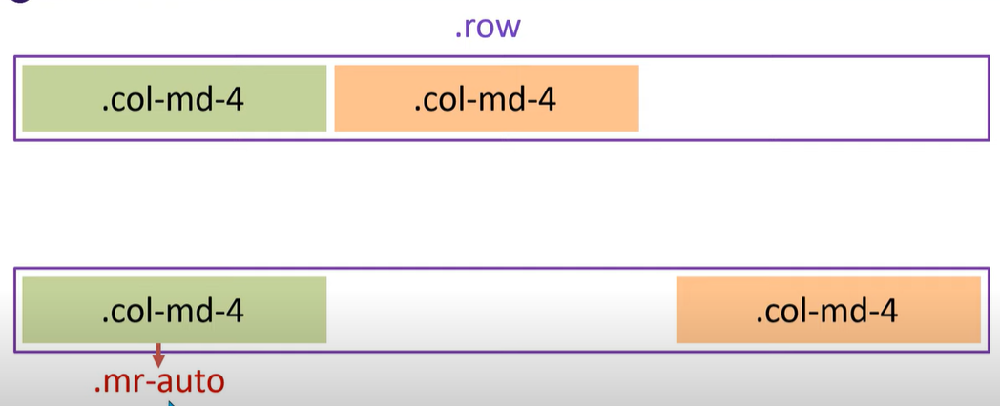

#### m-auto 
```bash 
    <style>
        .container {
            border: 3px solid black;
        }
        .row{
            border: 5px solid red;
        }

        .col-md-3{
            background-color: pink;
        }

    </style>
</head>
<body>
    <div class="container">
        <div class="row">
            <div class="col-md-3 m-auto">col1 Lorem ipsum dolor sit amet consectetur, adipisicing elit. Veniam facilis nemo maiores. Autem, quo. Eligendi, doloremque quibusdam. Quo, iure doloribus.</div>
        </div>
    </div>
</body>
```
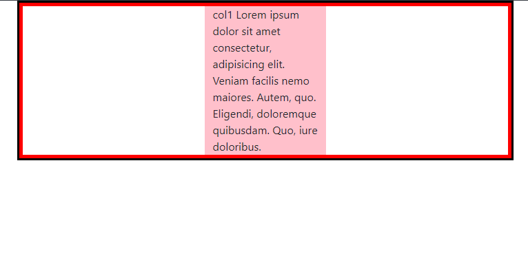

#### ms-auto 
```bash    
    <!--insert the boostrap CSS link after the title -->
    <link rel="stylesheet" href="css/bootstrap.css">
    <!--add css file below bootstrap file only -->
    <style>
        .container {
            border: 3px solid black;
        }
        .row{
            border: 5px solid red;
        }

        .col-md-3{
            background-color: pink;
        }

        .col-md-8{
            background-color: blue;
        }

    </style>
</head>
<body>
    <div class="container">
        <div class="row">
            <div class="col-md-3 ms-auto">col1 Lorem ipsum dolor sit amet consectetur, adipisicing elit. Veniam facilis nemo maiores. Autem, quo. Eligendi, doloremque quibusdam. Quo, iure doloribus.</div>
           <div class="col-md-8">Lorem ipsum dolor sit amet consectetur adipisicing elit. Odit non obcaecati suscipit ut tempora eius amet nihil sequi expedita est natus sapiente ipsa debitis ducimus nisi doloremque quas nesciunt a voluptatibus, aperiam nulla iste aliquam at deserunt? Ipsam, explicabo eaque.</div> 
        </div>
    </div>
</body>
```
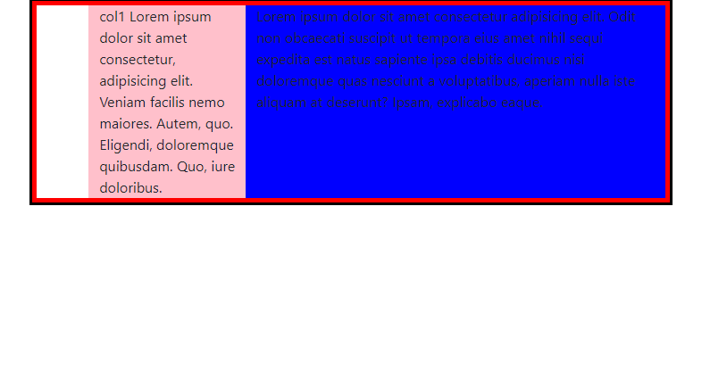

#### me-auto 
```bash 
    <style>
        .container {
            border: 3px solid black;
        }
        .row{
            border: 5px solid red;
        }

        .col-md-3{
            background-color: pink;
        }

        .col-md-8{
            background-color: blue;
        }

    </style>
</head>
<body>
    <div class="container">
        <div class="row">
            <div class="col-md-3 me-auto">col1 Lorem ipsum dolor sit amet consectetur, adipisicing elit. Veniam facilis nemo maiores. Autem, quo. Eligendi, doloremque quibusdam. Quo, iure doloribus.</div>
           <div class="col-md-8">Lorem ipsum dolor sit amet consectetur adipisicing elit. Odit non obcaecati suscipit ut tempora eius amet nihil sequi expedita est natus sapiente ipsa debitis ducimus nisi doloremque quas nesciunt a voluptatibus, aperiam nulla iste aliquam at deserunt? Ipsam, explicabo eaque.</div> 
        </div>
    </div>
</body>
```
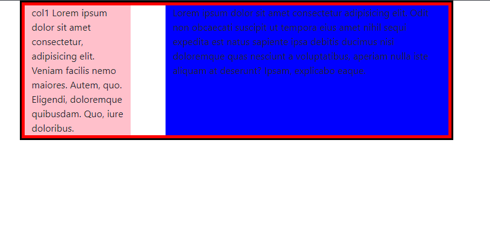

##### margin auto classes for different break points 
These are margin classes for responsiveness, they give auto margin from all the sides 
1. extra large [.m-xl-auto] 
- it will remain auto as long as the viewport is extra large screensize
2. large       [.m-lg-auto]
3. medium      [.m-md-auto]
4. small       [.m-sm-auto]

```bash 
    <style>
        .container {
            border: 3px solid black;
        }
        .row{
            border: 5px solid red;
        }

        .col-md-3{
            background-color: pink;
        }

        .col-md-8{
            background-color: blue;
        }

    </style>
</head>
<body>
    <div class="container">
        <!--it will have auto margins as long as screensize is xl-->
        <h1>m-xl-auto</h1>
        <div class="row">
            <div class="col-md-3 m-xl-auto">col1 Lorem ipsum dolor sit amet consectetur, adipisicing elit. Veniam facilis nemo maiores. Autem, quo. Eligendi, doloremque quibusdam. Quo, iure doloribus.</div>
           <div class="col-md-8">Lorem ipsum dolor sit amet consectetur adipisicing elit. Odit non obcaecati suscipit ut tempora eius amet nihil sequi expedita est natus sapiente ipsa debitis ducimus nisi doloremque quas nesciunt a voluptatibus, aperiam nulla iste aliquam at deserunt? Ipsam, explicabo eaque.</div> 
        </div> 
        <h1>m-lg-auto</h1>
        <div class="row">
            <!--it will have auto margins from xl to lg-->
            <div class="col-md-3 m-lg-auto">col1 Lorem ipsum dolor sit amet consectetur, adipisicing elit. Veniam facilis nemo maiores. Autem, quo. Eligendi, doloremque quibusdam. Quo, iure doloribus.</div>
           <div class="col-md-8">Lorem ipsum dolor sit amet consectetur adipisicing elit. Odit non obcaecati suscipit ut tempora eius amet nihil sequi expedita est natus sapiente ipsa debitis ducimus nisi doloremque quas nesciunt a voluptatibus, aperiam nulla iste aliquam at deserunt? Ipsam, explicabo eaque.</div> 
        </div>
        <h1>m-md-auto</h1>
        <div class="row">
            <!--it will have auto margins from xl to  md-->
            <div class="col-md-3 m-md-auto">col1 Lorem ipsum dolor sit amet consectetur, adipisicing elit. Veniam facilis nemo maiores. Autem, quo. Eligendi, doloremque quibusdam. Quo, iure doloribus.</div>
           <div class="col-md-8">Lorem ipsum dolor sit amet consectetur adipisicing elit. Odit non obcaecati suscipit ut tempora eius amet nihil sequi expedita est natus sapiente ipsa debitis ducimus nisi doloremque quas nesciunt a voluptatibus, aperiam nulla iste aliquam at deserunt? Ipsam, explicabo eaque.</div> 
        </div>
        <h1>m-sm-auto</h1>
        <div class="row">
            <!--it will have auto margins from xl to  sm-->
            <div class="col-md-3 m-sm-auto">col1 Lorem ipsum dolor sit amet consectetur, adipisicing elit. Veniam facilis nemo maiores. Autem, quo. Eligendi, doloremque quibusdam. Quo, iure doloribus.</div>
           <div class="col-md-8">Lorem ipsum dolor sit amet consectetur adipisicing elit. Odit non obcaecati suscipit ut tempora eius amet nihil sequi expedita est natus sapiente ipsa debitis ducimus nisi doloremque quas nesciunt a voluptatibus, aperiam nulla iste aliquam at deserunt? Ipsam, explicabo eaque.</div> 
        </div>
    </div>
</body>
```
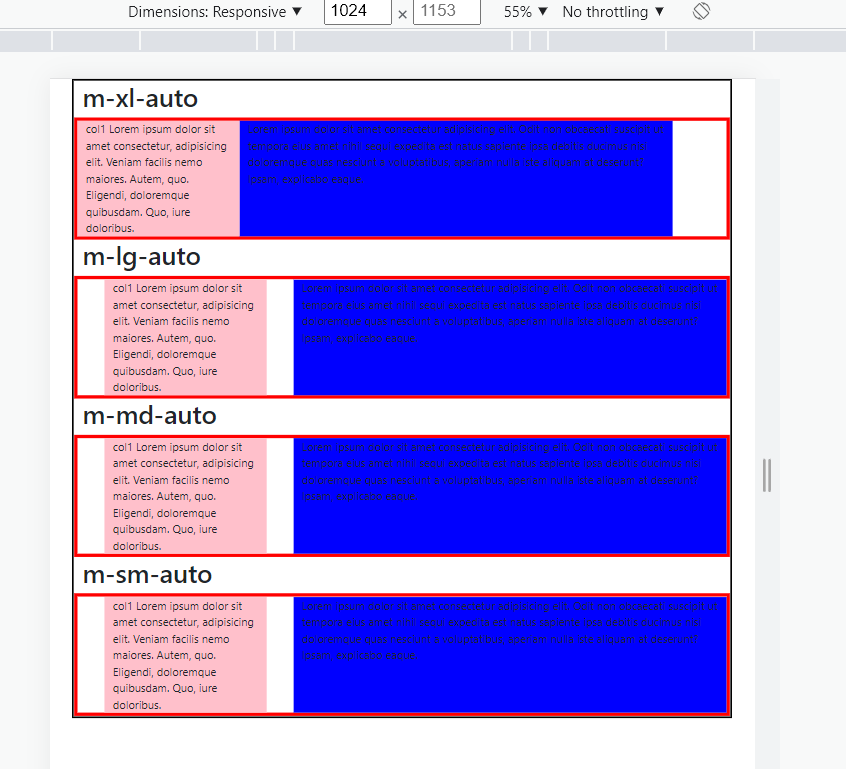

#### Margin classes for different sides  
1. margin        [.m-*]
2. margin-right  [.mr-*]
3. margin-left   [.ml-*]
4. margin-top    [.mt-*]
5. margin-bottom [.mb-*]

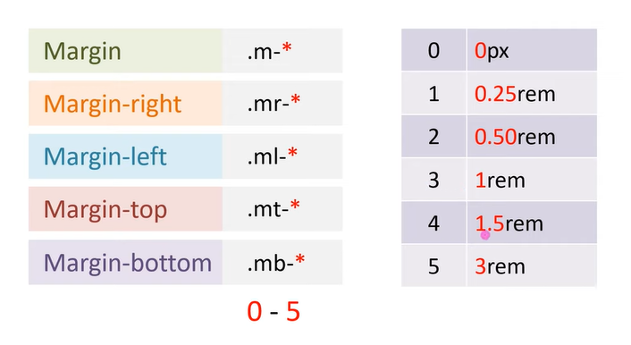


