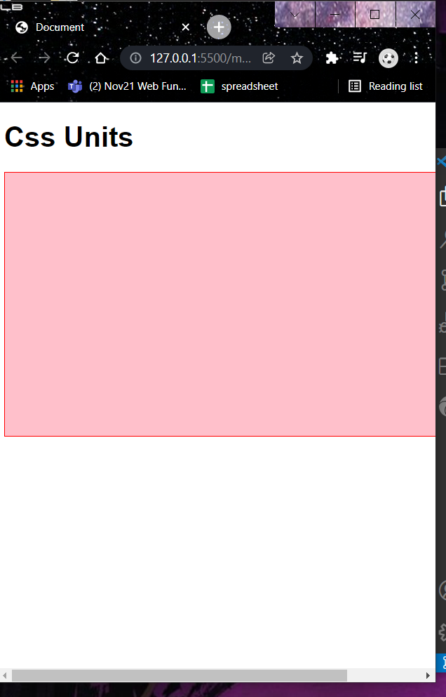
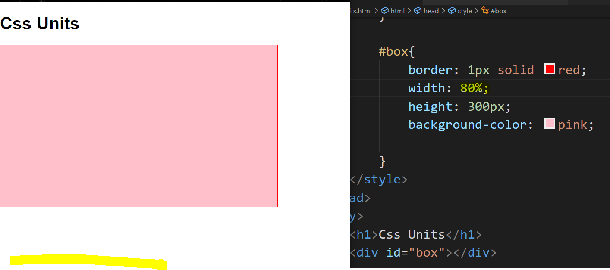
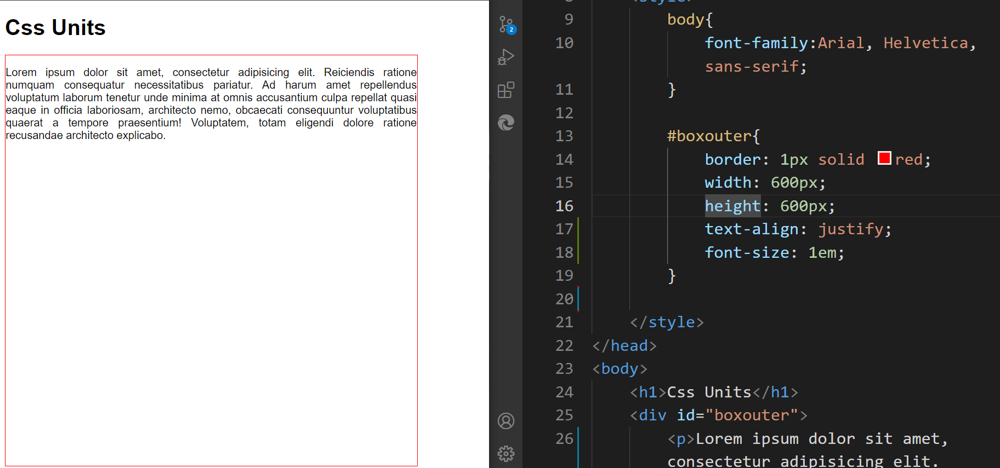
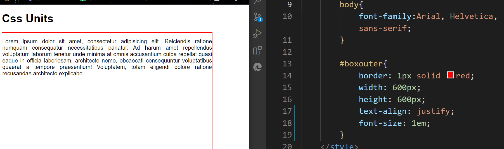

### Html/ Css revision
2. project: simple admission form 
   - Required field 
   - placeholder 
   - different types of input: name, email, phone number 
   - pattern for phone number 
   - select box 
   - radio/ checkbox 
   
   2.1 Validation using HTML properties 

## Interview Questions:
1. Why do we write css links on top?
we want to optimise page and make it look good thats why css link is in top 
and script link is at the bottom

2. What does name property do?
            1. helps identify data for reference
            2. used to refer data for the 
            backend 
            3. used to group multiple inputs together for radio/ checkbox 

3. placeholder
its like a hint forthe user to understand what input we want them to enter 

4. self closing 
A self closing tag is a type of tag in HTML that need not to be closed by a closing tag,
which means there is no saperate closing tag f

5. select is a nested tag and option is its list
we can group options together in optgroup

6. sans serif vs sans
default font-family: 
serif: used in print media, has sharp edges, stroke endings are identifiers for serid
serif 
sans-serif: its much more softer 

```bash
<!DOCTYPE html>
<html lang="en">
  <head>
    <meta charset="UTF-8" />
    <meta http-equiv="X-UA-Compatible" content="IE=edge" />
    <meta name="viewport" content="width=device-width, initial-scale=1.0" />
    
    <link rel="preconnect" href="https://fonts.googleapis.com" />
    <link rel="preconnect" href="https://fonts.gstatic.com" crossorigin />
    <link href="https://fonts.googleapis.com/css2?family=Meow+Script&family=Noticia+Text:ital@0;1&display=swap"
      rel="stylesheet"
      crossorigin="anonymous" />
      
    <title>Document</title>
    <style>
      body {
        background-color: rgb(230, 230, 230);
      }

      .container {
        background-color: rgb(252, 241, 243);
        padding: 5px;
        border-radius: 5px;
      }
      input,
      select,
      textarea {
        display: block;
        /* brings the new field on a new line  */

        margin: 4px;
      }
      /* four values:
            top right bottom left 
               
            three values 
               top horizontal bottom 

            two values 
               top bottom 
               left right

            one value 
            for all four values 

            auto- for center allign
            */

      .inline {
        display: inline;
      }

      h2 {
        font-family: "Meow Script", cursive;
      }

      h4 {
        margin: 0.8em;
      }
    </style>
  </head>
  <body>
    <div>
      <h2>Admission Form</h2>
      <!--
        first name 
        last name 
        mail id 
        contact number 
        gender 
        dob 
        adress
        degree
        college name 
        year of graduation 
        file upload link 
    -->
      <form autocomplete="on" class="container">
        <h4>Personal Info</h4>
        <input
          type="text"
          name="first name"
          class="inline"
          placeholder="first name"
        />

        <input
          type="text"
          name="last name"
          placeholder="last name"
          class="inline"
        />
        <br />
        <input type="email" name="mail" placeholder="last name" />

        <input
          type="tel"
          name="phone"
          placeholder="phone number"
          class="inline"
          pattern="[0-9/{4}-[0-9]{3}-[0-9]{3}"
          required
        />

        <select name="gender" class="inline">
          <!--selected- when website is loaded its selected 
        
        disabled- you cannot select a disabled -->

          <optgroup label="one">
            <option selected disabled>male</option>
            <option>female</option>
          </optgroup>

          <option>male</option>
          <option>female</option>
          <option>male</option>
          <option>female</option>
        </select>

        <input type="date" name="dob" placeholder="date" max="2021-01-01" />

        <textarea type="adress" name="address" placeholder="Address">
        </textarea>

        <h4>Education Info</h4>

        <select>
          <optgroup label="bachelors">
            <option>btech</option>
            <option>be</option>
            <option>bsc</option>
          </optgroup>
          <optgroup label="masters">
            <option>mtech</option>
            <option>me</option>
            <option>msc</option>
          </optgroup>
        </select>

        <input
          type="number"
          name="grad"
          class="inline"
          placeholder="year of grad"
          min="2019"
          max="2021"
        />

        <input
          type="number"
          name="percentage"
          class="inline"
          placeholder="percentage"
          min="0"
          max="100"
          step="10"
        />
        <h4>Checkbox</h4>
        <input type="checkbox" class="inline" name="check" />
        Advanced
        <input type="checkbox" class="inline" name="check" />Advanced
        <br />

        <h4>Radiobutton</h4>
        <input type="radio" class="inline" name="Radio1" />
        Advanced
        <input type="radio" class="inline" name="Radio1" />
        Advanced

        <br />

        <input type="file" />

        <hr />
        <input type="submit" value="apply for admission" class="inline" />

        <input type="reset" class="inline" />
      </form>
    </div>
  </body>
</html>

```

- Assignment 
hover on button color
year of grad remove the side thingies 
add css to the form 

### Css Measurement Units 
#### Css Absolute Units
fixed 

1. cm 
2. mm 
3. in 
4. px 
5. pt (points)
6. pc (picas)

#### Css Relative Units 
relative: depends on the parent width or window
width

1. em 
2. rem 
3. ch 
4. ex 
5. vw 
6. vh 
7. vmax
8. vmin 
9. %

## Difference between fixed and relative.
### Css Absolute units 
#### 1. px
```bash
    <style>
        body{
            font-family:Arial, Helvetica, sans-serif;
        }

        #box{
            border: 1px solid red; 
            width: 600px;
            height: 300px;
            background-color: pink;
        }
    </style>
</head>
<body>
    <h1>Css Units</h1>
    <div id="box"></div>
    
</body>
```
### Fixed: Absolute Units
Div width is fixed, that's why we have scrollbar when the viewport width is decreased 


### Css Relative Units 
#### 1. %

### Relative: the image adjusts with the viewport
when viewport size increases, div increases.
when viewport size decreases, div decreases.

```bash
    <style>
        body{
            font-family:Arial, Helvetica, sans-serif;
        }

        #box{
            border: 1px solid red; 
            width: 80%;
            height: 300px;
            background-color: pink;
          
        }
    </style>
</head>
<body>
    <h1>Css Units</h1>
    <div id="box"></div>    
</body>
```
-----

> if the container has a parent, the conatiner with the Relative unit adjusts itself with respect to its parent element 


> manipulate the %, and notice that, 100% of the box width, is max width of the parent container and not of the window container.

```bash
<style>
        body{
            font-family:Arial, Helvetica, sans-serif;
        }

        #boxouter{
            border: 1px solid red; 
            width: 600px;
            height: 600px;   
        }
        /* the parent of box is boxouter */

        #box{
            border: 6px solid green;
            background-color: red;
            height: 300px;
            width: 50%;
        }
</style>
</head>

<body>
    <h1>Css Units</h1>
<div id="boxouter">
    <div id="box"></div>
</div>
```
-----
### Relative Units 
1. em 
> If there is no font-size mention in the parent div, then the value of font-size in the child div styling will be taken 


> If there is a font-size mention in the parent div, and if the font-size if also mentioned in the child div, then the font-size of the parent will be taken


Note that: 1em is equavalent to 28px mentioned in the parent (body)
-----

Note that: 2em is equavalent to (28px x2)mentioned in the parent (body)

-----

> setting 0.5em is going to mean half of the font-size we set in the parent.

#### When is 1em = 16px?
if its parent container is body, then 1em is approximately equavalent to the default font-size of body, and browser's default font-size is 16px. 
