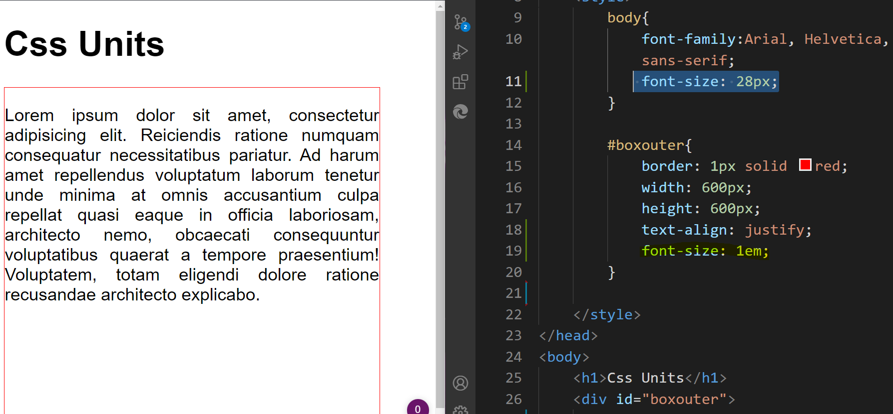
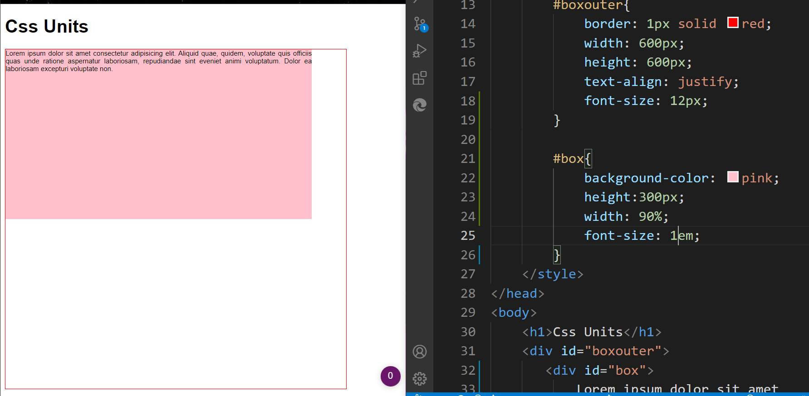
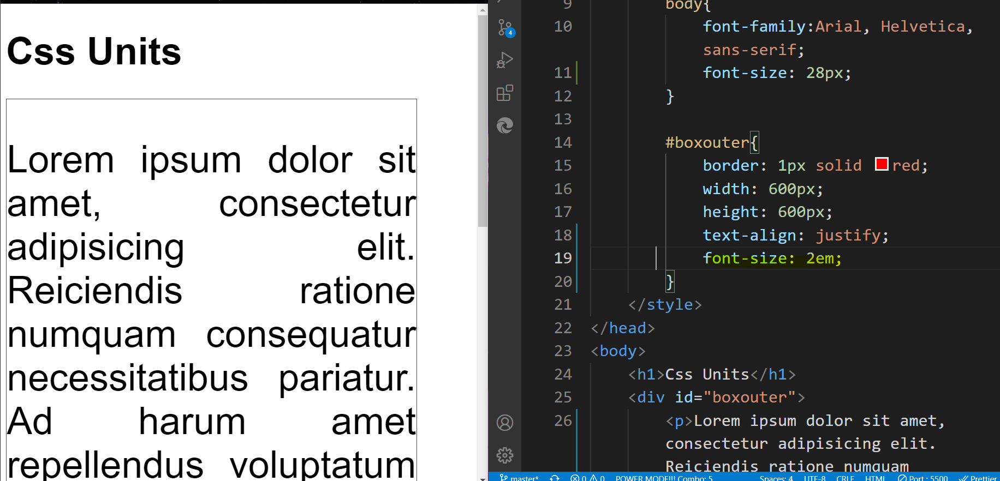

### Html/ Css revision
2. project: simple admission form 
   - Required field 
   - placeholder 
   - different types of input: name, email, phone number 
   - pattern for phone number 
   - select box 
   - radio/ checkbox 
   
   2.1 Validation using HTML properties 

## Interview Questions:
1. Why do we write css links on top?
we want to optimise page and make it look good thats why css link is in top 
and script link is at the bottom
> Improvement in UI, the style is already available when HTML is loaded 

> Trade off performance, we are not loading unnecessary functionality before.

2. What does name property do?
            1. helps identify data for reference
            2. used to refer data for the 
            backend 
            3. used to group multiple inputs together for radio/ checkbox 

3. placeholder
its like a hint forthe user to understand what input we want them to enter 

4. self closing 
A self closing tag is a type of tag in HTML that need not to be closed by a closing tag,
which means there is no saperate closing tag f

5. select is a nested tag and option is its list
we can group options together in optgroup

6. sans serif vs sans
default font-family: 
serif: used in print media, has sharp edges, stroke endings are identifiers for serid
serif 
sans-serif: its much more softer 

7. margin 
7.1 four values:
  top right bottom left 
               
7.2 three values 
  top horizontal bottom 

7.3 two values 
  top bottom 
  left right

7.4 one value 
  for all four values 

7.5 auto- for center allign
  

### Css Measurement Units 
#### Css Absolute Units
fixed 

1. cm 
2. mm 
3. in 
4. px 
5. pt (points)
6. pc (picas)

#### Css Relative Units 
relative: depends on the parent width or window
width

1. em 
2. rem 
3. ch 
4. ex 
5. vw 
6. vh 
7. vmax
8. vmin 
9. %

## Difference between fixed and relative.
### Css Absolute units 
#### 1. px
```bash
    <style>
        body{
            font-family:Arial, Helvetica, sans-serif;
        }

        #box{
            border: 1px solid red; 
            width: 600px;
            height: 300px;
            background-color: pink;
        }
    </style>
</head>
<body>
    <h1>Css Units</h1>
    <div id="box"></div>
    
</body>
```
### Fixed: Absolute Units
Div width is fixed, that's why we have scrollbar when the viewport width is decreased 


### Css Relative Units 
#### 1. %

### Relative: the image adjusts with the viewport
when viewport size increases, div increases.
when viewport size decreases, div decreases.

```bash
    <style>
        body{
            font-family:Arial, Helvetica, sans-serif;
        }

        #box{
            border: 1px solid red; 
            width: 80%;
            height: 300px;
            background-color: pink;
          
        }
    </style>
</head>
<body>
    <h1>Css Units</h1>
    <div id="box"></div>    
</body>
```
-----

> if the container has a parent, the conatiner with the Relative unit adjusts itself with respect to its parent element 


> manipulate the %, and notice that, 100% of the box width, is max width of the parent container and not of the window container.

```bash
<style>
        body{
            font-family:Arial, Helvetica, sans-serif;
        }

        #boxouter{
            border: 1px solid red; 
            width: 600px;
            height: 600px;   
        }
        /* the parent of box is boxouter */

        #box{
            border: 6px solid green;
            background-color: red;
            height: 300px;
            width: 50%;
        }
</style>
</head>

<body>
    <h1>Css Units</h1>
<div id="boxouter">
    <div id="box"></div>
</div>
```
-----
### Relative Units 
# 1. em 
> If there is no font-size mention in the parent div, then the value of font-size in the child div styling will be taken 


> If there is a font-size mention in the parent div, and if the font-size if also mentioned in the child div, then the font-size of the parent will be taken

##### Note that: 1em is equavalent to 28px mentioned in the parent (body)


> another example:
##### In this case, were using the styling parent container of div #box 

> 1em = 12px (in this context)

##### When we change the em value of div #box 

> 2em = 24px (since 1em = 12px)
-----

##### Note that: 2em is equavalent to (28px x2)mentioned in the parent (body)

-----

> setting 0.5em is going to mean half of the font-size we set in the parent.

#### When is 1em = 16px?
if its parent container is body, then 1em is approximately equavalent to the default font-size of body, and browser's default font-size is 16px. 

-----

#### Applying em on width as well 

-----

# 2. rem (Relative em)
Same as em, except, it doesn't take the value of the parent, it takes the value of the root tag (<html>)
it will treat 
> 1rem = 16px
irrespective of what the parent's font-size is, because 16px is default font-size value of the browser 

### rem works according to the root 
root (html)


### we can add values to the root tag(html)
> #box takes the font-size of the root tag 

------

## 3. vw & vh (viewport width, viewport height)
Relative to the (browser width/height (viewport))
> vw- total width of the browser 
> vh- total height of the browser 

#### As we resize the browser/ viewport, the vh and vw changes
It doesn't change wrt to the parent container, it only changes wrt the viewport 


