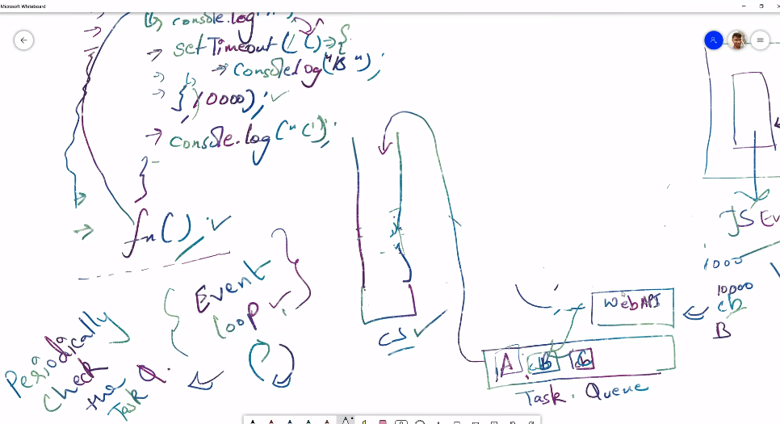

### Spread operator 
if you have an object or an array (called iterable) then you can spread it. 

- you can iterate on it and have each element seperately 
```bash
        append: (push) adds at the last 
        const arr = [1,2,3,4]
        const arr2 = [5,6,7,8]
        arr.push(5)
        console.log(arr)

console:
(5) [1, 2, 3, 4, 5]
```
- adding an element before an array, that doesnt use SPREAD operator 
```bash 
        const arr3 = [1,2,3,4]
        const arr4 = [5,6,7,8]

        const pre_arr = [5, arr3]
        console.log(pre_arr)

console:
(2) [5, Array(5)]
0: 5
1: (5) [1, 2, 3, 4, 5]
length: 2
[[Prototype]]: Array(0)
```
- adding an element before an array that uses SPREAD operator 
```bash 
        const arr3 = [1,2,3,4]
        const arr4 = [5,6,7,8]

        const pre_arr = [5, ...arr]
        console.log(pre_arr)


console:
Array(6)
0: 5 
1: 1 
2: 2
3: 3
4: 4
5: 5
length: 6[[Prototype]]: Array(0)
```
> example, without using SPREAD operator 
```bash 
        const arr = [1,2,3,4]
        const fn = (a,b,c) => {
            console.log(a)  //arr gets mapped to a 
            console.log(b)  //undefined
            console.log(c)  //undefined
        }

        fn(arr)

console:
(4) [1, 2, 3, 4]
undefined   ✅its undefined because were not defining any value 
undefined
```
#### however, using SPREAD operator, JS will treat it as a spreaded array 
it takes an array/ iterable object and returns seperate memory locations (called destructuring)
***SPREAD doesnt return an array, it returns different smaller memory locations, instead***
```bash 
    <script>
        const arr = [1,2,3,4]
        const fn = (a,b,c) => {
            console.log(a)
            console.log(b) 
            console.log(c)
        }

        fn(...arr)
    </script>

console:
1
2
3
```
### SPREAD Vs REST 
> spread array into smaller seperate memory components.
(both SPREAD & REST have the same syntax, used in different context)

- If were using ... in a function parameter, it is called rest operator 
- if we use in an iterable/ function argumnent, then we call it as spread operator

```bash 
    <script>
        const arr = [1,2,3,4]
        const fn = (a,b,c, ...d)   ✅this is REST operator 
                                   ✅only written in parameter 
        => {
            console.log(a)
            console.log(b) 
            console.log(c)
        }

        fn(...arr)                ✅SPREAD operator 
                                  ✅only written in arguments 
    </script>

```
> Eg. of REST and SPREAD
```bash 
    <script>
      const arr = [1, 2, 3, 4]
      const fn = (a, ...b) => {
          console.log(a) //1
          console.log(b) //[2,3,4]
        } 

    fn(...arr)

    </script>

console:
1
8-01.html:18 (3) [2, 3, 4]
```
> SPREAD operator used for deep copy
### DEEP COPY VS SHALLOW COPY 
```bash 
    <script>
        const obj = {
            'key1': 'value',
            'key2': 'value2',
        }
        
        //copying obj to obj2 
        ✅shallow copy - copies memory location 

        const obj2 = obj           //obj2 copy memory location of obj  
        console.log("obj", obj)    //both objects are pointing to same location
        console.log("obj2", obj2)

        //both objects will get the same value
        //non primitive datatypes (arrays/ objects) are refered by memory location 
        //stored by reference
        
        ✔ Call by reference - send reference of the object 
        ✅non primitive datatypes- array, object
        Non-primitive data types is the object. The JavaScript arrays and functions are also objects. 
        
        They cannot store the value of a variable directly in memory. They store a memory address/ reference of the variable which keeps updating.

        //array/ object is sent as a reference/ pointer to the (memory location)


        ✅primitive datatypes- data that is not an object and has no methods.
        There are 7 primitive data types: string, number, bigint, boolean, undefined, symbol, and null. 

        All primitive datatypes are immutable, i.e., they cannot be altered

        They store the value of a variable directly in memory.

        ✔ Call by Value - send value, instead of pointer 

        //primitive datatypes are refered by value 
        //Note that: this example is just to show how primitive datatypes are
        //stored by value 

        const a = 10
        let b = a 
        b = b + 10
        console.log("a", a)
        console.log("b", b)
        
        ✅to prevent both objects from getting same value, we have deep value 
        //both objects (obj3 and obj) will have a seperate copy of the data 

        const obj3 = JSON.parse(JSON.stringify(obj))   
        //json.stringify- converting obj to json string
        /json.parse- json string to js object conversion

        ✅Deep copy creates another copy of obj in a seperate memory location 
        ✅shallow copy create a reference pointer of a memory which points to the same memory location

        console.log("obj", obj)
        console.log("obj3", obj3)
    </script>
console:
obj {key1: 'value', key2: 'value2'}
8-01.html:24 obj2 {key1: 'value', key2: 'value2'}

8-01.html:27 obj {key1: 'valuenew', key2: 'value2'}
8-01.html:28 obj2 {key1: 'valuenew', key2: 'value2'}

8-01.html:38 a 10
8-01.html:39 b 20

8-01.html:47 obj {key1: 'value', key2: 'value2'}
8-01.html:48 obj3 {key1: 'valuenew', key2: 'value2'}
```
### Operators 
Based on number of operand's it takes, its divided into 
```bash 
operand operator operand 
```
1. unary operator - takes one operand 
> Eg: NOT operator, pre/post increement, pre/post deecrement
```bash
    <script>
      let something = true
      something = !something
      console.log(something)
    </script>
```
2. binary operator - takes two operands
3. ternary operator - takes three operands

### Ternary operator 
Ternary is an alternate to if-else condition.
- It can be used, but shouldn't be used 

> syntax:
```bash 
<condition> ? <true> : <false>
```
> example
```bash 
    <script>
      let a = 15;
      (a >= 10) ? console.log('a greater') : console.log('a not greater')
    </script>

console:
a greater 
```
> If we have a condition and were saving something to a variable, then we should be using ternary operator, that is the ideal use case 
```bash 
    <script>
      let age = 17
      let isAdult = (age>=18) ? true : false;
      console.log(isAdult)
    </script>

console:
false 
```
> nesting 
we can do nesting of ternary operator
```bash 
    <script>
      let a=10
      let b=20
      let c=30 

      const max = (a>b) ? ((a>c) ? a  : c) : ((b>c) ? b:c)
                  (10>20) ? 10>30 : (20>30)
                   nope   ? c     :  c
                                  ✅false

      console.log(max)
    </script>

console:
30
```
### Hoisting 
Hoisting is moving declaration at top of execution scope.
Hoisting is part of a JS engine, it happens in all datatypes

```bash 
    console.log(a) //undefined
    var a = 10 
    console.log(a) //10
```
- TDZ (temporal dead zone)
let & const variables cannot be editted until and unless they have been completely intialized 

- TDZ feature introduced in ES6 
- Hoisting works on let, const and var 
- let & const have an additional security, which doesnt allow access of variable until the TDZ zone 
- the idea of having this, is to slowly get rid of hoisting 
- if they tried to delete hoisting, then it will cause a problem called ***breaking changes*** 

### TDZ is implemented for more security 
to prevent accesing variables, before declaring it 

```bash 
<!DOCTYPE html>
<html lang="en">
<head>
    <meta charset="UTF-8">
    <meta http-equiv="X-UA-Compatible" content="IE=edge">
    <meta name="viewport" content="width=device-width, initial-scale=1.0">
    <title>Document</title>
    <style>

    </style>
</head>
<body>
   
<script>
    console.log(a)
    ✅its called temporal because it cannot be accesed in the first line of code 
    ✅its called dead because in this part, variable is dead, it cannot be read/ write/ accesed
    ✅TDZ of line 296 is from 282 - 296 (this entire enippet of code is blocked, but under the hood hosting is happening)

    let a = 10 
    console.log(a) 
</script>
</body>
</html>

console:
8-01.html:15 Uncaught ReferenceError: Cannot access 'a' before initialization at 8-01.html:15
```
> security pov example 
```bash 
<script>
    a = 20 
    console.log(a)
    let a = 10     ✅everything before 315line is the TDZ zone 

    console.log(a) ❌this line doesnt execute 
</script>

console:
8-01.html:15 Uncaught ReferenceError: Cannot access 'a' before initialization at 8-01.html:15
```
#### Advantage of hoisting:
- it allows us to call functions before they are declared in the code 

## Web API 
it works as an interface which allows communication between two peices of software 
API acts as an interface between two programs (thing for computers to talking each other)

### Client side Javascript- has many API's that are biuld on top of the core JS language 
they are not part of the JS language (JS Native) itself, 

1. Browser API: these are biult into the web browser 
When writing code for the Web, there are a large number of Web APIs available. Below is a list of all the APIs and interfaces (object types) that you may be able to use while developing your Web app or site.
https://developer.mozilla.org/en-US/docs/Web/API

2. third-party API: these are used to retreive information from a third party and implement into your page 

> note: chrome, edge, brave, chromium all use the JS v8 engine (written by google).

### JS Engine communicates with browser through WEB API 
were accessing features of browser using web API

Web API allows communication between JS engine and the browser 
```bash 
       BROWSER         Browser API        JS ENGINE 
                                          executes JS code/logic here

Browser API is a web API biult inside the web browser 

✅JS is a single-threaded programming language 
JS engine doesnt have 
document object 
browser object 
window object 

to access these, we have web API 
were accessing features of browser using web api 

✅Possible due to web API 
1. for setinterval, timer is provided by web api 
2. fetch request 
3. DOM manipulation 
4. console.log 
```
### Web workers 
JS is a single threaded (only one script can be run at one time)

> Introduction to multi threading in JS 
web worker provides a mechanism to spawn/run a seperate script in the baground where 
you can do any sort of calculations in the background without disturbing the UI

### Callback Function
Functions that are passed as an argument in another function - callback function 
```bash
    <script>
        //Callback function, gives us access to the whole asynchronous world, even though JS is a synchronous and single-threaded language 

        setTimeout(() => {
            console.log('timer')    
        }, 5000);

        ✅function y() is passed as an argument in another function
        function x(y){       
            console.log('x')
            y()
        }

        ✅function y is the callback function 
        x(function y(){
            console.log('y')
        });
    </script>

console:
x
y
timer
```

###  Lets first discuss about call stack & task queue
## 1. call stack
whenever we execute a function, its pushed in callstack, when execution is over it popped from callstack

Call stack  is a mechanism which will keep track of the function call. which function is being executed, which is the caller function and who this function will call.

> LIFO (whichever function added last, will be out first)
```bash 
<script>
    const fn = () => {
        console.log("hey geeks")
    }

    fn()
</script>

console:
hey geeks
```


## 2. Task queue 
- Task queue (FIFO) which contains the callback which has to be executed 
- JS engine contains event loop (periodically check the task queue)

This is the loop which will run infinitely which will check the callstack and if that is empty then pick the task from task queue and push it in callstack 

- task queue only holds only asynchronous callback (i.e timeout and setintervals)
- task queue can also be reffered as callback queue/ macrotask queue

> this is an example with asynchronous function 
```bash 
    <script>
    ✅code cannot be executed without the global execution context 
    ✅the first thing inside the callstack is the GEC 

    ✔ logic is executed in the JS Engine
    ✅a is pushed into the call stack, executed and popped after execution
    ✅c is pushed into the call stack, executed and popped after execution 

    const fn = () => {
        console.log("a")
        setTimeout(() => {
            console.log("b")
            ✅browser goes to web API and notifies it about the settimeout function 
            ✅timer function is given through web API and because macrotask queues are given last priorty
    
            ✅this variable (callback) has to execute after a particular time, it pushes this element in task queue 

        }, 1000)

        ✅JS Engine has to keep checking if the task queue has any thing in it, so it can be executed through event loop
        ✅EVENT LOOP- periodically checks task queue if there any task s available

        console.log("c")
    }
    
    fn()
    </script>

console:
a
c
b
```


> this is an example with synchronous function, (synchronous callback)
- note that: task queue doesn't hold synchronous functions, only asynchronous functions like setTimeout and setInterval 
```bash  
    <script>
        const a = (cb) => {
            console.log("abcd")
            cb()
            ✅callback is a function that is passed as an argument in another function
        }

    ✅synchronous callback
        cb(() => {
            console.log("hey")
        })

    </script>

console:
abcd
hey 

How this code works in terms of callstack queue, under the hood?

1. first global execution context will be created, then a() function will be called 
2. on the second line its calling the console API from the browser API 
3. abcd is added to the callstack, ABCD printed on console, and its popped once executed
4. cb() added to the callstack, HEY printed on console, cb() is popped from the callstack
```
> Just like, Task queue is used for logging in asynchronous callbacks, microstask task is used for logging in promises and mutation observers, 

> Both Task queue and microstask task are a part the 2 queues event loop keeps track of, and accordingly adds them to the call stack (which is handled by the JS engine) for execution

### Event loop
- periodically check the  task queue if there is any task available 
- it pulls task from task queue and push to callstack (execution only happens in the callstack) 
> execution is taking place when the global context execution is called in the call stack

#### Event loop keeps log of 2 queues:
##### 1. MICROTASK QUEUE (VIP QUEUE)
✅it has higher priorty than macrostask queue.

> callback functions of microtask queue will be executed before the callback functions of the macrotask queue

>> these are part of microstask queue:
- promises 
- mutation observers (they observe changes in DOM tree)

##### 2. MACROSTASK QUEUE / CALLBACK QUEUE / TASK QUEUE
✅it has lower priorty than microstask queue, 

## Event loop first executes everything inside microtask queue first, once the microstask queue is empty it executes the task queue


```bash 
1. global execution context is created, when we run this program
2. console.log(programs starts ..). console API is pushed to callstack, after execution its popped out of the callstack 
3. pointer encounters async settimeout function, it stores this inside task queue/ callback queue
4. pointer encounters promise, it logs the promise API from web API and places this in the microstask queue 
5. console.log(program ends), console API is pushed in callstack, and called through web API, and after execution its popped out of the callstack 

Event loop keeps checking if there is any task available 
1. first it checks in the microstask queue (because this has a higher priorty)
2. after all callbacks from microstask is executed, microstask queue is executed 
```
### Callback hell
callback inside callback (nested of callbacks)
- bad programming practice from readibility pov

> take 3 inputs individually, and all have to be even for it to be a victory

```bash 
✅Callback approach!
Take 3 inputs (one after another) and all three has to be even for the player to win!

const fn = (success_cb, failure_cb) => {
    const num = prompt("Enter a number");
    if(num % 2 == 0) {
        ✅Success
        success_cb();
     } else {
        ✅Failure
        failure_cb();
    }
}

fn(() => {
    console.log("Success");
}, () => {
    console.log("Failure");
});

fn(() => {
    alert("Success, Number is even");
    fn(() => {
       alert("Second attempt is also success");
        fn(() => {
            alert("Hattrick, all three are even, You've won");
        }, () => {
           alert("Ooops, bad luck");
        })
    }, () => {
           alert("Ooops, failed");
    })

}, () => {
    alert("Failure, Number is not even");
})

```

#### using callback approach
```bash
    <script>
        ✅function passed as an argument in another function - callback
        const fn = (success_cb, failure_cb) => {
            const num = prompt("enter a number")
            if(num%2==0){
                //success
                success_cb()

            }else{
                //failure
                failure_cb()
            }
        }
        ✅until this line of code is a typical function which takes 2 callbacks and does something

        🤍instead of writing, this, well be advancing our code as shown below
        fn(function success_cb(){
            console.log('success')
        }, function failure_cb(){
            console.log('failure')
        })

        ✅we can write this snippet of code, instead of 🤍
        /*
        fn(function(){
            console.log('success')
        }, function(){
            console.log('failure')
        });

        */

        ✅we can even write this snippet using arrow functions , instead of 🤍
        /*
        fn(() => {
            console.log('success')
        }, () => {
            console.log('failure')
        });

        */
    </script>

console:
we enter a number in the alert prompt, console returns whether the number is even or not 

Whats happening in the code?
the fn() function is called, pointer then goes to fn(which takes 2 callback functions) and based on the criteria it calls the specific function 
```

### Promises 
- its a proxy object 
(promise is called a porxy object, because we dont get the value we requested for immediately, we get to know the actual value of the object (only when promise is resolved/rejected), till that time its treated as a proxy response)

- It has 2 responses - (success, reject)
- it has 3 states - (pending, success, reject)

#### Pros:
1. enhances code readibility: we are passing multiple callbacks in arguments 

#### This can be improved using promises
```bash 
    <script>
        //takes 2 parameters 
        const fn = new Promise((success_cb, failure_cb) => {
            const num = prompt("enter a number")
            if(num%2==0){
                //success
                success_cb()

            }else{
                //failure
                failure_cb()
            }
        });

        ✅we use .then approach in promises

        fn.then((result) => {
        //when promise is resolved
        console.log('success')
            
        }).catch((err) => {
        //when project is rejected
        console.log('failure')
            
        });

        //we used this approach in callback 
        // fn(() => {
        //     console.log("success")
        // }, () => {
        //     console.log("failure")
        // })    
    </script>

console:
success
```
#### when to use promise?
1. Instead of callback hell, use promise and then chaining,
2. when you use asynchronous function, prefer to use promise instead of callback 

> another example 
```bash 
    <script>
        //takes 2 parameters 
        const fn = new Promise((success_cb, failure_cb) => {
            let nm = prompt("enter your name")

            if(nm == 'aayush'){
                fulfill({
                    status: 'success',
                });
            }else {
                reject({
                    status: 'failure',
                    name: 'aayush',
                });
            }
        });

        //we use .then approach in promises

        fn.then((a) => {
        //when promise is resolved
        console.log('success for first win')
        console.log("a", a)
            
        }).catch((err) => {
        //when promise is rejected
        console.log('failure')
        console.log(err)
            
        });
  
    </script>

console:
- enter a name in input field 
- if it matches the name aayush then it shows
success (in console)

- otherwise in console it shows 
failure 
```

> to understand promise, lets first understand this example with callback again
```bash 
    <script>
        const fn = (success_cb, failure_cb) => {
        const num = 5
        if(num%2 == 0)
          success_cb('it is even')
        
        else 
          failure_cb('it is odd')
        }

        //we use .then approach in promises

        fn((a) => {                             ✅callback inside callback 
        //when promise is resolved
        console.log('success for first win')
        console.log("a", a)
            
        }, (err) => {
        //when promise is rejected
        console.log('failure')
        console.log(err)
            
        });
    </script>

console:
failure 
it is odd
```
> if you have callback inside callback, prefer to use promise 
> promise gives better readibility

#### Promise is an example of microtask queue 
## Comparison of microtask queue, macrostask queue and call stack 
```bash 
    <script>
        setTimeout(() => {
            console.log('a')
        }, 0)

        console.log('b')
    </script>

console:
b 
a
```
> the example 
```bash 
    <script>
        ✅microstask, 2nd priorty 
        //until microstask queue is clear it doesnt execute macrotask queue
        new Promise((s,f) => { s(); }).then(() => {
            console.log('c')
        });

        ✅task/ callback queue, 3rd priorty
        setTimeout(() => {
            console.log('a')

        }, 0)

        ✅callstack 1st priorty
        console.log('b')
    </script>

console:
b 
c 
a
```
> promise next to promise 
```bash 
        <script>
        ✅2. microtask queue
         new Promise((s,f) => { s(); }).then(() => {
            console.log('c')
        });

        new Promise((s,f) => { s(); }).then(() => {
            console.log('c next')
        });

        ✅3. macrotask queue
        setTimeout(() => {
            console.log('inside a')

            setTimeout(() => {
            console.log('a')
        }, 0)

        }, 0)

        ✅1. callstack
        console.log('b')
    </script>

console:
b
scope.html:13 c
scope.html:17 c next
scope.html:59 Live reload enabled.
scope.html:21 inside a
scope.html:24 a
```
### Trying combinations to test how output is generated.
```bash
    1. setimeout inside setimeout
    2. promises inside promises
    3. promises and settimeout inside promises 
    4. promise inside settimeout 
    5. promise inside settimeout inside another promise
```
1. setimeout inside setimeout
```bash
    <script>
        ✅microstask, 2nd priorty 
        //until microstask queue is clear it doesnt execute macrotask queue
        new Promise((s,f) => { s(); }).then(() => {
            console.log('c')
        });

        ✅task/ callback queue, 3rd priorty
        setTimeout(() => {
            console.log('inside a')

            setTimeout(() => {
            console.log('a')
        }, 0)

        }, 0)

        ✅callstack 1st priorty
        console.log('b')
    </script>

console:
b
1.html:22 c
1.html:67 Live reload enabled.
1.html:27 inside a
1.html:30 a
```
2. promises inside promises 
```bash 
    <script>
        ✅microstask, 2nd priorty 
        //until microstask queue is clear it doesnt execute macrotask queue
        new Promise((s,f) => { s(); }).then(() => {
            console.log('c')

            new Promise((s,f) => { s(); }).then(() => {
            console.log('inside c')
        });
        });

        ✅task/ callback queue, 3rd priorty
        setTimeout(() => {
            console.log('a')
        }, 0)

        ✅callstack 1st priorty
        console.log('b')
    </script>

console:
b
2.html:22 c
2.html:25 inside c
2.html:66 Live reload enabled.
2.html:31 a
```
3. promises and setTimeout inside promises
```bash 
   <script>
        ✅microstask, 2nd priorty 
        //until microstask queue is clear it doesnt execute macrotask queue
        new Promise((s,f) => { s(); }).then(() => {
            console.log('c')

            new Promise((s,f) => { s(); }).then(() => {
            console.log('inside c promise')
            
            ✅timeout inside promise is executed at last 
            setTimeout(() => {
            console.log('inside c timeout')
        }, 0)
        });
        });

        ✅task/ callback queue, 3rd priorty
        setTimeout(() => {
            console.log('a')
        }, 0)

        ✅callstack 1st priorty
        console.log('b')
    </script>

console:
b
3.html:22 c
3.html:25 inside c promise
3.html:35 a
3.html:28 inside c timeout
```
4. promise inside setTimeout 
```bash 
    <script>
        ✅microstask, 2nd priorty 
        //until microstask queue is clear it doesnt execute macrotask queue
        new Promise((s,f) => { s(); }).then(() => {
            console.log('c')
        });

        ✅task/ callback queue, 3rd priorty
        setTimeout(() => {
            console.log('a')

            ✅promise inside timeout is executed last
            new Promise((s,f) => { s(); }).then(() => {
            console.log('inside a')
        });
        }, 0)

        ✅callstack 1st priorty
        console.log('b')
    </script>

console:
b
4.html:22 c
4.html:66 Live reload enabled.
4.html:27 a
4.html:30 inside a
```
5.  promise inside settimeout inside another promise
```bash 
   <script>
        ✅2.microstask, 2nd priorty 
        //until microstask queue is clear it doesnt execute macrotask queue
        new Promise((s,f) => { s(); }).then(() => {
            console.log('c')
        });

    ✅3. promise 
    new Promise((s,f) => { s(); }).then(() => {
            console.log('new promise')

        ✅4. task/ callback queue, 3rd priorty
        setTimeout(() => {
            console.log('timeout inside promise')

            ✅5. promise inside timeout 
            new Promise((s,f) => { s(); }).then(() => {
            console.log('promise inside timeout')
            });

        }, 0)
    });

        ✅1.callstack 1st priorty
        console.log('b')
    </script>

console:
5.html:42 b
5.html:22 c
5.html:27 new promise
5.html:73 Live reload enabled.
5.html:31 timeout inside promise
5.html:35 promise inside timeout
```

### then chaining, is used in promise 
- where the first then returns a promise 
- the chained second then, executes that promise 

> then chaining only works when your returning a promise otherwise it wont work
```bash 
    <script>
        const ACCESS_KEY = 'z81iA817GPcKgF6g3cg5-uAUPp3O_EXLIDfdKIUF_2Y'
        const SECRET_KEY = 'EJJobXngSZw2dg2viiKzIm4hAibuohH8KuGxReu3ziU'

        fetch(`https://api.unsplash.com/photos/?client_id=${ACCESS_KEY}`).then(response => {
            console.log(response)
            return response.json()
            ✅this returns a promise
            ✅we dont know how big the response will be and how much time it will take for the response to unwrap to json 
        }).then(result => {
            console.log(result)
        })
    </script>

console:
Response {type: 'cors', url: 'https://api.unsplash.com/photos/?client_id=z81iA817GPcKgF6g3cg5-uAUPp3O_EXLIDfdKIUF_2Y', redirected: false, status: 200, ok: true, …}
unsplash.html:20 (10) [{…}, {…}, {…}, {…}, {…}, {…}, {…}, {…}, {…}, {…}]
```

### If we have a promise nested inside the second then, 
- then it will execute the nested promise, and not the chained then 
```bash 
    <script>
        const ACCESS_KEY = 'z81iA817GPcKgF6g3cg5-uAUPp3O_EXLIDfdKIUF_2Y'
        const SECRET_KEY = 'EJJobXngSZw2dg2viiKzIm4hAibuohH8KuGxReu3ziU'

        fetch(`https://api.unsplash.com/photos/?client_id=${ACCESS_KEY}`).then(response => {
            console.log(response)
            return response.json()

        }).then(result => {
            console.log(result)

            ✅this statement is going to be the then of the returned promise 
            return new Promise((success, reject) => {
                success()
            })
        })
    </script>

console:
Response {type: 'cors', url: 'https://api.unsplash.com/photos/?client_id=z81iA817GPcKgF6g3cg5-uAUPp3O_EXLIDfdKIUF_2Y', redirected: false, status: 200, ok: true, …}
unsplash.html:20 (10) [{…}, {…}, {…}, {…}, {…}, {…}, {…}, {…}, {…}, {…}]
```
### Async & Await 
it doesnt have any technical benefit, its just a wrapper of promise. It's just more easier to read

> Major requirments of async & await:
- any await has to be written inside async

Async: it means the function is asynchronous, asynchronous functions return a promise
Await: wait until the promise is completed 

- demo of a normal function 
```bash 
    <script>
        const fn = () => {
            console.log('abcd')
        }

        console.log(fn)
        console.log(fn())
    </script>

console:
() => {
       console.log('abcd')
      }

abcd
```
- demo of an async function 
```bash 
    <script>
        const fn = async() => {
            console.log('abcd')
        }

        console.log(fn)
        console.log(fn())
    </script>

console:
async() => {
       console.log('abcd')
      }

✅all async functions return a promise
abcd
Promise {<fulfilled>: undefined}
```
> here is an example with async and await 
```bash 
    <script>
        const ACCESS_KEY = 'z81iA817GPcKgF6g3cg5-uAUPp3O_EXLIDfdKIUF_2Y'
        const SECRET_KEY = 'EJJobXngSZw2dg2viiKzIm4hAibuohH8KuGxReu3ziU'

    const fn = async() => {
        ✅under the hood, it still uses promise 
        ✅its easier to read and understand 
        const res = await fetch(`https://api.unsplash.com/photos/?client_id=${ACCESS_KEY}`)

        const res_obj = await res.json()
        console.log(res_obj)
    }

    fn()
    </script>

console:
(10) [{…}, {…}, {…}, {…}, {…}, {…}, {…}, {…}, {…}, {…}]
```
> we can even use async function with asynchronous native functions like setInterval and setTimeout.
> the code executed inside setInterval and setTimeout is executed in a synchronous format, to make the execution asynchronous we can use async 

> Note that: Native asynchronous functions in itself are asynchronous wrt the rest of the code on the script, but everything executed inside them, is by default executed line by line (i.e synchronously)
```bash
    <script>
        setInterval(async() => {
            
        }, 1000);
    </script>
```
## fetch 
- fetch is used to make a network call
- fetch data from a server
- fetch is an implementation of promise 

> fetch API is a part of Browser API 
```bash
        <script>
         let f = fetch('data.json')
         //by default promise is in a pending state 

        ✅when fetch gets the data, it says whether promise is fulfilled or rejected
         f.then((a)=> {
             console.log('promise success')
         }).catch((b) => {
             console.log('promise failed')
         })
    </script>

------
data.json
{
    "key1": "value 1",
    "key2": [
        "element 1",
        "element 2",
        "element 3"
    ]
}


console:
promise success
```
> if we have multiple .then, then all of .then callback functions will be executed 
```bash 
    <script>
        let f = fetch('data.json')
         //by default promise is in a pending state 

         //when fetch gets the data, it says whether promise is fulfilled or rejected

         ✅even if one of the promise is failing it will jump to the catch 
         f.then((a)=> {
             console.log('promise success')
         }).then((a)=> {
             console.log('promise success 1')
         }).then((a)=> {
             console.log('promise success 2')
         }).catch((b) => {
             console.log('promise failed')
         })
    </script>

console:
promise success
fetch.html:20 promise success 1
fetch.html:22 promise success 2
```
> When we have multiple .then, and if we return a promise in either of them, then it will return that promise and stop executing the .then after it 
```bash 
    <script>
        let f = fetch('data.json')
         //by default promise is in a pending state 

         //when fetch gets the data, it says whether promise is fulfilled or rejected

         //even if one of the promise is failing it will jump to the catch 
         f.then((a)=> {
             console.log('promise success')
         }).then((a)=> {
             console.log('promise success 1')
             ✅return new Promise((sucess, failure) => {
                 failure()
             })
         }).then((a)=> {
             console.log('promise success 2')
         }).catch((b) => {
             console.log('promise failed')
         })
    </script>

console:
fetch.html:18 promise success
fetch.html:20 promise success 1
fetch.html:27 promise failed✅
```
> a lil differentiation btw JS & JSON
```bash
JS Vs JSON:

- outside of js, js object is called json (js notation syntax)
- inside of js, js object is called js
```

### IIFE 
(immediately invoked function expression)

> this is an example of a regular function 
```bash 
    <script>
        function firstWord(word){
            console.log(word)
        }

        firstWord('hello world')
    </script>

console:
hello world
```
> example using function expression
```bash 
    <script>
        //store function in a variable 
        ✅we can remove the name of the function
        ✅because now the function is referred by its variable name "wordName" and not the functionname "firstWord"
        var wordName = function firstWord(word){
            console.log(word)
        }

        wordName('hello world')
    </script>

console:
hello world 
```
> when we remove the function name, its an anonymous function 
```bash 
    <script>
    ✅anonymous function
        var wordName = function (word){
            console.log(word)
        }

        wordName('hello world')
    </script>

console:
hello world
```
>> when we remove wordName variable from the function, it throws an error 
```bash 
    <script>
       function (word){
            console.log(word)
        }

        wordName('hello world')
    </script>

console:
 Uncaught SyntaxError: Function statements require a function name
```
> However, we can get rid of this error by simply embedding this function in braces, and we invoke directly after the function expression - IIFE
```bash 
    <script>
       (function (word){
            console.log(word)
        })('hello world')
    </script>

console:
hello world
```
#### Function expression is immediately invoked - IIFE
We need IIFE for data privacy, everything inside an IIFE has a short lived execution context,

i.e in case you want to access a variable declared inside an IIFE in the global execution context, it will throw an error 
```bash 
    <script>
       (function (word){
           var secretkey = "344s"
            console.log(secretkey + word)

        })('hello world')

        console.log(secretkey)
    </script>

console:
344s hello world
Uncaught ReferenceError: secretkey is not defined
```
## Closures 
closure in action that is inner function can have access to the outer function variables as well as the global variable

```bash 
    <script>
       const outerFun = (a) => {
           let b = 10;
           const innerFun = () => {
               ✅inner function can have access to the outer function variable and its parameter as well 
               let sum = a+b
               console.log(sum)
           }
           innerFun()
       }
       outerFun(5)
    </script>

console:
15
```
> closure is an inner function that has access to the outer function variables 

>> every closure has 3 scopes: 
1. local scope 
2. outer function scope 
3. global scope 

#### Closure preserves data of the outer function
```bash 
    <script>
       const outerFun = (a) => {
           let b = 10;
           const innerFun = () => {
               let sum = a+b
               console.log(sum)
           }
           return innerFun
           ✅inner function is returned 
           //the return statement does not execut the inner function

           //return statement returns the entire body of the function to outerFun()
       }
       let inner = outerFun(5)
       ✅even though were calling the outerfun() outside its scope, we are still getting the values returned by innerFun which is stored in closure 
       console.dir(inner)

       inner()
       ✅function is executed only when followed by ()
    </script>

console:
innerFun()
length: 0
name: "innerFun"
arguments: (...)
caller: (...)
[[FunctionLocation]]: iife.html:13
[[Prototype]]: ƒ ()
✅[[Scopes]]: Scopes[3]
0: Closure (outerFun)
a: 5
b: 10
[[Prototype]]: Object
1: Script {outerFun: ƒ, inner: ƒ}
2: Global {window: Window, self: Window, document: document, name: '

15
```
#### What's the difference between closure and nested functions?
> an example of nested function, where both the variables are inside their own function
```bash 
    <script>
       var i = 10 
       function outer(){
           var j = 'j is inside outer function'
           console.log(j)

           function inner(){
               var k = 'k is inside inner function'
               console.log(k)
           }
           inner()
       }
    outer()
    </script>

console:
iife.html:14 j is inside outer function
iife.html:17 k is inside inner function
```

> however, when we call the outer function variable inside the inner function scope, then its called closure 
```bash 
    <script>
       var i = 10 
       function outer(){
           var j = 'j is inside outer function'
           console.log(j)
           function inner(){
               var k = 'k is inside inner function'
               console.log(j+ " " + k)
           }
           inner()
       }
    outer()
    </script>

console:
j is inside outer function
j is inside outer function k is inside inner function
```
#### Difference between lexical scope and closures?
closure deals with preserving the variable by storing a reference of it and lexical scoping deals with the accessibility of that outer function variable from the inner function

> lexical scoping - accessing variable of outer function from the inner function 
```bash 
    <script>
       function outer(){
           let count = 10

           function inner(){
               console.log(count)
               ✅closure deals with preserving the variable 
               ✅lexical scoping deals with accesibility of the the outer function variable from the inner function 
           }
           inner()
       }
    outer()
    </script>

console:
10
```
