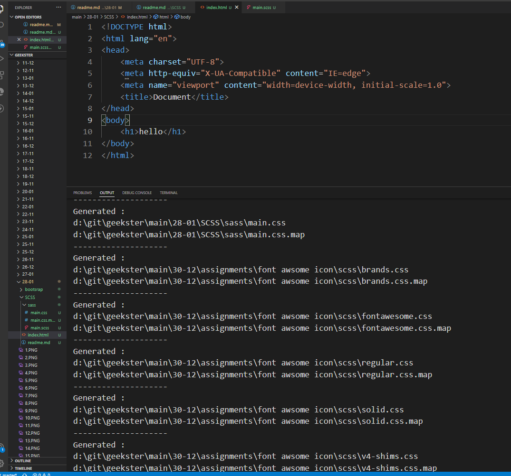

# SCSS
> Before SASS was used as a CSS preprocesser language 
> After CSS3 was introduced, SASS was replaced by SCSS 

### SASS
(CSS Extension language/ CSS Preprocessor)
- SASS is an extension to CSS that help us write more flexible styles by using variables, functions, conditional statement 
- Splits our SASS files up into modules, you can merge all these individual SASS files together in a CSS file 

#### Browsers dont understand SASS code 
- it needs to be translated into CSS 
- SASS is written in Ruby 
```bash 
Ruby is a programming language
Ruby on Rails is a framework written in Ruby which extends Ruby to solve problems without programmer having to reinvent anything, it offers readymade code libraries. 
```
### Download & Compiling SASS 
> we created `index.html` and `sass/main.css`
1. install live sass compiler from vscode 
- go to `index.html` file and click on **watch SASS** on the bottom rhs and note that automatically two files will be downloaded `main.scss`and `main.css.map`

```bash 
SCSS is run time compiled and converted from SCSS to CSS and is stored inside CSS 
```
### Contents
1. variables 
2. operators
3. nesting 
4. SASS mixin & include (and parameters)
5. partials - add mixins to another page and call them later 

### Discussing SASS Contents (except partial)
> index.html 
```bash 
<!DOCTYPE html>
<html lang="en">
<head>
    <meta charset="UTF-8">
    <meta http-equiv="X-UA-Compatible" content="IE=edge">
    <meta name="viewport" content="width=device-width, initial-scale=1.0">
    <!-- link main.css file only; no need to add scss -->
    <link rel="stylesheet" href="sass/main.css" />
    <title>Document</title>
</head>
<body>
    <header class="main-header">
        <h1>hello</h1>
        <p>hiii</p>
    </header>
</body>
</html>
```
> main.scss 
```bash 
* {
    margin: 0;
    padding: 0;
    box-sizing: border-box;
  }
  
  html {
    font-size: 62.5%; 
    /* same as 10x */
  }

# mixin 
# if a peice of code is repeating multiple times, add it to mixin 
# syntax: @mixin mixinname
@mixin flexprop {
    display: grid;
    place-items: center;
    align-items: center;
    flex-direction: column;
}

# you can create as many mixins as you want 
# in this mixin we are passing a parameter 
@mixin commoncode($lettervalue) {
    color: red;
    # operators 
    font-size: 5rem + 5rem;
    letter-spacing: $lettervalue;
}
  
# variables 
  $bg-color: #10ac84; 

# nesting 
  .main-header {
    width: 100vw;
    height: 100vh;
    # display: grid;
    # place-items: center;
    # align-items: center;
    # flex-direction: column;

    # instead of writing repetetive code, we can now call the mixin we defined above using include
    @include flexprop;

    /* if this background color is used in multiple places we can simply add it in a variable*/
    background-color: $bg-color;
  
    h1{
    #   color: red;
    #   font-size: 5rem + 5rem;
    #   letter-spacing: .3rem;

    # instead of writting this peice of repeating code, were importing the common code through mixins 
    @include commoncode(1.5rem);

    # if you want to overwrite a certain property defined inside commoncode mixin, then simply define it here 
    #letter-spacing: 1.5rem;
    # but instead of doing this, you can pass parameters inside commoncode

    # instead of writing h1:hover outside the h1 scope, we can define all the styling related to h1, by using the ampersand instead.
      &:hover {
        color: white;
    }
    # we can even user psuedo elements 
      &::after {
          content: ' world';
      }
    }
    
    p{
        @include commoncode(0.3rem);
        # color: red;
        # font-size: 5rem + 5rem;
        # letter-spacing: .3rem;
    }
  }
```
> Note that: After you add styling in .scss file, its corresponding `css` multi browser compatible code will be added in `main.css`. for instance, for this .scss code, were getting this generated css file 
```bash 
* {
  margin: 0;
  padding: 0;
  -webkit-box-sizing: border-box;
          box-sizing: border-box;
}

html {
  font-size: 62.5%;
  /* same as 10x */
}

.main-header {
  width: 100vw;
  height: 100vh;
  display: -ms-grid;
  display: grid;
  place-items: center;
  -webkit-box-align: center;
      -ms-flex-align: center;
          align-items: center;
  -webkit-box-orient: vertical;
  -webkit-box-direction: normal;
      -ms-flex-direction: column;
          flex-direction: column;
  /* if this background color is used in multiple places we can simply add it in a variable*/
  background-color: #10ac84;
}

.main-header h1 {
  color: red;
  font-size: 10rem;
  letter-spacing: 1.5rem;
}

.main-header h1:hover {
  color: white;
}

.main-header h1::after {
  content: ' world';
}

.main-header p {
  color: red;
  font-size: 10rem;
  letter-spacing: 0.3rem;
}
/*# sourceMappingURL=main.css.map */
```
### ⚠️ Heads up!
- CSS has variables of its own, which are totally different than Sass variables. Know the differences!

- Sass variables are all compiled away by Sass from the .scss file. CSS variables are included in the CSS output.

- CSS variables can have different values for different elements, but Sass variables only have one value at a time.

### Partial 
1. Create a partial file (partial files start with _)
```bash 
We use _ as a way to indicate to the compiler that it should not compile this partial file, and only focus on compiling the `main.css`
```
> Note that: we created 2 partial files:
- `_mixin.scss` - to store the mixin from the `main.scss` file.
- `_var.scss` - to store the variables from `main.scss` file.

> We import these two partial files inside `main.scss`
```bash 
# importing mixin and variables 
@import 'mixin';
@import 'var';

* {
    margin: 0;
    padding: 0;
    box-sizing: border-box;
  }
  
  html {
    font-size: 62.5%; 
  }

# nesting 
  .main-header {
    width: 100vw;
    height: 100vh;
    @include flexprop;

    h1{
    @include commoncode(1.5rem);

      &:hover {
        color: white;
    }
      &::after {
          content: ' world';
      }
    }
    
    p{
        @include commoncode(0.3rem);
    }
  }
```
> mixin.scss
```bash 
@mixin flexprop {
    display: grid;
    place-items: center;
    align-items: center;
    flex-direction: column;
}

@mixin commoncode($lettervalue) {
    color: red;
    font-size: 5rem + 5rem;
    letter-spacing: $lettervalue;
}
```
> var.scss
```bash 
# variables 
$bg-color: #10ac84; 
```
