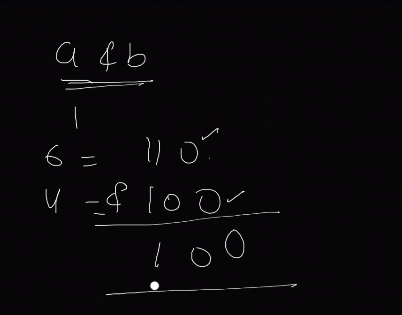
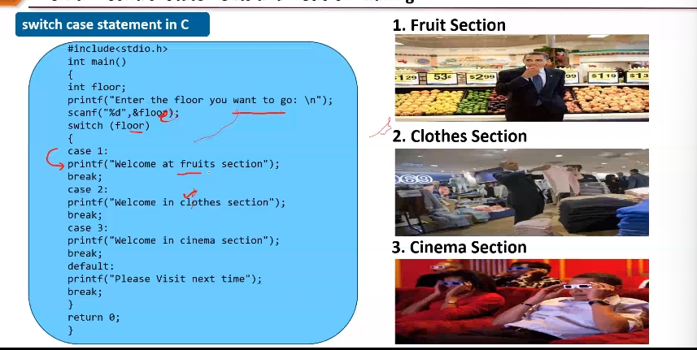
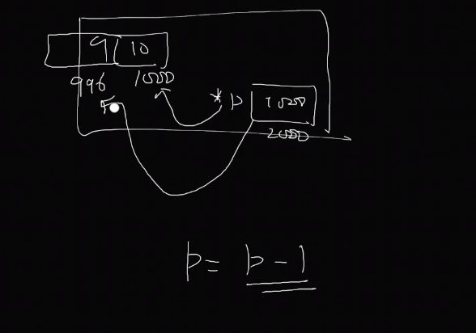
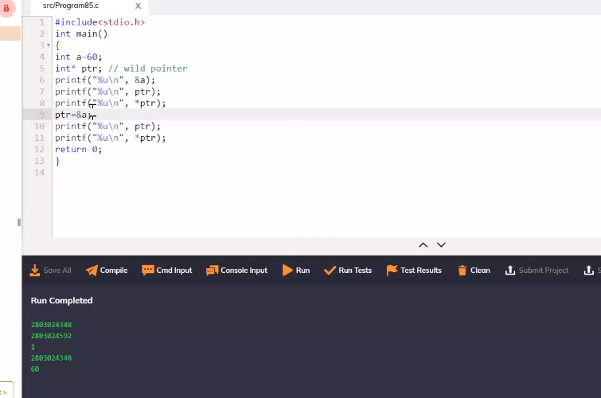

# C-Programming 
### Setup the environment for C / C++ on VSCODE?


-------


> Difference between chromium and chrome?
Chrome is a web browser developed by Google whereas Chromium is an open-source browser also created by Google. Chrome uses the same source code as Chromium, but with fewer extra features and add-ons. andd chromium gives more data privacy.

Chromium comes under the BSD LICENSE which are a family of permissive free software licenses, However chrome comes under freeware which means its a free software but its source code is not open source or freely given to the public. 


- C called middle level programming language 
Programming languages with features of both Low Level and High-Level programming languages are referred to as “Middle Level” programming languages. has features of both low-level and high-level programming languages.


The basic syntax and code structure of both C and C++ are the same. C++ is a general-purpose programming language that was developed as an enhancement of the C language to include object-oriented paradigm. 

#### Course introduction:


### History of Programming Languages:
- The first computer programming language was created in 1883, when a woman named Ada Lovelace worked with Charles Babbage on his very early mechanical computer, the Analytical Engine (It would be able to perform any calculation set before it.). While Babbage was concerned with simply computing numbers, Lovelace saw that the numbers the computer worked with could represent something other than just amounts of things. She wrote an algorithm for the Analytical Engine that was the first of its kind. 
- in 1949 assembly language introduced 
- in 1952 program languages were called autocode. Some consider autocode to be the first compiled computer programming language, meaning that it can be translated directly into machine code using a program called a compiler.
- 1957: Fortran which is a HLL: A computer programming language created by John Backus for complicated scientific, mathematical, and statistical work, Fortran stands for Formula Translation. It is the one of the oldest computer programming languages still used today.
- 1958: Algol: Created by a committee for scientific use, Algol stands for Algorithmic Language. Algol served as a starting point in the development of languages such as Pascal, C, C++, and Java.
- 1959: COBOL: Created by Dr. Grace Murray Hopper as a computer programming language that could run on all brands and types of computers. COBOL stands for COmmon Business Oriented Language. One of the first of the high-level languages, it was put together by a group sponsored by the Department of Defense to develop a common business language.
- 1959: LISP: Created by John McCarthy of MIT, LISP is still in use. It stands for LISt Processing language. It was originally created for artificial intelligence research but today can be used in situations where Ruby or Python are used.
- 1964: BASIC: Developed by John G. Kemeny and Thomas E. Kurtz at Dartmouth College so that students who did not have a strong technical or mathematical understanding could still use computers, A modified version of BASIC was written by Bill Gates and Paul Allen. This was to become the first Microsoft product.
- 1970: Pascal: Developed by Niklaus Wirth, Pascal was named in honor of the French mathematician, physicist, and philosopher Blaise Pascal. It is easy to learn and was originally created as a tool for teaching computer programming. Pascal was the main language used for software development in Apple’s early years.
- 1972: SMALLTALK - It's the first object-oriented programming language
- 1972: C: Developed by Dennis Ritchie at Bell Labs, C is considered by many to be the first high-level language. A high-level computer programming language is closer to human language and more removed from the machine code. C was created so that an operating system called Unix could be used on many different types of computers.
- 1972: SQL: SQL was developed by Donald D. Chamberlin and Raymond F. Boyce at IBM.
- 1978: MATLAB: Developed by Cleve Moler. MATLAB stands for Matrix Laboratory. It is one of the best computer programming languages for writing mathematical programs, can also be used to create two- and three-dimensional graphics.
- 1983: Objective-C: Created by Brad Cox and Tom Love, Objective-C is the main computer programming language used when writing software for macOS and iOS, Apple’s operating systems.

- 1983: C++: C++ is an extension of the C language and was developed by Bjarne Stroustrup. It is one of the most widely used languages in the world. C++ is used in game engines and high-performance software like Adobe Photoshop. Most packaged software is still written in C++.
- 1991: Python: Designed by Guido Van Rossum
- 1991: Visual Basic: Developed by Microsoft, Visual Basic allows programmers to choose and change pre-selected chunks of code in a drag-and-drop fashion through a graphical user interface (GUI).
```bash
Visual Basic was developed by Microsoft to extend the capabilities of BASIC by adding objects and “event-driven” programming: buttons, menus, and other elements of graphical user interfaces (GUIs). 

Visual Basic was originally created to make it easier to write programs for the Windows computer operating system. 

Microsoft Windows, also called Windows and Windows OS, computer operating system (OS) developed by Microsoft Corporation to run personal computers (PCs). Featuring the first graphical user interface (GUI) for IBM-compatible PCs, the Windows OS soon dominated the PC market.
```
- 1993: R:  It is mostly used by statisticians and those performing different types of data analysis.
- 1995: Java: Originally called Oak, Java was developed by Sun Microsystems. It was intended for cable boxes and hand-held devices but was later enhanced so it could be used to deliver information on the World Wide Web
- 1995: PHP: Created by Rasmus Lerdorf, PHP is used mostly for Web development and is usually run on Web servers. It originally stood for Personal Home Page. used to build websites and blogs. WordPress, a popular website creation tool
- 1995: Ruby: Ruby was created by Yukihiro “Matz” Matsumoto, who combined parts of his favorite languages to form a new general-purpose computer programming language that can perform many programming tasks. It is popular in Web application development. Ruby code executes more slowly, but it allows for computer programmers to quickly put together and run a program.
- 1995: JavaScript: Created in just 10 days by Brendan Eich, this language is mostly used to enhance many Web browser interactions. Almost every major website uses Javascript. JavaScript was designed in 10 days under pressure from Netscape to quickly deliver a light, breezy scripting language for the web browser.
- 2000: C#: Developed by Microsoft with the goal of combining the computing ability of C++ with the simplicity of Visual Basic, C# is based on C++ and is similar to Java in many aspects. It is used in almost all Microsoft products and is primarily used for developing desktop applications.
- 2003: Scala: Created by Martin Odersky. Scala is a computer programming language that combines functional programming, which is mathematical, with object-oriented programming, which is organized around data that controls access to code. Its compatibility with Java makes it helpful in Android development.
- 2003: Groovy: Developed by James Strachan and Bob McWhirter, Groovy is derived from Java 
- 2009: Go: Go was developed by Google to address problems that can occur in large software systems.  to improve the working environment for programmers so they could write, read, and maintain large software systems more efficiently.
- 2014: Swift: Developed by Apple as a replacement for C, C++, and Objective-C

#### Use cases of different programming languages
> python 
Python is really popular because developers can work really rapidly in it. Python is commonly used for developing websites and software, task automation, data analysis, and data visualization. 

> JAVA 
Java is really popular because it provides not only a robust data abstraction model via it’s object oriented basis, but because it has a reputation of being stable, solid, reliable and “enterprise grade”. You can build big hairy complicated code bases in Java and have them perform robustly (and slowly) for a very long time.

> C++
C++ was sort of a half-step between C and Smalltalk. You have to recall that originally, it was a pre-processor that let you build object-oriented programs, but transpiled to C, then built to running code. If you have ever looked at C++ and wondered why it’s clunky… that’s it. Modern C++ is more or less isomorphic to Java.

> C
C was built to be a high-level portable replacement for assembler. It had ALGOL-like control structures, plus the ability to directly manipulate register use, directly address physical locations in hard memory and I/O controls, and freed the programmer to directly meddle in the data structures by exposing all the pointer arithmetic that actually lives under dimensioned arrays in, well, literally every other programming language.

So in particular if you’re building code all the way down on the hardware, where you have to worry about needing to touch this particular address in that particular way, where you can’t afford to have the language “garbage collect” for performance reasons, where you don’t need a layer of abstraction because you know a priori that the abstraction models built into other languages will actually fuck you up… you write in C.

### Unit 1: Introduction to C programming


Computer understands binary, we use HLL and compiler converts HLL to LLL
```bash
#machine language is made up of binary
Machine language is made up of instructions and data that are all binary numbers.

#differece between machine language and assembly language 
The major difference between machine language and assembly language is that machine language is referred to as a binary language. It can be run on a computer directly. 

While an assembly language is a low-level programming language that must be converted into machine code using software called an assembler

#assembly language instructions are human understandable 
but in order to give instructions to the computer we had to remember bunch of neumonics 

SUB R1, R2
ADD R1, R2

#HLL was created to overcome remembering all these neumonics 
```
##### How computer convert text to binary?
Computers convert text and other data into binary with an assigned ASCII (American Standard Code for Information Interexchange) value. Once the ASCII value is known, that value can be converted to binary.

> History of C:

- ALGOL created
- ALGOL enhanced and formed BCPL
- Ken Thompson who was working on UNIX then created B language 
- Dennis Rechie developed c-programming in Bell Labs (formerly AT&T Bell Laboratories) in 1972. many of the principles and ideas that he incorporated into the language were taken from earlier programming language B and B’s ancestors BCPL

- the American National Standards Institute (ANSI) set up a committee that further amended and standardized the language. Since then C has been referred to as ANSI Standard C, and it remains popular in the world of UNIX-like operating systems. However now ANSI C is an obselete standard.
- C has been standardized by the American National Standards Institute (ANSI) since 1989 and subsequently by the International Organization for Standardization (ISO). 

> Features of C:


```bash
dyanamic memory allocation - allocate memory during run time. 
```

> Uses of C:
- with C you can develop operating systems and manipulate memory directly. in python I have never heard of a OS written in it
- C is a Systems language, while python is a scripting language. C is a lot more powerful than python, as python was designed as teaching language(kinda like pascal)
- You can literally do anything with C. BIOSes, OSes, apps, games, servers, etc are all written in C. hell even the scripting languages such as python, perl, ruby, php and javascript all have interpreters written in C.
- C is the grand father of the modern programming language. without C there wouldn’t be Java, Javascript, C#, C++, Lua, Python, Ruby, Rust.
- C is very versatile(kind of ties in with reason 3)
finally C allows you to get to the metal(i.e the hardware) more so than the other languages. please consider this chart below


> Most recent version:
C17, the most recent standard for the C programming language, prepared in 2017 and published in June 2018.

> Language processors:

Compilers, interpreters, translate programs written in high-level languages into machine code that a computer understands. And assemblers translate programs written in low-level or assembly language into machine code. 

- assembler
Assembly language uses mnemonics (instructions) like ADD, MUL, MUX, SUB, DIV, MOV and so on. to represent instructions in it are not directly understandable by machine and high-Level language is machine-independent. 
The Assembler is used to translate the program written in Assembly language into machine code. he assembler is basically able to convert these mnemonics in Binary code. Here, these mnemonics also depend upon the architecture of the machine. 

For example, the architecture of intel 8085 and intel 8086 are different.

- intrepretor 
An interpreter takes a source program and runs it line by line, translating each line as it comes to it. Interpreter directly executes instructions written in a programming or scripting language without previously converting them to an object code or machine code.      

Example: Perl, Python and Matlab.

- compiler 
A compiler is a program that converts the entire source code of a programming language into executable machine code for a CPU.  

Examples: C, C++, Java  

> Difference between compiler and intrepretor?


### Simple C Program 
These source code cannot be executed directly by the computer and must be converted into machine language to be executed. To convert HLL( C Language) TO LLL we need a compiler. 
```bash
#C is case-sensitive language 

#header file which includes code for ip/op 
#include <stdio.h>
    #entry point of program 
int main() 
{
    #printf is a predefined function
    printf("hello world");
    return (0);
}
```
> Why do we use `int main()` in place of `void main()` ?
- `main()` is a function 
as per C convention it has a default return type of int, which means it should return int type of value. However some compilers allow to write void main() which means its not returning any value. 

Old compilers like Turbo C allow `void main()`

> Why do we write `int` before main()?
```bash
#its the syntax: 
int sum()

#return type   protoype  function 
int            sum       ()
```

> variable is a name given to a memory block to hold a value 

```bash
#include <stdio.h>
    int main() 
    {
        #these variables are added to RAM
        int a; #declaration - block assigned in the memory 
        a=6;   #initialisation - assigning value to the variable 
        #we can change the value of variable later on in the program
        printf("%d", a);
        return (0);
    }

```
> constant 


#### Basic structure of C Program 
```bash
#Documentation means specifying extra lines we write for understanding purpose. Software documentation is a way for engineers and programmers to describe their product and the process they used in creating it in formal writing. (optional)

#Link: library function will link the defination to the predefined function in our program
#include<stdio.h>
    #global variables defined here 
    int sum = 30;

    void lunch();

    int main() 
    {
        #define local variables and constants here 
        int sum = 10;
        printf("%d\n", sum);
        lunch();

        return (0);
    }

   void lunch(){
    printf("biryani");
   }

#OUTPUT:
//    10
// Biryani
```
> Tokens in C

- smallest biulding block of the c program. every C program is a collection of tokens (tokens can be either of these: keyword (reserved words), identifier (the names you supply for variables, types, functions, and labels in your program), constant, string, operator, seperator (;), special symbol)

#### Keyword 
Keywords are reserved words whose meaning is already known to the C compiler.


- when you use float compiler will know how much memory slot to assign
- all keywords are written in lowercase 


### Unit 2


#### Operator
Operator is a special symbol which tells compiler what operation to perform. 


> Types of Operators:
1. Arithmetic operator

```bash
#include <stdio.h>
    int main() 
    {
        int a = 9, b = 4, c;
        c= a+ b;
        printf("%d\n", c);

        c= a- b;
        printf("%d\n", c);

        c= a* b;
        printf("%d\n", c);

        c= a/ b;  
        printf("%d\n", c);

        c= a %b;
        printf("%d\n", c);
        
        return (0);
    }

// 13
// 5
// 36
// 2
// 1
```
2. Relational operator

```bash
#include <stdio.h>
    int main() 
    {
        int a = 5, b=5, c=10;
        
        printf("%d\n", a == b); 
        printf("%d\n", a == c); 
        printf("%d\n", a > b);  
        printf("%d\n", a < c);  
        return (0);
    }

// 1
// 0
// 0
// 1
```
3. Logical operator

when we want to combine more than 1 statement 
```bash
#include <stdio.h>
    int main() 
    {
        int a = 11, b=5, c=10;
        if(a>b && a>c) {
           printf("\n a is greater than both");
        } else {
           printf("\n a is not greater than both");
        }
        return (0);
    }

#OUTPUT 
 a is greater than both
```
- && (LOGICAL ADDITION) 
```bash
0 1 1 0
1 1 0 0 
-------
1 1 1 0
```
- || (LOGICAL MULTIPLICATION)
```bash
0 1 1 0
1 1 0 0 
-------
0 1 0 0 
```
4. Assignment Operator 
assigns value

```bash
#include<stdio.h>
    int main() 
    {
        #create 2 memory blocks in the RAM
        int a = 11, b=5, c;
        c= a+b;
        #c += a same as c=c+a
        
        printf("%d\n", c);
    
        return (0);
    }

#OUTPUT 
16
```

5. Bitwise Operator 
Bitwise operator operates at bit / binary level / 0s and 1s

```bash
#include <stdio.h>
    int main() 
    {
        int a = 6, b=4;
        //perform & operator at every bit level 
        printf("%d\n", a&b);

        return (0);
    }

// 4
```


> convert decimal to binary 


6. Misc operator 
there are a few other important operators including sizeof and ? : supported by the C Language.


#### Type Specifier 
specifies to the compiler type of value variable is going to hold. each type denotes how much memory is allocted to that memory block.


#### sizeof() operator
sizeof() gives size of the datatype


#### Unary operator


> Difference between operators
```bash
#pre-increement operator - increase value, then assign
#post-increement - first assign, then increase value 
#pre-decrement operator - decrease value, then assign
#post-decrement - first assign, then decrease value 

#include <stdio.h>
    int main() 
    {
        int a = 1, b;
        b = ++a;
        //a=2, b=2

        b = a++;
        //a=2, b=1

        b = --a;
        //a=0, b=0

        b = a--;
        //a=0 , b=1
        printf("%d %d\n", a, b);

        return (0);
    }
```
### Precedence Of Operators
Compiler gives preference to which operator would be executed first


- if in an expression all operators have equal precedence then follow associativity giving priorty from LHS to RHS 


#### Ternary Operator / Conditional Operator 


#### Predefined Functions
predefined functions are library functions, whose defination is stored in compiler, to use these functions include the header file.


> conio.h not used is latest compilers 

##### Difference between modulo and division?
‘%’ is known as the modulus operator or the remainder operator; it is used to find the remainder of division of two numbers.
```bash
Eg;
int i=10;
int j=3;
int c=i%j;
// here, c will get the value 1 as 10 divide by 3 is quotient as 3 and remainder as 1

‘/’ is known as the division operator; it is used to find the quotient in the division of two numbers.
Eg:
int i=10;
int j=3;
int c=i/j;
// here, c will get the value 3 as 10 divide by 3 is quotient as 3 and remainder as 1
```

#### Input-Output


## Unit 3: Data Types and Input / Operator 


- Type of data variable holds is called Data Types
The moment you declare a variable, you need to declare its type 
```bash
#type of a is integer 
int a = 10;
```


##### Primitive VS Derived VS User Defined Data Types 
inbuilt datatypes are known as primitive datatype, derived datatypes are derived from the primitive data types. while user defined data types are mainly used to assign names to integral constants, which make a program easy to read and maintain


Different data types also have different ranges up to which they can store numbers. These ranges may vary from compiler to compiler. 


#### Type Casting
Type Casting is basically a process in C in which we change a variable belonging to one data type to another one. In type casting, the compiler automatically changes one data type to another one depending on what we want the program to do.
```bash
#Converting one data type to another data type
int a = 11;
float b;
b=a;  #INT -> FLOAT 
```

##### Types of Type Casting 
- Implicit Type Casting - when smaller datatype converted into bigger datatype 
- Explicit Type Casting - when large datatype convert into smaller data type (forced conversion)

#### Implicit Type Casting


Implicity compiler convert small datatype to bigger data type (converting int -> float)

```bash
#include <stdio.h>
int main() {
   int a = 10;
   char b = 'S';
   float c = 2.88;
   a = a+b;
   printf("Implicit conversion from character to integer : %d
",a);
   c = c+a;
   printf("Implicit conversion from integer to float : %f
",c);
   return 0;
}
```
```bash
#include <stdio.h>

int main()
{
   int a = 10;
   float b = 2.4;
   b = a;
    //now b=10

   printf("%f", b); //10.000000
   // compiler converts int to float (smaller -> bigger datatype) implicitly 

   return (0);
}

#OUTPUT
10.000000
#by default compiler will print decimal value to 6 decimal places 
```
- However we can change the number of decimal places 
```bash
#include <stdio.h>

int main()
{
   int a = 10;
   float b = 2.4;
    b = a;
    //now b=10

   printf("%.2f", b); //rounds upto 2 decimal places 

   return (0);
}
```

- here compiler is converting implicity using format specifier


#### Explicit Type Casting 

This conversion is done by user. This is also known as typecasting. Data type is converted into another data type forcefully by the user.

cannot convert big datatype to smaller datatype (float -> int) directly, we'll need to forcefully acheive this 

```bash
#include <stdio.h>
int main() {
   float c = 5.55;
   int s = (int)c+1;
   printf("Explicit Conversion : %d
",s);
   return 0;
}

#OUTPUT 
Explicit Conversion : 6
```
```bash
#include <stdio.h>

int main()
{
    int x = 60, y = 17;
    float res;

    res = x/y;
    #Its calculating the integer division between x and y -> 60/17=3.5 =3
    #and then its converting it to float -> 3.0
    printf("(Without typecasting the expression) 60/17 = %.3f\n", res );  

    res = (float)x/y;

    #its converting x to float value so the calculation would be 60.0/17=3.529
    printf("(With typecasting the expression) 60/17 = %.3f\n", res ); 

    return 0;
}

#OUTPUT 
(Without typecasting the expression) 60/17 = 3.000
(With typecasting the expression) 60/17 = 3.529
```

## Input and Output Functions 
Both input and output function is defined in stdio. h thats why we need to define the library function in the header file so the compiler knows the mening of this predefined function

Input refers to feeding data into the program, and Output refers to getting data out of the program. Input and Output in C are done using the Standard Input/Output library, which we could include in the program using stdio.h header file consists of Input and Output functions in C like scanf() for input and printf() for output

### Input Function

input function allows user to take input from the user via keyboard 

#### getchar()
allows you to get one character from the user 

- taking singular character input using `getchar()`
```bash
#include <stdio.h>

int main()
{
   char a;
   printf("enter place \n");
   // scanf("%s", a);
   a = getchar();
   printf("%s", a);

   return 0;
}

#OUTPUT 
x
```
- if the entered letter is right then print the first 
```bash
#include <stdio.h>

int main()
{
   char x;
   x = getchar();
   if(x=='a')
   {
    printf("hi");
   } else {
    printf("bye");
   }

   return (0);
}

#OUTPUT 
- a 
hi 
```
- choose Y/N 
```bash 
#include <stdio.h>

int main()
{
   char x;
   
   printf("choose Y/N \n");
   x= getchar();

   if(x == 'y' || x== 'Y')
   {
    printf("hi");
   } else {
    printf("bye");
   }

   return (0);
}

#OUTPUT 
- choose Y/N 
- y
hi 
```

#### gets()
allows you to get multiple ch (string) from the user 

```bash
#include <stdio.h>

int main()
{
   char  names[20];

   printf("enter place \n");
   gets(names);
   printf("%s", names);

   return 0;
}

#OUTPUT 
// enter place 
// jaipur rajasthan
// jaipur rajasthan
```

#### Can we use `scanf()` in place of `gets()`?
if we have a string `jaipur rajasthan`. scanf() would only print Jaipur because through scanf() allow you to enter only single character string. i.e after space it wont count the words. 
```bash
#include <stdio.h>

int main()
{
   char  names[20];

   printf("enter place \n");
   scanf("%s", names);
   printf("%s", names);

   return 0;
}

#OUTPUT 
// enter place 
// jaipur rajasthan
// jaipur

#in order to get full output use gets(name) instead 
```

> Can we format output, like print the output of int in octal format?

```bash

#include <stdio.h>

int main()
{
   int a = 10;
   printf("%o", a);

   return 0;
}

#OUTPUT 
12 #comverted to octal form 
```

## Output Function 

used to print message on the console / output screen 

#### putchar()
for printing a single character only, if your output has more than one word only the first word would be printed anyways
```bash
#include <stdio.h>
  
int main()
{
    char ch = 'G';
    putchar(ch);
  
    return (0);
}

#OUTPUT 
G
```

#### puts()
used to print multi word string, just like printf(). By default puts() prints the output in the next line


> puts() automatically sends the output to the next line.
```bash
#include <stdio.h>

int main()
{
   char  names[20];

   printf("enter surname \n");
   scanf("%s", names);

   // puts sends the output to the next line
   puts(names);
   puts(names);

   return 0;
}

#INPUT 
reem 

#OUTPUT 
reem 
reem 
```
#### printf()
printf() also displays multiword strings, However it doesnt send the output to the next line by default 
```bash
#include <stdio.h>

int main()
{
   char name[20];
   printf("enter first name \n");
   scanf("%s", name);

   printf("%s", name);
   printf("%s", name);

   return 0;
}

#INPUT 
reem 

#OUTPUT 
reemreem 
```
```bash
#include <stdio.h>

int main()
{
   char name[20], names[20];
   printf("enter first name \n");
   scanf("%s", name);

   // note printf() uses format specifiers, puts doesnt
   // printf prints both the outputs on the same line
   printf("%s", name);
   printf("%s \n", name);

   printf("enter surname \n");
   scanf("%s", names);

   // puts sends the output to the next line
   puts(names);
   puts(names);

   return 0;
}

#OUTPUT
- enter first name 
- reem
reemreem 
- enter surname 
- shaikh
shaikh
shaikh
```
#### Difference between `printf()` and `puts()`?
> However if there is a printf() before puts() then the first output of the puts() would be printed on the same line as the output of printf()
```bash
#include <stdio.h>

int main()
{
   char name[20], names[20];
   printf("enter first name \n");
   scanf("%s", name);

   printf("enter surname \n");
   scanf("%s", names);

   // note printf() uses format specifiers, puts doesnt
   // printf prints both the outputs on the same line
   printf("%s", name);
   printf("%s \n", name);
   //if we mention puts() after printf() then the first encounter it will print on the same line as printf() output, all the puts() after that will be printed on a new line 

   // puts sends the output to the next line
   puts(names);
   puts(names);

   return 0;
}

#INPUT 
reem 
shaikh 

#OUTPUT 
reemreem
shaikh
shaikh
```
> for instance if we didnt give the `\n` in printf() this would be the output 
```bash
#include <stdio.h>

int main()
{
   char name[20], names[20];
   printf("enter first name \n");
   scanf("%s", name);

   printf("enter surname \n");
   scanf("%s", names);

   printf("%s", name);
   printf("%s", name);

   puts(names);
   puts(names);

   return 0;
}

#INPUT 
reem 
shaikh 

#OUTPUT 
reemreemshaikh
shaikh
```
> Important Takeaways
- So you'll need to ensure that everytime you use printf() you're adding a `\n` in the printf() which means sending the pointer to the next line.
- Strings should be written in double quotes, this aint JS. if you specify it in single quotes compiler will throw an error. In C and in C++ single quotes identify a single character, while double quotes create a string literal. 'a' is a single a character literal, while "a" is a string literal
```bash
#include <stdio.h>

int main()
{
    char c = 'x';
    printf("%c", c);
    printf("%c", 'f');

   return 0;
}
#OUTPUT 
xf
```
- if you want to print one character use `putchar()`
```bash
#include <stdio.h>

int main()
{
    char c = 'x';

    //if you want to print one character use putchar()
    putchar(c);

   return 0;
}

#OUTPUT 
x
```
##### Terminal QS


> Implicit conversion for the Q.1
```bash
#include <stdio.h>

int main()
{
   int x, y= 10;
   char z = 'a'; //97
   // by doing this calculation were implicitly converting ch to int 
   x = y+z;

   printf("z:%d y:%d x:%d", z, y, x);

   return 0;
}

// z:97 y:10 x:107
```
# Control Statements 


## Flow Control in C programming

> control flow of execution in a C program is called flow control 

### I. Decision Control 


##### 1. If statement 


##### 2. If- Else statement 


##### 3. If- Else if Ladder


##### 4. Nested if-else


##### 5. Switch case


In the switch statement, we compare the condition value with multiple cases. When there is a match with any one of the cases, the block of code corresponding with that case is executed. Each case has a name or a number, which is known as its identifier. If none of the cases matches the condition, the block of code corresponding to the default case is executed. The same example of finding number of days in each month is done using the switch below.
```bash
switch (condition) {
case identifier1:
//block of code
break;
# Break will return control out of switch case.so if we don't use it then next case statements will be executed until break appears. 

case identifier2:
//block of code
break;

case identifier3:
//block of code
break;

case identifiern:
//block of code
break;

default:
//block of code
}
```
> Pros:
- A switch statement is significantly faster than an if-else ladder if there are many nested if-else's involved. Switch is generally faster than a long list of ifs because the compiler can generate a jump table during compilation. It is ideal to use a switch instead of using nested if-else statements as it is faster due to the creation of a jump table. The number of comparisons made is lesser hence, reducing the compile time.

### II. Loop Control 

> used for executing block of statement again and again.

#### 1. While Loop 


> Entry control loop - before executing the loop check the condition at the entry point.
1. initialize variable 
2. check condition 
3. iterate based on whether increement or decrement 

#### 2. Do-While Loop 


> Exit-controlled Loop 
1. iniitalize variable 
2. iterate based on whether increement or decrement
3. check condition  

##### Difference between while and do-while?

While loop statement(s) is executed zero times if the condition is false, whereas the do-while statement is executed at least once.

#### 3. For Loop 


> Entry control loop - before executing the loop check the condition at the entry point.
1. initialize variable 
2. check condition + iterate based on whether increement or decrement 

### JUMP CONTROL STATEMENT 


#### BREAK 


#### CONTINUE 


it skips 3 and prints everything else in the loop

#### GOTO 


## TERMINAL QS 


# Unit 5: Functions 

```bash
Function is a self contained block which can be called again and again. it increases readability of your program and reduces size of the code since it can be called whenever you need. 
```

```bash
predefined / library function - already designed and given to you
user defined function - user can define a function
```
#### Every function has 3 things 

1. function declaration 
2. function call 
3. function defination 
```bash
#function declaration 
function return type, name of function (argument list)
int add ()

#function call - calls the function defination 
function name(argument type)
add(int a, int b)

#function defination 
where the function is defined 
```
```bash
#include <stdio.h>
void hello();  #function declaration / prototype
#NOTE: function declaration should be done before main()

int main() {
   hello();    #function call 
}

void hello() {  #function defination
   printf("hello world");
}
```
> calling `hello world` 100 times
```bash
#include <stdio.h>
void hello();  #function declaration / prototype

int main() {
   for(int i=0; i<100; i++) {
      hello();    #function call 
   }
}

void hello() {  #function defination
   printf("hello world");
}
```
#### Types of User Defined Functions 
Function can be classified on basis of argument and return type 


##### 1. function with argument and with return type 

```bash
int add(int, int) #function declaration
```
> function defination will return a value to its call
```bash
#include<stdio.h>
int add(int, int);   #function declaration

int main() {
   int a=2, b=3, sum;
   sum = add(a,b); #call
   printf("%d", sum);
   return 0;
}

int add(int a, int b) #function defination
{
   int c;
   c = a+b;
   return c;
}
```


##### 2. function with argument and without return type 

```bash
void add(int, int)
#NOTE; when there is no return type we use `void`
```
> function defination will return a value to its call
```bash
#include<stdio.h>
void add(int, int);   #function declaration

int main() {
   int a=2, b=3, sum;
   sum = add(a,b); #call,   #actual arguments 
   return 0;
           
}

void add(int a, int b) #function defination
{                      #formal arguments 
   int c;
   c = a+b;
   printf("%d", c);
   #no return type 
}
```
##### 3. function with no argument and no return type 

```bash
void add()
```
```bash
#include<stdio.h>
void add();   #function declaration

int main() {
   add(); #call
   return 0;
}

void add() #function defination
{
   int c;
   int a=2, b=3;
   c = a+b;
   printf("%d", c);
   #no return type
}
```
##### 4. function with no argument and with return type 

```bash
int add()
```
> function defination will return a value to its call
```bash
#include<stdio.h>
int add();   #function declaration

int main() {
   int sum;
   sum = add(); #call
   printf("%d", sum);
   return 0;
}

int add() #function defination
{
   int c, a=3, b=4;
   c = a+b;
   return c;
}
```


### Formal Argument VS Actual Argument 
> difference between actual argument and formal argument?
the argument in function call is called actual argument. the argument in function defination is called formal argument 
```bash
#function with argument and without return type 

#include<stdio.h>
void add(int, int);   #function declaration

int main() {
   int a=2, b=3, sum;
   sum = add(a,b); #call,   #actual arguments 
   printf("%d", sum);
   return 0;
           
}

void add(int a, int b) #function defination
{                      #formal arguments 
   int c;
   c = a+b;
   #no return type 
}
```
### Recursion 
when function calls itself 


```bash
#print the fact through recursion

int fact(int n);   
#include <stdio.h>

int main () {
   int a = 3, f;
   f = fact(a);   
   printf("%d", f);
   return 0;
}

int fact(int a) {  
   if(a > 1) {
      return a * fact(a-1);
   } else {
      return 1;
   }
}
```

### Terminal QS 


- A1. void() is used whenever a function is not returning any value to function call 
- A2. function declaration declaresss the function and gives information to the compiler so it knows where it can be used later in the program. while function declaration tells the compiler about what function needs to be executed, function defination contains the body of the function tha needs to be executed.
```bash
#function declaration 
return type function_name (list of parameters if any)
- can be declared before predefined function

#function defination 
return type function_name (list of parameters if any) {
   body of code 
}
- should be defined only after main()
```
```bash
void hello(int x);  #function declaration

#include <stdio.h>
int main() {
   int x = 1; 
   hello(x);        #function call
   return 0;
}

void hello(int x)   #function defination
{
   if(x <= 3) {
      printf("hello world");
      x++;
      hello(x);     #function calling itself 
   }
}
```
# Unit 6: Storage Classes 


#### Variable Declaration

Whenever we see a variable 3 things come to our mind 
```bash
int a = 10; 

Name of variable      #a
Data Type of variable #int 
Location
```
- if you want to give additional information to the variable then we use storage class. 


> Storage class can give additional information based on:
```bash
storage_class var_data_type var_name;
static int a = 19;
```
1. default value 
2. where it would be stored?
3. scope or visibility - where would it be visible? in a block or entire program?
4. life time - how long will the variable be active?

### Types of Storage Class 


#### 1. auto 
its not mandatory to define storage class for a variable. if you dont specify storage class compiler automatically assign a storage class called `auto`


- when we dont initialize the variable a, it will take a garbage value beause default value of auto is garbage 
```bash
#when we dont specify any storage class to a variable compiler automatically assigns auto to it, which gives it default value of garbage value
int a             #auto int a 
printf('%d', a); 

#console
shows any garbage value 
```
- when we initialize the variable a, it will take the value of a
```bash
auto int a = 10; 
printf('%d', a); 

#console 
10 
```
> scope of auto limited to the block it is defined 

```bash
#include<stdio.h>
int main() {
    auto int a = 20;
    
    printf("%d\n", a);
    {
        a = 10;
        printf("%d\n", a);
    }
    return 0;
}

#console:
20
10
```
```bash
#include<stdio.h>
int main() {
    auto int a = 20;
    printf("%d\n", a);
    {
        printf("%d\n", a);
    }
    return 0;
}

#console:
20
20
```
#### 2. Register Storage class


CPU contains register where it temporarily stores variables that are executing. it fetches the variable from RAM to its register. 

However when a variable is declared and continuosly used, instead of fetching from RAM everytime we could store it temporarily in the register. 
```bash
#value of a is frequently used and changing thats why its not practical to store it in RAM, instead its supposed to be stored in the register within the CPU
int main(){
   int a , b;
   b = a+8;
   a++;
   b = a+80;
   a++;
}
```
- in order to specify that the vairable needs to be stored in the register we specify the `register` storage class 
```bash
register int a; 
```
> example 
```bash
#include<stdio.h>
int main() {
   register int a=3;
   int c; 
   c = a++;
   //assign then increement 
   //c=3, a=4
   a--;
   //3
   c=a+8;
   printf("%d", c);
}
```
##### Important Points
- When we specify storage class as `auto` it will be stored in RAM and whenever we specify the storage class as `register` it will be stored in the CPU register. 
- If you declare a variable as register and if the CPU's register memory is full then it will store it in the RAM 

#### 3. Static Storage class 
- default value of static storage class is 0 
- its stored in the RAM 
- visibility - scope of static variable is restricted to the block in which it is defined
- lifetime of the variable (variables entire life) is available for the entire execution of the program. 


```bash
#include<stdio.h>
void fun();
int main() {
   fun();
   fun();
   return 0;
}

void fun() {
   static int i=0;
   i++;
   printf('%d', i);
}

#console 
1
2
```
#### 4. Extern Storage class 


To declare a variable as external use the keyword `extern` while defining, whenever we want to give a variable global access (can be accessed from any block), we use this storage class. 
```bash
#include<stdio.h>
void fun();
int x=10;

int main() {
   extern int x;
   printf("%d\n", x); //10
   fun();
   return 0;
}

void fun() {
   ++x;
   printf("%d\n", x); //11
}

#console 
10
11
```
```bash
#Pre-increement vs Post-increement 
int x = 2;
y = x++ #assign first, then increement 
x=3
y=2

int x = 2;
y = ++x #increement first, then assign 
x=3
y=3

int a = 1;
b = a++;
//b=1, a=2

int a = 1;
b = ++a;
//b=2, a=2
```
### Summary of Storage class 


# Types of Function 
> Quick review of `function declaration`, `function call` and `function defination`
```bash
void hello(int x);  #function declaration

#include <stdio.h>
int main() {
   int x = 1; 
   hello(x);        #function call
   return 0;
}

void hello(int x)   #function defination
{
   if(x <= 3) {
      printf("hello world");
      x++;
      hello(x);     #function calling itself 
   }
}
```
### 1. CALL BY VALUE 
Passing value in the function call 


actual parameter defined in the int main is copied into formal parameter 
```bash
#include<stdio.h>
void swap(int, int);

int main() {
   int a=10, b=20; //actual parameters 
   printf("before swapping the value of a, b: %d %d \n", a, b);
   swap(a, b);
   printf("value of a, b remains the same: %d %d \n", a, b);
   return 0; 
}

void swap(int x, int y) //formal parameters 
{
   int temp = x; //temp = 10
   x = y;        //x = 20
   y = temp;     //y = 10 
   printf("\n after swapping the value %d %d \n", x, y);
}

// console:
before swapping the value of a, b: 10 20 
after swapping the value 20 10
value of a, b remains the same: 10 20
```


> DRAWBACKS:
- Change occured in (function defination) formal parameter will not reflect changes in the actual parameter, in order to sync both these changes we use call by reference where were passing address of the variable instead of just it value 

### 2. CALL BY REFERENCE 
Passing address in the function call 

- in call by reference change in formal parameters (function defination) will be reflected in actual parameters. 

```bash
#a and b are 2 variable blocks where a holds 10 and b holds 20
#address location of a = 1000 (&a)
#address location of b = 2000 (&b)

#*x means value at x -> 10
#*y means value at y  -> 20
```
```bash
#include<stdio.h>
void swap(int*, int*);

int main() {
   int a=10, b=20; //actual parameters 
   printf("before swapping the value of a, b: %d %d \n", a, b);
   //sending the address of a and b 
   swap(&a, &b);
   printf("value of a, b swaps: %d %d \n", a, b);
   return 0; 
}


#int *x is a special pointer vairable 
#*x = 10
#*y = 20

#so x = memory location of x 
#x = &a
void swap(int *x, int *y) //formal parameters 
{
   int temp = *x;  //temp = 10
   *x = *y;        //x = 20
   *y = temp;      //y = 10 
   printf("\n after swapping the value %d %d \n", *x, *y);
}

// console
// before swapping the value of a, b: 10 20 
// after swapping the value 20 10

// value of a, b swaps: 20 10

#NOTE:
value at x (*x) can be taken as (*&a)
```
#### Terminal QS 

Value of variable is communicated between actual parameter and formal parameter in both call by value (change in formal parameter will not be reflected in actual parameter) and call by reference (change in formal parameter will be reflected in actual parameter) , thats how variables are channels of communication in the program. 

# Unit 7: Arrays & Strings 


### Data Types 


### Derived Data Types 
Derived data types are derived from primitive datatypes 

> Types of derived data types 
1. Arrays & Strings 
2. structure 
3. union 
4. enum 
5. pointer 

#### Why do we need an Array? 

If you want to store data for the same category you could individually create those many number of variables, but then we would have to create type specifiers and variable name which is not a good programming practice.  

If we want to store similar elements of the same data type then we can declare them in an array. Array is a Collection of homogeneous data types. 

Array is a collection of similar datatype and they are all stored in contiguos memory location.
```bash
#DECLARE 10 STUDENT MARKS 
int m[10];
datatype array_name[size_of_array];

#compiler reserves 10 blocks of memory in RAM for this array 
```


#### Types of Array 
### 1D ARRAY / LINEAR ARRAY 
Elements stored in linear manner 


> 2 ways of allocating value to array 
1. static initialisation 
```bash
int a[5] = [1,2,3,4,50];
#or 
int b[0] = 1;
int b[1] = 2;
int b[2] = 3;

#if we dont initialize compiler will intiialize the values with garbage values 
```


2. dyanamic initialization 
accepting values during run time 


```bash
#include<stdio.h>
int main() {
   int arr[5], i;
   #accepting values in an array 
   for(i=0; i<5; i++) {
      scanf("%d\n", &arr[i]);
   }

   #display these elements 
      for(i=0; i<5; i++) {
      printf("%d\n", arr[i]);
   }
   return 0;
}
```

> Accessing 1D Array during run time 

```bash
#include<stdio.h>
int main() {
   int arr[5];
   for(int i=0; i<5; i++) {
      scanf("%d\n", &arr[i]);
   }

     for(int i=0; i<5; i++) {
      printf("array: %d\n", arr[i]);
   }
   return 0;
}

#console:
Note: since compiler has already assigned 5 memory spaces to the RAM, it will take 5 values from the user 
3
1
2
3
4

array: 3
array: 1
array: 2
array: 3
array: 4
```
### 2D ARRAY 
represents array elements in the form of rows and columns 


> 2 kind of initialisations 
- static initialization 
- dyanamic initialization

> Initialize 2D Array using dyanamic memory allocation
```bash
#include<stdio.h>
int main() {
   int arr[3][3];
   for(int i=0; i<3; i++) {
         for(int j=0; j<3; j++) {
            scanf("%d\n", &arr[i][j]); 
      }
   }

     for(int i=0; i<3; i++) {
         for(int j=0; j<3; j++) {
            printf("%d\n", arr[i][j]); 
      }
   }   
   return 0;
}

   0     1     2
------------------
0  0,0   0,1   0,2
1  1,0   1,1   1,2
2  2,0   2,1   2,2
```
### Passing Array to function 

```bash
#include<stdio.h>
int Sum(int []); #function declaration 
#passing array as a parameter 

int main() {
   int a[4] = {1, 3, 4, 15};
   printf("%d", Sum(a)); #function call 
}

#function defination 
int Sum(int a[]) {
   int sum = 0;
   for(int i=0; i<4; i++) {
      sum = sum + a[i];
   }
   return sum;
}

#console:
23 
```
## Strings 
String is a collection of one dimensional character array while an array is a collection of similar datatypes (float array / int array / double array). String is a collection of homogeneous character data type.


- declare an array of character elements 
```bash
#initialize string at time of declaration
char ch[7] = ['e','f','e','w','w','f'];

  0   1   2   3   4   5   6
----------------------------
| e | f | e | w | w | f | \0
----------------------------
compiler reserves 7 memory blocks in the RAM for this character array (it also includes the null character block)
compiler terminates string with null character (\0) so it understands that the string terminated here. so it can save the memory block for another string.

#include<stdio.h>

int main() {
   #if we dont mention \0 compiler will automatically assign it 
   char ch[7] = {'e','f','e','w','w','f','\0'};
   char a[] = "india";

   printf("%c", ch[0]);
   printf("%s\n", ch);
   printf("%s\n", a);

   #To read mutiword string we use `gets()`

   return 0;

   }

#console
e
efewwf
india
```
- declare a string literal 
```bash
#compiler automatically assigns the size based on the string size 
char a[] = 'india';
```


### String Handling Functions 

Just like in `stdio.h` we have `scanf()`, `printf()` functions. similarly there is a header file called `string.h` which contains `strcat()`, `strcmp()` etc functions. 

String Handling functions are functions to manipulate a string. 
> strlen() - tells length of the string 
```bash
#include<stdio.h>
#include<string.h>

int main() {
   int len;
   char ch[] = "jaipur is the capital of rajasthan";
   len = strlen(ch);
   printf("%d\n", len);
   return 0; 
}

#console
24
```
> strcmp() - compares two strings 
```bash
#include<stdio.h>
#include<string.h>

int main() {
   char Str1[] = "India";
   char Str2[] = "India";

   int res = strcmp(Str1, Str2);

   if(res==0) {
      printf("strings equal");

   } else {
      printf("strings unequal");
   }

   return 0;
}

#console:
strings equal 
```
> strcat() - concatenate two strings 
```bash
#include<stdio.h>
#include<string.h>

int main() {
   char Str1[] = "India";
   char Str2[] = "uae";

   strcat(Str1, Str2);

   puts(str1); #str2 is concatenated with str1 
   puts(str2);

   return 0;
}

#console:
Indiauae
uae
```
> strcpy() - copy one string to another string
```bash
#include<stdio.h>
#include<string.h>

int main() {
   char Str1[] = "India";
   char Str2[] = "uae";

   strcpy(Str1, Str2);

   puts(Str1); #str2 is copied to str1 
   puts(Str2);

   return 0;
}

#console:
uae
uae
```
#### Terminal Qs 


# Unit 8: Pointers 


> Is it possible for a variable to hold address of another variable? yes by using the concept of pointer 
```bash
#NORMAL VARIABLE 
#compiler assigns a block of memory is assigned for the variable in the RAM 
#for each memory block in main memory there is associated address
int a = 5;
printf("%d\n", a); 


a
---
5   #value 
---
200 #address 
```


> Pointer variable is a special variable which holds address of another variable
```bash
#when you intiliaze a value a block of memory is allocated with value and address 

int main() {
int a = 10; 

#normal variable cannot hold address of another variable 
#int b = &a; //assign address of a to the variable b

#only a pointer variable can hold address of another variable
#b is a pointer variable which is defined using asteriks 
int *b = &a;

##int pointer (*b) will point to address of int value (a)

#to print address use %x used for representing hexadecimal number 
printf("%x\n", b);
return 0;
}

#console:
cf3ffac4 #hexadecimal number (used to represent address)
```


> how to declare pointer variable?
```bash
#DECLARATION OF POINTER VARIABLE 
int* p; 
#or 
int *p; 

#INITIALIZING A POINTER VARIABLE 
int *p = &a;

#where 
& -> REFERENCE OPERATOR 
* -> DEFERENCE OPERATOR / VALUE AT OPERATOR / VALUE AT ADDRESS OPERATOR / INDIRECTION OPERATOR 
```

> pointer variable is special variable: holding address of another variable 

```bash
#include<stdio.h>
int main() {
int a = 10; 

int *b;
//pointer variable holds address of normal variable 
b=&a;

printf("ADDRESS OF A: %x\n", &a);
// b holds the address of a
printf("ADDRESS OF A: %x\n", b);
printf("VALUE AT A: %d\n", *b);
return 0;
}


/*
a
---
10
---
1000 #address of a 


*b
----
1000  #holds address of a 
----
2000


CONSOLE:
ADDRESS OF A: 841ffb64
ADDRESS OF A: 841ffb64
VALUE AT A: 10

*/

```
#### Pointer to Pointer 

> single pointer p holding address of normal variable 
```bash
int a = 50;
int *p = &a;

a
---
50
---
1000

*p
---
1000
----
2000
```
> double pointer pp holds address of single pointer 
```bash
int **pp = &p;

*pp
----
2000
-----
3000
```
> Compiler allows 12 levels of pointer to pointer, but since it increasees complexity its bad practice. 

```bash
#include<stdio.h>
int main() {
   int a = 10; 
   int *p;
   int *pp;
   
   p = &a; 
   pp = &p; 

   printf("ADDRESS OF A: %x\n", p);
   printf("ADDRESS OF P POINTER: %x\n", pp);

   printf("VALUE AT A: %d\n", *p);
   printf("VALUE AT POINTER P: %x\n", *pp);

   return 0;
}

#CONSOLE:
ADDRESS OF A: a8fffa04
ADDRESS OF P POINTER: a8fff9f8
VALUE AT A: 10
VALUE AT POINTER P: a8fffa04

a
---
10     #value at a / *p
---
a8fffa04


p
----
a8fffa04 #address of a / value at p 
-----
a8fff9f8


pp
----
a8fff9f8 #address of *p
----
random address 

*p = *(&a)  = *(a8fffa04) = 10
*pp = *(&p) = *(a8fff9f8) = a8fffa04 
```
#### Pointer to Array 
Pointer variable pointing to address of an array (collection of homogeneous variables).


```bash
#include<stdio.h>
int main() {
   int a[5] = {1,2,3,4,5}; 
   int *p;

   #pointer pointing to address of the base address of the array 
   p = &a[0]; 

   #PRINTING ARRAY ELEMENTS 
   for(int i=0; i<5; i++){
      printf("ADDRESS OF A: %x\n", p);
      printf("VALUE AT A: %d\n", *p);
      p++;

      #*P = *(&a[0]) 
   }

   return 0;
}

#CONSOLE
ADDRESS OF A: f5ffbf0
VALUE AT A: 1
ADDRESS OF A: f5ffbf4
VALUE AT A: 2
ADDRESS OF A: f5ffbf8
VALUE AT A: 3
ADDRESS OF A: f5ffbfc
VALUE AT A: 4
ADDRESS OF A: f5ffc00
VALUE AT A: 5
```
### Pointers & Strings

We can access pointer using string provided 

##### pointer always points to address of variable 
- we would write ptr = &a if a was a variable holding a single value like int a = 3; 
- we would write ptr = &a[0] if a was an array and we wanted the pointer to point at the first element of the array. int a[3]= {1,2,3};
- but now pointer is pointing to a string which an array of characters, thats why we point it to the whole string a
```bash
ptr = a; 
#or 
ptr = &a[0]

#where ptr is the addess of each character in the string

Array of characters is called string.
string must always be terminated with null character.
```

```bash
#include<stdio.h>
int main() {
   char str[6] = "hello"; 
   char *ptr;
   int i; 

   //pointer pointing to address of the entire string 
   ptr = &str[0]; 

   //PRINTING STRING ELEMENTS 
   for(int i=0; *ptr != '\0'; ptr++){
      #to print character use %c
      printf("VALUE AT A STRING: %c\n", *ptr);
   }

   return 0;
}

#CONSOLE
VALUE AT A STRING: h
VALUE AT A STRING: e
VALUE AT A STRING: l
VALUE AT A STRING: l
VALUE AT A STRING: o
```
#### Terminal QS 

- Pointer to pointer variable holds address of another pointer 

# Unit 9: Pointers 


### Accessing the variable with memory address 

```bash
 a 
----
 10   #*p = 10 
----
2000  #address location -> &a / p 

pointer variable, p holds address of another variable 

int a = 10 
int *p; 
p = &a; #p is holding the address of a 
```
### Pointer Arithmetic 
```bash
int main() {
   #for normal variables 
   int a = 10, b = 5, c;
   c = a+b;
   #we can have a bunch of arithmetic operations 
   
}
```


#### 1. Pointer Increement 

```bash
int main() {
   #for pointer variable 
   int a = 10, *p;
   p = &a; 
   #for pointer variable what are arithmetic operations that can be performed, because its responsible for storing address only limited amount of arithmetic operations can be performed 

   #pointer *p was earlier pointing to 1000 
   #size of integer a is 4 bytes 
   printf('%d\n', *p);  #10 
   printf('%d\n',  p);  #address of a -> 1000

   p = p+1;
   #this will increase size of the variable 
   #1000+4 = 1004
   #now pointer points to very next memory block 
   printf('%d\n',  p); #1004

   return 0;
}
```
#### 2. Pointer Decrement 


```bash
int main() {
   #for pointer variable 
   int a = 10, *p;
   p = &a; 
   #for pointer variable what are arithmetic operations that can be performed, because its responsible for storing address only limited amount of arithmetic operations can be performed 

   #pointer *p was earlier pointing to 1000 
   #size of integer a is 4 bytes 
   printf('%d\n', *p);  #10 
   printf('%d\n',  p);  #address of a -> 1000

   p = p-1;
   #this will decrease size of the variable 
   #1000+4 = 1004
   #now pointer points to previous memory block 
   printf('%d\n',  p); #9996

   return 0;
}
```
#### 3. Pointer Addition

```bash
int a = 20; 
int *p; #holds the value of a
p = &a;

p = p+3;
#new address 
current address + (number * size of data type of a)
1000 + (3*4)

   a
-------
   50      # *p
-------
  1000     # &a / p 
```
> current address + (5*size of data type)


#### 4. Pointer Subtraction 


> current address - (3*size of data type)
```bash
int a = 20; 
int *p; #holds the value of a
p = &a;

p = p+3;
#new address 
current address - (number * size of data type of a)
1000 - (3*4)


   a
-------
   50      # *p
-------
  1000     # &a / p 
```


### Pointer doesn't allow these arithmetic operations between two pointers 


## Pointer as as a Function Arguments 

Change made in function defination will be reflected in the function call 

## Types of Pointers in C 
#### 1. Wild Pointer / uninitialized pointer 

when we dont initialize a pointer (wild pointer), compiler will initialize any random memory address to the uniniatlized pointer . 

> Here we initialize the pointer 
```bash
int a = 60; 
ptr = &a; 

a
---
60      # *ptr - here we initialized the pointer 
---
address # &a / ptr
```
> Here we don't initialize the pointer 
```bash
int a = 60; 
int *ptr; #WILD POINTER 
#its not initialized thats why its pointing to a garbage value which is any random memory address 

a
---
60      # *ptr - here we dont initialized the pointer 
---
address # &a / ptr
```


#### 2. Null Pointer 
To avoid problem of pointer pointing any random GV or random value in memory which causes damage 

```bash
p and q are wild pointers 
a and b are null pointers 
```
Null is preprocessor directive used when you dont want pointer to point to any memory address. When we declare a pointer to NULL means its pointing to no memory address. 

When you don't want pointer to point to any random memory address / garbage value declare as null


#### 3. Void Pointer or Generic Pointer 

```bash
dont declare type the pointer belongs to, it can point to address of any kind of variable 

int a = 60;
float b = 8.99;
void *ptr; 

int pointer can point to pointer of only int data type
similarly, 
void pointer can point to pointer of any data type 

#can point to address of int datatype 
ptr = &a; 

a
---
60      # *ptr - here we dont initialized the pointer 
---
address # &a / ptr

----------
#can also point to address of float datatype 
ptr = &b; 

b
---
8.99    # *ptr - here we dont initialized the pointer 
---
address # &b / ptr
```
#### 4. Dangling pointer 


Dangling pointer is used to point a memory location that is deleted. Life of b is within the block, but when were trying to access it outside the memory block, we can access it. 
```bash
a
---
10      
---
1000 # &a 


b
----
20
----
8000 # &b 
```
```bash
#include<stdio.h>
int main() {
   int a = 10; 
   int *p = NULL;
   printf("a: %u\n", &a);    #address of a 

   #this block is the scope of b, life of b is within the block 
    {
      int b = 20;
      printf("b: %u\n", &b); #address of b 

      p = &b;
      printf("%u\n", p);     #address of b 
      //  p pointing to address of b 
    }

#but the pointer of b can be accessed outside of the variable's death
      printf("%u\n", p);     #address of b 
      printf("%u\n", *p);    #20

}
```


 