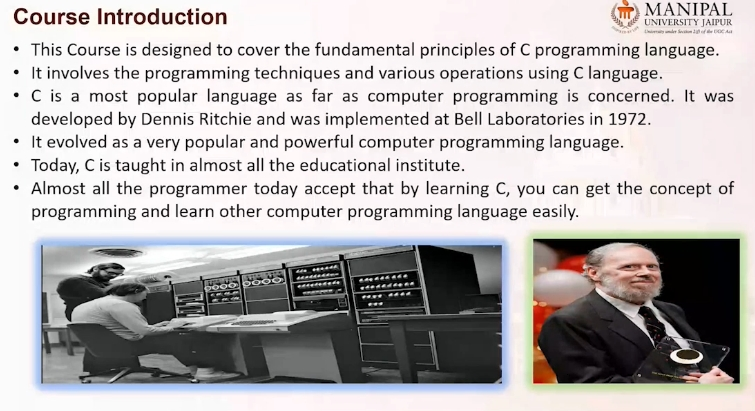

# C-Programming 



- C called middle level programming language 
Programming languages with features of both Low Level and High-Level programming languages are referred to as “Middle Level” programming languages. has features of both low-level and high-level programming languages.


The basic syntax and code structure of both C and C++ are the same. C++ is a general-purpose programming language that was developed as an enhancement of the C language to include object-oriented paradigm. 

#### Course introduction:


### History of Programming Languages:
- The first computer programming language was created in 1883, when a woman named Ada Lovelace worked with Charles Babbage on his very early mechanical computer, the Analytical Engine (It would be able to perform any calculation set before it.). While Babbage was concerned with simply computing numbers, Lovelace saw that the numbers the computer worked with could represent something other than just amounts of things. She wrote an algorithm for the Analytical Engine that was the first of its kind. 
- in 1949 assembly language introduced 
- in 1952 program languages were called autocode. Some consider autocode to be the first compiled computer programming language, meaning that it can be translated directly into machine code using a program called a compiler.
- 1957: Fortran which is a HLL: A computer programming language created by John Backus for complicated scientific, mathematical, and statistical work, Fortran stands for Formula Translation. It is the one of the oldest computer programming languages still used today.
- 1958: Algol: Created by a committee for scientific use, Algol stands for Algorithmic Language. Algol served as a starting point in the development of languages such as Pascal, C, C++, and Java.
- 1959: COBOL: Created by Dr. Grace Murray Hopper as a computer programming language that could run on all brands and types of computers. COBOL stands for COmmon Business Oriented Language. One of the first of the high-level languages, it was put together by a group sponsored by the Department of Defense to develop a common business language.
- 1959: LISP: Created by John McCarthy of MIT, LISP is still in use. It stands for LISt Processing language. It was originally created for artificial intelligence research but today can be used in situations where Ruby or Python are used.
- 1964: BASIC: Developed by John G. Kemeny and Thomas E. Kurtz at Dartmouth College so that students who did not have a strong technical or mathematical understanding could still use computers, A modified version of BASIC was written by Bill Gates and Paul Allen. This was to become the first Microsoft product.
- 1970: Pascal: Developed by Niklaus Wirth, Pascal was named in honor of the French mathematician, physicist, and philosopher Blaise Pascal. It is easy to learn and was originally created as a tool for teaching computer programming. Pascal was the main language used for software development in Apple’s early years.
- 1972: SMALLTALK - It's the first object-oriented programming language
- 1972: C: Developed by Dennis Ritchie at Bell Labs, C is considered by many to be the first high-level language. A high-level computer programming language is closer to human language and more removed from the machine code. C was created so that an operating system called Unix could be used on many different types of computers.
- 1972: SQL: SQL was developed by Donald D. Chamberlin and Raymond F. Boyce at IBM.
- 1978: MATLAB: Developed by Cleve Moler. MATLAB stands for Matrix Laboratory. It is one of the best computer programming languages for writing mathematical programs, can also be used to create two- and three-dimensional graphics.
- 1983: Objective-C: Created by Brad Cox and Tom Love, Objective-C is the main computer programming language used when writing software for macOS and iOS, Apple’s operating systems.
- 1983: C++: C++ is an extension of the C language and was developed by Bjarne Stroustrup. It is one of the most widely used languages in the world. C++ is used in game engines and high-performance software like Adobe Photoshop. Most packaged software is still written in C++.
- 1991: Python: Designed by Guido Van Rossum
- 1991: Visual Basic: Developed by Microsoft, Visual Basic allows programmers to choose and change pre-selected chunks of code in a drag-and-drop fashion through a graphical user interface (GUI).
- 1993: R:  It is mostly used by statisticians and those performing different types of data analysis.
- 1995: Java: Originally called Oak, Java was developed by Sun Microsystems. It was intended for cable boxes and hand-held devices but was later enhanced so it could be used to deliver information on the World Wide Web
- 1995: PHP: Created by Rasmus Lerdorf, PHP is used mostly for Web development and is usually run on Web servers. It originally stood for Personal Home Page. used to build websites and blogs. WordPress, a popular website creation tool
- 1995: Ruby: Ruby was created by Yukihiro “Matz” Matsumoto, who combined parts of his favorite languages to form a new general-purpose computer programming language that can perform many programming tasks. It is popular in Web application development. Ruby code executes more slowly, but it allows for computer programmers to quickly put together and run a program.
- 1995: JavaScript: Created in just 10 days by Brendan Eich, this language is mostly used to enhance many Web browser interactions. Almost every major website uses Javascript. JavaScript was designed in 10 days under pressure from Netscape to quickly deliver a light, breezy scripting language for the web browser.
- 2000: C#: Developed by Microsoft with the goal of combining the computing ability of C++ with the simplicity of Visual Basic, C# is based on C++ and is similar to Java in many aspects. It is used in almost all Microsoft products and is primarily used for developing desktop applications.
- 2003: Scala: Created by Martin Odersky. Scala is a computer programming language that combines functional programming, which is mathematical, with object-oriented programming, which is organized around data that controls access to code. Its compatibility with Java makes it helpful in Android development.
- 2003: Groovy: Developed by James Strachan and Bob McWhirter, Groovy is derived from Java 
- 2009: Go: Go was developed by Google to address problems that can occur in large software systems.  to improve the working environment for programmers so they could write, read, and maintain large software systems more efficiently.
- 2014: Swift: Developed by Apple as a replacement for C, C++, and Objective-C

#### Use cases of different programming languages
> python 
Python is really popular because developers can work really rapidly in it. Python is commonly used for developing websites and software, task automation, data analysis, and data visualization. 

> JAVA 
Java is really popular because it provides not only a robust data abstraction model via it’s object oriented basis, but because it has a reputation of being stable, solid, reliable and “enterprise grade”. You can build big hairy complicated code bases in Java and have them perform robustly (and slowly) for a very long time.

> C++
C++ was sort of a half-step between C and Smalltalk. You have to recall that originally, it was a pre-processor that let you build object-oriented programs, but transpiled to C, then built to running code. If you have ever looked at C++ and wondered why it’s clunky… that’s it. Modern C++ is more or less isomorphic to Java.

> C
C was built to be a high-level portable replacement for assembler. It had ALGOL-like control structures, plus the ability to directly manipulate register use, directly address physical locations in hard memory and I/O controls, and freed the programmer to directly meddle in the data structures by exposing all the pointer arithmetic that actually lives under dimensioned arrays in, well, literally every other programming language.

So in particular if you’re building code all the way down on the hardware, where you have to worry about needing to touch this particular address in that particular way, where you can’t afford to have the language “garbage collect” for performance reasons, where you don’t need a layer of abstraction because you know a priori that the abstraction models built into other languages will actually fuck you up… you write in C.

### Unit 1: Introduction to C programming


Computer understands binary, we use HLL and compiler converts HLL to LLL
```bash
#machine language is made up of binary
Machine language is made up of instructions and data that are all binary numbers.

#differece between machine language and assembly language 
The major difference between machine language and assembly language is that machine language is referred to as a binary language. It can be run on a computer directly. 

While an assembly language is a low-level programming language that must be converted into machine code using software called an assembler

#assembly language instructions are human understandable 
but in order to give instructions to the computer we had to remember bunch of neumonics 

SUB R1, R2
ADD R1, R2

#HLL was created to overcome remembering all these neumonics 
```
> History of C:

- ALGOL created
- ALGOL enhanced and formed BCPL
- Ken Thompson who was working on UNIX then created B language 
- Dennis Rechie developed c-programming in Bell Labs (formerly AT&T Bell Laboratories) in 1972. many of the principles and ideas that he incorporated into the language were taken from earlier programming language B and B’s ancestors BCPL

- the American National Standards Institute (ANSI) set up a committee that further amended and standardized the language. Since then C has been referred to as ANSI Standard C, and it remains popular in the world of UNIX-like operating systems. However now ANSI C is an obselete standard.
- C has been standardized by the American National Standards Institute (ANSI) since 1989 and subsequently by the International Organization for Standardization (ISO). 

> Features of C:


```bash
dyanamic memory allocation - allocate memory during run time. 
```

> Uses of C:
- with C you can develop operating systems and manipulate memory directly. in python I have never heard of a OS written in it
- C is a Systems language, while python is a scripting language. C is a lot more powerful than python, as python was designed as teaching language(kinda like pascal)
- You can literally do anything with C. BIOSes, OSes, apps, games, servers, etc are all written in C. hell even the scripting languages such as python, perl, ruby, php and javascript all have interpreters written in C.
- C is the grand father of the modern programming language. without C there wouldn’t be Java, Javascript, C#, C++, Lua, Python, Ruby, Rust.
- C is very versatile(kind of ties in with reason 3)
finally C allows you to get to the metal(i.e the hardware) more so than the other languages. please consider this chart below


> Most recent version:
C17, the most recent standard for the C programming language, prepared in 2017 and published in June 2018.

> Language processors:

Compilers, interpreters, translate programs written in high-level languages into machine code that a computer understands. And assemblers translate programs written in low-level or assembly language into machine code. 

- assembler
Assembly language uses mnemonics (instructions) like ADD, MUL, MUX, SUB, DIV, MOV and so on. to represent instructions in it are not directly understandable by machine and high-Level language is machine-independent. 
The Assembler is used to translate the program written in Assembly language into machine code. he assembler is basically able to convert these mnemonics in Binary code. Here, these mnemonics also depend upon the architecture of the machine. 

For example, the architecture of intel 8085 and intel 8086 are different.

- intrepretor 
An interpreter takes a source program and runs it line by line, translating each line as it comes to it. Interpreter directly executes instructions written in a programming or scripting language without previously converting them to an object code or machine code.      

Example: Perl, Python and Matlab.

- compiler 
A compiler is a program that converts the entire source code of a programming language into executable machine code for a CPU.  

Examples: C, C++, Java  

> Difference between compiler and intrepretor?


### Simple C Program 
These source code cannot be executed directly by the computer and must be converted into machine language to be executed. To convert HLL( C Language) TO LLL we need a compiler. 
```bash
#C is case-sensitive language 

#header file which includes code for ip/op 
#include<stdio.h>
    #entry point of program 
    int main() 
    {
        #predefined function
        printf('hello world');
        return 0;
    }
```
> Why do we use `int main()` in place of `void main()` ?
- main() is a function 
as per C convention it has a default return type of int, which means it should return int type of value. However some compilers allow to write void main() which means its not returning any value. 

Old compilers like Turbo C allow void main()

> Why do we write `int` before main()?
```bash
#its the syntax: 
int sum()

#return type   protoype  function 
int            sum       ()
```

> variable is a name given to a memory block to hold a value 

```bash
#include<stdio.h>
    int main() 
    {
        #these variables are added to RAM
        int a; #declaration - block assigned in the memory 
        a=6;   #initialisation - assigning value to the variable 
        #we can change the value of variable later on in the program
        printf('%d', a);
        return 0;
    }

```
> constant 


#### Basic structure of C Program 
```bash
#Documentation means specifying extra lines we write for understanding purpose. Software documentation is a way for engineers and programmers to describe their product and the process they used in creating it in formal writing. (optional)

#Link: library function will link the defination to the predefined function in our program
#include<stdio.h>
    #global variables defined here 
    int sum = 30;

    void lunch()
    int main() 
    {
        #define local variables and constants here 
        int sum = 10;
        printf('%d\n', a);
        #functions 
        lunch()
        return 0;
    }

   lunch(){
    printf('biryani');
   }
```
> Tokens in C

- smallest biulding block of the c program. every C program is a collection of tokens (tokens can be either of these: keyword (reserved words), identifier (the names you supply for variables, types, functions, and labels in your program), constant, string, operator, seperator (;), special symbol)

### Unit 2


#### Operator
Operator is a special symbol which tells compiler what operation to perform. 


> Types of Operators:
1. Arithmetic operator

```bash
#include<stdio.h>
    int main() 
    {
        int a = 9, b = 4;
        c= a+ b;
        printf('%d\n', c);

        c= a- b;
        printf('%d\n', c);

        c= a* b;
        printf('%d\n', c);

        c= a/ b;  
        printf('%d\n', c);

        c= a %b;
        printf('%d\n', c);
        
        return 0;
    }
```
2. Relational operator

```bash
#include<stdio.h>
    int main() 
    {
        int a = 5, b=5, c=10;
        
        printf('%d\n', a == b); #1
        printf('%d\n', a == c); #0
        printf('%d\n', a > b);  #0
        printf('%d\n', a < c);  #1
        return 0;
    }

```
3. Logical operator

when we want to combine more than 1 statement 
```bash
#include<stdio.h>
    int main() 
    {
        int a = 11, b=5, c=10;
        if(a>b && a>c) {
           printf('\n a is greater than both');
        } else {
           printf('\n a is not greater than both');
        }
        return 0;
    }
```
- && (LOGICAL ADDITION) 
```bash
0 1 1 0
1 1 0 0 
-------
1 1 1 0
```
- || (LOGICAL MULTIPLICATION)
```bash
0 1 1 0
1 1 0 0 
-------
0 1 0 0 
```
4. Assignment Operator 
assigns value

```bash
#include<stdio.h>
    int main() 
    {
        #create 2 memory blocks in the RAM
        int a = 11, b=5;
        c= a+b;
        #c += a same as c=c+a
        
        printf('%d\n', c);
    
        return 0;
    }
```

5. Bitwise Operator 
Bitwise operator operates at bit / binary level / 0s and 1s

```bash
#include<stdio.h>
    int main() 
    {
        int a = 6, b=4;
        #perform & operator at every bit level 
        printf('%d\n', a&b);

        return 0;
    }
```


> convert decimal to binary 


6. Misc operator 
there are a few other important operators including sizeof and ? : supported by the C Language.


#### Type Specifier 
specifies to the compiler type of value variable is going to hold. each type denotes how much memory is allocted to that memory block.


#### sizeof() operator
sizeof() gives size of the datatype


#### Unary operator


> Difference between operators
```bash
#pre-increement operator - increase value, then assign
#post-increement - first assign, then increase value 
#pre-decrement operator - decrease value, then assign
#post-decrement - first assign, then decrease value 

#include<stdio.h>
    int main() 
    {
        int a = 1, b;
        b = ++a;
        #a=2, b=2

        b = a++;
        #a=2, b=1

        b = --a;
        #a=0, b=0

        b = a--;
        #a=0 , b=1
        printf('%d\n', a);

        return 0;
    }
```
### Precedence Of Operators
Compiler gives preference to which operator would be executed first


- if in an expression all operators have equal precedence then follow associativity giving priorty from LHS to RHS 


#### Ternary Operator / Conditional Operator 


#### Predefined Functions
predefined functions are library functions, whose defination is stored in compiler, to use these functions include the header file.


> conio.h not used is latest compilers 

#### Input-Output

