#### ADVANCED DATABASE MANAGEMENT SYSTEM 

This course is designed to cover the fundamentals of Advanced Database Management System (ADBMS). It guides you to move from real-world problems to the database good design and optimised implementation. It defines the SQL capabilities in the information search process. It provides the understanding of query optimisation, execution, concurrency control, transaction processing and deadlocks. It gives you a broad idea of different types of databases such as OODBMS, distributed databases, ORDBMS, XML database management system, active database, temporal database and video database management system.

> syllabus contents


### File System VS DBMS?
- before DBMS file system was used to access the data. File-based systems typically use storage devices such as a CD-ROM or hard disk to store and organize computer files and the data within with the goal of facilitating easy access.

A traditional file system is inexpensive, ideal for a small system with smaller quantity of parts, very low design efforts, isolated data, and has a simple backup system, but is not secure, has a lack of flexibility and many limitations, and has integrity flaws.
```bash
FILE SYSTEM IS HANDLED BY OS 

Creating drives and storing data in folders in herierchal form is an implementation of file system, it works when plenty of end users from differentt locations aint trying to access it
```
- However if we want a system in which we have many end users accessing data then its not possible to access it via file system on the server. This brings the concept of concurrency if 100 users try to access db at the same time, in case of file system it causes problems. in DBMS concurrent protocols exist which allow multiple users to access the database at the same time. 

- if your searching for a specific 1kb of data belonging to a table from a file system it would retrieve and send the entire 25gb data table instead, unnecesary data reaches the end user which is not efficient. In case of dbms search becomes faster and memory utlisation becomes efficient.

- Moreover DBMS also provides role-based access control which provides different priveledges to different users by providing different login portals for each section.

- DBMS conttains many constraints which ensures that data redundancy is avoided and only unique data is stored.

### STORAGE SOLUTIONS 
The world of big data is getting bigger every day. 

As the volume of data increases exponentially, businesses of all sizes try to capture raw data, process it, and extract insights for competitive decision-making. 

The two main architectures for storage solutions are databases(SQL/ noSQL) and data warehouses. 

Database records data through OLTP process (online transaction process - when a transaction is completed its recorded in DB). 

While databases are designed for transctions, data warehouse is used for analytics and reporting. we could also use database for analytical processing but its extremely slow when it comes to querying large amounts of data, and it could further also slow down the transactional processes.

When we want to perform analytical study on a certain set of data the data is loaded from database to data warehouse via the ETL process. 
```bash
ETL tools enable data integration strategies by allowing companies to gather data from multiple data sources and consolidate it into a single, centralized location through the ETL process:
- EXTRACT data from its original source
- TRANSFORM data by deduplicating it, combining it, and ensuring quality, to then
- LOAD data into the target database
```
The data that is loaded into the data warehouse is very specific to the analysis were performing. for example, if we want to perform an analysis on who exeeded their sale mark within the first year of joining it would only load data relevant to the name and the sales each employee made. 
Data warehousing is used for analytical processing (OLAP - onine analytical process - used to analyze huge amount of data). it processes data extremely fast.

So technically,
Organizations that want to analyze their applications' current and historical data may choose to complement their databases with a data warehouse

Data warehouse cannot be implemented without a database. A data warehouse exists as a layer on top of another database or databases (usually OLTP databases).

data warehouses prioritize SQL databases and are generally incompatible with NoSQL databases.

### Why DBMS?
> structured data - stored in relations 

- ecommerce 
```bash
some e-commerce sellers use a relational database design centered around the following tables: products table, customers table, and orders table.  if you need to list items from a specific category, there must be a database which contains the information about the products and categories.

However some use noSQL because it fits their requirement better 
```
- withdrawing money from ATM
- hospital management system 
- school management system 

- airline management system  

> unstructured data - not stored in relations / tables 
In the modern world of big data, unstructured data is the most abundant. It’s so prolific because unstructured data could be anything: media, imaging, audio, sensor data, text data, and much more. Unstructured simply means that it is datasets (typical large collections of files) that aren’t stored in a structured database format.
- data that doesn’t live in a relational database management system (RDBMS). 
- Unstructured data just happens to be in greater abundance than structured data is.
- Until the advent of object-based storage, most, if not all, of this unstructured data was stored in file-based systems.

**NoSQL databases that better handle unstructured or semi-structured data such as JSON and XML files, that do not easily comply with the relational tabular schema.**

> Examples of unstructured data are:
- Rich media. Media and entertainment data, surveillance data, geo-spatial data, audio, weather data
- Internet of Things (IoT). Sensor data, ticker data
- Analytics. Machine learning, artificial intelligence (AI)

> applications;
-  most big data sources, including Facebook, WhatsApp, twitter etc., have unstructured data.

##### noSQL vs SQL which is better?

Organizations that support data-intensive applications must make many decisions about how to best implement and maintain them. One of the biggest decisions is to determine the best platforms to use for storing and delivering the application data. In the past, most organizations opted for SQL databases because of their ability to protect data and ensure its integrity. But the rise of the internet and cloud technologies—and the proliferation of data that went with them—has caused many organizations to turn to NoSQL databases, in large part because they can better handle the abundance of unstructured and semi-structured data.


#### Unit 1
### What is the difference data and information?
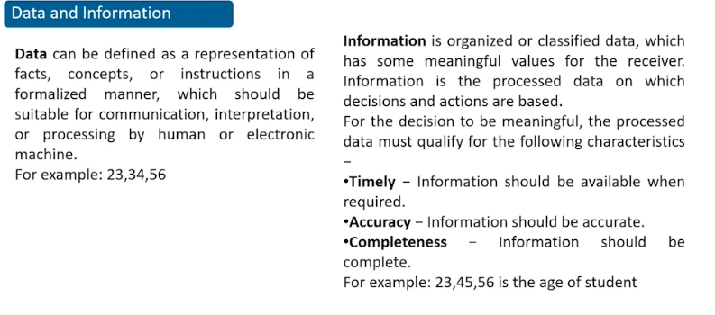
Raw facts and figures which does not have any specific meaning. it can be defined as a representation of facts which can be processed by human or electronic machine.
> Eg: 34, 45

When we say numbers specify the age of a student its called information. Information is organized and classified data. Its the extracted form of data. 

> Eg2: Records of all students (age, name, address) of a university (which includes students of all courses) is data. If we want to extract student data from a particular course then were saying were extracting information, because were extracting a classified data.

When were able to find out certain patterns through the information its called knowledge 

```bash
Data when processed becomes information and informattion when processed becomes knowledge 
```
### What is database?
- Collection of similar / interralated data 

- small databases are stored on file systems 
- large databases are stored on cloud storage or computer clusters.

> Database contains of data, constraints on the data , relationship between data, schema `

----------
> What is cloud storage / utility storage?
- eliminates the need to purchase and manage your own data storage infrastructure by providing a **virtual storage infrastructure** which can be **scaled** to the applications requirment.
- Cloud storage is a cloud computing model that allows users to **save important data or media files** such as documents, photos, videos and other forms of media on remote, t**third-party servers**. 
-  cloud storage is maintained and operated by a **cloud-based service provider**.
-  To ensure the **constant availability of data**, cloud storage systems involve large numbers of data servers. Therefore, if a server requires maintenance or fails, the user can be assured that the data has been moved elsewhere to ensure availability.
-  Cloud services have made it possible for anyone to store digital data and access it from anywhere. This means that cloud storage is essentially a **virtual hard drive**.

> What are types of cloud storage / Deployment cloud?
1. Private cloud storage
- a private cloud storage is set up for the company itself
where cloud data is stored on company's intranet which is protected by company's firewall, its set up by the host company like AWS,  MICROSOFTS'S AZURE, GOOGLE CLOUD 
- its **deployed locally**
- ensures data privacy 
- costly maintainence 
- more customizable 

2. Public cloud storage 
- its **publically available cloud storage** it doesnt belong to a specific organisation / institute.
- its **deployed globally** which is why security and privacy is reduced. 
- its cost efficient 
- **cannot customize the application** as much as we can in private cloud.

3. Hybrid Cloud 
- combination of private and public cloud
- cost efficient and customisable like public cloud 
- data stored on private cloud 
- security like private cloud 

> Cloud Based Services / Cloud Infra services - Delivery Model
These services make software available to users over the internet, usually for a monthly subscription fee.


- Software as a Service (SaaS).
```bash
In order to create a particular resource say an application / website we can hire a third party vendor (SaaS) to create it for us 
```
- Platform as a Service (PaaS).
```bash
If you know how to create the application but dont have the resources like OS, compiler (runtime), infra this can be rented from PaaS
```
- Infrastructure as a Service (IaaS).
```bash
created the webite and you have the primary resources to run it but you dont have the resources (infra) to host it 

Cloud infrastructure refers to the hardware and software components, such as servers, storage, networking, virtualization software, services and management tools, that support the computing requirements of a cloud computing model.
```
-----------
#### What is database Management System?

Used for creating and maintaining databases.
- Defining the database contents by specifying data types, data structures and constraints for data that is going to be stored in the database 
- Constructing the database i.e adding data on DB table 
- Manipulating the database with CRUD commands 
- Sharing a database
When a person in a rail db website buys a ticket concurrently it will update the values on another person viewing the system. 

> Difference between data type and data structure?
A Data type is one of the forms of a variable to which the value can be assigned of a given type only (char, int, varchar).

Data structure is a collection of different data types. It is a way of organizing the data in memory. The various operations that can be performed on a data structure are insertion, deletion, and traversal.

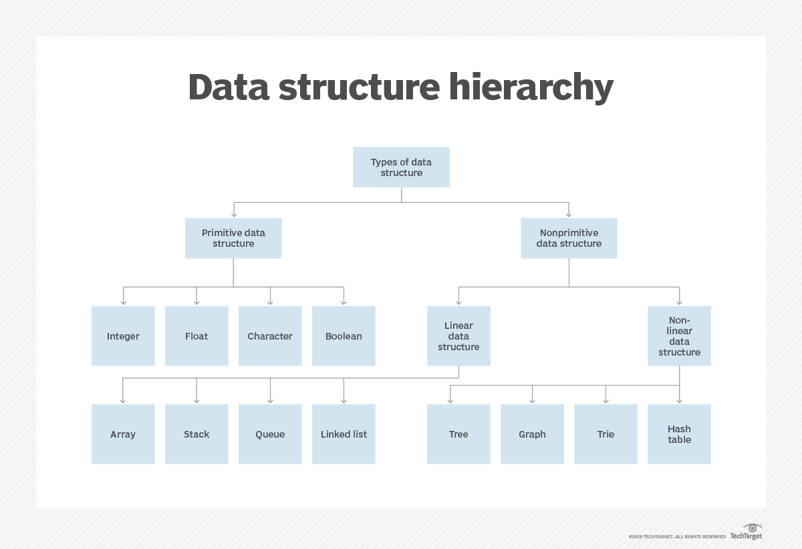
Technically primitive data structures are only identified in C and C++, When asked what are the different types of data structures

Basically, data structures are divided into two categories:
> Linear data structure: Array, Stack, Queue, LL
- The data items are arranged in sequential order, one after the other. 
- It can be traversed on a single run. That is, if we start from the first element, we can traverse all the elements sequentially in a single pass.
> Non-linear data structure: Tree, Graph, Hash table, Trie 
- The data items are arranged in non-sequential order (hierarchical manner).
- It requires multiple runs. That is, if we start from the first element it might not be possible to traverse all the elements in a single pass.

**DBMS enables to capture, store, maintain, change, convert and present data in many different forms and formats**


#### What is the significance of database?

- reduces redundancy - 2 roll no's of the same value cannot exist. Through applying unique constraints for a column name we can prevent redundant values in the same column.
- security can be imposed - we can create seperate logins for admin, student, faculty etc
- provides permission for multiple user interface - many users can view the db concurrently 
- maintains integrity - ensures datas integrity such that whenever a change is made in a table of a databse it will simultanousely show change for all tables linked with that table
- Backup and recovery - we can easily take backup and can recover database 
- provide constant storage for objects of database 
- development time decrease due to dbms 

#### Role of a Database ADMIN
incharge of the entire activities of the DBMS.

Database administrators ensure databases run efficiently. Database administrators and architects create or organize systems to store and secure a variety of data by ensuring that data is availble to the authorized user they ensure this by giving respective username and password priviledges to different levels of department in the organisation. 
```bash
for example, teachers have a different login portal and students have a different one, while the teachers can mark the students grades, the students have the priveledge to only view the changes made by the teacher
```
## Types of Database architecture 
There are mainly three types of DBMS architecture: One Tier Architecture (Single Tier Architecture) Two Tier Architecture. Three Tier Architecture.

#### Types of Databases 


## Database Environment 
The database system environment is comprised of the components that are meant for defining and managing the data that we collect, store, manage and use in the database environment.


### Database ArchtecTure 
A Database Architecture is a representation of DBMS design. It helps to design, develop, implement, and maintain the database management system. A DBMS architecture allows dividing the database system into individual components that can be independently modified, changed, replaced, and altered.

#### 1. 1-TIER DATABASE ARCHITECTURE 
1 Tier Architecture in DBMS is the simplest architecture of Database in which the client, server, and Database all reside on the same machine.
- Personal database - used for an individual user, which can be used for CRUD operations. only a single user can access the database. Hence, the user can use all the resources at all times. All these systems are used for personal usage, such as personal computer experience

> example 
In order to learn the Structure Query Language (SQL), we set up our SQL server and the database on our local system. This SQL server enables us to directly interact with the relational database and execute certain operations without requiring any network connection. This whole setup to learn SQL queries is an example of Single-Tier DBMS architecture.

#### 2. 2-TIER DATABASE ARCHITECTURE

```bash
client has an interface which connects with the database, this interface is an API, for example, JDBC is required to connect JAVA to SQL 
#CLIENT LAYER / PRESENTATION LAYER
  ^
  |
  v
DATABASE SERVER - QUERY PROCESSING (process query made by the client) + PROVIDES DATA #this can cause a lot of load on the server 
#DATA LAYER 
```
- Two-tier database - used in client-server arhictecture where data is stored on the database server. The servers of application layer and database layer are together on the same layer which interact with the client / end user 
```bash
the client is on the first tier. data is stored on the server ie second tier.
```


> PROS:
- Multiple users can use it at the same time. Hence, it can be used in an organization.
- Because of the two independent layers, it's easier to maintain.

> CONS: 
- problems with scalability when number of users is huge and they access any amount of data anytime
- security issues because client is interacting with the database directly which can create a problem.

> Example 
 In a two-tier structure, the server provides the database functionality and it allows the clients to perform operations on the database through a direct internet connection via APIs (Application Programming Interface), for example: JDBC: Java Database Connectivity.

 Consider a situation where you went to a bank to withdraw some cash. After entering the withdrawal amount and the account details on the withdrawal slip, the banker will go through the server-side database via his credential (API call) and will check whether there is enough balance present or not. 

#### 3. 3-TIER DATABASE ARCHITECTURE

```bash
#CLIENT LAYER / PRESENTATION LAYER
CLIENT APPLICATION #users uses this client machine which runs this interface to connect with the database where data is present to end user in GUI form but it reaches the business layer in the form of HLL
  ^
  |
  v
#BUSINESS LAYER / APPLICATION LAYER / WEB SERVER LAYER 
- QUERY PROCESSING 
Query written by the client/user is processed in the business layer 
- query converted to LLL/ machine language 
  ^
  |
  v
#DATA LAYER 
- GIVES DATA FROM THE DATABASE based on the query recieved 
```
multitier database / three-tier database - The server of application layer is in between the database layer and the end user which is responsible for communicating the user’s request to the DBMS system and send the response from the DBMS to the user. The application layer(business logic layer) also processes functional logic, constraint, and rules before passing data to the user or down to the DBMS.
```bash
the overall application framework is split into multiple pieces where the database server is separate from the application server
```
eg of IRCTC website, when end user makes a request to extract some value from their database records, IRCTC makes a request to their database server to provide the data to the end user but the user doesnt know where he data is stored also it provides security since there is a business layer in between client and data layer.

> CONS: system is a bit complex thats why its a bit hard to maintain.
> PROS: its secure and scalable. 

#### Difference between 2-TIER & 3-TIER Architecture models


## What database do big business use?
Small businesses that were dependent on Excel spreadsheets or Microsoft Access to handle their data few years ago want to add more capacity, functionality, and flexibility to there database and applications

#### 4. Enterprise database 
An enterprise database is used by enterprises and large organizations to manage their huge collection of data. Such a database helps companies improve their efficiency. An enterprise database is robust enough to successfully handle the queries of multiple users simultaneously, and is capable of handling a range of 100 to 10,000 users at a time.

- In order for company's to manage their resources they use this ERP software which manages company's data records using enterprise database.

- enterprise database are based on three tier database so ERP software is the presentation layer and data is stored on the data layer

- ERPs are built on top of relational databases, and typically feature a very extensive design: a large number of entities (e.g. products, clients, invoices, etc.), numerous screens and a high degree of configurability.

Typically DBMS of the ERP software is managed by Database administrator, or DBA, who is specialist in particular software product. DBA instructs-system to load, retrieve, or change data in database, as well as tells who can access data and what commands each one can use.
```bash
Enterprise resource planning (ERP) refers to a type of software that organizations use to manage day-to-day business activities such as accounting, procurement, project management, risk management and compliance, and supply chain operations.

A company has different department which has its own application program, also each application has different sets of files and access priveledges. each of these applications comes under the ERP software which helps manage the database
```


> Difference between PDA and smartphone?
- Before smartphones ruled the roost, personal digital assistants (PDAs) walked the Earth which has windows like OS for mobile devices, their concept was to have a hand held mobile. Let's look back at the era of dedicated PDAs: roughly 1992 to 2007.
- PDAS started being discontinued in 2011. they have telephone facilities but couldnt connect to wireless broadband network.

#### Types of Databases 


#### Types of DBMS 
There are types of DBMS based on data models, user, sites, cost and purpose. 


### Based on Data Models 
1. Herierchal Data Model 
- Parent can have n number of children, but child can have only one parent. 


> Cons
- If you already defined a schema and you want to add more children later on, the entire process can become complicated to redefine database. 
- Programming will become difficult since we have more level 

2. Network Data Model 
- each child can have more than one parent and each parent can have more than one child 


> Pros:
- flexibility to move any child with any parent 

> Cons:
- structural reliance - we cannot rely on any parent child structure since any sort of manipulations can be done to those 

3. Relational data model 


- one row in the table is reffered to as tuples and one column in the table is reffered to as attributes 

> Pros:
- duplicate data is removed 
- we can interlink multiple tables with the concept of relation

> Cons:
- We need to scale more databases horizontally to store more data - so hardware expenses are more 

4. Object oriented Model (OODBMS) = OOPS concept + database 


5. Object relational data model = ORDBMS + RELATIONAL DBMS
  

### Based on User 

- single user - A DBMS is a single-user if at most one user at a time can use the system. Single-User DBMSs are mostly restricted to personal computer systems.
- Multi user - if more than one user can use the dbms concurrently 

### Based on No of sites 

> Note: every site / location where database is stored also has an allocated database server which provides data to end user.

1. centralized DBMS 


contains a single database that is stored on one location of the network and multiple systems can access it via internet connection with nodes connected through any computer netork like LAN/WAN 


> Cons:
If any kind of system failure occurs in the centralized system then the entire data will be destroyed.

2. parallel Network DBMS 
sometimes the client server and centralized system is not much efficient to handle huge amount of data with huge transfer rate.


parallel DB system distributes data on different server stored parallely also to improve the performance of data processing each of this server includes multiple resources in parellel like CPU'S and disk(which stores data in defined order) to increase the data trabsfer rate. 
- It also performs many parallelization operation like data loading (performed parallely) and query processing. 


It improves performance of the system and it ensures distributed access of data. Lets take an example for instance, a bank has many branches in multiple cities and countries, how is their database accessed to the end user, its all possible due to parallel database system which creates an *intra communication channel* consisting of CPU + STORAGE + MEMORY. Memory is what your computer uses to store data temporarily, while storage is where you save files permanently.

3. Distributed DBMS 

A distributed database management system (DDBMS) is a centralized software system that manages a distributed database (that is a collection of interconnected databases which is spread across multiple locations via computer network) in a manner as if it were all stored in a single location.
- Homogeneous DBMS - using same software which is scattered in multiple locations from where they are accessing their resources from 
```bash
for example in the manipal student portal, lets say their are different servers for library and for coursera courses, so at the end of the day it seems to the end user as if they are using the same software but each sub-section is allocated to a different database at a different location
```
- Heterogeneous DBMS - different softwares are allocated at different locations and their is an additional software which helps in exchange of data between these locations.


> Difference between centralized and distributed database?

- Its easier to modify systems (i.e add CRUD operations) on distributed database since every interconnected database has a bunch of connected databases but thesee connectd databases are only linked to one interconnected database. so if we modify one of these interconnected db it wont affect the other interconnected database. 
- However its diffifcult to maintain integrity(consistency - data is consistent amongst all databases and can be trusted)

#### Types of DB based on cost 


#### Types of DB based on purpose 


### Database 
> DBMS is intermediate beyween app and dtaabase 
```bash
app ------ DBMS ----- database 
```
## Types of Database 
Based on the type of data: structured data / unstructured data, there are 2 kind of database type: relational/ SQL database and unstructured/ noSQL database 

> Difference between structured data and unstructured data 
IN CHAT APPLICATIONS, we send photos, links etc we use unstructured data -> noSQL -> mongoDB 

#### Relational Database 
When databases started, they started with rdbms. These companies started the rdbms concept, until now most companies use rdbms only, because shifting databases is very cost expensive, because data they contain is huge.
- IBM (ibm DB2  )
- Oracle (mongoDb, mySql, Cassandra)
```bash
#Oracle offers flexible solutions that handle both structured and unstructured data.
```
- microsoft (postgreSQL, microsoft access, SQL server)

> Types of RDBMS technology (STRUCTURED DATA)
- mySQL
- PostgreSQL 
- Oracle DB (used in legcy softwares)
- SQlite 
- microsoft access
- IBM db2
- MS SQL server 

### Difference between SQL and mySQL?
- sql is language used to talk to the database in english language 
`find all users older than 18` 
- mySQL is language used to talk to the database in machine language 
`select * from user > 18`

> Why do we need SQL? 
SQL became a standard in 1986 by ANSI (american national standard institute)
it again became a standard in 1987 by ISO (International organisation for standardization)

To store data securely, perform tons of operations, to manage the database we need SQL. Its just a language used to talk to the database. 
- To work with databases you need to learn query language 
```bash
Tropicana - Oracle
different orange juices - mongoDb, mySql, Cassandra (query languages)
orange juice - sql
```
#### Three Schema Architecture 
Data abstraction - hiding where data is stored from the end user. To acheive data abstraction 3 levels are created;
- external schema - how is data represented / viewed by the end user. 
```bash
faculty has a different view and student has a different view 
```
- conceptual schema - the relationship between all tables is mentioned in here 
```bash
blueprint of the architecture is mentioned here 
```
- physical schema - where is the exact location of the data in the database. DB ADMINS decide the fragmentation of data and where the data should be stored and how it should be stored (centralized vs distributed data storage).

## Unit2: RDBMS & SQL 
> RDBMS 
- data organized in the form of tables 
DB which is made up of tables called relations, which consists of rows called tuples and columns called attributes. 


> terminologies;


### SQL 


### SQL FEATURES


### OPERATORS IN SQL STATEMENTS


### SQL COMMANDS 


#### DDL ( Data Definition Language )


> Difference between `DELETE`, `DROP`, & `TRUNCATE` ?
- DELETE command it is a Data Manipulation Language Command (DML). Delete a **one or more tuples** but the structure remains. we can restore the table by using the “ROLLBACK” command
- DROP command is a Data Definition Language Command (DDL). It is used to **drop** the whole table (**all tuples + structure**)  Here we can’t restore the table by using the “ROLLBACK” command

- TRUNCATE is used to eliminate **all tuples** from the table, but the structure remains. 

Data Definition Language is used to define the database structure or schema. DDL is also used to specify additional properties of the data. Thus, the database system implements integrity constraints that can be tested with minimal overhead. 

> INTEGRITY CONSTRAINT 
DBMS maintains data integrity in order to avoid the wrong information in the database.

- DOMAIN CONSTRAINT 
- ENTITY INTEGRITY CONSTRAINT 
- REFERENTIAL INTEGRITY CONSTRAINT 
- KEY CONSTRAINT 

#### Domain Constraint


#### Entity integrity Constraint


#### Referential Integrity Constraint


#### Key Constraint 


> Difference between `VARCHAR` AND `VARCHAR2` ?
VARCHAR2 is the same as VARCHAR in the oracle database. The main difference is that VARCHAR is ANSI Standard and VARCHAR2 is Oracle standard. It is recommended to not use VARCHAR as Oracle may change its usage in the near future.

#### DML ( Data Manipulation Language )


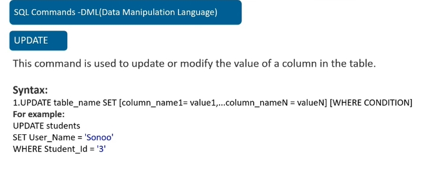


DML deals with SQL commands that deals with the manipulation of data present in the database

> List of DML commands: 
- INSERT : It is used to insert data into a table.
- UPDATE: It is used to update existing data within a table.
- DELETE : It is used to delete records from a database table.

*DCL statements are grouped with DML statements.*

#### DCL ( Data Control Language )
DCL includes commands such as GRANT and REVOKE which mainly deal with the rights, permissions, and other controls of the database system. 


```bash
GRANT: allow specified users to perform specified tasks. It is mostly used to restrict user access to INSERT, DELETE, SELECT, UPDATE, EXECUTE, ALTER or to provide privileges to users data.

REVOKE: cancel previously granted or denied permissions.
```
**In the Oracle database, executing a DCL command issues an implicit commit. Hence, you cannot roll back the command.** 

#### TCL ( Transaction Control Language )

TCL stands for Transaction Control Languages. These commands are used for maintaining consistency of the database and for the management of transactions made by the DML commands. 

Whenever any transaction is made these transactions are temporarily happen in database.So to make the changes permanent, we use TCL commands. 

> The TCL commands are:  
- COMMIT
This command is used to save the data permanently. 
Whenever we perform any of the DML command like -INSERT, DELETE or UPDATE, these can be rollback if the data is not stored permanently. So in order to be at the safer side COMMIT command is used. 
- ROLLBACK
If due to some reasons the data inserted, deleted or updated is not correct, you can rollback the data to a particular savepoint. However you cant rollback once commit is performed.  
- SAVEPOINT
This command is used to save the data at a particular point temporarily, so that whenever needed can be rollback to that particular point. 

```bash
NAME   |   MARKS 
JACK   |   95       #Commit
ROSIE  |   70       #SAVEPOINT A
ZACK   |   76       #SAVEPOINT B 
BRUNO  |   85       #SAVEPOINT C 

#ROLLBACK TO B 
NAME   |   MARKS 
JACK   |   95       #Commit
ROSIE  |   70       #SAVEPOINT A
ZACK   |   76       #SAVEPOINT B 

#ROLLBACK TO A 
NAME   |   MARKS 
JACK   |   95       #Commit
ROSIE  |   70       #SAVEPOINT A


   --- CODE ---
INSERT into STUDENT 
VALUES ('Jack', 95);

Commit;

INSERT into STUDENT 
VALUES ('Rosie', 70);

SAVEPOINT A;

INSERT INTO STUDENT 
VALUES (‘Zack’, 76);

Savepoint B;

INSERT INTO STUDENT 
VALUES (‘Bruno’, 85);

Savepoint C;
```


#### DQL (Data Query Language)
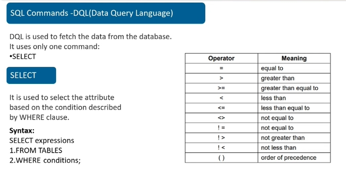


DQL statements are used to query the data contained in schema objects. The DQL Commands goal is to return a schema relation depending on the query supplied to it

### SUBQUERY / NESTED QUERY


### QUERING MULTIPLE RELATIONS 


### AGGREGATE FUNCTIONS IN SQL 


### GROUP BY CLAUSE 


### VIEWS 
display part of the table (tuple) user is interested to view


```bash
show all the content of the dept_id = 101 from the employee table to dept_id = 101 employees
```


### EMBEDDING SQL STATEMENTS 


### TRANSACTION PROCESSING 
> What is Transaction?
Its a set of operations used to perform a logical unit of work. It generally represents change in database.


```bash
USER --- MAIN MEMORY ------ DBMS ------- DB 
           (BUFFER)                      (server)
                                         #server data is stored on  hard disk called server hard disk       

#READ OPERATION - ACCESSING DATA FROM DB
When value is read from DB its stored in buffer before the user can access it 

#WRITE OPERATION - CHANGING DATA AT DB 
When a user writes a value to DB it does calculation and stores it  in buffer before making changes in the DB 

#why DBMS?
For a user to make changes in the DB, he needs a DBMS, in this case were using RDBMS 
```
> Difference between memory Buffer and register and cache?
- memory buffer is found on ram 
- register is in the cpu
- register only holds a piece of info, such as a computer instruction or the storage address of any particular information, etc.
- cache is inserted between cpu and ram 
- cache is used to store data that is repeatedly needed which speeds up overall performance of computer
- From a computer architecture point of view. Definely, register is the fastest. Second is the L1 cache memory


1. Transactions ensure integrity of data 
- if even one of the command in the transaction fails then the rollback command will be invoked and the whole transaction will fail 

- if all the commands in the transaction is executed succesfully only then the transaction will be committed


#### ACID properties 
In order to maintain consistency in a database, before and after the transaction, certain properties are followed. These are called ACID properties. 


1. Atomicity:
By this, we mean that either the entire transaction takes place at once or doesn’t happen at all. There is no midway i.e. transactions do not occur partially. Each transaction is considered as one unit and either runs to completion or is not executed at all. It involves the following two operations. 
- Abort: If a transaction aborts, changes made to the database are not visible. 
- Commit: If a transaction commits, changes made are visible. 
  
Atomicity is also known as the ‘All or nothing rule’. 

Consider the following transaction T consisting of T1 and T2: Transfer of 100 from account X to account Y.  
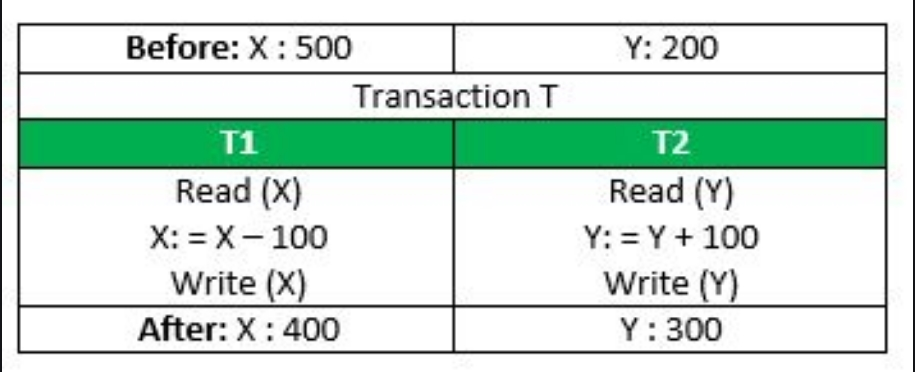
If the transaction fails after completion of T1 but before completion of T2.( say, after write(X) but before write(Y)), then the amount has been deducted from X but not added to Y. This results in an inconsistent database state. Therefore, the transaction must be executed in its entirety in order to ensure the correctness of the database state. 
Inconsistency occurs in case T1 completes but T2 fails. As a result, T is incomplete. 

2. Consistency
This means that integrity constraints must be maintained so that the database is consistent before and after the transaction. It refers to the correctness of a database. Referring to the example above, 
The total amount before and after the transaction must be maintained. 
Total before T occurs = 500 + 200 = 700. 
Total after T occurs = 400 + 300 = 700. 
Therefore, the database is consistent. Inconsistency occurs in case T1 completes but T2 fails. As a result, T is incomplete. 

3. Isolation:
This property ensures that multiple transactions can occur concurrently without leading to the inconsistency of the database state. Transactions occur independently without interference

4. Durability: 
This property ensures that once the transaction has completed execution, the updates and modifications to the database are stored in and written to disk and they persist even if a system failure occurs

### Relational Algebra

```bash
#TYPES OF LANGUAGES: 
PROCEDURAL VS NON PROCEDURAL LANGUAGES 

Procedural languages are used for application and system programming. In procedural languages, the program code is written as a sequence of instructions. User has to specify “what to do” and also “how to do” (step by step procedure)
An example of procedural languages is C, ADA, Pascal, C++, etc.

Non-Procedural languages are used in RDBMS, expert systems, natural language processing, and education.In the non-procedural languages, the user has to specify only “what to do” and not “how to do”. It is also known as an applicative or functional language.
An example of non-procedural languages is Prolog, USP, SQL Scheme, etc.

#Howevr in SQL there is Query language which is used to retrieve information from a database.
Query language is divided into two types as follows −

1. Procedural language
Information is retrieved from the database by specifying the sequence of operations to be performed.

For Example: Relational algebra

Structure Query language (SQL) is based on relational algebra.

2. Non-procedural language
Information is retrieved from the database without specifying the sequence of operation to be performed. Users only specify what information is to be retrieved.

For Example: Relational Calculus

Query by Example (QBE) is based on Relational calculus

Relational calculus is a non-procedural query language in which information is retrieved from the database without specifying sequence of operation to be performed.

Relational calculus is of two types which are as follows −
- Tuple calculus
- Domain calculus
```
#### SELECT operation


#### PROJECT operation 


#### UNION operation


#### INTERSECTION operation


#### SET DIFFERENCE 


#### CARTESIAN PRODUCT 


#### RENAME operation 
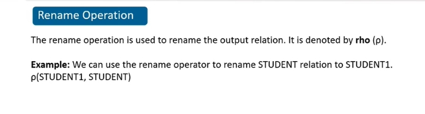

#### JOIN operation


### Difference between relational algebra and SQL 


#### Keys in RDBMS
There are 5 keys in RDBMS:


##### 1. PRIMARY KEY 
 table can have many keys but by convention only one key per table is designated a "primary" one.


##### 2. FOREIGN KEY**
Note: the right table name is called Department 

Foreign key is used to link two tabls in the database through its primary key 


##### 3. CANDIDATE KEY 
They have the potential to uniquely identify a row, they have the capability of becoming primary key, but their candidate key.


There can be multiple Super keys and Candidate keys in a table, but there can be only one Primary key in a table.

##### 4. SUPER KEY 
its possible to have a couple employees having the same name, but not possible to have the same ID. its a combination of id and name (two other keys) - which is called a super key which allows to uniquely identify a record in the database. 


*total number of super keys possible = 128.*

##### 5. COMPOSITE KEY / CONCATENATED KEY 


## UNIT 3:


### Normalization
Data Normalization is a technique that helps in designing the schema of the databsase in an optimal manner such that it reduces redundancy (2 values which exist with the same name) from the database which can be acheived by dividing table into smaller tables and link using relationships


#### Features 


### FUNCTIONAL DEPENDENCY 
it plays a vital role in helping us identify the difference between good and bad database design

- If A and B are two columns / attributes. attribute B (Name / Sal / Mgr) is fully functional dependent on attribute A (ID)


- For one value of A, there is only one value of B. a determinant can have only one dependent. 


- example of not Functional Deficiency 

```bash
#this is not a FD
X tends to Y is true, because for each value of X there is only one value of Y

Y tends to X is false, because for A there are 2 values associated 
X  |  Y
1  |  A
2  |  B
3  |  A
```

> What is entity?
properties of entities are called attributes / columns 

### DATA ANOMOLIES 
flaws in DB (some records are updated not all) are called anomoloies which can be removed through normalisation.


- Anomalies are problems that occur in poorly planned, un-normalized databases. 

##### 1. INSERTION ANAMOLY 

for example, consider a table employee with employee number (which is a primary key), dept number and dept name columns. say we have to insert a record / tuple `NULL - 6 - CIVIL` so there is a dept name named CIVIL but there is no employee assigned to it yet, but we cant insert this record because Employee number value is NULL and employee number attribute is a primary key


##### 2. DELETION ANAMOLY 


If we want to delete the employee number only from the table the entire record will be deleted, which would make us loose the department number and department name from the table


when we delete Sec B course group unecesarily Sonam proffesor would be deleted. i.e deleting one record is impacting another record.
git s
##### 3. UPDATION ANAMOLY 

If we want to update the dept number of IT to 1, then we'll manually have to change it in 2 places, which could lead to human error (data inconsistency) if its forgotten to be changed in a place. 


> Note: IT is present in 2 places, this is called data redundancy / data duplicacy 

So, how would we fix data redundancy? By dividing tables into smaller parts, this is called normalization. Normalisation is a technique to remove anomolies and redundancy of the database.
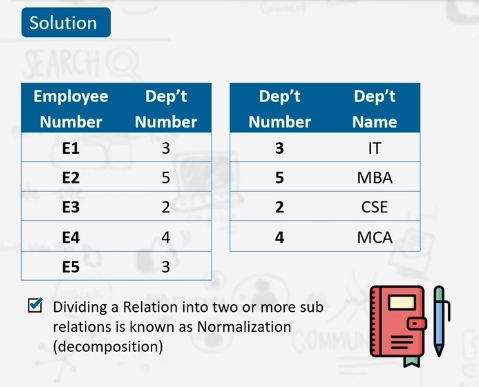

##### INSERTION ANAMOLY FIX 

Now we can easily add `6 CIVIL` in the second table

##### DELETE ANAMOLY FIX 


Now we can delete a record from employee table and it would not delete the dept_number and dept_name from the department table. 

##### UPDATE ANAMOLY FIX 


If we make one change in the row of one table it would update this record in every tabled linked to it. 

### How do we fix anamolies?
Normalization which is implemented in stages called normal form.


##### 1. First Normal Form 
if a tuple has more than one record, then convert it to a table with different records with same names. 


> in this example, this table is not normalized, instead of being dependent on 1 value, it has multiple values / dependents 


> we split the records but this causes redundancy of records. 


##### 2. Second Normal Form**


- course_fee -> non-prime attribute 
- course_no  + std_no -> candidate key
- course no -> subset of candidate key (partial dependency)

> prime vs non-prime attribute?
non-prime attribute is that attribute which belongs to many records.


> an example 


##### 3. Third Normal Form
one column dependent on another column, the other column dependent on primary key


- NON PRIME ATTRIBUTES MUST NOT HAVE TRANSITIVE DEPENDENCY
> transitive dependency 
```bash
A dependent on B 
B dependent on C 
then we can say A dependent on C 

X (super key) -> y (prime attribute)
if Y dependent on X 
```


##### 4. BCNF (BOYCE CODED Normal Form)


##### 5. FOURTH Normal Form


##### 6. FIFTH Normal Form


### DENORMALIZATION 
convert normalized database and convert to non-normalized database to faster access the database. 


## Fully Functional Dependency (FFD)
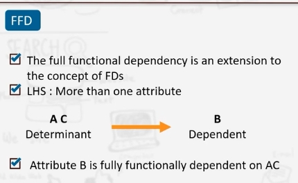


# Unit 4: Query Optimization 

```bash
In procedural languages, the program code is written as a sequence of instructions. User has to specify “what to do” and also “how to do” (

In the non-procedural languages, the user has to specify only “what to do” and not “how to do”. It is also known as an applicative or functional language. 
```

# Query Processing and Optimization 
Query processing refers to how the query is processed in the background. and query optimisation refers to how the query is optimized using SQL compiler which first analyses the SQL query and rewrites the query if required to develop the optimal solution (which executes the query in the minimal optimal time)


Query processing engine converts HLL TO LLL (SQL -> RELATIONAL ALGEBRA)
```bash
SELECTION - WHERE 

PROJECTION - SELECT 
```

> how query processing works internally?

parser checks for syntax and verifies. translator converts hll to lll which returns a relational algebra expression which is then converted to query tree.  the query tree will be executed by the query optimizer.optimizer optimizes the query (select low cost query), statistics for analysing the cost is done from statistic data. execution plan focuses on which part of the query to process (the sequence). data is fetched from the relation in the evaluation engine and give to output. 

## Query Optimization
helps to reduce the time database takes for executing the query which is acheived through optimizer.
```bash
query optimisation chooses the most efficient means for executing the query 

#what are different processes to execute SQL queries
```


### Query Execution Algorithms 
are used for optimizing the query. 
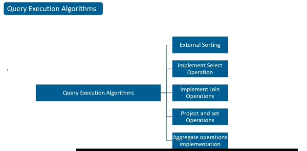

#### QUERY EXECUTION ALGORITHMS 
1. EXTERNAL SORTING 
2. IMPLEMENT SELECT OPERATION 
3. IMPLEMENT JOIN OPERATION 
4. PROJECT AND SET OPERATION 
5. AGGREGATE OPERATIONS IMPLEMENTATION

```bash
For sorting any algorithm use an index on the key thats used for reading the relationship 
```
#### 1. External sorting 
its implemented though sort-merge strategy, which first divides the data / files (which are not in main memory, stored on the disk) into sub files called runs which are read into main memory and result is written back to buffer, then it sorts for which it takes buffer space from the main memory and these runs merges the data into a single file, but this happens in phases / pass. number of runs that can be merged together in each phase is called **degree of merging**.
```bash
number of runs 
size of runs (nR)

#depends on 
number of file blocks (b)
available buffer space (nB) 

#example 
nB = 5
b = 1024

Sorting phase:
then number of runs required in the sorting phase 
nR = b / nB = 1024/5 = 204

Merging phase:
if degree of merging (dM) = 4
number of phases / passes required for merging
                 = 204 / 4 = 51
                 = 51 / 4 = 12
                 = 12 / 4 = 3
```


#### 2. Implement select operation
select helps in retreiving the desired data from the database.


- Linear Search (brute Force) would search the records linearly one after the other until it reaches the end of the table, even if it finds the right record it will continue searching until it reaches the end of the table.
- Binary search divides file into 2 portions and checks within the section. Its search is more faster than linear search since now it has to ony search one half 
- primary index - if in the database you applied hash index on the primary key then it will look for the hash index and check if the data is what the user wants to retrieve by indexing only that one point. But at a point only a single record would be retreived. Its the most cost effiecient since it will directly locate you to that particular record. 
```bash
#difference between hash key and primary key ?
hash key allots index for where to search.

primary key is unique record in the database for each record.
```
#### 3. Implement join operations 

- nested loop join - when we have nested quieries 
```bash
#it checks for the inner loop value with the outer loop value
if T record in inner loop = S record in the outer loop 
t[M] = s[N]
```
- single loop - when we have single queiries 
```bash
#it checks for the hash key value from the table with matches the single quiery from single loop 
```
- sort-merge join - if values are sorted 
- hash join - if records from files are hashed to a single file 


#### 4. project and set operations 
> set difference implementation 


#### 5. aggregrate operations implementation 


### Terminal QS

1. duplicate values 
2. name 
3. T

## HEURISTIC IN QUERY OPTIMIZATION 
```bash
heuristic - best way to take a particular decision
```


> Query Tree is a tree data structure that is used to represent relational algebra expression. In a query tree input relations are represented as leaf nodes and relational algebra operations as internal nodes. the result is at the root node. 

```bash
#relation
book is the leaf node 

#select operation 
the condition price > 200 is the internal node 

#project operation
π ISBN, PRICE 

the final retrieved result  replaces the internal node with the root node 
```


#### Compilation 
after entering the sql query, **parser** checks for syntax and verifies. **translator** converts hll to lll which returns a **relational algebra expression** which is then converted to **query tree** / **logical query plan tree** which generates logical query plan. Physical plan generator then converts **logical query plan to physical query plan** which selects appropriate query execution algorithms for execution and order of execution.


#### Execution
the query tree will be executed by the query optimizer based on the query execution algorithm chosen in the compilation stage. 
optimizer optimizes the query (selects low cost query), statistics for analysing the cost is done from statistic data. execution plan focuses on which part of the query to process (the sequence). data is fetched from the relation in the evaluation engine and give to output. 


# Query Execution 


### Physical Query Plan Operator
Operators describe how SQL Server executes a query or a Data Manipulation Language (DML) statement.


#### Query Processing 
Query Processing is converting the query user entered into a bunch of database operations which are first compiled, then executed


The query optimizer uses operators to build an optimized query plan for the result specified in the query, or to perform the operation specified in the DML statement.

The execution of the query is specifically with the help of relational algebra. 


> Physical plan
A physical plan describes the chosen physical execution plan for a query statement. The optimizer applies various types of rules to rearrange operators and functions into an optimal plan and then converts the logical plan into a physical plan that tells Drill how to execute the query.

#### Reading execution plans 

An index scan or table scan is when SQL Server has to scan the data or index pages to find the appropriate records. 
1. table-scan - entire table is scanned for fetching the result, this causes bottleneck to the performance 
- when the table size is very small, table scan is used 
- bring tuples of the relation from secondary memory (which are stored in block) to main memory.
- gets the block (containing tuple) into the main memory one by one 
2. index-scan - index is going to point to the tuple we want to fetch, so only the particular index is scanned for retreiving the required tuple from the relation. 
- relations are stored in the main memory 
- index-scan scans and returns all the tuples from the relations containing a specific sparse index (assigned to the attributes)

While the relation is scanned its also simultanousely sorted, its sorted using the sort-scan. 

#### One-Pass Algorithm 
One pass Algorithm works on one query at a time. 


Physical plan generator converts **logical query plan to physical query plan** which selects appropriate query execution algorithms for execution and order of execution.

To convert from logical query plan to physical query plan, one pass algorithm is used, based on the technique used for converting, the algorithm is divided into 3 types 
- index based technique 
- sorting basedd technique 
- hashed based technique 

##### 1. Index Based Technique 

There are different methods based on which the indexing would be done 

###### - tuple at a time -> unary operation 
It will perform operation on one tuple at a time 

```bash
read block one at a time (using index scan or table scan)
   |
   v
input buffer 
   |
   v
perform operations 
   |
   v
output buffer 
```
- works on selection and projection operations 

###### - full relation -> unary operation 

```bash
read block one at a time (using index scan or table scan)
         |
     input buffer 
    /          \
seen before    not seen before 
    |           |
    v           v
               #entered into the memory 
dont output    output buffer 

#this method is used for eliminating duplicate values 
```
- works on selection and projection operations 

###### - full relation -> binary operation 

- works on union, intersection, difference, joins and products operations 

### Tuple Based Nested Loop Joins 


We start comparing values starting with the first value on the outer table and iterate over every inner value from the inner table, when match is found SQL server sends it to the output buffer. This process compares every row of outer table with every row of inner table. 


#### Iterator for a Tuple based Nested Loop Join
> iterator is the building block of a query but it executes one query at a time 

- Iterator are used in implementing nested loop joins 
- one single operation for an iteration can be performed 
```bash
R.Open()
- first open database
- it checks for nested query 
- execute the query using nested loop join (uses memory for execution)

R.GetNext()
- repeat loop operation, which will continue searching for records until the tuple user is searching for is not returned 

R.Close()
- releases memory used for executing nested loop join
```
### Two Pass Algorithm based upon Sorting 


if we want to scan data from a table and update data in a table, both would require seperate passes, that means it would require seperate iterations. In case of one pass algorithm only one pass can occur at a time, but in two pass algorithm they can happen together simultanouesly. 


### Practical Session 
#### Starting with virtual Practice lab 

- on the SQL workspace -> credential -> enter credntials from virtual programming lab starting message. 

```bash
mysql-muj-db.czgqnp6ru8hk.ap-south-1.rds.amazonaws.com
DB_2214510132
2214510132
```

#### Starting executing SQL commands 


```bash
Create Table Student
(
Name varchar(10), 
RollNo int Primary key, 
age int, 
Dob date
);

#Insert values into table 
Insert into Student values('Deepika', 102, 34, '1984-04-27');
Insert into Student values('Ankit', 102, 34, '1984-04-27');
```

> 24/12/2022
### IN OPERATOR 


if any values present in DB then it would show the table with only those values 


### BETWEEN OPERATOR 
Shows records between a certain range.


### GROUP BY & HAVING CLAUSE 


select DEPARTMENT,count(WORKER_ID) as NO_OF_WORKER  from Worker  GROUP BY DEPARTMENT order by NO_OF_WORKER DESC;
This is query for the assignment question

### ALTER COMMAND 


### UPDATE COMMAND 


### DELETE COMMAND & DROP COMMAND 


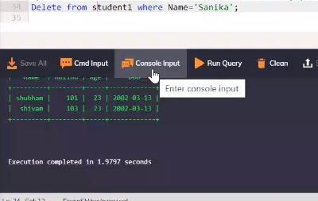

DROP used to drop entire table 


### FOREIGN KEY 

```bash
PRIMARY KEY / REFERENCED TABLE 

FOREIGN KEY / CHILD TABLE - its the primary key of the related table 
```
> an example 
```bash
#supplier
scode, sname, scity, turnover 

#part 
pcode, weight, color, cost 

#supplier_part 
scode, pcode, qty
```


### ORDER BY 
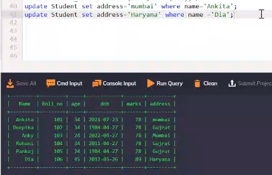


return_type function_name( parameter list )


 {
   body of the function
}
