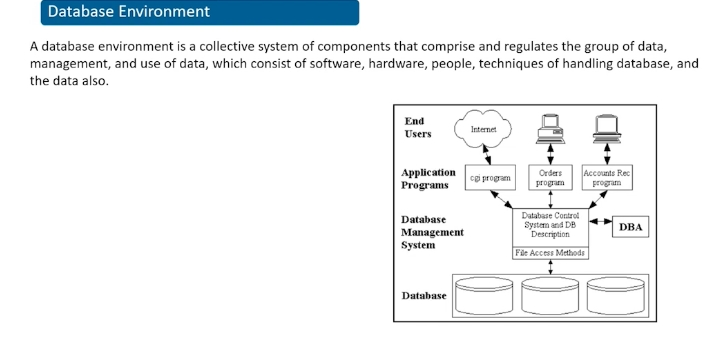
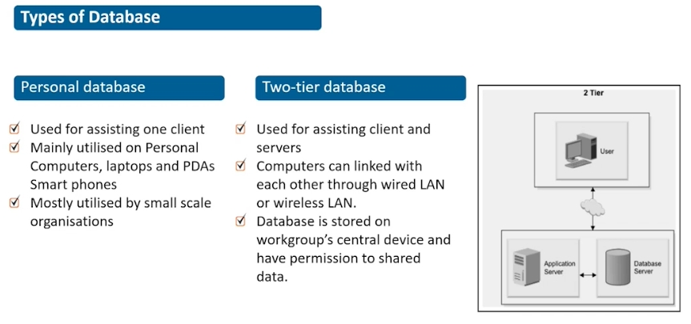

#### ADVANCED DATABASE MANAGEMENT SYSTEM 

This course is designed to cover the fundamentals of Advanced Database Management System (ADBMS). It guides you to move from real-world problems to the database good design and optimised implementation. It defines the SQL capabilities in the information search process. It provides the understanding of query optimisation, execution, concurrency control, transaction processing and deadlocks. It gives you a broad idea of different types of databases such as OODBMS, distributed databases, ORDBMS, XML database management system, active database, temporal database and video database management system.

> syllabus contents


#### Unit 1
### What is the difference data and information?

Raw facts and figures which does not have any specific meaning. it can be defined as a representation of facts which can be processed by human or electronic machine.
> Eg: 34, 45

When we say numbers specify the age of a student its called information. Information is organized and classified data. Its the extracted form of data. 

> Eg2: Records of all students (age, name, address) of a university (which includes students of all courses) is data. If we want to extract student data from a particular course then were saying were extracting information, because were extracting a classified data.

### What is database?

- small databases are stored on file systems 
- large databases are stored on cloud storage or computer clusters.

----------
> What is cloud storage / utility storage?
- eliminates the need to purchase and manage your own data storage infrastructure by providing a **virtual storage infrastructure** which can be **scaled** to the applications requirment.
- Cloud storage is a cloud computing model that allows users to **save important data or media files** such as documents, photos, videos and other forms of media on remote, t**third-party servers**. 
-  cloud storage is maintained and operated by a **cloud-based service provider**.
-  To ensure the **constant availability of data**, cloud storage systems involve large numbers of data servers. Therefore, if a server requires maintenance or fails, the user can be assured that the data has been moved elsewhere to ensure availability.
-  Cloud services have made it possible for anyone to store digital data and access it from anywhere. This means that cloud storage is essentially a **virtual hard drive**.

> What are types of cloud storage / Deployment cloud?
1. Private cloud storage
- a private cloud storage is set up for the company itself
where cloud data is stored on company's intranet which is protected by company's firewall, its set up by the host company like AWS,  MICROSOFTS'S AZURE, GOOGLE CLOUD 
- its **deployed locally**
- ensures data privacy 
- costly maintainence 
- more customizable 

2. Public cloud storage 
- its **publically available cloud storage** it doesnt belong to a specific organisation / institute.
- its **deployed globally** which is why security and privacy is reduced. 
- its cost efficient 
- **cannot customize the application** as much as we can in private cloud.

3. Hybrid Cloud 
- combination of private and public cloud
- cost efficient and customisable like public cloud 
- data stored on private cloud 
- security like private cloud 

> Cloud Based Services / Cloud Infra services - Delivery Model
These services make software available to users over the internet, usually for a monthly subscription fee.


- Software as a Service (SaaS).
```bash
In order to create a particular resource say an application / website we can hire a third party vendor (SaaS) to create it for us 
```
- Platform as a Service (PaaS).
```bash
If you know how to create the application but dont have the resources like OS, compiler (runtime), infra this can be rented from PaaS
```
- Infrastructure as a Service (IaaS).
```bash
created the webite and you have the primary resources to run it but you dont have the resources (infra) to host it 

Cloud infrastructure refers to the hardware and software components, such as servers, storage, networking, virtualization software, services and management tools, that support the computing requirements of a cloud computing model.
```
-----------
#### What is database Management System?

Used for creating and maintaining databases.
- Defining the database contents by specifying data types, data structures and constraints for data that is going to be stored in the database 
- Constructing the database i.e adding data on DB table 
- Manipulating the database with CRUD commands 
- Sharing a database
When a person in a rail db website buys a ticket concurrently it will update the values on another person viewing the system. 

> Difference between data type and data structure?
A Data type is one of the forms of a variable to which the value can be assigned of a given type only (char, int, varchar).

Data structure is a collection of different data types. It is a way of organizing the data in memory. The various operations that can be performed on a data structure are insertion, deletion, and traversal.


Technically primitive data structures are only identified in C and C++, When asked what are the different types of data structures

Basically, data structures are divided into two categories:
> Linear data structure: Array, Stack, Queue, LL
- The data items are arranged in sequential order, one after the other. 
- It can be traversed on a single run. That is, if we start from the first element, we can traverse all the elements sequentially in a single pass.
> Non-linear data structure: Tree, Graph, Hash table, Trie 
- The data items are arranged in non-sequential order (hierarchical manner).
- It requires multiple runs. That is, if we start from the first element it might not be possible to traverse all the elements in a single pass.

#### What is the significance of database?

- reduces redundancy - 2 roll no's of the same value cannot exist. Through applying unique constraints for a column name we can prevent redundant values in the same column.
- security can be imposed - we can create seperate logins for admin, student, faculty etc
- provides permission for multiple user interface - many users can view the db concurrently 
- maintains integrity - ensures datas integrity such that whenever a change is made in a table of a databse it will simultanousely show change for all tables linked with that table
- Backup and recovery - we can easily take backup and can recover database 
- provide constant storage for objects of database 
- development time decrease due to dbms 

#### Database Environment 

- DBA is responsible for doing CRUD operations on the database through the DBMS 
- Application program - its a software interface through which the end user can access the database 

#### Types of Database 
- Personal database 
- Two-tier database - The servers of application layer and database layer are together on the same layer which interact with the client / end user 
```bash
the client is on the first tier. The database server and web application server reside on the same server machine, which is the second tier
```
- multitier database / three-tier database - The server of application layer is in between the database layer and the end user 
```bash
the overall application framework is split into multiple pieces where the database server is separate from the application server
```
eg of IRCTC website, when end user makes a request to extract some value from their database records, IRCTC makes a request to their database server to provide the data to the end user 

- Enterprise database - In order for company's to manage their resources they use this ERP software which manages company's data records using enterprise database 
```bash
Enterprise resource planning (ERP) refers to a type of software that organizations use to manage day-to-day business activities such as accounting, procurement, project management, risk management and compliance, and supply chain operations.

ERP - software thrugh which companies manage their resources 
```



> Difference between PDA and smartphone?
- Before smartphones ruled the roost, personal digital assistants (PDAs) walked the Earth which has windows like OS for mobile devices, their concept was to have a hand held mobile. Let's look back at the era of dedicated PDAs: roughly 1992 to 2007.
- PDAS started being discontinued in 2011. they have telephone facilities but couldnt connect to wireless broadband network.

> What is data warehousing?
A database stores the current data required to power an application. A data warehouse stores current and historical data.
data warehousing is the process of collecting all organizational data into one place. 

#### Types of DBMS 
There are types of DBMS based on data models, user, sites, cost and purpose. 


### Based on Data Models 
1. Herierchal Data Model 
- Parent can have n number of children, but child can have only one parent. 


> Cons
- If you already defined a schema and you want to add more children later on, the entire process can become complicated to redefine database. 
- Programming will become difficult since we have more level 

2. Network Data Model 
- each child can have more than one parent and each parent can have more than one child 


> Pros:
- flexibility to move any child with any parent 

> Cons:
- structural reliance - we cannot rely on any parent child structure since any sort of manipulations can be done to those 

3. Relational data model 

- one row in the table is reffered to as tuples and one column in the table is reffered to as attributes 

> Pros:
- duplicate data is removed 
- we can interlink multiple tables with the concept of relation

> Cons:
- We need to scale more databases horizontally to store more data - so hardware expenses are more 

4. Object oriented Model (OODBMS) = OOPS concept + database 


5. Object relational data model = OOODBMS + RELATIONAL DBMS
  


### Based on User 

- single user - A DBMS is a single-user if at most one user at a time can use the system. Single-User DBMSs are mostly restricted to personal computer systems.
- Multi user - if more than one user can use the dbms concurrently 

### Based on No of sites 

> Note: every site / location where database is stored also has an allocated database server which provides data to end user.

1. centralized DBMS 

contains a single database that is stored on one location of the network and multiple systems can access it via internet connection with nodes connected through any computer netork like LAN/WAN 

> Cons:
If any kind of system failure occurs in the centralized system then the entire data will be destroyed.

2. parallel Network DBMS 
sometimes the client server and centralized system is not much efficient to handle huge amount of data with huge transfer rate.


parallel DB system distributes data on different server stored parallely also to improve the performance of data processing each of this server includes multiple resources in parellel like CPU'S and disk(which stores data in defined order) to increase the data trabsfer rate. 
  - It also performs many parallelization operation like data loading (performed parallely) and query processing. 


It improves performance of the system and it ensures distributed access of data. Lets take an example for instance, a bank has many branches in multiple cities and countries, how is their database accessed to the end user, its all possible due to parallel database system which creates an *intra communication channel* consisting of CPU + STORAGE + MEMORY. Memory is what your computer uses to store data temporarily, while storage is where you save files permanently.

3. Distributed DBMS 

A distributed database management system (DDBMS) is a centralized software system that manages a distributed database (that is a collection of interconnected databases which is spread across multiple locations via computer network) in a manner as if it were all stored in a single location.
- Homogeneous DBMS - using same software which is scattered in multiple locations from where they are accessing their resources from 
```bash
for example in the manipal student portal, lets say their are different servers for library and for coursera courses, so at the end of the day it seems to the end user as if they are using the same software but each sub-section is allocated to a different database at a different location
```
- Heterogeneous DBMS - different softwares are allocated at different locations and their is an additional software which helps in exchange of data between these locations.

> Difference between centralized and distributed database?

- Its easier to modify systems (i.e add CRUD operations) on distributed database since every interconnected database has a bunch of connected databases but thesee connectd databases are only linked to one interconnected database. so if we modify one of these interconnected db it wont affect the other interconnected database. 
- However its diffifcult to maintain integrity(consistency - data is consistent amongst all databases and can be trusted)

#### Types of DB based on cost 


#### Types of DB based on purpose 


### Database 
> DBMS is intermediate beyween app and dtaabase 
```bash
app ------ DBMS ----- database 
```
## Types of Database 
Based on the type of data: structured data / unstructured data, there are 2 kind of database type: relational/ SQL database and unstructured/ noSQL database 

> Difference between structured data and unstructured data 
IN CHAT APPLICATIONS, we send photos, links etc we use unstructured data -> noSQL -> mongoDB 

#### Relational Database 
When databases started, they started with rdbms. These companies started the rdbms concept, until now most companies use rdbms only, because shifting databases is very cost expensive, because data they contain is huge.
- IBM, BB2, Oracle, mySQL, microsoftExcel, tsendra

> Types of RDBMS technology (STRUCTURED DATA)
- mySQL
- PostgreSQL 
- Oracle DB
- SQlite 

### Difference between SQL and mySQL?
- sql is language used to talk to the database in english language 
`find all users older than 18` 
- mySQL is language used to talk to the database in machine language 
`select * from user > 18`

> Why do we need SQL? 
SQL became a standard in 1986 by ANSI (american national standard institute)
it again became a standard in 1987 by ISO (International organisation for standardization)

To store data securely, perform tons of operations, to manage the database we need SQL. Its just a language used to talk to the database. 
- To work with databases you need to learn query language 
```bash
Tropicana - Oracle
different orange juices - mongoDb, mySql, Cassandra (query languages)
orange juice - sql
```

## Unit2: RDBMS & SQL 
> RDBMS 
- data organized in the form of tables 
DB which is made up of tables called relations, which consists of rows called tuples and columns called attributes. 


### SQL 


> Difference between `VARCHAR` AND `VARCHAR2` ?
VARCHAR2 is the same as VARCHAR in the oracle database. The main difference is that VARCHAR is ANSI Standard and VARCHAR2 is Oracle standard. It is recommended to not use VARCHAR as Oracle may change its usage in the near future.

### SQL COMMANDS 


#### DDL ( Data Definition Language )


> Difference between `DELETE`, `DROP`, & `TRUNCATE` ?
- DELETE command it is a Data Manipulation Language Command (DML). Delete a **one or more tuples** but the structure remains. we can restore the table by using the “ROLLBACK” command
- DROP command is a Data Definition Language Command (DDL). It is used to **drop** the whole table (**all tuples + structure**)  Here we can’t restore the table by using the “ROLLBACK” command
- TRUNCATE is used to eliminate **all tuples** from the table, but the structure remains. 

Data Definition Language is used to define the database structure or schema. DDL is also used to specify additional properties of the data. Thus, the database system implements integrity constraints that can be tested with minimal overhead. 
> INTEGRITY CONSTRAINT 
- DOMAIN CONSTRAINT 
- ENTITY INTEGRITY CONSTRAINT 
- REFERENTIAL INTEGRITY CONSTRAINT 
- KEY CONSTRAINT 


#### DML ( Data Manipulation Language )


> List of DML commands: 
- INSERT : It is used to insert data into a table.
- UPDATE: It is used to update existing data within a table.
- DELETE : It is used to delete records from a database table.

#### DCL ( Data Control Language )


```bash
GRANT: allow specified users to perform specified tasks.
REVOKE: cancel previously granted or denied permissions.
```
**In the Oracle database, executing a DCL command issues an implicit commit. Hence, you cannot roll back the command.** 

#### TCL ( Transaction Control Language )

TCL stands for Transaction Control Languages. These commands are used for maintaining consistency of the database and for the management of transactions made by the DML commands. 

Whenever any transaction is made these transactions are temporarily happen in database.So to make the changes permanent, we use TCL commands. 

> The TCL commands are:  
- COMMIT
This command is used to save the data permanently. 
Whenever we perform any of the DML command like -INSERT, DELETE or UPDATE, these can be rollback if the data is not stored permanently. So in order to be at the safer side COMMIT command is used. 
- ROLLBACK
If due to some reasons the data inserted, deleted or updated is not correct, you can rollback the data to a particular savepoint. However you cant rollback once commit is performed.  
- SAVEPOINT
This command is used to save the data at a particular point temporarily, so that whenever needed can be rollback to that particular point. 

```bash
NAME   |   MARKS 
JACK   |   95       #Commit
ROSIE  |   70       #SAVEPOINT A
ZACK   |   76       #SAVEPOINT B 
BRUNO  |   85       #SAVEPOINT C 

#ROLLBACK TO B 
NAME   |   MARKS 
JACK   |   95       #Commit
ROSIE  |   70       #SAVEPOINT A
ZACK   |   76       #SAVEPOINT B 

#ROLLBACK TO A 
NAME   |   MARKS 
JACK   |   95       #Commit
ROSIE  |   70       #SAVEPOINT A


   --- CODE ---
INSERT into STUDENT 
VALUES ('Jack', 95);

Commit;

INSERT into STUDENT 
VALUES ('Rosie', 70);

SAVEPOINT A;

INSERT INTO STUDENT 
VALUES (‘Zack’, 76);

Savepoint B;

INSERT INTO STUDENT 
VALUES (‘Bruno’, 85);

Savepoint C;
```


