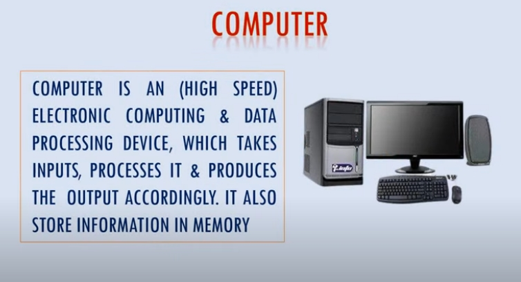
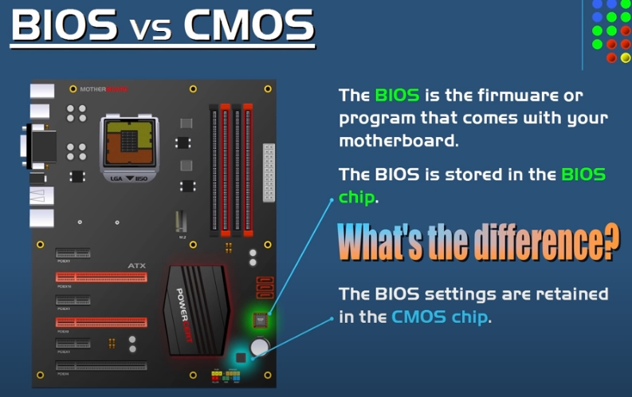
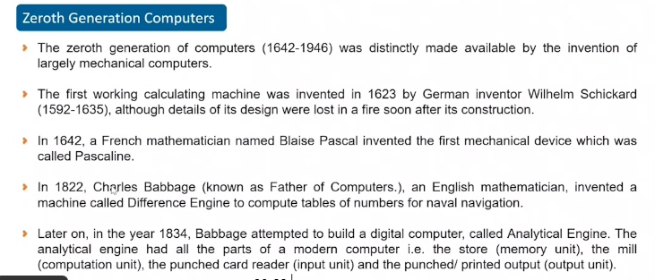
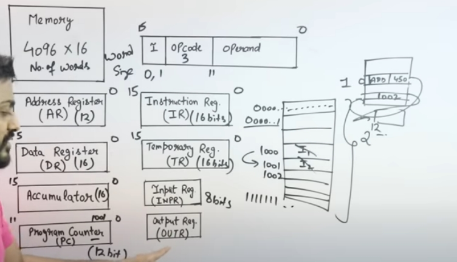

### Computer Architecture


Computer is a set of hardware comppnents which are interconnected to each other. 

Computer architecture shows how instructions are executed on a micro level 

> What is a program 
Program is a set of instructions required to communicate with the computer. 

> Computer architecture helps in?
When we write a program how are they executed on a hardware level. 

> How does computer understand programs?
Computer understands machine language. Humans understand HLL. Compiler directly converts HLL into LLL(machine code/object code)


> What is computer architecture?
Architecture is an abstract, logical, blueprint of what to do, in order to execute this blueprint we need a bunch of hardware interconnected in a specific design created through computer architecture.

> Important topics 


##### Computer Hardware 
> Types of computer hardware 





1. Input devices - devices through which we can give data to computer
- keyboard, joystick
- stylus / light pen is a light-sensitive computer input device
- bar code / QR code reader
- web camera 
- OCR (optical code reader - its used to scan text and convert them into readable text)
- MICR (Magnetic ink card reader) - read banks code number

- OMR (optical mark reader) - for checking marks made by pen in MCQ exams 

2. Output devices - for fetching data from computer 
- monitor 

- CRT (cathode ray tube)

- printer 


While laser printers use static electricity and heat to fuse toner to pages. Plotters do neither – historically, they used an actual pen to draw the output. This pen was attached to a metal arm which moved according to a set of hyper-accurate coordinates given by a computer running CAD software.


- headset (speakers + microphone combo)
- projector 

3. processing devices - for processing the data that we input through input devices.


The hard drive is the component that stores your data. You'll often see the term “hard drive” abbreviated to “HDD.”

Hard drives can be external (secondary) or internal (primary). While internal hard drives have their benefits and limitations (HDD is internal hard drive), you can buy hard disks online for easy external use. 

> There are three different kinds of external hard drives: SATA, SSD and NVMe. 
- Serial Advanced Technology Attachment (SATA) is an older SSD interface designed specifically for storage, with speeds up to 6 Gbps.
- SSD stands for Solid State Drive. These disks don't have any moving parts. Instead, all of the data is stored on non-volatile flash memory. That means that there isn't a needle that has to move to read or write data and that they are significantly faster than SATA drives. SSD drives range from about 120 GB to 2 TB, and are about 2-4 times the price of a SATA hard drive of the same size. Since there are no moving parts, these drives are also a lot more durable
- Released in 2013, Non-Volatile Memory Express, or NVMe, is a type of SSD that's attached to a PCI Express (PCIe) slot on a main board. These slots were originally designed for graphics cards, so they are incredibly fast. Speeds on NVMe drives can reach an interface rate of 32 Gb/s with a throughput of 3.9 GB/s. That can be very useful if you are doing something that needs a lot of disk throughput, like gaming or high-resolution video editing.


An SD card is a memory card that can be inserted into a device in order to increase the device's available storage.   SD, is a proprietary non-volatile flash memory card format developed by the SD Association (SDA) for use in portable devices.
```bash
memory card:
There are many kinds of memory cards, and one of them is the SD card. There’s also the CF card, the MMC card, etc.,
The differences between an SD card and a different kind of card like the MMC or the CF cards are generally the shape, the size, the contacts, read and write speed, and storage capacity.
```

> Can we use mobile SD card in laptop?
While your PC desktop or laptop might have an SD card reader already built in, it may not have a built-in microSD card reader. If it doesn't, you will need a microSD memory card adapter. Some card readers will not accept microSD cards because they are too small.


> Which is better CD or DVD or blueray?
 people use CD's to store music, DVD to store standard definition movies, and Blu-ray to store high definition videos.

 > comparing CD's with older audio formats.
`CDs > vinyl > cassettes` 
vinyl was the main vehicle for the commercial distribution of pop music from the 1950s until the 1980s and 1990s when it was largely replaced by the compact disc (CD).


> Are there external RAM's?
Most of the laptops usually have an extra RAM slot where you can plug the extra RAM module. If you don't have an extra RAM slot, you can remove the existing RAM and replace it with a higher capacity RAM, but choose the Ram that your laptop supports i.e. DDR3, DDR4, DDR5 

you can find out if your laptop supports RAM extension by heading to task manager, head over to performance and check in slots info if any slots are empty, in this case both the slots are occupied. 


BIOS gets power from SMPS when computer is on and after shutdown computer it gets from CMOS battery.
```bash
SMPS is a PSU (power supply unit) and is usually used in computers to change the voltage to the appropriate range for the computer. It converts AC Voltage to DC Voltage.

Electric current flows in two ways as an alternating current (AC) or direct current (DC). The main difference between AC and DC lies in the direction in which the electrons flow. In DC, the electrons flow steadily in a single direction, while electrons keep switching directions, going forward and then backwards in AC.
```


> What is VGA cable?
A video graphics array (VGA) cable is a type of computer cable that carries visual display data from the CPU to the monitor.

A VGA cable (video graphics array), however, is an older standard that is only capable of carrying a video signal unlike HDMI which is capable of carrying both audio and video signals.

DVI is a considerably newer connection type (that functions same as VGA used for video connection) that transfers digital signals while VGA is older and transfers analog signals

### Computer Components 
> Types of computer memory?


> Components of motherboard / system board / circuit board 
to coordinate all devices motherboard is used.

The motherboard serves as a single platform to connect all of the parts of a computer together. It connects the CPU, memory, hard drives, optical drives, video card, sound card, and other ports and expansion cards directly or via cables. It can be considered as the backbone of a computer.


- CPU port / cpu socket(processor - intel (aded externally))
- north bridge - to cool the chip below 
- south bridge 
- *green port* - mouse port 
- *purple port* - keyboard port 
```bash
Note: Before seperate ports were used for mouse(green port) and keyboard (purple port), now we use usb ports to insert these peripherals.
```

- *serial port* (VGA port) - like hdmi but used for video output. VGA cables carry an analog signal as opposed to a digital signal (ones and zeroes). Using higher frequencies, it's possible to reach a relatively high range of video resolutions. However, video quality directly responds to cable quality, and doubly so on higher resolutions. Due to this, the quality of a VGA image can variate notable across different makes of cables.
- *DVI* (Digital Visual Interface) connector : It is used to send digital information from a computer to a digital display, such as a flat-panel LCD monitor. (basically an advanced version of VGA)
- *HDMI port* - :HDMI is a digital interface for transmitting audio and video data in a single cable.
-  DisplayPort - transfer audio and video signals,but is superior to HDMI
- parralel port - used for connecting printer and scanner before, but now usb connections have replaced this port.
- *USB port* - used for connecting external pentdrive or SD card 
- LAN cable port - used for connecting ethernet cable for accesing internet over the network 

- *Analog Audio port*- for headphones / mic 
- CMOS battery - The CMOS battery powers the BIOS firmware in your laptop [2]. BIOS needs to remain operational even when your computer isn't plugged into a power source. BIOS (basic input/output system) is the program a computer's microprocessor uses to start the computer system after it is powered on

- BIOS chip (contains all drivers required for motherboard to function)
Bios is stored on the bios chip (non volatile - retaining data even when there is no power supply) which is a ROM or flash drive chip.

All BIOS setting are retained in the CMOS chip which includes date and time, boot device priority, hardware setting  stores in CMOS chip (volatile chip - memory lost when power is switched off). Important setting that are require for BIOS are stored in CMOS 

CMOS is a memory chip that holds configuration settings and is supported by the onboard battery called CMOS battery (since cmos chip is volatile it needs to consistently be powered (even when comp is switched off) to maintain its settings which is acheived through CMOS battery)

BIOS gets power from SMPS when computer is on and after shutdown computer it gets from CMOS battery.
```bash
SMPS is a PSU (power supply unit) and is usually used in computers to change the voltage to the appropriate range for the computer.
```
- floppy port - to add floppy disks. 
```bash
- Magnetic tape reels 
- punched paper tape reels 
- punched cards 
- floppy disk 
- ZIP drives 
- CDs (CD-ROM and CD-R/RW)
- DVD
- flash drives / pentdrives / usb drives

floppy disk was eventually made obsolete. Many point to 2011 as the year the floppy disk died. That was when SONY stopped making them altogether.
```
- PCI slot - used to add network hardware (router, hubs switches, brudges), sound / video cards, NIC card
```bash
A video card (also called a display card, graphics card, display adapter, or graphics adapter) is an expansion card which generates a feed of output images to a display device (such as a computer monitor).
The graphics card should go into the first PCI Express x16 slot. However if you want to add an additional graphics card then use the AGP slot 

A sound card (also referred to as an audio card) is a peripheral device that attaches to the PCI slo t on a motherboard to enable the computer to input, process, and deliver sound.

the PCIE slot is for Graphics cards, sound cards, wifi cards, and pretty much anything.

Typically you want to put graphics cards in the highest pcie X16 slot
```
```bash
A network interface card (NIC) also known as an Ethernet Card or Network Adapter, a hardware component in the form of a chip or a circuit board enables your computer to connect to a network through a wireless like wifi or wired connection via an ethernet cable.. 

Most new computers today have NIC cards built into the motherboard, so a separate LAN card is not needed.

The NIC provides the hardware interface between a computer and a network.
```

- AGP slot - used for adding extra graphic card 
```bash
An Accelerated Graphics Port (AGP) is a point to point channel that is used for high-speed video output.

AGP makes multiple requests for data during a bus or memory access, while PCI makes one request, and does not make another until the data it requested has been transferred
```
- heat sink - to get rid of unwanted heat from the cpu 
- memory slot - used for adding RAM 
```bash
SD RAM 
DDR
DDR II
DDR III
DDR IV
```
- power connector - Power connectors act as the vital link between a device and its source of power. used to power up the PC.
- SATA port - its used to connect external and internal hardrives to the motherboard. before IDE (integrated drive electronics) would be used, which is now replaced by SATA port.
- capacitors (the cylinders)
- resistors (the small thingies with lines)
- IC (the little chips on the motherboard)

> Difference between RAM & ROM 
ROM is non-volatile memory, which means the information is permanently stored on the chip. The memory does not depend on an electric current to save data, instead, data is written to individual cells using binary code. Non-volatile memory is used for parts of the computer that do not change, such as the initial boot-up portion of the software, or the firmware instructions that make your printer run. Turning off the computer does not have any effect on ROM. Non-volatile memory cannot be changed by users.

RAM is volatile memory, which means that the information temporarily stored in the module is erased when you restart or shut down your computer. Because the information is stored electrically on transistors, when there is no electric current, the data disappears. Each time you request a file or information, it is retrieved either from the computer's storage disk or the internet. The data is stored in RAM, so each time you switch from one program or page to another, the information is instantly available. When the computer is shut down, the memory is cleared until the process begins again. Volatile memory can be changed, upgraded, or expanded easily by users.

> How does system boot?
every time you start or restart computer booting happens, which is the process by which the os is loaded onto the monitor. 
- SMPS needs to work to supply power to the motherboard 
- BIOS, CPU & RAM must be in working condition
- POST (POWER ON SELF TEST) - bios power on all the required external hardware devices (excluding printer) and checks if it works, if even one hardware component not in working condition then it shows an error message, this is accomplished by BIOS and microprocessor in the motherboard. 
```bash
The processor, also known as the CPU, provides the instructions and processing power the computer needs to do its work. The more powerful and updated your processor, the faster your computer can complete its tasks.

Many admins use CPU and microprocessor interchangeably, but the reality is that while a CPU is essentially a microprocessor, not all microprocessors are CPUs.
```
- checks for a booting device (optical disk drive in case the os is not configured in the system yet or storage drive / hard disk drive, it find for os boot files) in the BIOS to load the OS onto the computers RAM.  it will pass control to the operating system. This is called Booting.

boot files that are required to be in 100% working condition for successful loading of the OS 
- command.Com 
- MS-DOS.Sys
- IO.Sys

When we power on a computer, the CPU approaches the BIOS to find out all Input-Output devices and to look over if all hardware connections are properly functioning. BIOS is the one which loads the operating system in to the computer memory, thus completing the booting process.
```bash
BIOS is a part of the motherboard. 

It is stored in the permanent memory called non-volatile Read-only Memory or Erasable Programmable Read-only Memory (EPROM) chip or Flash Memory on the Motherboard of a computer. 

EPROM and Flash memory is used to upgrade the BIOS program as we can change the contents of EPROM and Flash memory.

Flash memory can keep stored data even when power is off.  Flash memory was developed from EEPROM (electronically erasable programmable read-only memory).
```
> What is UEFI (unified extensible firmware interface)?
Newer type of BIOS.
- UEFI has several pros over old BIOS. It has a user friendly GUI interface, it also has a built in feature called secure boot which helps to stop malicious software 

> Accesing wifi through a dongle 
its used when there is no WiFi, or the WiFi is just not good enough. 
- alternative to mobile data 
if you are an individual looking to save money, dongles are a much better option for you. A wifi dongle is a small USB stick that allows you to access online services without needing to connect to Wi-Fi.  For someone on the move, a dongle is the best choice. However, for the best internet speed, go with a Wi-Fi router.
- for improving performance 
A USB WiFi adapter overrides the computer's built-in wireless functionality, giving you a faster, more reliable connection to your available network signals through the USB port instead.

#### Difference between low-level language, assembly language and high level language 
1. Low level language:
Machine language is the low-level programming language. It can only be represented by 0s and 1s. Earlier when we have to create pictures or show data on the screen of the computer then it is very difficult to draw using only binary digits(0s and 1s).For example: To write 120 in the computer system its representation is 1111000. So it is very difficult to learn. To overcome this problem the assembly language is invented.

2. Assembly level language:
Assembly language is the more than low level and less than high-level language so it is intermediary language. Assembly languages use numbers, symbols, and abbreviations instead of 0s and 1. It needs an assembler for conversion to LLL. 

It is a low-level language that allows users to write a program using alphanumeric mnemonic codes, instead of numeric code for a set of instructions examples of large assembly language programs from this time are IBM PC DOS.

3. High-level language :
It is a machine-independent language. It enables a user to write a program in a language that resembles English words and familiar mathematical symbols, COBOL was the first high-level language. Examples of high-level language are python,c#, etc.

It needs a compiler to convert from HLL to LLL.

> Evolution of computer architecture 




#### How to build a PC?
1. power cable is attached to the SMPS 

2. If your system has an external graphics card attached then connect through this yellow port 

- if your system has internal graphics card in the CPU, then attach to that, second priorty. 
- VGA (video graphics adapter) cable one end attached to monitor, other end CPU

3. Attach all peripheral devices like keyboard, mouse through USB 

4. other ports

- *green port* - mouse port 
- *purple port* - keyboard port 
- *red port* - mic 
- *green port* - headphone
5. Attach LAN cable / RJ-45 connector through the ethernet port in the CPU


> How to assemble the motherboard.
- Tip: Open the CPU cabinet screws from the SMPS battery side, you'll notice hard disk, motherboard, SMPS and optical DVD drive on 4 corners.

```bash
A SATA cable connects motherboard to mass storage devices like optical drives, hard disk drives, and solid-state drives.
```
- connect SATA cable from HDD to motherboard, infact dependendng on the number of sata ports yiou hav you can increase harddrives

- connect SATA power cable from HDD to SMPS
- connect SATA cable from SMPS to motherboard 
- connect SATA cable from motherboard to optical drive
- connect ATX power connector (has pin customisation) from motherboard to SMPS

- connect 12v power connector from SMPS to usb 1 and SMPS to usb 2, and SMPS to front audio
- connect 12v power conector  from motherboard to smps
- On the motherboard, Add processor in cpu slot, the cooling fan will be embedded on top of it (make sure the fan is compatible), then connect CPU fan to motherboard with a motherboard fan connector 

- the cpu's power button is related to the SW pin (x4 wires) in the motherboaard found on the front panel which is connected to a part of the 12v power connector originating from the SMPS

 ```bash
 #add it in the app panel on the mother board
- power SW - powers on pc
- power led - The LED power light, which indicates when the computer is on, off, or in Standby.
- reset SW - reset the pc 
- HDD led  - This indicator is the light that flashes as information is being written to and read from the hard drive. 
 ```
- add RAM in RAM slot
Integrated graphics are like a mini GPU tucked into your CPU. While better than nothing, integrated graphics have to share resources with the CPU. Buying a separate GPU will allow your CPU to dedicate more of its resources to computing, while the GPU takes care of rendering. While external / dedicated graphics card are fan like and shiz, integrated graphics card are in a chip format already built into the motherboard.

- add external graphics (contains 2 HDMI ports and DVI port ( VGA port would be found in older graphic cards)) card in PCIe slot (make sure the slot supports your graphics card, you can find the version of the PCIe slot from that particular motherboards brand website). connect this graphics card to SMPS via PSU connector. Connect your monitor to the video port of this dedicated graphics card.
```bash
for high end gaming and shiz use 3-4gb graphics card 

In reality, a CPU can provide graphical processing functionality, but CPUs aren’t designed to do this as their sole purpose. This means they are limited by the fact that they also need to process other types of data.

Types of graphic cards:
Because the GPU Chip alone won’t be able to function without some kind of Memory, Power Management, and connection to your Computer it can be placed:

1. Into your CPU
2. Onto its own PCB (Printed Circuit Board)

When a GPU is included inside of your Processor (CPU) it is called an iGPU – integrated GPU. An integrated GPU gets its power management and connection to the rest of your PC’s hardware through the CPU.

It can also access and use the System’s Memory (RAM).

When a GPU is placed onto its own PCB, it’s called a Graphics Card.Note that GPU is the processor inside the graphics card. A Graphics Card on its own PCB is also called a dedicated Graphics Card, or dGPU (as opposed to the iGPU – the integrated GPU inside of the CPU).

Video Card:
Video Cards are a specialist piece of Hardware that focuses on handling Video processing extremely well.

Workloads like Video Editing, Conversion, Movie Projecting, Streaming, etc. all have to handle streams of Video Data and the higher the resolution becomes or the higher the bit-depth, the more performance you’ll need.

A lot of Videos have specific Video Codecs that can’t be encoded or decoded fast enough by a Graphics Card or a CPU.

Difference between GPU (integrated graphics), Graphics card (dedicated graphics card) and Video card?

- A GPU, Graphics Card and Video Card are used interchangeably.
To be exact, though, they mean different things.

A GPU is the main chip on the Graphics Card. Intel consumer-grade processors all have a graphics processing unit (GPU) built-in with the CPU. Businesses and casual computer use consumers are the target market for processors with an integrated graphics unit.

A Graphics Card is a fully functional piece of Hardware (including the GPU) with a PCB, VRAM, and other supporting hardware elements.

A Video Card is a specialist piece of Hardware that accelerates video-related processes.
```

```bash
Display Connectors:
VGA / RGB connection: Old, legacy video connector. Only to be used when nothing else available. used before DVI came into the market. uses analog signal, so as you push the resolution higher you get image degradation as the signal is converted from analog to digital

DVI: Video only, perfect for older systems or for 144Hz at 1080p. ike VGA functionality but it supports better resolution. uses both analog and digital sign als.

HDMI: Audio and video signal, best for TV to PC connections

DisplayPort (DP): The best connector for an audio and video signal, and can transmit 144Hz up to 4K, cs of its increased bandwidth capacity.
```
> How to check if SMPS is working, usually when you dont see led on cpu even after turning it on?
Open the cpu cabinet and remove the ATX connector from the motherboard then jump the green and the black wires and connect the smps to the power supply. since you jumped the smps the fan in it would start spinning, if it doesnt that means it doesnt work. 

> How to check if power is reaching the ATX connector wires?
```bash
Direct current (DC) occurs when the current flows in one constant direction. It usually comes from batteries, solar cells, or from AC/DC converters. DC is the preferred type of power for electronic devices. Alternating current (AC) occurs when the electric current periodically inverts its direction.

Many devices, household appliances, especially, such as lamps, washing machines, and refrigerators, printers, all use AC power, which is delivered directly from the power grid via power outlets.
```
So since SMPS is an AC/DC convertor it uses DC power, so we'll set the multimeter to the DC range. and we'll check the volt in the both the 12v connector and the ATX wires after connecting the smps to power supply


> If the led light turns on the computer but it beeps repeatedly?
then check RAM and clean it with an eraser. 

> If your pc doesnt show proper time even after configuration 
because CMOS (complimentary metal-oxide semiconductor) battery is going to expire (3yrs works). it keeps bios up to date.

> computer works for some time then switches off?
because cpu fan has dust on it and after computer heats it turns off. use blower to clean it after removing it from motherboard. clean the dust on cpu from above, then remove it (after removing the motherboard from the cpu cabinet) and clean it using dustbrush and after cleaning cpu fan with blower then connect cpu with fan use thermal paste. 

> How to re-install os if its corrupted?
- windows installation using a bootable pentdrive (8gb)
Insert the pentdrive in your system through which you will install os into your pentdrive. install power ISO installed from this website https://www.poweriso.com/download.htm. After downloading open it -> tools -> create bootable usb drive -> choose your usb drive -> upload te power ISO


- windows formatting and installation
insert the bootable pentdrive -> click the power button -> repeatedly press del button for loading the bios screen on your window (find your computer and find what keys to press to load the bios). 

Advanced BIOS features -> HDD -> select the 1st hard disk thats installed and select usb. 

we need to ensure first drive is usb, then save the configuration settings

then window would re-install and setup would start, then it would take through a series of steps to install windows, then they ask whether you want to upgrade the new os by overwritting the previous os or create a new custom copy by keeping the old os (so when you install the new os, the data that was installed in previous os stays), choose custom and choose the partition which has enough free space (20gb) to install the os, if you dont have free space then format it
```bash
Your C:\ drive is the drive that your Windows operating system is installed on. Meanwhile, a D:\ drive is a secondary drive (or partition) installed on your system.

Your D: drive is not actually another hard drive, nor is it the letter assigned to a memory-card slot. Instead, its most likely a partition of your primary hard drive, a separate area created especially to hold certain files or data
```


Remove the pentdrive after windows is installed and before the computer restarts. 


after it restarts click on personalize after right clicking -> change desktop icons -> select all the icons and apply -> ok


- install drivers (from motherboard driver CD or online (driver pack solution))
enter the brand name driver on google or just type Driver pack which will detect and install all required drivers (downloads bunch of irrelevant drivers as well)

> How to setup new printer?
- connect power cable to printer, the other end connect it to power socket
- add a usb cable which connects printer and cpu
- you can install driver from cd / pent drive / online search
Insert the CD that came with the printer. If the CD does not automatically start, open My Computer, double-click the CD drive, and then click the Setup or Install file. If you have downloaded the drivers, run the downloaded setup file.

> places to check specs
- my computer is now this pc on windows 10 -> properties
- system information

> How to setup dedicated graphics card drivers?
while you dont neeed to install any drivers for integrated graphics card, you do need to for dedicated ones since its an external hardware attached to your computer. Infact you'll also need to constantly update your installed drivers. 

Both AMD and Nvidia offer driver downloads on their websites. It’s usually a waste of time to use the drivers that come on the disc with your new GPU; these will already be out of date.


#### Unit 1: Fundamentals of Computer Architecture 


> On what factors does the performance of the system depends on?
Based on the way the components are interconnected with each other, the configuration of the system, the generation of the CPU, which components are used.


> Why do we need an OS?
The software usually acts as an interface between the hardware and the user.

> What is a computational model?
The interaction between the hardware components + language required to interact with the computer (OS).

Dont confuse it with the combination of hardware and software which is known as 'network'.

> It has 3 basic abstraction models 
- basic items of computation - In every computer system the basic items of computation is the data 
- problem description model - on basis of problem description the computational model varies 
  - procedural style (describing problem based on algorithm)
  - declarative style (describing problem based of facts and relationship)
- execution model 
  - intrepretion of how to perform the computation 
  - execution semantics 
  - control of execution sequences 

> there are 6 basic computational models which are implemented using the abstraction models above 
- turing model 
- von nuemann model 
- dataflow model 
- applicative model 
- object based model 
- logic based model 


> What is an algorithm?
Algorithm is a sequence of steps to perform a particular task. 

#### Von Newman Architecture 

What are the components required for data processing. 

1. Memory consists of data i.e variables / constants we define + Program (set of instructions)
```bash
#data 
int a = 10 
int b = 5

#programs 
c = a+b 

#the arithmetic operation for this program would be performed in the ALU of the CPU 
```
2. CPU consists on ALU (helps persform calculation operations). Registers store temporary data (sequences of bits / flipflops). Register is embedded on top of the control unit which is responsible for timing signal (which instruction would execute in which priorty) and control signal (how to control the registers)
3. Main memory, CPU and IP/OP systems are connected through a bus topology, bus are implemented with the help of multiplexers 


> Types of general purpose registers 
- Registers are sequence of flip-flops / bits 

- Generally registers are of  8bit, 16bit (most common), 32bits size. 


- Memory (4096 x 16)
```bash
no of words (rows) x word size (bits inside each word)

8bits = 1byte 
16bits = 2byte

4096 is same as 2^12 
each word is of 2 bytes and has an address which is of 12 digits within which 16bits would be stored. 
Note: this address is stored in the address register.

What is a word?
Word is a memory representational unit. Its size could vary from multiple bits. memory is byte addresable. 
```
- address register - fetch data from the address register and give it to the memory which decodes the address and fetches data from that word unit. total size of address register is 12 bits (0-11)
- Data Register - after data is fetched in the memory it is then stored in the data register. total word size is 16bits i.e 0-15bits 
- accumulator - after data is fetched from the memory into the cpu the intermediate data is generally stored in the accumulator before it goes to the ALU. since data is stored here and word size is 16bits, so accumulator size is also 16bits (0-15)
- program counter - points the address of next instruction. since address is represented by 12bits. program counter is 12bits (0-11bits)
- instruction register 
```bash
we know that Memory consists of data and programs (set of instructions)

Instruction format:
I | opcode | operand 

eg: 1 Add 450
I - (most significant bit) which instruction do you want to perform. can be 0 (direct addresing) or 1 (indirect addresing)
opcode - specifies what arithmetic operation to perform 
operand - location where the data is present. its made up of 12 bits since it stores addresses 

we know that the total word size is 16bits 
I/ instruction can be 1 bit. either 1 or 0 
opcode - 3bits 
```
- temporary register - temporarily store data. its of 16 bits
- input register - when you type something on the input device, data is picked and stored in the input register after which its stored in the accumulator. its of 8bits 
- output register - data thats processed from the ALU is stored here and then its send to the output devices (monitor / printer)

> How does the input turn to output?
Whenever you type something in the input field its first stored in the input register then it goes to the accumulator and stays there a bit before it finally goes to the ALU where the processing is done and the processed output is send to the output register where its stored temporarily before its send to the output device. 

> How does a program get executed?
- The data and the program (set of instructions) is stored on the memory layer. the data is feched from here and its send to the CPU which consists of ALU, and a register stored on top of the control unit. 
- In the CPU the program is executed line by line, each instruction is madee up of I (msb), opcode (what is the logical operatio that the program needs to execute), operand (what is the location where the data is stored)
- it takes the address to the address register which then sends this address to the memory which then fetches the data present at that particular location and then its stored in the data register 
-  now the data is fetched and we know what operations to perform in it, now the ALU does its magic and temporarily stores the data in the temporary register 
-  the next instruction location is stored in the program counter and each line of the program is executed line by line 
-  the priorty of which instruction would be executed when would be determined from the timing signal in the control unit 
-  the entire sequence in which data would be stored in the registers would be defined in the control signal in the control unit
------------------

> What is the difference between direct and indirect addressing?
- direct addresing means that as it specifies to the program counter that the data is present on this address we specify only. 

- Indirect addresing means that when you reach the instruction location specified in the operand you will encounter another address link which will link to another location

#### Types of Buses 
CPU generates an address for every word

Based on what they are carrying, buses are classified into three:
- Address bus - addresses are passed through this bus 
- data bus - data fetched from the input device or memory is passed through the databus before its goes to the CPU which contains the registers 
- control bus - carrying control and timing signal 


1. Address bus - wheenver we want to access any address it passes from the address bus. address bus is unidirectional.
```bash
if address bus is 2 bits 
2^3 = 8
it has 8 no of word slots 
its address is of 3bits\
and size inside each word slot is 2Byte = 16bits

but in the above example, 
2^12 = 4096 
it has 4096 no of slots 
its address is of 12 bits 
and size inside each word slot is 2Byte = 16bits
```
considering the above example, 
- address bus is 12bits 
- data bus is 16bits 

2. Data bus is bidirectional - its a medium to transfer data from memory / ip/ op to different components in the CPU where the data processing is done 

3. Control Bus is used to send control and timing signal using a dedicated hardware called the control unit 

### Process VS Threads 
We create a multi-tasking environment with 1 CPU using multi-threading environment 


- each process can have multiple threads. we break down each process into sub-processes so we can acheive multi-threading
- process contains data/files, code, stack, register. The thread that is created under the process shares the same code and data as that of the entire process but they create their own stack, registers. but note that: blocking one thread from the process will block the entire process. 

### Process State Diagram 
Whenever a process is started, what stages does the process pass through in its life cycle 


1. New state: When the process is created and stored (not run yet)
When OS is mounted on the memory alot of background processes start running. This is the secondary memory / Hard disk memory. 
2. Ready Queue: Long term scheduler will take the relevant processes from the secondary memory and push it to the RAM in ready state - multiprogramming.
3. Running stage - one proces is dispatched/ scheduled to the running stage while its  still in RAM since this process need the CPU for execution. Based on whether its a single-processor or multi-processor system the number of processes will be dispatched in the running stage 
4. wait queue/ block - If a process thats running in the running stage (which is in the RAM) wants to access a file in the secondary memory (i/o request) which is now not possible since the execution at the cpu level is mips, so this process at the running stage is now pushed to the waiting stage which is also in the RAM itself, when its i/o request is complete then it can go back in the Ready queue.
5. terminate - after execution the process is deallocated. 

```bash
if a process is already executing in the running stage, but a high priorty process comes up so the high priorty task is pushed to the running stage, and the task that leaves the running stage for the high priorty task to execute is then pushed back to ready state.
```
#### Process creation steps 

- first the PCB for each process is assigned 
- the address space for a process is allocated in the RAM 
- load the process into the allocated address space of the ready queue
- pass the process to the running stage where the scheduler will allocate the CPU/processor to the process 
- schedulerr will update the PCB state for the particular process 

> Process control Block 
Data structure maintained by OS for every process. 
- PCB keeps all the info needed to keep track of a process.

> What info does the PCB store?
For every process in the PCB it contains this distinctive info:
- process state - what is the current state of a process> running/ ready etc
- process privilidges - priviledges to access system resources 
- process ID - unique ID for each process thats stored in the OS 
- pointer - always points to parent process 
- program counter - points to the next instruction location to be executed 
- CPU registers - used for temporarily storring data 
- CPU scheduling - decided process priorty 
- memory management info - includes info of page tables, memory limits 
- accounting info - amount of CPU used for process execution
- I/O status info - includes list of I/O devices allocated to the process

#### Concurrency 

- When we have multiple processes and a single CPU then each process will take turns to execute one at a time, through intermediate switching. However switching is happening so fast that it almost seems like all these processes are executing conccurently. So at one time we are processing multiple processes by switching- multitasking. 


- The main challenge is how can we select which process to select for execution. This is accomplished by a scheduling policies:
1. preemption rule 
  - pre-emption - when multi-tasking of procceses occurs and a running process is stopped and put back into the ready state on basis of certain scheduling methods.
> There are many scheduling methods which determine at what constrains will the process be executed, i.e go from ready to running state 
- First-Come, First-Served (FCFS) Scheduling.
- Shortest-Job-Next (SJN) Scheduling.
- Priority Scheduling.
- Shortest Remaining Time.
- Round Robin(RR) Scheduling - when the process is taken from ready to running state it runs for the time quantum assigned, once the time quantum is over, the next process is taken into the running state, this switching of processes is done through short term scheduler.
- Multiple-Level Queues Scheduling.
- Multilevel Feedback Queues Scheduling.
- Highest Response Ratio Next.

2. Selection rule
  - non-pre-emtion- when the complete process that enters running state from ready state is executed at one go and no multitasking occurs 
  
#### Parallel System 
a system is said to be parallel system in which multiple processors have direct access to the shared memory which form a common address space. It is designed to speed up the execution of a program. It is a simultaneous use of multiple compute resources to solve the computational problem.


- tightly coupled system 
multiple processors work on executing the same process by allocating the cpu space 

> What steps it takes to solve the computational problem?
- one proces is run using multiple CPU cores
- a problem is broken down into discrete parts that can be solved concurrently/ parralelly (say 2 parts)
- each part is again broken down to a series of instructions so that particular part (which is a program (which is a set of instructions)) 
- instruction from each part exeecutes simultanousely on different CPU cires
```bash
- A process is a program 
- Program is a set of instructions 
- The use of parralel system prevails when we use multiple processors to execute that one particular instruction so it executes in quarter the time it wouldve taken to execute it on a single processor 
```
> Applications:
- parallel computing would be 2 servers that share of workload of routing mail, or solving mathematical problem
- supercomputers are usually placed in parralel system architecture 
- terminals are connected to a single server 

> Pros:
- can do multiple things at the same time 
- cost saving and time saving 
- overcoming memory constraints

> Cons:
- Lack of scalabitlity (increase amount) between memory and CPU

> What is parralel execution?

using multiple CPUs to perform the execution of a single process. similarly another process takes up another buch of multiple CPUs, now the CPUs are typically acting as a server . now multiple CPU's can execute multiple processes's parallely / concurrently / one after the other, which typically means multiple servers can serve multiple clients.

> NOTE: Concurrency can occur with or without parallelism

> classification of parralel processing 


1. Single Instuction Stream Data (SISD)

- when the process have a single instruction and single data stream 
- every instruction in the process will be executed one after the other.

2. Single instruction multiple data stream (SIDS)

- when the process has single instruction and multiple data stream

3. Multiple instruction single data stream (MISD)
- multiple instructions all have just one data stream 


4. Multiple instruction stream Multiple data stream (MIMD)
- multiple instructions have multiple data streams 


> Types of Parallelism 


1. Bit level Parallelism 
- cpu size is increased so the instruction processing is executed faster

2. Instruction level parallelism 
- group instructions in a particular process and execute that in parralel 

3. task level parallelism 
- divide process into instructions and each of these will be executed by the cpu in parallel

4. Data parallelism


#### Difference between Multiprogramming, Multitasking, Multithreading & Multiprocessing 
many concepts like multiprogramming, multitasking, multithreading, etc have been introduced to make better CPU utilisation. 

> Multiprogramming
- multi programming is keeping several programs in main memory and executing them concurrently using a single CPU only.


> Multitasking 
- execute more than one task on one processor concurrently\
 When we have multiple processes and a single CPU then each process will take turns to execute one at a time, through intermediate switching. However switching is happening so fast that it almost seems like all these processes are executing conccurently. So at one time we are processing multiple processes by switching- multitasking. the CPU executes multiple jobs by switching among them typically using a small time quantum, and the switches occur so quickly that the users feel like interact with each executing task at the same time. 

 These multiple tasks share common resources (like CPU and memory).

 - Multitasking allow processes (i.e. programs) to run concurrently on the program. For Example running the spreadsheet program and you are working with word processor also.

> Multithreading 
- Multithreading is running multiple lightweight processes in a single process or program using a single procesor. For Example, When you used a word processor you performs a many different tasks such as printing, formatting text, spell checking and so on. Multithreaded software treats each process as a separate program.

- Context switching between threads is usually less expensive than between processes. Multithreading focuses on generating computing threads from a single process,

> MultiProcessing 
- execute each task on more than one pprocessor (either multiple cpu's or multiple cores) by allocating the segment of a program to multiple cpus which work together to execute the process faster. 

- Multiprocessing however means parallel execution of multiple processes using more than one processor.  multiprocessing increases computing power by adding CPUs.

- basically executing multiple processes at the same time on multiple processors

#### Levels of Parallelism:


If we try to execute a sequential program it takes alot of time. 

Any sequential program is divided into a bunch of segments called grain  which is executed parallely on seperate CPU's is called parallel execution. the transformation of sequential program to a parallel executable form can be done by a programmer or a compiler. 
```bash
So your telling me having multicores and having more than one processor is the same thing. 

Many computers have more than one processor (CPU). These are sometimes referred to as multi-core systems. The workload of running all of the programs on your computer is shared between the processors. The more processors you have, the more the work can be shared out.
```

- There are nuber of instructions within each grain.The size of the grain is called granual size  or grain size or granuality. Grain size counts the number of instructions in a grain.


> On a broader level, there are 2 types of Parallelism. 

1. Available Parallelism that occurs on the processes before its executed 
  - functional parallelism - parallelism thats done based on logic of the process. Its irregular.
  - Data Parallelism - parallelism thats done on data structures like vectors or matrices. Its regular  
2. Utlised Parallelism that occurs on the processes during its execution
  
> Let's dive into the sub section of functinal Parallelism 
- Grain size can be fine / medium / coarse grain based on level of parallelism 

Program consists of 
- instructions 
- loop (instructions)
- procedures (functions)
- subprograms (related parts of the program)
- independent programs

Parrallelism is detetected through compiler which automatically translates the program / process source code to grains which can be recognized by runtime environment 


In case of levels 0f functional parralelism they are 5 levels
1. level 1: instructions          | fine grain
- Which instruction can be parallely executed. 
- grain size would be less than 20 instructions
- 2 - 1000 instructions can be executed parallely 
2. level 2: non recursive loops   | fine grain
- Which non recursive loops can be parallely executed. 
- loop level is the most optimized programming construct to execute parallel 
- grain size would be less than 500 instructions
3. level 3: procedures            | medium grain
- Which procedures can be parallely executed.
- allows user to multitask (concurrent) in a multiprocessor system (parralel)
- grain size would be less than 2000 instructions
4. level 4: subprograms           | medium grain / coarse grain
- Which subprogram can be parallely executed. 
- - allows user to multiprogram (concurrent) in a multiprocessor system (parralel)
- grain size would contain instructions in thousands more than 2k like 3000 etc
- 2 - 1000 instructions can be executed parallely 
5. level 5: independent programs  | coarse grain
- Which independent programs can be parallely executed. 
- multiprocessing happens at this level 
- -grain size more than 10k instructions

As the grain size decreases i.e it goes from level 5 to level 1 its communication demand and scheduling overhead increases and we can acheive more parallelism.


#### Fundamentals of Computer Design 
- Computer designer responsible for hardware architecture of components 


#### Changing face of computer 

1. general purpose computer invented
2. microproccesors were introduced
3. main frame computers - link users to a central data repository
4. mini computers - small comps used by businesses 
5. microcomputers - personal computers 
6. desktop computers
7. individually owned computers 
8. 2000, embedded computers (computers installed into smaller devices) introduced, with cellphones and eveything
  
> Difference between microprocessor and CPU?
Microprocessors are the circuitry that surround the CPU. .It contains other processors such as graphics processor unit. Sound cards and network cards are encased in microprocessors. So a CPU is part of a microprocessor, but a microprocessor is more than the CPU.

> What is general purpose computers?
A general purpose computer is a computer that is designed to be able to carry out many different tasks. Desktop computers and laptops are examples of general purpose computers. Among other things, they can be used to: access the internet. browse the world wide web (WWW)

> What is micro computer?

microcomputer, an electronic device with a microprocessor as its central processing unit (CPU). Microcomputer was formerly a commonly used term for personal computers, particularly any of a class of small digital computers whose CPU is contained on a single integrated semiconductor chip.

> What is minicomputer?
a computer of medium power, more than a microcomputer but less than a mainframe.

> What is mainframe computer?
A mainframe is the central data repository, or hub , in a corporation's data processing center, linked to users through less powerful devices such as workstations or terminals. The presence of a mainframe often implies a centralized form of computing, as opposed to a distributed form of computing.

In banking, finance, health care, insurance, utilities, government, and a multitude of other public and private enterprises, the mainframe computer continues to be the foundation of modern business.

> What is a supercomputer?
A supercomputer is a computer with a high level of performance compared to a general-purpose computer. Performance of a supercomputer is measured in floating-point operations per second (FLOPS) instead of million instructions per second (MIPS).


> What is an embedded system?
An embedded system can be thought of as a computer hardware system having software embedded in it. An embedded system can be an independent system or it can be a part of a large system.

> What is PDA's ?
Personal Digital Assistants (PDAs) are small networked computers that can fit in the palm of your hand.

#### Timeline of computing 


> What is an embedded computer?
An embedded computer, which is an integral component of most embedded systems, is a combination of hardware and software that is designated to perform a highly specific function. For example, the type of embedded computer in a washing machine will not be the same as the embedded computer in a Nikon camera. Because the software in embedded computers is designed to only execute certain tasks, the computer’s software in one device can be totally distinct from that of another. The hardware of an embedded computer is also specially designed to withstand stresses in its intended environment. For instance, an embedded computer installed under the hood of a car is designed to withstand high temperatures.

So how do embedded computers work? First, the computer receives electronic data. This can be input via a sensor or user interface. The information is then computed by the microprocessor. Finally, depending on the physical system that contains the embedded computer, the computer interacts with the mechanical components of the system

Next time you open your fridge or use a microwave, remember that most of its functions could not be possible without the embedded computer.

> Is a microprocessor or microcontroller used for creating embedded computers?
The processor may be a microprocessor or microcontroller. Microcontrollers are simply microprocessors with peripheral interfaces and integrated memory included. Microprocessors use separate integrated circuits for memory and peripherals instead of including them on the chip. Both can be used, but microprocessors typically require more support circuitry than microcontrollers because there is less integrated into the microprocessor.

> Where is the GPU and the CPU located at?
Both GPU and CPU are computing engines, silicon based microprocessors. 
GPU is used to provide the images in computer games. GPU is faster than CPU’s speed and it emphasis on high throughput. PC GPUs were originally invented for 3D gaming on PCs or video editting. 

CPU comprises the arithmetic logic unit (ALU) accustomed quickly to store the information and perform calculations and Control Unit (CU) for performing instruction sequencing as well as branching. CPU interacts with more computer components such as memory, input and output for performing instruction.

microprocessor is surrounding the CPU, meaning CPU is a part of microprocessor. 

There are two different kinds of GPUs on laptops: Integrated GPUs and Discrete GPUs. Integrated GPUs are embedded inside the CPU (Central Processing Unit) and feature basic graphic processing capability, because it uses a part of the RAM which works as a graphics card. Discrete GPUs are individually embedded on the motherboard instead and are capable of dealing with more complex graphic processing, because they dont use RAM as a graphics card.

> Difference between GPU and graphics card?
While the terms GPU and graphics card (or video card) are often used interchangeably, there is a subtle distinction between these terms. Much like a motherboard contains a CPU, a graphics card refers to an add-in board that incorporates the GPU.

- GPU is the integrated Graphics card / GPU, which are embedded on the microprocessor. Integrated GPUs are embedded inside the CPU (Central Processing Unit) and feature basic graphic processing capability. Because it’s embedded inside the CPU, there are only two options for integrated GPU: Intel & AMD.  Because integrated graphics are built inside the CPU, the main providers of them are the same as CPU providers: namely Intel & AMD. 
- Graphics card is dedicated graphics card / discrete GPU's / discrete graphics card, which is external graphics card and the first one is externally added in the PCIe (PCI-express) slot of the motherboard. There are two major providers of discrete GPU for laptops: AMD & NVIDIA. NVIDIA is the most important one. 
```bash
Before PCIe slots, AGP slots were used for graphics card, and before that PCI slots were used.

GP and PCI are typically no longer relevant due to their slow throughput rates of 2133 MB/s and 533 MB/s, respectively. The modern PCI-Express bus (version 5.0), on the other hand, can reach up to 63 GB/s when 16 lanes are used.
```

> Difference between 32bit and 64bit OS?
There are two types of processors existing in computing- the 32-bit and 64-bit processors. The type of processor used in an operating system (OS) tells us how much memory it can access from the CPU register.


#### Instruction set Architecturre 
  - serves as an interface between software and hardware (registers)
what kind of features supported by the registers.
- consists of information regarding assembly programmers view of architecture 
```bash
An assembly language is a type of low-level programming language that is intended to communicate directly with a computer's hardware
```
- Many ISA's are not specific to a specific computer architecture. They survive amongst generations. 
> eg: intel x86 series
```bash
x86 is a family of complex instruction set computer (CISC) instruction set architectures initially developed by Intel based on the Intel 8086 microprocessor ...89
```
> Instruction set design Issues
- number of explicit operands: 
```bash
#Location of the operands can be either in the register, accumulator or memory 

#OPERANDS 
ADD R1 
ADD R1, R2 
ADD R1, R2, R3
#where R1, R2, R3 are registers 

#When we have a case where there are no operands described we can explicitly take the operands 
ADD R1, LOCA
#where LOCA is a location in the memory 
```
- specification of memory location


