#### Why do we need database?
Database: A structured set of computerized data which is accesable using CRUD operations. 

- to store the data 
- we can perform CRUD operations on the data 
```bash 
When you enter login credentials, application knows whether you're already an existing customer, or a new customer, because everytime you enter your details and hit submit a request goes to verify these details with the database. 
```
- managing data in such a way that we can store nd retrieve it easily 
```bash 
There are huge amounts of data, that needs to be stored 
```
### Database 
> DBMS is intermediate beyween app and dtaabase 
```bash
app ------ DBMS ----- database 
```
## Types of Database 
Based on the type of data: structured data / unstructured data, there are 2 kind of database type: relational/ SQL database and unstructured/ noSQL database 

#### Relational Database 
When databases started, they started with rdbms. These companies started the rdbms concept, until now most companies use rdbms only, because shifting databases is very cost expensive, because data they contain is huge.
- IBM, BB2, Oracle, mySQL, microsoftExcel, tsendra

> Types of RDBMS technology (STRUCTURED DATA)
- mySQL
- PostgreSQL 
- Oracle DB
- SQlite 

### Difference between SQL and mySQL?
- sql is language used to talk to the database in english language 
`find all users older than 18` 
- mySQL is language used to talk to the database in machine language 
`select * from user > 18`


> What is meant by rdbms?
- We'll have a table which contains alot of data, stored in a structured form. 
```bash 
To map these 2 tables with each other we need a common attribute in both these tables, in these case its this unique id called courseId.

If we were to create this data in excel sheet, we would have to manually see which student took which course name, and which educator is teaching with student, when data in these sheets is very huge, its going to get very complicated.

Table 1:
StudentInformation 
- rollNumber
- studentName 
- courseId

Table 2:
CourseInformation
- CourseId
- CourseName

Table 3:
- EducatorId
- EducatorName
- CourseId

All these tables are under `Geekster` excel name.
```
> The solution:
We can fetch the info of other tables, without looking at other tables, by using relational database

> What is the relation in this?
`EducatorName` is teaching the `CourseId` to the `studentName`
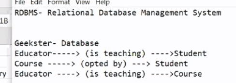

- To work with databases you need to learn query language 
```bash
Tropicana - Oracle
different orange juices - mongoDb, mySql, Cassandra (query languages)
orange juice - sql
```
> Online Sql 
```bash 
https://www.sql-practice.com/
```

#### Standard Query Language (SQL)
SQL is RDBMS for accessing and manipulating the data. Its used for retreiving a specific data which we can access by writing a query. When we have large amounts of data, we'll use SQL. 

> Manipulation (CRUD) 
- Create
- Read / Retrieval
- Update
- Delete / Drop

#### 1. Create Database 
```bash 
# command to create database 
create database Geekster;
```
> Databases have a datatype 
#### SQL Datatypes;
- int 
- varchar (similar to string ) - contains ch + special ch + numbers = alphanumeric
- char
- blob (binary large objects) - used for images
```bash 
Table 1:
StudentInformation 
- rollNumber  (int)
- studentName (varchar)
- courseId    (int)

Table 2:
CourseInformation
- CourseId     (int)
- CourseName   (varchar)

Table 3:
- EducatorId   (int)
- EducatorName (varchar)
- CourseId     (int)
```
> For tracking the particular database, these fields will be mentioned
- createdAt - time data was created
- createdBy - who created the data 
- updatedAt - time it was updated 
- updatedBy - updated by whom

> Why do you need to track?
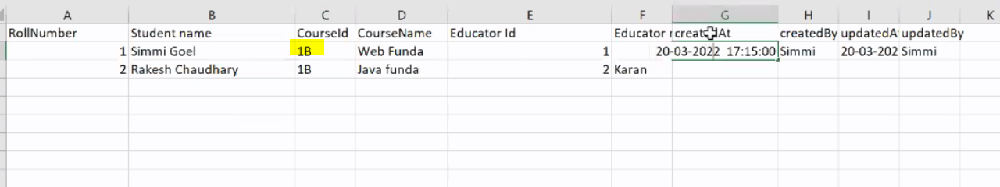
Note that: The updates made by Simmi were wrong, she gave `1B` courseID of the CourseName webFundamental, to fix this Simmi is notified to fix her wrong updates. 

> Note: SQL is not case sensitive.

#### 2. Delete database 
> syntax:
```bash 
DROP DATABASE database_name;
```
```bash
# delete database
drop database Geekster; 
```
### Create table inside database
> syntax:
```bash 
create table table_name 
(
    column1_name data_type,
    column2_name data_type
);
```
> Commands for creating tables for the above information:
```bash 
create table EducatorInformation
(
    EducatorId int,
    EducatorName varchar
);
```
```bash 
create table StudentInformation
(
    RollNumber int,
    studentName varchar
);
```
```bash 
create table courseInformation
(
    courseId int,
    courseName varchar
);
```
#### Delete Table 
```bash 
DROP TABLE table_name;
```
#### Read data from table 
```bash 
SELECT * FROM tablename;
```
> LIMIT -limits size of data you want to see 
```bash 
# it only displays 10 columns from that table
SELECT * FROM tablename LIMIT 10;
```
> view particular column from the table 
```bash 
SELECT courseId, courseName FROM courseInformation;
```
```bash 
Use this website for practice https://www.sql-practice.com/
```
#### Read specific data 
- WHERE clause 
```bash 
SELECT * FROM patients WHERE gender='F' LIMIT 5;
```
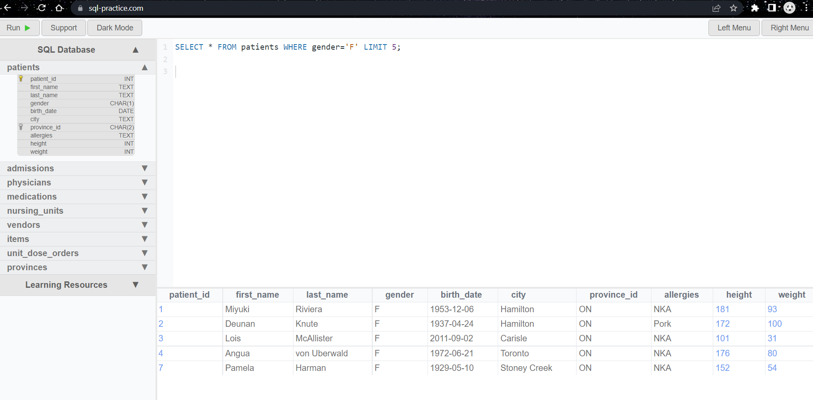

```bash 
SELECT * FROM patients WHERE first_name='Piyuki' OR first
_name='Lois';
```
#### AND 
Adding 2 properties, mandotaroy to have both properties fullfiled:

> return first 10 patients whos city is toronto 
```bash 
SELECT * FROM patients WHERE city='Toronto' AND gender='F' LIMIT 10;
```
#### OR
Not mandatory to have both properties fulfiled, if either off the properties are fulfilled, it shows those records 

> return patients whose city is Hamilton and province id is ON
```bash 
SELECT * FROM patients WHERE city='Hamilton' AND province_id='ON';
```
> return male patients living in toronto
```bash 
SELECT * FROM patients WHERE city='Toronto' AND gender='M';
```
> return either male or female patients 
```bash 
SELECT * FROM patients WHERE gender='M' OR gender='F';
```
> return male patients living in toronto OR Hamilton
```bash 
SELECT * FROM patients WHERE gender='M' AND ( city='Toronto' or city='Hamilton' );
# To make SQL understand that these are 2 different parts, we need to apply brackets, otherwise the output wont be right
```

> where gender is not male 
```bash 
SELECT * FROM patients WHERE NOT gender='M';
```
```bash 
SELECT * FROM patients WHERE NOT city='Toronto';
```
> where gender not male and city not toronto
```bash 
SELECT * FROM patients WHERE NOT gender='M' AND ( NOT city='Toronto' );
```

> patients who are not alergic to pork 
```bash 
SELECT * FROM patients WHERE NOT allergies='Pork';
```

> return female patients who are allegic to cats 
``bash 
SELECT * FROM patients WHERE gender='F' AND ( allergies='Cats');
```
> return female and male patients who are not allegic to cats 
```bash 
SELECT * FROM patients WHERE gender='F' OR gender='M' AND ( NOT allergies='Cats');
```

### ORDER BY 
- ascending / decending - sort data based on column name

> sort city of patients in ascending order (default)
```bash 
SELECT * FROM patients ORDER BY city;
```
> sort in decending order 
```bash 
SELECT * FROM patients ORDER BY city DESC;
```
> return rows in aplabetic order of first_name of patients 
```bash 
SELECT * FROM patients ORDER BY first_name;
```
> return rows in aplabetic order of first_name of only male patients 
```bash 
SELECT * FROM patients WHERE gender='M' ORDER BY first_name ;
```
### LIKE 
```bash 
# start from Ab
SELECT * FROM patients WHERE first_name LIKE 'Ab%';
```
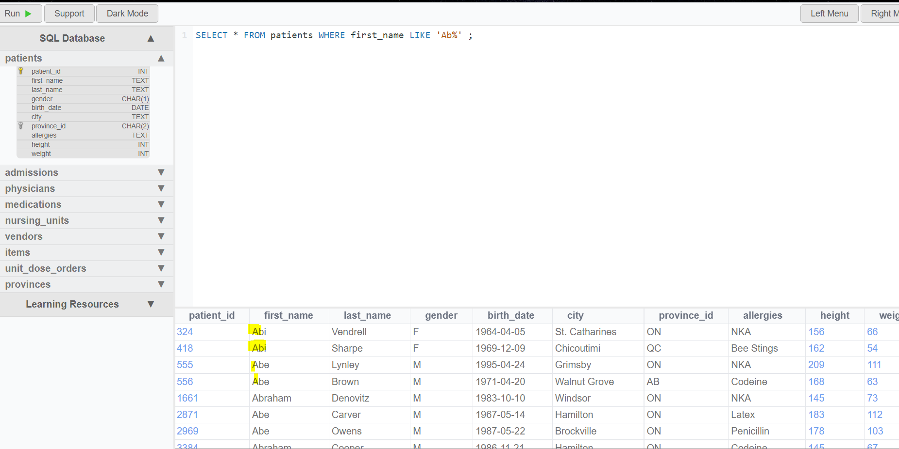

```bash 
SELECT * FROM patients WHERE first_name='Abraham';
```
> end with `am` 
```bash 
SELECT * FROM patients WHERE first_name LIKE '%am';
```
> if you remember some letters from the name
```bash 
SELECT * FROM patients WHERE first_name LIKE '%illi%';
```
> return names starting with letter B 
```bash 
SELECT * FROM patients WHERE first_name LIKE 'B%';
```
> return name ending with letter b
```bash 
SELECT * FROM patients WHERE first_name LIKE '%b';
```
> return name with pattern er anywhere in the name 
```bash 
SELECT * FROM patients WHERE first_name LIKE '%er%';
```

### COUNT 
- aggregregating function to get the count 

```bash 
# get total count of patients
SELECT COUNT(*) FROM patients;
```
> female patient count 
```bash 
SELECT COUNT(*) FROM patients WHERE gender='F';
```
> count number of patients living in toronto and name starting with letter A
```bash 
SELECT COUNT(*) FROM patients WHERE country='Toronto' AND (first_name LIKE 'A%');
```
### AVG 
- aggregrate function to calculate average
```bash 
SELECT AVG(salary) FROM employee;
```
### SUM 
> To fetch the sum of all the employees
```bash 
SELECT SUM(salary) FROM employee;
```
### MIN 
> display the least salary
```bash 
SELECT MIN(salary) FROM employee;
```
### MAX 
> display the most salary 
```bash 
SELECT MAX(salary) FROM employee;
```
### JOINS 
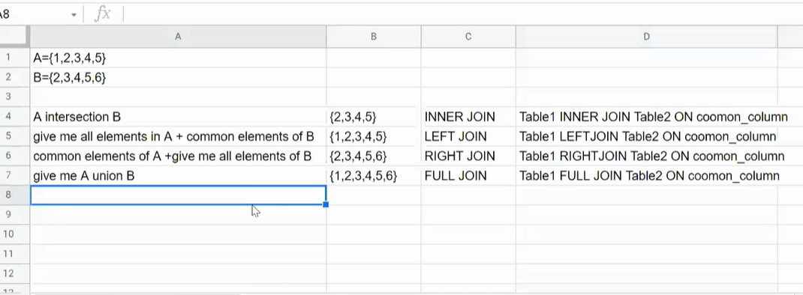
Combine particular columns from 2 tables and merge it into one.
> Types of Joins:
1. inner join - Intersection of two tables (common things)
```bash 
Whatever columns are present both in A and B, will be shown in the final result 
```
2. left (outer) join
3. right (outer) join 
4. full join 

#### 1. INNER JOIN
> patients - Table 1 
> admissions - Table 2
```bash 
SELECT `patients`.patient_id, patients.first_name, admissions.admission_date FROM `patients`
INNER JOIN `admissions` ON patients.patient_id=admissions.patient_id;
# merging patients and admissions table based on common data i.e patient_id
```
> Write an SQL query to find patient_id, first_name with discharge_date 
```bash 
SELECT `admissions`.patient_id, patients.first_name, admissions.discharge_date FROM `admissions`
INNER JOIN `patients` ON patients.patient_id=admissions.patient_id;
```
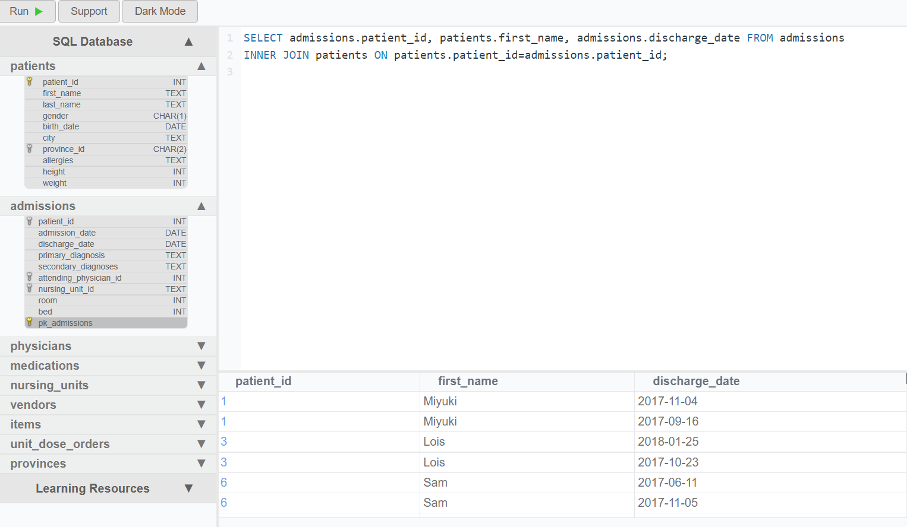

##### Why do we need inner JOIN?
> We have 2 tables and if we want to fetch coomon data from both of these via patient_id and place it in a seperate table, we cannot declare the values of both the tables in a single line in this way
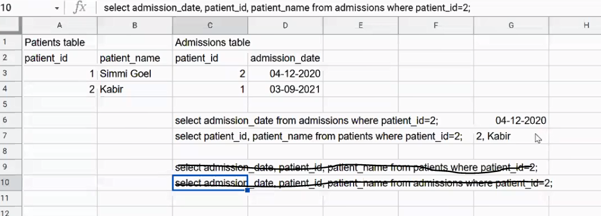

> to fix that we have JOIN
```bash 
# table1  INNER JOIN  table2  ON  common-column
patients INNER JOIN admissions on patient_id
```
#### 2. LEFT-OUTER JOIN
return everything present in left table including common column between both the tables.
> Lets compare and review the notable difference between the INNER JOIN and LEFT JOIN by comparing their values

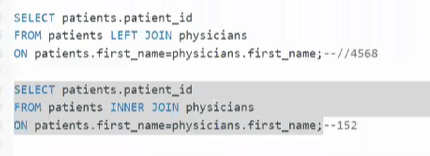
- Note that: In left join the count of columns is notably higher than it was in inner join.

### Group by clause 
> syntax:
```bash 
SELECT COUNT(columnname), columnname 
FROM tablename 
GROUP BY columnname
```
> Find count of gender from patients table 
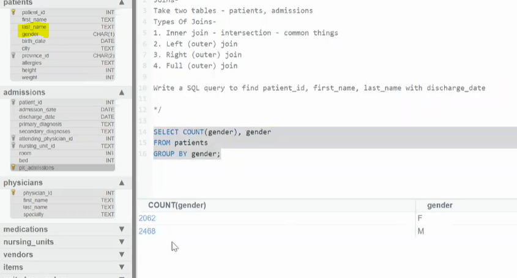

> Find count of patients who have allergies 
```bash 
SELECT COUNT(allergies), allergies
FROM patients
GROUP BY allergies
```
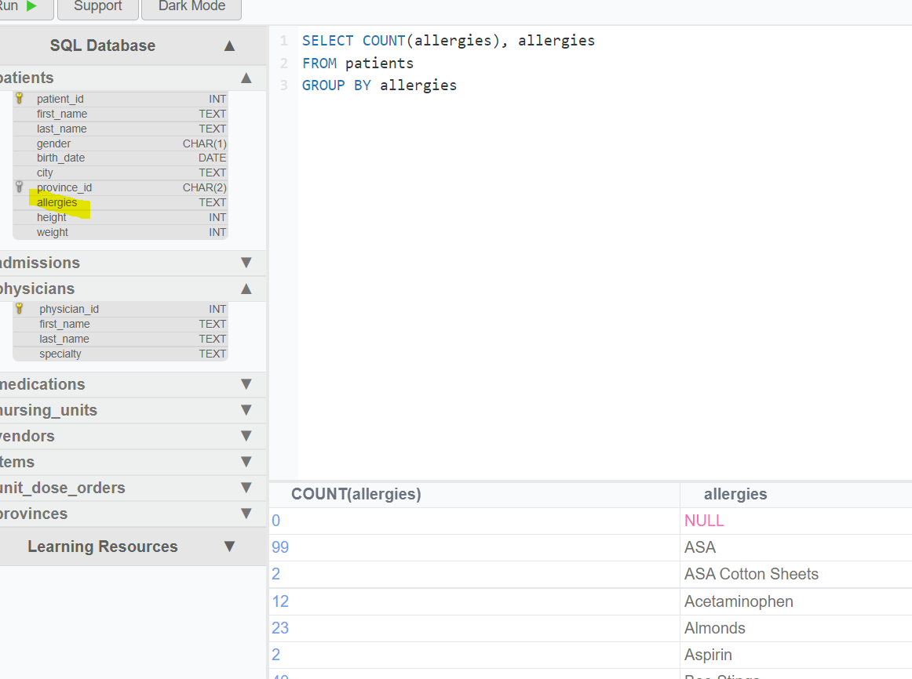

### IN clause
IN keyword is used to filter data. 

> Find patients from the city of AJAX and toronto 
```bash 
SELECT * FROM patients WHERE city='ajax' OR city='toronto';
```
> However if we have more than one city instead of = we can use `IN` instead 
```bash 
SELECT * FROM patients WHERE city IN ('Toronto', 'Ajax');
```
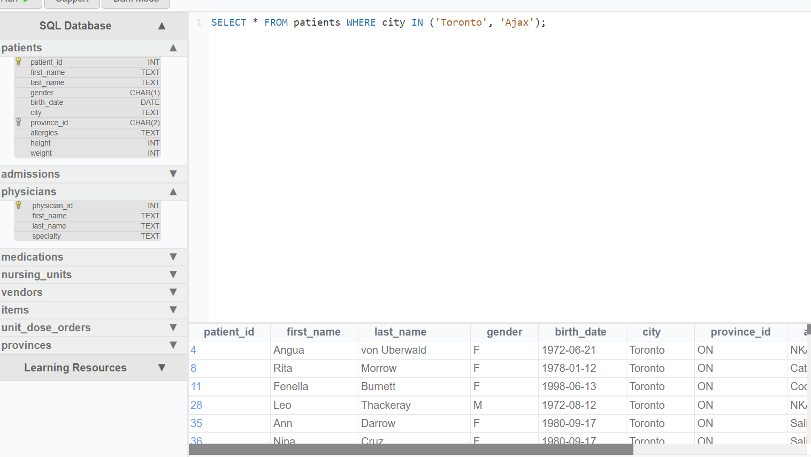

> another example 
```bash 
# return patients who are male or female 
SELECT * FROM patients WHERE gender IN('F', 'M')
```
> Write an SQL query to find all the male patients living in city toronto and Stoney Creek using the IN clause
```bash 
SELECT * FROM patients WHERE gender='M' AND city IN('Toronto', 'Stoney Creek');
```
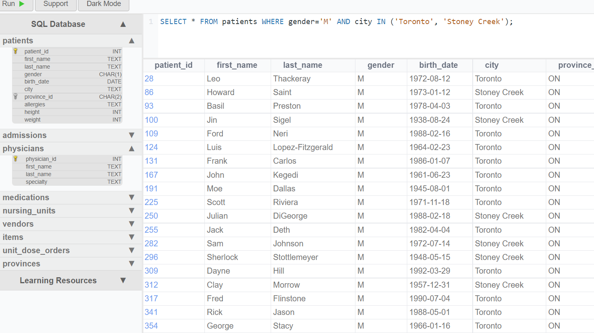

> Find the count of male patients in these both cities 
```bash 
SELECT COUNT(*), city FROM patients WHERE gender='M' AND city IN('Toronto', 'Stoney Creek') GROUP BY city;
```
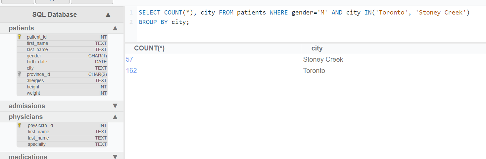


