### Introduction to Sets

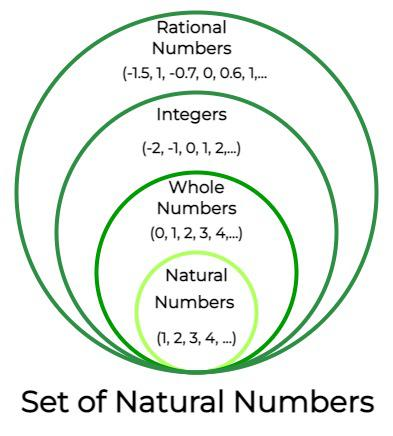

#### Real Numbers

### Prime numbers 

### Basics

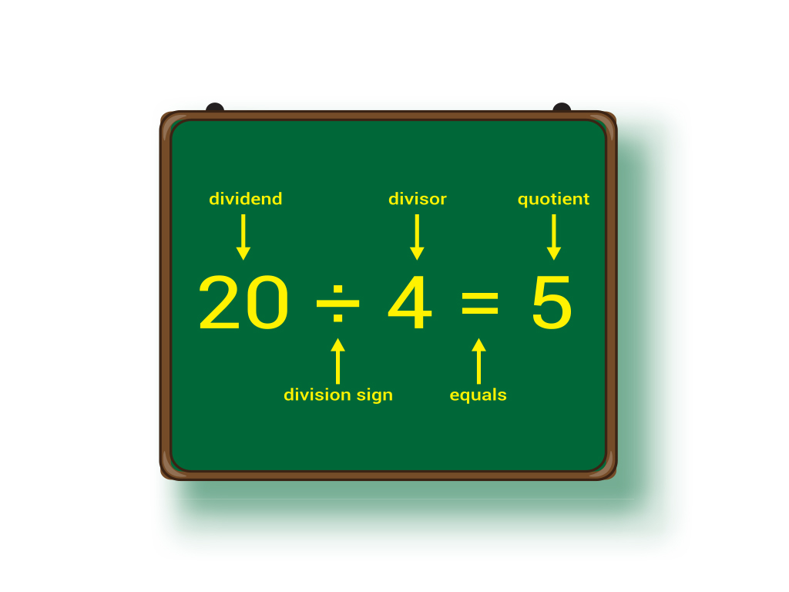

### Representation of Sets / Set Theory
> sets define only unique distinct elements 

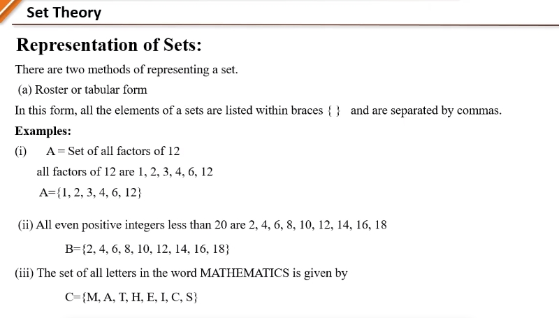

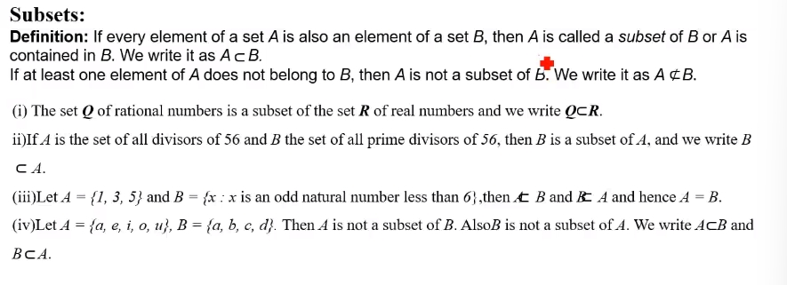

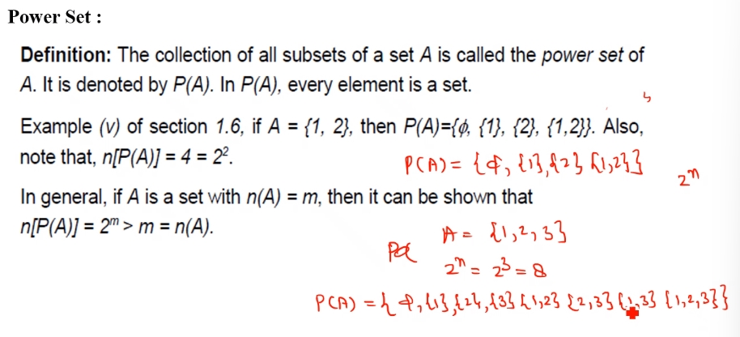

### Venn Diagram
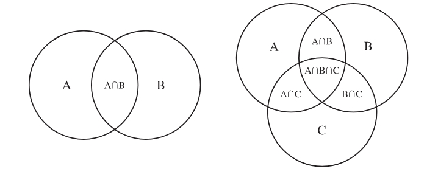
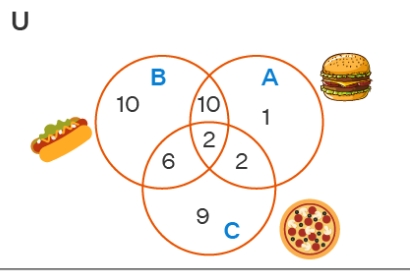

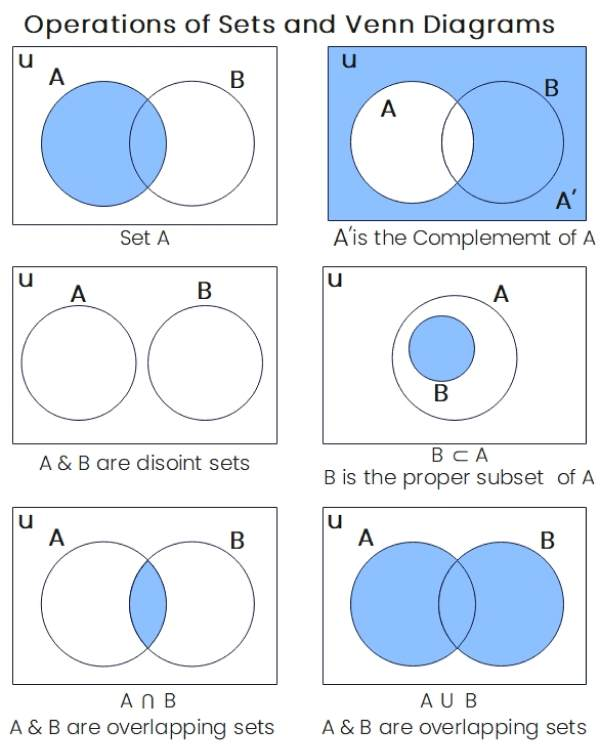
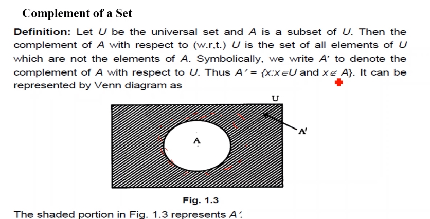

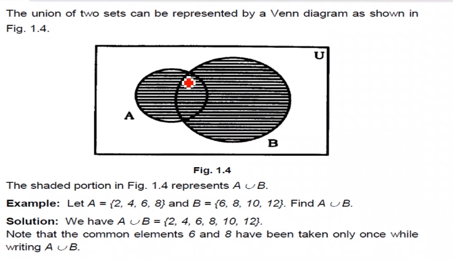
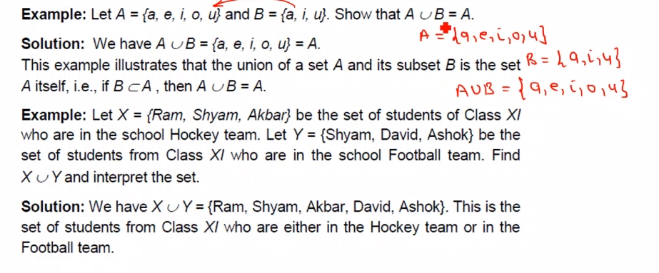
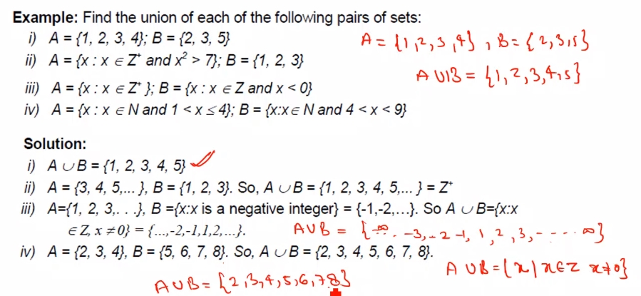
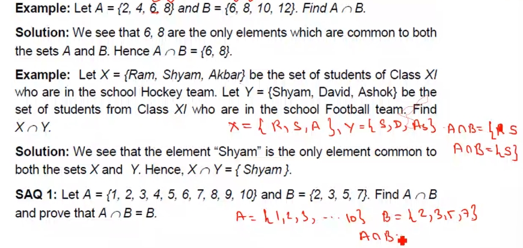

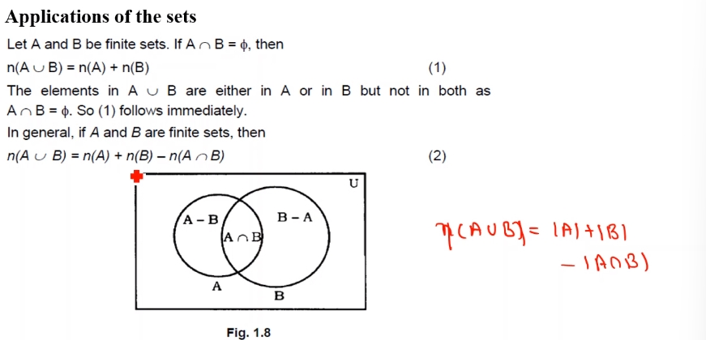

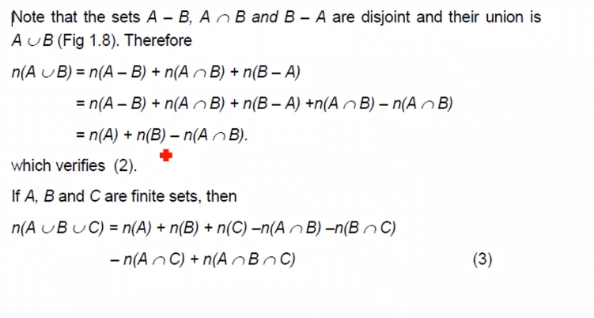
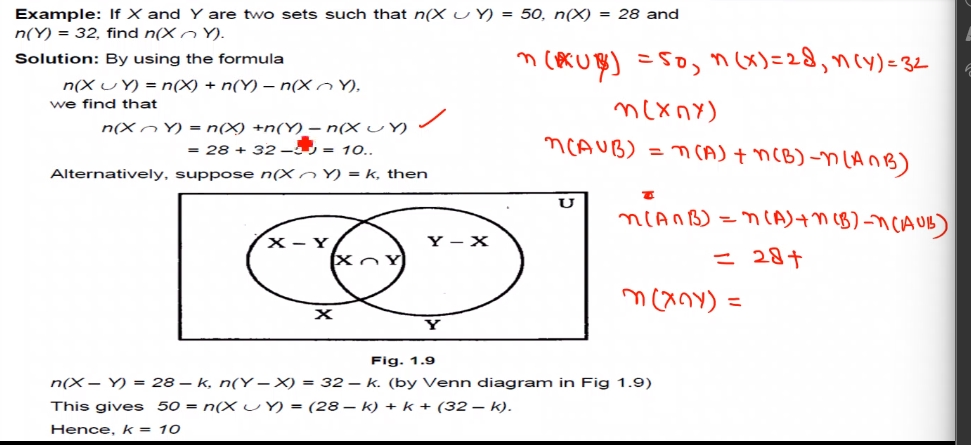

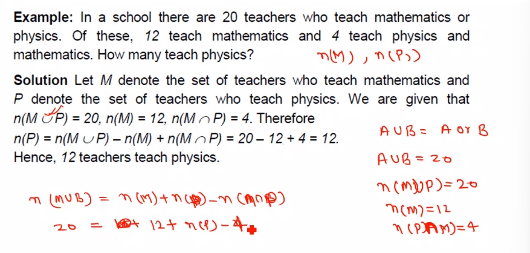
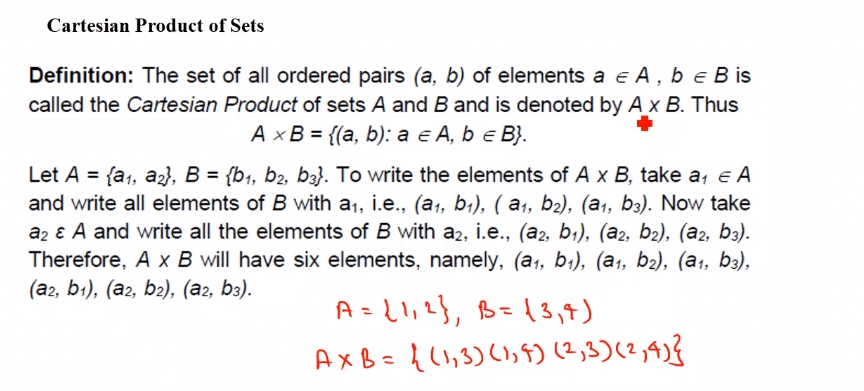
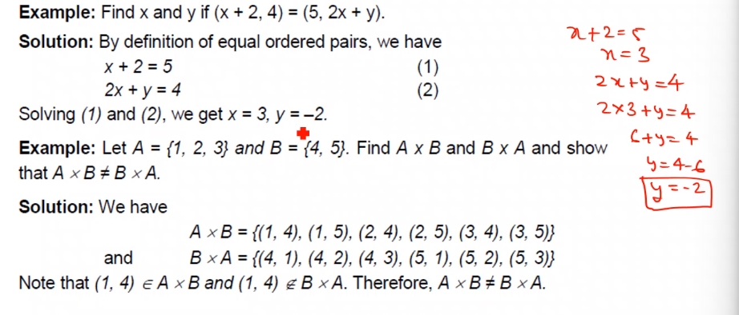
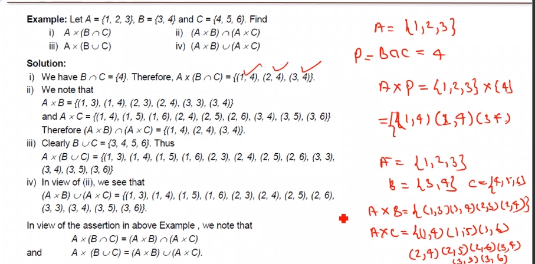
