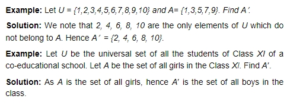
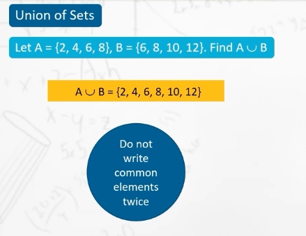
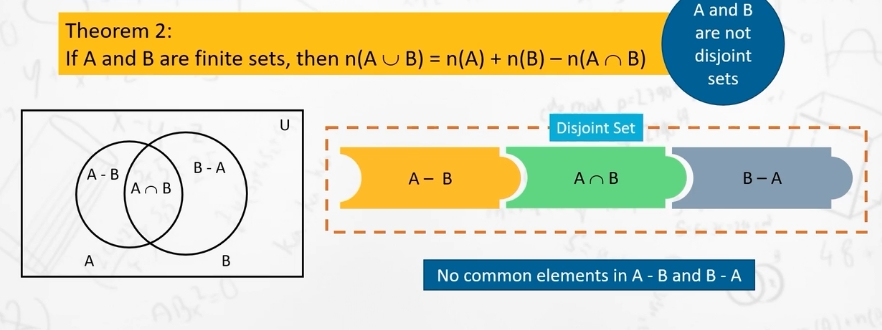
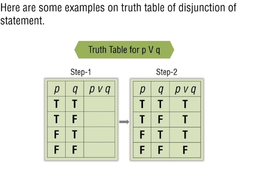
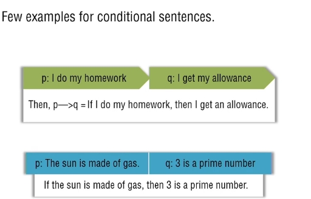
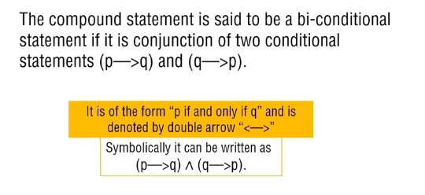
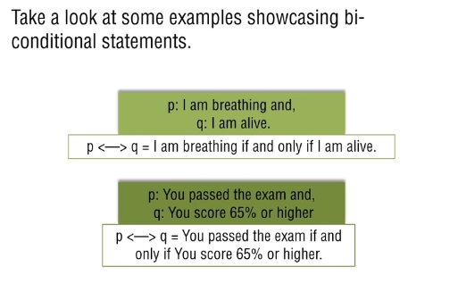
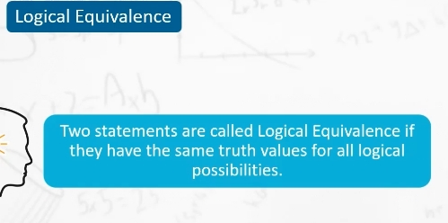
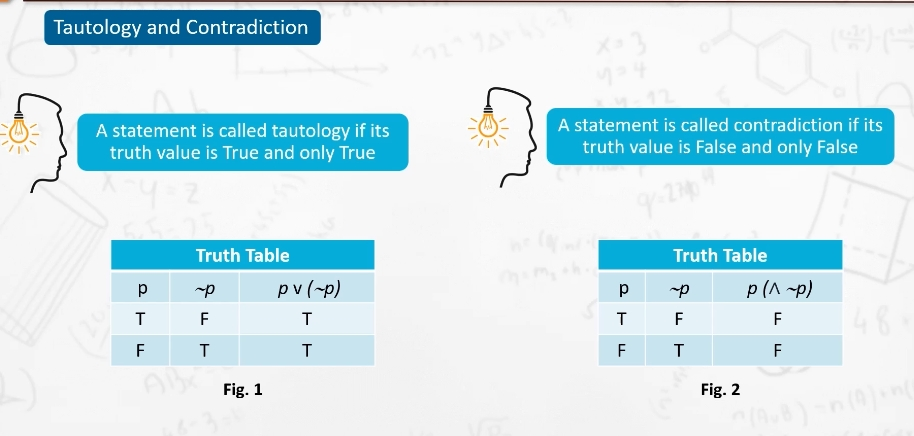

### Foundation of Mathematics 
The foundation of Mathametics is the study of philosophical, logical and algorithmic basis of mathematics. 

Understading Math serves as a model / pattern for the foundation of other sciences. 
> syllabus


### The Number System 

- Natural numbers contains both prime and composite numbers 
- Real numbers are numbers that include both rational and irrational numbers.
- rational numbers are Numbers that can be written in the form of p/q, where q≠0. rational numbers are used for representing fractions,
- Irrational numbers are real numbers that cannot be expressed exactly as fractions (of integers). Numbers such as  √2 ,  π , and  log27  are all irrational numbers.
```bash
Eulers number, Golden ratio, and Pi are some of the famous irrational numbers. {e, ∅, ㄫ}
π=3⋅14159265… The decimal value never stops at any point

All square roots which are not a perfect square are irrational numbers. {√2, √3, √5, √8}
√2. √2=1⋅414213⋅

The square root of any prime number is an irrational number.
```
- Every real number is a complex number, but every complex number is not necessarily a real number. Complex numbers are defined as numbers that can be written in the form  x+yi , where x and y can be any real number. A complex number is real if and only if z = a +0i; in other words, a complex number is real if it has an imaginary part of 0.
- imaginary numbers are not irrational. This is because irrational numbers are real numbers.
imaginary numbers are the un-real numbers, which cannot be expressed in the number line and a few imaginary numbers are used to represent a complex number.
```bash
An imaginary number is the product of a non-zero real number and the imaginary unit "i" (which is also known as "iota"), where i = √(-1) (or) i2 = -1.

the square of any real number is always positive. Then what number results in a negative square? It is an imaginary number.

Lets try squaring a real number:
(−2)2 = −2×−2 = 4
√(4) = 2

Here is an imaginary numbers example:
√(-4) = √(-1) · √4 = i (2) = 2i
We can see that each of these numbers is a product of a non-zero real number and i.

When the minus sign comes out of the square root, it becomes i because the value of i in math is, i = √(-1).
```


#### How do we find if a number is rational or irrational?

Decimal representation of rational and irrational numbers 

### Prime numbers 

> A prime number is a number that only has two factors, itself and one.
> 1 is neither prime nor composite 

### Composite numbers 
> Composite numbers have more than 2 factors 


```bash
Multiple:
A multiple are the numbers you get when you multiply a certain number by an integer. 
For example, multiples of 2 are:  2, 4, 6, 8, 10, 12, 14, 16, 18, 20.
#any number that can be denoted in form 2n where n is a natural number is a multiple of 2.
#similarly to find multiple of 5, just use 5n where n=1,2...

Factors:
We can find the factors of number 24, by multiplying two numbers in a pair to get the original number as 24.
1 × 24 = 24
2 × 12 = 24
3 × 8 = 24
4 × 6 = 24
Thus, the pair factors are (1, 24), (2, 12), (3, 8), and (4, 6).

Prime Factors:
Prime factors of 24: 2 and 3
#factors that are prime number
```
> We can find the prime numbers by doing prime factorization


### LCM & HCF 
> Why do we need to find the prime factors?
to find the HCF or LCM of the given numbers, we find the prime factors of those numbers, by prime factorization or division method. 

#### HCF
HCF of two numbers is the highest factor that can divide the two numbers, evenly. 

After finding the factors, we find the product of the prime factors that are common to each of the given numbers.
```bash
let us find the HCF of 50 and 75 by the prime factorization method.

#PRIME FACTORIZATION METHOD
The prime factors of 50 = 2 × 5 × 5
The prime factors of 75 = 3 × 5 × 5

The common factors of 50 and 75 are 5 × 5. 
Thus, HCF of (50, 75) = 25.

#DIVISION METHOD 
5  |  50, 75
   ----------
5  |  10, 15
   ----------
      2,  3
#both 2 and 3 dont have any factors other than itself and 1 

HCF = 5 X 5 = 25 
```
> an example using prime factorization 


## LCM 
LCM is the short form for “Least Common Multiple.” The least common multiple is defined as the smallest multiple that two or more numbers have in common.
```bash
For example: Take two integers, 2 and 3. 

Multiples of 2: 2, 4, 6, 8, 10, 12, 14, 16, 18, 20….
Multiples of 3: 3, 6, 9, 12, 15, 18, 21, 24, 27, 30 ….

6, 12, and 18 are common multiples of 2 and 3. 

The number 6 is the smallest. 
Therefore, 6 is the least common multiple of 2 and 3. 

#DIVISION METHOD 
 2 | 2, 3
   ------
     1, 3

Prime factor of 
2= 2x1
3= 3x1

highest power factors: 2^1 x 3^1 = 6
```
> example 2 
```bash
LCM of 30 and 60 
#using DIVISION METHOD 
 3 | 30, 60
   ---------
 5 | 10, 20
   ---------
 2 | 2,  4
   ---------
     1,  2
#3 X 5 X 2 X 2 = 60

#using PRIME FACTORIZATION
write each number as a product of prime factors.
30 = 2 × 3 × 5; 
and 60 = 2 × 2 × 3 × 5
```


#### Difference between LCM & HCF?

----------

# Representation of Sets / Set Theory
> Set theory is the branch of math which studies sets 


## Notation of Set


### Methods of Representation of Set
There are two methods of representing a set:
i) Roster or tabular form
ii) Set builder form

#### Roster Form 
In roster form, all the elements of a set are listed, the elements being
separated by commas and are enclosed within braces { }.


> example
- The set of all vowels in the English alphabets is {a, e, i, o, u}.
- The set of odd natural numbers is represented by {1, 3, 5,. . .}. The three dots tell us that the list is endless.

> Note:
while writing the set in roster form an element is
not repeated, but the elements can be specified in any order. 

#### Set Builder Form 
In set builder form, all the elements of a set possess a single common
property which is not possessed by any element outside the set.


`V = {x : x is a vowel in the English alphabet}`

> How is it read?
The above description of the set V is read as ‘The set of all
x such that x is a vowel of the English alphabet’. In this description the braces stand for ‘the set of all’, the colon stands for ‘such that’

###### Problems on this topic: 


#### Types of Sets


##### Empty Set / Null Set / Void Set 
- its denoted by Φ or {}
Consider the set {x : x is an integer, x2 + 1 = 0}. We know that there is no integer whose square is –1. So, the above set has no elements


> examples:
- let Q = {x : x^2 - 2 = 0 and x is rational}.
Then, Q is the empty set, because the equation x2 - 2 = 0 is not satisfied by any rational number x.
- Let R = {x : x is an even prime number greater than 2}
Then R is the empty set, because 2 is the only even prime number

##### Finite vs infinite set 
A set which is empty or consists of a definite number of
elements is called finite. Otherwise, the set is called infinite


> Infinite Set
- when we represent some of the infinite sets in the roster form
by writing a few elements which clearly indicate the structure of the set followed (or preceded) by three dots.
For instance, {1, 2, 3, 4, ... } is the set of natural numbers,

```bash
We shall denote several set of numbers by the following symbols:
N : the set of natural numbers
Z : the set of integers
Q : the set of rational numbers
R : the set of real numbers
Z+ : the set of positive Integers
Q+ : the set of positive rational numbers
R+ : the set of positive real numbers
```

##### Equal Sets
Two sets A and B are said to be equal if they have exactly the
same elements and we write A = B. Otherwise, the sets are said to be
unequal and we write A != B


##### Equavalent Sets 
Two finite sets A and B are said to be equivalent if they have the
same number of elements. 


> Note:
all equal sets are equivalent, but all equivalent sets are not
equal

## Subsets 
 If every element of a set A is also an element of a set B, then A
is called a subset of B or A is contained in B. We write it as A ⊂ B. It can be read as A contained in B.

The set Q of rational numbers is a subset of the set R of real numbers and we write Q ⊂ R.


#### Number of elements in Set 


#### Proper Subset 


#### Super Set 


#### Singleton Set 


#### Power Set 


> Cardinality 


#### Universal Set 


### Venn Diagram / Set diagram / Logical diagram 
Most of the relationships between sets can be represented by means of diagrams. Figures representing sets in the form of enclosed region in the plane are called Venn diagrams named after British logician John Venn(1834—1883 A.D.).

A venn diagram shows all possible relations between a finite collection of different sets. 


#### Proper subset 


#### Compliment of Set 





### Operation on Set 


#### Types of Operations 


##### Union of Sets 




##### Intersection Of Sets 


##### Disjoint Sets 


##### Difference of Sets


### Applications of Sets

### Theorem of Union of two sets 

#### Theorem 1 


#### Theorem 2



#### Theorem 3 


### DEMORGANS LAW 


### LAWS 
1. commutative law 


2. associative law 


3. distributive law 


### Cartesian Product of Sets
Let A, B be two sets. If a ∈ A, b ∈ B, then (a, b) denotes an ordered pair whose first component is a and the second component is b. 

> Ordered Pair 
Two ordered pairs (a, b) and (c, d) are said to be equal if and only if a = c and b = d.

In the ordered pair (a, b), the order in which the elements a and b appear in the bracket is important. Thus (a, b) and (b, a) are two distinct ordered pairs. 

if a ≠ b. Also, an ordered pair (a, b) is not the same as the set {a, b}.

If the set A has m elements and the set B has n elements, then `A
x B` has mn elements

> Ordered Triplets 
If A, B and C are three sets, then (a ,b, c), where a ∈  A, b ∈  B and c ∈  C, is called an ordered triplet. An ordered pair and ordered triplet are also called 2-tuple and 3-tuple


##### Example of Cartesian Product of Sets 


#### Terminal QS 


## LOGIC STATEMENT 


#### STATEMENT 


#### OPEN STATEMENT 


#### TRUTH VALUE OF STATEMENT 


#### TRUTH TABLE 




#### TYPES OF STATEMENTS


### LOGICAL CONNECTIVES 


##### CONJUNCTION


##### DISJUNCTION 


##### NEGATION 


## NEGATION OF COMPOUND 
##### NEGATION OF CONJUNCTION


##### NEGATION OF DISJUNCTION


##### NEGATION OF NEGATION


### TYPES OF STATEMENTS 


##### CONDITIONAL STATEMENT 




##### BI-CONDITIONAL STATEMENT 






## TAUTOLOGY, CONTRADICTION AND LOGICAL EQUAVALENCE 
### TAUTOLOGY 


### CONTRADICTION


## LOGICAL EQUAVALENCE 




#### TAUTOLOGY VS CONTRADICTION 



### APPLICATIONS OF LOGIC 


