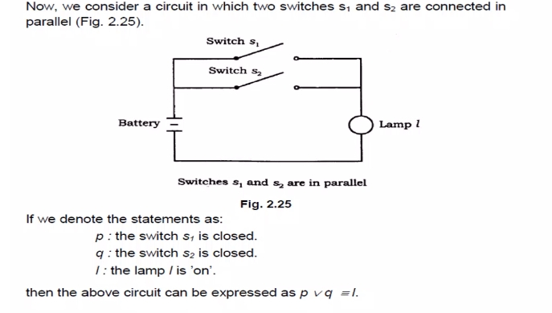

### Introduction to Sets

#### Real Numbers

### Prime numbers 

### Basics

### Representation of Sets / Set Theory
> sets define only unique distinct elements 

### Venn Diagram

### Unit 02 - Mathematical Logic 

