### Computer Network 
Computers connected together. Internet is a connection of computer network (on a global scale)

> What forms a network?
2 computers connected to each other via LAN/ethernet cable sharing data with the help of NIC cards forms a computer network.
```bash
A network interface card (NIC) is a hardware component without which a computer cannot be connected over a network. It is a circuit board installed in a computer that provides a dedicated network connection to the computer. It is also called network interface controller, network adapter or LAN adapter.
```

During cold war, USSR & US they were competing against each other to make history. Russia launched specnik sattelite in 1957.. US Govt created ARPA (advanced research projects agency) in 1958 with the intention to fund advanced research. Since there buildings were many and they wanted a way to communicate files through these they created this thing called ARPANET (which would be interconnecting MIT, STANFORD, UCLA, UTAH initially) which used TCP/IP (transmission control protocol / Internet protocol). So technically many computer network protocols were developed by ARPANET.

ARPA changed its name to DARPA in 1972, then back to ARPA in 1993, then finally back again to DARPA in 1996.

OSI was introduced in 1983 by representatives of the major computer and telecom companies, and was adopted by ISO as an international standard in 1984.

ARPANET implemented the TCP/IP model in 1970s which was funded by DARPA. So technicaly TCP/IP had been in developing far before the OSI model was introduced. However relevant changes were added to improve it by implementing the ISO model.

```bash
protocols - sending email requires some steps to finally send the email in a way that all the data is send without compromising confidentiality or integrity. To send data packets from one point to another requires a particular set of predefined rules that needs to be followed and these are called protocols.

who creates the rules for protocols?
the internet society: https://www.internetsociety.org/
```
Automated sharing was missing (hyperlink - click link and it would redirect to the referenced document link). Tim Berner developed world wide web (where each web page are identified by URL and contain hyperlinks and is stored on web servers ), which would store and access these documents.

At this point the search engine wasnt created yet, you could only jump through hyperlinks and save it through indices. 

search engine is to show data from net based on certain typed search query. to acheive the result for search query, search engine uses spiders which crawls over web pages by indexing it and returns relevant data. 

The first search engine was archie created in 1990, which was created to search for FTP files. In 1994, yahoo was created and so was the web crawler. Then lycos came up which crawled the most web pages than other search engine in that point in history. Then Infoseek was released in jan 1994 and was used as netscape's default search engine but was exploited by scammers, then they released netscape navigator i 1994 oct. A bunch of other search engines came into the market then
```bash
Netscape Navigator or Netscape was a leading browser in the 1990s. The browser was officially discontinued and with the aid of some tools you could migrate your data to Flock and Firefox for a while after that. Netscape decided to open source its codebase and created the not-for-profit Mozilla, which went on to create and release Firefox in 2002. Netscape helped make the Web graphical rather than a text-only experience.

# why did netscape fail?
Netscape was working on their browser 'navigator' and JavaScript (JS) programming language was born at Netscape as they attempted to add interactivity to web pages. JS first shipped with Navigator in September 1995.

technically both navigator and Internet explorer (which belonged to microsoft) were rivals, with microsoft a tad bit behind on the technology, however That was until Internet Explorer 3.0 release on August 1996. Microsoft had finally caught up to Netscape in terms of browser technology. thats when bill gates was stealing market share primarily through Internet Explorer pre-installations on every Windows system.
```
then google beat IE with its insane marketting and was established in 1996 which was built upon page rank algo by larry and sergey in stanford, then image search came into for crawling images and showing relevant image search. then google search suggestions or the autocomplete feature comes up with a bunch of most searched queries whenever you search something in the search bar. 

> But why is IE still used in some places when it doesnt show compatability with so many languages
The people who still rely on classic Internet Explorer tend to be business users who have lgacy business software that relies on certain IE-specific features, They have legacy intranet websites that use extremely specific, nonstandard markup that only IE understands, So if we continued to develop IE and tried to make it “support everything” (by behaving according to modern standards), we would most likely cause these legacy sites to break, which would again eliminate these users’ reason for using IE to begin with.

### Types of Network 
There are two types of network types one is peer-to-peer, and another is client-server. In a client-server network, many clients can connect to a server. However, in a peer-to-peer network, we don't have any clients or servers. Instead, all nodes can act as clients or servers.

#### Client-Server Architecture
> when client hits enter on the search bar it sends a request to retreive resources from the server which returns a response. It uses HTTP protocol for data transmission over the web.

> Servers are identified via IP adress. so when we enter a query in the search bar, client fires a DNS lookup to find the IP adress mapped to the url

```bash
your own computer can act both as server and client. it can act as a server when you use Apache (web server) which can host web pages on localhost on ports. To work with apache you need a dyanamic language like Perl, Python and Php. 

Apache processes requests via HTTP which is a protocol used for transmission of documents between client and server 
```

Protocols are rules defined by internet society. 
> There are other protocols like:
1. TCP - which ensures data is trasnmitted without being corrupted.
2. UDP(user datagram protocol)- used for video conferencing (100% data wont reach the end user)
3. HTTP (hyper text transfer protocol) - used by www which defines how data should be transfered on web server. 

#### Peer to peer network 
The main difference between peer-to-peer and client-server network, is that, in a peer-to-peer network, every node can demand for services and deliver services, but we if talk about client-server, in client-server, the client node can demand for services and the server node can reply with services. Its kind of like decentralized network.

> BitTorrent is one of the most popular examples of peer-to-peer networks. In this type of network, all computers are connected to the internet where resources shared by any one computer can be downloaded by others.
```bash
Torrent is used for uploading a file (called torrent file) to P2P network through torrent client which hosts your file, which would now be available for the world to download.

every time you download something from the torrent client it simultanousely uploads the same file on your network the torrent.
everytime your uploading a file you have a choice to throttle or reduce the upload cap so your file is downloaded quickly and once its done downloading you can cut off the uploading cap, while it wont affect you, it would to the people in the network who are relying on your upload for their files.

seeders is term used for users who upload files. leechers is a term used for users who download files. the seeders and leechers should be more when your downloading, also the seeders and leechers ratio should be sufficient.

The more seeds created the faster would be the download speed for other users. File creator doesnt have complete control over the network, because download speed depends on the the seeders and leechers (AKA other peers in the network)

#thats why torrent is decentralized
cs it moves the control of an organization or government from a single place to several smaller ones: 

Torrenting is often associated with piracy because its frequently used to share files that are protected by copyright (pirated content - unauthorized duplication of copyrighted content that is then sold at substantially lower prices in the 'grey' market), including movies, games,

People want entertainment. There is a reason the market for movies and music is hundreds of billions of dollars. And BitTorrent dodges that market by letting people get content of free. Provided a person is viewing the files in private, even if one downloads files from a torrent site, then also it is not a crime under the laws.

BitTorrent and uTorrent are both owned by the same company, Rainberry, Inc., 
BitTorrent is faster than Utorrent as it is better at blocking ads during a file download.

Consider a Linux distribution, such as Ubuntu or Debian. These Linux distributions offer a way to download the free operating systems using a torrent to reduce the strain on their servers, reduce hosting costs, and potentially reduce the time it takes to download a specific file.
```

#### Types of area Networks 

1. PAN - max:100meter range 
> Technology used: 
- Bluetooth (for file sharing)
- Infra-red (IrDA)
- Zigbee - used in ioT
> Ownership: private 
> Error rate and cost: very low (since resources are less)

2. LAN - max:km range 
helps in connecting small group of computers. 
used in offices 

> Technology:
A Local Area Network (LAN) can be implemented over wired or wireless connections.
We can implement LAN using Ethernet LAN (Wired connection) and WLAN (Wireless). WLANs use radio waves to transmit data instead of cables and wires. A common standard used in WLANs is Wi-Fi technology, 
- wifi
- ethernet 
In 1980s ethernet was standardized into standard IEEE 802.3 by IEEE (Institue of electrical and electronic engineers). 

ethernet was a communication standard used to create 
LAN network which is used to transfer data between computers. LAN gaming was used in 1980s to play multiplayer games together using ethernet instead of wifi.Now ethernet cables are used to connect router to computer for accesing internet but back in the days ethernet network meant a way of connecting computers and other network devices in LAN network to enable transmission of data.
> Ownership: private 
> Error rate and cost: low (since resources are less)

> How are they private exactly?
Since LANs are within a single building or a smaller area, they are owned by the specific organization. information technology (IT) administrators set up LANs using LAN/ethernet cable so that network nodes can communicate and share resources such as printers or network storage. However access to the internet would be enabled by ISP's

> Does LAN need internet?
LAN does not require Internet access, its used for data sharing in the network, but if you want to connect your LAN network you'll need to suscribe to internet connection via ISP

> Why do schools use LAN?
They allow several students in a class to use one program at the same time, or to work on different programs or different parts of the same program at the same time. *They eliminate the need to buy several copies of one software program, thereby often reducing costs. Using CCleaner Cloud, you can install software onto multiple computers connected on LAN at the same time. Also it allows resource sharing like printers and we can implement netwrok security in all computers of LAN simultanousely

1. CAN - max: 1-5km
used within univeristy and coorporate offices.
> Technology: ethernet 
> Ownership: private 
> Error rate and cost: moderate (since resources are moderate in number)

4. MAN (Metropolitan area network) - max: 5-50km
helps connecting to the city. A buch of LAN connected together is known as MAN. 
> Technology:
- Fiber Distributed data interface (FDDI)
- Copper Distributed data interface (CDDI)
- Asynchronous Transfer Mode (ATM)
> Ownership: private & public 
> Error rate and cost: high (since distance increases, resources increases)

5. WAN (Wide Area Network) - max: above 50km
allows connection between countries.  A WAN can contain multiple smaller networks, such as LANs or MANs. The Internet is the best-known example of a public WAN.
> Technology:
- leased line 
A leased line can be of any medium as long as it connects two branches together regardless if it has network circuitry in between. It can be an MPLS, Fiber Optic, DSL, or Satellite.
```bash
Multiprotocol Label Switching, or MPLS, is a networking technology that routes traffic using the shortest path based on “labels,” rather than network addresses, to handle forwarding over private wide area networks.

Digital subscriber line (DSL; originally digital subscriber loop) is a family of technologies that are used to transmit digital data over telephone lines. DSL uses home phone lines to provide Internet access. DSL is a generic term we use to encompass both ADSL (Asymmetric Digital Subscriber Line) and VDSL (Very-High-Bit-Rate Digital Subscriber Line). Broadband is a technology which uses ADSL.

Unlike dial-up service, DSL uses separate frequencies for phone and internet, so you can use both at the same time.
```
- Dial up 
The first version of the Internet available for commercial use was dial-up. Dial-up Internet required a phone line to operate, so phone calls couldn’t be made using a landline while the Internet was in use.

Broadband first started to replace dial-up in the early 2000s, with half of all Internet users having a broadband connection by 2007. Broadband allows a much higher volume of data to be transferred at faster speeds by using an ADSL (Asymmetric Digital Subscriber Line) connection. usually broadband connections come with a phone line and wifi, but u have a choice to take a broadband without phone line. 

> Ownership: private & public 
> Error rate and cost: high (since distance increases, resources increases)
----------

> More Terms:
- SONET (SYNCHRONOUS OPTICAL NETWORKING) 
carries data through optical fibres which covers more distance 
- FRAME RELAY 
Connect LAN to WAN (internet)
- Broadband
Broadband is a way of connecting to the internet. It allows information to be carried at high speed to your personal computer, laptop, tablet, smartphone, smart TV or other web-enabled device.

Broadband has largely replaced the original 'dial-up' (narrowband) method of connecting to the internet, which was much slower.
WiFi is most commonly used to connect to a broadband internet line.

> Types of Broadband: (most famous ones)
When you sign up with an Internet Service Provider (ISP), they usually send you a modem and a router. ISP'S provide broadband / internet connection through modem or modem-router.
The majority of ISPs will provide you with a modem/router or a gateway/router depending on your service type. 
```bash
However if the ISP offers to give you both a modem and router rseperately then its bette to just use your own router instead of rent out the ISPs router which would be heavily priced.

#difference between modem and router
while modem brings internet to your home, router brings internet to your devices. While modem has a public IP address of the area you belong to, router assigns local IP address to each device in your network. 
```
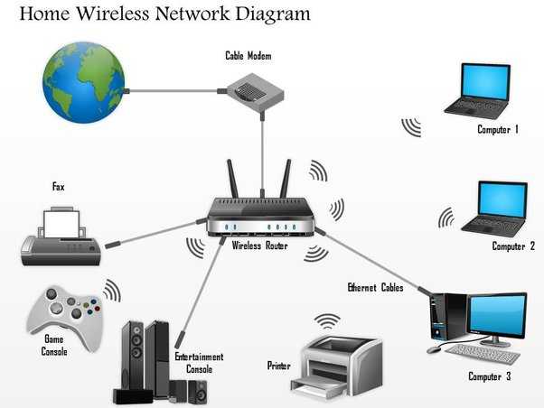
- ADSL -  (Asymmetric Digital Subscriber Line)  is a type of digital subscriber line (DSL) technology that facilitates fast data transmission at a high bandwidth on existing copper wire telephone lines to homes and businesses. provides broadband internet access through the telephone lines already installed in most businesses. Two different types of ADSL technology which are used - ADSL1 and ADSL2+ (faster).
DSL’s top speeds usually range from 3 to 12 Mbps but in some urban areas as high as 20-100 Mbps, which can serve the email, download and browsing needs of many small businesses.
- CABLE - Cable modem service enables cable operators to provide broadband using the same coaxial cables that deliver video and audioto your TV set. Cable broadband is much faster than DSL and offers speeds ranging from 10 Mbps to 1 Gbps.
This speed is especially helpful to businesses with video conferencing or video streaming needs – or which share memory intensive files, engage in ecommerce or collaborate online.
- Fibre 
Fibre broadband is delivered via clusters of fibre optic cables (each one thinner than a human hair) and speeds are faster than cable. 
There are two types of superfast fibre broadband - ‘fibre-to-the-cabinet' (FTTC) and ‘fibre-to-the-premises' (FTTP).
Most fibre connections sold are FTTC. Fiber optic internet is the fastest, most reliable internet service available today. Fiber optic internet cable service bandwidth can reach up to 1,000 Mbps/ 1gbps. The range of fiber optics within a given provider's network is faster than DSL or cable because it relies on the speed of light to transmit data.
- satellite broadband
Unless you’re operating in a remote location, your most likely choices for a broadband internet connection are DSL, cable and fiber.

While slower than DSL and Cable, satellite connections are ten times faster than old dial-up speeds. Service requires a dish antenna and can be quite expensive compared to other types of connections.
- wireless broadband 
it recieves internet from the ISP without any wiring. wireless Broadband is a type of internet connection given by your internet service provider. Wi-Fi enables you to access the internet provided by the broadband.

#### Topologies 


1. Bus Topology 
computers arranged in a bus network format. If one link gets broken data transfer will be broken. If were sending data from A to D, it has to pass through B and C.
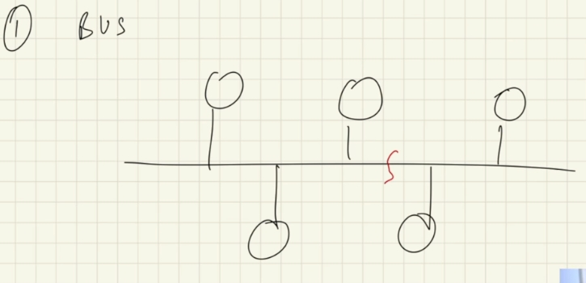

2. Ring 
every system communicates with each other. If one link gets broken data transfer will be broken. If were sending data from A to D, it has to pass through B and C.
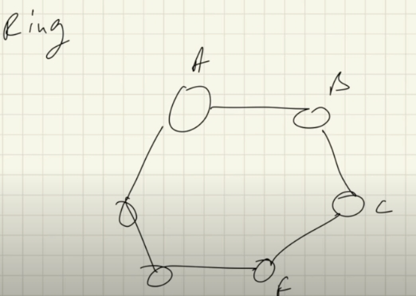

3. Star 
central device is connected to every computer. If central device fails computer would go down. 
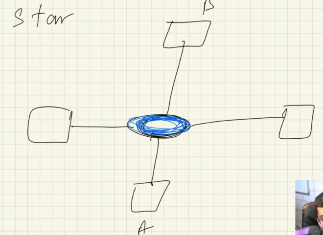

4. Tree (Bus + star)
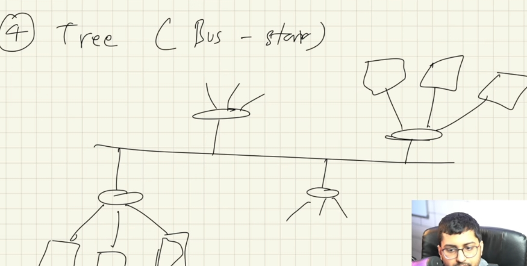

5. Mesh 
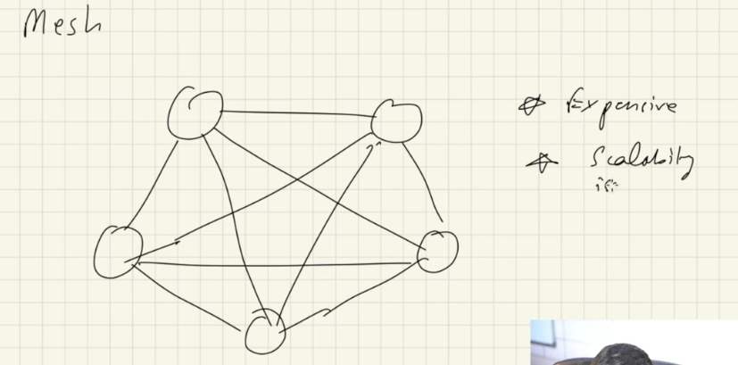
every single computer connected to every single computer. its expensive since more wiring and causes scalability issues (say we want to add a new computer to network, it would be complex to scale )

#### Analog vs Digital transmission
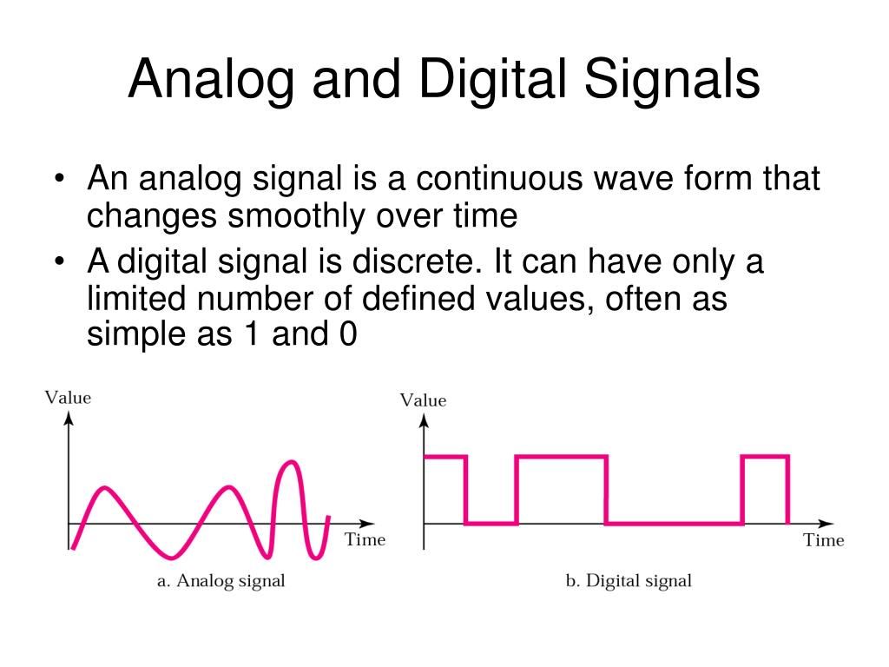

In analog technology, information is translated into electric pulses of varying amplitude. In digital technology, translation of information is into binary format (zero or one) where each bit is representative of two distinct amplitudes.

> Analog transmission may be achieved via many methods:
- Through a twisted pair or coaxial cable
- Through an optical fiber cable
- Through radio
- Through water

submarine cables transfer data in the form of light pulses along the optical fibre. The modem which is installed by ISP converts analog signal to digital signals. The router receives a digital signal from your modem and shares it with the wireless devices in your house, creating a Local-Area Network (LAN). 

#### Structure of Network
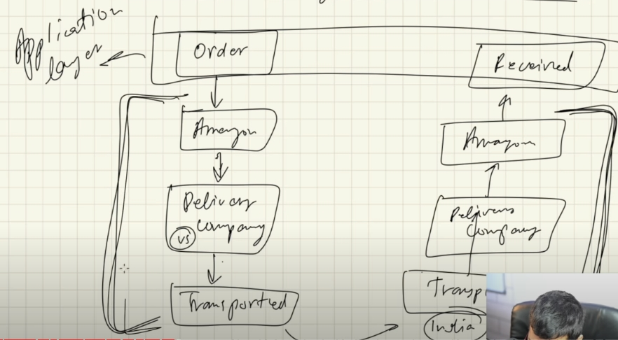
When making an order on amazon, you see its shipped from its home country all to way to the indian amazon warehouse and then shipped to the customer. But while were placing the order we dont really understand or know the process of how the order actually reaches to us, this layer in terms of OSI model is called as application layer, and the entire process is the internet. 

#### Why do we need OSI Model?
> Does computer network work when both client and server are on the same machine?
```bash
#sender-reciver / client-server 

When sender communicates a process with the reciever on the same machine (when user press keys on keyboard its printed on monitor) its called the inter-process communication. this part is dealth with the kernel in the OS, its not handled by the computer network. 

Computer Network works when sender and reciever are operating on different machines.
```
- In order for sender to send data (say message M) to the reciever there must be a connection (wired or wireless)
- There must be certain protocols running at both the sender and reciever machine which would enable understanding of data at the reciever end
-  There are couple of functionalities that enable two way communication between sender and reciever. **Mandatory** (what are the mandatory functions required when sender is sending data to the reciever) and **optional**. Note that there are around 70 functionalities combined, within which given below are a few. 

> Example of mandatory functionality 
1. error control (is the message sent from sender recieved by reciever ensuring integrity of the message)
2. Flow Control - Amount of data and the speed of data transfer from sender to reciever must be flowed in a way that its recieved in the reciever end following some constraints like load balancing which ensures that the network of the reciever is not congested. 
3. Multiplexing and Demultiplexing - Alot of processes (applications are open) are occuring in the system, Multiplexing and Demultiplexing helps to figure out which application from the particular MAC adress is supposed to recieve the data packet)

> Examples of Optional functionalities (increases complexity of the application)
4. encryption / decrytpion - sending encrypted text so that we can ensure the confidentiality, integrity and accesibility of the data. 
```bash
for example, HTTPS encyrpts data 
```
2. Checkpoint - If were downloading 500mb file, if the file reached 300mb and it fails downloading, then if we download again we want the downloading to start from the 300mb checkpoint 

The OSI model uses all these functionalities in layers/ steps which specify in what herierchy will the data be transffered between sender and reciever. *OSI model is a standard (a bunch of protocols) which client-server architecture model should follow to transfer data between each other.*

#### Open System Interconnection model 
Standard way in which two or more computers communicate with each other introduced by ISO (Internationak standardization organization) 1984


> Each layer has certain protocols
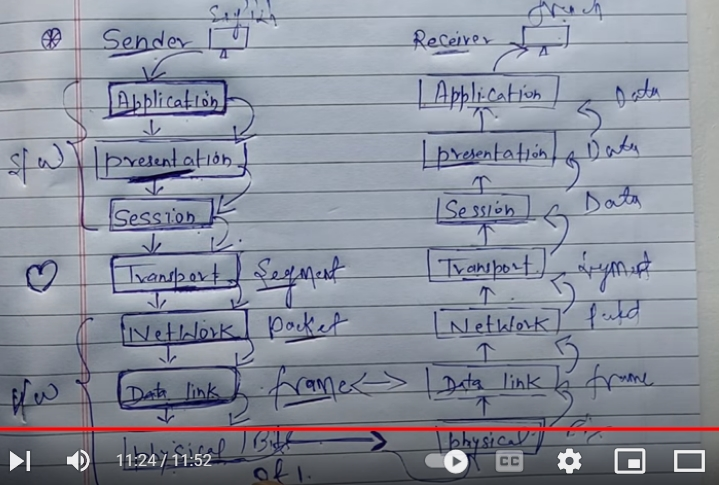

```bash
When a lot of requests are made to the server/ data center, then the servers go down and websites crash because it cant handle the data load. 

#when you type in this command on cmd you'll notice that it reaches to you in a bunch of data packets 
ping google.com 

Pinging google.com [142.251.42.78] with 32 bytes of data:
Reply from 142.251.42.78: bytes=32 time=7ms TTL=120
Reply from 142.251.42.78: bytes=32 time=39ms TTL=120
Reply from 142.251.42.78: bytes=32 time=7ms TTL=120
Reply from 142.251.42.78: bytes=32 time=48ms TTL=120

Ping statistics for 142.251.42.78:
    Packets: Sent = 4, Received = 4, Lost = 0 (0% loss),
Approximate round trip times in milli-seconds:
    Minimum = 7ms, Maximum = 48ms, Average = 25ms

#ping time is basically the time taken for data packet to reach the client side from the server side and vice versa 
Can you reduce the ping time?
No because it travels at speed of light through cables so your getting the best possible time for data packets to travel.
```
> What are processes in program?
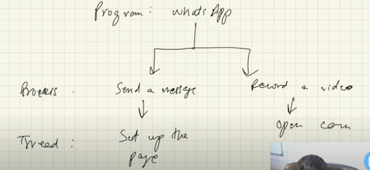
One program can have many procces instance running in the background, many threads are running (thread implements what needs to be done to run the process)

> What are sockets?
When you want to send message from one system to another system sockets are used. Its a interface between process and internet.

Socket are generally employed in client server applications. The server creates a socket, attaches it to a network port addresses then waits for the client to contact it. The client creates a socket and then attempts to connect to the server socket. When the connection is established, transfer of data takes place.

> What are Ports?
private Ip address convey the logical address of the device were working with, ports specify which application were working with. If many proccesses are working in one application (many application instances are running), then their are seperate ports assigned to that through epheremal ports. When application is no longer using the port it will be freed. 

##### Network protocols
state: condition of being available at a certain point of time 

#### Categories of Protocols:
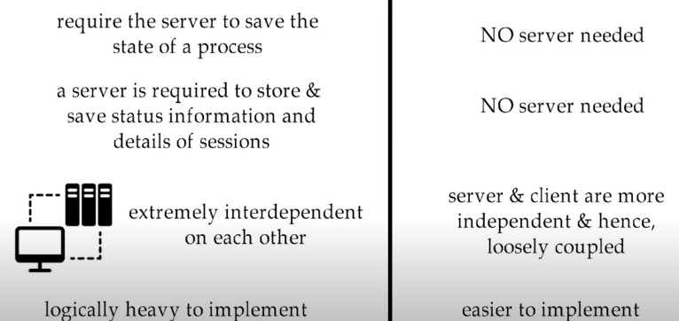
1. stateless 
```bash
Sending SMS:
no confirmation from recieving device to the sending device that the message has been recieved. 

EG: HTTP, UDP, DNS, REST API's
```
- does not require response from the server
- each request may be intrepreted without prior requests session state 
- each individual communication is unrelated 

> Pros
- Server doesnt have to store session state in between requests which is why scalability and implementation is enhanced 
- easier to recover from partial failures like crashes 

> Cons
- decreased performance cs it doesnt save in the server so it increases the amount of repetetive tasks.

2. stateful 
```bash
Example of a call:  
- connection validated and maintained to establish continuos communication
- session established until end of the talk/banking (session) - maintains session 
- what happened in previous transaction may have impact on current transaction

eg: Telnet, FTP 
```
- expects response of some sort 
- if no response it sends response again 
- prior requests session state will be tracked 

> Pros
- they keep track of connection information which inturn gives a superior performance by maintaining data on the server 

> Cons
- Highly dependent on server side state and need backing storage
- not very secure since state is maintained 

> Types of Protocols
- HTTP protocol - client server protocol which tells how you request data from the server (HTTP REQUEST) and tells how server sends data to client (HTTP RESPONSE). Its an application protocol, a stateless protocol (once the transaction ends the connection between the browser and the server is also lost). **Every application layer protocol also requires a transport layer protocol**. It uses TCP (transmission control protocol) to make a connection first then it uses the HTTP protocol for data request response.
```bash
In the case of HTTP, before a client and server can exchange an HTTP request/response, they must establish a TCP connection first. 

TCP is connection oriented but UDP is not. 
```

1. Application layer 
- users interact with it - its basically apps like whatsapp / browsers 
- used by network applications (apps that work on internet)
- uses application layer protocol like HTTP/HTTPS for web surfing
```bash
Application layer protocols:
- HTTP - used for data transfer on web pages 
- HTTPS - used for secure data transfer on web pages 
- FTP - used for file transfer 
- SSH (secure shell host) - used for 2 computers to communicate and share data 
- NFS - allows a user on a client computer to access files over a network

NFS is often used with Unix operating systems (such as Solaris, AIX, HP-UX), Apples macOS, and Unix-like operating systems (such as Linux and FreeBSD).
- DHCP - used for allocating IP addresses to devices on your network
- SMTP (simple mail transfer protocol) - used for sending email
- POP3 / IMAC - protocols used for recieving email 

- RDP (remote desktop protocol)- to facilitate a remote connection between the RDP client machine and the RDP server. Microsoft Remote Desktop Services runs on top of this protocol.
- TELNET - Telnet is a remote protocol that allows a user to communicate with a remote device by creating a terminal emulation which enables the users to connect to a remote host of the device using telnet client

a network protocol that allows a user on one computer to log into another computer that is part of the same network.
Telnet is OS independant. RDP is a windows only protocol.

Port 23 is typically used by the Telnet protocol. Telnet commonly provides remote access to a variety of communications systems. Telnet is also often used for remote maintenance of many networking communications devices including routers and switches.
- UDC - connectionless session / stateless connection - data may be lost during the lifetime of the connection
- IRC - used for real time messaging between internet connected computers 
- VNC (virtual netwrok controlling) - for graphic control 
```
2. Presentation layer
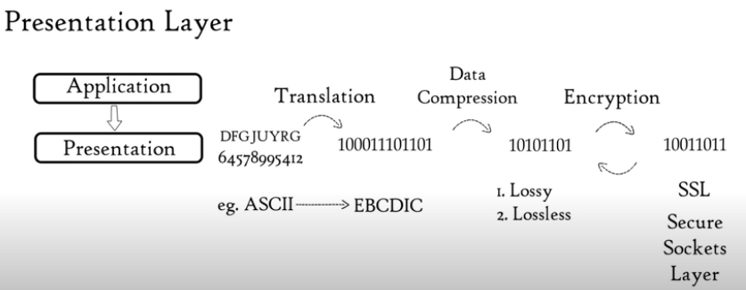
- Recives data (ASCII) from application layer 
- Presentation layer **converts** ASCII to machine representable binary format - encoding
```bash
1byte = 8bits 
ASCII is stored as a 8-bit byte 

each word in the message is rpresentated its respective ASCII format. This is converted to machine code format (EBCDIC). EBCDIC was developed to enhance the existing capabilities of binary-coded decimal code.
```
- before data is transmitted to the next layer the converted binary format is then compressed by reducing bits (for transmitting data faster). 2 types of **data compression** is lossy and lossless.
- data is also **encrypted** on sender end using SSL protocol and **decrypted** at reciever end which enhances the security.
3. Session layer
-  creates communication channels between sender and reciever, called sessions between devices using API's, to establishing session server needs to **authenticate and authorize** the computer its connecting to
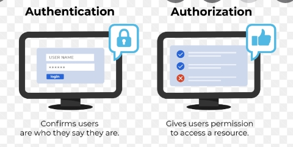
- NETBIOS is an API which allows applications on different computers to communicate with each other 
- It is responsible for opening sessions, ensuring they remain open and functional while data is being transferred, and closing them / termination when communication ends.
- helps in session management 
Session Management is a mechanism used by the Web container to store session information for a particular user. There are four different techniques used by Servlet application for session management. They are as follows:
- Cookies
- Hidden form field
- URL Rewriting
- HttpSession
4. Transport layer
- helps in transmitting data through UDP (connectionless orientation transmission - some data packets gets lost eg: video games, voip, online streaming) and TCP (connection orientation transmission - 100% data transfer eg: www, email, file transfer, messages) it acheives this through segmentation (data that is recived from the session layer will be divided into tiny data units called **segments**). 
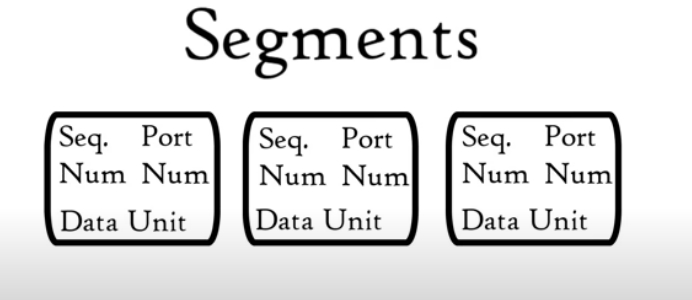
- each segment would contain **the source and destination port number and sequence number**. While port number helps the data packets to reach the correct application of the targetted IP adress, sequence numbers help to reassemble segments in correct order so the correct message can be recieved at the reciever end. 
- Control amount of flow of data into the application based on your network speed. (Lets say the sender side / server can process data at the speed of 100mbps but the person at the reciever end can only process data upto 10mbps, so take an example were downloading file from the server which is sending data packets at the speed of 50mbps which is greater than the rate the reciever end can process (so if server continues sending at this rate data would be lost in the process), so through the transport layer it can reduce the speed of data transmission rate to reach 10mbps)
- Error control - if any data packet doesnt arrive at the reciever end, transport layer does automatic repeat request to transmit the lost data. it also puts a **checksum** which ensures that if say the data stopped downloading, and we wanted to restart the download process then this time it would start from the last checkpoint it stopped downloading from.
-  assembling segments with the necessary information and passing them to the network layer is called multiplexing.
5. Network layer
- converts segments to **packets**
- helps in transmission of packets from senders network to recievers network which is acheived through modem
- Logical Adressing - network addressing assigns private IP address of sender and reciever to the data packet and a subnet mask of 255.255. 255.0
```bash
The main difference between MAC and private IP address is that MAC Address is used to ensure the **physical address of the computer**. It uniquely identifies the devices on a network. While IP addresses are used to uniquely identifies the connection of the network with that device takes part in a network AKA the **logical address of the computer**.

The ip adress modem provides for each device in your Lan network using DHCP is distinct and its the private IP. but inside each device there is a NIC card which allows your computer to connect to the network, NIC contains a distinct MAC address (physical address)

MAC addresses are physical addresses used by the (usually) Ethernet hardware to direct traffic in the LAN, and IP addresses are logical addresses that allow you to build a larger network than a single LAN segment - public or private.

MAC addresses are meaningful inside a local LAN segment while private addresses are meaningful inside a private, coordinated network that can even span the globe

a common subnet mask for simple home networks is 255.255. 255.0 . This subnet mask allows up to 254 usable IP addresses within the home network. In other words, up to 254 computers, phones, and other internet connected devices can connect to your router/network and access the internet
```
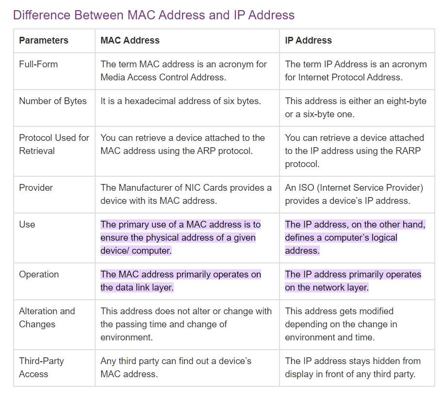
- Routing - moving data packet from source to destination
- Path determination - finding the best possible route to transfer data packets using protocols like OSPF (OPEN SHORTEST PATH FIRST), BGP (BORDER GATEWAY PROTOCOL), IS-IS (INTERMEDIATE SYSTEM)
- load balancing
6. Data Link layer
- converts data packets (contains IP adress + subnet mask) to frame 
- Physical addresing is done here which adds MAC adresses (which is embedded in NIC card) of both the sender and reciever to the data packet, this has now become the frame (data unit of data link layer)
- data transfer speed is maintained here 
- A media access control (MAC) is a network data transfer policy that determines how data is transmitted between two computer terminals through a network cable. The media access control policy involves sub-layers of the data link layer 2 in the OSI reference model.
7. Physical layer 
- convert frame to bits and transfers it to reciever in form of signals - send frames passed through data link layer through transmission medium 
- decide whether data should be send wired or wireless, sends data from senders modem to recievers modem.

#### TCP / IP Protocol Suite 
- It can be either 4 / 5 layer architecture based on the reference books
- OSI Model was more of a theorotical model, while TCP/IP is an implemented model developed by ARPANET and funded by  Defense Advanced Research Projects Agency, the research branch of the U.S.
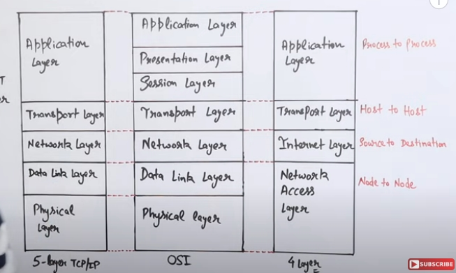

1. Application layer / process to process
2. Transport layer / host to host - transmits data either wireless or wired 
- segments formed here. each segment would contain **the source and destination port number and sequence number**.
3. Internet layer / source to destination - uses both IPV4 and IPV6
- converts segments to **packets** by assigning logical addressing - private IP address of sender and reciever to the data packet and a subnet mask of 255.255. 255.0
4. Network acess layer / Node to Node 
- converts packets to frame by appending senders and recievers MAC address to the data packet.
- transfers data from senders network to recievers network 
- Flow Control also monitored here 

#### How data is transfered?
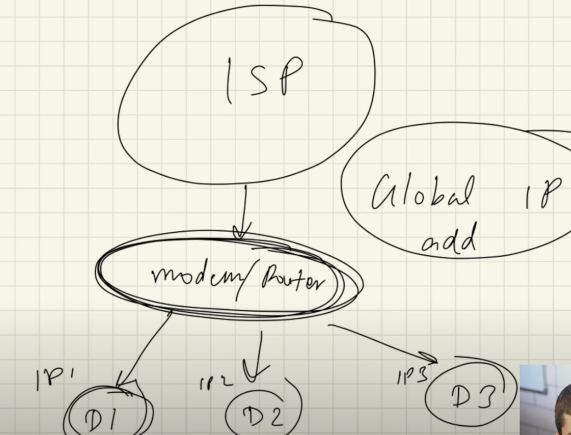

- modem is a medium to provide internet to home and router is a medium to create network (LAN) in house by routing data packets to the IP adress. modem is connected to the router 
ISP provides modem which is connected to the Internet,(sometimes the ISP can provide a modem-router and sometimes they provide only modem (in this case you can buy a compatible router which works with the modem)) All the devices connected to this modem provided by the same ISP will have a public IP address which would be the same for all the users who brought services from this particular ISP. All individual devices connected to the modem have their own IP adress that is assigned by DHCP (dyanamic host configuration protocol), this is known as private / local IP adress. 

- ISP (Tier 2 ISP like airtel, vodafone, jio) is connected to a larger ISP (Tier 1 Service Provider like TATA)

- Web pages are using HTTP protocol
Everytime a HTTP request is made from client to server, its made through the HTTP protocol, the server returns the HTTP response to the modem which then decides which local IP should it send the data packet to. This is called **network access translator**. To specify which application in that local IP device made the request, is identified through **port number**. Ip adress identifies your computer. Port number identifies the application. Port is a 16-bit number (can contain 0, 1), total combination of port numbers that can be possible are 2^16 (65,000)

- What ports can you use for connecting to web server (Apache)?
```bash
#Ports:
80        -> HTTP reserved port 
143       -> HTTPS reserved port  
2707      -> mongoDB reserved port
1433      -> SQL 
0-1023    -> reserved port
1024-49152-> reserved for other applications

#By default the Apache server runs on Port 80.
```

- A public IP address is an IP address that can be accessed directly over the internet and is assigned to your network router by your internet service provider (ISP). Your personal device also has a private IP that remains hidden when you connect to the internet through your router’s public IP.

- Public IP addresses can be traced back to your ISP, which can potentially reveal your general geographical location. To browse more securely you can use seecuritty protocols like proxy servers, VPN's or use more private secure browsers like Torr, Brave or Firefox for browsing. 

> Can I connect any router to modem provided by ISP
Any router will not work with the modem provided by ISP (Internet Service Provider) because it has to be compatible with the internet connection type offered by the ISP. The different types of connections offered include DSL (Digital Subscriber Line), ethernet cable, and satellite.

> What are the versions of IP:
There are 2 different versions of IP as follows.

#### IPv4 (IP version 4) 
- IPv4 employs a 32-bit address. 
- It is composed of four numbers separated by a ‘dot’ i.e periods, these numbers seperated by period is called an octet (byte). 
- Each number in the octet can range from 0 to 255.
`Example – 172.166.3.28`

#### IPv6 (IP version 6) 
- IPv6 is the next generation of Internet Protocol addresses. 
- In comparison to IPV4, IPv6 has a larger address space. 
- IPv6 has a length of 128 bits and is written in hexadecimal. 
- It is composed of eight fields, each of which contains two octets. As a result, IPv6 has 16 octets in total.
`Example – 3221:1cd7:74b6:6da7:0000:0000:7349:6472`

#### Speed of Data Transfer 
data is transffered in packets, in chunks. every packet of data is represented in the form of a combination of 0's and 1's. A bit can only be 1 or 0, its called a bit in binary lingo and these 0's and 1's are called binary digits, because computer use base two math. 
```bash
## Bits
1bit = 8 byte 
3bit = 0.375 bytes

## Bits per second / Bytes per second - measure of data transmission speed 
3mbps = 3megabits/s (mbps) or 0.375megabytes/s (MBps)
```
Speed in which data is transffered over the internet between client and server is measured in is called **broadband speed**. 

> To simplify data transfer rates, an International System of Units prefix is used. These include kilo, mega and giga.
```bash
#how many bits of data can be transffered / second 
1mbps = 10^6 bits / s   #1 million
1gbps = 10^9 bits / s   #1 billion
1kbps = 1000 bits / s
```
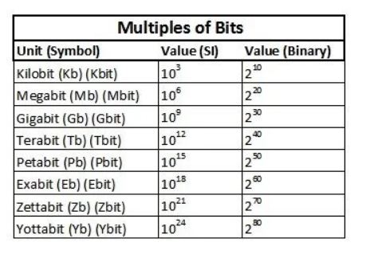

> What is download and upload speed?
When data transffered from our computer to other computer -> upload. Speed at which document uploaded is called upload speed

When data transffered from other computer to our computer -> download. Speed at which document is downloaded is called download speed. 

```bash
#Recommended range:
A good download speed is at least 100 Mbps
a good upload speed is at least 10 Mbps.

#for instance, our wifi has 46mbps download speed and 69mbps upload speed with a latency of 3ms
```
> Gigabit vs Megabit internet 
Gigabit internet is worth it if you use a large amount of bandwidth on a regular basis. It’s also worth it if you share your Wi-Fi with a bunch of roommates or family members. But it’s expensive and faster than most people need, so it’s not worth it for the average user.

### Random commands 
1. to find all devices connected to network `arp -a `
```bash
Interface: 192.168.0.102 --- 0x3
  Internet Address      Physical Address      Type
  192.168.0.1           7c-8b-ca-be-13-6c     dynamic
  192.168.0.101         1a-34-13-9f-1e-d2     dynamic
  192.168.0.255         ff-ff-ff-ff-ff-ff     static
  224.0.0.22            01-00-5e-00-00-16     static
  224.0.0.251           01-00-5e-00-00-fb     static
  224.0.0.252           01-00-5e-00-00-fc     static
  239.255.255.250       01-00-5e-7f-ff-fa     static
  255.255.255.255       ff-ff-ff-ff-ff-ff     static

Interface: 192.168.0.108 --- 0x7
  Internet Address      Physical Address      Type
  192.168.0.1           7c-8b-ca-be-13-6c     dynamic
  192.168.0.101         1a-34-13-9f-1e-d2     dynamic
  192.168.0.102         3c-91-80-ac-6f-df     dynamic
  192.168.0.255         ff-ff-ff-ff-ff-ff     static
  224.0.0.22            01-00-5e-00-00-16     static
  224.0.0.251           01-00-5e-00-00-fb     static
  224.0.0.252           01-00-5e-00-00-fc     static
  239.255.102.18        01-00-5e-7f-66-12     static
  239.255.255.250       01-00-5e-7f-ff-fa     static
  255.255.255.255       ff-ff-ff-ff-ff-ff     static

Interface: 192.168.182.1 --- 0x19
  Internet Address      Physical Address      Type
  192.168.182.255       ff-ff-ff-ff-ff-ff     static
  224.0.0.22            01-00-5e-00-00-16     static
  224.0.0.251           01-00-5e-00-00-fb     static
  224.0.0.252           01-00-5e-00-00-fc     static
  239.255.255.250       01-00-5e-7f-ff-fa     static

Interface: 192.168.8.1 --- 0x1e
  Internet Address      Physical Address      Type
  192.168.8.255         ff-ff-ff-ff-ff-ff     static
  224.0.0.22            01-00-5e-00-00-16     static
  224.0.0.251           01-00-5e-00-00-fb     static
  224.0.0.252           01-00-5e-00-00-fc     static
  239.255.255.250       01-00-5e-7f-ff-fa     static
```
2. to find ip address 
All IP information for all network adapters in use by Windows will be displayed.
```bash
Windows IP Configuration

   Host Name . . . . . . . . . . . . : LAPTOP-STPFEIDA
   Primary Dns Suffix  . . . . . . . :
   Node Type . . . . . . . . . . . . : Hybrid
   IP Routing Enabled. . . . . . . . : No
   WINS Proxy Enabled. . . . . . . . : No

Ethernet adapter Ethernet:

   Media State . . . . . . . . . . . : Media disconnected
   Connection-specific DNS Suffix  . :
   Description . . . . . . . . . . . : Realtek PCIe GbE Family Controller
   Physical Address. . . . . . . . . : B4-A9-FC-03-74-C7
   DHCP Enabled. . . . . . . . . . . : Yes
   Autoconfiguration Enabled . . . . : Yes

Unknown adapter Local Area Connection:

   Media State . . . . . . . . . . . : Media disconnected
   Connection-specific DNS Suffix  . :
   Description . . . . . . . . . . . : TAP-ProtonVPN Windows Adapter V9
   Physical Address. . . . . . . . . : 00-FF-78-42-07-97
   DHCP Enabled. . . . . . . . . . . : Yes
   Autoconfiguration Enabled . . . . : Yes

Wireless LAN adapter Local Area Connection* 4:

   Media State . . . . . . . . . . . : Media disconnected
   Connection-specific DNS Suffix  . :
   Description . . . . . . . . . . . : Microsoft Wi-Fi Direct Virtual Adapter #4
   Physical Address. . . . . . . . . : 32-B5-C2-1F-F2-2F
   DHCP Enabled. . . . . . . . . . . : No
   Autoconfiguration Enabled . . . . : Yes

Ethernet adapter VMware Network Adapter VMnet1:

   Connection-specific DNS Suffix  . :
   Description . . . . . . . . . . . : VMware Virtual Ethernet Adapter for VMnet1
   Physical Address. . . . . . . . . : 00-50-56-C0-00-01
   DHCP Enabled. . . . . . . . . . . : No
   Autoconfiguration Enabled . . . . : Yes
   IPv4 Address. . . . . . . . . . . : 192.168.182.1(Preferred)
   Subnet Mask . . . . . . . . . . . : 255.255.255.0
   Default Gateway . . . . . . . . . :
   NetBIOS over Tcpip. . . . . . . . : Enabled

Ethernet adapter VMware Network Adapter VMnet8:

   Connection-specific DNS Suffix  . :
   Description . . . . . . . . . . . : VMware Virtual Ethernet Adapter for VMnet8
   Physical Address. . . . . . . . . : 00-50-56-C0-00-08
   DHCP Enabled. . . . . . . . . . . : No
   Autoconfiguration Enabled . . . . : Yes
   IPv4 Address. . . . . . . . . . . : 192.168.8.1(Preferred)
   Subnet Mask . . . . . . . . . . . : 255.255.255.0
   Default Gateway . . . . . . . . . :
   NetBIOS over Tcpip. . . . . . . . : Enabled

Wireless LAN adapter Wi-Fi:

   Connection-specific DNS Suffix  . :
   Description . . . . . . . . . . . : Qualcomm Atheros QCA61x4A Wireless Network Adapter
   Physical Address. . . . . . . . . : 3C-91-80-AC-6F-DF
   DHCP Enabled. . . . . . . . . . . : Yes
   Autoconfiguration Enabled . . . . : Yes
   IPv4 Address. . . . . . . . . . . : 192.168.0.102(Preferred)
   Subnet Mask . . . . . . . . . . . : 255.255.255.0
   Lease Obtained. . . . . . . . . . : 19 October 2022 14:09:08
   Lease Expires . . . . . . . . . . : 19 October 2022 17:09:09
   Default Gateway . . . . . . . . . : 192.168.0.1
   DHCP Server . . . . . . . . . . . : 192.168.0.1
   DNS Servers . . . . . . . . . . . : 192.168.0.1
                                       0.0.0.0
   NetBIOS over Tcpip. . . . . . . . : Enabled

Wireless LAN adapter Wi-Fi 2:

   Connection-specific DNS Suffix  . :
   Description . . . . . . . . . . . : Realtek RTL8188EU Wireless LAN 802.11n USB 2.0 Network Adapter
   Physical Address. . . . . . . . . : 30-B5-C2-1F-F2-2F
   DHCP Enabled. . . . . . . . . . . : Yes
   Autoconfiguration Enabled . . . . : Yes
   IPv4 Address. . . . . . . . . . . : 192.168.0.108(Preferred)
   Subnet Mask . . . . . . . . . . . : 255.255.255.0
   Lease Obtained. . . . . . . . . . : 19 October 2022 12:16:53
   Lease Expires . . . . . . . . . . : 19 October 2022 17:09:02
   Default Gateway . . . . . . . . . : 192.168.0.1
   DHCP Server . . . . . . . . . . . : 192.168.0.1
   DNS Servers . . . . . . . . . . . : 192.168.0.1
                                       0.0.0.0
   NetBIOS over Tcpip. . . . . . . . : Enabled
```
> It shows 2 network adapter for wifi because we have 2 wifi connections
```bash
A wireless network adapter is a device that connects your PC to a wireless network.
```
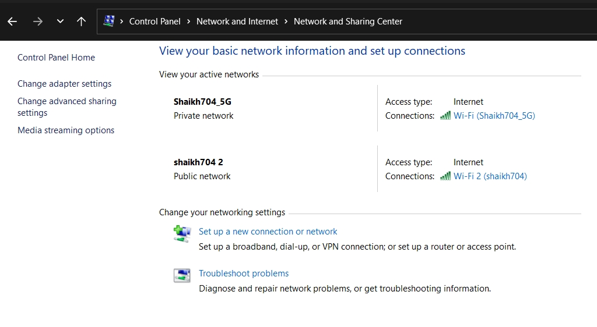

#### How does communication between 2 computers occur?
- guided communication - computers connected with wire, only one way data can be transffered i.e through the wire  
- unguided communication - computers connected to wifi / bluetooth, data can be transffered through any paths. 
  
for quick transmission of data internet packets are passed through 
```bash
submarine cables are fiber optic cables that connect countries across the world via cables laid on the ocean floor. These cables – often thousands of miles in length – are able to transmit huge amounts of data rapidly from one point to another.
```
#### Means of transmitting data 
1. physical / guided communication
Most popular cables used for transmitting data.

> optical fibre vs coaxial cable
- Optical fibre is made up of plastic and glass and is used to transmits signals in form of light or optics whereas coaxial cable is made using plastic and copper wires and is used to transmits signals in form of electric signals.
- Optical Fiber is by far the better choice. It provides a dedicated connection with much higher data speed, higher bandwidth and its lighter and diameter is smaller than coaxial, but installation is only complex. Fiber optic cables are capable of transmitting data at speeds of up to 100 Gbps.

2. unguided communication 
- Bluetooth 
- Wireless Networks 
1. wireless LAN / Wifi 
2. wireless MAN
3. wireless PAN 
4. wireless WAN
```bash
Wi-Fi is one type of wireless technology. It is commonly called a wireless LAN (local area network). WiFi technology allows local area networks to operate without cable and wiring. 

Wi-Fi was invented by AT&T in the Netherlands in 1991. By using this technology we can exchange information between two or more devices

The radio signals are transmitted from antennas and routers that signals are picked up by Wi-Fi receivers, such as computers and cell phones that are ready with Wi-Fi cards. The wifi network provided by router provides hotspot that can be used in public places. 
```
- Mobile Networks 
```bash
1G, 2G, 3G, 4G and 5G are the five generations of mobile networks where G stands for Generation, and the number denotes the generation number. 5G is the latest generation, whereas 1G networks are now obsolete.

The cellular technologies GSM, UMTS, LTE and NR enable 2G, 3G, 4G and 5G 
```
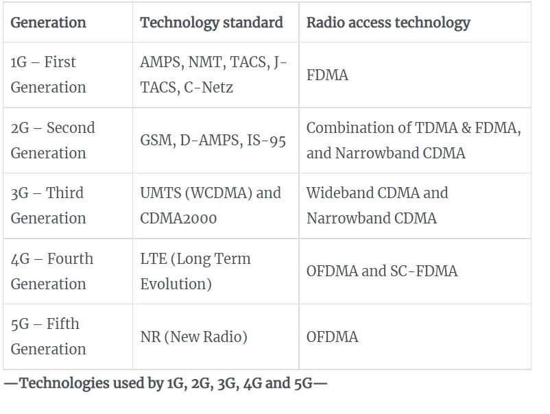

> How technology standards evolved over time
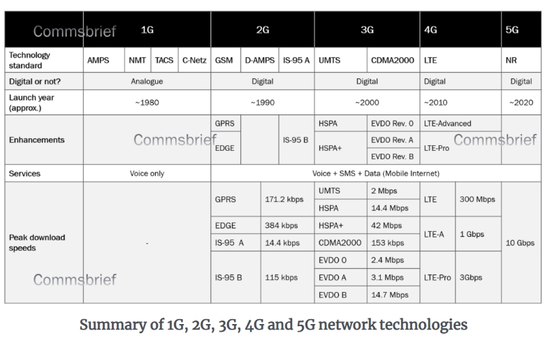

- The 1G was based on analogue mobile system which used the FDMA technology which used seperate frequency bands to transmit and reieve communication without wired connection, but they had security issues since the data transmitted through this technology could not be encypted. 

- Note that; After 2G all generations offer data and voice services on your phone. Every generation provides a better data transmission speed and lower latency than the previous generation. 
- https://commsbrief.com/what-do-the-terms-1g-2g-3g-4g-and-5g-really-mean/

### Types of Networking devices:
1. Repeater 
- operates at the physical layer 
- it regenrates signal bit by bit over the same network if it becomes too weak, they dont amplify the signal 
- its a 2 port device 
- they dont have the intelligence to identify the best route for data packets to travel 

2. Hub 
- its a multiport repeater 
- it contains multiple port 

3. Bridge 
- found in Data link layer 
- it has only 2 ports 
- its a type of repeater but it has additional functionality it can filter content by reading MAC address of source and destination.

4. Switch 
- found in data link layer
- its a multiport bridge which error checks the data packets before forwarding data 
```bash
Error Checking:
There is always the chance that data has been corrupted (changed in some way) during transmission. This is true regardless of the distance of transmission. To avoid having corrupted data it is really important that computers check for errors and correct them wherever possible.
```
5. Routers 
- found in network layer 
- its like a switch but it also routes data packets based on their IP address. They route data packets by keeping a log of them through a dyanamic updating routing table.

6. Gateway AKA protocol convertors 
- to connect 2 networks connected on different protocols, gateways are used.

7. Brouter / Bridging Router 
- Bridge + Router (filter content by reading MAC address + can route data packets based on IP address)
- works either in data link layer or network layer 

> How the components work together?
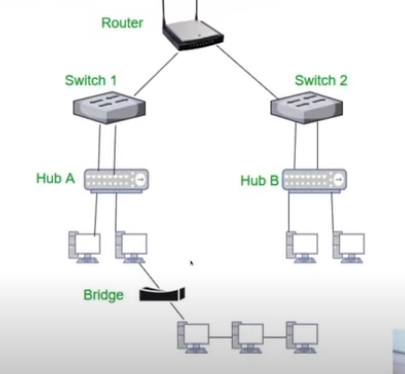

OSI model this is the sequence
- network layer (Router / gateway)
- data link layer (switch / bridge)
- physical layer (hub / repeater)

So technically this is the sequecnce components are formed in 
- Router - for routing data packets 
- Switch - error checks data packets + filter content by reading MAC address
- Hub - regenerates signal 
- Bridge 

> ERROR CODES / STATUS CODES 
```bash 
100: information related code 
200: success code 
300: redirecting code 
404: client error 
500: server error  
```

### Verification process
web authentication methods used to create a more secure verification process. 

#### Cookies 
While HTTP is stateless the state saving behavior is still prevalent in case of cookies which are stateful elements

- the traditional approach on the web is cookie-based server-side sessions 
- Cookie is a unique string which is stored on the client browser 
- the process begins with a user filling out their username
and password and then submitting it to a server which then validates it creates a session in the database
- then responds with a session id the session id will be saved in the browser's cookie jar which is a place in the browser to save key value pairs
- Whenever you make a new request in the requst header the cookie will be send to validate the cookie in the server session database (which contains session ID which contains cookie), if the sesson ID is present then it will log you into the website without enteringb credenetials 

> Cons:
- it can be vulnerable to an attack known as cross-site request forgery where the attacker points the user to a site they're logged into to perform actions they didn't intend to like submitting a payment or changing their password
- you'll eed to store the session ID in the database since most of the cloud applications are scaled horizontally it can be big bottleneck in production.
- everytime you accept cookies on a website your technically allowing them to store their cookie on your web browser which would then collect your personal data and track your browser and inturn use uou for advertising 
- these cookies can inturn be intercepted by hackers, to prevent your cookies to be hacked either completely erase them or if your using a public wifi then use the privae and ignonto mode 

> Where are cookies implemented?
- cookie saved on your browser makes it so you don’t have to re-enter your log-in information every time you visit one of your favorite websites.
- Cookies can also remember your shopping preferences so that you get a personalized experience when you visit the website.  - track how you use a website, how often you go there, your IP address, your phone number, what types of things you look at and buy, and other information you may not want to share.

> Which cookies are safe to accept 
- generally first party cookies are cs they use your info for their own advertising. However third party cookies send all your browsing data to brokers (it sets cookies for all the URLS you didnt set)
- if you accepted cookies by mistake or if you dont want to be bombarded with bs ads then clear cookies 

#### TOKEN BASED AUTHENTICATION 
A token can be defined as a digitally encoded signature used to authenticate and authorize a user to access specific resources on a network.

- the process begins with a user filling out their username
and password and then submitting it to a server which then creates a JSON WEB TOKEN (JWT) with the help of private key found on the server 
- this JWT is sent to the clients browser where its stored in the local storage 
- Everytime the client makes a subsequent request to the server the JWT is attached to the authorization request headers and all the server has a secret key which validate the digital signature 
- that's way more efficient when dealing with a distributed system in the cloud

> Pros;
- stateless that mean it doesnt store the previous session state 
- most secure way of offering authentication

> Cons:
- Data overhead - the size of JWT is compariby more than the size of a regular session so it can take more time than a normal session token to validate 
- they have shorter lifespan for example in case of OTP verification tokens are used 
- JWT uses only one key for authorization 

> How is it used in 2 FACTOR AUTHENTICATION
 Token authentication is typically used in conjunction with password authentication for an added layer of security. This is what we refer to as two-factor authentication (2FA).

 That means even if an attacker successfully implements a brute force attack to take out any password in place, they’ll have to also bypass the token authentication layer. Without access to the token, gaining access to the network becomes increasingly difficult.  

 As part of the login process, users receive a cryptographically secure one-time passcode that is time-limited to 30 or 60 seconds

 tokens can only be gleaned from the device that produces them which are generayed via an authenticator app or Tokens sent as texts are riskier because they can be intercepted during transit.

 - client makes request to the server by clicking on verify otp
 - server generates a token with the help of a private key and sends it to the client side where its stored in the local storage of the brwser. token generator generates the pin code that would be used for verification on the clients mobile.
 - when client enters the token and hit send the request goes to the server this token stored on the local storage and the pin code is sent via the request headers to the server where its validated by signing the token digitally.

#### How email works?
- SMTP used for sending emails 
- POP3 (post office protocol) / IMAP (internet message access protocol) protocol is used for recieving emails 
- uses transport layer protocol - TCP procol to ensure that no data is lost - connection oriented transmission

> How is data transfferred from say google mail to yahoo mail?
- sender sends the data to the senders SMTP server 
- the mail passesed from senders SMTP server to the reciever SMTP server 
- from recievers SMTP server it reaches the reciever 

> How to download email via POP3 ?
- client connects to POP server by authorizing itself and transacts all the emails frrom the pop server 

> Difference between POP3 and IMAP?
- IMAP allows you to access mail on multiple devices you can sync all the devices 

#### DOMAIN NAME SYSTEM 
When you enter google.com it will use DNS to find the ip address of the google server.

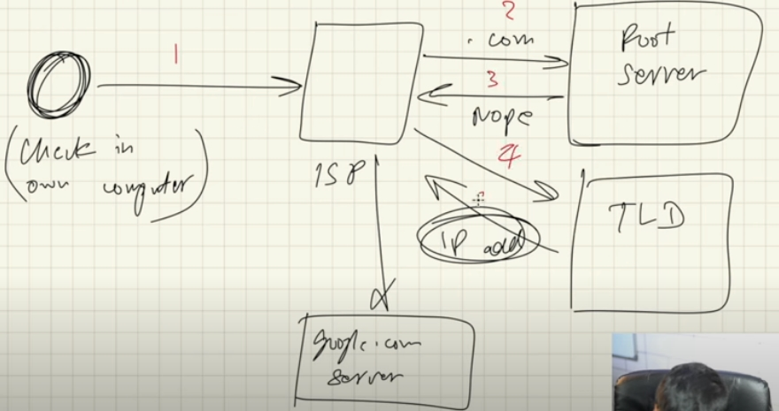
- When you type a URL at client side it connects to the internet via ISP (first it checks its own cache if this website IP address is available), if its not then it sends it to local DNS server (root server) if it doesnt find it here then it'll try to find it in TLD server, which would convert URL to its relevant IP address and return the IP address back to the client (which will then be stored in clients cache)

> Domains 


> What is root domain?
When you register a website name or domain name, you are registering a root domain. This means you have the access to create subdomains and file structures all branching from that root domain.

> What is root server? 
Root servers are DNS nameservers that operate in the root zone. 

The root servers contain the information that makes up the root zone, which is the global list of top level domains. The root zone contains:

- generic top level domains – such as .com, .net, and .org

- country code top level domains – two-letter codes for each country, such as .se for Sweden or .no for Norway

- internationalized top level domains – generally equivalents of country code top level domain names written in the countries’ local character sets

- Root DNS servers have a bunch of TLD's registered with it. Its maintained by ICANN


