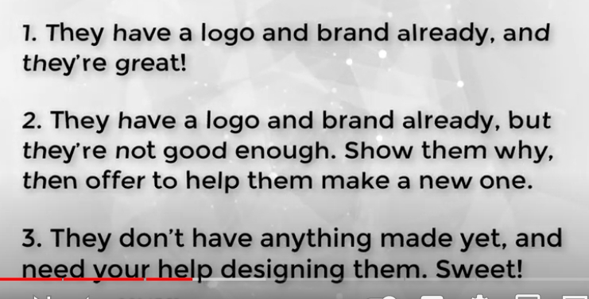

#### Register on freelancing platforms 
https://www.guru99.com/best-freelance-websites-for-beginners.html

#### WEB DESIGN QUESTIONARE 
1. whats your budget 
2. whats your launch date / do you have a time frame? do you have a timeline?
3. what makes your website / initiaitve unique or like whats your USP
whats your primary reason to make a website is it to 
- get more customers
- get more leads
- get more email suscribers 
- brand awareness
- grow your social media following 
4. how will you attract new visitors to your website 
5. what features are needed for your site 
6. do you have established branding, messaging or style guidelines
7. what do you like or dislike about your top competetors 
8. what are your 3 favorite sites and why do you like them
9. what are your expectations from your website 
- increase in traffic (SEO)
- sales 
- social media engagmenet 
- referrals \volunteers
- increase in enquiries 
- event registrations 
10. how will you attract new visitors to your site? interactive functionalities?
- forms 
- live chat 
- galleries 
- ecommerce 
1.   do you have a color theme, any specific fonts in mind?
2.   additional services would be 
- content creation (logos)
- seo optimation (to rank your website on google search engines)
- copywriting (word writing content for your website)
- UI/UX design (before i code out the website i'll send mockups)
- proofreading if your content is already written. high quality content.  
- rebranding (how are you making your insta posts, do you have an established google mybusiness account)
1.   whats your business name 
- do you have a logo

- are you going to register this business name 
1.   what would be your preffered URL?
2.   what would be your hosting option? free or paid 
3.   what is your vision for your brand (3-5 adjectives for your brand)
4.   what do you offer and who you serve (who's your target audience)
5.   for someone whos never heeard of your business describe wht you do? who are you trying to help and what are your trying to help them with
6.   website inspiration and insights 
- list websites from any niche that you love 
7.   how do you want your visitors to feel when they visit your website
-  whats your call to action 
-  whats the first step your hoping your visitors will take whn they lnd on your website
-  make a pinterest board of 10-15 images that remind you of your brand 

### How to host a website?
you need to purchase domain and hosting 

> consider hosting like a house and domain as an address. your weebsite is stored on the the hosting server and the address of your website is on the domain 
- how would you purchase domains.
- first we'll check if the domain name your trying to purchase is available or not 
```bash
purchase domain from crazydomains.in (745rs/yr)
purchase hosting from hostinger.in (99rs/month -> 1188rs/year)
sync both these together 

do you have any preferable top level domain like .com .in 
second level domain - your business name

in netlify you can place your own second level domain but you cannot have your own top level domain
.netlify.app
```
### ADDITIONAL SERVICES 
1. i do photoshop and graphic design stuff 
- make posters
- social media posts 
- thumbnails 
- business cards 
- magazine covers 
- market related posts 
- remove background from images 
2. rebranding 
- market research and competetive analysis 
- create a logo or we'll revamp your logo
- whay is ur usp and based on that we form strategies to make you stand out

### ADDITIONAL THINGS YOU CAN ADD TO YOUR WEBSITE 
- support group initiative / self-help groups create a safe space for people to vent out and talk. 2 modes of meet either in different locations offline or zoom meets. you could do something like group therapy training. 8 meetings over 8 weeks 
- you could create a blog space taking blog entries from people interested to contribute and credit them and you could also repurpose or reuse this content for your insta posts 
- you could create a linkedin business page for it, twitter, fb along with instagram for a better reach. 
- how is your session going to be? online, offline?

#### How cookies work in affliate marketing?
whenever you go to any online booking site where cookie is enabled then that computer can drop a file named cookie in our file which stores all the content regarding our browser habits and this is used for advertising purposes

Websites implement cookies to track user behavior. This can include things like usernames and passwords, shopping activity, and items left in a digital shopping cart.

> third party vs first party cookies
First party cookie only tracks and stores your data for that one specific website you visited and accepted the cookies from. they dont share your info to any other third party or websites.
In theory, first party cookies improve and personalize your experience on the site. For example, when you visit an ecommerce site, and it remembers personal user data such as email addresses and passwords — that’s a first-party cookie at work. 

third party cookies is created from one website and it can trackc your entire search activity and use that to bombarrd you with irrelevant ads. but if there is one use of thrid party cookie its for live chat
```bash
We use cookies to track visitors, measure ads, ad campaign effectiveness and analyze site traffic. We may also share information about your use of our site with 3rd parties. For more info, see, ourCookie Policy and ourPrivacy Policy.
By clicking on "Cookie Preference Manager" you can choose to enable only certain cookie categories. By clicking "ACCEPT ALL" you agree to the storing of all cookies on your device. In case you don't choose one of these options and use our website we will treat it as if you have accepted all cookies.
```
### plan 
- first we'll understand your requirments
- we'll finalize your website name 
- you have a proffesional email right? whenever anyone fills the subscription form on your website their details will be send on your mail. 
- you can see a few social media posts mockups. 
- then we'll create logo
- I'll give you an overview of the web design UI mockup once its finalized 
- i'll start coding and make it responsive 
- after its done we'll add any more features if required 
- to get a feel of your website i'll host it on a free hosting platform 
- after your finalized with the website, then we'll get it hosted on hostinger and link it with the domain

### Structure of your website 
- its going to be a single page website as you said, you click on the menu bar and it will redirect you to that portion of the page 
- we can create a toggle menu bar on the upper rhs 
- and social media links on the lhs alligned vertically 
- we'll have alot of illustrations along with these sections
- first section will kind of be an intro to your business
- secnd section would be about us which would be a little elaborate about your business
- we can add the services your offer 
- a contact me section
- pricing plans section, we can create a cta a button on the bottom of every pricing plan section which says select plan and once the user selects it a popup occurs from below which shows what plan you selected and prompts you to checkout, so on the checkout button i'll integrate your paypal.me link, but if you dont want that feature we can simply remove the button from the pricing plan card 
- faq section
- a blog section. to start off we can have a few blogs by random people who wish to contribute in return for exposure, if people contribute and the topics relate with people it will make them connect with your business more and its better for the SEO, since people would be redirected to your website through a blog search they made. also you can repurpose this blog content from the website for your social media posts. if you want for around 3 blogs I'll include it in the package, but if you want to add further more then I would need to integrate it with a content management system which allows you to add content to your blog, to integrate that would be around 5k rs in the market, but since your family if you want again I'll do it for 800rs
- then we'll have suscribe to my newsletter section in the footer, also in the footer we'll have your address (linking to the google map), we'll have a call option where users can place a call just by clicking on the link, we'll have send us a mail option which will link the user directly to your mail id.
- we'll also have a live chat bot on the bottom lhs which will allow users to talk with you in real time 
- and if you want we can also have a popup, say you offer free consultancy for the first call, we can show a popup which would ask users whether they want a free consultancy and if they enter their details in the form, the moment they hit submit now you know people who are interested in availing your service atleast, these are your leads, you can use their mails for mail marketing, after a clients first call they'll figure out whether they can trust the therapist or not. so on basis of that you can build some rapport and take advantage of the first free counselling call (which should have a time limit say 15-20mins)
- then if you wish to bring more attention to your firm you can start something called support groups, you would charge people a part for the place your renting and a part for the meetup. you could host it like you know in cat cafes, open mics for people to vent regarding mental stigmas, art workshops, heal through art. a walk in strangers meetup
```bash
changing the world, one conversation at a time

Counselling, Therapy, Emotional Resilience Workshops, Awareness Campaigns, Support Groups, Strangers Meetups, Events and Collaborations, Mental Health Counsulting, and Merchandise
```
Now to expand you'l need to give alot of emphasis to your social media presence that insta, linkedin, facebook and twitter, register your business and put it on google my business, have some good reviews and testimonials. because most of your clients are going to first check your social handles before contacting you 

now if you want to help you with the branding, i can help you with the graphic designing aspect that is creating insta posts, email pamphlets, business card, insta reels to increase engagement. so I'll cover the entire graphic content and the copywritting but the branding aspect would actually take a lot more time and efforts like atleast a couple hrs every day, so if u want the branding along with it then it would be 700rs/month for the branding alone. but if you want to skip the copywritting then it'll just be 500rs/month.

there's other aspect you'll need to figure out that is digital marketting, how to rank your website to the top of search engines, implement the right search engine optimisation techniques, how to increase your reach on social media platforms and increase your website traffic, increase your customer engagement, now thats another niche in itself, which would help you get offline clients and improve your brand image. in college i had this pr/web agency which was like a fullfledged offline+online marketing agency, so we'd take care ofbuilding the website, maintaing it, then the branding, then the digital marketing, we would handle our clients event management page, and we would also get clients to appear for events thats public relations. since i was the pr director of rotaract and i would do alot of pr for alot of event management firms i had a lot of contacts, now each of these firms had their own internal management like pr / marketting / graphic designing. so we would offer these firms the entire package the entire management so they could work more on scaling their business. we would do the entire market research, we'd make spreadsheets with their competetors, we'd point out where their are areas of improvement and we'd kind of collaborately work toegther to fix it. at that time we'd charge around 4000 for social media handling + public relations which would still around half the cost that they would've paid for their internal management. 

so I'm not doing digital marketing / PR rn i/m sticking to web development and branding because dm takes alot of time and not everyone can afford it right. if i were to even consider doing you know digital marketing and PR it would go around 2k/month because this stuff literally takes your entire day and you wont even realize it. you see people going upto 10k-20k because this is a huge responsibility. your scaling a persons entire brand image and their entirely dependent on you. 

However if your interested for say a portfolio website, like an online resume then that would be 400rs, and if you would want to setup a seperate blog  or you want to integrate it with your website that would be an additional 800rs. And if your dad wants a website for his business depending on his requirment i'd quote the price, like i said the price im charging you is what people charge hourly. and the website im making for you would be starting 3k in the market. people dont even do infinite revisions, they have max 3-4 thats it, and if you want to avail their website maintaining service, they charge around 500-1000rs monthly. im not even going to charge you extra for the website maintainence. 
```bash
phychology website - 700rs with maintainence 
portfolio website - 400rs
blog integration - 800rs
branding + copywritting - 700rs 
branding lik ecreating graphic posters for social media- 500rs 

social media handling + digital marketing - 1000/month 
#if you dont want social media handling then thats okay i'll forward you a market research on social media handles that me and ryn were doing
#we were going to start like a phychology based social handle to address mental health issues
```
### What to make 
- graphic design portfolio 
- video content hosting website 
- revamp elevate agency 
- create art ecommerce 
- blog website integrate with wordpress 

#### Outcome 
- reviews on linkedin and freelancer. after getting 100 good reviews, scale price up a bit
- setup a whole business 
- scale up on freelance 

### Things to do for the website 
- replace twitter and instagram with whatsapp and call icon 
- create logo and svg 
- blog detail page for 3 each 