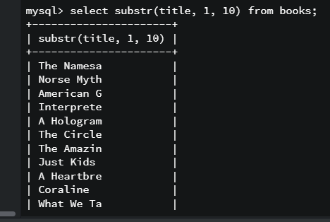
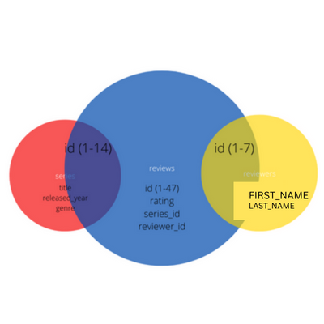

> Why does data matter?
data is knowledge, data is money (companies buy data). huge booming industry. 

each person is producing 4mb / second of data.

> Data visualization
software: powerBI, Tableu we can visualize data using PI charts / histograph 

> What is a database?
collection of data. To store multiple tables we need a database. 

A structured set of computerized data which is accesable using CRUD operations. 

example, 
- library management system 
- marks record 
- phone book 
- flipkart / amazon 

> Difference between structured and unstructed data?
structured data is in number and text format. and unstructured data in images, audio, video format.

> What is SQL?
SQL is RDBMS for accessing and manipulating the data. Its used for retreiving a specific data which we can access by writing a query. When we have large amounts of data, we'll use SQL. 

> DBMS is intermediate beyween app and dtaabase 
```bash
app ------ DBMS ----- database 
```
> Types of RDBMS technology (STRUCTURED DATA) [all these technologies use SQL]
- mySQL
- PostgreSQL 
- Oracle DB
- SQlite 

> Difference between structured data and unstructured data 
IN CHAT APPLICATIONS, we send photos, links etc we use unstructured data -> noSQL -> mongoDB 

> A breif history 
SQL became a standard in 1986 by ANSI (american national standard institute)
it again became a standard in 1987 by ISO (International organisation for standardization)

To store data securely, perform tons of operations, to manage the database we need SQL. Its just a language used to talk to the database. 

> SQL is used by?
- business proffesionals 
- data scientists 
- develops 
- accountants 

### Difference between SQL and mySQL?
- sql is language used to talk to the database in english language 
`find all users older than 18` 
- mySQL is language used to talk to the database in machine language 
`select * from user > 18`


### Use this online IDE for SQL 
- GOORM IDE 

### commands 
1. To get into mysql database server 

```bash
mysql-ctl cli;
#ctl - control transaction durability 
#cli - command line interface 
```
> MAKE NOTE OF THESE CREDENTIALS:
```bash
rooer: root 
database name: mysql 
```
2. `show databases` - see previous list of  databases
3. `CREATE database <databasename>` - create new database 
database name can be in these cases:
- snake case (hello_world)
- camel case (helloWorld)
4. `DROP database <databasename>` - delete from list of databases 
5. `USE <databasename>` - use a particular database 
6. `Select database()` - to see which database your currently on 
7. Create Table 
```bash
CREATE TABLE tablename ()
    column_name data_type,
    column_name data_type
);
```


8. `DESC <tablename>` or `show column from <tablename>` -  to show description of the table 


9. `DROP table <tablename>` - to drop table 
10. `insert into <tablename>(...) VALUES(...)`
11. `select * from <tablename>`
12. `SHOW tables` - to see tables in particular database 
13. to clear console - cntrl + L

#### Note: By default int values are null 
Its not mandatory to enter in that field 


14. To make the data entry mandatory for a field use `not null`
```bash
CREATE TABLE dogs (
    fname char(20),
    lname char(20),
    age int not null
);

insert into dogs(fname, lname, age) 
VALUES('reli', 'belcher', 13), 
      ('philip', 'frond', 38),
      ('calvin', 'fishcoder', 70);

insert into dogs(fname, lname) 
VALUES('re', 'belcher');
#error: field age does not have a default value 
```


1.  In order to give default value to a particular field 
```bash
CREATE TABLE meow (
    fname char(20),
    lname char(20),
    age int not null DEFAULT 30
);

DESC meow;
```


### Types of Datatypes used in SQL:


## TASK 
1. create pastries table with these specs 
```bash
CREATE TABLE pastries (
    name char(50),
    quantity int 
);

DESC pastries; 
DROP table pastries;
```
2. create people table with these specs 
```bash
CREATE TABLE people (
    fname char(20),
    lname char(20),
    age int
);

insert into people(fname, lname, age) 
VALUES('reli', 'belcher', 13), 
      ('philip', 'frond', 38),
      ('calvin', 'fishcoder', 70);

select * from people
```
3. create an employees table with these specs 
```bash
CREATE TABLE employee (
    id int not null AUTO_INCREMENT PRIMARY KEY, 
    last_name varchar(20) not null, 
    first_name varchar(20) not null,
    middle_name varchar(20) not null,
    age int not null,
    current_stat char(20) not null DEFAULT 'employed'   
);
```


### Primary Key 
- used to uniquely identify a data from a table 
- used to prevent duplicacy / redundant data 
- it should have `not null` attribute which means its manadatory to enter this value 

> There are two ways you can define primary_key 
- first method 
```bash
CREATE TABLE unique_cats (
    cat_id int not null PRIMARY KEY,
    name varchar(100),
    age int 
)
```
- second method 

```bash
CREATE TABLE unique_cats(
    cat_id int not null,
    name varchar(100),
    age int, 
    PRIMARY KEY(cat_id)
);

insert into unique_cats(cat_id, name, age)
VALUES(3, 'fred', 24),
      (2, 'meow', 5);

insert into unique_cats(cat_id, name, age)
VALUES(1, 'cheese', 2);

select * from unique_cats;

#we tried adding another cat_id with the same number 
insert into unique_cats(cat_id, name, age)
VALUES(1, 'tiramisu', 2);
#since duplicate entries are not allowed, it shows error 
```


### CRUD COMMANDS 
## Create command 
```bash
CREATE table cat (
    cat_id int not null AUTO_INCREMENT PRIMARY KEY,
    name varchar(100), 
    breed varchar(100),
    age int
);

insert into cat(name, breed, age)
VALUES('ringo', 'sphynx', 4),
('rbrru', 'persian', 4),
('bro', 'meow', 2)

select * from cat;
```


## Read command 
1. select 
```bash
# selects all columns 
select * from cats;

# selects a partiular column 
select name from cats;
```
2. where - helps get specific output from the table 
```bash
select * from cat where age = 4;

select name, breed from cat where age = 4;

#Note: sql is case-insensitive
select * from cat where name='bro';
```


3. alias - keyword `as` (used for renaming the column name)
```bash
select cat_id as 'id', name as 'kitty_name', age from cat;
```
## Update command 
1. set 
```bash
Update cat set breed = 'short hair' where breed = 'persian';
```


> Update both breeds sphynx with the age 20 
```bash
Update cat set age=20 where breed = 'sphynx';
```


## Delete command 

```bash
DELETE from cat where name='rbrru';
```
- delete all data from table 
```bash
delete from cat;
```
### Creating a table by pasting directly in SQL file 
1. create a sql file named book_data.sql 
2. Add this snippet of code within it and save ti via control + S 
```bash
CREATE TABLE books (
		book_id INT NOT NULL AUTO_INCREMENT,
		title VARCHAR(100),
		author_fname VARCHAR(100),
		author_lname VARCHAR(100),
		released_year INT,
		stock_quantity INT,
		pages INT,
		PRIMARY KEY(book_id)
	);

INSERT INTO books (title, author_fname, author_lname, released_year, stock_quantity, pages)
VALUES
('The Namesake', 'Jhumpa', 'Lahiri', 2003, 32, 291),
('Norse Mythology', 'Neil', 'Gaiman',2016, 43, 304),
('American Gods', 'Neil', 'Gaiman', 2001, 12, 465),
('Interpreter of Maladies', 'Jhumpa', 'Lahiri', 1996, 97, 198),
('A Hologram for the King: A Novel', 'Dave', 'Eggers', 2012, 154, 352),
('The Circle', 'Dave', 'Eggers', 2013, 26, 504),
('The Amazing Adventures of Kavalier & Clay', 'Michael', 'Chabon', 2000, 68, 634),
('Just Kids', 'Patti', 'Smith', 2010, 55, 304),
('A Heartbreaking Work of Staggering Genius', 'Dave', 'Eggers', 2001, 104, 437),
('Coraline', 'Neil', 'Gaiman', 2003, 100, 208),
('What We Talk About When We Talk About Love: Stories', 'Raymond', 'Carver', 1981, 23, 176),
("Where I'm Calling From: Selected Stories", 'Raymond', 'Carver', 1989, 12, 526),
('White Noise', 'Don', 'DeLillo', 1985, 49, 320),
('Cannery Row', 'John', 'Steinbeck', 1945, 95, 181),
('Oblivion: Stories', 'David', 'Foster Wallace', 2004, 172, 329),
('Consider the Lobster', 'David', 'Foster Wallace', 2005, 92, 343);
```
3. In the terminal type this command `source book_data.sql`
- source keyword allows to insert all the file data and it  allows to compile all code
4. run this command `select * from books;` and viola your books table will be displayed in the terminal. 


> Note that: you can now view all the tables from that file, by going into that database and typing `show tables`;

# STRING FUNCTIONS
### CONCAT 
Combining two columns 

> Instead of writting like this 
```bash
select concat(author_fname, ' ', author_lname) from books;
```


> write it like this 
```bash
select concat(author_fname, ' ', author_lname) as 'full_name' from books;
```


### CONCAT_WS
- word seperator 
```bash
select concat_ws(' - ', author_fname, released_year) as 'full name' from books;
```


### IF YOU USE source keyword again and again it will insert multiple times
> to prevent duplicate data from being rendered again and again
```bash
#if user enters source book_data.sql the second time in the terminal
#this command means if this table exists then drop it and runs the entire file again
DROP TABLE IF EXISTS books;
```
> steps
- add this snippet of code `DROP TABLE IF EXISTS books;` to the top of book_data.sql and ensure that you save the file 
- on the terminal first type `mysql-ctl cli` to activate mysql and then type `show databases` then you'll choose the database you want to add the table into, by `use databasename`, in my case it was `use hello_geekster`
- type `source book_data.sql` and then confirm the added tables with `select * from book`, notice there are 16 records added only, then again type `source book_data.sql` and then confirm the added tables with `select * from book`, notice that still there are 16 records added only. 

### SUBSTRING 
A continuous part of string 

> How substring works in general?
- indices start with 1 
```bash
#start with -> length
#          12345678910
select substring('hello-world' 1, 4)

#output:
hell
```
> when you dont mention last index, it takes till the end 
```bash
select substring('hello-world', 7)

#output
world 
```
> when you mention negative index, it starts count from the end 
```bash
#                    -3-2-1
#     h e l l o - w o r l d
select substring('hello-world',-3)

#output
rld
```
```bash
#                -5-4-3-2-1
#     h e l l o - w o r l d
select substring('hello-world',-3, -5)

#output
wor
```
#### substring in sql 
```bash
select substring('hello world', 1, 9);
#or 
select substr('hello world', 1, 9);
```


> Now, lets try to acheive it with our table 
```bash
select substr(title, 1, 10) from books;
```


### REPLACE 
```bash
select replace('hello world', 'hell', 'meow');
```
```bash
select replace(title, 'e', 3) from books;
```


### REVERSE 
```bash
select reverse('hello');
```
> printing a palindrome 
```bash
select concat('woof', reverse('woof'));
```
### CHAR_LENGTH 
```bash
select char_length('hello world');
```
### UPPER 
```bash
select upper('hi');
select upper(title) from books;
```
### LOWER
```bash
select lower('hi');
select lower(title) from books;
```
# TASKS 
- reverse and uppercase 'hello'
```bash
select reverse(upper('hello'));
```
- replace spaces with ->
```bash
select replace('hel lo', ' ', '->');
select replace(title, ' ', '->') as 'title' from books;
```
- print palindrome 
```bash
select author_lname as 'forward', reverse(author_lname) as 'backword' from books ;
```


- full name in caps 
```bash
select upper(concat(author_fname, ' ', author_lname)) as 'full name in caps' from books;
```
- title was released in released_year
```bash
select concat(title, 'was released in ', released_year) as 'blurb' from books;
```
## SELECTION REFINING
### DISTINCT - to return unique values 
When you want to return unique data and ignore the redundant/ duplicate data 
```bash
select distinct author_lname from books;
```
### ORDER BY 
- ascending order (default)
```bash
select author_lname from books order by author_lname;
#or
select author_lname from books order by author_lname asc;
```
- descending order 
```bash
select author_lname from books order by author_lname desc;
```
- ordering title names by priorty
```bash
select title, author_fname, author_lname from books order by title;
#or
select title, author_fname, author_lname from books order by 1;
```
### LIMIT 
> returns the number of limited books 
```bash
select title, released_year from books order by released_year desc limit 5; 
```
### LIKE
> % any value
- %the% returns values before and after the. it also returns when before% has no value. 
```bash
#filters out all the fname including da, shows all results which contains da before and after 
select title, author_fname from books where author_fname like '%da%';

#shows all results which contains da after 
select title, author_fname from books where author_fname like 'da%';
```
## SELECTION REFINING CHALLENGE 
- titles that contains stories 
```bash
select title from books where title like '%Stories%';
```
- title and page count 
```bash
select title, pages from books order by pages desc limit 1;
```
- title-released year
```bash
select concat(title, '-', released_year) as 'summary' from books order by released_year desc limit 3;
```


- title, author_lname where lname has spaces 
```bash
select title, author_lname from books where author_lname like "% %";
```
- stock quantity sort by ascending
```bash
select title, released_year, stock_quantity from books order by stock_quantity asc limit 3;
```
```bash
select title, author_lname from books order by 2, 1;
```
- concat 
```bash
select upper(concat('my favorite author is ', author_fname, ' ', author_lname)) as 'yell' from books;
```
### AGGREGRATE FUNCTION 
- count (how many total)
```bash
select count(*) from books;
select count(title) from books;
select count(distinct author_fname) from books;
```
#### min & max 
```bash
select min(released_year) from books;
select max(pages) from books;
```
> min/max with group by 

- Find the year each author published their first book
```bash
select author_fname, author_lname min(released_year) from books group by author_fname, author_lname;
```
- find the longest page count for each author 
```bash
select author_fname, author_lname, max(pages) from books group by 2, 1;
```
#### sum 
```bash
select sum(pages) from books;
```
- sum of pages of the author 
```bash
select author_fname, author_lname, sum(pages) from books group by 2, 1;
```
#### avg 
```bash
select avg(pages) from books;
```
- avg of pages of the author 
```bash
select author_fname, author_lname, avg(pages) from books group by 2, 1;
```
#### subquery 
query inside a query 

- where pages are minimum 
```bash
select * from books where pages = (select min(pages) from books);
``` 
## TASKS 
- print number of books in database 
```bash
select count(*) from books;
#or
select count(distinct title) from books;
```
- print how many books were released in each year 
```bash
select released_year, count(distinct title) from books group by released_year asc;
```
- find out the total number of books in stock
```bash
select sum(stock_quantity) from books;
```
- find the average released_year for each author 
```bash
select author_fname, author_lname, avg(released_year) from books group by 2, 1;
```
- find full name of author who wrote longest book 
```bash
select concat(author_fname, ' ', author_lname) as 'full name', pages from books order by pages desc limit 1;
```
- get average pages and stock quantity along with released year for books
```bash
select released_year as 'year', count(title) as 'books', avg(pages) as 'avgpages' from books group by released_year;
#hash map 
#freq name: freq count 
#released year: count 

#how many book titles were released in a given year 
```
### LOGICAL OPERATORS 
1. Not Equal 
```bash
select title from books where released_year = 2003;
select title from books where released_year != 2003;
```
2. Not Like 
```bash
select title from books where title like '%W%';
select title from books where title not like '%W%';
```
3. Greater than 
```bash
select title, released_year from books where released_year > 2000 order by released_year asc;
```
4. less than 
```bash
select title, released_year from books where released_year < 2000 order by released_year asc;
```
5. AND (&&) - short switching [like multiplication]
```bash
select title, author_lname, released_year from books where author_lname = 'Eggers' && released_year > 2000 order by released_year;
```
6. OR (||)
```bash
select title, author_lname, released_year from books where author_lname = 'Eggers' || released_year > 2000 order by released_year;
```
7. BETWEEN (talks about a range)
```bash
select title, released_year from books where released_year BETWEEN 2004 and 2015 order by released_year;
```
8. NOT BETWEEN 
```bash
select title, released_year from books where released_year NOT BETWEEN 2004 and 2015 order by released_year;
```
9. IN (like Or)/ NOT IN (like and)
- IN 
```bash
#using OR 
select title, author_lname from books 
where author_lname = 'Carver' or 
author_lname = 'Lahiri' or 
author_lname = 'Smith';

#using IN 
select title, author_lname from books where author_lname IN 
('Carver', 'Lahiri', 'Smith');
```
- NOT IN 
```bash
#using AND 
select title, released_year from books where released_year != 2000 AND 
released_year != 2002 AND  released_year != 2004 AND  released_year != 2006;

#NOT IN
select title, released_year from books where released_year NOT IN 
(2000, 2002, 2004, 2006);
```
10. CASE 
- Q1.
```bash
Select title, released_year ,
       CASE 
        #WHEN-ELSE is like IF-ELSE 
        WHEN released_year >= 2000 THEN 'modern lit' 
        ELSE '20th century lit'
       #as is the alias 
       END as Genre 
from books;
```
- Q2. 
```bash
Select title, stock_quantity,
       CASE 
        WHEN stock_quantity between 0 and 50 THEN '*' 
        WHEN stock_quantity between 51 and 100 THEN '**' 
        ELSE '***'
       END as STOCK
from books;
```
### TASKS 
- select all books written before 1980 (non enclusive)
```bash
#non enclusive means = is not included 
select title, released_year from books where released_year < 1980 order by released_year asc;
```
- select all books written by Eggers or Chabon 
```bash
select title, author_lname from books 
where author_lname = 'Eggers' or 
author_lname = 'Chabon'; 

#or 
select title, author_lname from books Where author_lname IN ('Eggers', 'Chabon');
```
- select all books written by Lahiri published after 2000
```bash
select title, author_lname from books 
where author_lname = 'Lahiri' AND released_year > 2000;
```
- select all books with page counts between 100 and 200 
```bash
select title, pages from books where pages between 100 and 200; 
```
- select all books where author_lname starts with a C or S 
```bash
select author_lname, title from books where author_lname like 'C%' ||  author_lname like 'S%';
```
- print this when your title contains these 
```bash
Select title, author_lname,
       CASE 
        WHEN title like '%stories%' THEN 'Stories'
        WHEN title like '%Just Kids and A Heartbreaking Work%' THEN 'Memoir'
        ELSE 'Novel'
       END as TYPE
from books;
```
```bash
select author_fname, author_lname, 
       CASE 
        WHEN count(*)=1 THEN '1 book'
        ELSE Concat(count(*), ' books')
       END as COUNT 
from books 
GROUP BY 2, 1; 
```
### Relationship
In real world, we have unrelated data, we need to combine 2 tables to get more insight out of it  

> Types of relationships:
- one to one 
  - country - capital city
  - person - their fingerprints
  - email - user acount 
- one to many
  - country - city 
  - parent - child 
  - employee - manager 
  - customer - order 
- many to many 
  - books - authors
  - blog posts - tags
  - students - classes 

### Foreign Key
customer - order 

When two tables have joins, we can map them both together by customer table's primary key and order table's foreign key. 


- create this sql file relationship.sql manually. in terminal. navigate to database `show databases`, enter this command `source relationship.sql` in terminal. 
> relationship.sql 
```bash
# Customer Table 
CREATE table customers(
    id int AUTO_INCREMENT PRIMARY KEY ,
    first_name varchar(100),
    last_name varchar(100), 
    email varchar(100)
);

# ORDER TABLE 
CREATE TABLE orders(
    id int AUTO_INCREMENT PRIMARY KEY, 
    order_date DATE ,
    amount Decimal(8,2), 
    customer_id int ,
    FOREIGN KEY(customer_id) REFERENCES customers(id)
);

INSERT INTO customers (first_name, last_name, email) 
VALUES ('Boy', 'George', 'george@gmail.com'),
       ('George', 'Michael', 'gm@gmail.com'),
       ('David', 'Bowie', 'david@gmail.com'),
       ('Blue', 'Steele', 'blue@gmail.com'),
       ('Bette', 'Davis', 'bette@aol.com');
       
INSERT INTO orders (order_date, amount, customer_id)
VALUES ('2016/02/10', 99.99, 1),
       ('2017/11/11', 35.50, 1),
       ('2014/12/12', 800.67, 2),
       ('2015/01/03', 12.50, 2),
       ('1999/04/11', 450.25, 5);

INSERT INTO orders (order_date, amount, customer_id)
VALUES ('2016/02/10', 99.99, 98);

# Inner JOIN 
SELECT * from orders
JOIN customers 
ON customers.id = orders.customer_id;

# LEFT JOIN 
SELECT * from orders
LEFT JOIN customers 
ON customers.id = orders.customer_id;

# Right Join 
SELECT * from orders
Right JOIN customers 
ON customers.id = orders.customer_id;
```
### JOINS 


- inner join 
- left join 
- right join 
- outer join 

```bash
CREATE table Students(
    id int AUTO_INCREMENT PRIMARY KEY ,
    first_name varchar(100)
);

CREATE TABLE Papers(
    student_id int PRIMARY KEY, 
    title varchar(100),
    grade int,
    FOREIGN KEY(student_id) REFERENCES Students(id)
);

INSERT INTO Students (first_name) VALUES 
('Caleb'), ('Samantha'), ('Raj'), ('Carlos'), ('Lisa');

INSERT INTO Papers (student_id, title, grade ) VALUES
(1, 'My First Book Report', 60),
(3, 'My Second Book Report', 75),
(6, 'Russian Lit Through The Ages', 94),
(7, 'De Montaigne and The Art of The Essay', 98),
(4, 'Borges and Magical Realism', 89);

# INNER JOIN 
# INNER JOIN - WOULD RETURN NAME, TITLE AND GRADE OF THE iD'S THAT ARE COMMON IN BOTH SCHEMAS
SELECT first_name, title, grade from Students
inner JOIN Papers
ON Students.id = Papers.student_id
ORDER BY grade desc;

# RIGHT JOIN
SELECT first_name, title, grade from Students
right JOIN Papers
ON Students.id = Papers.student_id
ORDER BY grade desc;
 
# LEFT JOIN
# whatever id is present both in students and papers schema 
# the contents from both tables is taken only 
# since its a LEFT JOIN - only contents present inside lefft (students) schema and common contents are displayed. the right content is shown as null 
SELECT first_name, title, grade from Students
left JOIN Papers
ON Students.id = Papers.student_id
ORDER BY grade desc;

# REPLACE NULL VALUE WITH MISSING IN LEFT JOIN
SELECT first_name, 
ifnull(title, 'missing') as title,
ifnull(grade, 0) as grade
from Students
left JOIN Papers
ON Students.id = Papers.student_id
ORDER BY grade desc;
```


#### MANY TO MANY


```bash
CREATE TABLE reviewers (
    id INT AUTO_INCREMENT PRIMARY KEY,
    first_name VARCHAR(100),
    last_name VARCHAR(100)
);
-- CREATING THE SERIES TABLE

CREATE TABLE series(
    id INT AUTO_INCREMENT PRIMARY KEY,
    title VARCHAR(100),
    released_year YEAR(4), 
    genre VARCHAR(100)
);
-- CREATING THE REVIEWS TABLE

CREATE TABLE reviews (
    id INT AUTO_INCREMENT PRIMARY KEY,
    rating DECIMAL(2,1), 
    series_id INT,
    reviewer_id INT,
    FOREIGN KEY(series_id) REFERENCES series(id),
    FOREIGN KEY(reviewer_id) REFERENCES reviewers(id)
);
-- INSERTING A BUNCH OF DATA

INSERT INTO series (title, released_year, genre) VALUES
    ('Archer', 2009, 'Animation'),
    ('Arrested Development', 2003, 'Comedy'),
    ("Bob's Burgers", 2011, 'Animation'),
    ('Bojack Horseman', 2014, 'Animation'),
    ("Breaking Bad", 2008, 'Drama'),
    ('Curb Your Enthusiasm', 2000, 'Comedy'),
    ("Fargo", 2014, 'Drama'),
    ('Freaks and Geeks', 1999, 'Comedy'),
    ('General Hospital', 1963, 'Drama'),
    ('Halt and Catch Fire', 2014, 'Drama'),
    ('Malcolm In The Middle', 2000, 'Comedy'),
    ('Pushing Daisies', 2007, 'Comedy'),
    ('Seinfeld', 1989, 'Comedy'),
    ('Stranger Things', 2016, 'Drama');


INSERT INTO reviewers (first_name, last_name) VALUES
    ('Thomas', 'Stoneman'),
    ('Wyatt', 'Skaggs'),
    ('Kimbra', 'Masters'),
    ('Domingo', 'Cortes'),
    ('Colt', 'Steele'),
    ('Pinkie', 'Petit'),
    ('Marlon', 'Crafford');
    

INSERT INTO reviews(series_id, reviewer_id, rating) VALUES
    (1,1,8.0),(1,2,7.5),(1,3,8.5),(1,4,7.7),(1,5,8.9),
    (2,1,8.1),(2,4,6.0),(2,3,8.0),(2,6,8.4),(2,5,9.9),
    (3,1,7.0),(3,6,7.5),(3,4,8.0),(3,3,7.1),(3,5,8.0),
    (4,1,7.5),(4,3,7.8),(4,4,8.3),(4,2,7.6),(4,5,8.5),
    (5,1,9.5),(5,3,9.0),(5,4,9.1),(5,2,9.3),(5,5,9.9),
    (6,2,6.5),(6,3,7.8),(6,4,8.8),(6,2,8.4),(6,5,9.1),
    (7,2,9.1),(7,5,9.7),
    (8,4,8.5),(8,2,7.8),(8,6,8.8),(8,5,9.3),
    (9,2,5.5),(9,3,6.8),(9,4,5.8),(9,6,4.3),(9,5,4.5),
    (10,5,9.9),
    (13,3,8.0),(13,4,7.2),
    (14,2,8.5),(14,3,8.9),(14,4,8.9);
```


### TASKS ON REVIEWS SCHEMA 

```bash
select title, rating from series 
JOIN reviews ON 
reviews.series_id = series.id;

select title, avg(rating) as 'avg_rating' from series 
JOIN reviews ON 
reviews.series_id = series.id
GROUP BY series.id
ORDER BY rating asc;

select first_name, last_name, rating from reviewers
JOIN reviews ON 
reviews.reviewers_id = reviewers.id;
ORDER BY rating desc;

# join two schemas and return the rows where rating is null 
select title from series
LEFT JOIN reviews ON 
reviews.series_id = series.id
where rating is null;

select genre, avg(rating)  as 'avg_rating' from series
join reviews on 
reviews.series_id = series.id
GROUP BY genre 
ORDER BY rating

select title, rating, concat(first_name, ' ', last_name) as 'reviewers'  from reviewers
join reviews on 
reviews.reviewers_id = reviewers.id
join series on 
reviews.series_id = series.id
AND 
ORDER BY title;
```
> Read About 
- alter (updating)
1. ADD COLUMN to an already existing table
```bash
ALTER TABLE Customers
ADD Email varchar(255);
```
2. DROP COLUMN from a table 
```bash
ALTER TABLE Customers
DROP COLUMN Email;
```
- truncate (deleting all content from table, dont delete the table)
```bash
TRUNCATE TABLE Categories;
```
- union 
```bash
SELECT City FROM Customers
UNION
SELECT City FROM Suppliers
ORDER BY City;

#City
Aachen
Albuquerque
Anchorage
Ann Arbor
Annecy
Barcelona
Barquisimeto
Bend
Bergamo
Berlin
Bern
Boise
Boston
Brandenburg
Bruxelles
Bräcke
Buenos Aires
Butte
Campinas
Caracas
Charleroi
Cork
Cowes
Cunewalde
Cuxhaven
Elgin
Eugene
Frankfurt
Frankfurt a.M.
Genève
Graz
Göteborg
Helsinki
I. de Margarita
Kirkland
Köln
København
Lander
Lappeenranta
Leipzig
Lille
Lisboa
London
Londona
Luleå
Lyngby
Lyon
Madrid
Manchester
Mannheim
Marseille
Melbourne
Montceau
Montréal
México D.F.
München
Münster
Nantes
New Orleans
Osaka
Oulu
Oviedo
Paris
Portland
Ravenna
Reggio Emilia
Reims
Resende
Rio de Janeiro
Salerno
Salzburg
San Cristóbal
San Francisco
Sandvika
Seattle
Sevilla
Singapore
Stavern
Ste-Hyacinthe
Stockholm
Strasbourg
Stuttgart
Sydney
São Paulo
Tokyo
Torino
Toulouse
Tsawassen
Vancouver
Versailles
Walla
Walla Walla
Zaandam
Århus
```
- union all
```bash
SELECT City FROM Customers
UNION ALL
SELECT City FROM Suppliers
ORDER BY City;

#City
Aachen
Albuquerque
Anchorage
Ann Arbor
Annecy
Barcelona
Barquisimeto
Bend
Bergamo
Berlin
Berlin
Bern
Boise
Boston
Brandenburg
Bruxelles
Bräcke
Buenos Aires
Buenos Aires
Buenos Aires
Butte
Campinas
Caracas
Charleroi
Cork
Cowes
Cunewalde
Cuxhaven
Elgin
Eugene
Frankfurt
Frankfurt a.M.
Genève
Graz
Göteborg
Helsinki
I. de Margarita
Kirkland
Köln
København
Lander
Lappeenranta
Leipzig
Lille
Lisboa
Lisboa
London
London
London
London
London
London
Londona
Luleå
Lyngby
Lyon
Madrid
Madrid
Madrid
Manchester
Mannheim
Marseille
Melbourne
Montceau
Montréal
Montréal
México D.F.
México D.F.
México D.F.
México D.F.
México D.F.
München
Münster
Nantes
Nantes
New Orleans
Osaka
Oulu
Oviedo
Paris
Paris
Paris
Portland
Portland
Ravenna
Reggio Emilia
Reims
Resende
Rio de Janeiro
Rio de Janeiro
Rio de Janeiro
Salerno
Salzburg
San Cristóbal
San Francisco
Sandvika
Seattle
Sevilla
Singapore
Stavern
Ste-Hyacinthe
Stockholm
Strasbourg
Stuttgart
Sydney
São Paulo
São Paulo
São Paulo
São Paulo
São Paulo
Tokyo
Torino
Toulouse
Tsawassen
Vancouver
Versailles
Walla
Walla Walla
Zaandam
Århus
```

> union vs union all 
```bash
UNION selects only distinct values. Use UNION ALL to also select duplicate values!
```


