Features we'll be implementing in out blog:
- modern layout 
- changing headers 
- blog using grid system 
- like, dislike system 
- suscription form 
- contact form 
- commenting system 
- advertisement on rhs 
- social links on rhs 
- host on live server

### Bootstrap 
CSS based front-end framework 
- created by twitter 
- contains inbiult classes and layouts to easily create responsive layouts 

> includes pre-made components that every website uses for:
- layout 
- typography 
- navigation menu
- form layout 
- buttons 
- pagination 
- icon fonts 
- reponsiveness 

> 4 types of devices:
```bash
x-small: mobile (screens less than 768px wide)
small: tablets  (screens equal to or greater than 768px wide)
medium: (for small laptops - screens equal to or greater than 992px wide)
large: computer screen (for laptops and desktops - screens equal to or greater than 1200px wide)
```

#### Advantages:
> helps for faster and easier web development 
> we can easily create responsive features in web layouts
> compatible with all browsers (same design will be shown in all browsers)
> open-source souce code 

#### Inbiult bootsrap CSS features & components:
```bash 
multicolumn layouts 
form-layouts 
button groups 
button dropdowns 
input groups 
navs 
navbar 
dropdowns 
breadcrumbs 
pagination 
labels 
badges
jumbotron 
page header 
thumbnails 
alerts 
progress bars 
list group 
panels 
media object 
responsive embed 
wells 
glyphicons 
```
### Boostrap JS components 
> These are JQuery plugins 
```bash 
Modal boc 
dropdown 
scrollspy 
tab 
tooltip 
popover 
alert 
collapse 
carousel 
affix 
```
#### Difference between Bootstrap3 & Bootstrap4 
> Bootsrap 4 
- flexbox layout 
- new components 
- faster 
- more responsiveness 

#### Bootstrap 4 
- doesn't support old browsers below IE9
- supports all major browsers and platforms 

### Other popular CSS Frameworks 
1. materialize CSS (created by GOOGLE)
2. Foundation 
3. Bulma 
4. Semantic UI 
5. Pure CSS 
6. Tailwind CSS 
7. SKeleton 
8. UiKit 
9. Bootflat 
10. Groundwork 

#### Prerequisitives
- html 
- css 
- Jquery 

### New features in Bootstrap 5 
- Bootstrap 5 has dropped Jquery 
- Forms have been revamped 
- added new utility classes (positioning, dont0size. border radius etc)
- removed jumbotron component 
- minor changes to some components
- right to left support added 
- bootstrap icons 
- added 2 new components - offcanvas and accordian 
```bash 
sidebar navigation - offcanvas 
q and A open tabs and close it - accordian 
```

### Bootstrap CSS Framework installation 
> official bootstrap page 
https:#getbootstrap.com/

Current version of boostrap: v5 (bootstrap 5.1.3)

### I. USING THE DOWNLOAD LINK 
> Different ways to download:
1. Compiled CSS & JS 
> we have to download this link from https:#getbootstrap.com/docs/5.1/getting-started/download/ and add it to the folder were working with 
```bash 
Note: 
1. In CSS folder, were going to be importing either bootstrap.css or bootstrap.min.css
bootstrap.css  (193 kb)

minified version (removes extra spaces from the file) (156 kb)
✅bootstrap.min.css

2. In JS folder, were going to be importing either bootstrap.js or bootstrap.min.js 

Both of these CSS and JS files, contains all the bootstrap classes were going to be implementing 
```
> here is how, we'll be implementing it in our web page 
```bash 
<!DOCTYPE html>
<html lang="en">
<head>
    <meta charset="UTF-8">
    <meta http-equiv="X-UA-Compatible" content="IE=edge">
    <meta name="viewport" content="width=device-width, initial-scale=1.0">
    <title>Document</title>
    <!--insert the boostrap CSS link after the title -->
    <link rel="stylesheet" href="css/bootstrap.css">
</head>
<body>
   <a href="" class="btn btn-primary">click me</a>
</body>
</html>

document:
displays a blue button which says click me 
```
2. Source files (if you know how to work with SASS, choose this)

### II. Importing the Bootstrap CDN 
Bootstrap CDN (contains a CSS link + JS link) - these CDN paths work with Internet connection
> import these links under https:#getbootstrap.com/docs/5.1/getting-started/ [CDN via JSdelivr]
```bash 
# css file bootstrap 
<link href="https:#cdn.jsdelivr.net/npm/bootstrap@5.1.3/dist/css/bootstrap.min.css" rel="stylesheet" integrity="sha384-1BmE4kWBq78iYhFldvKuhfTAU6auU8tT94WrHftjDbrCEXSU1oBoqyl2QvZ6jIW3" crossorigin="anonymous">
# JS file bootstrap 
<script src="https:#cdn.jsdelivr.net/npm/bootstrap@5.1.3/dist/js/bootstrap.bundle.min.js" integrity="sha384-ka7Sk0Gln4gmtz2MlQnikT1wXgYsOg+OMhuP+IlRH9sENBO0LRn5q+8nbTov4+1p" crossorigin="anonymous"></script>
```
### Colors & Typography 
> implementing the Bootsrap CDN path in our file 
```bash
<html lang="en">
<head>
  <meta charset="UTF-8">
  <meta http-equiv="X-UA-Compatible" content="IE=edge">
  <meta name="viewport" content="width=device-width, initial-scale=1.0">
  <title>meow</title>
  <link href="https:#cdn.jsdelivr.net/npm/bootstrap@5.0.1/dist/css/bootstrap.min.css" rel="stylesheet" integrity="sha384-+0n0xVW2eSR5OomGNYDnhzAbDsOXxcvSN1TPprVMTNDbiYZCxYbOOl7+AMvyTG2x" crossorigin="anonymous">
</head>
<body>
  <!--  heading tags -->
  <h1>Boostrap 5 Tutorial</h1>
  <h2>this is an h2</h2>
  <h3>this is an h3</h3>
  <h2 class="h3">h3 bootstrap class</h2>
  

  <!-- display headings - classes go from 1 to 6 -->
  <h1 class="display-1">display 1 heading</h1>
  <h1 class="display-2">display 2 heading</h1>
  <h1 class="display-3">display 3 heading</h1>
  <h1 class="display-4">display 4 heading</h1>
  <h1 class="display-5">display 5 heading</h1>
  <h1 class="display-6">display 6 heading</h1>
  <p class="display-1">paragraph with display-1 class</p>

  <!-- lead text (p tag slightly bigger) & alignment -->
  <p class="lead">Lorem ipsum dolor sit amet consectetur adipisicing elit.</p>
  <p class="lead text-center">hello ninjas</p>
  <p class="lead text-end">hello ninjas</p>
  <p class="lead text-start">hello ninjas</p>

  <!-- text decoration & font weight -->
  <p class="text-decoration-underline">this is underlined text</p>
  <p class="text-decoration-line-through">this is line-through text</p>
  <p class="fw-bold">this bold text</p>
  <small>this is small text</small>

  <!-- text colours -->
  <p class="text-primary">theme primary colour</p>
  <p class="text-secondary">theme secondary colour</p>
  <p class="text-info">theme info colour</p>
  <p class="text-warning">theme warning colour</p>
  <p class="text-success">theme warning colour</p>
  <p class="text-danger">theme danger colour</p>
  <p class="text-muted">theme danger colour</p>

  <!-- bg colors -->
  <p class="text-white bg-primary">white text on primary bg</p>
  <p class="text-white bg-secondary">white text on secondary bg</p>
  <p class="text-light bg-danger">white text on secondary bg</p>
  
  <script src="https:#cdn.jsdelivr.net/npm/bootstrap@5.0.1/dist/js/bootstrap.bundle.min.js" integrity="sha384-gtEjrD/SeCtmISkJkNUaaKMoLD0#ElJ19smozuHV6z3Iehds+3Ulb9Bn9Plx0x4" crossorigin="anonymous"></script>
</body>
</html>
```
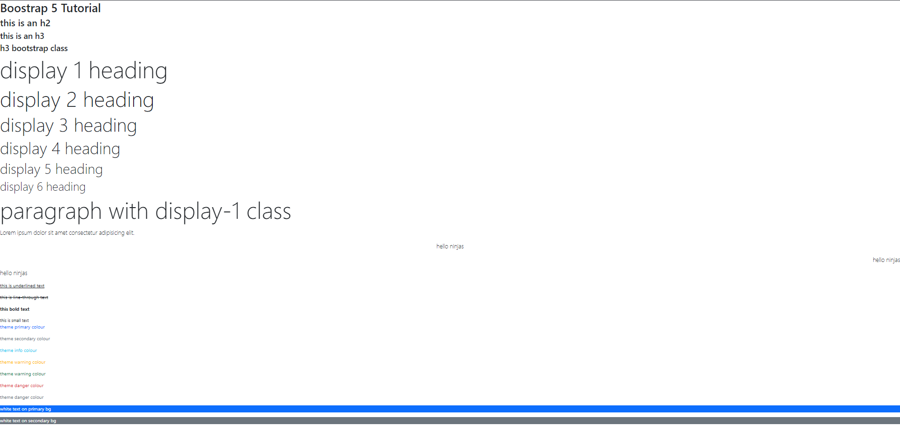

### Buttons and Button Groups 
```bash
<html lang="en">
<head>
  <meta charset="UTF-8">
  <meta http-equiv="X-UA-Compatible" content="IE=edge">
  <meta name="viewport" content="width=device-width, initial-scale=1.0">
  <title>meow</title>
  <link href="https:#cdn.jsdelivr.net/npm/bootstrap@5.0.1/dist/css/bootstrap.min.css" rel="stylesheet" integrity="sha384-+0n0xVW2eSR5OomGNYDnhzAbDsOXxcvSN1TPprVMTNDbiYZCxYbOOl7+AMvyTG2x" crossorigin="anonymous">
</head>
<body>
  <!-- basic buttons -->
  <h2>Buttons</h2>

  <button>default button</button>
  <button class="btn btn-primary">primary button</button> <!-- auto lightens text -->
  <button class="btn btn-secondary">secondary button</button>

  <!-- anchor tags as buttons -->\
# we can use any tag as the button as long as you have the btn class and a background color for the button
  <h2>Links as buttons</h2>

  <a href="#" class="btn btn-info">info anchor tag</a>
  <a href="#" class="btn btn-success">success anchor tag</a>

  <!-- button sizes -->
  <h2>Button sizes</h2>

  <button class="btn btn-lg btn-danger">large danger button</button>
  <button class="btn btn-sm btn-warning">small warning button</button>

  <!-- outlined styles -->
  <h2>Button Styles</h2>

  <button class="btn btn-outline-primary">outlined button</button>
  <button class="btn btn-outline-secondary btn-lg">large outlined button</button>

  <!-- button groups -->
# Button groups are a series of buttons that are grouped together 
  <h2>Button Groups</h2>

  <div class="btn-group">
    <a href="#" class="btn btn-primary">button 1</a>
    <a href="#" class="btn btn-warning">button 2</a>
    <a href="#" class="btn btn-success">button 3</a>
  </div>
  
  <script src="https:#cdn.jsdelivr.net/npm/bootstrap@5.0.1/dist/js/bootstrap.bundle.min.js" integrity="sha384-gtEjrD/SeCtmISkJkNUaaKMoLD0#ElJ19smozuHV6z3Iehds+3Ulb9Bn9Plx0x4" crossorigin="anonymous"></script>
</body>
</html>
```
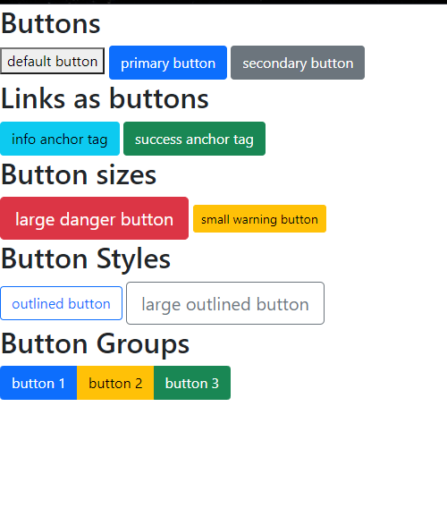

#### how to make a website layout with bootstrap?
```bash 
we do this, by implementing 3 bootstrap classes:
1. container 
2. row 
3. col 
```
### 1. container 
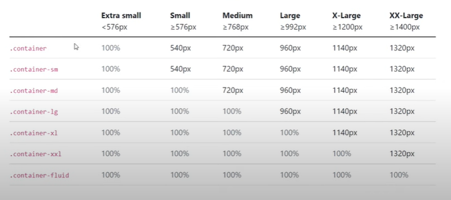
> Here is a list of different container classes we can use.

#### a. container 
when we add .container class 
- container has a fixed width: 1140px (used for fixed layout design)
- div will be alligned to the center 

### b. container-fluid 
- width: 100% (used for full layout design)

##### Breakpoints in container class
> for each of these breakpoints, there is a different media query written
1. extra large [screen size >=1200px] largest lappy screen   
2. large       [screen size >= 992px] large lappy screen
3. medium      [screen size >= 768px] medium tabs 
4. small       [screen size >= 576px] small tabs 
5. extra small [screen size <= 576px] mobile
 
### a. container 
> as we reduce the screensize the container width reduces 
```bash 
<!DOCTYPE html>
<html lang="en">
<head>
    <meta charset="UTF-8">
    <meta http-equiv="X-UA-Compatible" content="IE=edge">
    <meta name="viewport" content="width=device-width, initial-scale=1.0, shrink-to-fit=no">
    <!--
    ✅viewport: visible content on the page 
    ✅content="width=device-width: keep width within the device width
    ✅initial-scale=1.0: zoom to 1 ratio
    ✅shrink-to-fit=no - doesnt shrink contents when viewport size decreases
     -->
    <title>Document</title>

    <!--insert the boostrap CSS link after the title -->
    <link rel="stylesheet" href="css/bootstrap.css">
    <!--add css file below bootstrap file only -->
    <style>
        .container {
            border: 8px solid black;
        }
    </style>
</head>
<body>
   <div class="container">Lorem, ipsum dolor.</div>
</body>
</html>

document:
width of container is 1140px, div alligned in the center and as we reduce the container size, div keeps reducing to fit the same ratio in the minmized screen size 
```
### b. container-fluid 
```bash 
<!DOCTYPE html>
<html lang="en">
<head>
    <meta charset="UTF-8">
    <meta http-equiv="X-UA-Compatible" content="IE=edge">
    <meta name="viewport" content="width=device-width, initial-scale=1.0, shrink-to-fit=no">
    <title>Document</title>

    <!--insert the boostrap CSS link after the title -->
    <link rel="stylesheet" href="css/bootstrap.css">
    <!--addcss file below bootstrap file only -->
    <style>
        .container-fluid {
            border: 8px solid black;
        }
    </style>
</head>
<body>
   <div class="container-fluid">Lorem, ipsum dolor.</div>
</body>
</html>

document:
the container-fluid width is 100%, and remains the same whenever we reduce the viewport size 
```
### 2. row 
.row is used to create rows inside the .container class
```bash 
<!DOCTYPE html>
<html lang="en">
<head>
    <meta charset="UTF-8">
    <meta http-equiv="X-UA-Compatible" content="IE=edge">
    <meta name="viewport" content="width=device-width, initial-scale=1.0, shrink-to-fit=no">
    <title>Document</title>

    <!--insert the boostrap CSS link after the title -->
    <link rel="stylesheet" href="css/bootstrap.css">
    <!--addcss file below bootstrap file only -->
    <style>
        .container{
            border: 8px solid black;
        }

        .row {
            border: 2px solid red;
        }
    </style>
</head>
<body>
   <div class="container">
      <div class="row">row 1</div>
      <div class="row">row 2</div>
      <div class="row">row 3</div>
      <div class="row">row 4</div>
   </div>
</body>
</html>
```
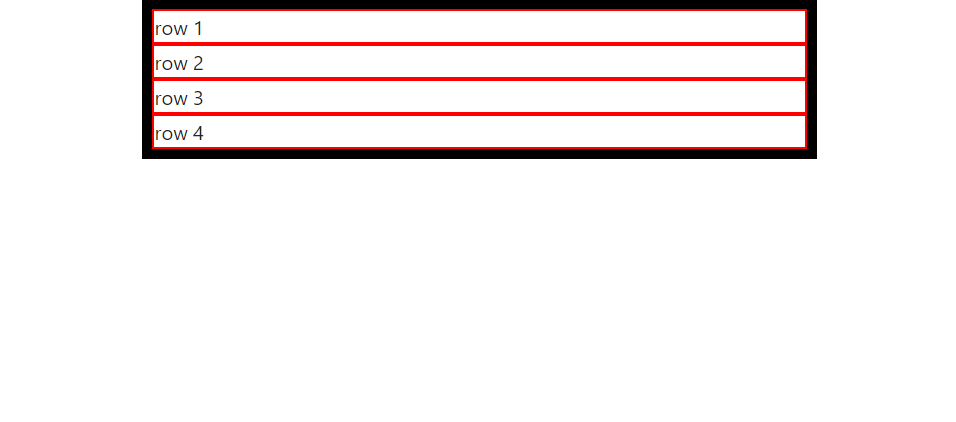

### 3. col 
.col class is used to create equal width columns inside the .row class 
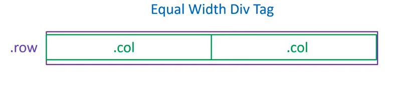

##### Layout classes sequence 
1. .container 
2. inside .container we can place .row class 
3. inside .row we can place .col class
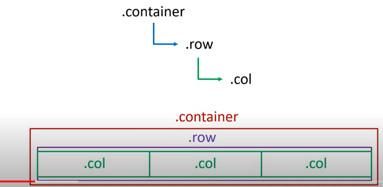

> adding .col inside .row 
```bash 
<!DOCTYPE html>
<html lang="en">
<head>
    <meta charset="UTF-8">
    <meta http-equiv="X-UA-Compatible" content="IE=edge">
    <meta name="viewport" content="width=device-width, initial-scale=1.0, shrink-to-fit=no">
    <title>Document</title>

    <!--insert the boostrap CSS link after the title -->
    <link rel="stylesheet" href="css/bootstrap.css">
    <!--addcss file below bootstrap file only -->
    <style>
        .container{
            border: 8px solid black;
        }

        .row {
            border: 2px solid red;
        }

        .col {
            border: 3px solid green;
        }
    </style>
</head>
<body>
   <div class="container">
      <div class="row">
        <div class="col">col1</div>
        <div class="col">col1</div>
        <div class="col">col1</div>
        <div class="col">col1</div>
      </div>
      <div class="row">row 2</div>
      <div class="row">row 3</div>
      <div class="row">row 4</div>
   </div>
</body>
</html>
```
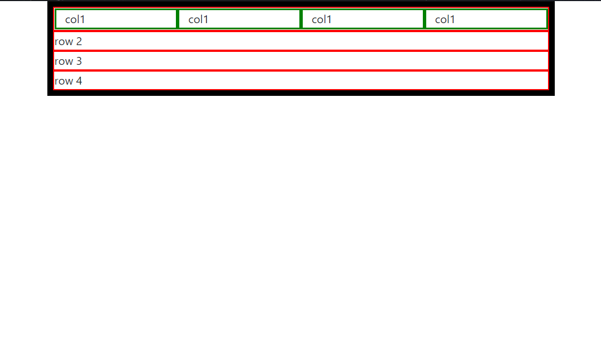

#### Adding fixed number of columns in rows 
```bash 
<!DOCTYPE html>
<html lang="en">
<head>
    <meta charset="UTF-8">
    <meta http-equiv="X-UA-Compatible" content="IE=edge">
    <meta name="viewport" content="width=device-width, initial-scale=1.0, shrink-to-fit=no">
    <title>Document</title>

    <!--insert the boostrap CSS link after the title -->
    <link rel="stylesheet" href="css/bootstrap.css">
    <!--add css file below bootstrap file only -->
    <style>
        .container{
            border: 8px solid black;
        }

        .row {
            border: 2px solid red;
        }

        .col {
            border: 3px solid green;
        }
    </style>
</head>
<body>
    <h1 style="text-align: center;">2 columns in one row using row-cols-2</h1>
   <div class="container">
      ✅<div class="row row-cols-2">
        <div class="col">col1</div>
        <div class="col">col1</div>
        <div class="col">col1</div>
        <div class="col">col1</div>
        <div class="col">col1</div>
        <div class="col">col1</div>
        <div class="col">col1</div>
        <div class="col">col1</div>
      </div>
      <div class="row">row 2</div>
      <div class="row">row 3</div>
      <div class="row">row 4</div>
   </div>
</body>
</html>
```
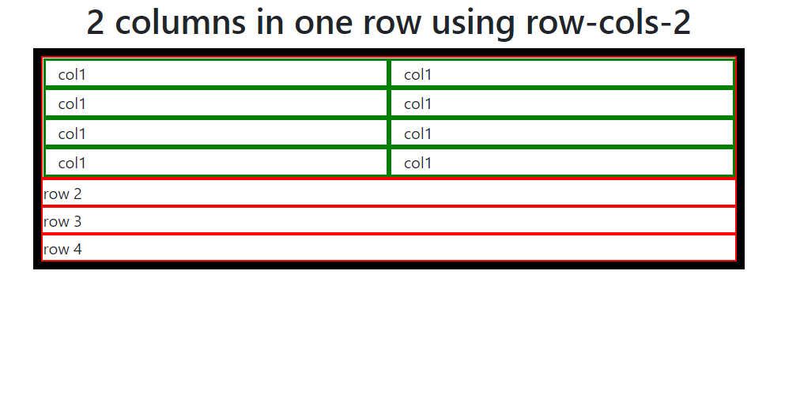

#### col class for different breakpoints 
- extra large (col-xl)
- large (col-lg)
- medium (col-md)
- small (col-sm)

```bash 
    <style>
        .container{
            border: 8px solid black;
            padding: 30px;
        }

        .row {
            border: 2px solid red;
            padding: 5px;
        }

        .col-md{
            border: 5px solid blue;
        }
        .col-lg {
            border: 3px solid green;
        }
        .col-xl{
            border: 3px solid yellow;
        }
        .col-sm{
            border: 5px solid rgb(79, 79, 79);
        }
    </style>
</head>
<body>
    <h1 style="text-align: center;">col class for different breakpoints</h1>
   <div class="container">
    <div class="row">
        <div class="col-xl">col1</div>
        <div class="col-xl">col1</div>
        <div class="col-xl">col1</div>
      </div>
      <div class="row">
        <div class="col-lg">col1</div>
        <div class="col-lg">col1</div>
        <div class="col-lg">col1</div>
      </div>
      <div class="row">
        <div class="col-md">col1</div>
        <div class="col-md">col1</div>
        <div class="col-md">col1</div>
      </div>
      <div class="row">
        <div class="col-sm">col1</div>
        <div class="col-sm">col1</div>
        <div class="col-sm">col1</div>
      </div>
      <div class="row">row 4</div>
   </div>
</body>
```
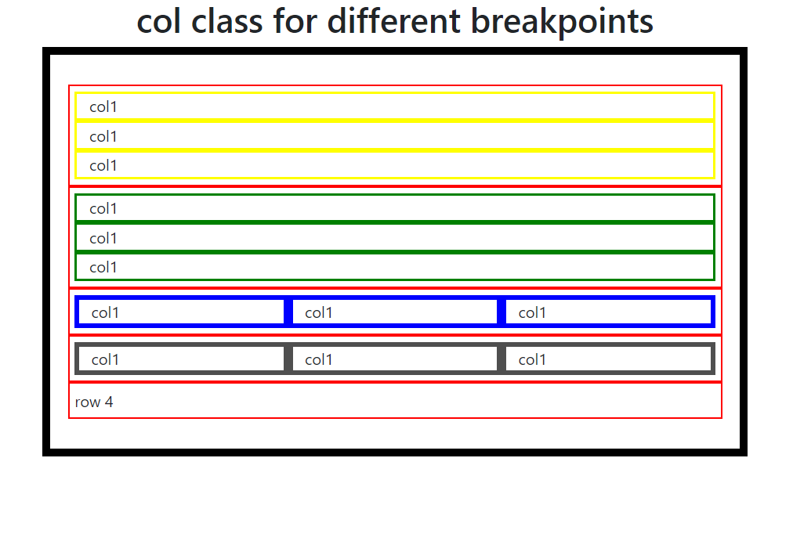

### Grid col class 
Used for creating col class of varying width

##### Bootstrap uses a 12 column grid system 
> .row in bootstrap has 12 grids
- each grid has a specific class allotted to it
- we specify the number to each col which specifies how much width that column will take 
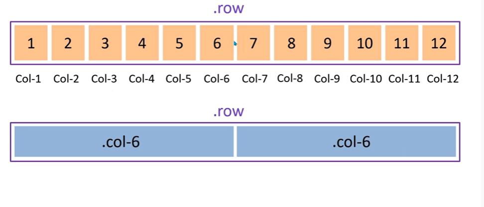

> Note: .col is same as .col-12 
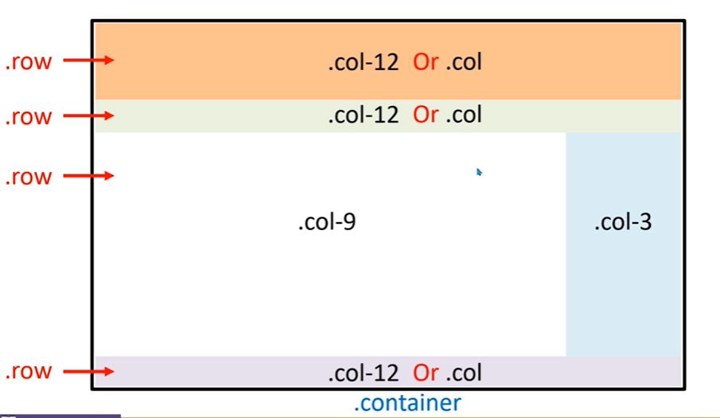

```bash 
    <style>
        .container{
            border: 8px solid black;
            padding: 30px;
        }

        .row {
            border: 2px solid red;
            padding: 5px;
        }

        .col-8 {
            border: 3px solid blue;
        }

        .col-4{
            border: 3px solid green;
        }

        .col-6{
            border: 3px solid rgb(2, 2, 2);
        }

    </style>
</head>
<body>
    <h1 style="text-align: center;">Grid col</h1>
   <div class="container">
       <div class="row">
           <div class="col-8">Lorem ipsum dolor sit amet consectetur adipisicing elit. Quisquam, aperiam?</div>
           <div class="col-4">Lorem ipsum dolor sit amet consectetur adipisicing elit. Amet, voluptatem!</div>
       </div>
       <div class="row">
        <div class="col-6">Lorem ipsum dolor sit amet consectetur adipisicing elit. Quisquam, aperiam?</div>
        <div class="col-6">Lorem ipsum dolor sit amet consectetur adipisicing elit. Amet, voluptatem!</div>
    </div>   
   </div>
</body>
```
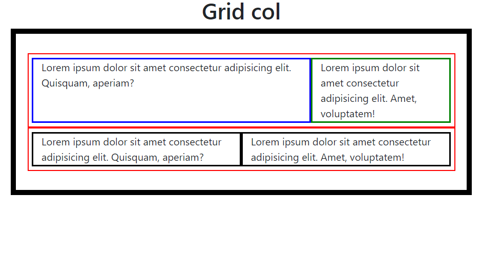

> creating website layout using grid cols
```bash 
<!DOCTYPE html>
<html lang="en">
<head>
    <meta charset="UTF-8">
    <meta http-equiv="X-UA-Compatible" content="IE=edge">
    <meta name="viewport" content="width=device-width, initial-scale=1.0, shrink-to-fit=no">
    <title>Document</title>

    <!--insert the boostrap CSS link after the title -->
    <link rel="stylesheet" href="css/bootstrap.css">
    <!--addcss file below bootstrap file only -->
    <style>
        .container{
            border: 8px solid black;
            padding: 30px;
        }

        .row {
            border: 2px solid red;
            padding: 5px;
        }

        .col-12 {
            border: 3px solid blue;
        }

        .col-4{
            border: 3px solid green;
        }

        .col-8{
            border: 3px solid rgb(2, 2, 2);
        }

    </style>
</head>
<body>
    <h1 style="text-align: center;">Grid col</h1>
   <div class="container">
       <div class="row">
           <div class="col-12">
               <h1>website name</h1>
           </div>
       </div>  
       <div class="row">
           <div class="col-12">
               <ul>
                   <li><a href="">home</a></li>
                   <li><a href="">home</a></li>
                   <li><a href="">home</a></li>
                   <li><a href="">home</a></li>
               </ul>
           </div>
       </div>
       <div class="row">
        <div class="col-8">
            <h1>sub-heading</h1>
            <p>Lorem ipsum dolor sit amet consectetur adipisicing elit. Suscipit sunt iusto dolorem non! Quaerat dolorum enim quos ipsum reprehenderit voluptates mollitia sit quibusdam, sed modi exercitationem architecto molestias deleniti repellendus voluptas quidem distinctio incidunt fuga laboriosam earum voluptate aperiam ad dolore? Non id ullam delectus laborum eveniet obcaecati similique laboriosam error numquam praesentium, asperiores doloribus tempora corrupti qui est nesciunt perferendis, temporibus optio cum? Tempore quos velit ea perferendis adipisci quisquam. Magnam cum dicta, maxime incidunt quas, fugiat molestiae saepe minus odit excepturi quidem temporibus quis, nostrum dolores. Suscipit aperiam, cupiditate atque accusamus sed cumque beatae nostrum, et repudiandae in inventore voluptatem earum molestias tempora fugit vitae! Magni esse soluta nihil aut autem officia nemo deleniti neque temporibus quia, pariatur iure expedita, fuga illo non.</p>
        </div>
        <div class="col-4">
            <h1>sub-heading</h1>
            <p>Lorem ipsum dolor sit amet consectetur adipisicing elit. Suscipit sunt iusto dolorem non! Quaerat dolorum enim quos ipsum reprehenderit voluptates mollitia sit quibusdam, sed modi exercitationem architecto molestias deleniti repellendus voluptas quidem distinctio incidunt fuga laboriosam earum voluptate aperiam ad dolore? Non id ullam delectus laborum eveniet obcaecati similique laboriosam error numquam praesentium, asperiores doloribus tempora corrupti qui est nesciunt perferendis, temporibus optio cum? Tempore quos velit ea perferendis adipisci quisquam. Magnam cum dicta, maxime incidunt quas, fugiat molestiae saepe minus odit excepturi quidem temporibus quis, nostrum dolores. Suscipit aperiam, cupiditate atque accusamus sed cumque beatae nostrum, et repudiandae in inventore voluptatem earum molestias tempora fugit vitae! Magni esse soluta nihil aut autem officia nemo deleniti neque temporibus quia, pariatur iure expedita, fuga illo non.</p>
        </div>
    </div>
    <div class="row">
        <div class="col-12">
            Lorem, ipsum dolor.
        </div>
    </div>
   </div>
</body>
</html>
```
> A review of container classes for different breakpoints 
```bash 
<html lang="en">
<head>
  <meta charset="UTF-8">
  <meta http-equiv="X-UA-Compatible" content="IE=edge">
  <meta name="viewport" content="width=device-width, initial-scale=1.0">
  <title>Net Ninja Pro - the Book</title>
  <link href="https:#cdn.jsdelivr.net/npm/bootstrap@5.0.1/dist/css/bootstrap.min.css" rel="stylesheet" integrity="sha384-+0n0xVW2eSR5OomGNYDnhzAbDsOXxcvSN1TPprVMTNDbiYZCxYbOOl7+AMvyTG2x" crossorigin="anonymous">
</head>
<body>

  <div class="container my-5">
    <h2>normal container</h2>
    <p>Lorem, ipsum dolor sit amet consectetur adipisicing elit. Quos ratione labore modi vel facere pariatur. Nobis beatae ab officia assumenda nisi ea eos soluta accusamus iure minus iste reiciendis veritatis asperiores perferendis iusto, veniam tempora nulla repudiandae exercitationem? Eius rerum illo nulla corporis odio quos porro vero. Eveniet nulla deserunt odio tenetur vero nihil veritatis, quo repudiandae iusto blanditiis ipsum.</p>
  </div>

  <!-- always 100% width of the browser width -->
  <div class="container-fluid my-5">
    <h2>fluid container</h2>
    <p>Lorem ipsum dolor sit amet consectetur adipisicing elit. Facilis obcaecati consequuntur mollitia distinctio, ratione enim quia sint repellat velit accusantium. Vel id architecto facilis facere soluta veritatis suscipit praesentium deleniti numquam impedit doloremque, recusandae reiciendis similique eos labore, quisquam quia voluptate distinctio maiores! Assumenda iure doloremque cupiditate architecto odit maiores magni itaque in, numquam qui cumque, blanditiis magnam aperiam. Dolor.</p>
  </div>

# This div will have 100% width though xs/s/md , but the moment it reaches lg it doesnt give 100% width anymore (that is it then behaves like a container)
  <div class="container-lg my-5">
    <h2>100% until lg screens, then container</h2>
    <p>Lorem ipsum dolor sit, amet consectetur adipisicing elit. Nihil dolore doloremque iure corporis, cumque voluptate commodi minus. Accusantium magni ut omnis excepturi cumque! Debitis fugiat cumque nihil corrupti eius facere corporis natus? Cumque numquam vitae ipsam eum quaerat omnis vel corrupti perferendis totam iste quisquam, facere consequuntur aut, ea, doloribus aperiam. Ad eius facilis nulla! Ea optio in corporis ab.</p>
  </div>
# 100% width in xs/s/md/lg , but the moment the screensize is xl, it starts behaing like a container 
  <div class="container-xl my-5">
    <h2>100% until xl screens, then container</h2>
    <p>Lorem ipsum dolor sit, amet consectetur adipisicing elit. Nihil dolore doloremque iure corporis, cumque voluptate commodi minus. Accusantium magni ut omnis excepturi cumque! Debitis fugiat cumque nihil corrupti eius facere corporis natus? Cumque numquam vitae ipsam eum quaerat omnis vel corrupti perferendis totam iste quisquam, facere consequuntur aut, ea, doloribus aperiam. Ad eius facilis nulla! Ea optio in corporis ab.</p>
  </div>
  
  <script src="https:#cdn.jsdelivr.net/npm/bootstrap@5.0.1/dist/js/bootstrap.bundle.min.js" integrity="sha384-gtEjrD/SeCtmISkJkNUaaKMoLD0#ElJ19smozuHV6z3Iehds+3Ulb9Bn9Plx0x4" crossorigin="anonymous"></script>
</body>
</html>
```
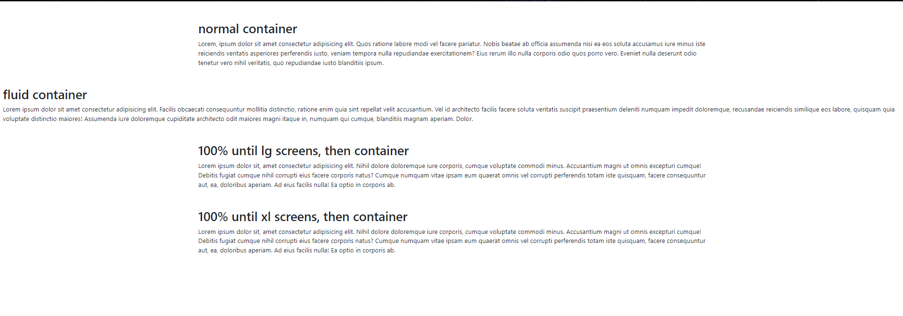

### How a container acts at different breakpoints 
```bash 
                  (0-540) (540-576) (576-768) (768-992)  (992-1200) (1200-1400)
                     XS       SM       MD        LG           XL         XXL
.container          100%   Starts acting as a container after encountering breakpoint 576px
.container-sm       100%   Acting as a container after 576px, before it acts as 100% even in sm screen size
.container-md       100%    100%      container from 768px (breakpoint), before that it acts as 100%
.container-lg       100%    100%      100%      container from 992px breakpoint
.container-xl       100%    100%      100%      100%         container behavior from 992px breakpoint 
.container-xxl      100%    100%      100%      100%         100%        container behavior from 1200px
.container-fluid    100%    100%      100%      100%         100%        100%
``` 
> Note that: .container and .container-sm are same and they start acting as a container after encountering the breakpoint of 576px.
> 

```bash 
<html lang="en">
<head>
  <meta charset="UTF-8">
  <meta http-equiv="X-UA-Compatible" content="IE=edge">
  <meta name="viewport" content="width=device-width, initial-scale=1.0">
  <title></title>
  <link href="https:#cdn.jsdelivr.net/npm/bootstrap@5.0.1/dist/css/bootstrap.min.css" rel="stylesheet" integrity="sha384-+0n0xVW2eSR5OomGNYDnhzAbDsOXxcvSN1TPprVMTNDbiYZCxYbOOl7+AMvyTG2x" crossorigin="anonymous">
</head>
<body>

    <!-- Grid without specifying width for columns -->
    <!-- As we minimize screen size of the basic grid below 412px it stacks on top of the other -->
  <div class="container-lg my-5">
    <h2>basic grid</h2>
    <div class="row">
      <div class="col">
        <div class="p-5 bg-primary text-light">col 1</div>
      </div>
      <div class="col">
        <div class="p-5 bg-primary text-light">col 2</div>
      </div>
      <div class="col">
        <div class="p-5 bg-primary text-light">col 3</div>
      </div>
    </div>
  </div>

  <!-- Specifying width for each column in grid -->
  <!-- When we minimize the grid, the columns minimize and dont get pushed to the next line, however it ends up in different width sizes-->
  <div class="container-lg my-5">
    <h2>column widths</h2>
    <div class="row">
      <div class="col-6">
        <div class="p-5 bg-primary text-light">col 1</div>
      </div>
      <div class="col-3">
        <div class="p-5 bg-primary text-light">col 2</div>
      </div>
      <div class="col-3">
        <div class="p-5 bg-primary text-light">col 3</div>
      </div>
    </div>
  </div>

  <!-- were specififying for different breakpoints for different screen sizes -->
  <div class="container-lg my-5">
    <h2>responsive column widths</h2>
    <div class="row gy-3"> 
      <div class="col-sm-4  col-lg-6">
        <div class="p-5 bg-primary text-light">col 1</div>
      </div>
      <div class="col-sm-4 col-lg-3">
        <div class="p-5 bg-primary text-light">col 2</div>
      </div>
      <div class="col-sm-4 col-lg-3">
        <div class="p-5 bg-primary text-light">col 3</div>
      </div>
    </div>
  </div>

  <div class="container-lg my-5">
    <h2>justifying columns</h2>
    <!-- justify-content-center alligns the column to the center  -->
    <div class="row justify-content-center">
      <div class="col-md-3">
        <div class="p-5 bg-primary text-light">col 1</div>
      </div>
      <div class="col-md-3">
        <div class="p-5 bg-primary text-light">col 2</div>
      </div>
      <div class="col-md-3">
        <div class="p-5 bg-primary text-light">col 3</div>
      </div>
    </div>
  </div>
  
  <script src="https:#cdn.jsdelivr.net/npm/bootstrap@5.0.1/dist/js/bootstrap.bundle.min.js" integrity="sha384-gtEjrD/SeCtmISkJkNUaaKMoLD0#ElJ19smozuHV6z3Iehds+3Ulb9Bn9Plx0x4" crossorigin="anonymous"></script>
</body>
</html>
```

> Breaking the tricky parts down 
```bash 
<div class="container-lg my-5">
    <h2>responsive column widths</h2>
    <div class="row gy-3"> 
      <div class="col-sm-4  col-lg-6">
        <div class="p-5 bg-primary text-light">col 1</div>
      </div>
      <div class="col-sm-4 col-lg-3">
        <div class="p-5 bg-primary text-light">col 2</div>
      </div>
      <div class="col-sm-4 col-lg-3">
        <div class="p-5 bg-primary text-light">col 3</div>
      </div>
    </div>
  </div>

# .col-sm-4 ---------- xs / sm (100% width) -------- md / lg/ xl/ xxl(containers with width 4-4-4)
- At xs and sm the width of the column will be 100%

# .col-lg-6
# .col-lg-3
# .col-lg-3
# ✅6-3-3 ----------xs / sm/ md/ lg (100% width) --- xl/ xxl (container with width 6-3-3)
- xs and sm have a width set to 100% over here as well, so that will be the final result at these screensize 
- However, md and lg with 100% width are competing with (md and lg in .col-sm-4 who have a container width of 4-4-4), the container width takes priorty and md and lg are then assigned 4-4-4 at their screen size
- Over here xl and xxl are given a column width 6-3-3, which clashes with the column width given to xl and xxl which is 4-4-4, However the 6-3-3 takes priorty because its declared last. 
```
> Breaking down the last div 
```bash 
 <div class="container-lg my-5">
    <h2>justifying columns</h2>
    <!-- justify-content-center alligns the column to the center  -->
    <div class="row justify-content-center">
      <div class="col-md-3">
        <div class="p-5 bg-primary text-light">col 1</div>
      </div>
      <div class="col-md-3">
        <div class="p-5 bg-primary text-light">col 2</div>
      </div>
      <div class="col-md-3">
        <div class="p-5 bg-primary text-light">col 3</div>
      </div>
    </div>
  </div>
# .col-md-3 (3-3-3) ----- xs/ sm/ md(100% width)----lg/ xl/ xxl(container takes 3-3-3 width)
```
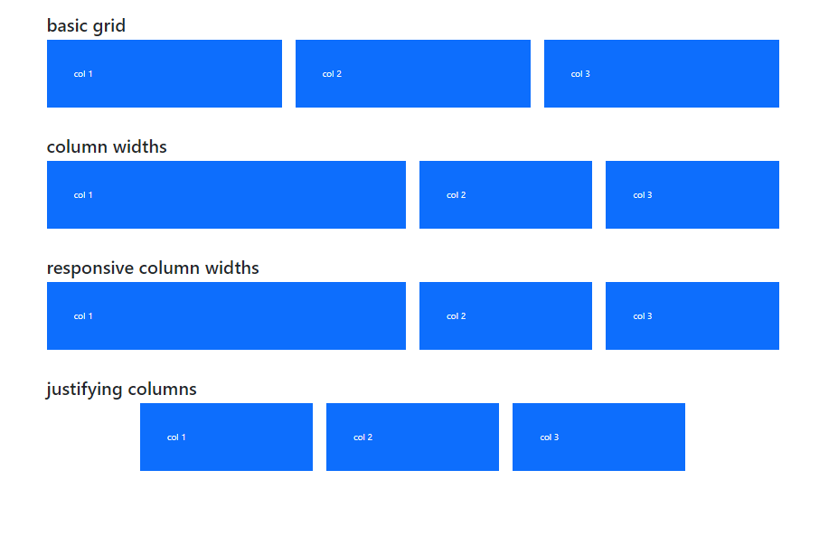

> Here is an example website implementing these concepts 
```bash
  <section id="intro">
    <div class="container-lg">
      <div class="row g-4 justify-content-center align-items-center">
          <!-- for xs/ sm/ md it will be 12 column layout, i.e 100% width, until it encounters the md breakpoint(768px) then it will be col-5 for (lg/xl/xxl)-->
        <div class="col-md-5 text-center text-md-start">
          <h1>
            <div class="display-2">Black-Belt</div>
            <div class="display-5 text-muted">Your Coding Skills</div>
          </h1>
          <p class="lead my-4 text-muted">Lorem ipsum dolor sit amet consectetur adipisicing elit. Laboriosam, dignissimos?</p>
          <a href="#pricing" class="btn btn-secondary btn-lg">Buy Now</a>
        </div>
        <div class="col-md-5 text-center d-none d-md-block">
          
        </div>
      </div>
    </div>
  </section>
```
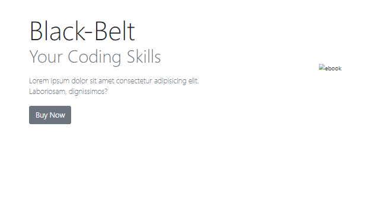

### Nesting 
> adding cols inside row (nesting columns inside the row)
```bash 
    <style>
        .container {
            border: 3px solid black;
        }
        .row{
            border: 5px solid red;
        }

        .col-md-6{
            border: 5px solid green;
        }

    </style>
</head>
<body>
    <div class="container">
    ✅adding row inside container 
        <div class="row">
            ✅adding col inside row 
            <div class="col-md-6" style="border:  10px solid black;">
                ✅adding nested row inside col
                <div class="row">
                    ✅adding nested col inside nested row 
                    <div class="col-md-6">col 1</div>
                    <div class="col-md-6">col 1</div>
                </div>
            </div>
        </div>
    </div>
</body>
```
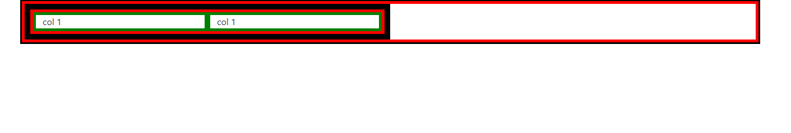

#### Bootstrap inbiult utility class
### 1. Margin Classes 
- to align column to the center we use m-auto 
- margin-left, we used to use ml-auto, now we use ms-auto 
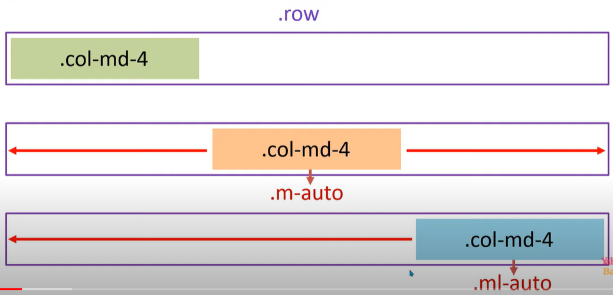

- margin-right, we used to use mr-auto, now we use me-auto 
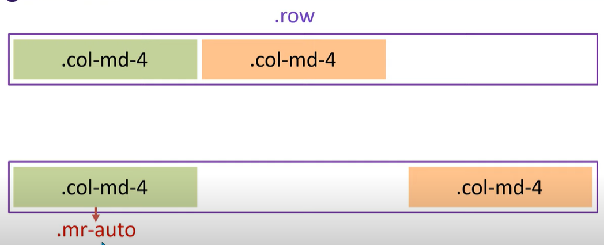

#### m-auto 
```bash 
    <style>
        .container {
            border: 3px solid black;
        }
        .row{
            border: 5px solid red;
        }

        .col-md-3{
            background-color: pink;
        }

    </style>
</head>
<body>
    <div class="container">
        <div class="row">
            <div class="col-md-3 m-auto">col1 Lorem ipsum dolor sit amet consectetur, adipisicing elit. Veniam facilis nemo maiores. Autem, quo. Eligendi, doloremque quibusdam. Quo, iure doloribus.</div>
        </div>
    </div>
</body>
```
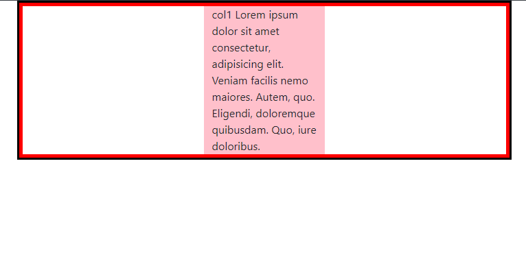

#### ms-auto 
```bash    
    <!--insert the boostrap CSS link after the title -->
    <link rel="stylesheet" href="css/bootstrap.css">
    <!--add css file below bootstrap file only -->
    <style>
        .container {
            border: 3px solid black;
        }
        .row{
            border: 5px solid red;
        }

        .col-md-3{
            background-color: pink;
        }

        .col-md-8{
            background-color: blue;
        }

    </style>
</head>
<body>
    <div class="container">
        <div class="row">
            <div class="col-md-3 ms-auto">col1 Lorem ipsum dolor sit amet consectetur, adipisicing elit. Veniam facilis nemo maiores. Autem, quo. Eligendi, doloremque quibusdam. Quo, iure doloribus.</div>
           <div class="col-md-8">Lorem ipsum dolor sit amet consectetur adipisicing elit. Odit non obcaecati suscipit ut tempora eius amet nihil sequi expedita est natus sapiente ipsa debitis ducimus nisi doloremque quas nesciunt a voluptatibus, aperiam nulla iste aliquam at deserunt? Ipsam, explicabo eaque.</div> 
        </div>
    </div>
</body>
```
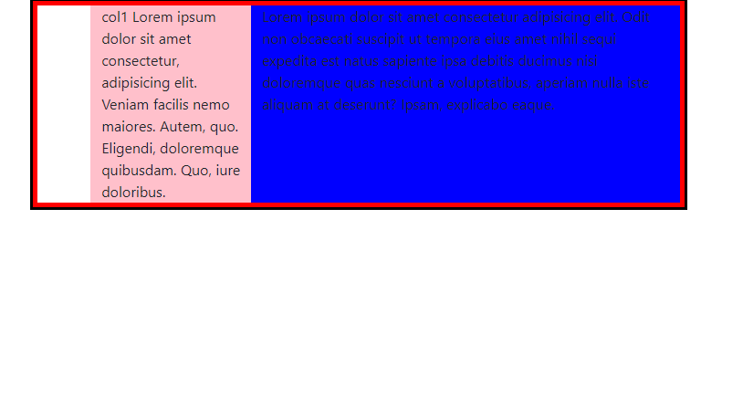

#### me-auto 
```bash 
    <style>
        .container {
            border: 3px solid black;
        }
        .row{
            border: 5px solid red;
        }

        .col-md-3{
            background-color: pink;
        }

        .col-md-8{
            background-color: blue;
        }

    </style>
</head>
<body>
    <div class="container">
        <div class="row">
            <div class="col-md-3 me-auto">col1 Lorem ipsum dolor sit amet consectetur, adipisicing elit. Veniam facilis nemo maiores. Autem, quo. Eligendi, doloremque quibusdam. Quo, iure doloribus.</div>
           <div class="col-md-8">Lorem ipsum dolor sit amet consectetur adipisicing elit. Odit non obcaecati suscipit ut tempora eius amet nihil sequi expedita est natus sapiente ipsa debitis ducimus nisi doloremque quas nesciunt a voluptatibus, aperiam nulla iste aliquam at deserunt? Ipsam, explicabo eaque.</div> 
        </div>
    </div>
</body>
```
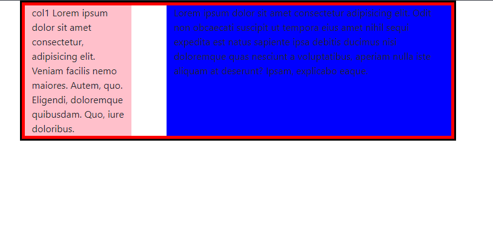

> Lets learn how to use ARIA before proceeding since its used extensively in bootstrap 
Accessible Rich Internet Applications (ARIA) is a set of rules that define ways to make web content and web applications (especially those developed with JavaScript) more accessible to people with vision disabilities.

```bash 
Install ` Chrome Vox Classic extension` which screen reads your website, and speaks it out verbatim, so people with visual disabilitues can understand what your website is about. However for making yur website readable you need to add the ARIA attribute
```
> its mainly used in accordians 

##### margin auto classes for different break points 
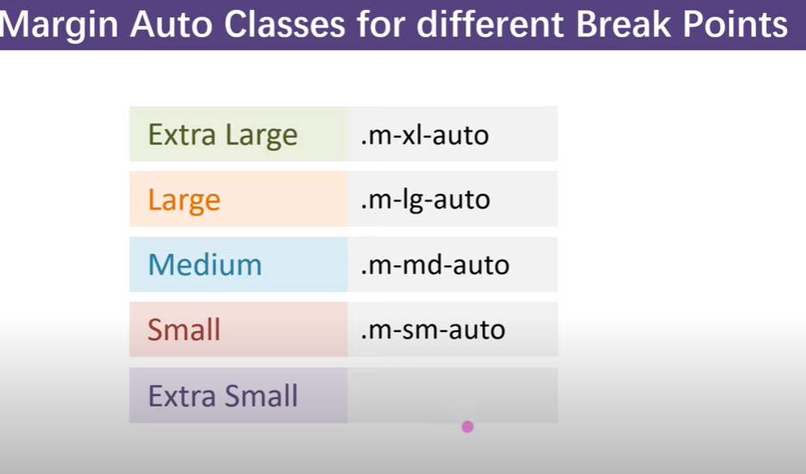
These are margin classes for responsiveness, they give auto margin from all the sides 
1. extra large [.m-xl-auto] - When screen size is xl, then the auto (centering) property will be applied after 1200px breakpoint 
2. large       [.m-lg-auto]
3. medium      [.m-md-auto]
4. small       [.m-sm-auto]

> Here's a small cheatsheet to understand how margin-auto work in different dimensions
```bash 
                (>576px) (576-768px) (768-992px) (992-1200px) (1200-1400px)
             XS    SM         MD        LG        XL              XXL     
m-sm-auto                               auto starts from 768px breakpoint
m-md-auto                               auto starts from 768px breakpoint
m-lg-auto                                         auto starts at 992px breakpoint
m-xl-auto                                                       auto starts here 
```
> an example,
```bash 
<html lang="en">
<head>
  <meta charset="UTF-8">
  <meta http-equiv="X-UA-Compatible" content="IE=edge">
  <meta name="viewport" content="width=device-width, initial-scale=1.0">
  <title>Net Ninja Pro - the Book</title>
  <link href="https:#cdn.jsdelivr.net/npm/bootstrap@5.0.1/dist/css/bootstrap.min.css" rel="stylesheet" integrity="sha384-+0n0xVW2eSR5OomGNYDnhzAbDsOXxcvSN1TPprVMTNDbiYZCxYbOOl7+AMvyTG2x" crossorigin="anonymous">
  <style>
    section{
      padding: 60px 0;
    }
        .container {
            border: 3px solid black;
        }
        .row{
            border: 5px solid red;
        }

        .col-md-3{
            background-color: pink;
        }

        .col-md-8{
            background-color: blue;
        }
  </style>
</head>
<body>

    <div class="container">
        <h1>m-xl-auto</h1>
        <div class="row">
            <div class="col-md-3 m-xl-auto">col1 Lorem ipsum dolor sit amet consectetur, adipisicing elit. Veniam facilis nemo maiores. Autem, quo. Eligendi, doloremque quibusdam. Quo, iure doloribus.</div>
           <div class="col-md-8">Lorem ipsum dolor sit amet consectetur adipisicing elit. Odit non obcaecati suscipit ut tempora eius amet nihil sequi expedita est natus sapiente ipsa debitis ducimus nisi doloremque quas nesciunt a voluptatibus, aperiam nulla iste aliquam at deserunt? Ipsam, explicabo eaque.</div> 
        </div> 

        <h1>m-lg-auto</h1>
        <div class="row">
            <div class="col-md-3 m-lg-auto">col1 Lorem ipsum dolor sit amet consectetur, adipisicing elit. Veniam facilis nemo maiores. Autem, quo. Eligendi, doloremque quibusdam. Quo, iure doloribus.</div>
           <div class="col-md-8">Lorem ipsum dolor sit amet consectetur adipisicing elit. Odit non obcaecati suscipit ut tempora eius amet nihil sequi expedita est natus sapiente ipsa debitis ducimus nisi doloremque quas nesciunt a voluptatibus, aperiam nulla iste aliquam at deserunt? Ipsam, explicabo eaque.</div> 
        </div>

        <h1>m-md-auto</h1>
        <div class="row">
            <div class="col-md-3 m-md-auto">col1 Lorem ipsum dolor sit amet consectetur, adipisicing elit. Veniam facilis nemo maiores. Autem, quo. Eligendi, doloremque quibusdam. Quo, iure doloribus.</div>
           <div class="col-md-8">Lorem ipsum dolor sit amet consectetur adipisicing elit. Odit non obcaecati suscipit ut tempora eius amet nihil sequi expedita est natus sapiente ipsa debitis ducimus nisi doloremque quas nesciunt a voluptatibus, aperiam nulla iste aliquam at deserunt? Ipsam, explicabo eaque.</div> 
        </div>

        <h1>m-sm-auto</h1>
        <div class="row">
            <div class="col-md-3 m-sm-auto">col1 Lorem ipsum dolor sit amet consectetur, adipisicing elit. Veniam facilis nemo maiores. Autem, quo. Eligendi, doloremque quibusdam. Quo, iure doloribus.</div>
           <div class="col-md-8">Lorem ipsum dolor sit amet consectetur adipisicing elit. Odit non obcaecati suscipit ut tempora eius amet nihil sequi expedita est natus sapiente ipsa debitis ducimus nisi doloremque quas nesciunt a voluptatibus, aperiam nulla iste aliquam at deserunt? Ipsam, explicabo eaque.</div> 
        </div>
    </div>
  
  <script src="https:#cdn.jsdelivr.net/npm/bootstrap@5.0.1/dist/js/bootstrap.bundle.min.js" integrity="sha384-gtEjrD/SeCtmISkJkNUaaKMoLD0#ElJ19smozuHV6z3Iehds+3Ulb9Bn9Plx0x4" crossorigin="anonymous"></script>
</body>
</html>
```
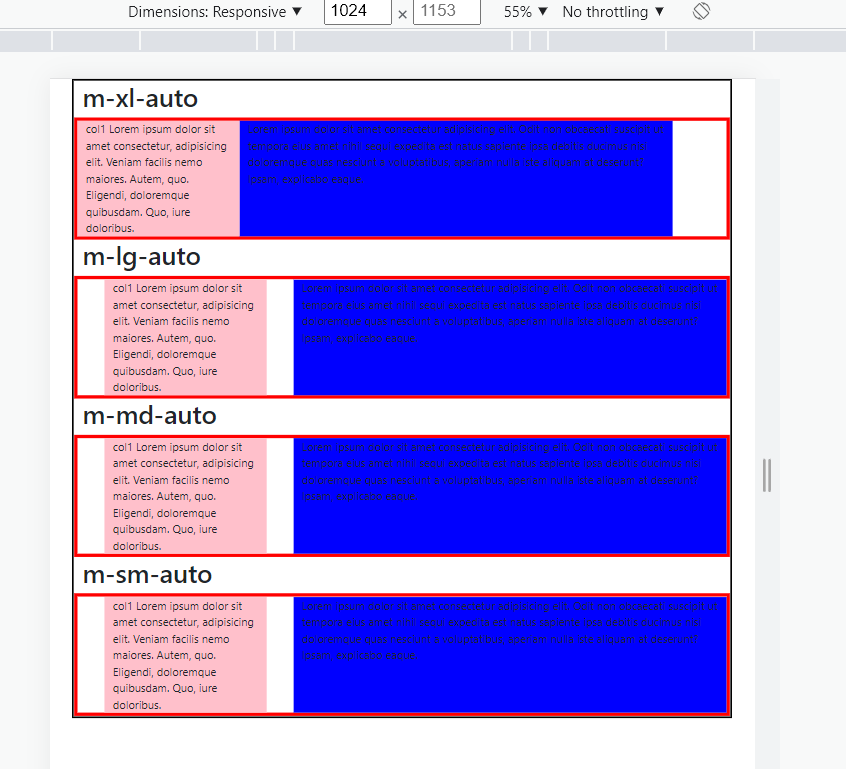
```bash 
large screen size: 1008px and above 
XL screen size: 1200px and above 
```
#### Margin classes for different sides  
1. margin        [.m-*]
2. margin-right  [.me-*]
3. margin-left   [.ms-*]
4. margin-top    [.mt-*]
5. margin-bottom [.mb-*]
6. margin top and bottom [.my-*]
7. margin left and right [.mx-*]
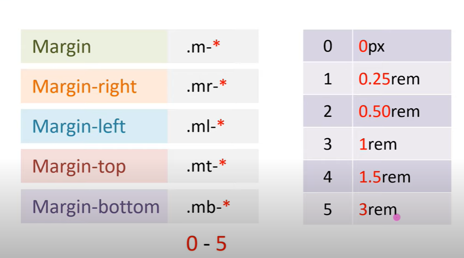
<!-- same properties applies to padding -->

### Utility Classes 
> These are a new feature add on in bootstrap 5
```bash
<html lang="en">
<head>
  <meta charset="UTF-8">
  <meta http-equiv="X-UA-Compatible" content="IE=edge">
  <meta name="viewport" content="width=device-width, initial-scale=1.0">
  <title>Net Ninja Pro - the Book</title>
  <link href="https:#cdn.jsdelivr.net/npm/bootstrap@5.0.1/dist/css/bootstrap.min.css" rel="stylesheet" integrity="sha384-+0n0xVW2eSR5OomGNYDnhzAbDsOXxcvSN1TPprVMTNDbiYZCxYbOOl7+AMvyTG2x" crossorigin="anonymous">
  <style>
    body{ margin: 20px; }
  </style>
</head>
<body>
  <!-- margin & padding -->
  <div class="m-1 p-1 bg-primary">small margin & padding</div>
  <div class="m-5 p-5 bg-primary">large margin & padding</div>
  <div class="my-3 px-5 bg-primary">margin in y dir, padding in x dir</div>
  <div class="mt-3 mb-4 ps-5 pt-4 pe-2 pb-1 bg-primary">m & p for each direction</div>

  <!-- borders -->
  <div class="m-3 p-3 border">default border</div>
  <div class="m-3 p-3 border-top border-end">individual borders</div>
  <div class="m-3 p-3 border-start border-success">border success colour</div>
  # border-5 signifies the width of the red border container 
  <div class="m-3 p-3 border-start border-danger border-5">thicker border</div>
  <div class="m-3 p-3 rounded border border-5">rounded corners</div>
  <div class="m-3 p-3 rounded-pill border border-5">rounded corners</div>

  <!-- box shadow -->
  # shadow-sm signifies shadow with lighter shadow  
  <div class="m-3 p-3 shadow-sm">element with small shadow</div>
  # shadow signifies a medium shadow 
  <div class="m-3 p-3 shadow">element with shadow</div>

  <!-- font weight -->
  <p class="fw-bold">bold text</p>
  <p class="fw-bolder">bolder text</p>
  <p>normal text</p>
  <p class="fw-light">light text</p>
  <p class="fst-italic">italic text</p>
  <p class="fst-italic fw-light">italic light text</p>
  
  <script src="https:#cdn.jsdelivr.net/npm/bootstrap@5.0.1/dist/js/bootstrap.bundle.min.js" integrity="sha384-gtEjrD/SeCtmISkJkNUaaKMoLD0#ElJ19smozuHV6z3Iehds+3Ulb9Bn9Plx0x4" crossorigin="anonymous"></script>
</body>
</html>
```
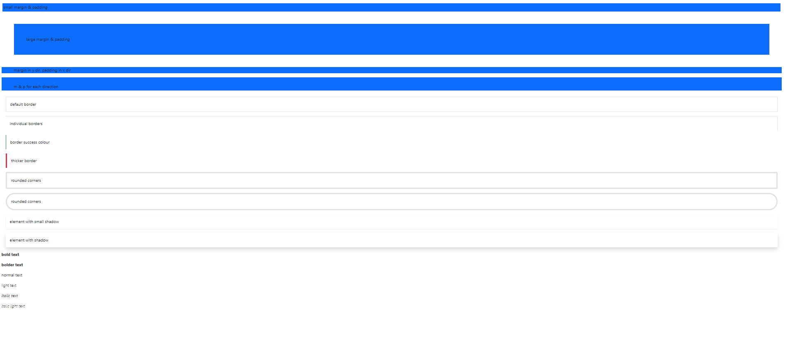

### Navbar component 
```bash 
<body>
  <!-- navbar -->
# navbar-expand-md - when screen size is medium, all the contents of the navbar will be hidden behind the scrollbar button 
# navbar-light gives theme / color to the button 
  <nav class="navbar navbar-expand-md navbar-light pt-5 pb-4">
# container that will store contents of the navbar 
# width of column 100% until it reaches xxl, then it takes container behavior 
    <div class="container-xxl">
      <!-- navbar brand / title -->
      <a class="navbar-brand" href="#intro">
        <span class="text-secondary fw-bold">
          meow
        </span>
      </a>
      <!-- toggle button for mobile nav -->
    # were toggling the class of collapse 
    # data-bs-target tells which collapsable component are we targetting 
    # aria controls and aria-expanded - there are certain web pages that the crawelers cannot crawl and read JS, so the aria allows screen reader to get a structure of the web page 
      <button class="navbar-toggler" type="button" data-bs-toggle="collapse" data-bs-target="#main-nav" aria-controls="main-nav" aria-expanded="false" aria-label="Toggle navigation">
        <span class="navbar-toggler-icon"></span>
      </button>

      <!-- navbar links -->
    # navbar-collapse - implements collapse functionality, initially the button will be placed to the top rhs
      <div class="collapse navbar-collapse justify-content-end align-center" id="main-nav">
        <ul class="navbar-nav">
          <li class="nav-item">
            <a class="nav-link" href="#topics">About The Book</a>
          </li>
          <li class="nav-item">
            <a class="nav-link" href="#reviews">Reviews</a>
          </li>
          <li class="nav-item">
            <a class="nav-link" href="#contact">Get in Touch</a>
          </li>
          <li class="nav-item d-md-none">
            <a class="nav-link" href="#pricing">Pricing</a>
          </li>
        # on smaller screens, dont display the buy now button 
        # on medium screens, display the buy now button 
          <li class="nav-item ms-2 d-none d-md-inline">
            <a class="btn btn-secondary" href="#pricing">buy now</a>
          </li>
        </ul>
      </div>
    </div>
  </nav>

 <!-- main image & intro text -->
  <section id="intro">
    <div class="container-lg">
      <div class="row g-4 justify-content-center align-items-center">
        <div class="col-md-5 text-center text-md-start">
          <h1>
            <div class="display-2">Black-Belt</div>
            <div class="display-5 text-muted">Your Coding Skills</div>
          </h1>
          <p class="lead my-4 text-muted">Lorem ipsum dolor sit amet consectetur adipisicing elit. Laboriosam, dignissimos?</p>
          <a href="#pricing" class="btn btn-secondary btn-lg">Buy Now</a>
        </div>
        <div class="col-md-5 text-center d-none d-md-block">
          
        </div>
      </div>
    </div>
  </section>
</body>
```
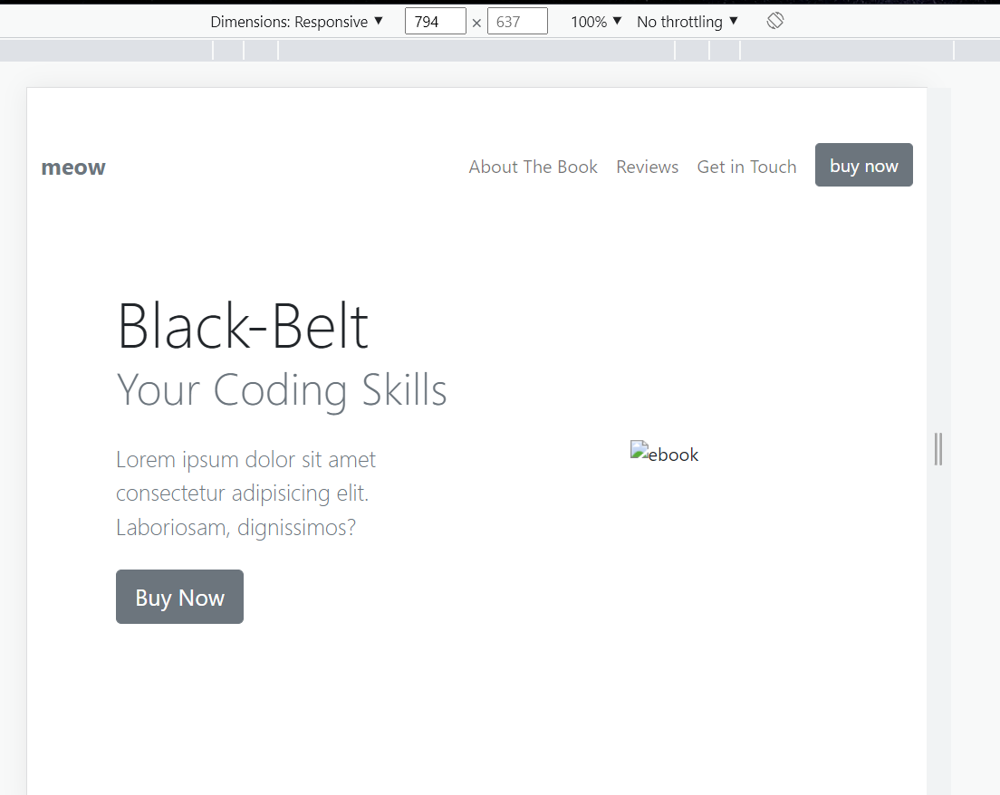
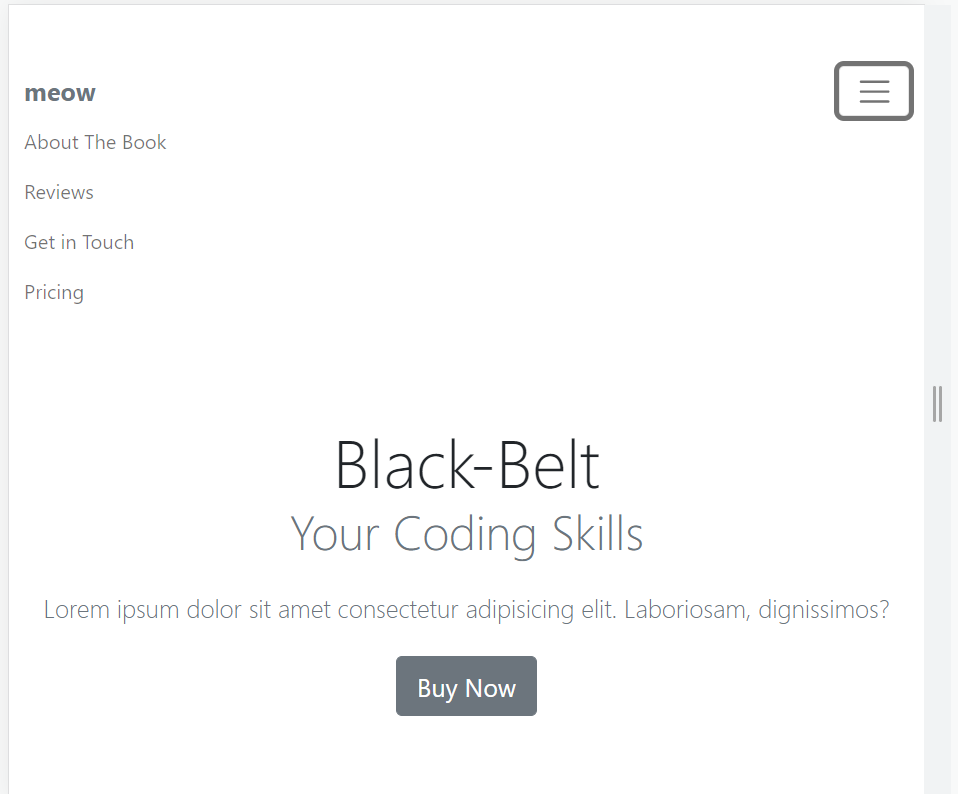

### Cards
```bash 
<html lang="en">
<head>
  <meta charset="UTF-8">
  <meta http-equiv="X-UA-Compatible" content="IE=edge">
  <meta name="viewport" content="width=device-width, initial-scale=1.0">
  <title>Net Ninja Pro - the Book</title>
  <link href="https:#cdn.jsdelivr.net/npm/bootstrap@5.0.1/dist/css/bootstrap.min.css" rel="stylesheet" integrity="sha384-+0n0xVW2eSR5OomGNYDnhzAbDsOXxcvSN1TPprVMTNDbiYZCxYbOOl7+AMvyTG2x" crossorigin="anonymous">
  <style>
    section{
      padding: 60px 0;
    }
  </style>
</head>
<body>

  <!-- navbar -->
  <nav class="navbar navbar-expand-md navbar-light pt-5 pb-4">
    <div class="container-xxl">
      <!-- navbar brand / title -->
      <a class="navbar-brand" href="#intro">
        <span class="text-secondary fw-bold">
          Net Ninja Pro - the Book
        </span>
      </a>
      <!-- toggle button for mobile nav -->
      <button class="navbar-toggler" type="button" data-bs-toggle="collapse" data-bs-target="#main-nav" aria-controls="main-nav" aria-expanded="false" aria-label="Toggle navigation">
        <span class="navbar-toggler-icon"></span>
      </button>

      <!-- navbar links -->
      <div class="collapse navbar-collapse justify-content-end align-center" id="main-nav">
        <ul class="navbar-nav">
          <li class="nav-item">
            <a class="nav-link" href="#topics">About The Book</a>
          </li>
          <li class="nav-item">
            <a class="nav-link" href="#reviews">Reviews</a>
          </li>
          <li class="nav-item">
            <a class="nav-link" href="#contact">Get in Touch</a>
          </li>
          <li class="nav-item d-md-none">
            <a class="nav-link" href="#pricing">Pricing</a>
          </li>
          <li class="nav-item ms-2 d-none d-md-inline">
            <a class="btn btn-secondary" href="#pricing">buy now</a>
          </li>
          
        </ul>
      </div>
    </div>
  </nav>

  <!-- main image & intro text -->
  <section id="intro">
    <div class="container-lg">
      <div class="row g-4 justify-content-center align-items-center">
        <div class="col-md-5 text-center text-md-start">
          <h1>
            <div class="display-2">Black-Belt</div>
            <div class="display-5 text-muted">Your Coding Skills</div>
          </h1>
          <p class="lead my-4 text-muted">Lorem ipsum dolor sit amet consectetur adipisicing elit. Laboriosam, dignissimos?</p>
          <a href="#pricing" class="btn btn-secondary btn-lg">Buy Now</a>
        </div>
        <div class="col-md-5 text-center d-none d-md-block">
          
        </div>
      </div>
    </div>
  </section>

  <!-- pricing plans -->
  <section id="pricing" class="bg-light mt-5">
    <div class="container-lg">
      <div class="text-center">
        <h2>Pricing Plans</h2>
        # xl - 3-6-3
        # lg - 4-4-4
        <p class="lead text-muted">Choose a pricing plan to suit you.</p>
      </div>
      <div class="row my-5 g-0 align-items-center justify-content-center">
      # xl screen -rhs and lhs card will be 3 width
      # 100% width until it encounters lg or xl 
        <div class="col-lg-4 col-xl-3">
          <div class="card border-0">
            <div class="card-body text-center py-4">
              <h4 class="card-title">Starter Edition</h4>
              <p class="lead card-subtitle">eBook download only</p>
              <p class="display-5 my-4 text-primary fw-bold">$12.99</p>
              <p class="card-text mx-5 text-muted d-none d-lg-block">Lorem ipsum dolor sit amet consectetur adipisicing elit. Mollitia, vitae magni! Repellat commodi a fuga corporis saepe dolorum.</p>
              <a href="#" class="btn btn-outline-primary btn-lg mt-3">
                Buy Now
              </a>
            </div>
          </div>
        </div>
      # col-lg means 100% width until it encounters lg breakpoint 
      # col-lg-4 means column width 4-4-4  on large screens
        <div class="col-lg-4">
          <div class="card border-primary border-2">
            <div class="card-header text-center text-primary">Most Popular</div>
            <div class="card-body text-center py-5">
              <h4 class="card-title">Complete Edition</h4>
              <p class="lead card-subtitle">eBook download & all updates</p>
              <p class="display-4 my-4 text-primary fw-bold">$18.99</p>
              <p class="card-text mx-5 text-muted d-none d-lg-block">Lorem ipsum dolor sit amet consectetur adipisicing elit. Mollitia, vitae magni! Repellat commodi a fuga corporis saepe dolorum.</p>
              <a href="#" class="btn btn-outline-primary btn-lg mt-3">
                Buy Now
              </a>
            </div>
          </div>
        </div>

        <div class="col-lg-4 col-xl-3">
          <div class="card border-0">
            <div class="card-body text-center py-4">
              <h4 class="card-title">Ultimate Edition</h4>
              <p class="lead card-subtitle">download, updates & extras</p>
              <p class="display-5 my-4 text-primary fw-bold">$24.99</p>
              <p class="card-text mx-5 text-muted d-none d-lg-block">Lorem ipsum dolor sit amet consectetur adipisicing elit. Mollitia, vitae magni! Repellat commodi a fuga corporis saepe dolorum.</p>
              <a href="#" class="btn btn-outline-primary btn-lg mt-3">
                Buy Now
              </a>
            </div>
          </div>
        </div>
      </div>

    </div><!-- end container -->
  </section>
  <script src="https:#cdn.jsdelivr.net/npm/bootstrap@5.0.1/dist/js/bootstrap.bundle.min.js" integrity="sha384-gtEjrD/SeCtmISkJkNUaaKMoLD0#ElJ19smozuHV6z3Iehds+3Ulb9Bn9Plx0x4" crossorigin="anonymous"></script>
</body>
</html>
```
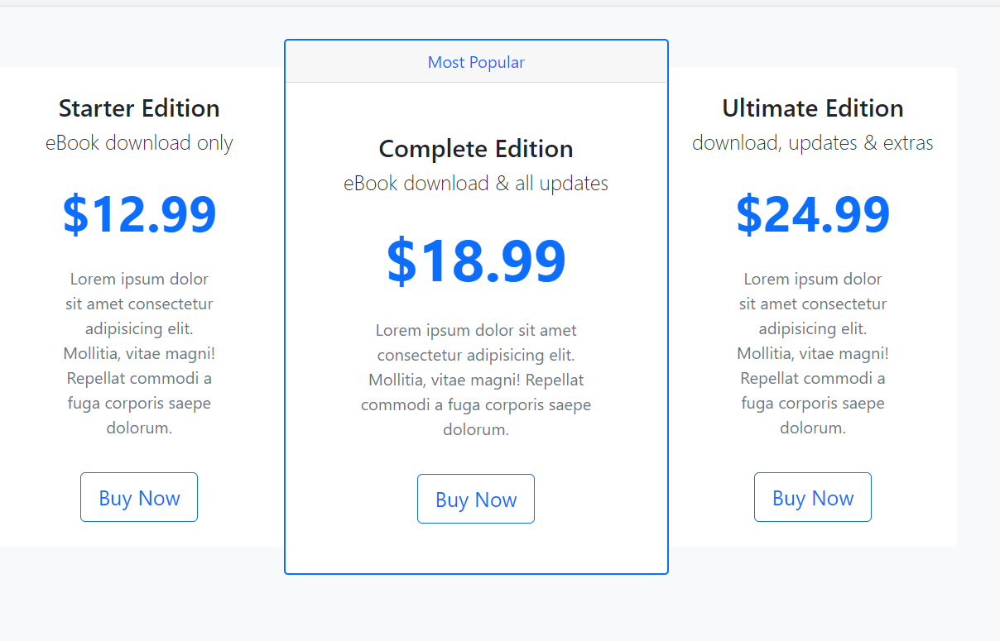

### Accordian 
```bash 
 <!-- topics at a glance -->
  <section id="topics">
    <div class="container-md">
      <div class="text-center">
        <h2>Inside the Book...</h2>
        <p class="lead text-muted">A quick glance at the topics youll learn</p>
      </div>
      <div class="row my-5 g-5 justify-content-around align-items-center">
        <div class="col-6 col-lg-4">
          
        </div>
        <div class="col-lg-6">
          
          <!-- accordion -->
          <div class="accordion" id="chapters">
            <!-- button to click on when we click on it, it opens downwards when we cick on it again it collapses -->
            <div class="accordion-item">
              <h2 class="accordion-header" id="heading-1">
                # data-bs-toggle tells bootstrap to collapse when clicked on this button
                # data-bs-target is the content were going to toggle
                # aria-expanded-true - by default the forst section is going to be opened and when the screen reader reaches to this spoint it will say button-collapse true 
                # aria-controls - controls #chapter1
                <button class="accordion-button" type="button" data-bs-toggle="collapse" data-bs-target="#chapter-1" aria-expanded="true" aria-controls="chapter-1">
                  Chapter 1 - Your First Web Page
                </button>
              </h2>
              # linking buttons with the div
              <div id="chapter-1" class="accordion-collapse collapse show" aria-labelledby="heading-1" data-bs-parent="#chapters">
                <div class="accordion-body">
                  <p>Lorem, ipsum dolor sit amet consectetur adipisicing elit. Quis assumenda delectus sapiente quidem consequatur odit adipisci necessitatibus nemo aliquid minus modi tempore quibusdam quas vitae, animi ipsam nulla sunt alias.</p>
                  <p>Lorem, ipsum dolor sit amet consectetur adipisicing elit. Quis assumenda delectus sapiente quidem consequatur odit adipisci necessitatibus nemo aliquid minus modi tempore quibusdam quas vitae, animi ipsam nulla sunt alias.</p>
                </div>
              </div>
            </div>
            <div class="accordion-item">
              <h2 class="accordion-header" id="heading-2">
                <button class="accordion-button collapsed" type="button" data-bs-toggle="collapse" data-bs-target="#chapter-2" aria-expanded="false" aria-controls="chapter-2">
                  Chapter 2 - Mastering CSS
                </button>
              </h2>
              <div id="chapter-2" class="accordion-collapse collapse" aria-labelledby="heading-2" data-bs-parent="#chapters">
                <div class="accordion-body">
                  <p>Lorem, ipsum dolor sit amet consectetur adipisicing elit. Quis assumenda delectus sapiente quidem consequatur odit adipisci necessitatibus nemo aliquid minus modi tempore quibusdam quas vitae, animi ipsam nulla sunt alias.</p>
                  <p>Lorem, ipsum dolor sit amet consectetur adipisicing elit. Quis assumenda delectus sapiente quidem consequatur odit adipisci necessitatibus nemo aliquid minus modi tempore quibusdam quas vitae, animi ipsam nulla sunt alias.</p>
                </div>
              </div>
            </div>
            <div class="accordion-item">
              <h2 class="accordion-header" id="heading-3">
                <button class="accordion-button collapsed" type="button" data-bs-toggle="collapse" data-bs-target="#chapter-3" aria-expanded="false" aria-controls="chapter-1">
                  Chapter 3 - The Power of JavaScript
                </button>
              </h2>
              <div id="chapter-3" class="accordion-collapse collapse" aria-labelledby="heading-3" data-bs-parent="#chapters">
                <div class="accordion-body">
                  <p>Lorem, ipsum dolor sit amet consectetur adipisicing elit. Quis assumenda delectus sapiente quidem consequatur odit adipisci necessitatibus nemo aliquid minus modi tempore quibusdam quas vitae, animi ipsam nulla sunt alias.</p>
                  <p>Lorem, ipsum dolor sit amet consectetur adipisicing elit. Quis assumenda delectus sapiente quidem consequatur odit adipisci necessitatibus nemo aliquid minus modi tempore quibusdam quas vitae, animi ipsam nulla sunt alias.</p>
                </div>
              </div>
            </div>
            <div class="accordion-item">
              <h2 class="accordion-header" id="heading-4">
                <button class="accordion-button collapsed" type="button" data-bs-toggle="collapse" data-bs-target="#chapter-4" aria-expanded="false" aria-controls="chapter-4">
                  Chapter 4 - Storing Data (Firebase Databases)
                </button>
              </h2>
              <div id="chapter-4" class="accordion-collapse collapse" aria-labelledby="heading-4" data-bs-parent="#chapters">
                <div class="accordion-body">
                  <p>Lorem, ipsum dolor sit amet consectetur adipisicing elit. Quis assumenda delectus sapiente quidem consequatur odit adipisci necessitatibus nemo aliquid minus modi tempore quibusdam quas vitae, animi ipsam nulla sunt alias.</p>
                  <p>Lorem, ipsum dolor sit amet consectetur adipisicing elit. Quis assumenda delectus sapiente quidem consequatur odit adipisci necessitatibus nemo aliquid minus modi tempore quibusdam quas vitae, animi ipsam nulla sunt alias.</p>
                </div>
              </div>
            </div>
            <div class="accordion-item">
              <h2 class="accordion-header" id="heading-5">
                <button class="accordion-button collapsed" type="button" data-bs-toggle="collapse" data-bs-target="#chapter-5" aria-expanded="false" aria-controls="chapter-5">
                  Chapter 5 - User Authentication
                </button>
              </h2>
              <div id="chapter-5" class="accordion-collapse collapse" aria-labelledby="heading-5" data-bs-parent="#chapters">
                <div class="accordion-body">
                  <p>Lorem, ipsum dolor sit amet consectetur adipisicing elit. Quis assumenda delectus sapiente quidem consequatur odit adipisci necessitatibus nemo aliquid minus modi tempore quibusdam quas vitae, animi ipsam nulla sunt alias.</p>
                  <p>Lorem, ipsum dolor sit amet consectetur adipisicing elit. Quis assumenda delectus sapiente quidem consequatur odit adipisci necessitatibus nemo aliquid minus modi tempore quibusdam quas vitae, animi ipsam nulla sunt alias.</p>
                </div>
              </div>
            </div>
          </div>

        </div>
      </div>
    </div>
  </section>
```


### List Groups 
```bash 
  <!-- reviews list -->
  <section id="reviews" class="bg-light">
    <div class="container-lg">
      <div class="text-center">
        <h2>Book Reviews</h2>
        <p class="lead">What my students have said about the book...</p>
      </div>

      <div class="row justify-content-center my-5">
      # its going to be 100% until you reach lg 
        <div class="col-lg-8">
          <div class="list-group">
            <div class="list-group-item py-3">
              <h5 class="mb-1">A must-buy for every aspiring web dev</h5>
              <p class="mb-1">Lorem ipsum dolor sit amet consectetur adipisicing elit. Tenetur error veniam sit expedita est illo maiores neque quos nesciunt, reprehenderit autem odio commodi labore praesentium voluptate repellat in id quisquam.</p>
              <small>Review by Mario</small>
            </div>
            <div class="list-group-item py-3">
              <h5 class="mb-1">A must-buy for every aspiring web dev</h5>
              <p class="mb-1">Lorem ipsum dolor sit amet consectetur adipisicing elit. Tenetur error veniam sit expedita est illo maiores neque quos nesciunt, reprehenderit autem odio commodi labore praesentium voluptate repellat in id quisquam.</p>
              <small>Review by Mario</small>
            </div>
            <div class="list-group-item py-3">
              <h5 class="mb-1">A must-buy for every aspiring web dev</h5>
              <p class="mb-1">Lorem ipsum dolor sit amet consectetur adipisicing elit. Tenetur error veniam sit expedita est illo maiores neque quos nesciunt, reprehenderit autem odio commodi labore praesentium voluptate repellat in id quisquam.</p>
              <small>Review by Mario</small>
            </div>
            <div class="list-group-item py-3">
              <h5 class="mb-1">A must-buy for every aspiring web dev</h5>
              <p class="mb-1">Lorem ipsum dolor sit amet consectetur adipisicing elit. Tenetur error veniam sit expedita est illo maiores neque quos nesciunt, reprehenderit autem odio commodi labore praesentium voluptate repellat in id quisquam.</p>
              <small>Review by Mario</small>
            </div>
            <div class="list-group-item py-3">
              <h5 class="mb-1">A must-buy for every aspiring web dev</h5>
              <p class="mb-1">Lorem ipsum dolor sit amet consectetur adipisicing elit. Tenetur error veniam sit expedita est illo maiores neque quos nesciunt, reprehenderit autem odio commodi labore praesentium voluptate repellat in id quisquam.</p>
              <small>Review by Mario</small>
            </div>
          </div>
        </div>
      </div>
    </div>
  </section>
```
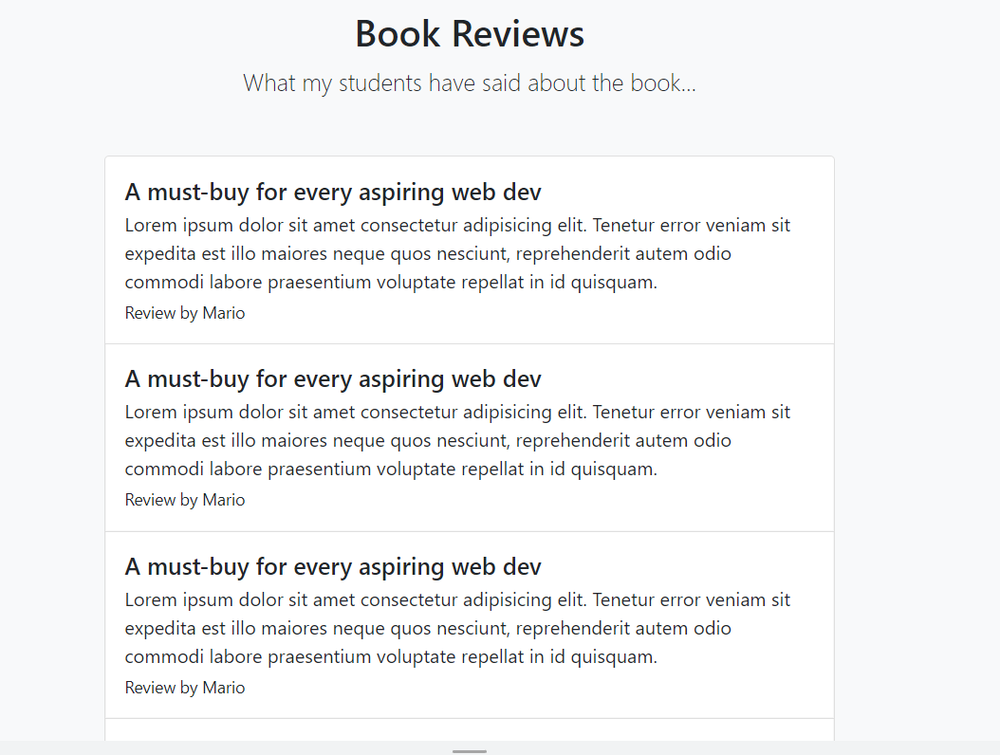

### Bootstrap icons 
> Installation methods
Bootstrap Icons are published to npm, but they can also be manually downloaded if needed.

1. npm
```bash 
npm i bootstrap-icons
```
2. Download 


3. CDN link 
Include the icon fonts stylesheet—in your website <head> or via @import in CSS
```bash 
<link rel="stylesheet" href="https:#cdn.jsdelivr.net/npm/bootstrap-icons@1.8.1/font/bootstrap-icons.css">
# or 
@import url("https:#cdn.jsdelivr.net/npm/bootstrap-icons@1.8.1/font/bootstrap-icons.css");
```
> adding icons to our website 
```bash 
<html lang="en">
<head>
  <meta charset="UTF-8">
  <meta http-equiv="X-UA-Compatible" content="IE=edge">
  <meta name="viewport" content="width=device-width, initial-scale=1.0">
  <title>Net Ninja Pro - the Book</title>
  # adding the CDN link 
  <link rel="stylesheet" href="https:#cdn.jsdelivr.net/npm/bootstrap-icons@1.5.0/font/bootstrap-icons.css">
  <link href="https:#cdn.jsdelivr.net/npm/bootstrap@5.0.1/dist/css/bootstrap.min.css" rel="stylesheet" integrity="sha384-+0n0xVW2eSR5OomGNYDnhzAbDsOXxcvSN1TPprVMTNDbiYZCxYbOOl7+AMvyTG2x" crossorigin="anonymous">
  <style>
    section{
      padding: 60px 0;
    }
  </style>
</head>
<body>
  <!-- navbar -->
  <nav class="navbar navbar-expand-md navbar-light pt-5 pb-4">
    <div class="container-xxl">
      <!-- navbar brand / title -->
      <a class="navbar-brand" href="#intro">
        <span class="text-secondary fw-bold">
          # adding icon over here 
          <i class="bi bi-book-half"></i>
          Net Ninja Pro - the Book
        </span>
      </a>
      <!-- toggle button for mobile nav -->
      <button class="navbar-toggler" type="button" data-bs-toggle="collapse" data-bs-target="#main-nav" aria-controls="main-nav" aria-expanded="false" aria-label="Toggle navigation">
        <span class="navbar-toggler-icon"></span>
      </button>

      <!-- navbar links -->
      <div class="collapse navbar-collapse justify-content-end align-center" id="main-nav">
        <ul class="navbar-nav">
          <li class="nav-item">
            <a class="nav-link" href="#topics">About The Book</a>
          </li>
          <li class="nav-item">
            <a class="nav-link" href="#reviews">Reviews</a>
          </li>
          <li class="nav-item">
            <a class="nav-link" href="#contact">Get in Touch</a>
          </li>
          <li class="nav-item d-md-none">
            <a class="nav-link" href="#pricing">Pricing</a>
          </li>
          <li class="nav-item ms-2 d-none d-md-inline">
            <a class="btn btn-secondary" href="#pricing">buy now</a>
          </li>
          
        </ul>
      </div>
    </div>
  </nav>

  <!-- main image & intro text -->
  <section id="intro">
    <div class="container-lg">
      <div class="row g-4 justify-content-center align-items-center">
        <div class="col-md-5 text-center text-md-start">
          <h1>
            <div class="display-2">Black-Belt</div>
            <div class="display-5 text-muted">Your Coding Skills</div>
          </h1>
          <p class="lead my-4 text-muted">Lorem ipsum dolor sit amet consectetur adipisicing elit. Laboriosam, dignissimos?</p>
          <a href="#pricing" class="btn btn-secondary btn-lg">Buy Now</a>
        </div>
        <div class="col-md-5 text-center d-none d-md-block">
          
        </div>
      </div>
    </div>
  </section>

  <!-- pricing plans -->
  <section id="pricing" class="bg-light mt-5">
    <div class="container-lg">
      <div class="text-center">
        <h2>Pricing Plans</h2>
        <p class="lead text-muted">Choose a pricing plan to suit you.</p>
      </div>

      <div class="row my-5 g-0 align-items-center justify-content-center">
        <div class="col-8 col-lg-4 col-xl-3">
          <div class="card border-0">
            <div class="card-body text-center py-4">
              <h4 class="card-title">Starter Edition</h4>
              <p class="lead card-subtitle">eBook download only</p>
              <p class="display-5 my-4 text-primary fw-bold">$12.99</p>
              <p class="card-text mx-5 text-muted d-none d-lg-block">Lorem ipsum dolor sit amet consectetur adipisicing elit. Mollitia, vitae magni! Repellat commodi a fuga corporis saepe dolorum.</p>
              <a href="#" class="btn btn-outline-primary btn-lg mt-3">
                Buy Now
              </a>
            </div>
          </div>
        </div>

        <div class="col-9 col-lg-4">
          <div class="card border-primary border-2">
            <div class="card-header text-center text-primary">Most Popular</div>
            <div class="card-body text-center py-5">
              <h4 class="card-title">Complete Edition</h4>
              <p class="lead card-subtitle">eBook download & all updates</p>
              <p class="display-4 my-4 text-primary fw-bold">$18.99</p>
              <p class="card-text mx-5 text-muted d-none d-lg-block">Lorem ipsum dolor sit amet consectetur adipisicing elit. Mollitia, vitae magni! Repellat commodi a fuga corporis saepe dolorum.</p>
              <a href="#" class="btn btn-outline-primary btn-lg mt-3">
                Buy Now
              </a>
            </div>
          </div>
        </div>

        <div class="col-8 col-lg-4 col-xl-3">
          <div class="card border-0">
            <div class="card-body text-center py-4">
              <h4 class="card-title">Ultimate Edition</h4>
              <p class="lead card-subtitle">download, updates & extras</p>
              <p class="display-5 my-4 text-primary fw-bold">$24.99</p>
              <p class="card-text mx-5 text-muted d-none d-lg-block">Lorem ipsum dolor sit amet consectetur adipisicing elit. Mollitia, vitae magni! Repellat commodi a fuga corporis saepe dolorum.</p>
              <a href="#" class="btn btn-outline-primary btn-lg mt-3">
                Buy Now
              </a>
            </div>
          </div>
        </div>
      </div>

    </div><!-- end container -->
  </section>

  <!-- topics at a glance -->
  <section id="topics">
    <div class="container-md">
      <div class="text-center">
        <h2>Inside the Book...</h2>
        <p class="lead text-muted">A quick glance at the topics youll learn</p>
      </div>
      <div class="row my-5 g-5 justify-content-around align-items-center">
        <div class="col-6 col-lg-4">
          
        </div>
        <div class="col-lg-6">
          
          <!-- accordion -->
          <div class="accordion" id="chapters">
            <div class="accordion-item">
              <h2 class="accordion-header" id="heading-1">
                <button class="accordion-button" type="button" data-bs-toggle="collapse" data-bs-target="#chapter-1" aria-expanded="true" aria-controls="chapter-1">
                  Chapter 1 - Your First Web Page
                </button>
              </h2>
              <div id="chapter-1" class="accordion-collapse collapse show" aria-labelledby="heading-1" data-bs-parent="#chapters">
                <div class="accordion-body">
                  <p>Lorem, ipsum dolor sit amet consectetur adipisicing elit. Quis assumenda delectus sapiente quidem consequatur odit adipisci necessitatibus nemo aliquid minus modi tempore quibusdam quas vitae, animi ipsam nulla sunt alias.</p>
                  <p>Lorem, ipsum dolor sit amet consectetur adipisicing elit. Quis assumenda delectus sapiente quidem consequatur odit adipisci necessitatibus nemo aliquid minus modi tempore quibusdam quas vitae, animi ipsam nulla sunt alias.</p>
                </div>
              </div>
            </div>
            <div class="accordion-item">
              <h2 class="accordion-header" id="heading-2">
                <button class="accordion-button collapsed" type="button" data-bs-toggle="collapse" data-bs-target="#chapter-2" aria-expanded="false" aria-controls="chapter-2">
                  Chapter 2 - Mastering CSS
                </button>
              </h2>
              <div id="chapter-2" class="accordion-collapse collapse" aria-labelledby="heading-2" data-bs-parent="#chapters">
                <div class="accordion-body">
                  <p>Lorem, ipsum dolor sit amet consectetur adipisicing elit. Quis assumenda delectus sapiente quidem consequatur odit adipisci necessitatibus nemo aliquid minus modi tempore quibusdam quas vitae, animi ipsam nulla sunt alias.</p>
                  <p>Lorem, ipsum dolor sit amet consectetur adipisicing elit. Quis assumenda delectus sapiente quidem consequatur odit adipisci necessitatibus nemo aliquid minus modi tempore quibusdam quas vitae, animi ipsam nulla sunt alias.</p>
                </div>
              </div>
            </div>
            <div class="accordion-item">
              <h2 class="accordion-header" id="heading-3">
                <button class="accordion-button collapsed" type="button" data-bs-toggle="collapse" data-bs-target="#chapter-3" aria-expanded="false" aria-controls="chapter-1">
                  Chapter 3 - The Power of JavaScript
                </button>
              </h2>
              <div id="chapter-3" class="accordion-collapse collapse" aria-labelledby="heading-3" data-bs-parent="#chapters">
                <div class="accordion-body">
                  <p>Lorem, ipsum dolor sit amet consectetur adipisicing elit. Quis assumenda delectus sapiente quidem consequatur odit adipisci necessitatibus nemo aliquid minus modi tempore quibusdam quas vitae, animi ipsam nulla sunt alias.</p>
                  <p>Lorem, ipsum dolor sit amet consectetur adipisicing elit. Quis assumenda delectus sapiente quidem consequatur odit adipisci necessitatibus nemo aliquid minus modi tempore quibusdam quas vitae, animi ipsam nulla sunt alias.</p>
                </div>
              </div>
            </div>
            <div class="accordion-item">
              <h2 class="accordion-header" id="heading-4">
                <button class="accordion-button collapsed" type="button" data-bs-toggle="collapse" data-bs-target="#chapter-4" aria-expanded="false" aria-controls="chapter-4">
                  Chapter 4 - Storing Data (Firebase Databases)
                </button>
              </h2>
              <div id="chapter-4" class="accordion-collapse collapse" aria-labelledby="heading-4" data-bs-parent="#chapters">
                <div class="accordion-body">
                  <p>Lorem, ipsum dolor sit amet consectetur adipisicing elit. Quis assumenda delectus sapiente quidem consequatur odit adipisci necessitatibus nemo aliquid minus modi tempore quibusdam quas vitae, animi ipsam nulla sunt alias.</p>
                  <p>Lorem, ipsum dolor sit amet consectetur adipisicing elit. Quis assumenda delectus sapiente quidem consequatur odit adipisci necessitatibus nemo aliquid minus modi tempore quibusdam quas vitae, animi ipsam nulla sunt alias.</p>
                </div>
              </div>
            </div>
            <div class="accordion-item">
              <h2 class="accordion-header" id="heading-5">
                <button class="accordion-button collapsed" type="button" data-bs-toggle="collapse" data-bs-target="#chapter-5" aria-expanded="false" aria-controls="chapter-5">
                  Chapter 5 - User Authentication
                </button>
              </h2>
              <div id="chapter-5" class="accordion-collapse collapse" aria-labelledby="heading-5" data-bs-parent="#chapters">
                <div class="accordion-body">
                  <p>Lorem, ipsum dolor sit amet consectetur adipisicing elit. Quis assumenda delectus sapiente quidem consequatur odit adipisci necessitatibus nemo aliquid minus modi tempore quibusdam quas vitae, animi ipsam nulla sunt alias.</p>
                  <p>Lorem, ipsum dolor sit amet consectetur adipisicing elit. Quis assumenda delectus sapiente quidem consequatur odit adipisci necessitatibus nemo aliquid minus modi tempore quibusdam quas vitae, animi ipsam nulla sunt alias.</p>
                </div>
              </div>
            </div>
          </div>

        </div>
      </div>
    </div>
  </section>

  <!-- reviews list -->
  <section id="reviews" class="bg-light">
    <div class="container-lg">
      <div class="text-center">
      # adding icon over here 
        <h2><i class="bi bi-stars"></i>Book Reviews</h2>
        <p class="lead">What my students have said about the book...</p>
      </div>

      <div class="row justify-content-center my-5">
        <div class="col-lg-8">
          <div class="list-group">
            <div class="list-group-item py-3">
              <div class="pb-2">
                <i class="bi bi-star-fill"></i>
                <i class="bi bi-star-fill"></i>
                <i class="bi bi-star-fill"></i>
                <i class="bi bi-star-fill"></i>
                <i class="bi bi-star-fill"></i>
              </div>
              <h5 class="mb-1">A must-buy for every aspiring web dev</h5>
              <p class="mb-1">Lorem ipsum dolor sit amet consectetur adipisicing elit. Tenetur error veniam sit expedita est illo maiores neque quos nesciunt, reprehenderit autem odio commodi labore praesentium voluptate repellat in id quisquam.</p>
              <small>Review by Mario</small>
            </div>
            <div class="list-group-item py-3">
              <div class="pb-2">
                <i class="bi bi-star-fill"></i>
                <i class="bi bi-star-fill"></i>
                <i class="bi bi-star-fill"></i>
                <i class="bi bi-star-fill"></i>
                <i class="bi bi-star-fill"></i>
              </div>
              <h5 class="mb-1">A must-buy for every aspiring web dev</h5>
              <p class="mb-1">Lorem ipsum dolor sit amet consectetur adipisicing elit. Tenetur error veniam sit expedita est illo maiores neque quos nesciunt, reprehenderit autem odio commodi labore praesentium voluptate repellat in id quisquam.</p>
              <small>Review by Mario</small>
            </div>
            <div class="list-group-item py-3">
              <div class="pb-2">
                <i class="bi bi-star-fill"></i>
                <i class="bi bi-star-fill"></i>
                <i class="bi bi-star-fill"></i>
                <i class="bi bi-star-fill"></i>
                <i class="bi bi-star-half"></i>
              </div>
              <h5 class="mb-1">A must-buy for every aspiring web dev</h5>
              <p class="mb-1">Lorem ipsum dolor sit amet consectetur adipisicing elit. Tenetur error veniam sit expedita est illo maiores neque quos nesciunt, reprehenderit autem odio commodi labore praesentium voluptate repellat in id quisquam.</p>
              <small>Review by Mario</small>
            </div>
            <div class="list-group-item py-3">
              <div class="pb-2">
                <i class="bi bi-star-fill"></i>
                <i class="bi bi-star-fill"></i>
                <i class="bi bi-star-fill"></i>
                <i class="bi bi-star-fill"></i>
                <i class="bi bi-star-fill"></i>
              </div>
              <h5 class="mb-1">A must-buy for every aspiring web dev</h5>
              <p class="mb-1">Lorem ipsum dolor sit amet consectetur adipisicing elit. Tenetur error veniam sit expedita est illo maiores neque quos nesciunt, reprehenderit autem odio commodi labore praesentium voluptate repellat in id quisquam.</p>
              <small>Review by Mario</small>
            </div>
            <div class="list-group-item py-3">
              <div class="pb-2">
                <i class="bi bi-star-fill"></i>
                <i class="bi bi-star-fill"></i>
                <i class="bi bi-star-fill"></i>
                <i class="bi bi-star-fill"></i>
                <i class="bi bi-star-half"></i>
              </div>
              <h5 class="mb-1">A must-buy for every aspiring web dev</h5>
              <p class="mb-1">Lorem ipsum dolor sit amet consectetur adipisicing elit. Tenetur error veniam sit expedita est illo maiores neque quos nesciunt, reprehenderit autem odio commodi labore praesentium voluptate repellat in id quisquam.</p>
              <small>Review by Mario</small>
            </div>
          </div>
        </div>
      </div>
    </div>
  </section>
  <script src="https:#cdn.jsdelivr.net/npm/bootstrap@5.0.1/dist/js/bootstrap.bundle.min.js" integrity="sha384-gtEjrD/SeCtmISkJkNUaaKMoLD0#ElJ19smozuHV6z3Iehds+3Ulb9Bn9Plx0x4" crossorigin="anonymous"></script>
</body>
</html>
```
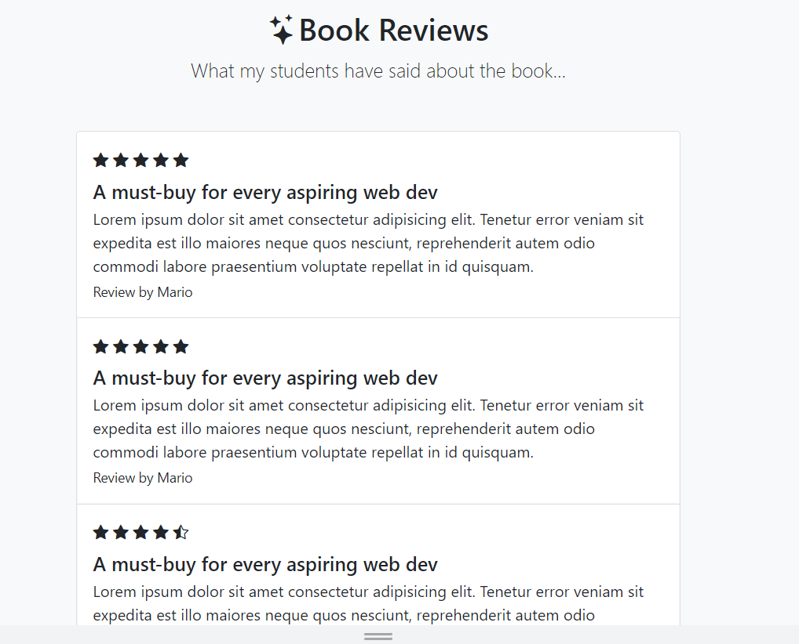

### Form Control 
```bash 
  <!-- contact form -->
  <!-- form-control, form-label, form-select, input-group, input-group-text -->
  <section id="contact">
    <div class="container-lg">
      
      <div class="text-center">
        <h2>Get in Touch</h2>
        <p class="lead">Questions to ask? Fill out the form to contact me directly...</p>
      </div>
      <div class="row justify-content-center my-5">
        <div class="col-lg-6">
          
          <form>
            <label for="email" class="form-label">Email address:</label>
            # input groups have a label to the lhs 
            <div class="input-group mb-4">
              <span class="input-group-text">
                <i class="bi bi-envelope-fill text-secondary"></i>
              </span>
              <input type="text" id="email" class="form-control" placeholder="e.g. mario@example.com" />
            </div>

            <label for="name" class="form-label">Name:</label>
            <div class="mb-4 input-group">
              <span class="input-group-text">
                <i class="bi bi-person-fill text-secondary"></i>
              </span>
              <input type="text" id="name" class="form-control" placeholder="e.g. Mario" />
            </div>

            <label for="subject" class="form-label">What is your question about?</label>
            <div class="mb-4 input-group">
              <span class="input-group-text">
                <i class="bi bi-chat-right-dots-fill text-secondary"></i>
              </span>
              <select class="form-select" id="subject">
                <option value="pricing" selected>Pricing query</option>
                <option value="content">Content query</option>
                <option value="other">Other query</option>
              </select>
            </div>

            # create a floating label 
            # your query label will be inside the text label 
            # when you click on the text field this label will move upwords and space will be made in the text field for the user to enter text 
            <div class="mb-4 mt-5 form-floating">
              <textarea class="form-control" id="query" style="height: 140px" placeholder="query"></textarea>
              <label for="query">Your query...</label>
            </div>
            <div class="mb-4 text-center">
              <button type="submit" class="btn btn-secondary">Submit</button>
            </div>
          </form>
        </div>
      </div>
    </div>
  </section>
```
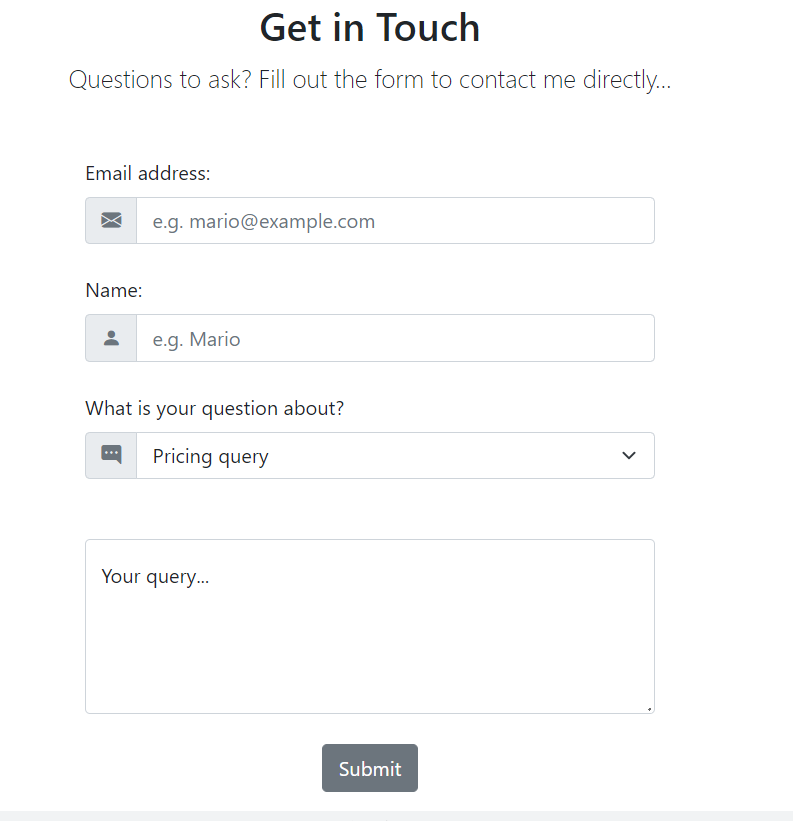

### Tooltips 
Tooltips are a peice of marker text that appears when you hover the mouse over the hyperlink 
```bash 
<body>
  <!-- contact form -->
  # <!-- form-control, form-label, form-select, input-group, input-group-text -->
  <section id="contact">
    <div class="container-lg">
      
      <div class="text-center">
        <h2>Get in Touch</h2>
        <p class="lead">Questions to ask? Fill out the form to contact me directly...</p>
      </div>
      <div class="row justify-content-center my-5">
        <div class="col-lg-6">
          
          <form>
            <label for="email" class="form-label">Email address:</label>
            <div class="input-group mb-4">
              <span class="input-group-text">
                <i class="bi bi-envelope-fill text-secondary"></i>
              </span>
              <input type="text" id="email" class="form-control" placeholder="e.g. mario@example.com" />
              <!-- tooltip -->
              # <!-- add tt class to implement the tooltip when user clicks on the icon -->
              <span class="input-group-text">
                <span class="tt" data-bs-placement="bottom" title="Enter an email address we can reply to.">
                  <i class="bi bi-question-circle text-muted"></i>
                </span>
              </span>
            </div>
            <label for="name" class="form-label">Name:</label>
            <div class="mb-4 input-group">
              <span class="input-group-text">
                <i class="bi bi-person-fill text-secondary"></i>
              </span>
              <input type="text" id="name" class="form-control" placeholder="e.g. Mario" />
              <!-- tooltip -->
              <span class="input-group-text">
                <span class="tt" data-bs-placement="bottom" title="Pretty self explanatory really...">
                  <i class="bi bi-question-circle text-muted"></i>
                </span>
              </span>
            </div>
            <label for="subject" class="form-label">What is your question about?</label>
            <div class="mb-4 input-group">
              <span class="input-group-text">
                <i class="bi bi-chat-right-dots-fill text-secondary"></i>
              </span>
              <select class="form-select" id="subject">
                <option value="pricing" selected>Pricing query</option>
                <option value="content">Content query</option>
                <option value="other">Other query</option>
              </select>
            </div>
            <div class="mb-4 mt-5 form-floating">
              <textarea class="form-control" id="query" style="height: 140px" placeholder="query"></textarea>
              <label for="query">Your query...</label>
            </div>
            <div class="mb-4 text-center">
              <button type="submit" class="btn btn-secondary">Submit</button>
            </div>
          </form>
        </div>
      </div>
    </div>
  </section>

  <!-- get updates / modal trigger -->
  <script src="https:#cdn.jsdelivr.net/npm/bootstrap@5.0.1/dist/js/bootstrap.bundle.min.js" integrity="sha384-gtEjrD/SeCtmISkJkNUaaKMoLD0#ElJ19smozuHV6z3Iehds+3Ulb9Bn9Plx0x4" crossorigin="anonymous"></script>
  <script>
    const tooltips = document.querySelectorAll('.tt')
    # for each tooltip fire a function
    # every time you hover over the image, the tooltip shows up
    tooltips.forEach(t => {
      new bootstrap.Tooltip(t)
    })
  </script>
</body>
</html>
```
> When you hover over this button tooltip will appear 
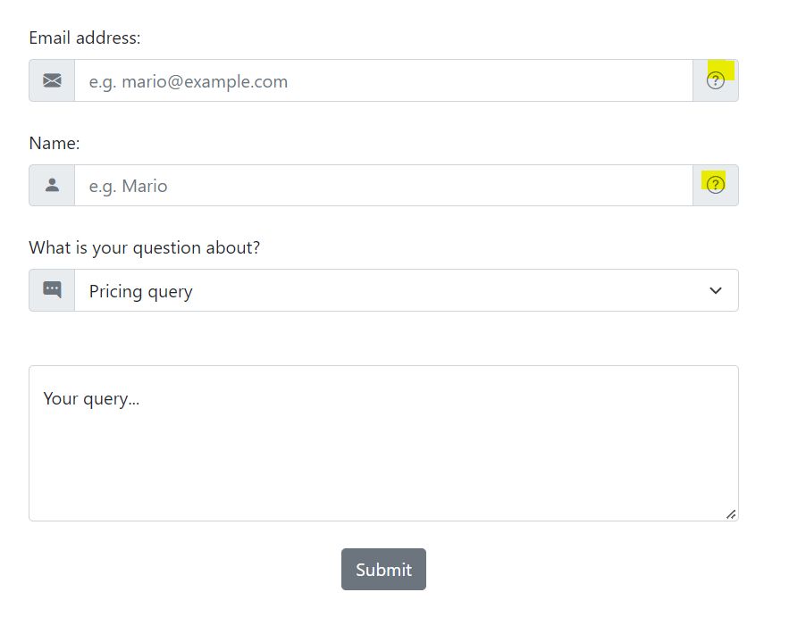

### Modals 
 It is a dialog window that opens inside the browser window on triggering certain events. 
```bash 
<body>
  # <!-- get updates / modal trigger -->
  <section class="bg-light">
    <div class="container">
      <div class="text-center">
        <h2>Stay in The Loop</h2>
        <p class="lead">Get the latest updates as they happen...</p>
      </div>
      <div class="row justify-content-center">
        <div class="col-md-8 text-center">
          <p class="text-muted my-4">Lorem ipsum dolor sit amet consectetur adipisicing elit. Vero exercitationem voluptatibus porro, hic asperiores fuga illo voluptates obcaecati deleniti veritatis sunt saepe quasi deserunt ex ipsum. Est possimus, aspernatur, vitae eligendi rem odit quaerat, ipsum pariatur ratione maxime delectus fuga minus accusamus dolores iusto maiores accusantium cumque magnam placeat quia!</p>
          # on clciking the button were saying what id were going to toggle
          # create a modal with #reg-modal ID in the script tag below
          <button class="btn btn-primary" data-bs-toggle="modal" data-bs-target="#reg-modal">
            Register for Updates
          </button>
        </div>
      </div>
    </div>
  </section>

  # <!-- modal itself -->
  <div class="modal fade" id="reg-modal" tabindex="-1" aria-labelledby="modal-title" aria-hidden="true">
    <div class="modal-dialog">
    # all content of the modal will be inside this 
      <div class="modal-content">
        <div class="modal-header">
          <h5 class="modal-title" id="modal-title">Get the Latest Updates</h5>
          # data-bs-dismiss says what to dismiss/ close when user clicks on btn-close button 
          <button type="button" class="btn-close" data-bs-dismiss="modal" aria-label="Close"></button>
        </div>
        <div class="modal-body">
          <p>Lorem, ipsum dolor sit amet consectetur adipisicing elit. Quis, exercitationem laboriosam nihil minus voluptatibus harum aliquam consequatur pariatur inventore dignissimos illum excepturi ratione ipsum sit iusto alias eligendi fugit laborum?</p>
          <label for="modal-email" class="form-label">Your email address:</label>
          <input type="text" class="form-control" id="modal-email" placeholder="e.g. mario@example.com">
        </div>
        # call the modal popup when user clicks on this button
        <div class="modal-footer">
          <button type="button" class="btn btn-primary">Submit</button>
        </div>
      </div>
    </div>
  </div>
  
  <script src="https:#cdn.jsdelivr.net/npm/bootstrap@5.0.1/dist/js/bootstrap.bundle.min.js" integrity="sha384-gtEjrD/SeCtmISkJkNUaaKMoLD0#ElJ19smozuHV6z3Iehds+3Ulb9Bn9Plx0x4" crossorigin="anonymous"></script>
  <script>
    const tooltips = document.querySelectorAll('.tt')
    tooltips.forEach(t => {
      new bootstrap.Tooltip(t)
    })
  </script>
</body>
</html>
```
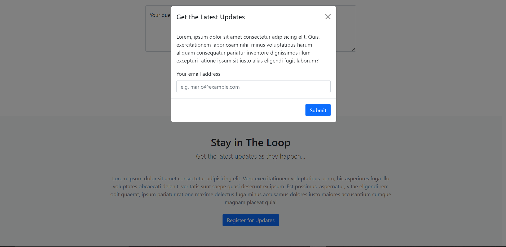

### offcanvas component 
Allows us to create slide-in sidebar
```bash 
<html lang="en">
<head>
  <meta charset="UTF-8">
  <meta http-equiv="X-UA-Compatible" content="IE=edge">
  <meta name="viewport" content="width=device-width, initial-scale=1.0">
  <title>Net Ninja Pro - the Book</title>
  <link rel="stylesheet" href="https:#cdn.jsdelivr.net/npm/bootstrap-icons@1.5.0/font/bootstrap-icons.css">
  <link href="https:#cdn.jsdelivr.net/npm/bootstrap@5.0.1/dist/css/bootstrap.min.css" rel="stylesheet" integrity="sha384-+0n0xVW2eSR5OomGNYDnhzAbDsOXxcvSN1TPprVMTNDbiYZCxYbOOl7+AMvyTG2x" crossorigin="anonymous">
  <style>
    section{
      padding: 60px 0;
    }
  </style>
</head>
<body>

  <!-- navbar -->
  <nav class="navbar navbar-expand-md navbar-light pt-5 pb-4">
    <div class="container-xxl">
      <!-- navbar brand / title -->
      <a class="navbar-brand" href="#intro">
        <span class="text-secondary fw-bold">
          <i class="bi bi-book-half"></i>
          Net Ninja Pro - the Book
        </span>
      </a>
      <!-- toggle button for mobile nav -->
      <button class="navbar-toggler" type="button" data-bs-toggle="collapse" data-bs-target="#main-nav" aria-controls="main-nav" aria-expanded="false" aria-label="Toggle navigation">
        <span class="navbar-toggler-icon"></span>
      </button>

      <!-- navbar links -->
      <div class="collapse navbar-collapse justify-content-end align-center" id="main-nav">
        <ul class="navbar-nav">
          <li class="nav-item">
            <a class="nav-link" href="#topics">About The Book</a>
          </li>
          <li class="nav-item">
            <a class="nav-link" href="#reviews">Reviews</a>
          </li>
          <li class="nav-item">
            <a class="nav-link" href="#contact">Get in Touch</a>
          </li>
          <li class="nav-item d-md-none">
            <a class="nav-link" href="#pricing">Pricing</a>
          </li>
          <li class="nav-item ms-2 d-none d-md-inline">
            <a class="btn btn-secondary" href="#pricing">buy now</a>
          </li>
          
        </ul>
      </div>
    </div>
  </nav>

  <!-- main image & intro text -->
  <section id="intro">
    <div class="container-lg">
      <div class="row g-4 justify-content-center align-items-center">
        <div class="col-md-5 text-center text-md-start">
          <h1>
            <div class="display-2">Black-Belt</div>
            <div class="display-5 text-muted">Your Coding Skills</div>
          </h1>
          <p class="lead my-4 text-muted">Lorem ipsum dolor sit amet consectetur adipisicing elit. Laboriosam, dignissimos?</p>
          <a href="#pricing" class="btn btn-secondary btn-lg">Buy Now</a>

          # ✅open sidebar / offcanvas
          # data-bs-toggle tells bootstrap what function to fire when the button is clicked 
          # aria-controls:sidebar 
          # when we click on this anchor tag it tries to find #sidebar
          <a href="#sidebar" class="d-block mt-3" data-bs-toggle="offcanvas" role="button" aria-controls="sidebar">
            Explore my other books
          </a>

        </div>
        <div class="col-md-5 text-center d-none d-md-block">
          <!-- tooltip -->
          <span class="tt" data-bs-placement="bottom" title="Net Ninja Pro book cover">
            
          </span>
        </div>
      </div>
    </div>
  </section>

  # side panel / offcanvas 
  # offcanvas-start means the side popup will appear from the lhs when you click on Explore my books 
  # other values to try, based on where you want the offcanvas to allign: end / top / bottom 
  # aria-labelledby-sidebar-label means its targetting that div from above 
  <div class="offcanvas offcanvas-start" tabindex="-1" id="sidebar" aria-labelledby="sidebar-label">
    <div class="offcanvas-header">
      <h5 class="offcanvas-title" id="sidebar-label">My Other Books</h5>
      <button type="button" class="btn-close" data-bs-dismiss="offcanvas" aria-label="Close"></button>
    </div>
    <div class="offcanvas-body">
      <p>Lorem, ipsum dolor sit amet consectetur adipisicing elit. In minima ducimus excepturi quasi tempore fugit quis voluptatibus aut error possimus, tenetur natus magni quam voluptatem quae eligendi repudiandae delectus eaque!</p>
    </div>
  </div>

  <script src="https:#cdn.jsdelivr.net/npm/bootstrap@5.0.1/dist/js/bootstrap.bundle.min.js" integrity="sha384-gtEjrD/SeCtmISkJkNUaaKMoLD0#ElJ19smozuHV6z3Iehds+3Ulb9Bn9Plx0x4" crossorigin="anonymous"></script>
  <script>
    const tooltips = document.querySelectorAll('.tt')
    tooltips.forEach(t => {
      new bootstrap.Tooltip(t)
    })
  </script>
</body>
```
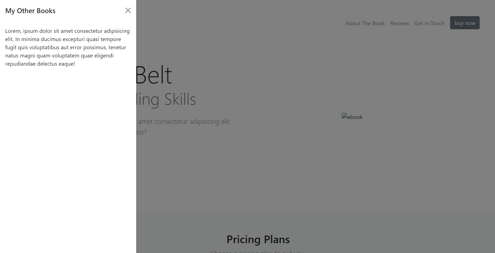

### Dropdowns 
```bash 
  <!-- inside this offcanvas we add a dropdown -->
  <div class="offcanvas offcanvas-start" tabindex="-1" id="sidebar" aria-labelledby="sidebar-label">
    <div class="offcanvas-header">
      <h5 class="offcanvas-title" id="sidebar-label">My Other Books</h5>
      <button type="button" class="btn-close" data-bs-dismiss="offcanvas" aria-label="Close"></button>
    </div>
    <div class="offcanvas-body">
      <p>Lorem, ipsum dolor sit amet consectetur adipisicing elit. In minima ducimus excepturi quasi tempore fugit quis voluptatibus aut error possimus, tenetur natus magni quam voluptatem quae eligendi repudiandae delectus eaque!</p>

      <!-- dropdown -->
      <div class="dropdown mt-3">
        <button class="btn btn-secondary dropdown-toggle" type="button" id="book-dropdown" data-bs-toggle="dropdown">
          Choose a book title
        </button>
        <ul class="dropdown-menu" aria-labelledby="book-dropdown">
          <li><a class="dropdown-item" href="#">Become a React Superhero</a></li>
          <li><a class="dropdown-item" href="#">Conquering Vue.js</a></li>
          <li><a class="dropdown-item" href="#">Levelling up Your Next.js</a></li>
        </ul>
      </div>
    </div>
  </div>
```
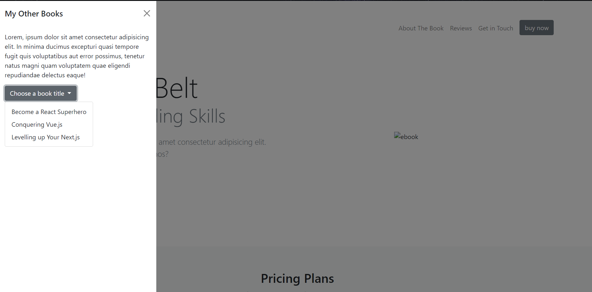

### Gutter 
It gives space between either 2 columns (gy-*) or 2 rows(gx-*). To add gutter to both column and row with the same value use (g-*). where * varies from 1-5

### Customizing Bootstrap 
> If you want to customize the values that bootstrap uses, we can implement two ways:
1. make a stylesheet defining all the bootstrap classes and assign styling to them, then integrate to your webpage index.html. 
2. Use custom SASS files to update bootstrap variables.
- we run `npm init` on terminal after creating a new repo and an index.html file inside of it. This command creates a `package.json` file for your project.
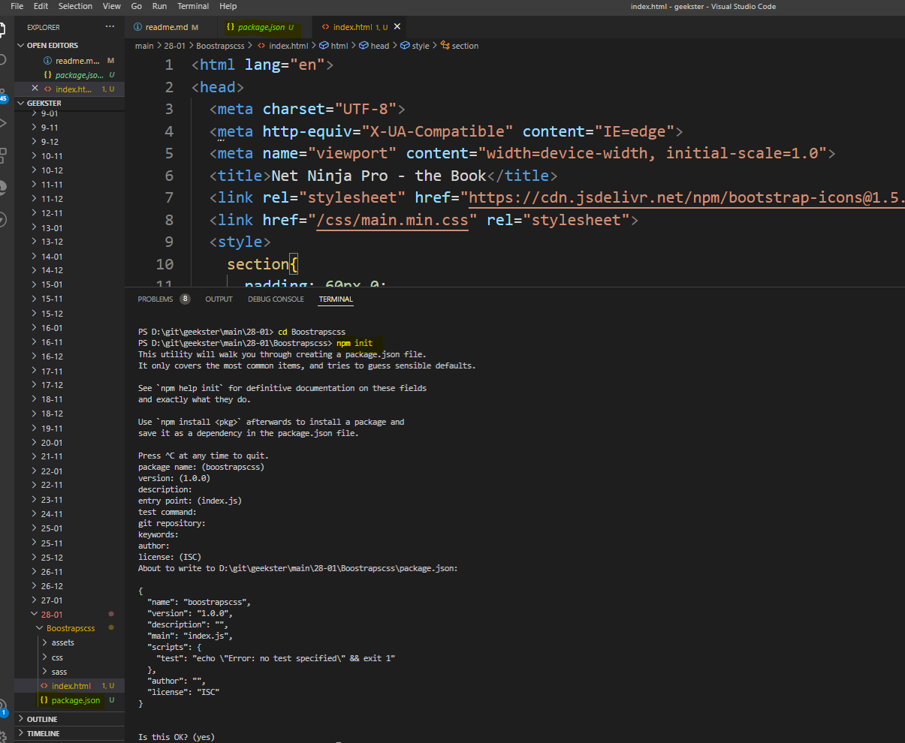
- Install bootstrap through terminal (alternative to the CDN install method)
```bash 
npm install bootstrap 
```
> Bootstrap is installed inside `node_modules` folder, created by the command itself
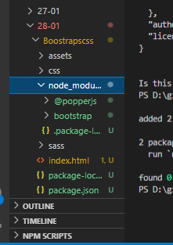
- When you navigate to `node_modules/dist/css`, you will see a bunch of bootstrap css files 
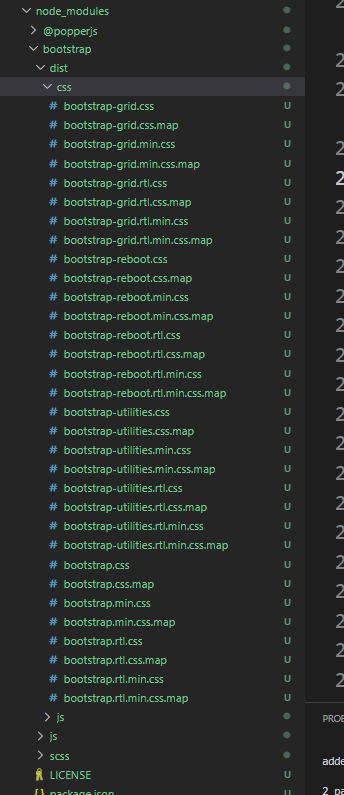
- When you navigate to `node_modules/scss/`, you will see a bunch of partial scss files, these files contain all the variable declaration for the bootstrap class above. 
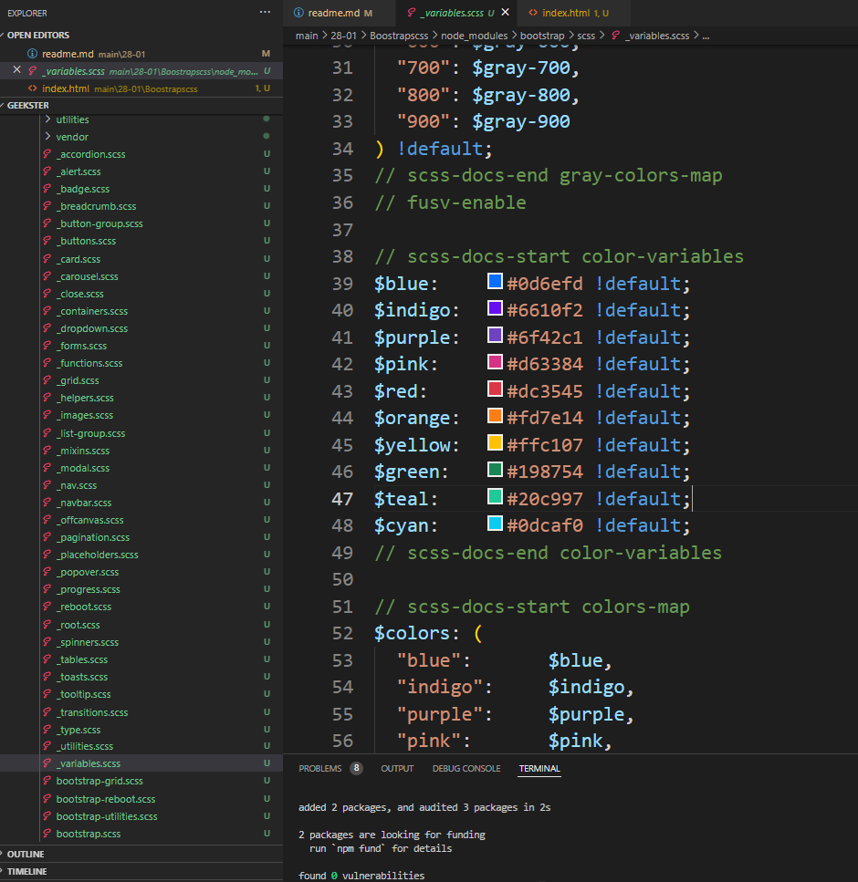

***Package.json has added boostrap as a dependency ***
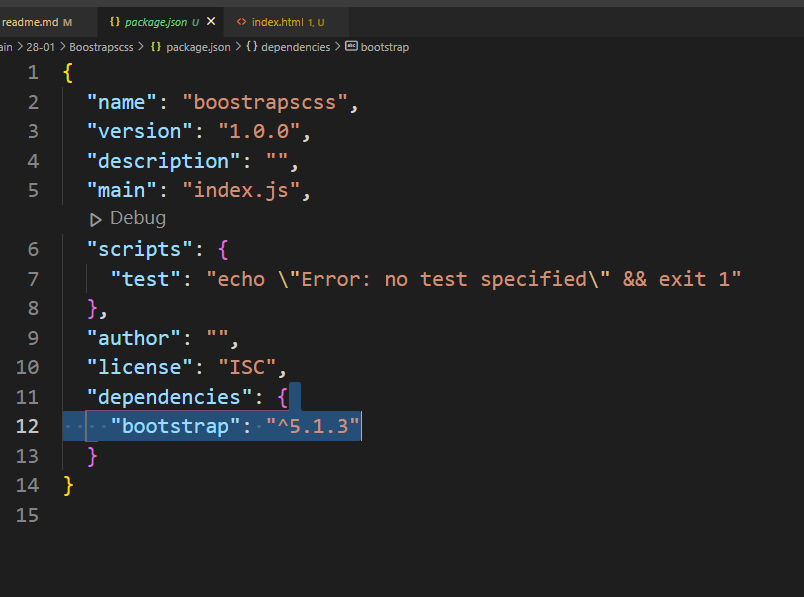

> Note that: We can make changes to the variables by changing contents of `node_modules/scss/_variables.scss` but after compiling this file, we will be loosing all the original bootstrap values. To prevent this, were creating another `scss` file.
- we created `sass` folder in the root and created `main.scss` file, with the contents given below:
```bash 
# were declaring the value of primary before the import because in the _variables.scss file its given a default parameter, so we want to declare this value, before physically comparing it with _variables.scss
$primary: #e50dfd;

# import all the bootstrap SASS
@import '../node_modules/bootstrap/scss/bootstrap.scss';
# were going to be updating variables from this url over here in main.scss 
```
> Here's a snippet of `node_modules/scss/_variables.scss`
```bash 
// scss-docs-start theme-color-variables
//it says default which means use primary as blue if its not already declared by the user elsewhere 
$primary:       $blue !default;
$secondary:     $gray-600 !default;
$success:       $green !default;
$info:          $cyan !default;
$warning:       $yellow !default;
$danger:        $red !default;
$light:         $gray-100 !default;
$dark:          $gray-900 !default;
// scss-docs-end theme-color-variables
```
> Go to `index.html`add this `css link tag` and click on `watch sass`. This command will automatically create a `main.css` file for you. 

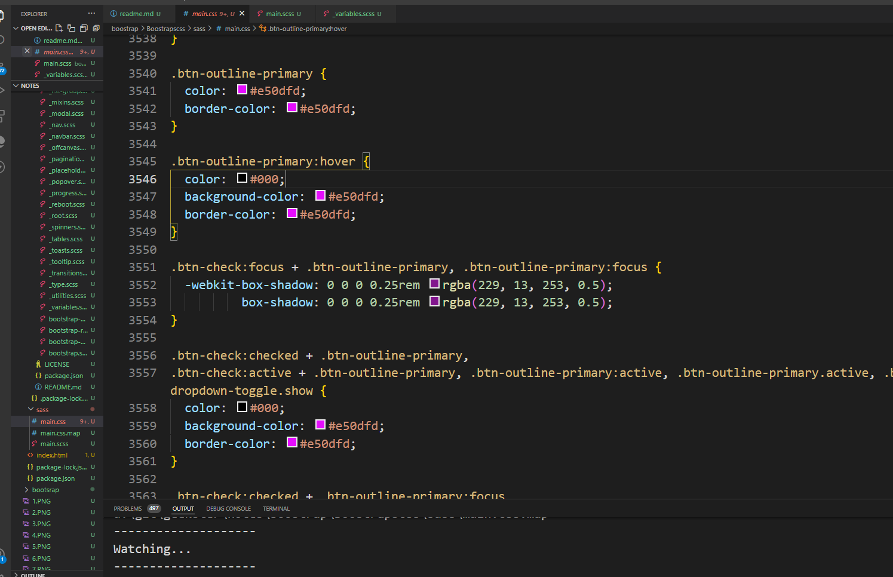

> index.html 
```bash 
<html lang="en">
<head>
  <meta charset="UTF-8">
  <meta http-equiv="X-UA-Compatible" content="IE=edge">
  <meta name="viewport" content="width=device-width, initial-scale=1.0">
  <title>Net Ninja Pro - the Book</title>
  <link rel="stylesheet" href="https://cdn.jsdelivr.net/npm/bootstrap-icons@1.5.0/font/bootstrap-icons.css">
  <link href="sass/main.css" rel="stylesheet">
  <style>
    section{
      padding: 60px 0;
    }
  </style>
</head>
<body>

  <!-- navbar -->
  <nav class="navbar navbar-expand-md navbar-light pt-5 pb-4">
    <div class="container-xxl">
      <!-- navbar brand / title -->
      <a class="navbar-brand" href="#intro">
        <span class="text-secondary fw-bold">
          <i class="bi bi-book-half"></i>
          Net Ninja Pro - the Book
        </span>
      </a>
      <!-- toggle button for mobile nav -->
      <button class="navbar-toggler" type="button" data-bs-toggle="collapse" data-bs-target="#main-nav" aria-controls="main-nav" aria-expanded="false" aria-label="Toggle navigation">
        <span class="navbar-toggler-icon"></span>
      </button>

      <!-- navbar links -->
      <div class="collapse navbar-collapse justify-content-end align-center" id="main-nav">
        <ul class="navbar-nav">
          <li class="nav-item">
            <a class="nav-link" href="#topics">About The Book</a>
          </li>
          <li class="nav-item">
            <a class="nav-link" href="#reviews">Reviews</a>
          </li>
          <li class="nav-item">
            <a class="nav-link" href="#contact">Get in Touch</a>
          </li>
          <li class="nav-item d-md-none">
            <a class="nav-link" href="#pricing">Pricing</a>
          </li>
          <li class="nav-item ms-2 d-none d-md-inline">
            <a class="btn btn-secondary" href="#pricing">buy now</a>
          </li>
          
        </ul>
      </div>
    </div>
  </nav>

  <!-- main image & intro text -->
  <section id="intro">
    <div class="container-lg">
      <div class="row g-4 justify-content-center align-items-center">
        <div class="col-md-5 text-center text-md-start">
          <h1>
            <div class="display-2">Black-Belt</div>
            <div class="display-5 text-muted">Your Coding Skills</div>
          </h1>
          <p class="lead my-4 text-muted">Lorem ipsum dolor sit amet consectetur adipisicing elit. Laboriosam, dignissimos?</p>
          <a href="#pricing" class="btn btn-secondary btn-lg">Buy Now</a>
          <!-- open sidebar / offcanvas -->
          <a href="#sidebar" class="d-block mt-3" data-bs-toggle="offcanvas" role="button" aria-controls="sidebar">
            Explore my other books
          </a>
        </div>
        <div class="col-md-5 text-center d-none d-md-block">
          <!-- tooltip -->
          <span class="tt" data-bs-placement="bottom" title="Net Ninja Pro book cover">
            
          </span>
        </div>
      </div>
    </div>
  </section>

  <!-- pricing plans -->
  <section id="pricing" class="bg-light mt-5">
    <div class="container-lg">
      <div class="text-center">
        <h2>Pricing Plans</h2>
        <p class="lead text-muted">Choose a pricing plan to suit you.</p>
      </div>

      <div class="row my-5 g-0 align-items-center justify-content-center">
        <div class="col-8 col-lg-4 col-xl-3">
          <div class="card border-0">
            <div class="card-body text-center py-4">
              <h4 class="card-title">Starter Edition</h4>
              <p class="lead card-subtitle">eBook download only</p>
              <p class="display-5 my-4 text-primary fw-bold">$12.99</p>
              <p class="card-text mx-5 text-muted d-none d-lg-block">Lorem ipsum dolor sit amet consectetur adipisicing elit. Mollitia, vitae magni! Repellat commodi a fuga corporis saepe dolorum.</p>
              <a href="#" class="btn btn-outline-primary btn-lg mt-3">
                Buy Now
              </a>
            </div>
          </div>
        </div>

        <div class="col-9 col-lg-4">
          <div class="card border-primary border-2">
            <div class="card-header text-center text-primary">Most Popular</div>
            <div class="card-body text-center py-5">
              <h4 class="card-title">Complete Edition</h4>
              <p class="lead card-subtitle">eBook download & all updates</p>
              <p class="display-4 my-4 text-primary fw-bold">$18.99</p>
              <p class="card-text mx-5 text-muted d-none d-lg-block">Lorem ipsum dolor sit amet consectetur adipisicing elit. Mollitia, vitae magni! Repellat commodi a fuga corporis saepe dolorum.</p>
              <a href="#" class="btn btn-outline-primary btn-lg mt-3">
                Buy Now
              </a>
            </div>
          </div>
        </div>

        <div class="col-8 col-lg-4 col-xl-3">
          <div class="card border-0">
            <div class="card-body text-center py-4">
              <h4 class="card-title">Ultimate Edition</h4>
              <p class="lead card-subtitle">download, updates & extras</p>
              <p class="display-5 my-4 text-primary fw-bold">$24.99</p>
              <p class="card-text mx-5 text-muted d-none d-lg-block">Lorem ipsum dolor sit amet consectetur adipisicing elit. Mollitia, vitae magni! Repellat commodi a fuga corporis saepe dolorum.</p>
              <a href="#" class="btn btn-outline-primary btn-lg mt-3">
                Buy Now
              </a>
            </div>
          </div>
        </div>
      </div>

    </div><!-- end container -->
  </section>

  <!-- topics at a glance -->
  <section id="topics">
    <div class="container-md">
      <div class="text-center">
        <h2>Inside the Book...</h2>
        <p class="lead text-muted">A quick glance at the topics youll learn</p>
      </div>
      <div class="row my-5 g-5 justify-content-around align-items-center">
        <div class="col-6 col-lg-4">
          
        </div>
        <div class="col-lg-6">
          
          <!-- accordion -->
          <div class="accordion" id="chapters">
            <div class="accordion-item">
              <h2 class="accordion-header" id="heading-1">
                <button class="accordion-button" type="button" data-bs-toggle="collapse" data-bs-target="#chapter-1" aria-expanded="true" aria-controls="chapter-1">
                  Chapter 1 - Your First Web Page
                </button>
              </h2>
              <div id="chapter-1" class="accordion-collapse collapse show" aria-labelledby="heading-1" data-bs-parent="#chapters">
                <div class="accordion-body">
                  <p>Lorem, ipsum dolor sit amet consectetur adipisicing elit. Quis assumenda delectus sapiente quidem consequatur odit adipisci necessitatibus nemo aliquid minus modi tempore quibusdam quas vitae, animi ipsam nulla sunt alias.</p>
                  <p>Lorem, ipsum dolor sit amet consectetur adipisicing elit. Quis assumenda delectus sapiente quidem consequatur odit adipisci necessitatibus nemo aliquid minus modi tempore quibusdam quas vitae, animi ipsam nulla sunt alias.</p>
                </div>
              </div>
            </div>
            <div class="accordion-item">
              <h2 class="accordion-header" id="heading-2">
                <button class="accordion-button collapsed" type="button" data-bs-toggle="collapse" data-bs-target="#chapter-2" aria-expanded="false" aria-controls="chapter-2">
                  Chapter 2 - Mastering CSS
                </button>
              </h2>
              <div id="chapter-2" class="accordion-collapse collapse" aria-labelledby="heading-2" data-bs-parent="#chapters">
                <div class="accordion-body">
                  <p>Lorem, ipsum dolor sit amet consectetur adipisicing elit. Quis assumenda delectus sapiente quidem consequatur odit adipisci necessitatibus nemo aliquid minus modi tempore quibusdam quas vitae, animi ipsam nulla sunt alias.</p>
                  <p>Lorem, ipsum dolor sit amet consectetur adipisicing elit. Quis assumenda delectus sapiente quidem consequatur odit adipisci necessitatibus nemo aliquid minus modi tempore quibusdam quas vitae, animi ipsam nulla sunt alias.</p>
                </div>
              </div>
            </div>
            <div class="accordion-item">
              <h2 class="accordion-header" id="heading-3">
                <button class="accordion-button collapsed" type="button" data-bs-toggle="collapse" data-bs-target="#chapter-3" aria-expanded="false" aria-controls="chapter-1">
                  Chapter 3 - The Power of JavaScript
                </button>
              </h2>
              <div id="chapter-3" class="accordion-collapse collapse" aria-labelledby="heading-3" data-bs-parent="#chapters">
                <div class="accordion-body">
                  <p>Lorem, ipsum dolor sit amet consectetur adipisicing elit. Quis assumenda delectus sapiente quidem consequatur odit adipisci necessitatibus nemo aliquid minus modi tempore quibusdam quas vitae, animi ipsam nulla sunt alias.</p>
                  <p>Lorem, ipsum dolor sit amet consectetur adipisicing elit. Quis assumenda delectus sapiente quidem consequatur odit adipisci necessitatibus nemo aliquid minus modi tempore quibusdam quas vitae, animi ipsam nulla sunt alias.</p>
                </div>
              </div>
            </div>
            <div class="accordion-item">
              <h2 class="accordion-header" id="heading-4">
                <button class="accordion-button collapsed" type="button" data-bs-toggle="collapse" data-bs-target="#chapter-4" aria-expanded="false" aria-controls="chapter-4">
                  Chapter 4 - Storing Data (Firebase Databases)
                </button>
              </h2>
              <div id="chapter-4" class="accordion-collapse collapse" aria-labelledby="heading-4" data-bs-parent="#chapters">
                <div class="accordion-body">
                  <p>Lorem, ipsum dolor sit amet consectetur adipisicing elit. Quis assumenda delectus sapiente quidem consequatur odit adipisci necessitatibus nemo aliquid minus modi tempore quibusdam quas vitae, animi ipsam nulla sunt alias.</p>
                  <p>Lorem, ipsum dolor sit amet consectetur adipisicing elit. Quis assumenda delectus sapiente quidem consequatur odit adipisci necessitatibus nemo aliquid minus modi tempore quibusdam quas vitae, animi ipsam nulla sunt alias.</p>
                </div>
              </div>
            </div>
            <div class="accordion-item">
              <h2 class="accordion-header" id="heading-5">
                <button class="accordion-button collapsed" type="button" data-bs-toggle="collapse" data-bs-target="#chapter-5" aria-expanded="false" aria-controls="chapter-5">
                  Chapter 5 - User Authentication
                </button>
              </h2>
              <div id="chapter-5" class="accordion-collapse collapse" aria-labelledby="heading-5" data-bs-parent="#chapters">
                <div class="accordion-body">
                  <p>Lorem, ipsum dolor sit amet consectetur adipisicing elit. Quis assumenda delectus sapiente quidem consequatur odit adipisci necessitatibus nemo aliquid minus modi tempore quibusdam quas vitae, animi ipsam nulla sunt alias.</p>
                  <p>Lorem, ipsum dolor sit amet consectetur adipisicing elit. Quis assumenda delectus sapiente quidem consequatur odit adipisci necessitatibus nemo aliquid minus modi tempore quibusdam quas vitae, animi ipsam nulla sunt alias.</p>
                </div>
              </div>
            </div>
          </div>

        </div>
      </div>
    </div>
  </section>

  <!-- reviews list -->
  <section id="reviews" class="bg-altlight">
    <div class="container-lg">
      <div class="text-center">
        <h2><i class="bi bi-stars text-altdark"></i>Book Reviews</h2>
        <p class="lead">What my students have said about the book...</p>
      </div>

      <div class="row justify-content-center my-5">
        <div class="col-lg-8">
          <div class="list-group">
            <div class="list-group-item py-3">
              <div class="pb-2">
                <i class="bi bi-star-fill text-altdark"></i>
                <i class="bi bi-star-fill text-altdark"></i>
                <i class="bi bi-star-fill text-altdark"></i>
                <i class="bi bi-star-fill text-altdark"></i>
                <i class="bi bi-star-fill text-altdark"></i>
              </div>
              <h5 class="mb-1">A must-buy for every aspiring web dev</h5>
              <p class="mb-1">Lorem ipsum dolor sit amet consectetur adipisicing elit. Tenetur error veniam sit expedita est illo maiores neque quos nesciunt, reprehenderit autem odio commodi labore praesentium voluptate repellat in id quisquam.</p>
              <small>Review by Mario</small>
            </div>
            <div class="list-group-item py-3">
              <div class="pb-2">
                <i class="bi bi-star-fill text-altdark"></i>
                <i class="bi bi-star-fill text-altdark"></i>
                <i class="bi bi-star-fill text-altdark"></i>
                <i class="bi bi-star-fill text-altdark"></i>
                <i class="bi bi-star-fill text-altdark"></i>
              </div>
              <h5 class="mb-1">A must-buy for every aspiring web dev</h5>
              <p class="mb-1">Lorem ipsum dolor sit amet consectetur adipisicing elit. Tenetur error veniam sit expedita est illo maiores neque quos nesciunt, reprehenderit autem odio commodi labore praesentium voluptate repellat in id quisquam.</p>
              <small>Review by Mario</small>
            </div>
            <div class="list-group-item py-3">
              <div class="pb-2">
                <i class="bi bi-star-fill text-altdark"></i>
                <i class="bi bi-star-fill text-altdark"></i>
                <i class="bi bi-star-fill text-altdark"></i>
                <i class="bi bi-star-fill text-altdark"></i>
                <i class="bi bi-star-half text-altdark"></i>
              </div>
              <h5 class="mb-1">A must-buy for every aspiring web dev</h5>
              <p class="mb-1">Lorem ipsum dolor sit amet consectetur adipisicing elit. Tenetur error veniam sit expedita est illo maiores neque quos nesciunt, reprehenderit autem odio commodi labore praesentium voluptate repellat in id quisquam.</p>
              <small>Review by Mario</small>
            </div>
            <div class="list-group-item py-3">
              <div class="pb-2">
                <i class="bi bi-star-fill text-altdark"></i>
                <i class="bi bi-star-fill text-altdark"></i>
                <i class="bi bi-star-fill text-altdark"></i>
                <i class="bi bi-star-fill text-altdark"></i>
                <i class="bi bi-star-fill text-altdark"></i>
              </div>
              <h5 class="mb-1">A must-buy for every aspiring web dev</h5>
              <p class="mb-1">Lorem ipsum dolor sit amet consectetur adipisicing elit. Tenetur error veniam sit expedita est illo maiores neque quos nesciunt, reprehenderit autem odio commodi labore praesentium voluptate repellat in id quisquam.</p>
              <small>Review by Mario</small>
            </div>
            <div class="list-group-item py-3">
              <div class="pb-2">
                <i class="bi bi-star-fill text-altdark"></i>
                <i class="bi bi-star-fill text-altdark"></i>
                <i class="bi bi-star-fill text-altdark"></i>
                <i class="bi bi-star-fill text-altdark"></i>
                <i class="bi bi-star-half text-altdark"></i>
              </div>
              <h5 class="mb-1">A must-buy for every aspiring web dev</h5>
              <p class="mb-1">Lorem ipsum dolor sit amet consectetur adipisicing elit. Tenetur error veniam sit expedita est illo maiores neque quos nesciunt, reprehenderit autem odio commodi labore praesentium voluptate repellat in id quisquam.</p>
              <small>Review by Mario</small>
            </div>
          </div>
        </div>
      </div>
    </div>
  </section>

  <!-- contact form -->
  <!-- form-control, form-label, form-select, input-group, input-group-text -->
  <section id="contact">
    <div class="container-lg">
      
      <div class="text-center">
        <h2>Get in Touch</h2>
        <p class="lead">Questions to ask? Fill out the form to contact me directly...</p>
      </div>
      <div class="row justify-content-center my-5">
        <div class="col-lg-6">
          
          <form>
            <label for="email" class="form-label">Email address:</label>
            <div class="input-group mb-4">
              <span class="input-group-text">
                <i class="bi bi-envelope-fill text-secondary"></i>
              </span>
              <input type="text" id="email" class="form-control" placeholder="e.g. mario@example.com" />
              <!-- tooltip -->
              <span class="input-group-text">
                <span class="tt" data-bs-placement="bottom" title="Enter an email address we can reply to.">
                  <i class="bi bi-question-circle text-muted"></i>
                </span>
              </span>
            </div>
            <label for="name" class="form-label">Name:</label>
            <div class="mb-4 input-group">
              <span class="input-group-text">
                <i class="bi bi-person-fill text-secondary"></i>
              </span>
              <input type="text" id="name" class="form-control" placeholder="e.g. Mario" />
              <!-- tooltip -->
              <span class="input-group-text">
                <span class="tt" data-bs-placement="bottom" title="Pretty self explanatory really...">
                  <i class="bi bi-question-circle text-muted"></i>
                </span>
              </span>
            </div>
            <label for="subject" class="form-label">What is your question about?</label>
            <div class="mb-4 input-group">
              <span class="input-group-text">
                <i class="bi bi-chat-right-dots-fill text-secondary"></i>
              </span>
              <select class="form-select" id="subject">
                <option value="pricing" selected>Pricing query</option>
                <option value="content">Content query</option>
                <option value="other">Other query</option>
              </select>
            </div>
            <div class="mb-4 mt-5 form-floating">
              <textarea class="form-control" id="query" style="height: 140px" placeholder="query"></textarea>
              <label for="query">Your query...</label>
            </div>
            <div class="mb-4 text-center">
              <button type="submit" class="btn btn-secondary">Submit</button>
            </div>
          </form>
        </div>
      </div>
    </div>
  </section>

  <!-- get updates / modal trigger -->
  <section class="bg-light">
    <div class="container">
      <div class="text-center">
        <h2>Stay in The Loop</h2>
        <p class="lead">Get the latest updates as they happen...</p>
      </div>
      <div class="row justify-content-center">
        <div class="col-md-8 text-center">
          <p class="text-muted my-4">Lorem ipsum dolor sit amet consectetur adipisicing elit. Vero exercitationem voluptatibus porro, hic asperiores fuga illo voluptates obcaecati deleniti veritatis sunt saepe quasi deserunt ex ipsum. Est possimus, aspernatur, vitae eligendi rem odit quaerat, ipsum pariatur ratione maxime delectus fuga minus accusamus dolores iusto maiores accusantium cumque magnam placeat quia!</p>
          <button class="btn btn-primary" data-bs-toggle="modal" data-bs-target="#reg-modal">
            Register for Updates
          </button>
        </div>
      </div>
    </div>
  </section>

  <!-- modal itself -->
  <div class="modal fade" id="reg-modal" tabindex="-1" aria-labelledby="modal-title" aria-hidden="true">
    <div class="modal-dialog">
      <div class="modal-content">
        <div class="modal-header">
          <h5 class="modal-title" id="modal-title">Get the Latest Updates</h5>
          <button type="button" class="btn-close" data-bs-dismiss="modal" aria-label="Close"></button>
        </div>
        <div class="modal-body">
          <p>Lorem, ipsum dolor sit amet consectetur adipisicing elit. Quis, exercitationem laboriosam nihil minus voluptatibus harum aliquam consequatur pariatur inventore dignissimos illum excepturi ratione ipsum sit iusto alias eligendi fugit laborum?</p>
          <label for="modal-email" class="form-label">Your email address:</label>
          <input type="text" class="form-control" id="modal-email" placeholder="e.g. mario@example.com">
        </div>
        <div class="modal-footer">
          <button type="button" class="btn btn-primary">Submit</button>
        </div>
      </div>
    </div>
  </div>

  <!-- side panel / offcanvas -->
  <div class="offcanvas offcanvas-start" tabindex="-1" id="sidebar" aria-labelledby="sidebar-label">
    <div class="offcanvas-header">
      <h5 class="offcanvas-title" id="sidebar-label">My Other Books</h5>
      <button type="button" class="btn-close" data-bs-dismiss="offcanvas" aria-label="Close"></button>
    </div>
    <div class="offcanvas-body">
      <p>Lorem, ipsum dolor sit amet consectetur adipisicing elit. In minima ducimus excepturi quasi tempore fugit quis voluptatibus aut error possimus, tenetur natus magni quam voluptatem quae eligendi repudiandae delectus eaque!</p>
      <!-- dropdown -->
      <div class="dropdown mt-3">
        <button class="btn btn-secondary dropdown-toggle" type="button" id="book-dropdown" data-bs-toggle="dropdown">
          Choose a book title
        </button>
        <ul class="dropdown-menu" aria-labelledby="book-dropdown">
          <li><a class="dropdown-item" href="#">Become a React Superhero</a></li>
          <li><a class="dropdown-item" href="#">Conquering Vue.js</a></li>
          <li><a class="dropdown-item" href="#">Levelling up Your Next.js</a></li>
        </ul>
      </div>
    </div>
  </div>
  <script src="https://cdn.jsdelivr.net/npm/bootstrap@5.0.1/dist/js/bootstrap.bundle.min.js" integrity="sha384-gtEjrD/SeCtmISkJkNUaaKMoLD0//ElJ19smozuHV6z3Iehds+3Ulb9Bn9Plx0x4" crossorigin="anonymous"></script>
 
  <script>
    const tooltips = document.querySelectorAll('.tt')
    tooltips.forEach(t => {
      new bootstrap.Tooltip(t)
    })
  </script>
</body>
</html>
```
> Here you can see the changes are made to our web page 
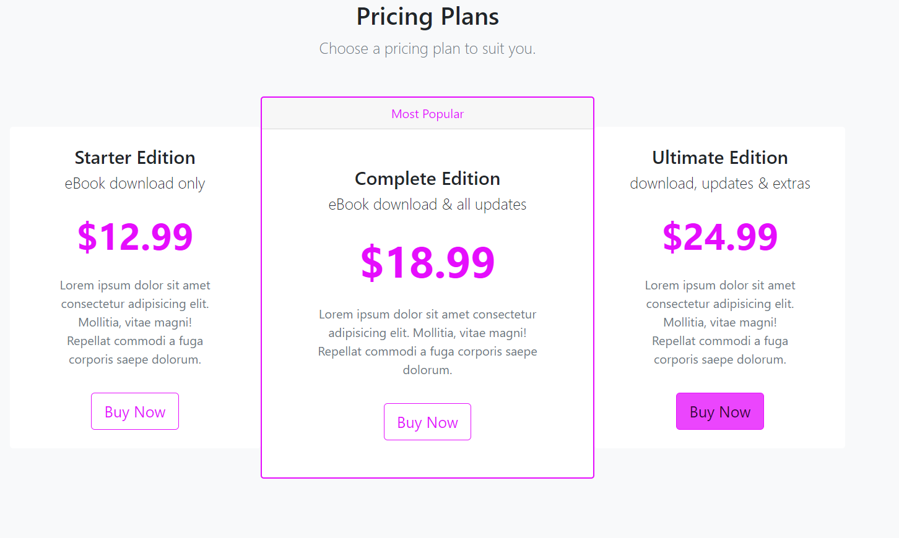


