#### Use of CSS3
- styling html tags 
- responsive website 
- 2D and 3D tranformation of HTML elements 
- animation on webpage 
- speeds up the development process

### 3 ways to implement CSS 
1. inline css - on the same line add style 
```bash 
<h1 style='color:green'> hi </h1>
```
> difficult to maintain 

2. inpage style tag - on the same page add style in header 
```bash 
<html>
<head>
  <style>
    h1 {
        color: green 
    }
    # disadvantage: we need to change styling for every file, because its styling is in on the same page 
  </style>
</head>
<body>
 <h1>hello</h1>
</body>
</html>
```
3. external style sheet using link tag 
```bash 
<head>
  <link rel='stylesheet' type='text/css' href='style.css'>
  # href means hypertext reference - used to create link to another page 
</head>
```
> Tip 💡
This is a website for retreiving color hex codes to add to your website 
!(websafecolors.info)[https://websafecolors.info/]

### Basic selectors in CSS3 
> 3 basic types of selectors 
- by tag name 
```bash 
h1 {
    color: red;
}
```
- by class name 
```bash 
.header {
    background-color: green;
}
<body>
  <div class='header'></div>
</body>
```
> class selector name specification
```bash 
# you can combine two classes like this 
.list-menu {
    # you can even add _ in between 2 classes 
    # you can even use camel casing 
}
```
- by ID 
ID selector can use only one time in one page 
```bash 
#menu{

}
```
> Descendent selector 
```bash 
# implement styling only in a of header id 
#header a {

}

# implement styling of every li which is inside ul which has id of menu 
ul#menu li {

}
```
### CSS border properties 
- Border-Width 
- Border-Style
- Border-Color 

> CSS Border styles 
- solid
- dotted 
- dashed
- double
- groove
- ridge
- inset
- outset
- none
- mix (top right bottom left - clockwise)
```bash 
border-style: solid dotted dashed double; 
```

> CSS border side 
- Border-top
- Border-right
- Border-bottom
- border-left

> CSS border shorthand 
```bash 
border: 2px solid red;
```
### CSS outline properties 
> outline is outside the border 
- outline-width
- outline-style 
- outline-color 
- outline-offset - adds gap between border and outline 

> outline shorthand 


> an example 


#### CSS Padding
> shorthand for all similar values 
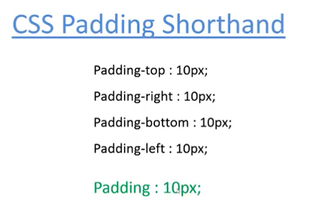

> shorthand for different values 

- top right bottom left - clockwise 
- top/bottom left/right

#### CSS margin 
- auto - used to center a div 
```bash 
margin-left: auto;
margin-right: auto;
margin-top: 0;
margin-bottom: 0;
# you need to add width for auto to work 
width: 500px;
```
#### min-height and max-height
> when we set the border for say a peice of text and then we set a fixed height in pixels for it, but the text content is huge and it overflows from the container. To fix this problem, we set min-height, to set a base height , and we set a max-height, if the content increases the border dyanamically increases to fit the content. 

#### min-width and max-width 


> the image will be full width of the container, however as we minimize it, the min-width it will take is 300px, as we go below it the scrollbar will show up and the max-width of the container will be 800px.

### Box sizing 
> The problem 
When we create a div of width:200px; its actually not exactly 200px, its adding the additional padding and border width to the div as well, so the resultant width of the div would then be 240px

- this happens by default, this is similar to box-sizing: content-box.

> After using box sizing property `border-box` The width of the div remains 200px only. 


### CSS Overflow
When we set a fixed height and the content we set overflows.


> The problem:


> We added these overflow properties to this code:
- hidden - hide the overflow 
- scroll - add a scrollbar irrespective of whether data is overflow or not 


> however, even if the content is not overfowing it will still show the scroll bar 
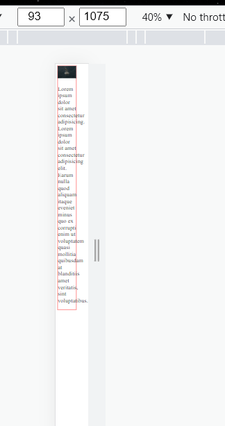

- auto - when data is overflow, then automatically scrollbar will be set, otherwise no scrollbar will be set 


> if content is overflowing, then add the scrollbar 


- visible (when data is overflow, make no changes and show it just as it is)

- overflow-y 
1. hidden - vertically data is hidden 

2. scroll - vertical scrollbar will be shown 

3. auto
- when data is not overflowing, doesnt show scrollbar vertically 
- when data is overflowing, shows scrollbar vertically 
4. visible 
- shows overflow as it is 

- overflow-x (horizontal overflow)
1. auto 

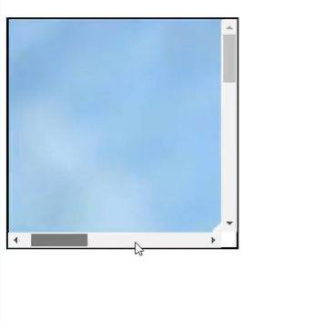
- when data is not overflowing, doesnt show scrollbar horizontally
- when data is overflowing, shows scrollbar horizontally 
2. scroll - scrollbar-x will be shown if the width exeeds the actual width

3. hidden - horizontally data is hidden 
4. visible - shows overflow as it is 

### Border-radius 

> Setting individual values for all 4 sides:
```bash 
# top-left  top-right   bottom-right   bottom-left
```
> Setting individual values for diagonal sides:
```bash 
# top-left/ bottom-right   top-right/ bottom-left
```

- All latest browsers support border-radius 

> Prefix for older versions of chrome and safari
- -webkit-border-radius: 10px 50px

> prefix for firefox older versions:
- -moz-border-radius: 10px 50px


### Box-shadow 
- horizontal-offset - shadow from lhs and rhs 
- vertical-offset - shadow from top and bottom 
- blurr - how much blurr you want to give the shadow 
- spread - how far are you spreading the shadow 


> Note that: blurr, spread and color are optional properties.

> You can even add multiple box shadows seperated by commas


> you can even add sahdow on the inside of the container using `inset`


> older versions of chrome, firefox and safari can use this property with prefix
```bash 
# prefix for firefox old versions 
-moz-box-shadow:
# prefix for chrome and safari old versions 
-webkit-box-shadow:
```
### CSS float 


> you can even do `float:left` for both the divs


### CSS clear 
- left 
- right
- both 

> for example, we have to design a template as such


> there can be times, when a div has overflowing data, when we dont specify div


#### The problem:


> Note that: the gold div is been overwritten 


#### The solution 


### CSS font properties 
- font-size
- font-family
- font-weight - bold, lighter, bolder, (100-900), normal 
- font-style - italic, oblique (for certain font-families that dont slant on italics)
- font-variant - small-caps
- line-height - gap between para lines 


> font size predefined values:
- xx-small
- x-small
- small
- smaller
- medium
- large
- x-large
- xx-large

> em and % is relative to the parent. 

> Instead of defining, seperate font properties, you can embed it in one font property 
```bash 
# font-style font-variant font-width font-size line-height font-family
font: oblique small-caps normal 1em arial, helvetica;
```
### CSS Text Properties 
- text-align - left, right, center, justify
- text-align-last - text-align for the last line (auto, start, last) 
```bash 
use this property with text-align, something like thus 
text-align:left;
text-align-last:start;
# start is used with text-align:left
# last is used with text-align:right
```
- text-transform - uppercase, lowercase, capitalize (every word first etter capitalize), none(no changes in text)
- text-indent - adds space at the beginning like in books 
- word-spacing - add space btw each word
- letter-spacing - add space btw each letter

### CSS Text decoration 
- text-decoration-line
- text-decoration-style
- text-decoration-color 

1. text-decoration-line 
- underline 
- overline 
- line-through (same as strike through)
- none 

2. text-decoration-style
- solid
- dashed
- dotted
- double
- wavy

#### Text decoration shorthand 


> Here is an example how its used.


### Word-wrap and Word-break 
#### Word-wrap 
> The problem:
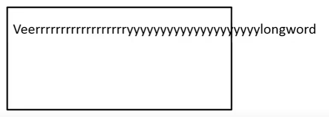

> the solution:


```bash 
When the content is overflowing, we can fix it with word-wrap:break-word, however it only wraps the word to the next line, it doesnt necessarily break the word, it breaks the word only when the word is too long
```


> Word-break is used to break smaller words such that they fit the internal space of the container

#### Word-break


- break-all - if you want to break every word
> after using `word-break:break-all`

- keep-all - if you want to keep it as it is 


### Text Shadow 
- horizontal shadow 
- vertical shadow 
- blur-radius 


```bash 
# h-shadow  v-shadow  blur-radius 
text-shadow: 2px 2px red;
```

> Setting values:
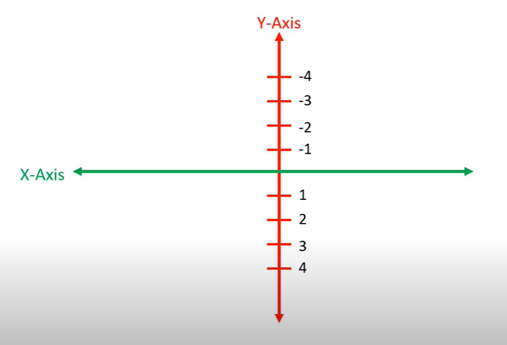
- if you want to set shadow vertically on the upper side then set a negative value 
- if you want to set a shadow vertically on the bottom side then set a positive value 
- if you want to set shadow horizontally on the right hand side then set a positive value 
- if you want to set a shadow horizontally on the light hand side then set a negative value 

### White-space
- normal (default value)

- nowrap

- pre

```bash 
- works just like pre tag in HTML, it preserves the original content and displays it as it is, for example if in the div tag you have additonal whitespaces, in the DOM, it will display it will the whitespaces.

and it works for unlimited spaces.
and no wrap works in this 
```

- pre-line - same as pre, but no-wrap doesnt work in this and only works for the first whitespace
- pre-wrap - adds whitespace but doesnt work  on no-wrap 
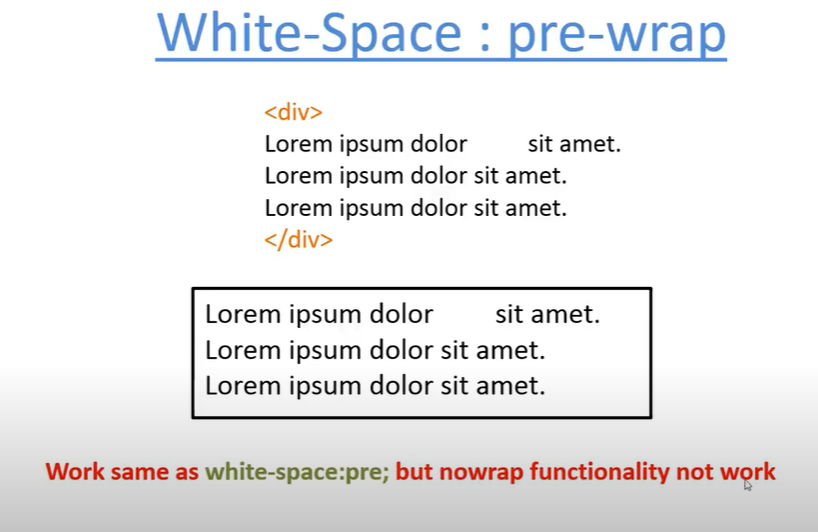

### Text-overflow 
- clip (default) 
- elipsis 
- string (supported in firefox only)

> The problem: were completely hidding the additional content providing no context regarding what actually happened to it. This is same as `text-overflow:clip`


> The solution: Text-overflow used with whitespace and overflow


### Writing-mode values 


- vertical-rl 

- vertical-lr

- sideways-rl

- sideways-lr

- horizontal-tb (default) - top to bottom

> switches the position of the word allignment 


### CSS Column count 


> Column count properties:


- `column-rule-style:solid` 

- `column-rule-color:red`
- `column-rule-width:2px`

- `column-gap:50px` (adds gap between columns)

- `column-width:250px`(assorts width to the column)
- `column-span:all`


> Shorthand:
```bash 
# common-rule-width  common-rule-style  common-rule-color
column-rule: 5px dotted red;
```


> Prefix:
```bash 
# prefix for firefox 
-moz-column-width: 250px;
# prefix for chrome and safari old versions 
-webkit-column-width: 250px;
```
### Why do we need Google fonts?
- Everytime a user makes a request to your website
- your website contains a bunch of html, css, images and fonts
- with increasing number of users making the request, the server load increases
- to fix this issue, google fonts which are managed on its own server was introduced
- server response time reduces and website becomes faster 

### CSS List style 
- list-style-position
1. inside - position of the list will be slightly towards the margin-left
2. outside - position of the list will be alightly away from the margin-left
- list-style-type 
1. ul `circle/ disc/ none`
2. ol `upper-alpha/ lower-alpha, upper-roman, lower-roman, decimal, none`
- list-style-image
> Pro tip 💡: download icons from  to add customisable li tags.
```bash 
liststyle-image: url(images/right-arrow.png)
```

> Shorthand: list-style
```bash 
ul {
# type position image 
list-style: none inside url(images/right-arrow.png)
}
```
### Background-Attachment 
- scroll (default) - bg-image will not be in a fixed position.
- fixed - bg-image will remain in the same fixed position no matter how much we scroll
```bash 
background-attachment: fixed;
background-image: url('');
background-repeat:no-repeat;
# single px value for both height and width 
background-size: 150px;
```
### Background-size 
- auto (default) - shows up the actual height and width 
- cover - force covers the entire parent div 
- contain - tries to cover the parent div, until to a point it doesnt loose resolution or stretch itself wierdly.

```bash
# for both height and width 
background-size: 150px 300px;
# we can set the width in percentage as well
```
> Prefix:
```bash 
# prefix for firefox 
-moz-background-size: cover;
# prefix for chrome and safari old versions 
-webkit-background-size: cover;
```
### Background-origin 
- padding-box - bg-image starts from where padding is starting

```bash 
background-attachment: fixed;
background-image: url('');
background-repeat:no-repeat;
background-size: 150px;
background-origin: padding-box;
```
- border-box - bg-image starts from where the border is starting

```bash 
background-attachment: fixed;
background-image: url('');
background-repeat:no-repeat;
background-size: 150px;
background-origin: border-box;
```
- content-box - the background image starts from the same origin the content is starting

```bash 
background-attachment: fixed;
background-image: url('');
background-repeat:no-repeat;
background-size: 150px;
background-origin: content-box;
```
### Background-clip 
- border-box (default)
```bash
# the bg-color white will be shown in the entire container 
background-color: white;
background-clip: border-box;
```


- padding-box - bg-color will be shown from where the padding starts 
```bash
padding: 30px;
background-color: white;
background-clip: padding-box;
```


- content-box - bg-color will be shown from where the content starts 


- text
```bash 
h1 {
    color: transparent;
    background-image: url('');
    font-size: 10px;
    font-family: impact;
    -webkit-background-clip: text;
    # the image is shown inside the text field 
  }
```
### CSS Color modes 
- color name - web safe color 
- hexadecimal code (#ff0000) - web safe color with hexa decimal code 
- rgb 
- rgba 
- hsl (hue saturation lightness) - hsl(255, 0, 0)
```bash
hue: 0-360
saturation: 0-100%
lightness: 0-100%;
```
- hsla
```bash 
# a indicates opacity 
hsla(120, 50%, 50%, 0.5)
```
### CSS Gradients 
- linear gradient 

```bash 
# default direction: top to bottom
background: linear-gradient(red, blue)
# goes left to right
background: linear-gradient(to right, red, blue)
# goes right to left 
background: linear-gradient(to left, red, blue)
# goes bottom to top
background: linear-gradient(to top, red, blue)
# we can even add degree over here and add as many colors as we want over here 
background: linear-gradient(-45deg, red, blue) 
```
- repeating linear gradient 
```bash 
background: repeating-linear-gradient(to right, red 10%, blue 10%) 
```
- radial gradient 

```bash 
# default is circle in the middle extruding outside 
background: radial-gradient(red 10%, yellow 15%)
```
- repeated radial gradient 
```bash 
# default is circle in the middle extruding outside 
background: repeating-radial-gradient(red 10%, yellow 15%)
```
### Background-blend-mode 
> when you have both background image and bg-color together
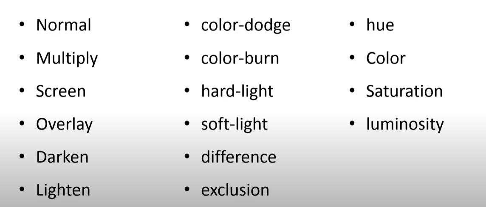

```bash 
background-image: linear-gradient(to right, red, yellow), url('images/img.jpg');
# bg-color blended with image 
background-blend-mode: screen;
```
### mix-blend-mode 
> its almost like background-blend-mode, except in this css property, you dont need both image and bg-color to blend, infact you can very much blend bg-color with a div or a peice of content on your webpage. 


### CSS Display


> Gives element the power of another tag. 
1. `display:inline` - It gives block elements the power of inline elements 
 make all the li tags on the same line, instead of one below the other.


2. `display:block` - It gives inline elements the power of block elements.


3. `display:inline-block`
> The problem: Span and <a></a> are inline tags, however we cannot add `display:block` and assign a width property to it at the same time.


> The solution: We can use width and give the tag the illusion of display:block property by using inline-block


### CSS Visibility 
- visible 


- hidden 
> same as `display:none`
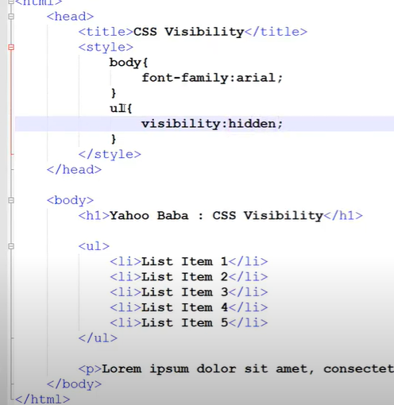


- collapse 

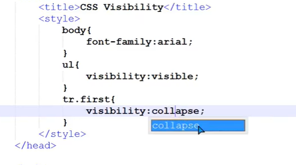
> Note that: in the table we have 2 rows and we have added `visibility:collapse` to only the first one, thats why we cant view it on the DOM.


### HTML BASIC LAYOUT 
- HEADER 
- NAVBAR
- MAIN CONTENT 
- SIDEBAR 
- FOOTER 

## layout proposed in html 5
all these tags are display: block;
```bash
          header 
-------------------------------
            nav 
-------------------------------
section      |
--------------      aside 
article      |
--------------------------------
           footer 
```

### CSS Position values 
1. static 
2. relative 


3. absolute


> with helper properties:


4. fixed - when you scroll the page, the fixed element will remain at the same position
5. sticky - it sticks when it reaches a specific value of the helper property 
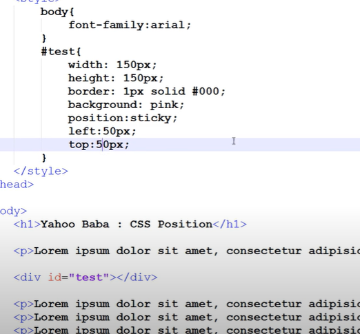
> the div sticks when it reaches top:50px and left:50px

> helper properties:
- left
- right
- top
- bottom

> sticky not supported in IE 

### Difference between absolute and relative properties.


> absolute

- the closer parent which has a position defined, the container which absolute property takes that as a parent reference and alligns itself accordingly. 

> Note that: box-2 is the closest eligible parent to box-4

### CSS Z-index 
- depends on position 


> if you want to bring a specific div on top of the other we'll give that div z-index:1.


### CSS Table properties


> were taking this example, to understand these properties:


1. border-spacing


```bash 
# we can even have a couple values in border-spacing
# column space row space 
border-spacing: 10px 20px;
```


2. border-collapse
- border-collapse:collapse 

- border-collapse:seperate 


3. vertical-allign 
- vertical-align:top
- vertical-align: middle 
- vertical-align:bottom


4. table-layout 
- table-layout:auto 
When you assign a fixed width along with this property, if the text we entered in the table increases,
then the table size will automatically increase to adjust 


- table-layout:fixed 
it only takes the fixed width (i.e 300px), the table size doesnt increase with the text size. 


### CSS resize 
> you can resize a div using this property. 
- horizontal 
- vertical
- both
- none (default) - no resize 

> works with helper property: overflow:auto
- resize:vertical - we can resizee this vertically 

- resize:horizontal- we can resize this horizontally 


- resize:both - you can resize the div both vertically and horizontally

> textarea has resize property by default 

### CSS Cursor 


> to add cursor styling to your cursor, use cursor, these are its properties: The ones I like:
- cursor: text
- cursor: move
- cursor: crosshair 

### CSS var()
> create a shortcut 

```bash 
:root {
  --red-color:red;
  # we can use this property anywhere in the code 
}

h1 {
  background: var(--red-color);
}
```

### CSS Calc()


> Arithmetic operations we can perform inside the calc function:
- addition
- subtraction
- multiplication
- division 

> The problem:
We have a normal div with a width, which takes 100% viewport width 


> now we add padding to it, and because of that it adds up 20px both on lhs and rhs of the content and increases the resultant width 


> The solution: use calc property on width 


### CSS Filter 
> adding filter to images through these properties:


```bash 
img {
  # making the image blurr by 5px
  filter: blur(5px)
}
img1 {
  # 100 - default image 
  # above 100 - brightness  
  # 0 - more dark
  filter: brightness(200%)
}
img2 {
  # 100 - default 
  # 0 - more dark 
  filter: contrast(30%)
}
img3 {
  # horizontal-shadow v-shadow blurr color
  filter: drop-shadow(8px 8px 10px red)
}
img4 {
  # 100 - completely grey 
  # 0-100 - different variations of grey 
  filter: grayscale(100%)
}
img5 {
  # add any value 0-360
  filter: hue-rotate(200deg)
}
img6 {
  # 0 - completely transparent
  # 100 - proper resolution of image as it is 
  filter: opacity(100%)
}
img7 {
  # 0 - no saturation, img turns grey 
  filter: saturate(300%)
}
# adding multiple effects in one line 
img8 {
  filter: blur(2px) hue-rotate(100deg)
}
```
### Object-fit 
> we can make images responsive through this property 
- fill - if the image is smaller than the container it will stretch to fit the container, and if the image is bigger than the container it will skew to fit the container. 


- contain - the images show up just how they look, show the entire image by adjusting in the container 


- cover - the images dont stretch  and fit as much as they possibly can in the container


- scale-down - same like contain property 
- none - image is neither stretched nor skewed, showed as it is to fit the container


> Add `object-position` to align images to a specific position in the container 
```bash 
- object-position: bottom;
- object-position: top;
- object-position: left;
- object-position: right;
```
### CSS User-select
- auto - you can copy paste text from the website 
- none - cannot copy text from the website 
- all - with single click you can select all 

### CSS Box-decoration break 
used for text formatting
- slice 
- clone 

> This is same as `box-decoration-break: slice`


> When we use `box-decoration-break: clone`


### CSS Quotes

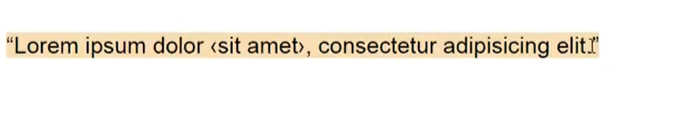

### CSS Border-Image 


> border-image-repeat
- repeat - img is repeated in border, in corner there is some flaw 

- stretch - center img is stretched 

- round - img is repeated except in corner there are no flaws 

- space

1. border-image-source

2. border-image-slice - slice the image 

3. border-image-outset - image goes outside the container 

4. border-image-width - set width of the border image 


> shorthand:
```bash
# border-image: source | slice | width | outset | repeat 
border-image: url(image) 21 / 15px / 5px round 
```


### CSS text-decoration thickness
> We had these properties before CSS3
- text-decoration-line
- text-decoration-color
- text-decoration-style 

> adds thickness


### CSS Text-Underline-Offset 
> adds gap between text and line 


### CSS CurrentColor 
> Color modes in CSS


- similarly CurrentColor is also a color mode.
Why do we need this property?


If we want to set the bg-color same as the color of the heading, and if we change the color of the heading, we want the change to be dyanamically change in the bg-color, to achieve this we use CurrentColor.


### @support / conditional rule 
> if a browser supports a particular property then apply a certain property, and if it doesnt apply another property 

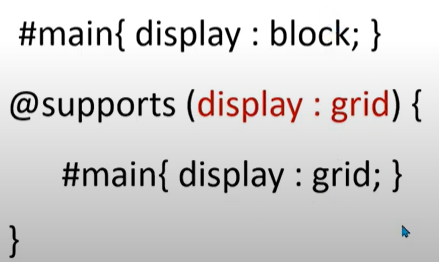
```bash 
If browser supports grid then display that in #main 
otherwise display:block in #main 
```
> support with multiple conditions:

```bash 
# OR 
If either of the condition is true, then add the particular styling to #main

# AND 
If both the conditions are satisfied (i.e both the properties are supported by the browser), then add styling to #main 
```


