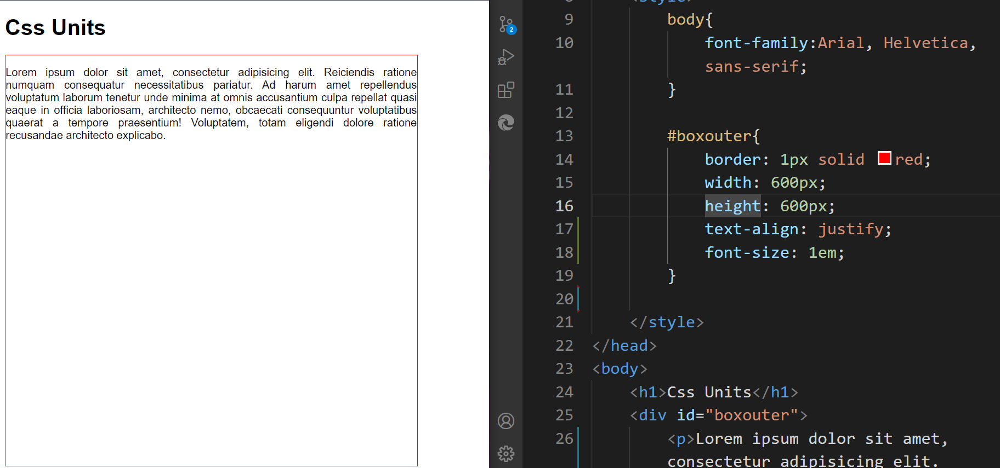
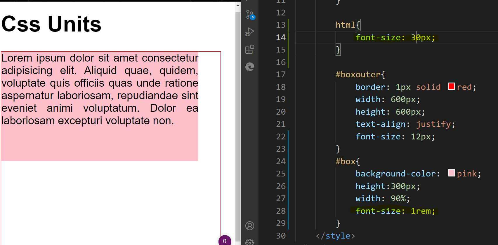
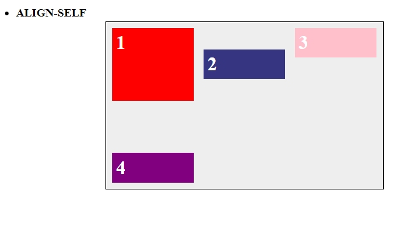

## What is DOM?
Document Object model 
it is a set of APIs allowing the manipulation of HTML from JavaScript

> set of API - **communicating JS with HTML objects** 

- its a global object used to manipulate the nodes on webpage 
- its a tree like structure with which we can manipuate the nodes

> JS - node we say, when we talk about JS point of view 
> HTML - element we say when we talk about HTML point of view 

#### Attribute VS element VS tag
<div id="something" class="" onclick="">
  <p>  </p>
</div>

#### Attribute
additional properties which are part of your html element
```bash 
   <tag attribute name ="attribute value"> </tag>
```
```bash 
<h1 bgcolor = "tan"></h1>
```
- not case sensitive
- always defined in start tag
- attributes once used cannot be repeated in same element

```bash 
Attribute names used in html5:
    1. auto complete
    2. auto focus (focus on a particular field)
    3. form
    4. form action (Where to send the form-data when the form is submitted.)
    5. form method (GET or POST)
    6. height
    7. width
    8. min
    9. max
    10. pattern (REGEX)
    11. placeholder
    12. required (this field is required)
    13. list
  <datalist id="browsers">
    <option value="Edge">
    <option value="Firefox">
    <option value="Chrome">
    <option value="Opera">
    <option value="Safari">
  </datalist>

Form tag attributes:
    -novalidate
    its used to specify the date the form will stop taking inputs, its used to tell server the form is not valid 

    -action
    where to send the form data 
    when its submitted.

    -autocomplete

    -method- way to submit form data 
     -get(data will be sent as url variable)   ✅not secure
     (its default)

     -post-data send as http post 
     transaction     ✅secure
    
    -enctype (encryption type)
    enctype-converts spaces to + 

     when your form is submitted 
     suppose in input field you entered "Reem shaikh"
     
    <input type="text" name="sname">
    then in the url of the submitted link it will show
    sname=Reem+shaikh

    -target 
    _blank: opens in new tab
    _self: open in same tab
```

#### Element 
<div id="something" class="" onclick="">  //div element
  <p>  </p>
</div>
everything inside opening and closing tag is element.
element contains stuff between the tags
element can have children 

#### Tag 
<div id="something" class="" onclick="">  //div opening tag
  <p>  </p>
</div>                                    //div closing tag
anything between <> (angular brackets)
tag are used to hold html element 
tag is singular 

### What is CSSOM?
- CSS object model 
Tree of document, which contains style properties 

it is a set of APIs allowing the manipulation of CSS from JavaScript

> set of API - **communicating JS with CSS styling** 

### Render Tree = CSSOM + DOM 
Rendering 
- displaying document on the viewport (where content is displayed)
- showing data and styling/ Displaying the render tree on the viewport 

### How is Render Tree Parsed?
whenever we load a page:
1. html document (DOM) is loaded
2. while parsing the engine will find css file which will create CSSOM 
3. js file is parsed and added to DOM 
4. finally they are combined in render tree, which is rendered/ displayed on the viewport 

- looks are more important than functionality thats why its added on top 

## Tags in Html:
<marquee></marquee> ❌deprecated tag

## Tags introduced in html5:
```bash
<input type="email">
<input type="date">

<!--starts date selection from this value "2015-08-09-->
<input type="date" data-date-format="DD MMMM YYYY" value="2015-08-09">

<input type="month">
<input type="week">
<input type="time">
<input type="color">
<input type="tel">

<output>100</output>
<progress value="60" max="100">  </progress>
<!--show how much file is downloaded (100-60 = 40)-->

<input type="range">
```

#### Why do we need output tag?
```bash
<body>
    <h2>add 2 nums</h2>
    <form oninput="op.value = parseInt(num1.value) + parseInt(num2.value);">
    <!--output with 1 single line of JS
    
    oninput - its an eventlistener and gets executed everytime an input is changed inside the input tags-->

        <input type="number" placeholder="num1" name="num1" value="0">
        <input type="number" placeholder="num2" name="num2" value="0">
        <output name="op"> </output>
        <!--
            why output and not paragraph tag?
            1. output tag can have a name property, to refer to it
            2. output tag can have value property

            paragraph tag, you have to refer by id 
            in p tag, you had to use .innerText,

        -->
    </form>
</body>

document:
1. every time we add a value to the input field, simultanously it does the operation and returns the value on the output tag field 
```
> Real time use case 
create a simple password validation (comparing if both passwords are same)
```bash
<body>
    <h2>password validation</h2>
    <form oninput="op.value = (num1.value == num2.value);">
    <!--if both passwords are same validate it-->
        <input type="password" placeholder="num1" name="num1" >
        <input type="password" placeholder="num2" name="num2">
        <output name="op"> </output>

    </form>
</body>

document:
1. when we enter same password for both input value it returns true 
2. when we enter different password for both input value it returns false
```

## layout proposed in html 5
all these tags are display: block;
```bash
          header 
-------------------------------
            nav 
-------------------------------
section      |
--------------      aside 
article      |
--------------------------------
           footer 
```
### Why do we write css links on top?
we want to optimise page and make it look good thats why css link is in top 
and script link is at the bottom
> Improvement in UI, the style is already available when HTML is loaded 
> Trade off performance, we are not loading unnecessary functionality before.

### SEO 
process of improving the quality and quantity of website traffic 

> off-page SEO 
- niche of the website 
- outside links pointing to your website 
- high quality content 

> on-page SEO 
- developers can be implemented to improve rankings in search engine 

#### meta tags 
gives additional info about our webpage 
```bash 
<!DOCTYPE html>
<html lang="en">
<head>
    ✅-meta charset
    <meta charset="UTF-8">

    ✅meta edge 
      tells browser to be compatible with internet explorer: edge 
    <meta http-equiv="X-UA-Compatible" content="IE=edge">

    ✅meta viewport: used for responsiveness in mobile devices.
    gives browser instructions to fit the webpage to the screen size 
    <meta name="viewport" content="width=device-width, initial-scale=1.0">

    ✅title tag
    <title>Document</title>

    ✅description tag
    <meta name="description" content="the purpose of this page is to give insights on ..." />

    ✅meta keywords
    <meta name="keyword" content="html, css, javascript, web development" />

    ✅meta author
    <meta name="author" content="reem shaikh"/>

    ✅favicon
    downloaded from iconarchive
    <link rel="shortcut icon" type="image/ico" href="favicon.ico" />
</head>
<body>
    ✅optimize image with alt tag:

        upload the image to compressor 
        (compress image, quality remains same)
        website: https://compressjpeg.com/

        create an alt text which tells what your image is about
    

    ✅anchor tag: helps in biulding links
      when you hover over link, google title shows up 
    <a href="" title="google" >google</a>
</body>
</html>
```
1. title tag 
it will be displayed as the title on the chrome page and on the top bar besides favicon


2. description tag 
it displays information below the title tag in the chrome page 


3. URL 


4. other meta tags 


- meta keywords
series of keywords (sepeated by commas) that are important for crawlers to rank your website
- meta viewport 
to tell a mobile browser to use the viewport width of the mobile, instead of the default 980px (as seen on desktops) as the width of the screen, developers can include a viewport meta tag, like the following:
- meta charset 
the charset attribute specifies character encoding for HTML document.
```bash
Different charsets include ASCII, ANSI, ISO-8859-1, UTF-
The charset attribute in HTML is used with the <meta> to specify the character encoding.
```
- meta author 
specifies the author of page 

5. Favicon 


6. images 


> alt tags play a role in SEO by helping search engines assocciate images 
with webpage content so they can properly index it 
> when we hover over the image, the alt text shows up 

7. anchor tag 
used to link webpage to other webpages 

8. mobile responsive website 
by using media queires

9. minify and compress 


minification: removes spaces from website 

10. keyword 
use it in title, meta description and headings

#### Different sites have different tags:
1. fb has its own set of meta tags, which you can integrate in your website
https://developers.facebook.com/docs/sharing/webmasters/

2. Twitter has its own set of meta tags, which you can integrate in your website
https://developer.twitter.com/en/docs/twitter-for-websites/cards/overview/summary

3. Google has its own set of meta tags, which you can integrate in your website
https://support.google.com/programmable-search/answer/2595557?hl=en#:~:text=The%20meta%20tag%20contains%20information,enable%20sorting%20of%20search%20results.

### CSS3 is the latest version of CSS 
features added in CSS3:
1. animation
2. responsive design 
3. supports RGBA and gradient colors

### Tag VS Attribute VS element
1. Tags 
#### a. empty tag 
 tags that do not contain any closing tags
> <br>, <hr> , <input>, <link>, <meta>, <source>

#### b. container tag 
 tags which have opening and closing tag 
> <p></p>, <a></a>, <button></button>

```bash
<div id="something" class="" onclick="">  ✅div opening tag
  <p>  </p>
</div>                                    ✅div closing tag
```
- anything between <> (angular brackets)
- tag are used to hold html element 
- tag is singular 

2. Attribute 
additional info for tags 
> Attribute name = "attribute value"

3. element 
(start tag + text + end tag)
```bash
<div id="something" class="" onclick="">  ✅div element
  <p>  </p>
</div>
```
- everything inside opening and closing tag is element.
- element contains stuff between the tags
- element can have children 

## CSS selectors 
A CSS selector selects the HTML element(s) you want to style.

> We can divide CSS selectors into five categories:
1. Simple selectors 
select elements based on name, id, class
```bash
        -universal          *           selects all elements on the page 
        -type               div         selects all elements with specific type
        -class              .classname  selects all elements with same classname
        -id                 #idname     selects the element with the unique identifier 
```
2. Combinator/ grouping selectors/ Combinators 
select elements based on a specific relationship between them
### 2. Combination selectors
```bash
        -or                 div,a        selects both elements 
        -and                div.class    selects specific element 
        -descendant         div a        selects all under div 
        -direct child       div>a        selects only the direct child 
        -general sibling    li.red~li    selects all under li, after li.red
        -adjacent sibling   li.red + li  selects only one sibling after li.red
```

3. Pseudo-class selectors 
select elements based on a certain state
```bash
pseudo classes
    used to style element based on how user interacts on the page
         1. state    
            -visited        link that is visited
            -hover          when an element is hovered 
            -focus          when you click on an element it adds property
            -required       adds styling on required property 
            -checked        adds styling on checkbox 
            -disabled       adds styling on checkbox with disabled property
        2. position
            -first-child       styles firstchild of the parent only 
            -last-child        styles lastchild of the parent only 
            -nth-child(2n)     styles child from 2nd position 
            -nth-last-child(3) styles only 3rd child 
            -only-child        styles container which has only one child 
            -first-of-type     styles firstchild of a parent which has same type throughout 
            -last-of-type      styles lastchild of a parent which has same type throughout 
            -nth-of-type(2n)   styles children at 2n interval 
            -nth-last-of-type(2)styles the 2nd last
            -only-of-type       styles container which has only one child, but parent and children are of the same type 
            -not                styles all elements except the one with the not 
```
4. Pseudo-elements selectors 
select and style a part of an element
```bash 
             first-letter      styles first letter of the page 
             first-line        styles first line of the page 
             ::before          insert content before the element 
             ::after           insert content after the element 
             ::marker          selects the marker of elements 
```
5. Attribute selectors 
select elements based on an attribute or attribute value
```bash
           CSS [attribute] Selector           selects elements with specific attribute 
           CSS [attribute|="value"] Selector  select elements with specific attribute and value 
           CSS [attribute^="value"] Selector  styles elements starting with same value 
           CSS [attribute$="value"] Selector  styles elements ending with same value
           CSS [attribute*="value"] Selector  styles elements containing same value
```

### 1. Simple selectors 
```bash
        -universal          *           selects all elements on the page 
        -type               div         selects all elements with specific type
        -class              .classname  selects all elements with same classname
        -id                 #idname     selects the element with the unique identifier 
```
```bash 
✅1. universal selector 
    selects every single elemnt on the page 
        
        *{
            background-color: red;
        }
✅2. type selector 
    select element based on the type of the selector 

        span{
            color: green;
        }

        div{
            color: green;
        }

✅3. class selector 
    for selecting multiple class selectors of the same classname

        .blue{
            background-color: blue;
        }

✅4. id selector 
    for selecting a specific id selector 

        #white{
            background-color: white;
        }

    </style>
</head>
<body>
    <div class="blue">this is a div</div>
    <span id="white">this is a span</span>

    <ul>
        <li class="blue">item 1</li>
        <li>item 2</li>
        <li>item 3</li>
        <li>item 4</li>
    </ul>
    
</body>
</html>
```


### 2. Combination selectors
```bash
        -or                 div,a        selects both elements 
        -and                div.class    selects specific element 
        -descendant         div a        selects all under div 
        -direct child       div>a        selects only the direct child 
        -general sibling    li.red~li    selects all under li, after li.red
        -adjacent sibling   li.red + li  selects only one sibling after li.red
```
1. and and or selector 
```bash 
    <style>
✅1. and selector 
    selects the specified selector 
      div.class {
        color: red;
        font-size: 20px;
    }

✅2. or selector 
    select all spans and selects all li 
      
    selects both the selectors 
      span, li {
        background-color: blue;
    }

    </style>
  </head>
  <body>
    <div class="class">this is div tag</div>
    <div>Lorem, ipsum dolor.</div>
    <span class="class">this is span tag</span>

    <ul>
      <li class="red">
        item 1
      </li>

      <li>
        item 2
      </li>

      <li>
        item 3
      </li>

      <li>
        item 4
      </li>
    </ul>

    <div>
      <span>
        <b>nested text</b>
      </span>
    </div>
  </body>

```


2. Descendant selector 
```bash
   <style>

✅Descendant selector:
   it adds styling to every tag inside that selector 

    as long as li is inside ul, its going to add styling to it

      ul li {
        background-color: springgreen;
      }

    as long as b is inside div its going to add styling to it
      
    <div>
      <span>
        <b>nested text</b>
      </span>
    </div>
    
      div b {
        background-color: red;
      }

    </style>
  </head>
  <body>
    <div class="class">this is div tag</div>
    <div>Lorem, ipsum dolor.</div>
    <span class="class">this is span tag</span>
    <div>
        <span>
          <b>nested text</b>  ✅div b 
        </span>
      </div>
    <ul>
      <li class="red">        ✅ul li
        item 1
      </li>

      <li>                    ✅ul li
        item 2
      </li>

      <li>                    ✅ul li
        item 3
      </li>

      <li>                     ✅ul li
        item 4
      </li> 
    </ul>
  </body>
```
[](css/cssimage3.PNG)

3. Direct child 
```bash
    <style>
✅Direct child
     selects elements with the direct parent   

    div > b {
        background-color: yellow;
      }
    ✅b is not direct child of div thats why its not accepting 
    <div>
      <span>
        <b>nested text</b>
      </span>
    </div>   

    ✅b is direct child of span
    span > b {
        background-color: red;
      }

    </style>
  </head>
  <body>
    <div class="class">this is div tag</div>
    <div>Lorem, ipsum dolor.</div>
    <span class="class">this is span tag</span>
    <div>
      <span>
        <b>nested text</b>  ✅>
      </span>
    </div>
    <ul>
      <li class="red">
        item 1
      </li>

      <li>
        item 2
      </li>

      <li>
        item 3
      </li>

      <li>
        item 4
      </li>
    </ul>
  </body>
```
[](css/cssimage4.PNG)

4. Sibling selectors 
```bash
<style>
✅sibling selectors
    it selects element which are siblings but are after the defined selector 


    ✅generalised sibling selector
      matches all selectors, which are sibling of the same parent but are directly after li.blue 
    
    li.blue ~ li {
        background-color: turquoise; 
      }

    ✅adjacent sibling selector 
        only checks element directy after 

    li.red + li {
       color: red;
      }

    </style>
  </head>
  <body>
    <div class="class">this is div tag</div>
    <div>Lorem, ipsum dolor.</div>
    <span class="class">this is span tag</span>
    <div>
      <span>
        <b>nested text</b>
      </span>
    </div>
    <ul>
      <li class="red">
        item 1
      </li>

      <li class="blue">  ✅+
        item 2
      </li>

      <li>               ✅~
        item 3
      </li>

      <li>               ✅~
        item 4
      </li>
    </ul>
  </body>
```


### 3. Psuedo class selector 
```bash
pseudo classes
    used to style element based on how user interacts on the page
         1. state    
            -visited        link that is visited
            -hover          when an element is hovered 
            -focus          when you click on an element it adds property
            -required       adds styling on required property 
            -checked        adds styling on checkbox 
            -disabled       adds styling on checkbox with disabled property
        2. position
            -first-child       styles firstchild of the parent only 
            -last-child        styles lastchild of the parent only 
            -nth-child(2n)     styles child from 2nd position 
            -nth-last-child(3) styles only 3rd child 
            -only-child        styles container which has only one child 
            -first-of-type     styles firstchild of a parent which has same type throughout 
            -last-of-type      styles lastchild of a parent which has same type throughout 
            -nth-of-type(2n)   styles children at 2n interval 
            -nth-last-of-type(2)styles the 2nd last
            -only-of-type       styles container which has only one child, but parent and children are of the same type 
            -not                styles all elements except the one with the not 
```
1. state 
```bash
    <style>

    ✅1. hover 
      h3:hover {
        color: blue;
        font-size: 20px;
      }
    ✅2. state 
        -link (general link)
        -visited

      a:link {
        color: yellow;
      }

      a:visited {
        color: green;
      }

    ✅3. focus 
    when we click on the input box it has bg color red 
      input:focus {
        background-color: red;
      }

    ✅4. required 
    only selects input, with required attribute 
      input:required {
        background-color: pink;
      }

    ✅5. checked 
        when we hover over the first checkbox its margin changes 
      input:checked {
        margin: 50px;
      }

    ✅6. disabled 
        you cannot check this disabled checkbox 
      input:disabled {
        margin: 70px;
      }
    </style>
  </head>
  <body>
    <span>Lorem ipsum dolor sit.</span>

    <label>focus selector</label>     ✅focus  
    <input type="text" placeholder="focus selector" />

    <br />
    <br />

    <label>required selector</label>   ✅focus ✅required 
    <input required type="text" placeholder="required selector" />

    <br />
    <input type="checkbox" />          ✅checked 
    <br />

    <input disabled type="checkbox" /> ✅disabled 
    <br />

    <div class="red">this is a div</div>

    <span id="blue">this is a span</span>

    <h3>hover over me</h3>              ✅hover 
    <a href="https://www.google.com" target="_blank">Lorem ipsum dolor sit.</a>
    <p>
      Lorem, ipsum dolor sit amet consectetur adipisicing elit. Fugit,
      molestiae?
    </p>
    <h5>Lorem ipsum dolor sit amet, consectetur adipisicing elit. Fugiat.</h5>
  </body>
```
[](css/cssimage6.PNG)

2. position 
```bash 
<style>

✅1. first-child 
    selects first child inside the parent ul
      li:first-child {
        background-color: turquoise;
      }
✅2. last-child
    selects last child inside the parent ul 
      li:last-child {
        background-color: green;
      }
✅3. nth-child(n)
    selects 3rd child in the li 
      li:nth-child(3) {
        background-color: violet;
      }
✅4. nth-child(2n)
    to select every other selector that 
    
    > starts with 2nd element
      li:nth-child(2n) {
        color: tomato;
      }
    
    > to start with 1st element 
      li:nth-child(2n-1) {
        font-size: 20px;
      }

    </style>
  </head>
  <body>
    <div class="red">this is a div</div>

    <span id="blue">this is a span</span>

    <div>
      <span>
        <b>nested text</b>
      </span>
      <span>Lorem, ipsum dolor.</span>
    </div>

    <ul>
      <li>item 1</li>                    ✅li:first-child  ✅li:nth-child(2n-1)
      <li class="red">item 2</li>        ✅li:nth-child(2n)
      <li>item 3</li>                    ✅li:nth-child(3) ✅li:nth-child(2n-1)
      <li class="green">item 4</li>      ✅li:nth-child(2n)
      <li>item 1</li>                                       ✅li:nth-child(2n-1)
      <li>item 2</li>                    ✅li:nth-child(2n)
      <li>item 3</li>                                       ✅li:nth-child(2n-1)
      <li>item 4</li>                    ✅li:last-child    
                                         ✅li:nth-child(2n)
    </ul>
  </body>
```
[](css/cssimage7.PNG)

```bash 
<style>
✅li:nth-last-child(2n-1)
    starts from last end and goes upwords
    li:nth-last-child(2n-1) {
        font-weight: bold;
        background-color: pink;
    }

    starts from second last end and goes upwords
    li:nth-last-child(2n) {
        background-color: aqua;
    }

✅not 
    li:not(.green) {
        font-size: 30px;
      }
</style>
  </head>

  <body>
    <ul>
      <li>item 1</li>               ✅li-nth-last-child(2n)
      <li class="red">item 2</li>   ✅li-nth-last-child(2n-1)
      <li>item 3</li>               ✅li-nth-last-child(2n)
      <li class="green">item 4</li> ✅li-nth-last-child(2n-1)
      <li>item 1</li>               ✅li-nth-last-child(2n)
      <li>item 2</li>               ✅li-nth-last-child(2n-1)
      <li>item 3</li>               ✅li-nth-last-child(2n)
      <li>item 4</li>               ✅li-nth-last-child(2n-1)
    </ul>

</body>
```


#### Difference between nth-child and nth-of-type
```bash 
    <style>
✅difference between nth-child and nth-of-type?
 if you want to select an interval of a selector regardless
 of the type of element it is, use nth-child. 

 However, if you want to select a specific type only and apply an interval 
 selection from there, use nth-of-type
 
✅nth-child (note that: both of these psuedo class selectors give a diff output
    p:nth-child(2n)
    {
      background-color: orange;
    }

    p:nth-of-type(2n)
    {
        background-color: orchid;
    }

✅nth-of-type
    li:nth-of-type(2n)
    {
        background-color: gray;
    }

✅first-of-type 
    first li from ul styled 
    li:first-of-type {
        background-color: blue;
      }

✅last-of-type 
    li:last-of-type {
        background-color: rebeccapurple;
        border: 1px solid red;
      }

✅last-of-type(n)
    li:nth-last-of-type(3n) {
        background-color: green;
        border: 1px solid blue;
      }

    </style>
  </head>
  <body>
    <span>Lorem ipsum dolor sit.</span>
    ✅Note that:
    nth-child is selecting the 2nd child in div.red
    nth-of-type is selecting the 2nd p selector 

    <div class="red">
        <h5>hello</h5>
        <p>Lorem ipsum dolor sit, amet consectetur adipisicing elit.</p> ✅p:nth-child(2n)
        <p>Lorem, ipsum dolor.</p>                                       ✅p:nth-of-type(2n)
    </div>

    <span id="blue">this is a span</span>

    <div>
      <span>Lorem, ipsum dolor.</span> 
      <p>nested text</p>                    ✅p:nth-child(2n)
      <p>nested text</p>                    ✅p:nth-of-type(2n)
    </div>

    <ul>
      <li>item 1</li>                    ✅li:first-of-type
      <li class="red">item 2</li>        ✅li:nth-of-type(2n)
      <li>item 3</li>                    ✅li:nth-last-of-type(3n)
      <li class="green">item 4</li>      ✅li:nth-of-type(2n)
      <li>item 1</li>
      <li>item 2</li>                    ✅li:nth-last-of-type(3n)
      <li>item 3</li>
      <li>item 4</li>                    ✅li:last-of-type
    </ul>

  </body>
```


#### Difference between only-of-type and only-child 
```bash 
    <style>
✅only-of-type 
use only-of-type when you want to select elements which have only a single child,
but also the child has the same tag as that of the parent 

  <div>
        <div>I am an only child.</div>
  </div>

div:only-of-type{
  color: red;
}

✅only-child 
use only-child when you want to select elements which have only a single 
child, but also the child has a different tag than that of the parent
  <div>
      <p>I am an only child.</p>
  </div>


p:only-child{
  color: blue;
}

div {
  display: inline-block;
  margin: 6px;
  outline: 1px solid;
}
    </style>
  </head>
  <body>

    <div>
        <div>I am an only child.</div>
        <div>hello</div>
    </div>

    <div>
        <div>I am an only child.</div>             ✅div:only-of-type
    </div>

    <div>
      <p>i am only child</p>                       ✅div:only-child 
    </div>
      
      <div>
        <div>I am the 1st sibling.</div>
        <div>I am the 2nd sibling.</div>
        <div>I am the 3rd sibling, 
            <div>but this is an only child.</div>  ✅div:only-of-type
        </div>
      </div>

  </body>
```


### 4. Psuedo elements 
select and style a part of an element
```bash 
             first-letter      styles first letter of the page 
             first-line        styles first line of the page 
             ::before          insert content before the element 
             ::after           insert content after the element 
             ::marker          selects the marker of elements 
```
```bash 
<style>
✅::before 
      div.red::before {
        content: 'Before';
        background-color: red;
      }

✅::after 
      div.red::after {
        content: 'After';
        background-color: blue;
      }
✅first-letter
      p::first-letter{
        color:red;
        font-size:30px;
      }

✅first-line
      p::first-line{
        background-color: bisque;
      }

✅marker 
      ::marker{
        color: green;
      }

    </style>
  </head>
  <body>
    <p>Lorem ipsum dolor sit.</p>
    <p>Lorem ipsum dolor sit amet.</p>
    <div class="red">
      this is div
    </div>

    <ul>
      <li>item 1</li>
      <li>item 2</li>
    </ul>
  </body>
```


### 5. Attribute selector 
The [attribute] selector is used to select elements with a specified attribute.
```bash
           CSS [attribute] Selector           selects elements with specific attribute 
           CSS [attribute|="value"] Selector  select elements with specific attribute and value 
           CSS [attribute^="value"] Selector  styles elements starting with same value 
           CSS [attribute$="value"] Selector  styles elements ending with same value
           CSS [attribute*="value"] Selector  styles elements containing same value
```
```bash
    <style>
✅CSS [attribute] Selector
      [data-red]{
        background-color: red;
      }

✅CSS [attribute|="value"] Selector
      [data-blue="true"]{
        background-color: blue;
      }

      ✅even if you dont enter the value, it works 
      [data-green]{
        background-color: green;
      }

✅CSS [attribute^="value"] Selector
  select everything starting with 12 with the same attribute name
      [data-yellow^="12"]{
        background-color: yellow;
      }

✅CSS [attribute$="value"] Selector
  select everything ending with 98 with the same attribute name
      [data-purple$="98"]{
        background-color: purple;
      }

✅CSS [attribute*="value"] Selector
  select everything containing 23 with the same attribute name
       [data-orange*="23"]{
        background-color: orange;
      }
    </style>
  </head>
  <body>
    <div data-red >this is a div</div>
    <div data-blue="true" >this is a div</div>
    <div data-green="true" >this is a div</div>

    <div data-yellow="123" >this is a div</div>
    <div data-yellow="1243" >this is a div</div>

    <div data-purple="12398" >this is a div</div>
    <div data-purple="12498" >this is a div</div>

    <div data-orange="12398" >this is a div</div>
    <div data-orange="123298" >this is a div</div>
  </body>
```


#### Types of CSS styles
1. internal CSS (css and html are in same file)
2. external CSS (css and html are in different file)
3. inline CSS (css in the same line as the html defined)

#### CSS Specificity and priorty
1. when id and class is competing for priorty, then id is given priorty 
```bash 
    <style>
        #logo{
            background-color: aqua;
        }

        .big-text{
            background-color: blue;
        }
    </style>
</head>
<body>
    <p id="logo" class="big-text">sample text</p>
</body>

document:
bg-color is aqua, ID has a higher priorty than class, even though class is defined 
1. in the end of the stylesheet 
2. after id 
```
2. when 2 classes or 2 id's are competing for priorty, then the later is higher 
```bash 
    <style>
        .logo{
            background-color: aqua;
        }

        .big-text{
            background-color: blue;
        }
    </style>
</head>
<body>
    ✅2 classes in the same line must be defined like this 
    <p class="logo big-text">sample text</p> 
</body>

document:
bg-color: dark blue 
```
3. When class and inline css is competing for priorty, then inline css wins 
```bash
    <style>
        .logo{
            background-color: aqua;
        }


    </style>
</head>
<body> 
    <p class="logo" style="background-color:green;">sample text</p>
</body>

document:
bg-color: green 
```
4. !important keyword is given more priorty than inline styling
!important rule, will override ALL previous styling rules for that specific property on that element!
```bash 
    <style>
        .logo{
            background-color: aqua !important;
        }
    </style>
</head>
<body> 
    <p class="logo" style="background-color:green;">sample text</p>
</body>

document:
bg-color: aqua 
```
5. If the same element is given same attribute name and different attribute value to an internal css and external css, then internal css wins 
```bash 
From external CSS file:
#content h1 {background-color: red;}

In HTML file:
<style>
#content h1 {
  background-color: yellow;
}
</style>

document:
bg-color: yellow
```

#### Cascading 
styles are competing for priorty and as a result overiding, and a result is generated 

> Order of specificity 
If there are two or more conflicting CSS rules that point to the same element, the browser follows some rules to determine which one is most specific and therefore wins out.

**!important > inline css > ID > class > tag**
```bash 
    <style>
      ✅id
        #para1{
            color: grey;
        }

      ✅class
        .red-style{
            color: red;
        }

        .blue-style{
            color:blue;
        }
        
      ✅tag / element selector
        p{
            color: yellow;
        }
    </style>
</head>
<body> 
    <p id="para1" class="red-style" style="color:green;">sample text</p>
</body>

document:
sample text color is green 
```
### CSS min-width & max-width 

> we need min and max width for mobile responsiveness
when we minimize container you will notice that it doesnt fit to the mobile viewing ratio 
```bash 
    <style>
        body{
            font-size: 24px;
        }

        .first{
            width: 600px;
            border: 1px solid red;
        }

        .first img{
            width: 100%;
        }

        .first  p{
            width:100%;
        }
    </style>
</head>
<body>
    <div class="first">
        
        <p>Lorem ipsum dolor sit amet consectetur adipisicing. Lorem ipsum dolor sit amet consectetur adipisicing elit. Earum nulla quod aliquam itaque eveniet minus quo ex corrupti enim ut voluptatem quasi mollitia quibusdam at blanditiis amet veritatis, sint voluptatibus. </p>
    </div>
</body>
```


> to fix this we can give a % value to width 
```bash 
    <style>
        body{
            font-size: 24px;
        }

        .first{
            width: 80%;
            border: 1px solid red;
        }

        .first img{
            width: 100%;
        }

        .first  p{
            width:100%;
        }
    </style>
</head>
<body>
    <div class="first">
        
        <p>Lorem ipsum dolor sit amet consectetur adipisicing. Lorem ipsum dolor sit amet consectetur adipisicing elit. Earum nulla quod aliquam itaque eveniet minus quo ex corrupti enim ut voluptatem quasi mollitia quibusdam at blanditiis amet veritatis, sint voluptatibus. </p>
    </div>
</body>
```


> however, when we set min-width:360px, the responsiveness is enforced 
```bash 
   <style>
        body{
            font-size: 24px;
        }

        .first{
            min-width: 360px;    
            ✅even when we minimize the screen to the smallest size the responsiveness is maintained 
            border: 1px solid red;
        }

        .first img{
            width: 100%;
        }

        .first  p{
            width:100%;
        }
    </style>
</head>
<body>
    <div class="first">
        
        <p>Lorem ipsum dolor sit amet consectetur adipisicing. Lorem ipsum dolor sit amet consectetur adipisicing elit. Earum nulla quod aliquam itaque eveniet minus quo ex corrupti enim ut voluptatem quasi mollitia quibusdam at blanditiis amet veritatis, sint voluptatibus. </p>
    </div>
</body>
```


> max-width sets the maximum width, and your container will not go beyond this width
```bash 
    <style>
        body{
            font-size: 24px;
        }

        .first{
            min-width: 360px;
            max-width: 700px; 
            border: 1px solid red;
        }

        .first img{
            width: 100%;
        }

        .first  p{
            width:100%; 
        }
    </style>
</head>
<body>
    <div class="first">
        
        <p>Lorem ipsum dolor sit amet consectetur adipisicing. Lorem ipsum dolor sit amet consectetur adipisicing elit. Earum nulla quod aliquam itaque eveniet minus quo ex corrupti enim ut voluptatem quasi mollitia quibusdam at blanditiis amet veritatis, sint voluptatibus. </p>
    </div>
</body>
```

> note that: in this code, no matter how much your extend the screen, the max width remains the one we set 

### CSS Font property 
font-size: used to manipulate font sizes on the web page 

> instead of using px, we can assign font-size like this
1. xx-small - 9px
2. x-small - 10px
3. small - 13.3px
4. smaller - 14px
5. medium - 16px
6. large - 18px
7. larger - 19px
8. x-large - 24px
9. xx-large - 32px

#### Css Absolute Units
> fixed values

1. cm 
2. mm 
3. in 
4. px 
5. pt (points)
6. pc (picas)

#### Css Relative Units 
> relative: depends on the parent width or window
width

1. em 
2. rem 
3. ch 
4. ex 
5. vw 
6. vh 
7. vmax
8. vmin 
9. %

## Difference between fixed and relative.
### Css Absolute units 
#### 1. px
```bash
    <style>
        body{
            font-family:Arial, Helvetica, sans-serif;
        }

        #box{
            border: 1px solid red; 
            width: 600px;   ✅here
            height: 300px;
            background-color: pink;
        }
    </style>
</head>
<body>
    <h1>Css Units</h1>
    <div id="box"></div>
    
</body>
```
### Fixed: Absolute Units
Div width is fixed, that's why we have scrollbar when the viewport width is decreased, the div width is not decreased, wrt the viewport 


### Css Relative Units 
#### 1. %

### Relative: the image adjusts with the viewport
when viewport size increases, div increases.
when viewport size decreases, div decreases.

```bash
    <style>
        body{
            font-family:Arial, Helvetica, sans-serif;
        }

        #box{
            border: 1px solid red; 
            width: 80%;  ✅here
            height: 300px;
            background-color: pink;
          
        }
    </style>
</head>
<body>
    <h1>Css Units</h1>
    <div id="box"></div>    
</body>
```
-----

> if the container has a parent, the container with the Relative unit adjusts itself with respect to its parent element 


> manipulate the %, and notice that, 100% of the box width, is max width of the parent container and not of the window container
```bash
<style>
        body{
            font-family:Arial, Helvetica, sans-serif;
        }

        #boxouter{
            border: 1px solid red; 
            width: 600px;
            height: 600px;   
        }
        ✅the parent of box is boxouter

        #box{
            border: 6px solid green;
            background-color: red;
            height: 300px;
            width: 50%;  ✅this is 50% of boxouter container
        }
</style>
</head>

<body>
    <h1>Css Units</h1>
<div id="boxouter">
    <div id="box"></div>
</div>
```
-----
### Relative Units 
# 1. em 
> If there is no font-size mention in the parent div, then the value of font-size in the child div styling will be taken 


> If there is a font-size mention in the parent div (in px), and if the font-size if also mentioned in the child div (in em), then the font-size of the parent will be taken as 1em, and accordingly it will set the font-size of the child div

##### Note that: 1em is equavalent to 28px mentioned in the parent (body)


> another example:
##### In this case, were using the styling parent container of div #box 

> 1em = 12px (in this context)

##### When we change the em value of div #box 

> 2em = 24px (since 1em = 12px)
-----

##### Note that: 2em is equavalent to (28px x2)mentioned in the parent (body)

> 1em = 28px
> 2em = 56px 
-----

> setting 0.5em is going to mean half of the font-size we set in the parent.

#### When is 1em = 16px?
if its parent container is body (and not another div, which has a font-size set to it), then 1em is approximately equavalent to the default font-size of body, and browser's default font-size is 16px. 

-----

#### Applying em on width as well 

-----

# 2. rem (Relative em)
Same as em, except, it doesn't take the value of the parent, it takes the value of the root tag (<html>)

it will treat 
> 1rem = 16px
irrespective of what the parent's font-size is, because 16px is **default font-size value of the browser** 

### rem works according to the root 
root (html)


### we can add values to the root tag(html)
> #box takes the font-size of the root tag 

------

## 3. vw & vh (viewport width, viewport height)
Relative to the (browser width/height (viewport))
> vw- total width of the browser 
> vh- total height of the browser 

#### As we resize the browser/ viewport, the vh and vw changes
It doesn't change wrt to the parent container, it only changes wrt the viewport 


### Difference between % and (vh , vw)
- if you have a child div and a parent div, parent div has a px font size and child div has a % font-size, then the child div will take the size wrt the parent div, and not wrt the viewport 

- if you have a child div and a parent div, parent div has a px font size and child div has a vh and vw font-size, then the child div will not take the size wrt the parent div, and will adjust wrt the viewport, irrespective the damn circumstance. 

### Difference between viewport, browser window and document
- viewport (device screen)
rectangle area where things are visible to you. 
- document (web page)
rectangle area + scrollbars 

document is an object in JavaScript that represents the DOM (Document Object Model) of your page. The document object is a representation of your entire page structure (all HTML elements etc.),

- browser window (entire browser)
the entire browser window 

### Mobile responsiveness
Mobile devices come in all shapes and sizes, with screens of differing device pixel ratios. The mobile browser's viewport is the area of the window in which web content can be seen, which is not necessarily the same size as the rendered page. Mobile browsers render pages in a virtual window or viewport, generally at 980px, which is usually wider than the screen, and then shrink the rendered result down to say 320px, so it can all be seen at once.

to tell a mobile browser to use the viewport width of the mobile, instead of the default 980px (as seen on desktops) as the width of the screen, developers can include a viewport meta tag, like the following:
```bash
<meta name="viewport" content="width=device-width">
```
### Media Queries 
writing css for different media 

1. all 
contains print, screen, speech 
2. print 
media query for how the web page will look on being printed 

> this snippet of code is added in the CSS file, which tells your code, the properties and styling and dimensions it will take at this particular width.
syntax:
```bash
@print screen and(max-width: 900px){
  ✅@print denotes print media query
}
```
3. screen 
media query for how your website will look on different screens 

> this snippet of code is added in the CSS file, which tells your code, the properties and styling and dimensions it will take at this particular width.
syntax:
```bash
@media screen and(max-width: 900px){
  ✅@media denotes screen media query 
  ✅900px(screen resolution value defined) is called breakpoint 
  ✅max-width (screen resolution attribute name) is called css media features
}
```

4. speech
screen recorders are used to read, whats in the website, however, there are certain tags that can be parsed by the screen recorder, which we need to implement in our page, in order to make it ARIA compatible 

```bash
ARIA compatibility
(Accesible rich internet applications)

> set of attributes to make website accesaible for people with some disability

> make website ARIA compatible 

<input> tag has many ARIA properties, to make site accesible 
https://developer.mozilla.org/en-US/docs/Web/Accessibility/ARIA

ARIA property for input tag:
1. aria-label (instead of using label tag, you can use this, you can even use both, in your website)
    <input aria-label="" />

blind: 
text-voice convertors used by disable people, can read aria-label
```
> along with adding code in the individual css inline styling, we can add it, in external CSS file 

> this snippet of code is added in the CSS file, which tells your code, the properties and styling and dimensions it will take at this particular width.
syntax:
```bash
@speech screen and(max-width: 900px){
  ✅@speech denotes speech media query 
}
```

### screen 
> most commonly used viewports / screen resolutions 
- Mobile (Smartphone) max-width: 480px
- Low Resolution Tablets and ipads max-width: 767px
- Tablets Ipads portrait mode max-width:1024px
- Desktops max-width:1280px
- Huge size (Larger screen) max-width: 1281px and greater

```bash
@media screen and(max-width: 900px){
  ✅@media denotes screen media query 
  ✅900px(screen resolution value defined) is called breakpoint 
  ✅max-width (screen resolution attribute name) is called css media features
  Given below are some media features we can use in place of max-width 
}
```
#### CSS media features:
1. width 
- max-width
- min-width 

2. any-hover 
3. any-pointer 
4. aspect-ratio 
5. color 
6. color-gamut 
7. color-index 
8. grid 
9. height 
10. hover 
11. inverted colors 
12. light-level 
13. max-aspect-ratio 
14. max-color 
15. max-color-index 
16. max-height 
17. max-monochrome 
18. max-resolution 
19. max-width 
20. min-aspect-ratio 
21. min-color 
22. min-color-index 
23. min-height 
24. min-monochrome 
25. min-resolution 
26. min-width 
27. monochrome
28. orientation 
29. overflow-block 
30. overflow-inline 
31. pointer 
32. resolution 
33. scan 
34. scripting 
35. update 

#### CSS logical operators 
1. And (to add 2 media Queries)
2. Not (target everything except a specific media query)
3. only (target only a specific media query)

```bash 
    <style>  
      ✅Media Query for Mobile Devices 
        @media (max-width: 480px) {
        //width is below 480px
            body {
                background-color: red;
            }
        }
         
      ✅Media Query for low resolution  Tablets, Ipads
        @media (min-width: 481px) and (max-width: 767px) {
            body {
                background-color: yellow;
            }
        }
         
      ✅Media Query for Tablets Ipads portrait mode 
        @media (min-width: 768px) and (max-width: 1024px){
        //width is between 768px and 1024px
            body {
                background-color: blue;
            }
        }
         
      ✅Media Query for Laptops and Desktops 
        @media (min-width: 1025px) and (max-width: 1280px){
            body {
                background-color: green;
            }
        }
         
      ✅Media Query for Large screens 
        @media (min-width: 1281px) {
            body {
                background-color: white;
            }
        }
    </style>
</head>
 
<body style = "text-align:center;">
    <h1>GeeksforGeeks</h1>
    <h2>Media Query</h2>
</body>
 
</html>        
```

### Css properties: 
1. float 
- left 
- right 
- none 

### 1. float 
```bash 
<style>
        #first{
            border: 1px solid red;
            width: 500px;
            float: left;
        }

        #second{
            border: 1px solid blue;
            width: 900px;
            float: right;
        }
</style>

</head>
<body>
    <h1>Lorem ipsum dolor sit.</h1>
    <div id="first">Lorem ipsum dolor sit, amet consectetur adipisicing elit. Vero, nemo. Lorem, ipsum dolor sit amet consectetur adipisicing elit. At minima vitae velit, vel eum veritatis repellendus consectetur dignissimos optio debitis?</div>
    <div id="second">Lorem ipsum dolor sit amet consectetur, adipisicing elit. Necessitatibus, Lorem ipsum, dolor sit amet consectetur adipisicing elit. Aperiam ullam veniam expedita, pariatur inventore unde quam iusto reiciendis quaerat culpa!</div>
</body>

```


### 2. Display 
(display property values)
- display: none
- display: block 
- display: inline 
- display: inline-block 
- display: list-item 
- display:initial 
- display:inherit 
- display: table
- display: table-header-group 
- display: table-row-group 
- display: table-cell 
- display: table-footer-group 
- display: flex
- display: grid 

> the Difference between block and inline level elements:

HTML block and inline elements:
1. block level elements: 
✅A block-level element always takes up the full width available (stretches out to the left and right as far as it can).
✅A block-level element always starts on a new line.

```bash
Block level examples:
<article>
<aside>
<blockquote>
<canvas>
<dd>
<div>
<dl>
<dt>
<fieldset>
<address>
<footer>
<form>
<h1>-<h6>
<header>
<hr>
<li>
<main>
<nav>
<ol>
<p>
<pre>
<section>
<table>
<tfoot>
<ul>
<video>
```
2. inline level elements: <span>, <b>, <strong>
✅An inline element only takes up as much width as necessary.
✅An inline element does not start on a new line.

```bash
<a>
<abbr>
<acronym>
<b>
<big>
<br>
<button>
<cite>
<em>
<i>

<input>
<label>
<map>
<object>
<output>
<q>
<script>
<select>
<small>
<span>
<strong>
<sub>
<sup>
<textarea>
<time>
<tt>
<var>
```
> Display values 
```bash 
    <style>
        *{
            margin: 0;
            padding: 0;
        }

        body{
            font-size: 17px;
            padding: 100px 40px 0px 40px;
        }

        h1{
            margin-bottom: 30px;
        }

        p{
            margin-top: 10px;
        }
        
    ✅removes display of this tag 
        p.one{
            background-color: aqua;
            display: none;
        }

    ✅by default, p is block, convert block to inline 
        p.two{
            background-color: pink;
            display: inline;
        }

    ✅by default, p is block, convert inline to block
        span.three{
            background-color: purple;
            display: block;
        }

    ✅initial: takes default behavior of that tag 
        span.four{
            background-color: blue;
            display: initial;
        }

    ✅list item - converts to list item
        span.five{
            background-color: magenta;
            display: list-item;
        }

    ✅inherit- inherits display property from parent 
        span (inline element) inherits display property of p(block element) */
        p.six span{
            background-color: crimson;
            display: inherit;
        }

    ✅inline-block- we can set width, height, margin properties with inline-block, this styling cannot be done with either inline or block
        p.seven{
            background-color: darksalmon;
            display: inline-block;
            width: 500px; 
            margin-left: 20px;
        }

    </style>
</head>
<body>
    <h1>display</h1>
    <p class="one">Lorem ipsum dolor sit amet consectetur adipisicing elit. Eius, quis.</p>
    <p class="two">Lorem ipsum dolor sit amet consectetur adipisicing elit. In quidem ipsum omnis, fuga voluptate velit. Debitis maxime repellendus alias earum.</p>
    <span class="three">Lorem ipsum dolor sit amet consectetur adipisicing elit. Eius, quis.</span>
    <span class="four">Lorem ipsum dolor sit amet consectetur adipisicing elit. In quidem ipsum omnis, fuga voluptate velit. Debitis maxime repellendus alias earum.</span>
    <span class="five">Lorem ipsum dolor sit amet consectetur adipisicing elit. In quidem ipsum omnis, fuga voluptate velit. Debitis maxime repellendus alias earum.</span>
    <p class="six"><span>Lorem ipsum dolor, sit amet consectetur adipisicing elit. Nam, distinctio!</span></p>
    <p class="seven">Lorem ipsum dolor sit amet consectetur adipisicing elit. Tenetur, totam ut. Nobis adipisci quod non.</p>
</body>
```


> display:table 
to display data in form of a tabular form 

```bash 
in html we have table tags 
<table>
 <tr>       //row1
   <td></td>
   <td></td>
 </tr>

  <tr>      //row2
   <td></td>
   <td></td>
 </tr>

  <tr>      //row3
   <td></td>
   <td></td>
 </tr>
</table>
```


```bash 
instead of using table tags to create table, we can even use div tags,
but when we use div tags, we need to use display:table along with it 

<div>          ✅use display:table in parent tag
 <div>         ✅use display: table-row-group 
   <div></div> ✅use display: table-cell
   <div></div>
 </div>

 <div>        
   <div></div>
   <div></div>
 </div>

  <div>        
   <div></div>
   <div></div>
 </div>

</div>
```
> example 2: html table tag: table with thead, tbody and tfoot 
```bash 
<table>
  <thead>
    <tr>
      <th>Month</th>
      <th>Savings</th>
    </tr>
  </thead>
  <tbody>
    <tr>
      <td>January</td>
      <td>$100</td>
    </tr>
    <tr>
      <td>February</td>
      <td>$80</td>
    </tr>
  </tbody>
  <tfoot>
    <tr>
      <td>Sum</td>
      <td>$180</td>
    </tr>
  </tfoot>
</table>
```
> use div tags with display property for this example 
```bash 
<div>
  <div>                 ✅display: table-header-group 
      <div>Month</div>  ✅display: table-cell
      <div>Savings</div>✅display: table-cell
  </div>

    <div>                ✅display: table-row-group
      <div>January</div> ✅display: table-cell
      <div>$100</div>    ✅display: table-cell
    </div>

    <div>                ✅display: table-row-group
      <div>January</div> ✅display: table-cell
      <div>$100</div>    ✅display: table-cell
    </div>

  <div>                  ✅display: table-footer-group        
      <div>Sum</div>     ✅display: table-cell
      <div>$180</div>    ✅display: table-cell
  </div>
</table>
```
#### example with display: table-header-group, table-row-group, table-cell, table-footer-group 
```bash 
<!DOCTYPE html>
<html lang="en">
<head>
    <meta charset="UTF-8">
    <meta http-equiv="X-UA-Compatible" content="IE=edge">
    <meta name="viewport" content="width=device-width, initial-scale=1.0">
    <title>Document</title>
    <style>
        body{
            font-size:20px;
            line-height: 24px;
        }

        h1{
            text-align: center;
            margin-bottom: 20px;
        }

        #table{
            ✅display: table;
            width: 600px;
            border: 1px solid black;
            margin: 0 auto;
            (to get table in mid of page)
            text-align: center;
        } 

        .row{
            ✅display: table-row-group;
            background-color: linen;
        }

        .col{
            border: 1px solid red;
            ✅display: table-cell;
            width: 300px;
            padding: 10px;
        }

        .table-header{
            ✅display: table-header-group;
            background-color: lightsalmon;
            text-align: center;
            font-weight: bold;
        }

        .table-footer{
            ✅display: table-footer-group;
            background-color: lightpink;
            text-align: center;
        }
    </style>

</head>
<body>
  <h1>display:table</h1>  
   <div id="table">
      <div class="table-header">
        <div class="col">Month</div>
        <div class="col">Savings</div>
        <div class="col">Expenditure</div>
        <div class="col">Invested</div>
      </div>

      <div class="row">
      <div class="col">jan</div>
      <div class="col">$100</div>
      <div class="col">$2000</div>
      <div class="col">$100</div>
      </div>

      <div class="row">
        <div class="col">feb</div>
        <div class="col">$200</div>
        <div class="col">$3000</div>
        <div class="col">$200</div>
      </div>

      <div class="row">
        <div class="col">march</div>
        <div class="col">$300</div>
        <div class="col">$1000</div>
        <div class="col">$400</div>
      </div>
    
      <div class="table-footer">
        <div class="col">sum</div>
        <div class="col">$600</div>
        <div class="col">$6000</div>
        <div class="col">$700</div>
      </div>
   </div>
</body>
</html>
```


#### to add styling to table column use table-column-group
```bash 
<!DOCTYPE html>
<html lang="en">
<head>
    <meta charset="UTF-8">
    <meta http-equiv="X-UA-Compatible" content="IE=edge">
    <meta name="viewport" content="width=device-width, initial-scale=1.0">
    <title>Document</title>
    <style>
        body{
            font-size:20px;
            line-height: 24px;
        }

        h1{
            text-align: center;
            margin-bottom: 20px;
        } 

        #table{
            display: table;
            width: 600px;
            border: 1px solid black;
            margin: 0 auto;
            text-align: center;
        } 

        .row{
            display: table-row-group;
            /* background-color: linen; */
            ✅remove bg-color of row, so our column styling can be shown 
        }

        .col{
            border: 1px solid red;
            display: table-cell;
            width: 300px;
            /* giving fixed width to columns */
            padding: 10px;
        }

        .table-header{
            display: table-header-group;
            background-color: lightsalmon;
            text-align: center;
            font-weight: bold;
        }

        .table-footer{
            display: table-footer-group;
            background-color: lightpink;
            text-align: center;
        }

        .table-column-group{
            ✅display: table-column-group;
        }

        .table-column{
            ✅display: table-column;
        }

        .col1{
            ✅adding this colour to first column of table 
            background-color: lavender;
        }

        .col3{
            ✅adding this colour to third column of table 
            background-color: lightgrey;
        }
    </style>

</head>
<body>
  <h1>display:table</h1>  
  <div id="table">
           
    <div class="table-column-group">              ✅display: table-column-group 
        <div class="table-column col1">col1</div> ✅display: table-column 
        <div class="table-column col2">col2</div>
        <div class="table-column col3">col3</div>
        <div class="table-column col4">col4</div>  
        ✅creating different column class for every table to add styling to it 
    </div>
    
      <div class="table-header">
        <div class="col">Month</div>
        <div class="col">Savings</div>
        <div class="col">Expenditure</div>
        <div class="col">Invested</div>
      </div>

      <div class="row">
        <div class="col">jan</div>
        <div class="col">$100</div>
        <div class="col">$2000</div>
        <div class="col">$100</div>
      </div>

      <div class="row">
        <div class="col">feb</div>
        <div class="col">$200</div>
        <div class="col">$3000</div>
        <div class="col">$200</div>
      </div>

      <div class="row">
        <div class="col">march</div>
        <div class="col">$300</div>
        <div class="col">$1000</div>
        <div class="col">$400</div>
      </div>
    
      <div class="table-footer">
        <div class="col">sum</div>
        <div class="col">$600</div>
        <div class="col">$6000</div>
        <div class="col">$700</div>
      </div>
  </div>
</body>
</html>
```


##### display: flex 
> without display: flex 
```bash 
    <style>
        .container{
            background-color: #eee;
            width: 600px;
            margin: 50px auto 0;
            padding: 10px;
            border: 3px solid #000;
        }

        .items{
            color: #fff;
            font-size: 20px;
            font-weight: bold;
            padding: 50px;
        }
        .item1{
            background-color: red;
        }

        .item2{
            background-color: lavender;
        }

        .item3{
            background-color: pink;
        }

        .item4{
            background-color: purple;
        }
    </style>
</head>
<body>
    <h1>flexbox</h1>
    <div class="container">
        <div class="items item1">one</div>
        <div class="items item2">two</div>
        <div class="items item3">three</div>
        <div class="items item4">four</div>
    </div>
</body>
```


> after display:flex added to container 
```bash 
    <style>
        .container{
            background-color: #eee;
            width: 600px;
            margin: 50px auto 0;
            padding: 10px;
            border: 3px solid #000;
            display: flex;   ✅only line added 
        } 

        .items{
            color: #fff;
            font-size: 20px;
            font-weight: bold;
            padding: 50px;
        }
        .item1{
            background-color: red;
        }

        .item2{
            background-color: lavender;
        }

        .item3{
            background-color: pink;
        }

        .item4{
            background-color: purple;
        }
    </style>
</head>
<body>
    <h1>flexbox</h1>
    <div class="container">
        <div class="items item1">one</div>
        <div class="items item2">two</div>
        <div class="items item3">three</div>
        <div class="items item4">four</div>
    </div>
</body>
```
*** flex items alligned horizontally***


### FLEXBOX 
>> new module in CSS3 to easily allign elements in different directions and order such that we can make best use of available space 
***best way to biuld one dimensional layouts***

### Flexbox terminologies:


```bash
1. to create this box to flexbox; use display:flex property 
2. the outer div is called flex container 
3. the inner div is called flex items 
4. the x axis is called main axis/ row 
5. the y axis is called cross axis/ column 
```
#### CSS Flexbox properties:
1. flex-direction- specifies the direction of the flex items
- row (default value)
- row-reverse 
- column 
- column-reverse 


2. flex-wrap- wraps the flex-items to the next line, if it cant fit on the first line 
- nowrap 
- wrap 
- wrap-reverse


3. flex-flow- flex flow: <flex direction> <flex wrap>

5. justify-content - used to allign flex-items horizontally 
- flex-start 
- start
- flex-end 
- end 
- center 
- space-around 
- space-between 
- space-evenly


6. align-items - used to allign flex-items vertically (for single row only)
- flex-start 
- flex-end 
- center 
- stretch 
- baseline 


7. align-content - used to allign flex-items vertically (for multiple rows)
- flex-start 
- flex-end 
- center 
- stretch
- space-between 
- space-around 


8. gap - gives spaces between flex-items 
- gap 
- row-gap
- column-gap 


#### 1. flex-direction 
flex direction values:
- row (default value)
- row-reverse 
- column 
- column-reverse 

```bash 
   <style>
        .container1{
            background-color: #eee;
            width: 600px;
            margin: 50px auto 0;
            padding: 10px;
            border: 3px solid #000;
            /* flex container related property */
            display: flex; 
            ✅flex-direction: row;
        }

        .container2{
            background-color: #eee;
            width: 600px;
            margin: 50px auto 0;
            padding: 10px;
            border: 3px solid #000;
            display: flex; 
            ✅flex-direction: row-reverse;
        }

        .container3{
            background-color: #eee;
            width: 600px;
            margin: 50px auto 0;
            padding: 10px;
            border: 3px solid #000;
            display: flex; 
            ✅flex-direction: column;
        }

        .container4{
            background-color: #eee;
            width: 600px;
            margin: 50px auto 0;
            padding: 10px;
            border: 3px solid #000;
            display: flex; 
            ✅flex-direction: column-reverse;
        }

        .items{
            color: #fff;
            font-size: 20px;
            font-weight: bold;
            padding: 10px;
        }
        .item1{
            background-color: red;
        }

        .item2{
            background-color: lavender;
        }

        .item3{
            background-color: pink;
        }

        .item4{
            background-color: purple;
        } 

        h1{
            text-align: center;
        }

        h3{
            display: list-item;
            margin-left: 100px;
            margin-bottom: -30px;
        }
        
    </style>
</head>
<body>
    <h1>flex-direction</h1>
    <h3>flex-direction:row</h3>
    <div class="container1">
        <div class="items item1">one</div>
        <div class="items item2">two</div>
        <div class="items item3">three</div>
        <div class="items item4">four</div>
    </div>

    <h3>flex-direction:row-reverse</h3>
    <div class="container2">
        <div class="items item1">one</div>
        <div class="items item2">two</div>
        <div class="items item3">three</div>
        <div class="items item4">four</div>
    </div>

    <h3>flex-direction:column</h3>
    <div class="container3">
        <div class="items item1">one</div>
        <div class="items item2">two</div>
        <div class="items item3">three</div>
        <div class="items item4">four</div>
    </div>

    <h3>flex-direction:column-reverse</h3>
    <div class="container4">
        <div class="items item1">one</div>
        <div class="items item2">two</div>
        <div class="items item3">three</div>
        <div class="items item4">four</div>
    </div>
</body>
```


#### 2. flex-wrap 
flex wrap values 
- nowrap 
- wrap 
- wrap-reverse

why do we need flex-wrap?
```bash 
   <style>
        .container{
            background-color: #eee;
            ✅width: 300px;
            margin: 50px auto 0;
            padding: 10px;
            border: 3px solid #000;
            display: flex; 
            flex-direction: row;

        }

        .container2{
            background-color: #eee;
            ✅width: 300px;
            ✅height: 300px;
            margin: 50px auto 0;
            padding: 10px;
            border: 3px solid #000;

            display: flex; 
            flex-direction: column;

        }

        .items{
            color: #fff;
            font-size: 20px;
            font-weight: bold;
            padding: 10px;
        }
        .item1{
            background-color: red;
        }

        .item2{
            background-color: lavender;
        }

        .item3{
            background-color: pink;
        }

        .item4{
            background-color: purple;
        } 

        h1{
            text-align: center;
        }

        h3{
            display: list-item;
            margin-left: 100px;
            margin-bottom: -30px;
        }
        
    </style>
</head>
<body>
    <h1>flex-direction</h1>
    <h3>row is overflowing</h3>
    <div class="container">
        <div class="items item1">one</div>
        <div class="items item2">two</div>
        <div class="items item3">three</div>
        <div class="items item4">four</div>
        <div class="items item1">one</div>
        <div class="items item2">two</div>
        <div class="items item3">three</div>
        <div class="items item4">four</div>
    </div>

    <h3>column is overflowing</h3>
    <div class="container2">
        <div class="items item1">one</div>
        <div class="items item2">two</div>
        <div class="items item3">three</div>
        <div class="items item4">four</div>
        <div class="items item1">one</div>
        <div class="items item2">two</div>
        <div class="items item3">three</div>
        <div class="items item4">four</div>
    </div>
</body>
```

> note that: the width of the flex container is exeeding the flex-items 

### flex-wrap:wrap sends the overflowing flex-items to the next line inside the flex container 
```bash 
    <style>
        .container1{
            background-color: #eee;
            width: 300px;
            margin: 50px auto 0;
            padding: 10px;
            border: 3px solid #000;
            display: flex; 
            flex-direction: row;
            ✅flex-wrap: nowrap;
        }

        .container2{
            background-color: #eee;
            width: 300px;
            margin: 50px auto 0;
            padding: 10px;
            border: 3px solid #000;
            display: flex; 
            flex-direction: row;
            ✅flex-wrap: wrap;
        }

        .container3{
            background-color: #eee;
            width: 300px;
            ✅height:300px;
            margin: 50px auto 0;
            margin-bottom: 100px;
            padding: 10px;
            border: 3px solid #000;
            display: flex; 
            flex-direction: column;
            ✅flex-wrap: nowrap;
        }

        .container4{
            background-color: #eee;
            width: 300px;
            ✅height: 300px;
            margin: 50px auto 0;
            padding: 10px;
            border: 3px solid #000;
            display: flex; 
            flex-direction: column;
            ✅flex-wrap: wrap;
        }


        .items{
            color: #fff;
            font-size: 20px;
            font-weight: bold;
            padding: 10px;
            margin: 5px;
        }
        .item1{
            background-color: red;
        }

        .item2{
            background-color: lavender;
        }

        .item3{
            background-color: pink;
        }

        .item4{
            background-color: purple;
        } 

        h1{
            text-align: center;
        }

        h3{
            display: list-item;
            margin-left: 100px;
            margin-bottom: -30px;
        }
        
    </style>
</head>
<body>
    <h1>flex-wrap</h1>
    <h3>flex-wrap:nowrap (default) with flex-direction:row</h3>
    <div class="container1">
        <div class="items item1">one</div>
        <div class="items item2">two</div>
        <div class="items item3">three</div>
        <div class="items item4">four</div>
        <div class="items item1">one</div>
        <div class="items item2">two</div>
        <div class="items item3">three</div>
        <div class="items item4">four</div>
    </div>

    <h3>flex-wrap:wrap with flex-direction:row </h3>
    <div class="container2">
        <div class="items item1">one</div>
        <div class="items item2">two</div>
        <div class="items item3">three</div>
        <div class="items item4">four</div>
        <div class="items item1">one</div>
        <div class="items item2">two</div>
        <div class="items item3">three</div>
        <div class="items item4">four</div>
    </div>

    <h3>flex-wrap:nowrap (default) with flex-direction:column</h3>
    <div class="container3">
        <div class="items item1">one</div>
        <div class="items item2">two</div>
        <div class="items item3">three</div>
        <div class="items item4">four</div>
        <div class="items item1">one</div>
        <div class="items item2">two</div>
        <div class="items item3">three</div>
        <div class="items item4">four</div>
    </div>


    <h3>flex-wrap:wrap with flex-direction:column </h3>
    <div class="container4">
        <div class="items item1">one</div>
        <div class="items item2">two</div>
        <div class="items item3">three</div>
        <div class="items item4">four</div>
        <div class="items item1">one</div>
        <div class="items item2">two</div>
        <div class="items item3">three</div>
        <div class="items item4">four</div>
    </div>
</body>
```


##### flex-wrap: wrap-reverse 
```bash 
    <style>
        .container1{
            background-color: #eee;
            width: 300px;
            margin: 50px auto 0;
            padding: 10px;
            border: 3px solid #000;
            display: flex; 
            flex-direction: row;
            ✅flex-wrap: wrap;
        }

        .container2{
            background-color: #eee;
            width: 300px;
            margin: 50px auto 0;
            padding: 10px;
            border: 3px solid #000;
            display: flex; 
            flex-direction: row;
            ✅flex-wrap: wrap-reverse;
        }

        .container3{
            background-color: #eee;
            width: 300px;
            height:300px;
            margin: 50px auto 0;
            margin-bottom: 100px;
            padding: 10px;
            border: 3px solid #000;
            display: flex; 
            flex-direction: column;
            ✅flex-wrap: wrap;
        }

        .container4{
            background-color: #eee;
            width: 300px;
            height: 300px;
            margin: 50px auto 0;
            padding: 10px;
            border: 3px solid #000;
            display: flex; 
            flex-direction: column;
            ✅flex-wrap: wrap-reverse;
        }


        .items{
            color: #fff;
            font-size: 20px;
            font-weight: bold;
            padding: 10px;
            margin: 5px;
        }
        .item1{
            background-color: red;
        }

        .item2{
            background-color: lavender;
        }

        .item3{
            background-color: pink;
        }

        .item4{
            background-color: purple;
        } 

        h1{
            text-align: center;
        }

        h3{
            display: list-item;
            margin-left: 100px;
            margin-bottom: -30px;
        }
        
    </style>
</head>
<body>
    <h1>flex-wrap</h1>
    <h3>flex-wrap:wrap with flex-direction:row</h3>
    <div class="container1">
        <div class="items item1">one</div>
        <div class="items item2">two</div>
        <div class="items item3">three</div>
        <div class="items item4">four</div>
        <div class="items item1">five</div>
        <div class="items item2">six</div>
        <div class="items item3">seven</div>
        <div class="items item4">eight</div>
    </div>

    <h3>flex-wrap:wrap-reverse with flex-direction:row </h3>
    <div class="container2">
        <div class="items item1">one</div>
        <div class="items item2">two</div>
        <div class="items item3">three</div>
        <div class="items item4">four</div>
        <div class="items item1">five</div>
        <div class="items item2">six</div>
        <div class="items item3">seven</div>
        <div class="items item4">eight</div>
    </div>

    <h3>flex-wrap:wrap with flex-direction:column </h3>
    <div class="container3">
        <div class="items item1">one</div>
        <div class="items item2">two</div>
        <div class="items item3">three</div>
        <div class="items item4">four</div>
        <div class="items item1">five</div>
        <div class="items item2">six</div>
        <div class="items item3">seven</div>
        <div class="items item4">eight</div>
    </div>


    <h3>flex-wrap:wrap-reverse with flex-direction:column </h3>
    <div class="container4">
        <div class="items item1">one</div>
        <div class="items item2">two</div>
        <div class="items item3">three</div>
        <div class="items item4">four</div>
        <div class="items item1">five</div>
        <div class="items item2">six</div>
        <div class="items item3">seven</div>
        <div class="items item4">eight</div>
    </div>
</body>
```


### flex flow 
> flex flow: <flex direction> <flex wrap>
used to define <flex direction> <flex wrap> in the same line 

```bash 
    <style>
        .container1{
            background-color: #eee;
            width: 300px;
            margin: 50px auto 0;
            padding: 10px;
            border: 3px solid #000;
            display: flex; 
            /* flex-direction: row;
            flex-wrap: wrap; */
            ✅flex-flow: row wrap;
        }

        .container2{
            background-color: #eee;
            width: 300px;
            margin: 50px auto 0;
            padding: 10px;
            border: 3px solid #000;
            display: flex; 
            /* flex-direction: row;
            flex-wrap: wrap-reverse; */
            ✅flex-flow: row wrap-reverse;
        }

        .container3{
            background-color: #eee;
            width: 300px;
            height: 300px;
            margin: 50px auto 0;
            margin-bottom: 100px;
            padding: 10px;
            border: 3px solid #000;
            display: flex; 
            /* flex-direction: column;
            flex-wrap: wrap; */
            ✅flex-flow: column wrap;
        }

        .container4{
            background-color: #eee;
            width: 300px;
            height: 300px;
            margin: 50px auto 0;
            padding: 10px;
            border: 3px solid #000;
            display: flex; 
            /* flex-direction: column;
            flex-wrap: wrap-reverse; */
            ✅flex-flow: column wrap-reverse;
        }


        .items{
            color: #fff;
            font-size: 20px;
            font-weight: bold;
            padding: 10px;
            margin: 5px;
        }
        .item1{
            background-color: red;
        }

        .item2{
            background-color: lavender;
        }

        .item3{
            background-color: pink;
        }

        .item4{
            background-color: purple;
        } 

        h1{
            text-align: center;
        }

        h3{
            display: list-item;
            margin-left: 100px;
            margin-bottom: -30px;
        }
        
    </style>
</head>
<body>
    <h1>flex-wrap</h1>
    <h3>flex-wrap:wrap with flex-direction:row</h3>
    <div class="container1">
        <div class="items item1">one</div>
        <div class="items item2">two</div>
        <div class="items item3">three</div>
        <div class="items item4">four</div>
        <div class="items item1">five</div>
        <div class="items item2">six</div>
        <div class="items item3">seven</div>
        <div class="items item4">eight</div>
    </div>

    <h3>flex-wrap:wrap-reverse with flex-direction:row </h3>
    <div class="container2">
        <div class="items item1">one</div>
        <div class="items item2">two</div>
        <div class="items item3">three</div>
        <div class="items item4">four</div>
        <div class="items item1">five</div>
        <div class="items item2">six</div>
        <div class="items item3">seven</div>
        <div class="items item4">eight</div>
    </div>

    <h3>flex-wrap:wrap with flex-direction:column </h3>
    <div class="container3">
        <div class="items item1">one</div>
        <div class="items item2">two</div>
        <div class="items item3">three</div>
        <div class="items item4">four</div>
        <div class="items item1">five</div>
        <div class="items item2">six</div>
        <div class="items item3">seven</div>
        <div class="items item4">eight</div>
    </div>


    <h3>flex-wrap:wrap-reverse with flex-direction:column </h3>
    <div class="container4">
        <div class="items item1">one</div>
        <div class="items item2">two</div>
        <div class="items item3">three</div>
        <div class="items item4">four</div>
        <div class="items item1">five</div>
        <div class="items item2">six</div>
        <div class="items item3">seven</div>
        <div class="items item4">eight</div>
    </div>
</body>
```

> same output as above 

### justify-content 
used for horizontal allignment 

justify-content values:
- flex-start 
- start
- flex-end 
- end 
- center 
- space-around 
- space-between 
- space-evenly

#### difference between flex-start, start and flex-end, end ?
```bash 
    <style>
        .container1{
            background-color: #eee;
            width: 900px;
            margin: 50px auto 0;
            padding: 10px;
            border: 3px solid #000;
            display: flex; 
            ✅justify-content: flex-start;
        }

        .container2{
            background-color: #eee;
            width: 900px;
            margin: 50px auto 0;
            padding: 10px;
            border: 3px solid #000;
            display: flex; 
            ✅justify-content: start;
        }

        .container3{
            background-color: #eee;
            width: 900px;
            margin: 50px auto 0;
            margin-bottom: 100px;
            padding: 10px;
            border: 3px solid #000;
            display: flex; 
            ✅justify-content: end;
        }

        .container4{
            background-color: #eee;
            width: 900px;
            margin: 50px auto 0;
            padding: 10px;
            border: 3px solid #000;
            display: flex; 
            ✅justify-content: flex-end;
        }


        .items{
            color: #fff;
            font-size: 20px;
            font-weight: bold;
            padding: 10px;
            margin: 5px;
        }
        .item1{
            background-color: red;
        }

        .item2{
            background-color: lavender;
        }

        .item3{
            background-color: pink;
        }

        .item4{
            background-color: purple;
        } 

        h1{
            text-align: center;
        }

        h3{
            display: list-item;
            margin-left: 100px;
            margin-bottom: -30px;
        }
        
    </style>
</head>
<body>
    <h1>justify-content</h1>
    <h3>justify-content: flex-start</h3>
    <div class="container1">
        <div class="items item1">one</div>
        <div class="items item2">two</div>
        <div class="items item3">three</div>
        <div class="items item4">four</div>
        <div class="items item1">five</div>
        <div class="items item2">six</div>
        <div class="items item3">seven</div>
        <div class="items item4">eight</div>
    </div>

    <h3>justify-content: start</h3>
    <div class="container2">
        <div class="items item1">one</div>
        <div class="items item2">two</div>
        <div class="items item3">three</div>
        <div class="items item4">four</div>
        <div class="items item1">five</div>
        <div class="items item2">six</div>
        <div class="items item3">seven</div>
        <div class="items item4">eight</div>
    </div>

    <h3>justify-content: flex-end </h3>
    <div class="container3">
        <div class="items item1">one</div>
        <div class="items item2">two</div>
        <div class="items item3">three</div>
        <div class="items item4">four</div>
        <div class="items item1">five</div>
        <div class="items item2">six</div>
        <div class="items item3">seven</div>
        <div class="items item4">eight</div>
    </div>


    <h3>justify-content: end </h3>
    <div class="container4">
        <div class="items item1">one</div>
        <div class="items item2">two</div>
        <div class="items item3">three</div>
        <div class="items item4">four</div>
        <div class="items item1">five</div>
        <div class="items item2">six</div>
        <div class="items item3">seven</div>
        <div class="items item4">eight</div>
    </div>
</body>
```


##### justify-content values 
- center 
- space-around 
- space-between 
- space-evenly


```bash 
    <style>
        .container1{
            background-color: #eee;
            width: 900px;
            margin: 50px auto 0;
            padding: 10px;
            border: 3px solid #000;
            display: flex; 
            ✅justify-content: center;
        }

        .container2{
            background-color: #eee;
            width: 900px;
            margin: 50px auto 0;
            padding: 10px;
            border: 3px solid #000;
            display: flex; 
            ✅justify-content: space-around;
        }

        .container3{
            background-color: #eee;
            width: 900px;
            margin: 50px auto 0;
            margin-bottom: 100px;
            padding: 10px;
            border: 3px solid #000;
            display: flex; 
            ✅justify-content: space-between;
        }

        .container4{
            background-color: #eee;
            width: 900px;
            margin: 50px auto 0;
            padding: 10px;
            border: 3px solid #000;
            display: flex; 
            ✅justify-content: space-evenly;
        }


        .items{
            color: #fff;
            font-size: 20px;
            font-weight: bold;
            padding: 10px;
            margin: 5px;
        }
        .item1{
            background-color: red;
        }

        .item2{
            background-color: lavender;
        }

        .item3{
            background-color: pink;
        }

        .item4{
            background-color: purple;
        } 

        h1{
            text-align: center;
        }

        h3{
            display: list-item;
            margin-left: 100px;
            margin-bottom: -30px;
        }
        
    </style>
</head>
<body>
    <h1>justify-content</h1>
    <h3>justify-content: center</h3> 
    <div class="container1">
        <div class="items item1">one</div>
        <div class="items item2">two</div>
        <div class="items item3">three</div>
        <div class="items item4">four</div>
        <div class="items item1">five</div>
        <div class="items item2">six</div>
        <div class="items item3">seven</div>
        <div class="items item4">eight</div>
    </div>

    <h3>justify-content: space-around </h3>
    <div class="container2">
        <div class="items item1">one</div>
        <div class="items item2">two</div>
        <div class="items item3">three</div>
        <div class="items item4">four</div>
        <div class="items item1">five</div>
        <div class="items item2">six</div>
        <div class="items item3">seven</div>
        <div class="items item4">eight</div>
    </div>

    <h3>justify-content: space-between </h3>
    <div class="container3">
        <div class="items item1">one</div>
        <div class="items item2">two</div>
        <div class="items item3">three</div>
        <div class="items item4">four</div>
        <div class="items item1">five</div>
        <div class="items item2">six</div>
        <div class="items item3">seven</div>
        <div class="items item4">eight</div>
    </div>


    <h3>justify-content: space-evenly </h3>
    <div class="container4">
        <div class="items item1">one</div>
        <div class="items item2">two</div>
        <div class="items item3">three</div>
        <div class="items item4">four</div>
        <div class="items item1">five</div>
        <div class="items item2">six</div>
        <div class="items item3">seven</div>
        <div class="items item4">eight</div>
    </div>
</body>
```

- correction: justify-content: center

### Align-items 
used to allign items vertically 

#### align-item values:
- flex-start 
- flex-end 
- center 
- stretch 
- baseline 

```bash 
     <style>
        .container1{
            background-color: #eee;
            width: 900px;
            height: 300px;
            margin: 50px auto 0;
            padding: 10px;
            border: 3px solid #000;
            display: flex; 
            ✅align-items: stretch;
            /* stretches the flex-items to full height;
            only stretched flex-items to full height; which are not specified a height */
        }

        .container2{
            background-color: #eee;
            width: 900px;
            height: 300px;
            margin: 50px auto 0;
            padding: 10px;
            border: 3px solid #000;
            display: flex; 
            ✅align-items: flex-start;
        }

        .container3{
            background-color: #eee;
            width: 900px;
            height: 300px;
            margin: 50px auto 0;
            margin-bottom: 100px;
            padding: 10px;
            border: 3px solid #000;
            display: flex; 
            ✅align-items: flex-end;
        }

        .container4{
            background-color: #eee;
            width: 900px;
            height: 300px;
            margin: 50px auto 0;
            padding: 10px;
            border: 3px solid #000;
            display: flex; 
            ✅align-items: center;
        }

        .container5{
            background-color: #eee;
            width: 900px;
            height: 300px;
            margin: 50px auto 0;
            padding: 10px;
            border: 3px solid #000;
            display: flex; 
            ✅align-items: baseline;
        }

        .items{
            color: #fff;
            font-size: 20px;
            font-weight: bold;
            padding: 10px;
            margin: 5px;
        }
        .item1{
            background-color: red;
            ✅height: 100px;
            font-size: 50px;
        }

        .item2{
            background-color: darkblue;
            ✅height: 200px;
            font-size: 40px;
        }

        .item3{
            background-color: pink;
        }

        .item4{
            background-color: purple;
        } 

        h1{
            text-align: center;
        }

        h3{
            display: list-item;
            margin-left: 400px;
            margin-bottom: -30px;
            text-transform: uppercase;
            font-size: 30px;
        }
        
    </style>
</head>
<body>
    <h1>align-items</h1>
    <h3>align-items: stretch (default)</h3>
    <div class="container1">
        <div class="items item1">one</div>
        <div class="items item2">two</div>
        <div class="items item3">three</div>
        <div class="items item4">four</div>
        <div class="items item1">five</div>
        <div class="items item2">six</div>
        <div class="items item3">seven</div>
        <div class="items item4">eight</div>
    </div>

    <h3>align-items: flex-start</h3>
    <div class="container2">
        <div class="items item1">one</div>
        <div class="items item2">two</div>
        <div class="items item3">three</div>
        <div class="items item4">four</div>
        <div class="items item1">five</div>
        <div class="items item2">six</div>
        <div class="items item3">seven</div>
        <div class="items item4">eight</div>
    </div>

    <h3>align-items: flex-end </h3>
    <div class="container3">
        <div class="items item1">one</div>
        <div class="items item2">two</div>
        <div class="items item3">three</div>
        <div class="items item4">four</div>
        <div class="items item1">five</div>
        <div class="items item2">six</div>
        <div class="items item3">seven</div>
        <div class="items item4">eight</div>
    </div>


    <h3>align-items: center</h3>
    <div class="container4">
        <div class="items item1">one</div>
        <div class="items item2">two</div>
        <div class="items item3">three</div>
        <div class="items item4">four</div>
        <div class="items item1">five</div>
        <div class="items item2">six</div>
        <div class="items item3">seven</div>
        <div class="items item4">eight</div>
    </div>

    <h3>align-items: baseline</h3>
    <div class="container5">
        <div class="items item1">one</div>
        <div class="items item2">two</div>
        <div class="items item3">three</div>
        <div class="items item4">four</div>
        <div class="items item1">five</div>
        <div class="items item2">six</div>
        <div class="items item3">seven</div>
        <div class="items item4">eight</div> 
        
    </div>
</body>
```

- items placed at start of the y-axis 
1. flex:baseline property has an imaginary line that passes through all the text 
2. flex:start doesnt have a baseline 

### align-content 
its used to align items vertically; its used to ***align items for multiple rows**;
> however, align-items is used to align items for a single row only. 

##### align content values 
- flex-start 
- flex-end 
- center 
- stretch
- space-between 
- space-around 

```bash 
    <style>
        .container1{
            background-color: #eee;
            width: 300px;
            height: 300px;
            margin: 50px auto 0;
            padding: 10px;
            border: 3px solid #000;
            display: flex; 
            flex-wrap: wrap;
            align-content: stretch;  
        }

        .container2{
            background-color: #eee;
            width: 300px;
            height: 300px;
            margin: 50px auto 0;
            padding: 10px;
            border: 3px solid #000;
            display: flex; 
            flex-wrap: wrap;
            align-content: flex-start;
        }

        .container3{
            background-color: #eee;
            width: 300px;
            height: 300px;
            margin: 50px auto 0;
            margin-bottom: 100px;
            padding: 10px;
            border: 3px solid #000;
            display: flex; 
            flex-wrap: wrap;
            align-content: center;
        }

        .container4{
            background-color: #eee;
            width: 300px;
            height: 300px;
            margin: 50px auto 0;
            padding: 10px;
            border: 3px solid #000;
            display: flex; 
            flex-wrap: wrap;
            align-content: space-around;
        }

        .container5{
            background-color: #eee;
            width: 300px;
            height: 300px;
            margin: 50px auto 0;
            padding: 10px;
            border: 3px solid #000;
            display: flex; 
            flex-wrap: wrap;
            align-content: space-between;
        }

        .items{
            color: #fff;
            font-size: 20px;
            font-weight: bold;
            padding: 10px;
            margin: 5px;
        }
        .item1{
            background-color: red;
        }

        .item2{
            background-color: rgb(53, 53, 129);
        }

        .item3{
            background-color: pink;
        }

        .item4{
            background-color: purple;
        } 

        h1{
            text-align: center;
        }

        h3{
            display: list-item;
            margin-left: 400px;
            margin-bottom: -30px;
            text-transform: uppercase;
            font-size: 30px;
        }
        
    </style>
</head>
<body>
    <h1>align-content</h1>
    <h3>align-content: stretch (default)</h3>
    <div class="container1">
        <div class="items item1">one</div>
        <div class="items item2">two</div>
        <div class="items item3">three</div>
        <div class="items item4">four</div>
        <div class="items item1">five</div>
        <div class="items item2">six</div>
        <div class="items item3">seven</div>
        <div class="items item4">eight</div>
    </div>

    <h3> align-content: flex-start</h3>
    <div class="container2">
        <div class="items item1">one</div>
        <div class="items item2">two</div>
        <div class="items item3">three</div>
        <div class="items item4">four</div>
        <div class="items item1">five</div>
        <div class="items item2">six</div>
        <div class="items item3">seven</div>
        <div class="items item4">eight</div>
    </div>

    <h3>align-content: center </h3>
    <div class="container3">
        <div class="items item1">one</div>
        <div class="items item2">two</div>
        <div class="items item3">three</div>
        <div class="items item4">four</div>
        <div class="items item1">five</div>
        <div class="items item2">six</div>
        <div class="items item3">seven</div>
        <div class="items item4">eight</div>
    </div>


    <h3>align-content: space-around </h3>
    <div class="container4">
        <div class="items item1">one</div>
        <div class="items item2">two</div>
        <div class="items item3">three</div>
        <div class="items item4">four</div>
        <div class="items item1">five</div>
        <div class="items item2">six</div>
        <div class="items item3">seven</div>
        <div class="items item4">eight</div>
    </div>

    <h3> align-content: space-between</h3>
    <div class="container5">
        <div class="items item1">one</div>
        <div class="items item2">two</div>
        <div class="items item3">three</div>
        <div class="items item4">four</div>
        <div class="items item1">five</div>
        <div class="items item2">six</div>
        <div class="items item3">seven</div>
        <div class="items item4">eight</div>
    </div>
</body>
```


### gap 
gives spaces between flex items 

```bash 
    <style>
        .container1{
            background-color: #eee;
            width: 300px;
            height: 300px;
            margin: 50px auto 0;
            padding: 10px;
            border: 3px solid #000;
            display: flex; 
            flex-wrap: wrap;
            align-content: flex-start;  
            ✅gap: 10px;
        }

        .container2{
            background-color: #eee;
            width: 300px;
            height: 300px;
            margin: 50px auto 0;
            padding: 10px;
            border: 3px solid #000;
            display: flex; 
            flex-wrap: wrap;
            align-content: flex-start;
            ✅row-gap: 20px;
            /* gives row gaps */
        }

        .container3{
            background-color: #eee;
            width: 300px;
            height: 300px;
            margin: 50px auto 0;
            margin-bottom: 100px;
            padding: 10px;
            border: 3px solid #000;
            display: flex; 
            flex-wrap: wrap;
            align-content: flex-start;
            ✅column-gap: 10px;
            /* gives column gaps */
        }

        .container4{
            background-color: #eee;
            width: 300px;
            height: 300px;
            margin: 50px auto 0;
            padding: 10px;
            border: 3px solid #000;
            display: flex; 
            flex-wrap: wrap;
            align-content: flex-start;
            ✅gap: 20px 10px;
            /* rowgap columngap */
        }

        .items{
            color: #fff;
            font-size: 20px;
            font-weight: bold;
            padding: 10px;
            margin: 5px;
        }
        .item1{
            background-color: red;
        }

        .item2{
            background-color: rgb(53, 53, 129);
        }

        .item3{
            background-color: pink;
        }

        .item4{
            background-color: purple;
        } 

        h1{
            text-align: center;
        }

        h3{
            display: list-item;
            margin-left: 400px;
            margin-bottom: -30px;
            text-transform: uppercase;
            font-size: 30px;
        }
        
    </style>
</head>
<body>
    <h1>GAP</h1>
    <h3>gap: 10px</h3>
    <div class="container1">
        <div class="items item1">one</div>
        <div class="items item2">two</div>
        <div class="items item3">three</div>
        <div class="items item4">four</div>
        <div class="items item1">five</div>
        <div class="items item2">six</div>
        <div class="items item3">seven</div>
        <div class="items item4">eight</div>
    </div>

    <h3>row-gap: 20px</h3>
    <div class="container2">
        <div class="items item1">one</div>
        <div class="items item2">two</div>
        <div class="items item3">three</div>
        <div class="items item4">four</div>
        <div class="items item1">five</div>
        <div class="items item2">six</div>
        <div class="items item3">seven</div>
        <div class="items item4">eight</div>
    </div>

    <h3>column-gap: 10px</h3>
    <div class="container3">
        <div class="items item1">one</div>
        <div class="items item2">two</div>
        <div class="items item3">three</div>
        <div class="items item4">four</div>
        <div class="items item1">five</div>
        <div class="items item2">six</div>
        <div class="items item3">seven</div>
        <div class="items item4">eight</div>
    </div>


    <h3>gap: 20px 10px</h3>
    <div class="container4">
        <div class="items item1">one</div>
        <div class="items item2">two</div>
        <div class="items item3">three</div>
        <div class="items item4">four</div>
        <div class="items item1">five</div>
        <div class="items item2">six</div>
        <div class="items item3">seven</div>
        <div class="items item4">eight</div>
    </div>
</body>
```


### CSS Grid 
two dimensional (rows and column) grid system 
- Css grid replaces the need of float and margins
- no need to use css frameworks if you use grid 

> flex is one dimensional system (can only handle either rows/ columns)

#### terminologies:
- grid container 
- grid items: all the divs in the container 
- grid cell: individual div


- grid row 
- grid column 
- grid area 


- grid line: 
> imaginary vertical line between two grid column 

> or imaginary vertical line between two grid row  


- gutter: gap between two grid column 


> when we use display:grid container converts to a grid, we use display:grid with each one of the properties given below:

### Grid properties 
##### Creating grid properties 
1. grid-template-columns - dividing grid items to number of columns with specified width 
```bash 
grid-template-columns: 150px 200px auto;
```
2. grid-template-rows -  dividing grid items to number of rows with specified width 
```bash 
grid-template-rows: 150px 200px 150px auto; 
```

3. grid-gap - gives gap between grid items 
- grid-row-gap (gives gaps between grid row)
```bash 
grid-row-gap: 30px;
```
- grid-column-gap (gives gaps between grid column)
```bash 
grid-row-gap: 40px;
```
- grid-gap (<grid-row-gap><grid-column-gap>)
```bash 
grid-gap: 30px 40px;
```


##### Grid positioning properties 
changes flex-item positioning in the container 


1. grid-row-start 
2. grid-row-end 
```bash 
  .item1{
    background-color: red;
    ✅grid-row-start: 2;
    /* first flex-item goes to secondd row */
    ✅grid-row-end: 3;
    /* first flex-item ends at third row */
  }
```
3. grid-row 
```bash 
   .item1{
    background-color: red;
     /* 
      grid-row-start: 2;
      grid-row-end: 3;  
      */

    ✅grid-row: 2 / 3;          
```
4. grid-column-start
5. grid-column-end 
```bash 
  .item1{
      ✅grid-column-start: 3;
      ✅grid-column-end: 4;
  }
```
6. grid-column 
```bash 
    .item1{
      grid-column-start: 3;
      grid-column-end: 4; 
    */
    ✅grid-column: 3 / 4; 
    }
```
7. grid-area 
```bash 
    .item1{
      background-color: red;
      /* 
      grid-row: 2 / 3;
      grid-column: 3 / 4; 
      */

      ✅grid-area: 2 / 3 / 3/ 4;
      }
```
###### implicit & explicit grid 
The explicit grid is the grid that you define with the grid-template-rows , grid-template-columns , and grid-template-areas properties. However, you can still have elements that don't fit into your explicitly defined grid, these are implicit grids 


#### implicit grid related properties:

1. grid-auto-rows 
```bash 
   ✅grid-auto-rows: 200px;
  /* gives a width:200px to implicit grids in row format */
```
2. grid-auto-columns 
```bash 
    width: 700px;
   ✅grid-auto-flow: column; 
   ✅grid-auto-columns: 3fr ;
   ✔ grid-auto-columns only works with grid-auto-flow
  
  divides the width into 3 columns and places them beside explicit divs 
```
3. grid-auto-flows
- column 
```bash 
   ✅grid-auto-flow:column;
  /* makes the implicit grids take column allignment*/
```
- row 
```bash 
   ✅grid-auto-flow:row;
  /* makes the implicit grids take row allignment (default)*/
```

### Grid item alligning properties 
to allign grid items 

1. align-items (align flex-items for the entire container )
- start 
- end 
- center 
- stretch 


2. align-self (align individual flex-items of the container)
- flex-start 
- flex-end 
- center 
- stretch 


#### Creating grid properties: 
1. grid-template-columns 
2. grid-template-rows 

```bash 
    <style>
        .container1{ 
            background-color: #eee;
            width: 700px;
            margin: 70px 0 0 50px;
            padding: 10px;
            border: 3px solid #000;
            ✅display: grid;
            ✅grid-template-columns: 150px 200px;
            /* how many cols to make those many values
            and assign width for both those columns*/

            ✅grid-template-rows: 150px 200px 150px 200px;
            /* how many rows to make those many values 
            and assign width for those rows*/
        }

        .container2{ 
            background-color: #eee;
            width: 700px;
            margin: 70px 0 0 50px;
            padding: 10px;
            border: 3px solid #000;
            display: grid;
            ✅grid-template-columns: 150px 200px auto;
            /* how many cols to make those many values
            and assign width for both those columns and make the third one fix the leftover column width of the container */
            
            ✅grid-template-rows: 150px 200px 150px auto;        
            /* how many rows to make those many values 
            and assign width for both those rows*/
        }

        .container3{ 
            /* fr means fraction */
            background-color: #eee;
            width: 700px;
            margin: 70px 0 0 50px;
            padding: 10px;
            border: 3px solid #000;
            display: grid;
            ✅grid-template-columns: 1fr 1fr 1fr;
            /* width:700px is divided into 3 fractions
            we can even use 1fr 3fr 1fr which indicates that the column ratio will be 1:3:1
            */
            
            ✅grid-template-rows: 100px 100px 150px;       
            /* how many rows to make those many values 
            and assign width for both those rows*/
 
        }

        .container4{ 
            /* grid-gap: gives gap between grid-items */
            background-color: #eee;
            width: 700px;
            margin: 70px 0 0 50px;
            padding: 10px;
            border: 3px solid #000;
            display: grid;
            grid-template-columns: 1fr 1fr 1fr;
            grid-template-rows: 100px 100px 150px;        

            ✅grid-gap: 40px;
 
        }

        .items{
            color: #fff;
            font-size: 20px;
            font-weight: bold;
            padding: 10px;
            margin: 5px;
        }
        .item1{
            background-color: red;
        }

        .item2{
            background-color: rgb(53, 53, 129);
        }

        .item3{
            background-color: pink;
        }

        .item4{
            background-color: purple;
        } 

        h1{
            text-align: center;
        }

        h3{
            display: list-item;
            margin-left: 400px;
            margin-bottom: -30px;
            text-transform: uppercase;
            font-size: 30px;
        }
        
    </style>
</head>
<body>
    <h1>Grid</h1>
    <h3>create grid</h3>
    <div class="container1">
        <div class="items item1">one</div>
        <div class="items item2">two</div>
        <div class="items item3">three</div>
        <div class="items item4">four</div>
        <div class="items item1">five</div>
        <div class="items item2">six</div>
        <div class="items item3">seven</div>
        <div class="items item4">eight</div>
    </div>

    <h3>full width at last column grid</h3>
    <div class="container2">
        <div class="items item1">one</div>
        <div class="items item2">two</div>
        <div class="items item3">three</div>
        <div class="items item4">four</div>
        <div class="items item1">five</div>
        <div class="items item2">six</div>
        <div class="items item3">seven</div>
        <div class="items item4">eight</div>
    </div>

    <h3>using fr</h3>
    <div class="container3">
        <div class="items item1">one</div>
        <div class="items item2">two</div>
        <div class="items item3">three</div>
        <div class="items item4">four</div>
        <div class="items item1">five</div>
        <div class="items item2">six</div>
        <div class="items item3">seven</div>
        <div class="items item4">eight</div>
    </div>

    <h3>grid-gap</h3>
    <div class="container4">
        <div class="items item1">one</div>
        <div class="items item2">two</div>
        <div class="items item3">three</div>
        <div class="items item4">four</div>
        <div class="items item1">five</div>
        <div class="items item2">six</div>
        <div class="items item3">seven</div>
        <div class="items item4">eight</div>
    </div>
</body>
```


###  grid gap


```bash
    <style>
        .container1{ 
            background-color: #eee;
            width: 700px;
            margin: 70px 0 0 50px;
            padding: 10px;
            border: 3px solid #000;
            display: grid; 
            grid-template-columns: 1fr 2fr;
            grid-template-rows: 150px 200px 150px 200px;

            ✅grid-row-gap: 30px;
            ✅grid-column-gap: 40px;
        }

        .container2{ 
            background-color: #eee;
            width: 700px;
            margin: 70px 0 0 50px;
            padding: 10px;
            border: 3px solid #000;
            display: grid; 
            grid-template-columns: 1fr 2fr;
            grid-template-rows: 150px 200px 150px 200px;
            ✅grid-gap: 30px 40px;
        }

        .items{
            color: #fff;
            font-size: 20px;
            font-weight: bold;
            padding: 10px;
            margin: 5px;
        }
        .item1{
            background-color: red;
        }

        .item2{
            background-color: rgb(53, 53, 129);
        }

        .item3{
            backgro
            
            und-color: pink;
        }

        .item4{
            background-color: purple;
        } 

        h1{
            text-align: center;
        }

        h3{
            display: list-item;
            margin-left: 400px;
            margin-bottom: -30px;
            text-transform: uppercase;
            font-size: 30px;
        }
        
    </style>
</head>
<body>
    <h1>Grid</h1>
    <h3>grid-row-gap & grid-column-gap</h3>
    <div class="container1">
        <div class="items item1">one</div>
        <div class="items item2">two</div>
        <div class="items item3">three</div>
        <div class="items item4">four</div>
        <div class="items item1">five</div>
        <div class="items item2">six</div>
        <div class="items item3">seven</div>
        <div class="items item4">eight</div>
    </div>

    <h3>grid-gap</h3>
    <div class="container2">
        <div class="items item1">one</div>
        <div class="items item2">two</div>
        <div class="items item3">three</div>
        <div class="items item4">four</div>
        <div class="items item1">five</div>
        <div class="items item2">six</div>
        <div class="items item3">seven</div>
        <div class="items item4">eight</div>
    </div>
</body>
```

#### grid positioning items 
to position items in a grid container 

##### grid positioning properties:
- grid-row-start 
- grid-row-end 
- grid-row 
- grid-column-start
- grid-column-end 
- grid-column 
- grid-area 

```bash 
   <style>
        .container1{ 
            background-color: #eee;
            width: 700px;
            margin: 70px 0 0 50px; 
            padding: 10px;
            border: 3px solid #000;
            display: grid; 
            grid-template-columns: 3fr 3fr 3fr;
            grid-template-rows: 200px 200px;

            grid-row-gap: 20px;
        }

        .items{
            color: #fff;
            font-size: 20px;
            font-weight: bold;
            padding: 10px;
            margin: 5px;
        }
        .item1{
            background-color: red;
            grid-row-start: 2;
            /* goes to secondd row */
            grid-row-end: 3;
        }

        .item2{
            background-color: rgb(53, 53, 129);
        }

        .item3{
            background-color: pink;
        }

        .item4{
            background-color: purple;
        } 

        
        .item5{
            background-color: darkviolet;
        }

        .item6{
            background-color: crimson;
        } 

        h1{
            text-align: center;
        }

        h3{
            display: list-item;
            margin-left: 400px;
            margin-bottom: -30px;
            text-transform: uppercase;
            font-size: 30px;
        }
        
    </style>
</head>
<body>
    <h1>Grid Items</h1>
    <h3>grid items positioning</h3>
    <div class="container1">
        <div class="items item1">one</div>
        <div class="items item2">two</div>
        <div class="items item3">three</div>
        <div class="items item4">four</div>
        <div class="items item5">five</div>
        <div class="items item6">six</div>
    </div>
</body>
```

> note that: the grid cell with one is moved to 2nd row and ends before 3rd row 

```bash 
    <style>
        .container1{ 
            background-color: #eee;
            width: 700px;
            margin: 70px 0 0 50px; 
            padding: 10px;
            border: 3px solid #000;
            display: grid; 
            grid-template-columns: 3fr 3fr 3fr;
            grid-template-rows: 200px 200px;

            grid-row-gap: 20px;
        }

        .items{
            color: #fff;
            font-size: 20px;
            font-weight: bold;
            padding: 10px;
            margin: 5px;
        }
        .item1{
            background-color: red;
            ✅grid-row-start: 2;
            ✅grid-row-end: 3; 

            ✅grid-column-start: 3;
            ✅grid-column-end: 4;
        }

        .item2{
            background-color: rgb(53, 53, 129);

        }

        .item3{
            background-color: pink;
        }

        .item4{
            background-color: purple;
        } 

        
        .item5{
            background-color: darkviolet;
        }

        .item6{
            background-color: crimson;
        } 

        h1{
            text-align: center;
        }

        h3{
            display: list-item;
            margin-left: 400px;
            margin-bottom: -30px;
            text-transform: uppercase;
            font-size: 30px;
        }
        
    </style>
</head>
<body>
    <h1>Grid Items</h1>
    <h3>grid items positioning</h3>
    <div class="container1">
        <div class="items item1">one</div>
        <div class="items item2">two</div>
        <div class="items item3">three</div>
        <div class="items item4">four</div>
        <div class="items item5">five</div>
        <div class="items item6">six</div>
    </div>
</body>
```


#### grid-row 
```bash 
        .item1{
            background-color: red;
            /* 
            grid-row-start: 2;
            grid-row-end: 3;  
            */

            ✅grid-row: 2 / 3;
            
            /* 
            grid-column-start: 3;
            grid-column-end: 4; 
            */

            ✅grid-column: 3 / 4;
        }
```
#### grid-area
```bash 
        .item1{
            background-color: red;
        /* 
        grid-row: 2 / 3;
        grid-column: 3 / 4; 
        */

            ✅grid-area: 2 / 3 / 3/ 4;
        }
```
### implicit & explicit grid 
> difference between implicit grid and explicit grid 
```bash 
   <style>
        .container1{ 
            background-color: #eee;
            width: 700px;
            margin: 70px 0 0 50px; 
            padding: 10px;
            border: 3px solid #000;
            display: grid; 
            grid-template-columns: 3fr 3fr 3fr;
            grid-template-rows: 200px 200px;
    ✅the grid cell thats given grid-template-column & grid-template-rows is 
    called explicit grid
    
    ✅one, two, three, four, five, six -> explicit grid 
    ✅seven, eight -> implicit grid 
            
            grid-row-gap: 20px;
        }

        .items{
            color: #fff;
            font-size: 20px;
            font-weight: bold;
            padding: 10px;
            margin: 5px;
        }
        .item1{
            background-color: red;
            
        }

        .item2{
            background-color: rgb(53, 53, 129);

        }

        .item3{
            background-color: pink;
        }

        .item4{
            background-color: purple;
        } 

        
        .item5{
            background-color: darkviolet;
        }

        .item6{
            background-color: crimson;
        } 

                
        .item7{
            background-color: darkviolet;
        }

        .item8{
            background-color: crimson;
        } 

        h1{
            text-align: center;
        }

        h3{
            display: list-item;
            margin-left: 400px;
            margin-bottom: -30px;
            text-transform: uppercase;
            font-size: 30px;
        }
        
    </style>
</head>
<body>
    <div class="container1">
        <div class="items item1">explicit</div>
        <div class="items item2">explicit</div>
        <div class="items item3">explicit</div>
        <div class="items item4">explicit</div>
        <div class="items item5">explicit</div>
        <div class="items item6">explicit</div>
        <div class="items item7">implicit</div>
        <div class="items item8">implicit</div>
    </div>
</body>
```


> to style, implicit grid; we have certain properties.
#### implicit grid related properties:
- grid-auto-rows 
- grid-auto-columns 
- grid-auto-flows 
```bash 
    <style>
        .container1{ 
            background-color: #eee;
            width: 700px;
            margin: 70px 0 0 50px; 
            padding: 10px;
            border: 3px solid #000;
            display: grid; 
            grid-template-columns: 3fr 3fr 3fr;
            grid-template-rows: 200px 200px;
            grid-gap: 15px;

           ✅grid-auto-rows: 200px;
            /* gives a width:200px to implciit grids */
        }

        .container2{ 
            background-color: #eee;
            width: 700px;
            margin: 70px 0 0 50px; 
            padding: 10px;
            border: 3px solid #000;
            display: grid; 
            grid-template-columns: 3fr 3fr 3fr;
            grid-template-rows: 200px 200px;
            grid-gap: 15px;
    
            ✅grid-auto-flow: column; 
            ✅grid-auto-columns: 3fr ;
        ✔ grid-auto-columns only works with grid-auto-flow

        }

        .container3{ 
            background-color: #eee;
            width: 700px;
            margin: 70px 0 0 50px; 
            padding: 10px;
            border: 3px solid #000;
            display: grid; 
            grid-template-columns: 3fr 3fr 3fr;
            grid-template-rows: 200px 200px;
            grid-gap: 15px;

            ✅grid-auto-flow:column;
            /* makes the implicit grids take column allignment*/
        }

        .items{
            color: #fff;
            font-size: 20px;
            font-weight: bold;
            padding: 10px;
            margin: 5px;
        }
        .item1{
            background-color: red;
            
        }

        .item2{
            background-color: rgb(53, 53, 129);

        }

        .item3{
            background-color: pink;
        }

        .item4{
            background-color: purple;
        } 

        
        .item5{
            background-color: darkviolet;
        }

        .item6{
            background-color: crimson;
        } 

                
        .item7{
            background-color: darkviolet;
        }

        .item8{
            background-color: crimson;
        } 

        h1{
            text-align: center;
        }

        h3{
            display: list-item;
            margin-left: 400px;
            margin-bottom: -30px;
            text-transform: uppercase;
            font-size: 30px;
        }
        
    </style>
</head>
<body>
    <h1>implcit & explicit</h1>

    <h3>grid-auto-rows</h3>
    <div class="container1">
        <div class="items item1">explicit</div>
        <div class="items item2">explicit</div>
        <div class="items item3">explicit</div>
        <div class="items item4">explicit</div>
        <div class="items item5">explicit</div>
        <div class="items item6">explicit</div>
        <div class="items item7">implicit</div>
        <div class="items item8">implicit</div>
    </div>

    <h3>grid-auto-column & grid-auto-flow</h3>
    <div class="container2">
        <div class="items item1">explicit</div>
        <div class="items item2">explicit</div>
        <div class="items item3">explicit</div>
        <div class="items item4">explicit</div>
        <div class="items item5">explicit</div>
        <div class="items item6">explicit</div>
        <div class="items item7">implicit</div>
        <div class="items item8">implicit</div>
    </div>

    <h3>grid-auto-flow</h3>
    <div class="container3">
        <div class="items item1">explicit</div>
        <div class="items item2">explicit</div>
        <div class="items item3">explicit</div>
        <div class="items item4">explicit</div>
        <div class="items item5">explicit</div>
        <div class="items item6">explicit</div>
        <div class="items item7">implicit</div>
        <div class="items item8">implicit</div>
    </div>
</body>
```


### Grid item alligning properties 
to allign grid items 

- align-items
- align-self 
- justify-items 
- place-items 
- justify-self 
- place-self 

### align-items & align-self 
used for vertical allignment 

#### align-items 
for alligning all the items in the container

> align-items properties:
- start 
- end 
- center 
- stretch 

```bash 
    <style>
        .outercontainer{
            display: flex;
            flex-direction: row;
            flex-wrap: wrap;
        }
        .container{ 
            background-color: #eee;
            width: 700px;
            margin: 70px 0 0 50px; 
            padding: 10px;
            border: 3px solid #000;
            display: grid; 
            grid-template-columns: 3fr 3fr 3fr;
            grid-template-rows: 200px 200px; 
            grid-gap: 15px;

            ✅align-items: stretch;
           
        }

        .container1{ 
            background-color: #eee;
            width: 700px;
            margin: 70px 0 0 50px; 
            padding: 10px;
            border: 3px solid #000;
            display: grid; 
            grid-template-columns: 3fr 3fr 3fr;
            grid-template-rows: 200px 200px; 
            grid-gap: 15px;

            ✅align-items: center;
           
        }

        .container2{ 
            background-color: #eee;
            width: 700px;
            margin: 70px 0 0 50px; 
            padding: 10px;
            border: 3px solid #000;
            display: grid; 
            grid-template-columns: 3fr 3fr 3fr;
            grid-template-rows: 200px 200px;
            grid-gap: 15px;

            ✅align-items: start;
        }

        .container3{ 
            background-color: #eee;
            width: 700px;
            margin: 70px 0 0 50px; 
            padding: 10px;
            border: 3px solid #000;
            display: grid; 
            grid-template-columns: 3fr 3fr 3fr;
            grid-template-rows: 200px 200px;
            grid-gap: 15px;
            
            ✅align-items: end;
        }

        .items{
            color: #fff;
            font-size: 20px;
            font-weight: bold;
            padding: 10px;
            margin: 5px;
        }
        .item1{
            background-color: red;
        }

        .item2{
            background-color: rgb(53, 53, 129);

        }

        .item3{
            background-color: pink;
            /* grid-row: span 2; */

        }

        .item4{
            background-color: purple;
            /* grid-column: span 2; */

        } 
        
        h1{
            text-align: center;
        }

        h3{
            display: list-item;
            margin-left: 400px;
            margin-bottom: -30px;
            text-transform: uppercase;
            font-size: 30px;
        }
        
    </style>
</head>
<body>
    <h1>implcit & explicit</h1>

<div class="outercontainer">
    <h3>align-items: stretch (default)</h3>
    <div class="container">
        <div class="items item1">explicit</div>
        <div class="items item2">explicit</div>
        <div class="items item3">explicit</div>
        <div class="items item4">explicit</div>
    </div>

    <h3>align-items: center</h3>
    <div class="container1">
        <div class="items item1">explicit</div>
        <div class="items item2">explicit</div>
        <div class="items item3">explicit</div>
        <div class="items item4">explicit</div>
    </div>

    <h3>align-items: start</h3>
    <div class="container2">
        <div class="items item1">explicit</div>
        <div class="items item2">explicit</div>
        <div class="items item3">explicit</div>
        <div class="items item4">explicit</div>
    </div>

    <h3>align-items: end</h3>
    <div class="container3">
        <div class="items item1">explicit</div>
        <div class="items item2">explicit</div>
        <div class="items item3">explicit</div>
        <div class="items item4">explicit</div>
    </div>
</div>

</body>
```


#### align-self 
for alligning individual cells 

> align-self properties:
- flex-start 
- flex-end 
- center 
- stretch 
```bash 
    <style>
        .outercontainer{
            display: flex;
            flex-direction: row;
            flex-wrap: wrap;
        }

        .container{ 
            background-color: #eee;
            width: 700px;
            margin: 70px 0 0 50px; 
            padding: 10px;
            border: 3px solid #000;
            display: grid; 
            grid-template-columns: 3fr 3fr 3fr;
            grid-template-rows: 200px 200px; 
            grid-gap: 15px;
            grid-auto-rows: 200px;    
        }

        .items{
            color: #fff;
            font-size: 50px;
            font-weight: bold;
            padding: 10px;
            margin: 5px;

        }

        .item1{
            background-color: red;
            ✅align-self: stretch;
        }

        .item2{
            background-color: rgb(53, 53, 129);
            ✅align-self: center;

        }

        .item3{
            background-color: pink;
            ✅align-self: flex-start;

        }

        .item4{
            background-color: purple;
            ✅align-self: flex-end;
        } 

        h1{
            text-align: center;
        }

        h3{
            display: list-item;
            margin-left: 400px;
            margin-bottom: -30px;
            text-transform: uppercase;
            font-size: 30px;
        }
        
    </style>
</head>
<body>
    <div class="outercontainer">

    <h3>align-self</h3>
    <div class="container">
        <div class="items item1">1</div>
        <div class="items item2">2</div>
        <div class="items item3">3</div>
        <div class="items item4">4</div>
    </div>

</div>
</body>
```


### CSS Transition
> how will animation value change wrt tm

- transition means smoothness 

timing functions:
change of speed how you want to animate stuff:
1. linear 
2. ease-in 
3. ease- out 

- linear (anim increase in linear time, constant speed)
```bash
transition: all 5s linear 
```
- ease in (start slow, end fast)
```bash
transition: all 5s ease-in
```
- ease out (start fast, end slow)
```bash
transition: all 5s ease-out 
```
- ease in out (start slow, become fast in the middle, end slow)
```bash
transition: all 5s ease-in-out
```
- ease (like ease-in-out; except in starts a bit faster than ease-in-out)


