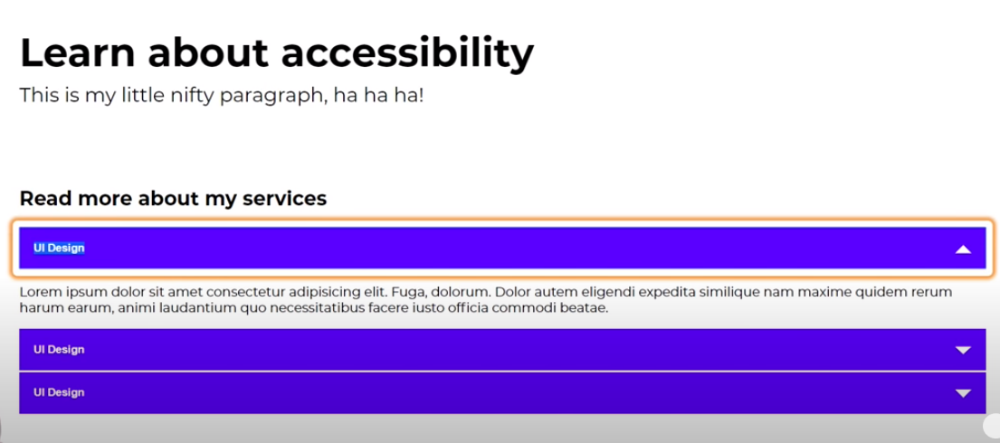
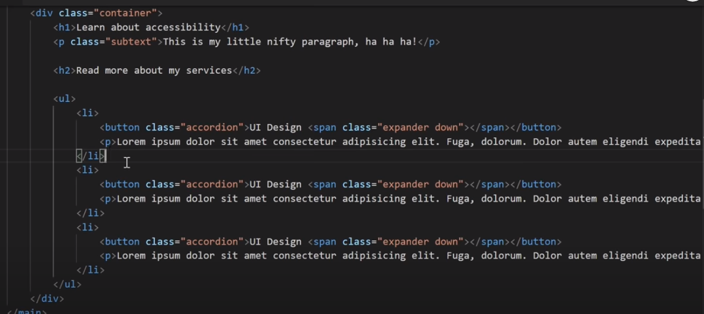
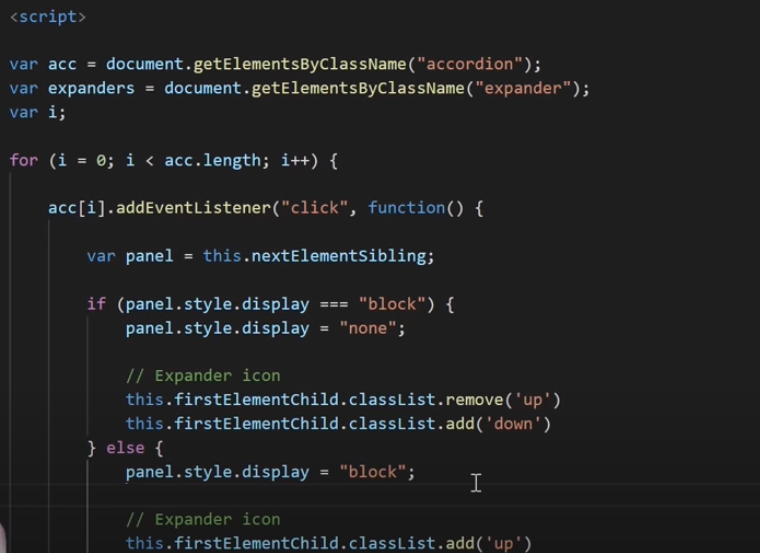
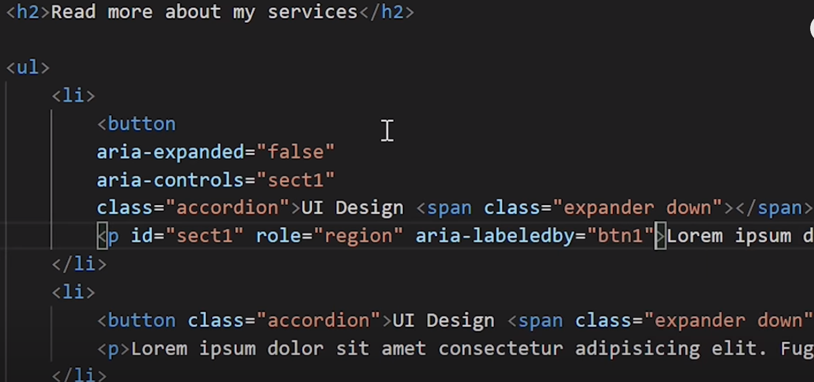
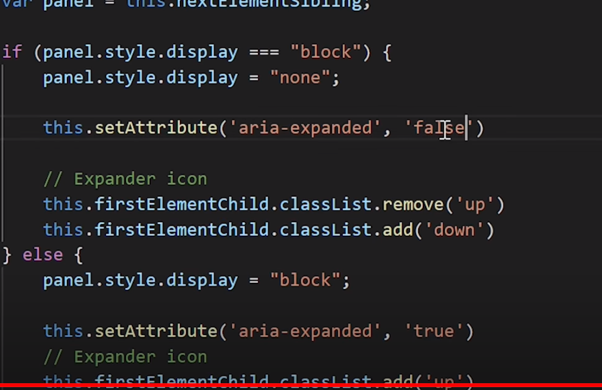

### ARIA 
ARIA is a W3C specification that stands for “Accessible Rich Internet Applications”. It consists of markup that can be added to HTML to make the content accesable for the visually impaired.


> We add ARIA labels so the visually impaired can navigate through our website via screen readers 

> This is the snippet of code for this website without ARIA implementations 



> Adding ARIA 

```bash 
aria-expanded='false' 
# means that the accordian is closed 
# in order for the screen reader to read the lines of code when accordian is opened, we need to toggle this value to true which is done through JS in the script below 

aria-controls='sect1'
# this aria tag applied on button is targetting the p tag with #sect1 id 

aria-labelled-by='btn1'
# this is added on the p tag, its a way od linking p tag with the unique btn it is linked with 
```

```bash 
when the display is block, i.e the accordian is opened
and user clicks on this opened accordian, then we need to toggle to close it 
so we add display:none and toggle the aria-expanded to `false`

# else
When display is none, toggle the aria-expanded to `true`
```
### CSS Tags 
<li> tag defines a list item 

- ordered list
```bash
<ol type="✅">
    <li> </li>
    <li> </li>
</ol>

✅ol properties:
1. <ol type="A">
2. <ol type="i">
3. <ol start="10">
4. <ol start="10" reversed>
```
- unordered list
```bash
<ul>
    <li> </li>
    <li> </li>
</ul>
```

2. audio tag 
```bash
- mp3 (supported by all search engines )
{IE, chrome, firefox, safari, opera}

- wavv
{doesnt support on IE}

- ogg 
{doesnt support IE / safari}
```

### Attributes for audio tag
- controls (controls shows the audio player on the web page)
```bash 
    <audio controls>
      <source src="mp.mp3" type="audio/mp3" />
    </audio>
```
- autoplay
```bash 
    <audio controls autoplay>
      <source src="mp.mp3" type="audio/mp3" />
    </audio>
```

- loop (audio played in loop)
```bash 
    <audio controls loop>
      <source src="mp.mp3" type="audio/mp3" />
    </audio>
```
- muted (audio played in mute)
```bash 
    <audio controls muted>
      <source src="mp.mp3" type="audio/mp3" />
    </audio>
```

- preload
```bash 
    <audio controls preload="✅" > 
      <source src="mp.mp3" type="audio/mp3" />
    </audio>

✅Preload properties:
1. auto (automatically loads the audio file with extra controls)
2. none (loads the audio file with extra contents only when clicked on play)
2. metadata (browser imports data of the audio file, before importing the audio file )
```
2. Height VS Line-height 
> In line height, the text is alligned in the center and their is equal spaces  
from both bottom and top 

> In case of height, the text remains on top 
