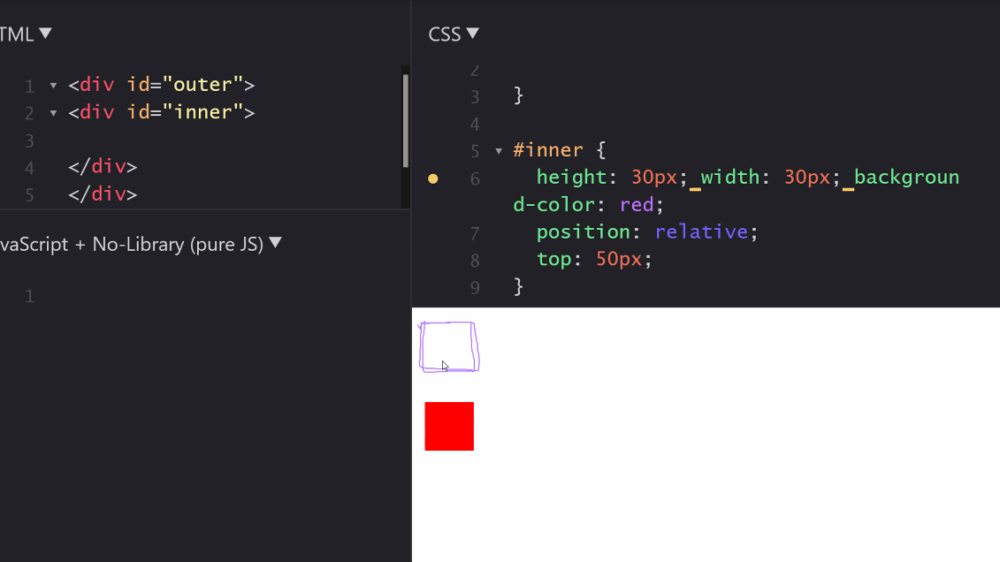

### Interview Prep 
1. What is HTML
Its not a programming language. Its a markup language which is used to structure any data. Most commonly used as a skeleton of a webpage. 

2. What is a markup language?
Markup language is a way (set of rules) used to oranize and structure the data/ content. It is made up of various elements containing the data.Language to present content. 
> eg: HTML, XML, XHTML, LaTex (TeX), SGML.

```bash
Note:
CSS is a style sheet language - we have selectors in this 
HTML is a markup language - we have tags 
```
3. Why is HTML not a programming language?
Because it doesnt have any logic. Programming language are supposed to solve a problem, they should have a programming architecture; a logic.
```bash 
all programming and markup languages are converted to machine code 
```
4. What are tags?
Tag is a way to format/structure and display the document/data/content. Anything inside angular brackets 
```bash 
<a>, <button>, <p>
```
5. What are elements and how are they different from tags?
Any tag with content inside it is an HTML element.
> Opening tag + content + closing tag = element 
```bash 
# this div alone is a tag
# everything inside these tags along with the attribute is called an element 
<div> 

<p>lorem ipsum</p>
</div>
```
> Simpler example of element 
```bash 
# p is opening tag 
# p is closing tag 
# opening tag + content + closing tag = element 
<p>this is a sample text</p>
```
6. What is an opening and closing tag?
Opening tag marks the beginning of any HTML element. Closing tag marks closing/ end of the element. 

7. What are HTML entities?
HTML entities are used to show reserved characters of HTML language. Starts with & symbol followed by code and ends with semicolon. 
```bash 
# These are reserved characters 
<> / & <spaces>

# HTML entities
&nbsp; 
&lt;
&gt;
&copy;
&emsp;
```
8. What are attributes?
These are supplementary properties which are in key value format written in opening tag of an element. They are used to give additional features (looks/ functionality) to any HTML element.
```bash
Used with tags. Key value pairs used in opening tags. Piece of code used to add extra info about the tag. Value is optional.
```
> All elements doesnt support all attributes 
```bash 
- input type=text attribute doesnt make any sense if you use it on a button
- autoplay attribute of audio tag makes no sense when used with p tag 
```
> Value in attribute(key-value pair) is optional.
```bash 
<input required />
```
9. Is class and id an attribute?
yes, 
> why?
attribute selectors [type='text']. Attribute selectors are written in key-value format, this proves that class and id are attributes.
```bash 
    <style>
        [id='special']{
            color: red;
        }
    </style>
</head>
<body>
    <p id="special">something</p>
</body>
```
10. Which has higher priorty?
```bash 
    <style>
        [id='special']{
            color: red;
        }

        #special {
            color:green;
        }
    </style>
</head>
<body>
    <p id="special">something</p>
</body>
```
> ID selector has higher specificity than the attribute selector

11. What is CSS?
Stylesheet language which is used to design markup languages any webpage/website). It describes how any element should be rendered on the viewport of the screen. It can control layout of multiple webpages. 

> Examples of stylessheet languages: CSS, SaaS, SCSS, LESS, Stylus, XSL, PostCSS, Qt 

A single CSS file can be reused to give style to multiple webpages.

12. What is the difference between a website / web application and webpage?
A webpage is a single page whereas a website is a collection of webpages. 
```bash 
websites are web 1.0 - used to display information 
eg: news website 

web app are web 2.0 - you can even upload your own content in this 
eg: fb 
```
13. What are the different selectors in CSS? 
- simple selectors 
```bash 
        -universal          *           selects all elements on the page 
        -type               div         selects all elements with specific type
        -class              .classname  selects all elements with same classname
        -id                 #idname     selects the element with the unique identifier 
```
- combinator 
combination of two selectors in a relationship 
```bash 
# note that 'or' and 'and' are grouping selectors 
        -or                 div,a        selects both elements 
        -and                div.class    selects specific element 
        -descendant         div a        selects all under div 
        -direct child       div>a        selects only the direct child 
        -general sibling    li.red~li    selects all under li, after li.red
        -adjacent sibling   li.red + li  selects only one sibling after li.red
```
- psuedo class selectors 
```bash 
pseudo classes
    used to style element based on how user interacts on the page
         1. state    
            -visited        link that is visited
            -hover          when an element is hovered 
            -focus          when you click on an element it adds property
            -required       adds styling on required property 
            -checked        adds styling on checkbox 
            -disabled       adds styling on checkbox with disabled property
        1. position
            -first-child       styles firstchild of the parent only 
            -last-child        styles lastchild of the parent only 
            -nth-child(2n)     styles child from 2nd position 
            -nth-last-child(3) styles only 3rd child 
            -only-child        styles container which has only one child 
            -first-of-type     styles firstchild of a parent which has same type throughout 
            -last-of-type      styles lastchild of a parent which has same type throughout 
            -nth-of-type(2n)   styles children at 2n interval 
            -nth-last-of-type(2)styles the 2nd last
            -only-of-type       styles container which has only one child, but parent and children are of the same type 
            -not                styles all elements except the one with the not 
```
- psuedo-element selectors 
```bash 
             first-letter      styles first letter of the page 
             first-line        styles first line of the page 
             ::before          insert content before the element 
             ::after           insert content after the element 
             ::marker          selects the marker of elements 
```
- attrbiute selectors 
```bash 
           CSS [attribute] Selector           selects elements with specific attribute 
           CSS [attribute|="value"] Selector  select elements with specific attribute and value 
           CSS [attribute^="value"] Selector  styles elements starting with same value 
           CSS [attribute$="value"] Selector  styles elements ending with same value
           CSS [attribute*="value"] Selector  styles elements containing same value
```
14. Difference between psuedo classes and psuedo elements?
- psuedo classes use : , change style of the entire element 
- psuedo elements use ::, change style of a part of the element 

15. Why are they called psuedo?
Because psuedo elements do not have anything of its own, it always needs a base selector to depend on using either : or :: 

16. Explain box modal?
```bash 
margin 
  border 
    padding 
      content
```
In a document, there are elements. For every element there is a rectangular box rendered by the browser. This box can have 4 major parts:
1. content 
2. padding - space inside the element 
3. margin - space outside the element 
4. border - border of the element 

17. What are the ways in which we can write padding and margin?
```bash 
# single value 
margin: 2px;

# double value 
# top/bottom:2px left/right:3px
margin: 2px 3px; 

# 4 values 
margin: 3px 4px 5px 6px;
# top right bottom left 
```
18. What are the different ways to position an element?
```bash
absolute - relative to its nearest positioned ancestor 
relative - the div moves relative to its iniital position
sticky 
fixed 
intitial
static (default position of rendering as decided by the browser (user agent))
```


### For UI
> 
CSS Diner - `flukeout.github.io`

### CSS Diner 


