### JS Interview Prep 
- What happens when user enters URL in the search bar 

#### Client-server model 
- the person who makes URL request to the browser is called the client. Browser makes request to web server of facebook and the server processes requests and gives the response 

> Navigate to networks tab
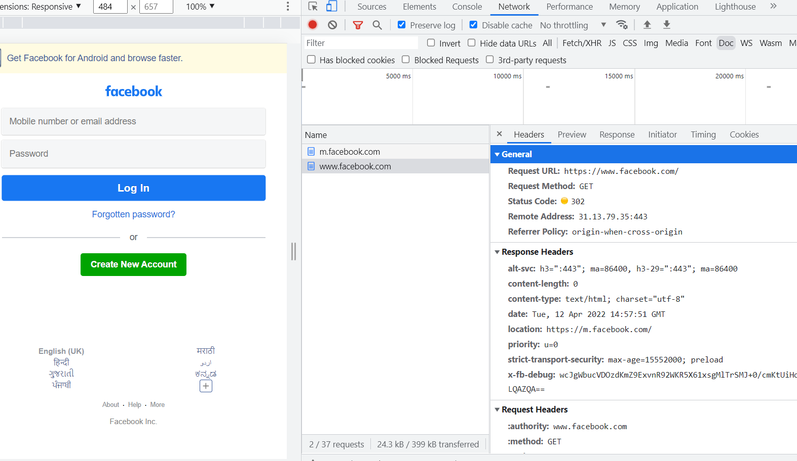
The response is in a html response 
```bash 
content-type:text/html
```
> every web server has an IP adress (Internet protocol)which can be anywhere between 0.0.0.0 and 255.255.255.255
- Everybody with a unique connection has a unique IP address, ISP provides IP address.

> Whenever you hit any URL in the browser, browser parses the URL to return some properties of the URL like 
- protocol name `http/ https/ http2`
- domain 
- port no (http:80 / https:443)

#### DNS Lookup 
> When we enter URL in browser, first the URL is searched up in `browser cache` if its not found over here, then it looks up in `os cache`, if it doesnt find there, it looks up in `isp cache`

1. Browser cache - previosly opened in browser 
Browser has a `browser cache` (temporary memory) which saves its IP address we open in the browser 
```bash
Cookies are stored in browser memory
logged in earlier get their session ID, it stores until it expires or we can set it 

Browser cache is also stored in the browser memory
However it gets erased after some time on its own terms 
```
2. OS cache - previosly opened in different browsers in the same computer 
3. Router used to connect multiple devices to the internet through a public IP address
- Router also has a cache 
4. ISP cache 
contain cache which ahve all domain names of IP address and domain names.

> IP resolution
DNS lookup - server which has mapping of all domain names and its IP address.
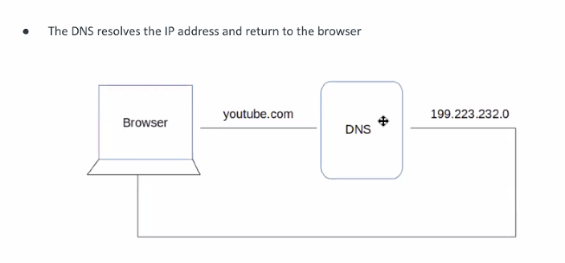

### TCP / IP connection 
As soon as the client calls the server, this connectio  is established. 

> Before request-response we want to know if the connection is established. 
```bash 
# client asks server  can you hear me - message 
client  ------------   server 
# server replied to client qs and asks can you hear me -acknowledgement to the first message + asks new message 
# client responds yes i can hear you - sends acknowledgement 
```
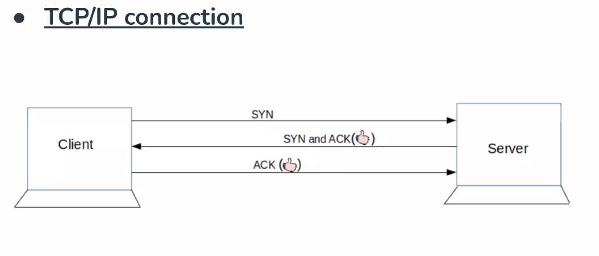
> 3 way handshake method 
- clients sends synchronous message (SYN)
- server sends syncronous message (SYN) + acknowledgment (ACK)
- client gives an acknowledgment (ACK)

```bash 
The TCP connection is acheived using TCP protocol.
TCP stands for Transmission Control Protocol a communications standard that enables application programs and computing devices to exchange messages over a network.
```
> Once server has responded with HTML response. How does the browser understand with this html response it has to draw the webpage. 
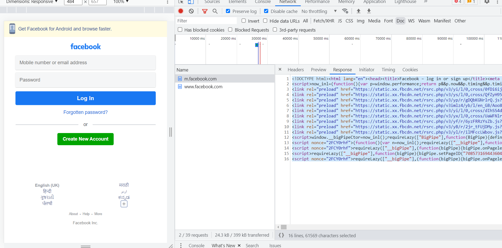

### Critical rendering path 
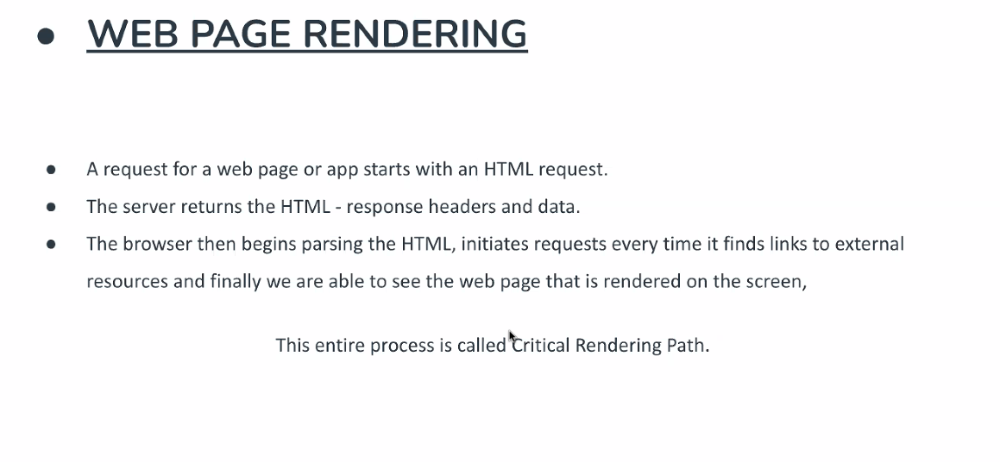
- When browser got HTML response from server 
- Browser parses the HTML and create a specific DOM tree for the HTML in the background 

`If critical rendering path takes alot of time, this means website will be very slow. `

> Testing Tip 💡: Google lighthouse audits your webpage, it specifies your website speed. 
```bash 
How to reduce amount of data loading on webpage / how to make website faster?
- lazy loading
- Using bundling/minification tools for JS, CSS  resources like  Gulp, Grunt, Webpack
- Using a CDN
- Using gZip Compression, and sending compressed HTML/UI resources from server.
- design in a way it only reads the current page 
# Browser can read either only your current page, or the entire application based on how its designed.
Server side rendering of DOM
Using Virtual scrolling / virtualized list
```
The entire task that browser does in the background once its recieved from the server is called critical rendering.

### Critical rendering path
Browser is single-threaded. A single process is completed at a single time.
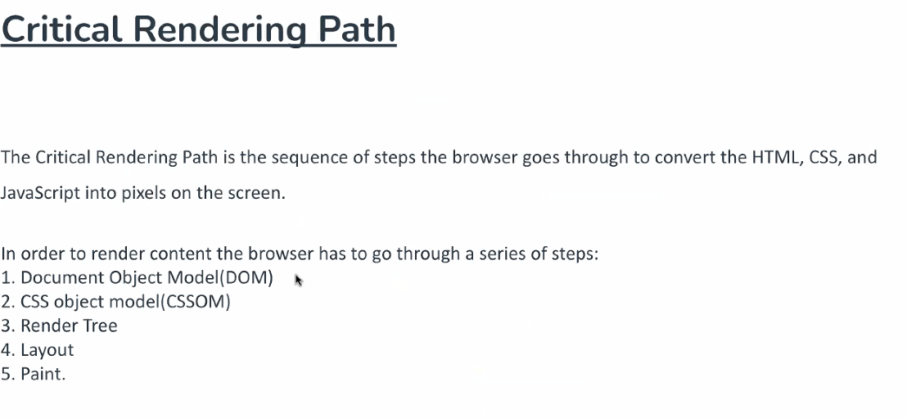

1. Lets assume this is the HTML response from the server
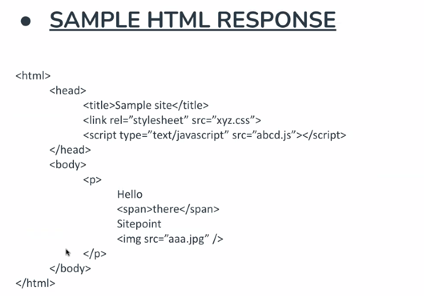
2. Browser will parse the HTML, takes every node in this response and creates it in the form of DOM tree (way in which your HTML is structured). 
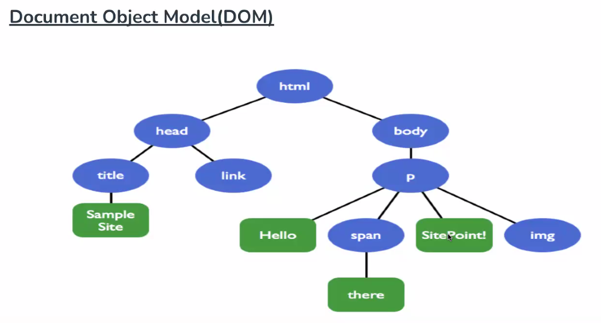
3. CSS-OM is similar to DOM it contains all the elements along with its visible elements along with its style. (however it doesnt contain hidden elements)
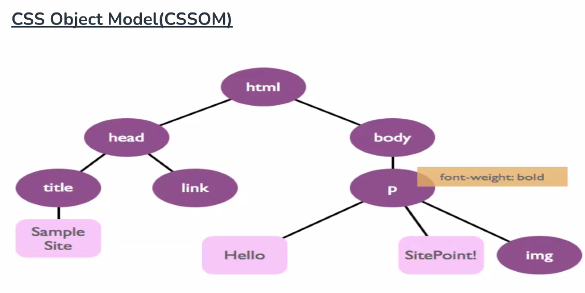

> We want hidden elements to show up + styling - browser merges DOM tree and CSSOM tree to create the final rendered tree. 

4. Layout 
Browser calculates size and position of each element on the page. Every time an update to the render tree is made, or the size of the viewport changes, the browser has to run layout again
5. Painting 
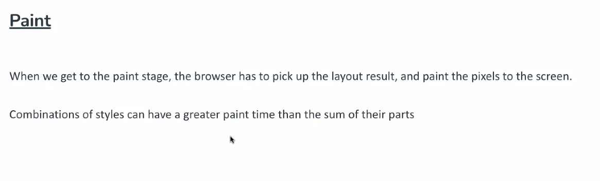

> Summary:
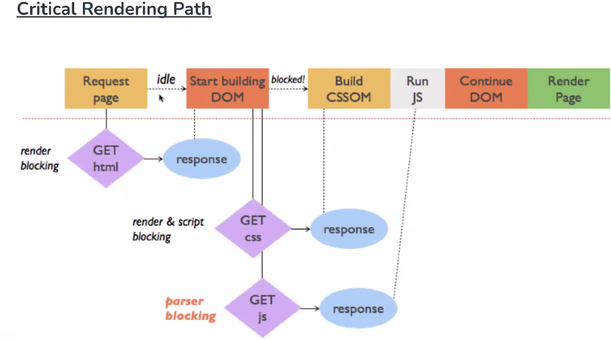


### BOM 
The Browser Object Model (BOM) in JavaScript includes the properties and methods for JavaScript to interact with the web browser. BOM provides you with a window objects, for example, to show the width and height of the window. It also includes the window. screen object to show the width and height of the screen.

Change HTML DOM with JS is possible because of BOM. Through BOM we can access the HTML DOM and CRUD new elements. 

> Data Types:
- boolean - true / false 
- number - (contains both integer and float values)
- string - written inside double quotes 
```bash 
var x = typeof 123;  //"number" 
# output of typeof is always a string datatype 
console.log(x)       //number is a string 
console.log(typeof x)//string
```
- null
- undefined - `console.log(typeof abcd)`
- object 
```bash 
# array is a special kind of object in JS 
console.log(typeof [])   //object 
console.log(typeof null) //object 
console.log(typeof {} )  //object 
```
- typeof (shows datatype of any element)
```bash 
console.log(typeof typeof 123); //string
# typeof "number"
# string 
```
### What is EcmaScript?
Ecmascript is a standard organisation which every browser has to follow for JS standards.
Basically they laid out the rules for what JS it needs to follow. 

- let and const were released in ES6.
- var and let can be redeclared 

### var has functional scope, let and const have block level scope. 
> function vs block level scope 
```bash 
# var has function level scoped. available throughout the whole scope.
function main(){
    var x = 20;
    # var x
    # var name 
    # x=20
    if(x==20){
        # name = 'vikas'
        var name='vikas';
    }
    console.log(name)
}

console:
vikas
```
```bash
function main(){
    var x;
    var name;
    x = 20; 

    if(x==20){
      name='vikas';
    }
    console.log(name)
}

console:
undefined 
```
```bash 
function main(){
    let x = 20;
    # let has block level scoped. only available in between these brackets 
    if(x==20){
        let name='vikas';
    }
    console.log(name)
}

console:
undefined
```
### Hoisting
Hoisting is JavaScript's default behavior of moving declarations to the top.

#### var hoisting 
```bash 
var x =20;

function main(){
    # var can be accessed using temporal dead zone, it stil gives undefined. Doesnt give errors.
    console.log(x)  //undefined 
    var x = 10;
    console.log(x)  //10
}
main()
```
> behind the scenes, this happens 
```bash 
var x =20;

function main(){
    var x;          //var is defined not declared
    console.log(x)  //undefined 
    x = 10;
    console.log(x)  //10
}
main()
```
#### let and const hoisting
Variables declared with let and const are also hoisted but, unlike var , are not initialized with a default value. An exception will be thrown if a variable declared with let or const is read before it is initialized.

> However, in case of let and const it gives a reference error, that it cannot be accessed before initialization. It goes into TDZ, thats why it looks like it doesnt support hoisting when in reality it does. 
```bash 
var x =20;

function main(){
    console.log(x) 
    let x = 10;
    console.log(x)  
}
main()

console:
Reference error 
```
> in the same scope, var can be redeclared, but let, const cannot.
```bash 
var x =20;
function main(){
    var x = 20;
    var x = 10;
    console.log(x)  //10
}
main()
```
> another example,
```bash 
var x =20;
function main(){
    console.log(x)  //undefined 
    x = 10;
    console.log(x)  //10
}
main()
```


