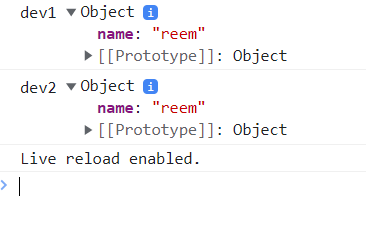
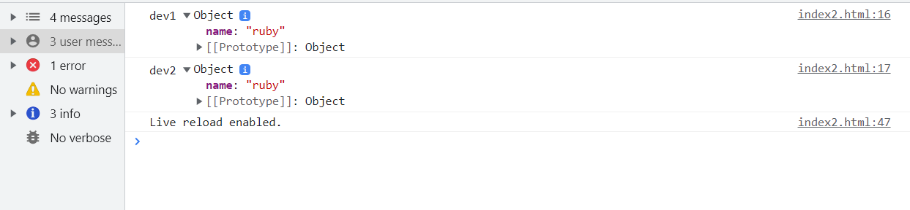
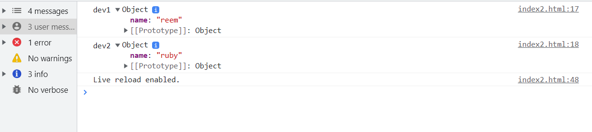
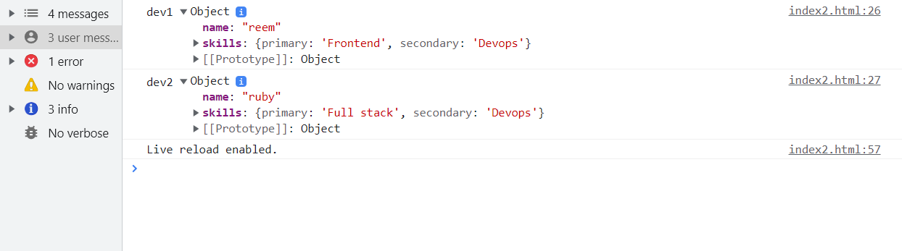
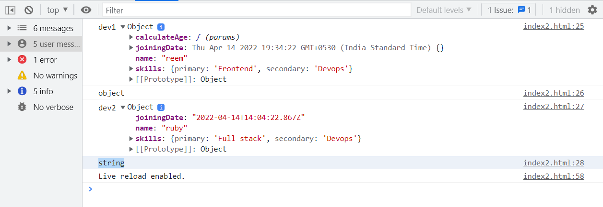

### Deep copy vs Shallow copy 
#### Shallow copy 
```bash 
    <script>
        let dev1 = {name: 'reem'}
        # dev2 has a copy of address of dev1, objects are pass by reference 
        let dev2 = dev1

        console.log('dev1',dev1)
        console.log('dev2',dev2)
    </script>
```


> When were changing the name of dev2 the name of dev1 is also changed
```bash 
    <script>
        let dev1 = {name: 'reem'}
        # dev2 has a copy of address of dev1, objects are pass by reference 
        let dev2 = dev1 
        dev2.name = 'ruby'

        console.log('dev1',dev1)
        console.log('dev2',dev2)
    </script>
```


### Deep copy 
#### Try these solutions for normal objects 
1. using Object.assign
```bash 
    <script>
        let dev1 = {name: 'reem'}
        #let dev2 = dev1 
        let dev2 = Object.assign({}, dev1)
        # we intiialized an empty object for dev1, so when we run the code dev1 doesnt overwrite dev2
        dev2.name = 'ruby'

        console.log('dev1',dev1)
        console.log('dev2',dev2)
    </script>
```


2. using ES6 operator 
```bash 
    <script>
        let dev1 = {name: 'reem'}
        #let dev2 = dev1 
        let dev2 = { ...dev1 }
        # we can also use ES6 spread operator to acheive the same 
        dev2.name = 'ruby'

        console.log('dev1',dev1)
        console.log('dev2',dev2)
    </script>
```


#### Try this solution for nested objects 
```bash 
    <script>
        let dev1 = {
            name: 'reem', 
            # nested objects 
            skills: {primary: 'Frontend', secondary: 'Devops'}
        }

        # stringifying dev1(JS object) into JSON string 
        # parsing JSON string and creating a new JS object 

        # we do this 2 step breaking process because we first want to break the contents and extract individual objects by structuring and placing them inside JSON string
        # second we parse the Json string to a JS object
        let dev2 = JSON.parse(JSON.stringify(dev1))
        dev2.name = 'ruby'
        dev2.skills.primary = 'Full stack'

        console.log('dev1',dev1)
        console.log('dev2',dev2)
    </script>
```


#### Try this solution for function as an object 
> Before we jump into the solution, lets first understand what problem were facing
```bash 
    <script>
        let dev1 = {
            name: 'reem', 
            // nested objects 
            skills: {primary: 'Frontend', secondary: 'Devops'},
            calculateAge: function (params){
                return 20
            },
            joiningDate: new Date()
        }

        let dev2 = JSON.parse(JSON.stringify(dev1))
        dev2.name = 'ruby'
        dev2.skills.primary = 'Full stack'

        console.log('dev1',dev1)
        console.log(typeof(dev1.joiningDate))  //object 
        console.log('dev2',dev2)
        console.log(typeof(dev2.joiningDate))  //string
        # we want dev2.joiningDate to be an object, however JSON.parse method is not doing a proper deep copy for function objects 
    </script>
```


> To acheive a proper deep copy in case of function objects (which is not possible in case of vanilla js) so were downloading lodash via terminal:
`npm i lodash` a third party library which contains helper functions that will help us acheive a proper deep copy 
```bash 
 <script>
        const _ = require('lodash');
        let dev1 = {
            name: 'reem', 
            // nested objects 
            skills: {primary: 'Frontend', secondary: 'Devops'},
            calculateAge: function (params){
                return 20
            },
            joiningDate: new Date()
        }

        let dev2 = _.cloneDeep(dev1)
        dev2.name = 'ruby'
        dev2.skills.primary = 'Full stack'

        console.log('dev1',dev1)
        console.log(typeof(dev1.joiningDate)) 
        console.log('dev2',dev2)
        console.log(typeof(dev2.joiningDate))  
    </script>
```
`resolve doubt: index2.html:11 Uncaught ReferenceError: require is not defined`


