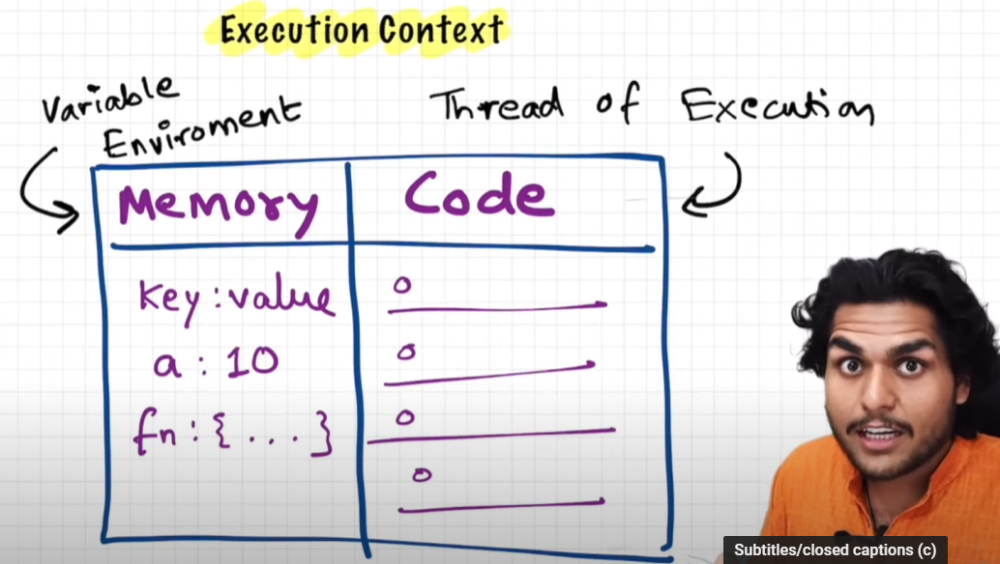
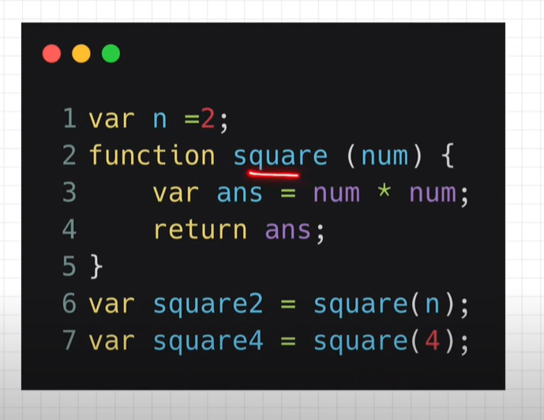
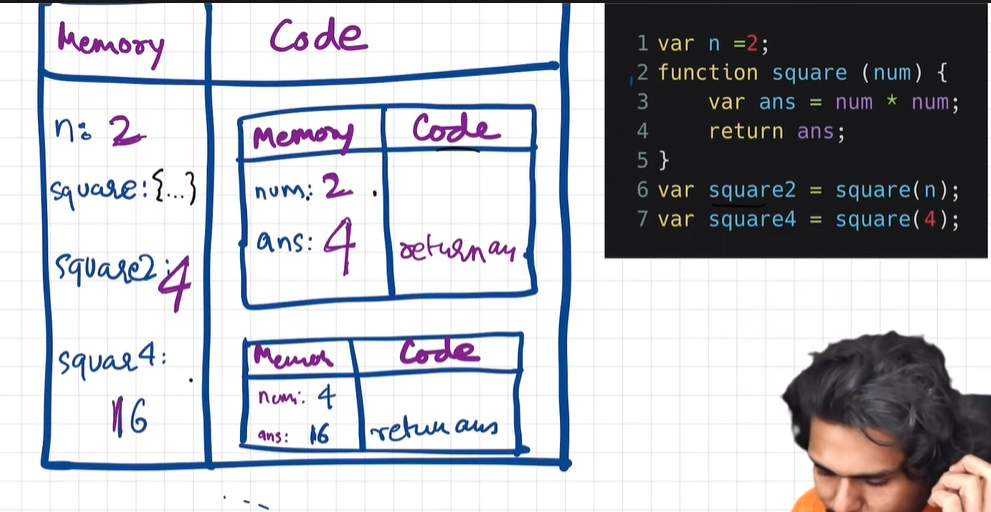
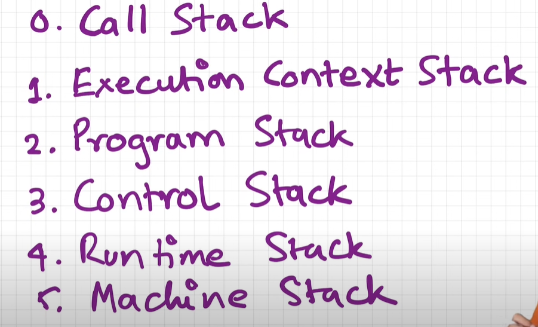
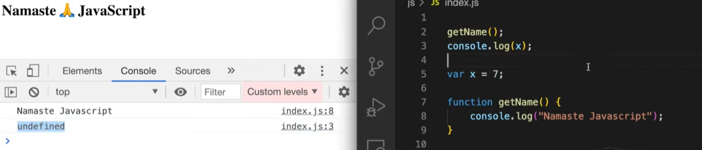
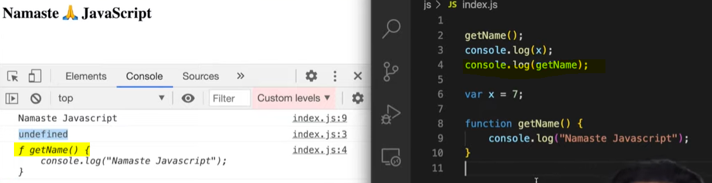
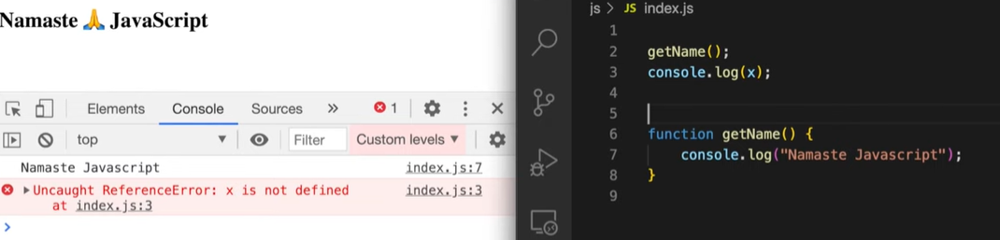

### How JS works?
> execution context 
Everything in JS happens inside the execution context (container inside where entire JS function is executed)

components of execution context:

1. memory / variable environment- variables / functions stored as key value pairs (environemt in which all variables and functions are stored as the execution context)
2. Code component / thread of execution - All the code is executed inside this component. 
```bash 
all logic inside the function will be executed in the code component 
```
### JS is a synchronous, single threaded language 
- single-threaded - execute one command at a time 
- synchronous, single threaded - execute one command at a time in a particular sequence. 

### What happens when you run a JS program 
> an execution context is created 


When you run a JS program, a global execution cotext is created. 

> execution context is created in 2 phases 
1. memory creation phase - allocate memory to all variables and functions 
even before you run the program, JS skims through your program and allocated initial memory values, which is later updated.
```bash 
# JS goes through the code line by line to allocate memory to variables and functions
var n = 2;
# allocated a special value undefined to n in memory
function square(num){
    var ans = num * num
    return ans 
}
# the entire function code of square is stored inside the memory 

var square2 = square(n)
# allocates undefined to square2
var square4 = square(4)
# allocates undefined to square4
```
2. code execution phase 
```bash 
# JS runs though code line by line and creates logic for the code 
var n = 2;
# n is replaced from undefined to 2 
function square(num){ //num is parameter 
    var ans = num * num
    return ans 
}

var square2 = square(n) //n is argument 
# a new execution context is created for executing the square function
var square4 = square(4)
```
> execution context for the square2 variable which runs the square function 
```bash 
function square(num) { 
    var ans = num * num
    return ans 
}
```
> initially, while allocating initial memory 
```bash 
memory         |     code 
num: undefined |  
ans: undefined |
```
> after, when code component is executed 
```bash 
memory         |    code 
num: 2         |    num x num (2x2)
# after logic calculations, ans will be updated 
ans: 4
```
> when pointer reaches return ans 
```bash 
function square(num) { 
    var ans = num * num
    # return ans means return execution context control back to the place where function was invoked and square2 variable will be replaced from undefined to 4 
    # this execution context will be deleted 
    return ans 
}
```
> Similary an execution context for the square4 variable which runs the square function will be created, initially both values will be undefined, when the code component is executed, its assigned value from the program 
```bash 
memory      |    code 
num: 4      |    num x num 
# after logic calculations, ans will be updated 
ans: 16
```
after assigning the updated to the memory (square4: undefined), this execution context will be deleted.


> After program is executed, the whole Global execution context is deleted. 

### JS manages multiple execution contexts, one inside the other through Call stack
> Call stack - contains a Global execution context 
```bash
Whenever JS program is run, call stack is populated with execution context of the program 
# when exection context is created its pushed inside the stack 
# when execution context is deleted its pushed outside the stack 
# when program is executed, the call stack GEC is destroyed 
```
### Call stack 
call stack maintains the order of execution of execution contexts. 

> other names for call stack 


### Hoisting 
Phenomena where you can access variables and functions even before you have initialized it.

```bash 
x shows undefined because it was not given a value, when we console logged it, it was only assigned a value later on in the code 

    <script>
        getName()
        // we are trying to access x even before we have initialized it
        # we know that intiially when js skims through our code, it initialises undefined to our variables 
        console.log(x)

        var x = 7
        function getName() {
            console.log('namaste js')
        }
    </script>

console:
undefined 
namaste js
```

> the intiial mememory allocation of the normal function is the function itself and not undefined 
```bash 
    <script>
        console.log(getName)
        console.log(x)

        var x = 7
       function getName(){
            console.log('namaste js')
        }
    </script>

console:
ƒ getName(){
            console.log('namaste js')
        }

VM95 index.html:12 undefined
```
- when we define an arrow function instead of a normal function
```bash 
    <script>
        getName()
        console.log(x)

       var x = 7
       var getName =() =>{
            console.log('namaste js')
        }
    </script>

console:
index.html:11 Uncaught TypeError: getName is not a function
at index.html:11:9

# the reason were getting this error is because over here getName() is acting like how a variable acts on memory allocation 
# initially memory allocated to variables is undefined, similarly, arrow function getName() also gets the undefined value initially; thats why its showing the error message getName is not a function
```
> arrow function getName() acts like a variable 
```bash 
    <script>
        # getName acts like a variable in the memory
        # thats why it prints undefined becausse initially js skims through the program before assigning a value 
        # it assigns undefined value to getName and x
        # when it runs through the code it hasnt yet encountered the defination of these values since its consoled before its assigned a value 
        console.log(getName)
        console.log(x)

       var x = 7
       var getName = () => {
            console.log('namaste js')
        }
    </script>

console:
undefined
undefined
```
- when we define a function in this format 
```bash 
    <script>
        getName()
        console.log(x)

        var x = 7
        # getName over here acts just like a variable 
       var getName = function() {
            console.log('namaste js')
        }
    </script>

console:
index.html:11 Uncaught TypeError: getName is not a function
at index.html:11:9
```

> How is `undefined` different from `not defined`?

```bash 
    <script>
       console.log(x)
       function getName(){
            console.log('namaste js')
        }
    </script>
console:
Uncaught ReferenceError: x is not defined
# reference X is not defined means that x was no where to be found in the memory 
```
- undefined essentially means the value is declared (var x) not defined (var x = something)
- after we write our program and before exection i.e before we run it, JS skims through our program and assigns an initial value to the variables and functions which is undefined.  


- not defined means we have not even declared (var x) the variable and were trying to console it. 
- so when JS skims through our program and it finds no variable as x in this case, it assigns no value to that particular variable, because it doesnt even exist in the codebase to start with.

#### How function invokation behaves behind the scenes?


